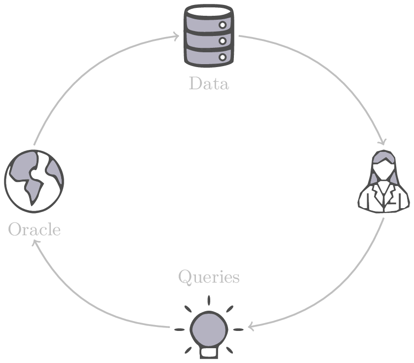
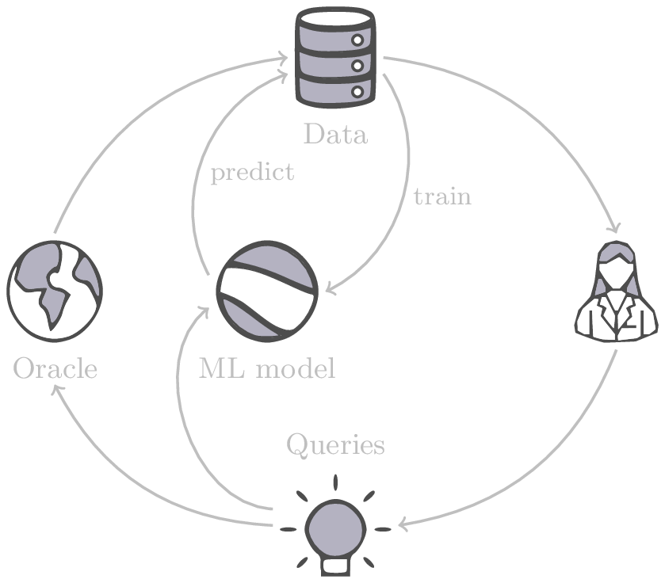
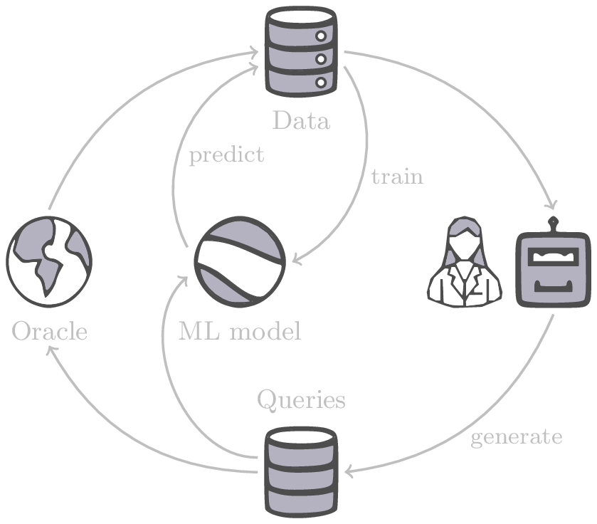

name: canada-korea-biotech-jul25
class: title, middle

### Generative and active machine learning for scientific discovery

Alex Hernández-García (he/il/él)

.turquoise[Canada-Korea Conference on Science and Technology · Montreal · July 30th 2025]

.center[

&nbsp&nbsp&nbsp&nbsp

]

.center[

&nbsp&nbsp&nbsp&nbsp

]

.smaller[.footer[
Slides: [alexhernandezgarcia.github.io/slides/{{ name }}](https://alexhernandezgarcia.github.io/slides/{{ name }})
]]

.qrcode[]

---

count: false
name: title
class: title, middle

### Why scientific discoveries?

.center[]

---

## Why scientific discoveries?

.context[Climate change is a major challenge for humanity.]

  

.center[
<figure>
	
  <figcaption>.smaller[Observed (1900–2020) and projected (2021–2100) changes in global surface temperature relative to 1850–1900 (adapted from: <a href="https://www.ipcc.ch/report/sixth-assessment-report-cycle/">IPCC Sixth Assessment Report</a>)]</figcaption>
</figure>
]

.conclusion["The evidence is clear: the time for action is now." .smaller[IPCC Report, 2022]]

---

## Why scientific discoveries?

.context[Climate change is a major challenge for humanity.]

.center[
<figure>
	
  <figcaption>.smaller[Climate-sensitive health risks (adapted from: <a href="https://www.who.int/news-room/fact-sheets/detail/climate-change-and-health">World Health Organization</a>)]</figcaption>
</figure>
]

.smaller[
* Environmental factors take the lives of around 13 million people _per year_.
* Climate change affects people’s mental and physical health, access to clean air, safe water, food and health care.
]

.full-width[
.conclusion["Climate change is the single biggest health threat facing humanity." .smaller[[WHO and WMO](https://climahealth.info/), 2024]]
]

---

## Why scientific discoveries?
### The potential of materials discovery

.context["The time for action is now"]

--

> "Limiting global warming will require major transitions in the energy sector. This will involve a substantial reduction in fossil fuel use, widespread electrification, .highlight1[improved energy efficiency, and use of alternative fuels (such as hydrogen)]." .cite[IPCC Sixth Assessment Report, 2022]

> "Reducing industry emissions will entail coordinated action throughout value chains to promote all mitigation options, including demand management, .highlight1[energy and materials efficiency, circular material flows]." .cite[IPCC Sixth Assessment Report, 2022]

--

 

.conclusion[Mitigation of the climate crisis requires innovation in the materials sector.]

???

Antimicrobial resistance

- https://www.who.int/news-room/fact-sheets/detail/antimicrobial-resistance
- https://www.who.int/news-room/feature-stories/detail/donors-making-a-difference--climate-change-and-its-impact-on-health
- https://www.who.int/news/item/31-10-2022-who-and-wmo-launch-a-new-knowledge-platform-for-climate-and-health
- https://www.who.int/news/item/08-02-2024-who-medically-important-antimicrobial-list-2024
- https://cdn.who.int/media/docs/default-source/gcp/who-mia-list-2024-lv.pdf?sfvrsn=3320dd3d_2
- https://www.who.int/publications/i/item/9789240047655

---

## Why scientific discoveries?
### The potential of drug discovery

.context[Drug discovery and vaccine development play a crucial role in modern healthcare systems.]

.right-column-33[
.center[]
]

---

count: false

## Why scientific discoveries?
### The potential of drug discovery

.context[Drug discovery and vaccine development play a crucial role in modern healthcare systems.]

.right-column-33[
.center[]
]

.left-column-66[
.highlight1[Bacterial antimicrobial resistance] contributed to 4.95 million deaths in 2019. .cite[World Health Organisation (WHO), 2023]

WHO's latest annual review identified 27 antibiotics in clinical development that address WHO bacterial priority pathogens, of which .highlight1[only 6 were classified as innovative].

"The recently approved antibacterial agents are .highlight1[insufficient to tackle the challenge] of increasing emergence and spread of antimicrobial resistance". .cite[World Health Organisation (WHO), 2021]
]

---

count: false

## Why scientific discoveries?
### The potential of drug discovery

.context[Drug discovery and vaccine development play a crucial role in modern healthcare systems.]

.right-column-33[
.center[
<figure>
	
  <figcaption><small>"No time to wait". Source: <a href="https://www.who.int/docs/default-source/documents/no-time-to-wait-securing-the-future-from-drug-resistant-infections-en.pdf">WHO</a>.</small></figcaption>
</figure>
]
]

.left-column-66[
.highlight1[Bacterial antimicrobial resistance] contributed to 4.95 million deaths in 2019. .cite[World Health Organisation (WHO), 2023]

WHO's latest annual review identified 27 antibiotics in clinical development that address WHO bacterial priority pathogens, of which .highlight1[only 6 were classified as innovative].

"The recently approved antibacterial agents are .highlight1[insufficient to tackle the challenge] of increasing emergence and spread of antimicrobial resistance". .cite[World Health Organisation (WHO), 2021]   
]

.full-width[
.conclusion["No time to wait". Alongside other necessary actions, drug discovery plays a key role in tackling the antimicrobial resistance global threat.]
]

---

## Machine Learning for Science

.center[]

.conclusion[Machine learning research has the potential to facilitate scientific discoveries to tackle climate and health challenges.]

---

count: false

## Machine Learning for Science and Science for Machine Learning

.center[]

.conclusion[Machine learning research has the potential to facilitate scientific discoveries to tackle climate and health challenges. Scientific challenges stimulate in turn machine learning research.]

---

exclude: true

## Outline

--

- [Introduction: Generative and active learning for scientific discoveries](#mlforscience)

--
- [Gentle introduction to GFlowNets](#gflownets)

--
- [Multi-fidelity active learning](#mfal)

---

count: false
name: mlforscience
class: title, middle

### **Generative** and **active** learning for scientific discoveries

.center[]

---

## Traditional discovery cycle

.context35[The climate crisis demands accelerating scientific discoveries.]

--

.right-column-66[ .center[]]

.left-column-33[
 
The .highlight1[traditional pipeline] for scientific discovery:
* relies on .highlight1[highly specialised human expertise],
* it is .highlight1[time-consuming] and
* .highlight1[financially and computationally expensive].
]

---

count: false

## _Active_ machine learning

.context35[The traditional scientific discovery loop is too slow for certain applications.]

.right-column-66[ .center[]]

.left-column-33[
 
A .highlight1[machine learning model] can be:
* trained with data from _real-world_ experiments and
]

---

count: false

## _Active_ machine learning

.context35[The traditional scientific discovery loop is too slow for certain applications.]

.right-column-66[ .center[]]

.left-column-33[
 
A .highlight1[machine learning model] can be:
* trained with data from _real-world_ experiments and
* used to quickly and cheaply evaluate queries
]

---

count: false

## _Active_ machine learning

.context35[The traditional scientific discovery loop is too slow for certain applications.]

.right-column-66[ .center[]]

.left-column-33[
 
A .highlight1[machine learning model] can be:
* trained with data from _real-world_ experiments and
* used to quickly and cheaply evaluate queries

.conclusion[There are infinitely many conceivable materials and combinatorially many molecules. Are predictive models enough?]
]

---

count: false

## Active and _generative_ machine learning

.right-column-66[ .center[]]

.left-column-33[
 
.highlight1[Generative machine learning] can:
* .highlight1[learn patterns] from the available data,
* .highlight1[generalise] to unexplored regions of the search space and
* .highlight1[build better queries]
]

--

.left-column-33[
.conclusion[Active learning with generative machine learning can in theory more efficiently explore the candidate space.]
]

---

count: false
name: title
class: title, middle

### The challenges of scientific discoveries

.center[]
.center[]

---

## An intuitive trivial problem

.highlight1[Problem]: find one arrangement of Tetris pieces on the board that minimise the empty space.

.left-column-33[
.center[]
]

.right-column-66[
.center[]
]

--

.full-width[.center[
<figure>
  
<figcaption>Score: 12</figcaption>
</figure>
]]

---

count: false

## An intuitive ~~trivial~~ easy problem

.highlight1[Problem]: find .highlight2[all] the arrangements of Tetris pieces on the board that minimise the empty space.

.left-column-33[
.center[]
]

.right-column-66[
.center[]
]

--

.full-width[.center[

  

  <figure>
      
    <figcaption>12</figcaption>
  </figure>
  

  

  <figure>
      
    <figcaption>12</figcaption>
  </figure>
  

  

  <figure>
      
    <figcaption>12</figcaption>
  </figure>
  

  

  <figure>
      
    <figcaption>12</figcaption>
  </figure>
  

  

  <figure>
      
    <figcaption>12</figcaption>
  </figure>
  

]]

---

count: false

## An intuitive ~~easy~~ hard problem

.highlight1[Problem]: find .highlight2[all] the arrangements of Tetris pieces on the board that minimise the empty space.

.left-column-33[
.center[]
]

.right-column-66[
.center[]
]

--

.full-width[.center[

  

  <figure>
      
  </figure>
  

  

  <figure>
      
  </figure>
  

  

  <figure>
      
  </figure>
  

  

  <figure>
      
  </figure>
  

  

  <figure>
      
  </figure>
  

]]

---

count: false

## An incredibly ~~intuitive easy~~ hard problem

.highlight1[Problem]: find .highlight2[all] the arrangements of Tetris pieces on the board that .highlight2[optimise an unknown function].

.left-column-33[
.center[]
]

.right-column-66[
.center[]
]

--

.full-width[.center[

  

  <figure>
      
  </figure>
  

  

  <figure>
      
  </figure>
  

  

  <figure>
      
  </figure>
  

  

  <figure>
      
  </figure>
  

  

  <figure>
      
  </figure>
  

]]

---

count: false

## An incredibly ~~intuitive easy~~ hard problem

.highlight1[Problem]: find .highlight2[all] the arrangements of Tetris pieces on the board that .highlight2[optimise an unknown function].

.left-column-33[
.center[]
]

.right-column-66[
.center[]
]

.full-width[.conclusion[Materials and drug discovery involve finding candidates with rare properties from combinatorially or infinitely many options.]]

---

## Actual scientific discovery problems

.context35[The "Tetris problem" involves .highlight1[sampling from an unknown distribution] in a .highlight1[discrete, high-dimensional, combinatorially large space].]

---

count: false

## Actual scientific discovery problems
### Biological sequence design

 
Proteins, antimicrobial peptides (AMP) and DNA can be represented as sequences of amino acids or nucleobases. There are $22^{100} \approx 10^{134}$ protein sequences with 100 amino acids.

.context35[The "Tetris problem" involves sampling from an unknown distribution in a discrete, high-dimensional, combinatorially large space]

.center[]

--

.left-column-66[
.dnag[`G`].dnaa[`A`].dnag[`G`].dnag[`G`].dnag[`G`].dnac[`C`].dnag[`G`].dnaa[`A`].dnac[`C`].dnag[`G`].dnag[`G`].dnat[`T`].dnaa[`A`].dnac[`C`].dnag[`G`].dnag[`G`].dnaa[`A`].dnag[`G`].dnac[`C`].dnat[`T`].dnac[`C`].dnat[`T`].dnag[`G`].dnac[`C`].dnat[`T`].dnac[`C`].dnac[`C`].dnag[`G`].dnat[`T`].dnat[`T`].dnaa[`A`] 
.dnat[`T`].dnac[`C`].dnaa[`A`].dnac[`C`].dnac[`C`].dnat[`T`].dnac[`C`].dnac[`C`].dnac[`C`].dnag[`G`].dnaa[`A`].dnag[`G`].dnac[`C`].dnaa[`A`].dnaa[`A`].dnat[`T`].dnaa[`A`].dnag[`G`].dnat[`T`].dnat[`T`].dnag[`G`].dnat[`T`].dnaa[`A`].dnag[`G`].dnag[`G`].dnac[`C`].dnaa[`A`].dnag[`G`].dnac[`C`].dnag[`G`].dnat[`T`].dnac[`C`].dnac[`C`].dnat[`T`].dnaa[`A`].dnac[`C`].dnac[`C`].dnag[`G`].dnat[`T`].dnat[`T`].dnac[`C`].dnag[`G`] 
.dnac[`C`].dnat[`T`].dnaa[`A`].dnac[`C`].dnag[`G`].dnac[`C`].dnag[`G`].dnat[`T`].dnac[`C`].dnat[`T`].dnac[`C`].dnat[`T`].dnat[`T`].dnat[`T`].dnac[`C`].dnag[`G`].dnag[`G`].dnag[`G`].dnag[`G`].dnag[`G`].dnat[`T`].dnat[`T`].dnaa[`A`] 
.dnat[`T`].dnat[`T`].dnag[`G`].dnac[`C`].dnaa[`A`].dnag[`G`].dnaa[`A`].dnag[`G`].dnag[`G`].dnat[`T`].dnat[`T`].dnaa[`A`].dnaa[`A`].dnac[`C`].dnag[`G`].dnac[`C`].dnag[`G`].dnac[`C`].dnaa[`A`].dnat[`T`].dnag[`G`].dnac[`C`].dnag[`G`].dnaa[`A`].dnac[`C`].dnat[`T`].dnag[`G`].dnag[`G`].dnag[`G`].dnag[`G`].dnat[`T`].dnat[`T`].dnaa[`A`].dnag[`G`].dnat[`T`].dnaa[`A`].dnag[`G`].dnat[`T`].dnac[`C`].dnag[`G`].dnaa[`A`].dnaa[`A`].dnac[`C`].dnaa[`A`].dnat[`T`].dnaa[`A`].dnat[`T`].dnaa[`A`].dnat[`T`].dnat[`T`].dnag[`G`].dnaa[`A`].dnat[`T`].dnaa[`A`].dnaa[`A`].dnaa[`A`].dnac[`C`].dnaa[`A`] 
.dnag[`G`].dnac[`C`].dnat[`T`].dnac[`C`].dnag[`G`].dnac[`C`].dnat[`T`].dnat[`T`].dnaa[`A`].dnag[`G`].dnag[`G`].dnag[`G`].dnac[`C`].dnac[`C`].dnat[`T`].dnac[`C`].dnag[`G`].dnaa[`A`].dnac[`C`].dnat[`T`].dnac[`C`].dnac[`C`].dnat[`T`].dnac[`C`].dnat[`T`].dnag[`G`].dnaa[`A`].dnaa[`A`].dnat[`T`].dnag[`G`].dnag[`G`].dnaa[`A`].dnag[`G`].dnat[`T`].dnag[`G`].dnat[`T`].dnat[`T`].dnac[`C`].dnaa[`A`].dnat[`T`].dnac[`C`].dnag[`G`].dnaa[`A`].dnaa[`A`].dnat[`T`].dnag[`G`].dnag[`G`].dnaa[`A`].dnag[`G`].dnat[`T`].dnag[`G`] 
]

---

## Actual scientific discovery problems
### Molecular generation

.context35[The "Tetris problem" involves sampling from an unknown distribution in a discrete, high-dimensional, combinatorially large space]

 
Small molecules can also be represented as sequences or by a combination of of higher-level fragments. There may be about $10^{60}$ drug-like molecules.

--

.columns-3-left[
.center[

`CC(=O)NCCC1=CNc2c1cc(OC)cc2
CC(=O)NCCc1c[nH]c2ccc(OC)cc12`
]]

.columns-3-center[
.center[

`OCCc1c(C)[n+](cs1)Cc2cnc(C)nc2N`
]]

.columns-3-right[
.center[

`CN1CCC[C@H]1c2cccnc2`
]]

---

## Actual scientific discovery problems
### Crystal structure generation

.context35[The "Tetris problem" involves sampling from an unknown distribution in a discrete, high-dimensional, combinatorially large space]

 
Crystal structures can be described by their chemical composition, the symmetry group and the lattice parameters (and more generally by atomic positions).

--

.center[]

.references[
* Mila AI4Science et al. [Crystal-GFN: sampling crystals with desirable properties and constraints](https://arxiv.org/abs/2310.04925). AI4Mat, NeurIPS 2023 (spotlight).
]

---

## Machine learning for scientific discovery
### Challenges and limitations of existing methods

--

.highlight1[Challenge]: very large and high-dimensional search spaces.

--

&rarr; Need for .highlight2[efficient search and generalisation] of underlying structure.

--

.highlight1[Challenge]: underspecification of objective functions or metrics.

--

&rarr; Need for .highlight2[diverse] candidates.

--

.highlight1[Limitation]: Reinforcement learning excels at optimisation in complex spaces but tends to lack diversity.

--
.highlight1[Limitation]: Markov chain Monte Carlo (MCMC) can _sample_ from a distribution (diversity) but struggles at mode mixing in high dimensions.

--

&rarr; .highlight2[All needs combined]: sampling from complex, high-dimensional distributions.

--

.conclusion[Generative flow networks (GFlowNets) address these challenges.]

---

count: false
name: gflownets
class: title, middle

### A gentle introduction to GFlowNets

.center[]

---

## GFlowNets for science
### 3 key ingredients

.context[Materials and drug discovery involve .highlight1[sampling from unknown distributions] in .highlight1[discrete or mixed, high-dimensional, combinatorially large spaces.]]

--

  

1. .highlight1[Diversity] as an objective.

--
    - Given a score or reward function $R(x)$, learn to _sample proportionally to the reward_.
--
2. .highlight1[Compositionality] in the sample generation.

--
    - A meaningful decomposition of samples $x$ into multiple sub-states $s_0\rightarrow s_1 \rightarrow \dots \rightarrow x$ can yield generalisable patterns.
--
3. .highlight1[Deep learning] to learn from the generated samples.

--
    - A machine learning model can learn the transition function $F(s\rightarrow s')$ and generalise the patterns.

---

exclude: true

## 1. Diversity as an objective

.context[Many existing approaches treat scientific discovery as an _optimisation_ problem.]

 
Given a reward or objective function $R(x)$, GFlowNet can be seen a generative model trained to sample objects $x \in \cal X$ according to .highlight1[a sampling policy $\pi(x)$ proportional to the reward $R(x)$]: 

.left-column[
$$\pi(x) = \frac{R(x)}{Z} \propto R(x)$$
]

.right-column[
$$Z = \sum_{x' \in \cal X} R(x')$$
]

.full-width[
.center[

]]

---

exclude: true
count: false

## 1. Diversity as an objective

.context[Many existing approaches treat scientific discovery as an _optimisation_ problem.]

 
Given a reward or objective function $R(x)$, GFlowNet can be seen a generative model trained to sample objects $x \in \cal X$ according to .highlight1[a sampling policy $\pi(x)$ proportional to the reward $R(x)$]: 

.left-column[
$$\pi(x) = \frac{R(x)}{Z} \propto R(x)$$
]

.right-column[
$$Z = \sum_{x' \in \cal X} R(x')$$
]

.full-width[
&rarr; Sampling proportionally to the reward function enables finding .highlight1[multiple modes], hence .highlight1[diversity].

.center[]
]

---

exclude: true

## 2. Compositionality
### Sample generation process

.context35[Sampling _directly_ from a complex, high-dimensional distribution is difficult.]

The principle of compositionality is fundamental in semantics, linguistics, mathematical logic and is thought to be a cornerstone of human reasoning.

---

exclude: true
count: false

## 2. Compositionality
### Sample generation process

.context35[Sampling _directly_ from a complex, high-dimensional distribution is difficult.]

For the Tetris problem, a meaningful decomposition of the samples is .highlight1[adding one piece to the board at a time].

.left-column[.center[]]

---

exclude: true
count: false

## 2. Compositionality
### Sample generation process

.context35[Sampling _directly_ from a complex, high-dimensional distribution is difficult.]

For the Tetris problem, a meaningful decomposition of the samples is .highlight1[adding one piece to the board at a time].

.left-column[.center[]]

---

exclude: true
count: false

## 2. Compositionality
### Sample generation process

.context35[Sampling _directly_ from a complex, high-dimensional distribution is difficult.]

For the Tetris problem, a meaningful decomposition of the samples is .highlight1[adding one piece to the board at a time].

.left-column[.center[]]

---

exclude: true
count: false

## 2. Compositionality
### Sample generation process

.context35[Sampling _directly_ from a complex, high-dimensional distribution is difficult.]

For the Tetris problem, a meaningful decomposition of the samples is .highlight1[adding one piece to the board at a time].

.left-column[.center[]]

---

exclude: true
count: false

## 2. Compositionality
### Sample generation process

.context35[Sampling _directly_ from a complex, high-dimensional distribution is difficult.]

For the Tetris problem, a meaningful decomposition of the samples is .highlight1[adding one piece to the board at a time].

.left-column[.center[]]

---

exclude: true
count: false

## 2. Compositionality
### Sample generation process

.context35[Sampling _directly_ from a complex, high-dimensional distribution is difficult.]

For the Tetris problem, a meaningful decomposition of the samples is .highlight1[adding one piece to the board at a time].

.left-column[.center[]]

---

exclude: true
count: false

## 2. Compositionality
### Sample generation process

.context35[Sampling _directly_ from a complex, high-dimensional distribution is difficult.]

For the Tetris problem, a meaningful decomposition of the samples is .highlight1[adding one piece to the board at a time].

.left-column[.center[]]

---

exclude: true
count: false

## 2. Compositionality
### Sample generation process

.context35[Sampling _directly_ from a complex, high-dimensional distribution is difficult.]

For the Tetris problem, a meaningful decomposition of the samples is .highlight1[adding one piece to the board at a time].

.left-column[.center[]]

---

exclude: true
count: false

## 2. Compositionality
### Sample generation process

.context35[Sampling _directly_ from a complex, high-dimensional distribution is difficult.]

For the Tetris problem, a meaningful decomposition of the samples is .highlight1[adding one piece to the board at a time].

.left-column[.center[]]

---

exclude: true
count: false

## 2. Compositionality
### Sample generation process

.context35[Sampling _directly_ from a complex, high-dimensional distribution is difficult.]

For the Tetris problem, a meaningful decomposition of the samples is .highlight1[adding one piece to the board at a time].

.left-column[.center[]]

---

exclude: true
count: false

## 2. Compositionality
### Sample generation process

.context35[Sampling _directly_ from a complex, high-dimensional distribution is difficult.]

For the Tetris problem, a meaningful decomposition of the samples is .highlight1[adding one piece to the board at a time].

.left-column[.center[]]

---

exclude: true
count: false

## 2. Compositionality
### Sample generation process

.context35[Sampling _directly_ from a complex, high-dimensional distribution is difficult.]

For the Tetris problem, a meaningful decomposition of the samples is .highlight1[adding one piece to the board at a time].

.left-column[.center[]]

---

exclude: true
count: false

## 2. Compositionality
### Sample generation process

.context35[Sampling _directly_ from a complex, high-dimensional distribution is difficult.]

For the Tetris problem, a meaningful decomposition of the samples is .highlight1[adding one piece to the board at a time].

.left-column[.center[]]

---

exclude: true
count: false

## 2. Compositionality
### Sample generation process

.context35[Sampling _directly_ from a complex, high-dimensional distribution is difficult.]

For the Tetris problem, a meaningful decomposition of the samples is .highlight1[adding one piece to the board at a time].

.left-column[.center[]]

---

exclude: true
count: false

## 2. Compositionality
### Sample generation process

.context35[Sampling _directly_ from a complex, high-dimensional distribution is difficult.]

For the Tetris problem, a meaningful decomposition of the samples is .highlight1[adding one piece to the board at a time].

.left-column[.center[]]

---

exclude: true
count: false

## 2. Compositionality
### Sample generation process

.context35[Sampling _directly_ from a complex, high-dimensional distribution is difficult.]

For the Tetris problem, a meaningful decomposition of the samples is .highlight1[adding one piece to the board at a time].

.left-column[.center[]]

---

exclude: true
count: false

## 2. Compositionality
### Sample generation process

.context35[Sampling _directly_ from a complex, high-dimensional distribution is difficult.]

For the Tetris problem, a meaningful decomposition of the samples is .highlight1[adding one piece to the board at a time].

.left-column[.center[]]

---

exclude: true
count: false

## 2. Compositionality
### Sample generation process

.context35[Sampling _directly_ from a complex, high-dimensional distribution is difficult.]

For the Tetris problem, a meaningful decomposition of the samples is .highlight1[adding one piece to the board at a time].

.left-column[.center[]]

---

exclude: true
count: false

## 2. Compositionality
### Sample generation process

.context35[Sampling _directly_ from a complex, high-dimensional distribution is difficult.]

For the Tetris problem, a meaningful decomposition of the samples is .highlight1[adding one piece to the board at a time].

.left-column[.center[]]

---

exclude: true
count: false

## 2. Compositionality
### Sample generation process

.context35[Sampling _directly_ from a complex, high-dimensional distribution is difficult.]

For the Tetris problem, a meaningful decomposition of the samples is .highlight1[adding one piece to the board at a time].

.left-column[.center[]]

---

exclude: true
count: false

## 2. Compositionality
### Sample generation process

.context35[Sampling _directly_ from a complex, high-dimensional distribution is difficult.]

For the Tetris problem, a meaningful decomposition of the samples is .highlight1[adding one piece to the board at a time].

.left-column[.center[]]

---

exclude: true
count: false

## 2. Compositionality
### Sample generation process

.context35[Sampling _directly_ from a complex, high-dimensional distribution is difficult.]

For the Tetris problem, a meaningful decomposition of the samples is .highlight1[adding one piece to the board at a time].

.left-column[.center[]]

---

exclude: true
count: false

## 2. Compositionality
### Sample generation process

.context35[Sampling _directly_ from a complex, high-dimensional distribution is difficult.]

For the Tetris problem, a meaningful decomposition of the samples is .highlight1[adding one piece to the board at a time].

.left-column[.center[]]

---

exclude: true
count: false

## 2. Compositionality
### Sample generation process

.context35[Sampling _directly_ from a complex, high-dimensional distribution is difficult.]

For the Tetris problem, a meaningful decomposition of the samples is .highlight1[adding one piece to the board at a time].

.left-column[.center[]]

---

exclude: true
count: false

## 2. Compositionality
### Sample generation process

.context35[Sampling _directly_ from a complex, high-dimensional distribution is difficult.]

For the Tetris problem, a meaningful decomposition of the samples is .highlight1[adding one piece to the board at a time].

.left-column[.center[]]

---

exclude: true
count: false

## 2. Compositionality
### Sample generation process

.context35[Sampling _directly_ from a complex, high-dimensional distribution is difficult.]

For the Tetris problem, a meaningful decomposition of the samples is .highlight1[adding one piece to the board at a time].

.left-column[.center[]]

.right-column[
  
.conclusion[The decomposition of the sampling process into meaningful steps yields patterns that may be correlated with the reward function and facilitates learning complex distributions.]
]

---

exclude: true
count: false

## 2. Compositionality
### Sample generation process

.context35[Sampling _directly_ from a complex, high-dimensional distribution is difficult.]

For the Tetris problem, a meaningful decomposition of the samples is .highlight1[adding one piece to the board at a time].

.left-column[.center[]]

.right-column[
Objects $x \in \cal X$ are constructed through a sequence of actions from an .highlight1[action space $\cal A$].
]

.right-column[
At each step of the .highlight1[trajectory $\tau=(s_0\rightarrow s_1 \rightarrow \dots \rightarrow s_f)$], we get a partially constructed object $s$ in .highlight1[state space $\cal S$].
]

.right-column[
.conclusion[These ideas and terminology is reminiscent of reinforcement learning (RL).]
]

---

exclude: true

## 3. Deep learning policy

.context35[GFlowNets learn a sampling policy $\pi\_{\theta}(x)$ proportional to the reward $R(x)$.]

.left-column[
.center[]
]

---

exclude: true
count: false

## 3. Deep learning policy

.context35[GFlowNets learn a sampling policy $\pi\_{\theta}(x)$ proportional to the reward $R(x)$.]

.left-column[
.center[]
]

.right-column[
 
Deep neural networks are trained to learn the transitions (flows) policy: $F\_{\theta}(s\_t\rightarrow s\_{t+1})$.
]

.right-column[
Consistent flow theorem (informal): if the sum of the flows into state $s$ is equal to the sum of the flows out, then $\pi(x) \propto R(x)$.
]

.references[
Bengio et al. [Flow network based generative models for non-iterative diverse candidate generation](https://arxiv.org/abs/2106.04399), NeurIPS, 2021.
]

.right-column[
.conclusion[GFlowNets can be trained with deep learning methods to learn a sampling policy $\pi\_{\theta}$ proportional to a reward $R(x)$.]
]

---

##  GFlowNets extensions and applications

---

count: false

##  GFlowNets extensions and applications
### Multi-objective GFlowNets

Extension of GFlowNets to handle multi-objective optimisation and not only cover the Pareto front but also sample diverse objects at each point in the Pareto front.

.center[]

.references[
Jain et al. [Multi-Objective GFlowNets](https://arxiv.org/abs/2210.12765), ICML, 2023.
]

---

##  GFlowNets extensions and applications
### Continuous GFlowNets

Generalisation of the theory and implementation of GFlowNets to encompass both discrete and continuous or hybrid state spaces. 

.center[]

.references[
Lahlou et al. [A Theory of Continuous Generative Flow Networks](https://arxiv.org/abs/2301.12594), ICML, 2023.
]

---

##  GFlowNets extensions and applications
### Molecular conformation generation

A continuous GFlowNets algorithm for sampling conformations of small molecules from the Boltzmann distribution, as determined by the molecule’s energy.

.references[
Volokhova, Koziarski et al. [Towards equilibrium molecular conformation generation with GFlowNets](https://arxiv.org/abs/2310.14782), Digital Discovery, 2024.
]

.center[]

---

##  GFlowNets extensions and applications
### Biological sequence design

An active learning algorithm with GFlowNets as a sampler of biological sequence design (DNA, antimicrobial peptides, proteins) with desirable properties.

.center[]

.left-column-66[
.dnag[`G`].dnaa[`A`].dnag[`G`].dnag[`G`].dnag[`G`].dnac[`C`].dnag[`G`].dnaa[`A`].dnac[`C`].dnag[`G`].dnag[`G`].dnat[`T`].dnaa[`A`].dnac[`C`].dnag[`G`].dnag[`G`].dnaa[`A`].dnag[`G`].dnac[`C`].dnat[`T`].dnac[`C`].dnat[`T`].dnag[`G`].dnac[`C`].dnat[`T`].dnac[`C`].dnac[`C`].dnag[`G`].dnat[`T`].dnat[`T`].dnaa[`A`] 
.dnat[`T`].dnac[`C`].dnaa[`A`].dnac[`C`].dnac[`C`].dnat[`T`].dnac[`C`].dnac[`C`].dnac[`C`].dnag[`G`].dnaa[`A`].dnag[`G`].dnac[`C`].dnaa[`A`].dnaa[`A`].dnat[`T`].dnaa[`A`].dnag[`G`].dnat[`T`].dnat[`T`].dnag[`G`].dnat[`T`].dnaa[`A`].dnag[`G`].dnag[`G`].dnac[`C`].dnaa[`A`].dnag[`G`].dnac[`C`].dnag[`G`].dnat[`T`].dnac[`C`].dnac[`C`].dnat[`T`].dnaa[`A`].dnac[`C`].dnac[`C`].dnag[`G`].dnat[`T`].dnat[`T`].dnac[`C`].dnag[`G`] 
.dnac[`C`].dnat[`T`].dnaa[`A`].dnac[`C`].dnag[`G`].dnac[`C`].dnag[`G`].dnat[`T`].dnac[`C`].dnat[`T`].dnac[`C`].dnat[`T`].dnat[`T`].dnat[`T`].dnac[`C`].dnag[`G`].dnag[`G`].dnag[`G`].dnag[`G`].dnag[`G`].dnat[`T`].dnat[`T`].dnaa[`A`] 
.dnat[`T`].dnat[`T`].dnag[`G`].dnac[`C`].dnaa[`A`].dnag[`G`].dnaa[`A`].dnag[`G`].dnag[`G`].dnat[`T`].dnat[`T`].dnaa[`A`].dnaa[`A`].dnac[`C`].dnag[`G`].dnac[`C`].dnag[`G`].dnac[`C`].dnaa[`A`].dnat[`T`].dnag[`G`].dnac[`C`].dnag[`G`].dnaa[`A`].dnac[`C`].dnat[`T`].dnag[`G`].dnag[`G`].dnag[`G`].dnag[`G`].dnat[`T`].dnat[`T`].dnaa[`A`].dnag[`G`].dnat[`T`].dnaa[`A`].dnag[`G`].dnat[`T`].dnac[`C`].dnag[`G`].dnaa[`A`].dnaa[`A`].dnac[`C`].dnaa[`A`].dnat[`T`].dnaa[`A`].dnat[`T`].dnaa[`A`].dnat[`T`].dnat[`T`].dnag[`G`].dnaa[`A`].dnat[`T`].dnaa[`A`].dnaa[`A`].dnaa[`A`].dnac[`C`].dnaa[`A`] 
.dnag[`G`].dnac[`C`].dnat[`T`].dnac[`C`].dnag[`G`].dnac[`C`].dnat[`T`].dnat[`T`].dnaa[`A`].dnag[`G`].dnag[`G`].dnag[`G`].dnac[`C`].dnac[`C`].dnat[`T`].dnac[`C`].dnag[`G`].dnaa[`A`].dnac[`C`].dnat[`T`].dnac[`C`].dnac[`C`].dnat[`T`].dnac[`C`].dnat[`T`].dnag[`G`].dnaa[`A`].dnaa[`A`].dnat[`T`].dnag[`G`].dnag[`G`].dnaa[`A`].dnag[`G`].dnat[`T`].dnag[`G`].dnat[`T`].dnat[`T`].dnac[`C`].dnaa[`A`].dnat[`T`].dnac[`C`].dnag[`G`].dnaa[`A`].dnaa[`A`].dnat[`T`].dnag[`G`].dnag[`G`].dnaa[`A`].dnag[`G`].dnat[`T`].dnag[`G`] 
]

.references[
Jain et al. [Biological Sequence Design with GFlowNets](https://arxiv.org/abs/2203.04115), ICML, 2022.
]

---

##  GFlowNets extensions and applications
### Review paper

A review of the potential of GFlowNets for AI-driven scientific discoveries.

.center[]

.references[
Jain et al. [GFlowNets for AI-Driven Scientific Discovery](https://pubs.rsc.org/en/content/articlelanding/2023/dd/d3dd00002h). Digital Discovery, Royal Society of Chemistry, 2023.
]

---

## GFlowNet Python package

Open sourced GFlowNet package, together with Mila collaborators: Nikita Saxena, Alexandra Volokhova, Michał Koziarski, Divya Sharma, Pierre Luc Carrier, Victor Schmidt, Joseph Viviano.

.highlight2[Open source GFlowNet implementation]: [github.com/alexhernandezgarcia/gflownet](https://github.com/alexhernandezgarcia/gflownet)

.qrcode[]

--

* A key design principle is the simplicity to create new environments.
* Current environments: Tetris, hyper-grid, hyper-cube, hyper-torus, scrabble, crystals, molecules, DNA...
* Discrete and continuous environments, multiple loss functions, etc.
* Visualisation of results on WandDB

---

count: false

## GFlowNet Python package

Open sourced GFlowNet package, together with Mila collaborators: Nikita Saxena, Alexandra Volokhova, Michał Koziarski, Divya Sharma, Pierre Luc Carrier, Victor Schmidt, Joseph Viviano.

.highlight2[Open source GFlowNet implementation]: [github.com/alexhernandezgarcia/gflownet](https://github.com/alexhernandezgarcia/gflownet)

Research articles supported by this GFlowNet package:

.smaller[
* Lahlou et al. [A Theory of Continuous Generative Flow Networks](https://arxiv.org/abs/2301.12594), ICML, 2023. 
* Hernandez-Garcia, Saxena et al. [Multi-fidelity active learning with GFlowNets](https://openreview.net/forum?id=dLaazW9zuF). TMLR 2024.
* Mila AI4Science et al. [Crystal-GFN: sampling crystals with desirable properties and constraints](https://arxiv.org/abs/2310.04925). AI4Mat, NeurIPS 2023 (spotlight).
* Volokhova, Koziarski et al. [Towards equilibrium molecular conformation generation with GFlowNets](https://arxiv.org/abs/2310.14782). Digital Discovery, NeurIPS 2023.
* Several other ongoing projects...
]

.qrcode[]

---

count: false

name: mfal
class: title, middle

## Multi-fidelity active learning

Nikita Saxena, Moksh Jain, Cheng-Hao Liu, Yoshua Bengio

.smaller[[Multi-fidelity active learning with GFlowNets](https://arxiv.org/abs/2306.11715). Transactions on Machine Learning Research (TMLR). 2024.]

.center[]

---

## Why multi-fidelity?

.context35[We had described the scientific discovery loop as a cycle with one single oracle.]

  
.right-column[
.center[]
]

--

.left-column[
Example: "incredibly hard" Tetris problem: find arrangements of Tetris pieces that optimise an .highlight2[unknown function $f$].
- $f$: Oracle, cost per evaluation 1,000 CAD.

.center[

  

  <figure>
      
  </figure>
  

  

  <figure>
      
  </figure>
  

  

  <figure>
      
  </figure>
  

  

  <figure>
      
  </figure>
  

  

  <figure>
      
  </figure>
  

]
]

---

count: false

## Why multi-fidelity?

.context35[However, in practice, multiple oracles (models) of different fidelity and cost are available in scientific applications.]

  
.right-column[
.center[]
]

.left-column[
Example: "incredibly hard" Tetris problem: find arrangements of Tetris pieces that optimise an .highlight2[unknown function $f$].
- $f$: Oracle, cost per evaluation 1,000 CAD.

.center[

  

  <figure>
      
  </figure>
  

  

  <figure>
      
  </figure>
  

  

  <figure>
      
  </figure>
  

  

  <figure>
      
  </figure>
  

  

  <figure>
      
  </figure>
  

]
]

---

count: false

## Why multi-fidelity?

.context35[However, in practice, multiple oracles (models) of different fidelity and cost are available in scientific applications.]

  
.right-column[
.center[]
]

.left-column[
Example: "incredibly hard" Tetris problem: find arrangements of Tetris pieces that optimise an .highlight2[unknown function $f$].
- $f$: Oracle, cost per evaluation 1,000 CAD.
- $f\_1$: Slightly inaccurate oracle, cost 100 CAD.
- $f\_2$: Noisy but informative oracle, cost 1 CAD.

.center[

  

  <figure>
      
  </figure>
  

  

  <figure>
      
  </figure>
  

  

  <figure>
      
  </figure>
  

  

  <figure>
      
  </figure>
  

  

  <figure>
      
  </figure>
  

]
]

---

count: false

## Why multi-fidelity?

.context[In many scientific applications we have access to multiple approximations of the objective function.]

.left-column[
For example, in .highlight1[material discovery]:

* .highlight1[Synthesis] of a material and characterisation of a property in the lab
* Molecular dynamic .highlight1[simulations] to estimate the property
* .highlight1[Machine learning] models trained to predict the property
]

.right-column[
.center[]
]

--

.conclusion[However, current machine learning methods cannot efficiently leverage the availability of multiple oracles and multi-fidelity data. Especially with .highlight1[structured, large, high-dimensional search spaces].]

---

## Contribution

- An .highlight1[active learning] algorithm to leverage the availability of .highlight1[multiple oracles at different fidelities and costs].

--
- The goal is two-fold:
    1. Find high-scoring candidates
    2. Candidates must be diverse
--
- Experimental evaluation with .highlight1[biological sequences and molecules]:
    - DNA
    - Antimicrobial peptides
    - Small molecules
    - Classical multi-fidelity toy functions (Branin and Hartmann)

--

.conclusion[Likely the first multi-fidelity active learning method for biological sequences and molecules.]

---

## Our multi-fidelity active learning algorithm

.center[]

---

count: false

## Our multi-fidelity active learning algorithm

.center[]

---

count: false

## Our multi-fidelity active learning algorithm

.center[]

---

count: false

## Our multi-fidelity active learning algorithm

.center[]

---

count: false

## Our multi-fidelity active learning algorithm

.center[]

---

count: false

## Our multi-fidelity active learning algorithm

.center[]

---

count: false

## Our multi-fidelity active learning algorithm

.center[]

---

count: false

## Our multi-fidelity active learning algorithm

.center[]

---

count: false

## Our multi-fidelity active learning algorithm

.center[]

---

count: false

## Our multi-fidelity active learning algorithm

.center[]

---

count: false

## Our multi-fidelity active learning algorithm

.center[]

---

count: false

## Our multi-fidelity active learning algorithm

.center[]

---

count: false

## Our multi-fidelity active learning algorithm

.center[]

---

count: false

## Our multi-fidelity active learning algorithm

.center[]

---

## Experiments
### Baselines

.context[This may be the .highlight1[first multi-fidelity active learning algorithm tested on biological sequence design and molecular design problems]. There did not exist baselines from the literature.]

--

 
* .highlight1[SF-GFN]: GFlowNet with highest fidelity oracle to establish a benchmark for performance without considering the cost-accuracy trade-offs.

--
* .highlight1[Random]: Quasi-random approach where the candidates and fidelities are picked randomly and the top $(x, m)$ pairs scored by the acquisition function are queried.

--
* .highlight1[Random fid. GFN]: GFlowNet with random fidelities, to investigate the benefit of deciding the fidelity with GFlowNets.

--
* .highlight1[MF-PPO]: Replacement of MF-GFN with a reinforcement learning algorithm to _optimise_ the acquisition function.

---

## Small molecules

- Realistic experiments with experimental oracles and costs that reflect computational demands (1, 3, 7).
- GFlowNet adds one SELFIES token (out of 26) at a time with variable length up to 64 ($|\mathcal{X}| > 26^{64}$). 
- Property: Adiabatic electron affinity (EA). Relevant in organic semiconductors, photoredox catalysis and organometallic synthesis.

--

.center[]

---

count: false

## Small molecules

- Realistic experiments with experimental oracles and costs that reflect computational demands (1, 3, 7).
- GFlowNet adds one SELFIES token (out of 26) at a time with variable length up to 64 ($|\mathcal{X}| > 26^{64}$). 
- Property: Adiabatic electron affinity (EA). Relevant in organic semiconductors, photoredox catalysis and organometallic synthesis.

.center[]

---

count: false

## Small molecules

- Realistic experiments with experimental oracles and costs that reflect computational demands (1, 3, 7).
- GFlowNet adds one SELFIES token (out of 26) at a time with variable length up to 64 ($|\mathcal{X}| > 26^{64}$). 
- Property: Adiabatic electron affinity (EA). Relevant in organic semiconductors, photoredox catalysis and organometallic synthesis.

.center[]

---

count: false

## Small molecules

- Realistic experiments with experimental oracles and costs that reflect computational demands (1, 3, 7).
- GFlowNet adds one SELFIES token (out of 26) at a time with variable length up to 64 ($|\mathcal{X}| > 26^{64}$). 
- Property: Adiabatic electron affinity (EA). Relevant in organic semiconductors, photoredox catalysis and organometallic synthesis.

.center[]

---

count: false

## Small molecules

- Realistic experiments with experimental oracles and costs that reflect computational demands (1, 3, 7).
- GFlowNet adds one SELFIES token (out of 26) at a time with variable length up to 64 ($|\mathcal{X}| > 26^{64}$). 
- Property: Adiabatic electron affinity (EA). Relevant in organic semiconductors, photoredox catalysis and organometallic synthesis.

.center[]

---

count: false

## Small molecules

- Realistic experiments with experimental oracles and costs that reflect computational demands (1, 3, 7).
- GFlowNet adds one SELFIES token (out of 26) at a time with variable length up to 64 ($|\mathcal{X}| > 26^{64}$). 
- Property: Adiabatic electron affinity (EA). Relevant in organic semiconductors, photoredox catalysis and organometallic synthesis.

.center[]

---

count: false

## Small molecules

- Realistic experiments with experimental oracles and costs that reflect computational demands (1, 3, 7).
- GFlowNet adds one SELFIES token (out of 26) at a time with variable length up to 64 ($|\mathcal{X}| > 26^{64}$). 
- Property: Adiabatic electron affinity (EA). Relevant in organic semiconductors, photoredox catalysis and organometallic synthesis.

.center[]

---

count: false

## Small molecules

- Realistic experiments with experimental oracles and costs that reflect computational demands (1, 3, 7).
- GFlowNet adds one SELFIES token (out of 26) at a time with variable length up to 64 ($|\mathcal{X}| > 26^{64}$). 
- Property: Adiabatic .highlight1[ionisation potential (IP)]. Relevant in organic semiconductors, photoredox catalysis and organometallic synthesis.

.center[]

---

## DNA aptamers

- GFlowNet adds one nucleobase (`A`, `T`, `C`, `G`) at a time up to length 30. This yields a design space of size $|\mathcal{X}| = 4^{30}$. 
- The objective function is the free energy estimated by a bioinformatics tool. 
- The (simulated) lower fidelity oracle is a transformer trained with 1 million sequences.

--

.center[]

---

count: false

## Antimicrobial peptides (AMP)

- Protein sequences (20 amino acids) with variable length (max. 50).
- The oracles are 3 ML models trained with different subsets of data.

--

.center[]

---

exclude: true

## How does multi-fidelity help?

.context[Visualisation on the synthetic 2D Branin function task.]

.center[]

---

exclude: true
count: false

## How does multi-fidelity help?

.context[Visualisation on the synthetic 2D Branin function task.]

.center[]

---

exclude: true
count: false

## How does multi-fidelity help?

.context[Visualisation on the synthetic 2D Branin function task.]

.center[]

---

exclude: true
count: false

## How does multi-fidelity help?

.context[Visualisation on the synthetic 2D Branin function task.]

.center[]

---

## Multi-fidelity active learning with GFlowNets
### Summary and conclusions

.references[
* Hernandez-Garcia, Saxena et al. [Multi-fidelity active learning with GFlowNets](https://openreview.net/forum?id=dLaazW9zuF). TMLR (in _print_), 2024.
]

* Current ML for science methods do not utilise all the information and resources at our disposal.

* AI-driven scientific discovery demands learning methods that can .highlight1[efficiently discover diverse candidates in combinatorially large, high-dimensional search spaces].

* .highlight1[Multi-fidelity active learning with GFlowNets] enables .highlight1[cost-effective exploration] of large, high-dimensional and structured spaces, and discovers multiple, diverse modes of black-box score functions.

* This is to our knowledge the first algorithm capable of effectively leveraging multi-fidelity oracles to discover diverse biological sequences and molecules.

* .highlight2[Open source code]: 
    * [github.com/nikita-0209/mf-al-gfn](https://github.com/nikita-0209/mf-al-gfn)
    * [github.com/alexhernandezgarcia/gflownet](https://github.com/alexhernandezgarcia/gflownet)

---

## Acknowledgements

.columns-3-left[
Nikita Saxena 
Alexandre Duval 
Yasmine Benabed 
Pierre Luc Carrier 
...
]

.columns-3-center[
Alexandra Volokhova 
Michał Koziarski 
Yoshua Bengio 
...
]

.columns-3-right[
Divya Sharma 
Victor Schmidt 
Moksh Jain 
Cheng-Hao Liu 
...
]

   
.full-width[.conclusion[Science is a lot more fun when shared with bright and interesting people!]]

---

exclude: true
count: false
name: title
class: title, middle

## Overall summary and conclusions

.center[]

---

exclude: true

## Summary and conclusions

- Scientific discoveries can help us tackle the climate crisis and health challenges.

- Machine learning has great potential to accelerate scientific discoveries. There are strong synergies between materials discovery and drug discovery methods.

- With GFlowNets, we are able to address some important challenges: discover diverse candidates in very large, complex search spaces.

- Crystal-GFN rethinks crystal structure generation by introducing domain knowledge and hard constraints to discover materials with desirable properties.

- Multi-fidelity active learning with GFlowNets effectively leverages the availability of multiple oracles for the first time for certain scientific discovery problems.

---

name: canada-korea-biotech-jul25
class: title, middle

Alex Hernández-García (he/il/él)

.center[

&nbsp&nbsp&nbsp&nbsp

&nbsp&nbsp&nbsp&nbsp

&nbsp&nbsp&nbsp&nbsp

]

.footer[[alexhernandezgarcia.github.io](https://alexhernandezgarcia.github.io/) | [alex.hernandez-garcia@mila.quebec](mailto:alex.hernandez-garcia@mila.quebec)] | [alexhergar.bsky.social](https://bsky.app/profile/alexhergar.bsky.social)  

.smaller[.footer[
Slides: [alexhernandezgarcia.github.io/slides/{{ name }}](https://alexhernandezgarcia.github.io/slides/{{ name }})
]]

<!--

Abstract

Science plays a fundamental role in tackling the most pressing challenges for humanity, such as the climate crisis, the threat of pandemics and antibiotic resistance. Meanwhile, the increasing capacity to generate large amounts of data, the progress in computer engineering and the maturity of machine learning methods offer an excellent opportunity to assist scientific progress. In this seminar, I would like to offer an overview of our recent work on generative modelling and active learning. In particular, the focus will be on the potential of GFlowNets as a generative model for scientific discovery. I will offer an introduction to GFlowNets and explain how we have adapted this method to incorporate domain knowledge from crystallography, physics and chemistry in the form of hard constraints, to efficiently discover new materials with desirable properties. I will also present our recent algorithm for multi-fidelity active learning with GFlowNets, designed to efficiently explore combinatorially large, high-dimensional and mixed spaces (discrete and continuous), inspired by challenges in materials and drug discovery.
-->
