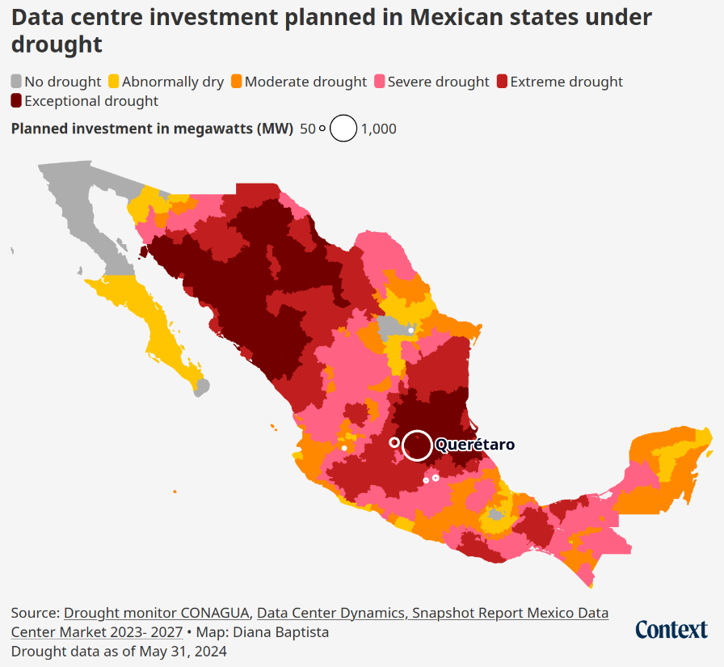

name: canadian-heritage-jan25
class: title, middle

## An introduction to the environmental impacts of AI

Alex Hernández-García (he/il/él)

.turquoise[[Department of Canadian Heritage](https://www.canada.ca/en/canadian-heritage.html) · Online · January 23rd 2026]

.center[

&nbsp&nbsp&nbsp&nbsp

]

.center[

&nbsp&nbsp&nbsp&nbsp

]

.smaller[.footer[
Slides: [alexhernandezgarcia.github.io/slides/{{ name }}](https://alexhernandezgarcia.github.io/slides/{{ name }})
]]

.qrcode[]

---

.left-column[
<figure>
	
  <figcaption>.center[.smaller[<a href="https://www.ledevoir.com/environnement/815840/emissions-carbone-google-ont-augmente-48-cinq-ans-cause-ia">Le Devoir</a>, July 2nd 2024]]</figcaption>
</figure>
<figure>
	
  <figcaption>.center[.smaller[<a href="https://ici.radio-canada.ca/nouvelle/2045059/changements-climatiques-intelligence-artificielle-environnement-ia">Radio Canada</a>, January 27th 2024]]</figcaption>
</figure>
<figure>
	
  <figcaption>.center[.smaller[<a href="https://www.lapresse.ca/affaires/economie/2023-06-03/intelligence-artificielle/un-impact-environnemental-monstre.php">La Presse</a>, June 3rd 2023]]</figcaption>
</figure>
]
.right-column[
   
<figure>
	
  <figcaption>.center[.smaller[<a href="https://www.sciencepresse.qc.ca/actualite/2024/02/26/empreinte-environnementale-estimee-ia">Science Presse</a>, February 26th 2024]]</figcaption>
</figure>
<figure>
	
  <figcaption>.center[.smaller[<a href="https://www.lapresse.ca/affaires/economie/2023-06-03/intelligence-artificielle/un-impact-environnemental-monstre.php">Digital HEC</a>, March 27th 2024]]</figcaption>
</figure>
]

---

count: false
name: title
class: title, middle

## The carbon emissions of AI

.center[]

---

## Why does AI consume so much energy ?

--

.highlight1[Short and simple answer]: Artificial intelligence models are run in computers and computers consume energy.

--

> _But a computer doesn't require so much energy, does it?_

--

> _Not really... But it depends!_

--

> _So?_

--

This question and its answers are unfortunately more complex than it seems on the surface. Let's consider these other questions:

- Why does transportation consume so much energy?
- Why does food production consume so much energy?

???

Walking and biking is not energy-demanding, but transportation within car culture and mindless flying is.

Traditional agriculture is not energy-demanding, but food production based on animal products and fertilizers is.

--

.conclusion[Artificial intelligence is not necessarily energy-intensive. Small-scale, effective AI is in theory possible. The main problem is the scale we have reached.]

---

## Why does AI consume so much energy ?
### A more subtle answer

--

.left-column[
What is an artificial intelligence model?

We can see the backbone of AI models as computer programs that transform input data through mathematical operations to produce output data.
]

.right-column[
.center[
<figure>
	
  .smaller[<figcaption>Schematic of a very simple neural network.</figcaption>]
</figure>
]
]

--

.right-column[
.conclusion[Each mathematical operation consumes a bit of energy. Large AI models perform a myriad of these operations.]
]

---

## Why does AI consume so much energy ?
### A more subtle answer

--

It is important to distinguish the two main phases in the life of an artificial intelligence model: .highlight1[training] and .highlight1[deployment]

--

- .highlight1[Training]: This is the process of adjusting the weights that determine the mathematical operations in the neural network so that the model successfully performs the desired task.

Some models can be trained on a laptop in minutes or hours. The models behind systems like ChatGPT require several weeks and many powerful computers.

--

- .highlight1[Deployment]: This is the use phase of the model once it has been trained.

Some models are only moderately used. Systems like ChatGPT are currently used every minute by millions of users.

--

.conclusion[It is this large-scale deployment of huge models what poses the main problem in a context of climate crisis.]

???

Talk about scaling is all you need and this philosophy promoted from the industry as part of a capitalist mindset.

---

## Estimation of the carbon of emissions of artificial intelligence

What are the factors influencing the greenhouse gas emissions of AI models?

1. .highlight1[Training time], $T$: total time using computational resources (hours).
2. .highlight1[Electric power], $P$: of the compute hardware (watts).
3. .highlight1[Carbon intensity], $I$: the amount of greenhouse gas emissions per unit of energy produced by the energy source. (grams of CO2 equivalent per kilowatt-hour).

.references[
Luccioni and Hernandez-Garcia. [Counting Carbon: A Survey of Factors Influencing the Emissions of Machine Learning](https://arxiv.org/abs/2302.08476). arXiv 2302.08476, 2023.
]

--

The amount of CO2 equivalent [CO2eq] emitted from training a machine learning model, $C$:

$$C = T \times P \times I = E \times I$$

--

.conclusion[It is quite simple to get a rough estimate, but it is really difficult to calculate exactly the energy due to specific processes.]

---

## Estimation of the carbon of emissions of artificial intelligence
### Example

Consider a model trained on a typical computer for 24 hours, with hydroelectric power. .footnote[.smaller[We can suppose the model is trained to classify objects in images and is trained in Québec on a computer equipped with a GPU.]]

1. .highlight1[Training time], $T$: 24 hours
2. .highlight1[Electric power], $P$: 200 W = 0.2 kW
3. .highlight1[Carbon intensity], $I$: 63 g CO2eq. / kWh

--

The amount of CO2 equivalent [CO2eq] emitted from training this machine learning model, $C$:

$$C = 24~\text{hours} \times 0.2~\text{kW}~ \times 63~\text{g CO2eq / kWh} = 302~\text{g CO2eq}$$

--

302 g CO2eq is the equivalent of driving about 1 km with an average passenger car.

--

If the same model was trained with energy from coal, it could consume about 100 times more, that is the equivalent to driving 100 km.

---

## Estimation of the 
## carbon emissions of AI

.context[The main factors are training time, electric power of hardware and carbon intensity.]

In 2022, with Sasha Luccioni, we conducted an analysis of the carbon emissions of 95 machine learning models, asking the authors about the details of the training process.

.center[]

.references[
Luccioni and Hernandez-Garcia. [Counting Carbon: A Survey of Factors Influencing the Emissions of Machine Learning](https://arxiv.org/abs/2302.08476). arXiv 2302.08476, 2023.
]

???

Talk about lack of transparency and difficulty to obtain data.

---

count: false
exclude: true

## Estimation of the 
## carbon emissions of AI

.context[The main factors are training time, electric power of hardware and carbon intensity.]

In 2022, with Sasha Luccioni, we conducted an analysis of the carbon emissions of 95 machine learning models, asking the authors about the details of the training process.

.center[]

.references[
Luccioni and Hernandez-Garcia. [Counting Carbon: A Survey of Factors Influencing the Emissions of Machine Learning](https://arxiv.org/abs/2302.08476). arXiv 2302.08476, 2023.
]

---

count: false
exclude: true

## Estimation of the 
## carbon emissions of AI

.context[The main factors are training time, electric power of hardware and carbon intensity.]

In 2022, with Sasha Luccioni, we conducted an analysis of the carbon emissions of 95 machine learning models, asking the authors about the details of the training process.

.center[]

.conclusion[There exist large differences in the [carbon intensity of the energy grid](https://ourworldindata.org/grapher/carbon-intensity-electricity). From ~10 gCO2eq/kWh in the best case of hydroelectricity to nearly 700 gCO2eq/kWh for coal.]

---

exclude: true

## Estimation of the 
## carbon emissions of AI
### Electric power

.context[The main factors are training time, electric power of hardware and carbon intensity.]

.center[]

.conclusion[In contrast, there are no big differences in the choice of hardware (GPUs).]

---

## Estimation of the 
## carbon emissions of AI

.context[The main factors are training time, electric power of hardware and carbon intensity.]

The carbon intensity depends on the energy grid and the electric power is similar for the various hardware options. .highlight1[The remaining factor is training time].

.center[]

--

.conclusion[We found very large differences in training time across models and thus in the CO2eq emissions.]

???

Charging an average smartphone uses about 22 Wh.

In terms of training time, the models in our sample range from just about 15 minutes (total GPU/TPU time) up to more than 400,000 hours, with a median of 72 hours, pointing again to large variance in our sample. While the maximum of 400,000 GPU hours (equivalent to about 170 days with 100 GPUs) in our sample seems very large, note that the total training time of GPT-3 was estimated to be over 3.5 million hours (14.8 days with 10,000 GPUs).

The total carbon emissions of the models analyzed in our study is about 253 tons of CO2eq, which is equivalent to about 100 flights from London to San Francisco or from Nairobi to Beijing.

---

## Estimation of the carbon emissions of AI
### Comparison of models

The .highlight1[lightest model] was trained in .highlight1[15 minutes], but .highlight2[one of the models needed 400,000 hours].

--

The .highlight1[total carbon emissions] of all models analysed in our sample (95) was about .highlight1[253 metric tons of CO2eq], which is equivalent to .highlight1[about 100 flights] from London to San Francisco.

--

.highlight1[GPT-3], the "predecessor" of ChatGPT, needed .highlight1[3,5 million training hours] (14,8 days with 10,000 GPUs) and thus about .highlight1[500 tons of CO2eq], which corresponds to .highlight1[450 transatlantic flights].

---

## Comparison of AI models

.context35[Does more energy and CO2 lead to better model performance?]

 
.center[]

---

count: false

## Comparison of AI models

.context35[Does more energy and CO2 lead to better model performance?]

 
.center[]

.conclusion[One of the conclusions of our study is that there is little correlation between energy consumption and performance. _Bigger is not better_.]

---

## Comparison of AI models
### What can be said about modern large language models?

First and foremost, big tech companies provide nearly no information about the energy used by their models.

It is only thanks to the work of researchers that we know more and more:

--

- The carbon emissions of training BLOOM were estimated in 25 tons of CO2eq. .cite[(Luccioni et al., 2022)]
- At the peak of ChatGPT popularity in 2023, the tool consumed about 564 MWh of electricity per day, equivalent to the daily consumption of about 19,000 families in the United States. .cite[(de Vries, 2023)]

.references[
- Luccioni, Viguier, Ligozat. [Estimating the Carbon Footprint of BLOOM, a 176B Parameter Language Model](https://arxiv.org/abs/2211.02001). arXiv 2211.02001, 2022.
- de Vries. [The growing energy footprint of artificial intelligence](https://www.cell.com/action/showPdf?pii=S2542435123003653). CellPress, 2023.
- Luccioni, Jernite, Strubell. [Power Hungry Processing: Watts Driving the Cost of AI Deployment?](https://arxiv.org/abs/2311.16863). arXiv 2311.16863, 2023.
- [AI Energy Score](https://huggingface.co/spaces/AIEnergyScore/Leaderboard)
]

???

25 tons of CO2eq are equivalent to 180,000 km en voiture.

25 tons of CO2eq are equivalent to 40 short-haul flights.

https://www.openco2.net/en/co2-converter

---

## Comparison of AI models
### What can be said about modern large language models?

.center[]

.references[
de Vries. [The growing energy footprint of artificial intelligence](https://www.cell.com/action/showPdf?pii=S2542435123003653). CellPress, 2023.
]

---

count: false

## Comparison of AI models
### What can be said about modern large language models?

.center[]

.conclusion[One single interaction with ChatGPT could consume 10 times more energy than a Google search.]

???

Charging an average smartphone uses about 22 W.

AI announces AI mode (May 20 2025): https://blog.google/products/search/google-search-ai-mode-update/#ai-mode-search

---

## Comparison of AI models
### What can be said about modern large language models?

.center[]

.references[
- [AI Energy Score](https://huggingface.co/spaces/AIEnergyScore/Leaderboard)
- Chen. [How much energy will AI really consume? The good, the bad and the unknown](https://www.nature.com/articles/d41586-025-00616-z). Nature, News Feature, 2025.
]

---

## Energy demands of data centres
### Current estimates and future projections

.center[]

.references[
- Chen. [How much energy will AI really consume? The good, the bad and the unknown](https://www.nature.com/articles/d41586-025-00616-z). Nature, News Feature, 2025.
]

---

## Other direct impacts of AI

.context[Large scale AI models are energy intensive and therefore emit GHGs.]

 
Besides energy, data centres and thus AI consume .highlight1[large quantities of drinking water] and require .highlight1[rare raw materials].

.center[]

.references[
- Li et al. [Making AI Less "Thirsty": Uncovering and Addressing the Secret Water Footprint of AI Models](https://arxiv.org/abs/2304.03271). arXiv 2304.03271, 2023.
- Crawford. [Atlas of AI](https://en.wikipedia.org/wiki/Atlas_of_AI), 2021
]

---

## Other direct impacts of AI
### Water usage

.left-column[
- According to Li et al., training GPT-3 evaporated 700,000 litres of clean freshwater in Microsoft's data centres.
- "The global AI demand is projected to account for 4.2–6.6 billion cubic meters of water withdrawal in 2027, which is more than the total annual water withdrawal of half of the United Kingdom."
]

.references[
- Li et al. [Making AI Less "Thirsty": Uncovering and Addressing the Secret Water Footprint of AI Models](https://arxiv.org/abs/2304.03271). arXiv 2304.03271, 2023.
]

--

.right-column[]

---

## Initiatives to reduce the impact of AI

1. Increasing awareness about environmental impacts
2. Improving the transparency about resource utilisation
3. Using artificial intelligence tools in a moderate, proportional and conscious way.
4. Developing more efficient models
5. Promoting more efficient models

--

If one really wants to use AI chatbots, consider greener and more ethical alternatives. For example: [Thaura](https://thaura.ai/home)

--

Regarding efficiency, it is important to always remember [Jevons' paradox](https://www.sciencedirect.com/science/article/abs/pii/S0921800905001084?via%3Dihub): technological efficiency gains often increase overall resource use.

.references[
- Alcott. [Jevons' paradox](https://www.sciencedirect.com/science/article/abs/pii/S0921800905001084?via%3Dihub), Ecological Economics, 2005.
- Lange and Santarius. [Digitalization and energy consumption. Does ICT reduce energy demand?](https://doi.org/10.1016/j.ecolecon.2020.106760), Ecological Economics, 2020.
]

???

For example, historically, despite a one hundredfold efficiency increase from the first light bulb to a contemporary LED bulb, increase in electricity demand for light bulbs has entirely offset these gains. A landmark study concluded that “global energy use for lighting has experienced 100% rebound over 300 years, six continents, and five technologies” (Saunders and Tsao 2012; Tsao et al. 2010). (Insolvent)

100x efficiency gains since first bulb but 2x more energy usage

---

exclude: true

## On the conscious use of AI

.context35[Recently, AI has been deployed in a large number of our daily tools.]

 
Copilot is an example of integration of AI in professional development tools. Researchers in France have studied the energy impact.

.center[]

.references[
Coignion, Quinton, Rouvoy. [Green My LLM: Studying the key factors affecting the energy consumption of code assistants](https://arxiv.org/abs/2411.11892), arXiv 2411.11892, 2024.
]

---

count: false
exclude: true

## On the conscious use of AI

.context35[Recently, AI has been deployed in a large number of our daily tools.]

 
Copilot is an example of integration of AI in professional development tools. Researchers in France have studied the energy impact.

.center[]

.conclusion[Most Copilot results are simply wasted.]

---

## Beyond environmental impact

There is a large body of research studying the negative social impacts of AI:
.left-column[
- Centralisation of power and increase of inequality
- Exploitative working conditions
- Adoption for autonomous weapons and warfare
- Spread of mis/disinformation
]

.right-column[
- Discrimination of racialised people
- Propagation of discriminatory biases
- Infringement of creators rights
]

--

.references[
- Crawford. [Atlas of AI](https://en.wikipedia.org/wiki/Atlas_of_AI), 2021
- DW. [How big AI companies exploit data workers in Kenya](https://www.youtube.com/watch?v=ehkECk2KJjY), 2024
- Kalluri. [Don’t ask if artificial intelligence is good or fair, ask how it shifts power](https://www.nature.com/articles/d41586-020-02003-2), Nature, 2020
- Bender, Gebru, McMillan-Major, Shmitchell. [On the Dangers of Stochastic Parrots: Can Language Models Be Too Big? 🦜](https://dl.acm.org/doi/10.1145/3442188.3445922), FAccT, 2021
- Mohamed, Png, Isaac. [Decolonial AI: Decolonial Theory as Sociotechnical Foresight in Artificial Intelligence](https://arxiv.org/abs/2007.04068), Philosophy and Technology, 2020. 
- Benjamin. [Race After Technology: Abolitionist Tools for the New Jim Code](https://en.wikipedia.org/wiki/Race_After_Technology), Polity, 2019.
- West, Whittaker, Crawford. [Discriminating Systems: Gender, Race, and Power in AI – Report](https://ainowinstitute.org/publications/discriminating-systems-gender-race-and-power-in-ai-2), AI Now, 2019.
- [‘A mass assassination factory’: Inside Israel’s calculated bombing of Gaza](https://www.972mag.com/mass-assassination-factory-israel-calculated-bombing-gaza/)
]

???

- Mention Microsoft's deals with fossil fuel companies
- Major tech companies like Microsoft and Google just reported rises in resource uses previously unheard of, stopped carbon offsetting, and announced that they would miss their already loose (Hoffmann, 2022) sustainability pledges, precisely because of their large scale AI roll-out (e.g. Marx, 2024; Metz, 2024; Rathi & Bass, 2024).

---

count: false
name: title
class: title, middle

## The role of AI in sustainability

.center[]

---

## Overview of applications of artificial intelligence to tackle the climate crisis

.highlight1[Artificial intelligence] should not be seen as the solution to the climate crisis and we have seen how it can make it worse. However, some people do believe that it .highlight1[may be used in multiple applications] connected to.highlight1[mitigation] of climate change and .highglight1[adaptation] to it.

- Energy optimisation of buildings and infrastructures.
- Optimisation of production and distribution of energy
- Prediction and management of natural resources
- Optimisation and management of transport networks
- Improvement of climate models
- Raising awareness about climate change
- Design of new materials for sustainability

.references[
- Rolnick et al. [Tackling Climate Change with Machine Learning](https://dl.acm.org/doi/10.1145/3485128), ACM Computing Surveys, 2022.
- van Wynsberghe. [Sustainable AI: AI for sustainability and the sustainability of AI](https://link.springer.com/article/10.1007/s43681-021-00043-6), AI and Ethics, 2021.
]

???

Optimisation according to what?

---

## Can AI be _truly_ for good?

--

> _Any AI technology in the sustainability struggle will, if continuing on the current path, very likely do more harm than good and might even be a distraction from the actually relevant societal tasks of a sustainability transformation._ .cite[(Rehak, 2024)]

--

> _Sustainable AI is the technical solution to the climate crisis from a techno-solutionist vantage point simply reproducing the status quo. The enthusiasm for sustainable AI primarily serves hegemonic interests, rather than genuinely aiming for resource-friendly and ethical solutions._ .cite[(Schütze, 2024)]

--

.references[
- Rehak. [On the (im)possibility of sustainable artificial intelligence](https://policyreview.info/articles/news/impossibility-sustainable-artificial-intelligence/1804), Internet Policy Review, 2024.
- Schütze. [The Problem of Sustainable AI: A Critical Assessment of an Emerging Phenomenon](https://ojs.weizenbaum-institut.de/index.php/wjds/article/view/4_1_4/119), Weizenbaum Journal, 2024.
]

---

## Summary and discussion

- Artificial intelligence can be very energy intensive due to the large-scale and widespread deployment.
    - But small-scale machine learning models do exist.
- AI is responsible for other severe environmental impacts such as water withdrawal and materials usage.
- There is a wide range of ethical and social impacts of AI beyond its environmental footprint.
- Machine learning may play a role in the mitigation of and adaption to the climate crisis, but it is important to critically examine this role.

  

--
- Could AI be sustainable? Under what conditions?
- Small AI instead of scaling and general purpose _AGI_? Digital degrowth?
- What is the role of AI in sustainability?
- What is our implication on the AI impacts as users, developers, scientists, policy-makers...?

---

name: canadian-heritage-jan25
class: title, middle

Alex Hernández-García (he/il/él)

.center[

&nbsp&nbsp&nbsp&nbsp

&nbsp&nbsp&nbsp&nbsp

&nbsp&nbsp&nbsp&nbsp

]

.footer[[alexhernandezgarcia.github.io](https://alexhernandezgarcia.github.io/) | [alex.hernandez-garcia@mila.quebec](mailto:alex.hernandez-garcia@mila.quebec)] | [alexhergar.bsky.social](https://bsky.app/profile/alexhergar.bsky.social)  

.smaller[.footer[
Slides: [alexhernandezgarcia.github.io/slides/{{ name }}](https://alexhernandezgarcia.github.io/slides/{{ name }})
]]
