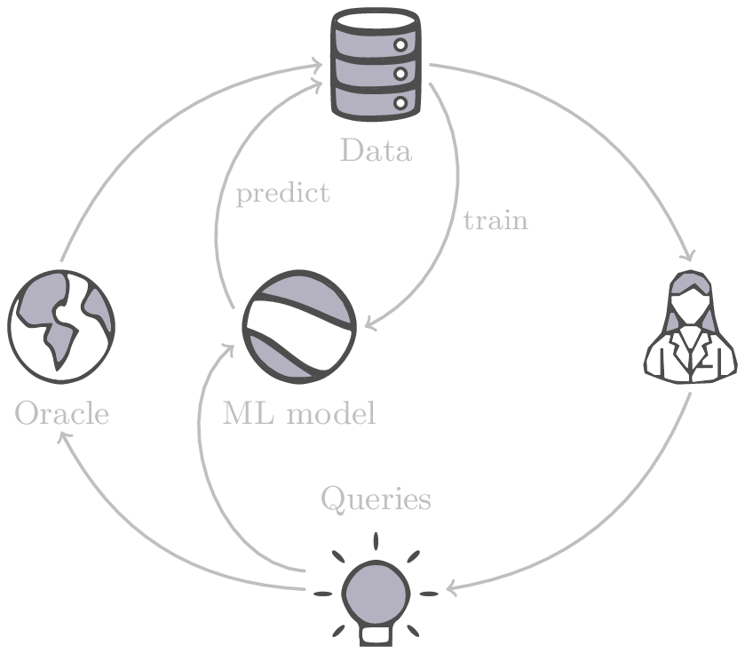
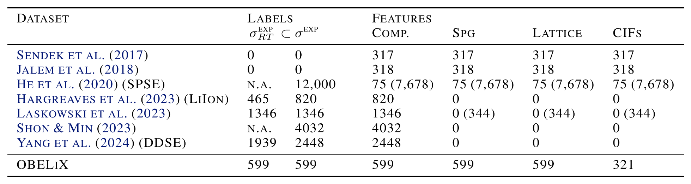
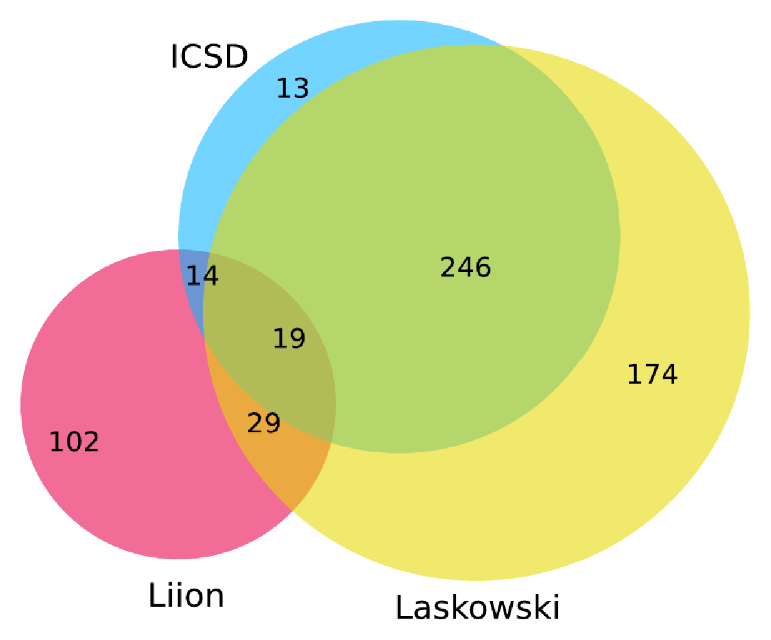
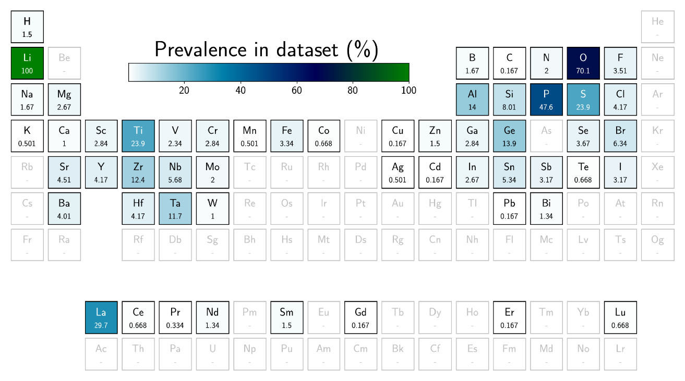
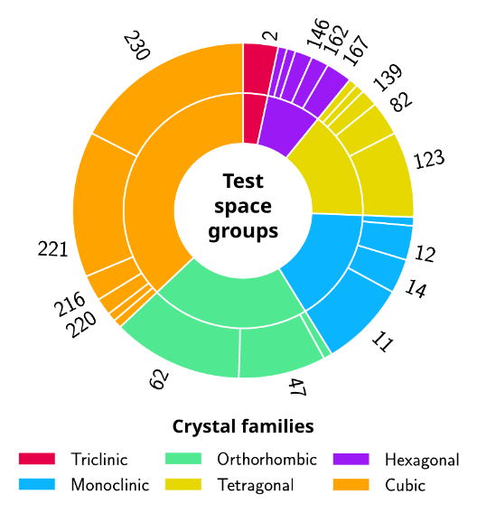
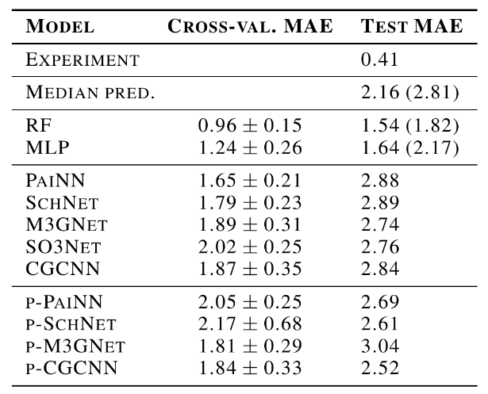

name: cemdi-paims-apr25
class: title, middle

## OBELiX
### A curated dataset of crystal structures and experimentally measured ionic conductivities for lithium solid-state electrolytes

Alex Hernández-García (presenting)

.smaller[Co-authors: Félix Therrien, Jamal Abou Haibeh, Divya Sharma, Rhiannon Hendley, Sun Sun, Alain Tchagang, Jiang Su, Samuel Huberman, Yoshua Bengio, Hongyu Guo, Homin Shin]

.center[

&nbsp&nbsp&nbsp&nbsp

]

.center[

&nbsp&nbsp&nbsp&nbsp

]

.smaller[.footer[
Slides: [alexhernandezgarcia.github.io/slides/{{ name }}](https://alexhernandezgarcia.github.io/slides/{{ name }})
]]

.qrcode[]

---

count: false
name: title
class: title, middle

### Machine learning for scientific discoveries to tackle climate change

.center[]

---

## Why scientific discoveries?

.context[Climate change is a major challenge for humanity. My background is on machine learning. Could my work contribute to tackling climate change?]

  

.center[
<figure>
	
  <figcaption>.smaller[Observed (1900–2020) and projected (2021–2100) changes in global surface temperature relative to 1850–1900 (adapted from: <a href="https://www.ipcc.ch/report/sixth-assessment-report-cycle/">IPCC Sixth Assessment Report</a>)]</figcaption>
</figure>
]

.conclusion["The evidence is clear: the time for action is now." .smaller[IPCC Report, 2022]]

---

## Why scientific discoveries?
### The potential of materials discovery

.context["The time for action is now"]

--

> "Limiting global warming will require major transitions in the energy sector. This will involve a substantial reduction in fossil fuel use, widespread electrification, .highlight1[improved energy efficiency, and use of alternative fuels (such as hydrogen)]." .cite[IPCC Sixth Assessment Report, 2022]

> "Reducing industry emissions will entail coordinated action throughout value chains to promote all mitigation options, including demand management, .highlight1[energy and materials efficiency, circular material flows]." .cite[IPCC Sixth Assessment Report, 2022]

--

 

.conclusion[Mitigation of the climate crisis requires innovation in the materials sector.]

---

## Machine Learning for Science

.center[]

.conclusion[Machine learning research has the potential to facilitate scientific discoveries to tackle climate and health challenges.]

---

count: false

## Machine Learning for Science and Science for Machine Learning

.center[]

.conclusion[Machine learning research has the potential to facilitate scientific discoveries to tackle climate and health challenges. Scientific challenges stimulate in turn machine learning research.]

---

count: false
name: mlforscience
class: title, middle

### **Generative** and **active** machine learning for scientific discoveries

.center[]

---

## Traditional discovery cycle

.context35[The climate crisis demands accelerating scientific discoveries.]

--

.right-column-66[ .center[]]

.left-column-33[
 
The .highlight1[traditional pipeline] for scientific discovery:
* relies on .highlight1[highly specialised human expertise],
* it is .highlight1[time-consuming] and
* .highlight1[financially and computationally expensive].
]

---

count: false

## Machine learning in the loop

.context35[The traditional scientific discovery loop is too slow for certain applications.]

.right-column-66[ .center[]]

.left-column-33[
 
A .highlight1[machine learning model] can be:
* trained with data from _real-world_ experiments and
]

---

count: false

## Machine learning in the loop

.context35[The traditional scientific discovery loop is too slow for certain applications.]

.right-column-66[ .center[]]

.left-column-33[
 
A .highlight1[machine learning model] can be:
* trained with data from _real-world_ experiments and
* used to quickly and cheaply evaluate queries
]

---

count: false

## Machine learning in the loop

.context35[The traditional scientific discovery loop is too slow for certain applications.]

.right-column-66[ .center[]]

.left-column-33[
 
A .highlight1[machine learning model] can be:
* trained with data from _real-world_ experiments and
* used to quickly and cheaply evaluate queries

.conclusion[There are infinitely many conceivable materials, combinatorially many are potentially stable. Are predictive models enough?]
]

---

count: false

## _Generative_ machine learning in the loop

.right-column-66[ .center[]]

.left-column-33[
 
.highlight1[Generative machine learning] can:
* .highlight1[learn structure] from the available data,
* .highlight1[generalise] to unexplored regions of the search space and
* .highlight1[build better queries]
]

---

count: false

## _Generative_ machine learning in the loop

.right-column-66[ .center[]]

.left-column-33[
 
.highlight1[Generative machine learning] can:
* .highlight1[learn structure] from the available data,
* .highlight1[generalise] to unexplored regions of the search space and
* .highlight1[build better queries]

.conclusion[Active learning with generative machine learning can in theory more efficiently explore the candidate space.]
]

---

count: false
name: crystal-gfn
class: title, middle

## Crystal-GFN: GFlowNets for materials discovery

Mila AI4Science: Alex Hernandez-Garcia, Alexandre Duval, Alexandra Volokhova, Yoshua Bengio, Divya Sharma, Pierre Luc Carrier, Yasmine Benabed, Michał Koziarski, Victor Schmidt, Pierre-Paul De Breuck

.smaller70[Mila AI4Science et al. [Crystal-GFN: sampling crystals with desirable properties and constraints](https://arxiv.org/abs/2310.04925). AI4Mat, NeurIPS 2023 (spotlight)]

.center[]

---

## A domain-inspired approach
### Crystal structure parameters

.context[Most previous works tackle crystal structure generation in the space of atomic coordinates and struggle to preserve the symmetry properties.]

--

 
Instead of optimising the atom positions by learning from a small data set, we draw .highlight1[inspiration from theoretical crystallography to sample crystals in a lower-dimensional space of crystal structure parameters].

--

.highlight2[Space group]: symmetry operations of a repeating pattern in space that leave the pattern unchanged.

--

- There are 17 symmetry groups in 2 dimensions (wallpaper groups).
- There are 230 space groups in 3 dimensions.

---

count: false

## A domain-inspired approach
### Crystal structure parameters

.context[Most previous works tackle crystal structure generation in the space of atomic coordinates and struggle to preserve the symmetry properties.]

 
Instead of optimising the atom positions by learning from a small data set, we draw .highlight1[inspiration from theoretical crystallography to sample crystals in a lower-dimensional space of crystal structure parameters].

.highlight2[Lattice system]: all 230 space groups can be classified into one of the 7 lattices.

.center[
<nobr>
<nobr>
<nobr>
<nobr>
<nobr>
<nobr>
<nobr>
]

---

count: false

## A domain-inspired approach
### Crystal structure parameters

.context[Most previous works tackle crystal structure generation in the space of atomic coordinates and struggle to preserve the symmetry properties.]

 
Instead of optimising the atom positions by learning from a small data set, we draw .highlight1[inspiration from theoretical crystallography to sample crystals in a lower-dimensional space of crystal structure parameters].

.highlight2[Lattice parameters]: The lattice's size and shape is characterised by 6 parameters: .highlight1[$a, b, c, \alpha, \beta, \gamma$].

.center[]

---

count: false

## Crystal-GFlowNet
### Sequential generation

.center[]

---

count: false

## Crystal-GFlowNet
### Sequential generation

.center[]

---

count: false

## Crystal-GFlowNet
### Sequential generation

.center[]

---

count: false

## Crystal-GFlowNet
### Sequential generation

.center[]

---

count: false

## Crystal-GFlowNet
### Sequential generation

.center[]

---

count: false

## Crystal-GFlowNet
### Sequential generation

.center[]

---

count: false

## Crystal-GFlowNet
### Sequential generation

.center[]

---

count: false

## Crystal-GFlowNet
### Sequential generation

.center[]

---

count: false

## Crystal-GFlowNet
### Sequential generation

.center[]

.conclusion[Crystal-GFN binds multiple spaces representing crystallographic and material properties, setting intra- and inter-space hard constraints in the generation process.]

---

## GFlowNet approach
### Advantages

.context[We generate materials in the lower-dimensional space of crystal structure parameters.]

* Constructing materials by their crystal structure parameters allows us to introduce .highlight1[physicochemical and geometric _hard_ constraints]:
--

    * Charge neutrality of the composition.
    * Compatibility of composition and space group.
    * Hierarchical structure of the space group.
    * Compatibility of lattice parameters and lattice system.
--
* .highlight1[Searching in the lower-dimensional space] of crystal structure parameters may be more efficient than in the space of atom coordinates.

--
* Provided we have access to a predictive model of a material property, we can .highlight1[flexibly generate materials with desirable properties].

--
* We can .highlight1[flexibly sample materials with specific characteristics, such as composition or space group]. 

--
* Training the generative model does not depend on a data set, but on a proxy model of the property of interest.

---

## Crystal-GFlowNet
### Material properties

We can train a Crystal-GFN with any reward function, provided it is computationally tractable. Therefore, we can use it to .highlight1[generate materials with different properties]. 
--
We have tested the following properties:

- .highlight2[Formation energy] per atom [eV/atom], via a pre-trained machine learning model: indicative of the material's stability.

--
- .highlight2[Electronic band gap] [eV] (squared distance to a target value, 1.34 eV), via a pre-trained machine learning model: relevant in photovoltaics, for instance.

--
- Unit cell .highlight2[density] [g/cm3]: convenient as a proof of concept because we can calculate it _exactly_ from the GFN outputs.

---

count: false

## Crystal-GFlowNet
### Material properties

We can train a Crystal-GFN with any reward function, provided it is computationally tractable. Therefore, we can use it to .highlight1[generate materials with different properties]. We have tested the following properties:

- .highlight2[Formation energy] per atom [eV/atom], via a pre-trained machine learning model: indicative of the material's stability.
- .highlight2[Electronic band gap] [eV] (squared distance to a target value, 1.34 eV), via a pre-trained machine learning model: relevant in photovoltaics, for instance.
- .alpha50[Unit cell .highlight2[density] [g/cm3]: convenient as a proof of concept because we can calculate it _exactly_ from the GFN outputs.]

---

## Results
### Formation energy

.context35[The formation energy correlates with stability. The lower, the better.]

.center[]

---

count: false

## Results
### Formation energy

.context35[The formation energy correlates with stability. The lower, the better.]

.center[]

---

count: false

## Results
### Formation energy

.context35[The formation energy correlates with stability. The lower, the better.]

.center[]

---

count: false

## Results
### Formation energy

.context35[The formation energy correlates with stability. The lower, the better.]

.center[]

---

count: false

## Results
### Formation energy

.context[.highlight1[After training, Crystal-GFN samples structures with even lower formation energy [eV/atom] than the validation set.]]

.center[]

---

## Results
### Band gap

.context35[We aimed at sampling structures with band gap close to 1.34 eV.]

.center[]

---

count: false

## Results
### Band gap

.context35[We aimed at sampling structures with band gap close to 1.34 eV.]

.center[]

---

count: false

## Results
### Band gap

.context35[We aimed at sampling structures with band gap close to 1.34 eV.]

.center[]

---

count: false

## Results
### Band gap

.context35[We aimed at sampling structures with band gap close to 1.34 eV.]

.center[]

---

count: false

## Results
### Band gap

.context[.highlight1[After training, Crystal-GFN samples structures with band gap [eV] around the target value.]]

.center[]

---

## Results
### Diversity

.context[.highlight2[Diversity] is key in materials discovery.]

Analysis of 10,000 sampled crystals and the top-100 with lowest formation energy.

--

- All 10,000 samples are unique.

--
- All crystal systems, lattice systems and point symmetries found in the 10,000 samples.
    - 4 out of 8 crystal-lattice systems in the top-100.
    - 4 out of the 5 point symmetries in the top-100.
--
- All 22 elements found in the 10,000 samples.
    - 15 out of 22 elements in the top-100.
--
- 73 out of 113 space groups (65 %) found in the 10,000 samples
    - 19 out of 113 space groups in the top-100.

--

.conclusion[Crystal-GFN samples are highly diverse.]

---

## Results
### Restricted sampling

.context[Crystal-GFN is flexible by design, inspired by the needs of domain experts.]

We restrict the sampling space at sampling time:

- A: The composition is restricted to only elements Fe and O, with a maximum of 10 atoms per element.
- B: We sample in the ternary space for Li-Mn-O, keeping the element count to maximum 16 atoms.
- C: We restrict the space groups to only cubic lattices.
- D: We restrict the range of the lattice parameters to lengths between 10 and 20 angstroms and angles between 75 and 135 degrees.

---

## Results
### Restricted sampling

.center[]

---

count: false
name: title
class: title, middle

### Application: Solid-state electrolytes with high ionic conductivity

.center[]

---

## Challenge
### Lack of high quality data

.context[We need to be able to efficiently and accurately predict the ionic conductivity of new crystal structures.]

.center[]

.conclusion[Existing data sets with experimental ionic conductivity measurements are small and messy.]

---

## New data set: OBELiX
### Open solid Battery Electrolytes with Li: an eXperimental dataset

.center[]

- Ionic conducitivities at room temperature
- Composition, space groups and lattice parameters for all 599 materials
- CIF files (structure) for 321 materials
- Strict train, validation, test splits to avoid data leakage

---

## Data collection

1. Build from the Liverpool Ionics Dataset and Laskowski et al. (2023).

--
2. Select materials for which the experimental room temperature ionic conductivity, space group and lattice parameters could be obtained.

--
3. Record the total composition including the number of formula unit Z.

--
4. Filter the dataset for exact duplicates and ensured that near duplicates were truly different materials. We obtained 599 unique materials.

--
5. Obtain CIFs for as many materials as possible, from ICSD and Materials Project, considering exact and approximate matches. We obtained CIFs for 321 materials.

--

.conclusion[OBELiX contains 599 materials with experimentally measured ionic conductivities, represented by their composition, space group and lattice paramters, and 321 by their full structure too.]

---

## Data collection

.center[]

---

## Data splits

Ensuring _fair_ data splits between train, validation and test is essential to ensure rigorous machine learning evaluation that leads to progress in the field.

Criteria for splitting the data:
1. Entries from the same paper must be in the same set.
2. Splits should have approximately the same target distribution: Monte Carlo matching.
3. Approximately the same amount of entries with CIFs.
4. Test set size between 20 and  30 %.

---

## Data set statistics
### Elements

.center[]

---

## Data set statistics
### Space groups

.left-column[.center[]]
.right-column[.center[]]

---

## Data set statistics
### Distribution of the ionic conductivity

.center[]

---

## Benchmark of machine learning models

.left-column[
* PaiNN enforces E(3)-equivariance
* SchNet learns continuous filter representations
* M3GNet integrates message passing with three-body interactions
* SO3Net leverages spherical harmonics to enhance equivariant representations
* CGCNN models crystal structures directly as graphs
* Good old Random Forest
* Good old multi-layer perceptron
]
.right-column[.center[]]

--

 
.conclusion[Fancy models fail in this problem. Simple models are better, but not great. Exciting problem for machine learning!]

---

## Summary

- Active learning enhanced with predictive and generative machine learning models is a promising avenue for materials discovery.
- Crystal-GFN is a flexible generative model of crystals that allows incorporating domain constraints for an efficient search of the crystallographic space.
- The lack of experimental data makes the application of machine learning to discover solid-state electrolytes with high ionic conductivity very hard.
- We have introduced OBELiX, a curated dataset of crystal structures and experimentally measured ionic conductivities for lithium solid-state electrolytes.

---

## Call for postdocs

The [Institute Courtois](https://institut-courtois.umontreal.ca/) has recently open a call for the new **Postdoctoral Fellowship Program**, with very competitive conditions:
- $63,800 CAD/year + social benefits
- Up to $30,000 CAD/year as travel and research funds

The Institut Courtois is part of the Faculty of Arts and Sciences of the Université de Montreal. The vision for the Institut Courtois is to promote .highlight1[an environment of creativity and discovery that will lead to fundamental breakthroughs in materials sciences]. The Institute brings together leading researchers to accelerate materials research in five main thrusts: quantum materials, quantum photonics, materials for energy and the environment, development of molecular materials, AI for material science and material science for AI.

.center[]

.qrcode[]
---

name: cemdi-paims-apr25
class: title, middle

Alex Hernández-García (he/il/él)

.center[

&nbsp&nbsp&nbsp&nbsp

&nbsp&nbsp&nbsp&nbsp

&nbsp&nbsp&nbsp&nbsp

]

.highlight2[We are looking for students and collaborators to work on machine learning for materials discovery!]

.footer[[alexhernandezgarcia.github.io](https://alexhernandezgarcia.github.io/) | [alex.hernandez-garcia@mila.quebec](mailto:alex.hernandez-garcia@mila.quebec)] | [alexhergar.bsky.social](https://bsky.app/profile/alexhergar.bsky.social)  

.smaller[.footer[
Slides: [alexhernandezgarcia.github.io/slides/{{ name }}](https://alexhernandezgarcia.github.io/slides/{{ name }})
]]
