name: cemdi-paims-jul26
class: title, middle, hide-slide-number

### Comparing MLIPs vs DFT for ionic conductivity in solid lithium electrolytes

.bigger[Work led by Dounia Shaaban Kabakibo]

Alex Hernández-García (presenting)

.turquoise[[4th CEMDI–PAIMS Symposium 2026](https://cemdi.ca//symposium.php?id=evt_4th_symposium_2026) · Montréal · July 31st 2026]

.center[
<a href="https://mila.quebec/">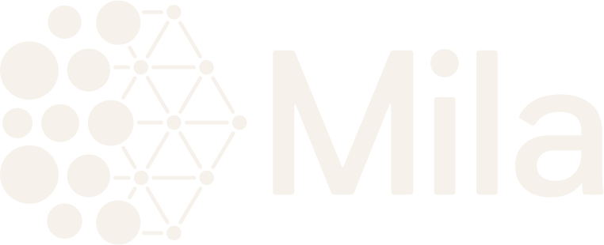</a>
&nbsp&nbsp&nbsp&nbsp

]

.center[
<a href="https://institut-courtois.umontreal.ca/">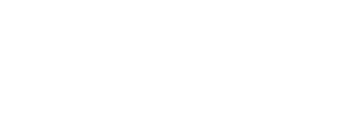</a>
&nbsp&nbsp&nbsp&nbsp

]

.smaller[.footer[
Slides: [alexhernandezgarcia.com/slides/{{ name }}](https://alexhernandezgarcia.com/slides/{{ name }})
]]

.qrcode[]

---

count: false
name: solid-state-electrolytes
class: title, middle

## Design of novel lithium electrolytes with high ionic conductivity for solid-state batteries

.center[
<figure>
	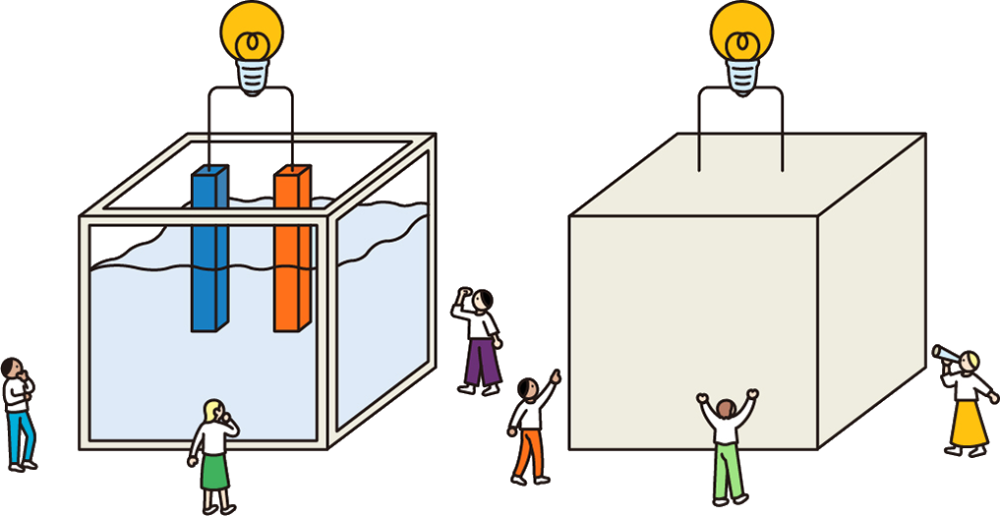
  <figcaption>.smaller[Adapted from: <a href="https://article.murata.com/en-sg/article/basic-lithium-ion-battery-4">Murata</a>]</figcaption>
</figure>
]

---

class: hide-slide-number

## Traditional screening

.center[
<figure>
	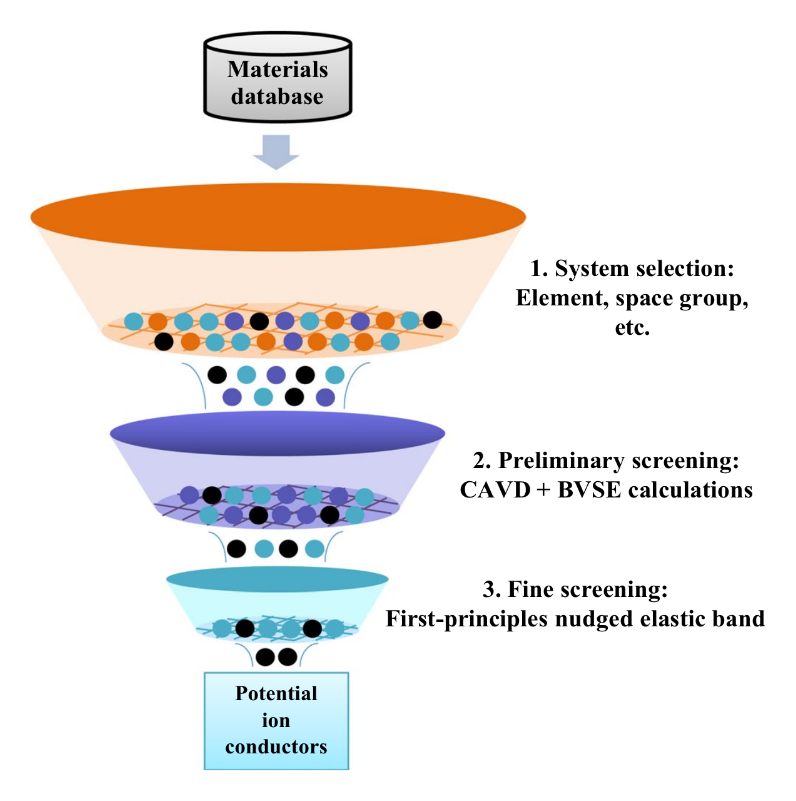
  <figcaption>.smaller[Source: <a href="https://www.nature.com/articles/s41597-020-0474-y">He et al. (2020)</a>]</figcaption>
</figure>
]

.references[He et al. [High-throughput screening platform for solid electrolytes combining hierarchical ion-transport prediction algorithms](https://www.nature.com/articles/s41597-020-0474-y). Scientific Data, 2020.]

---

class: hide-slide-number

## Screening guided by machine learning

.center[
<figure>
	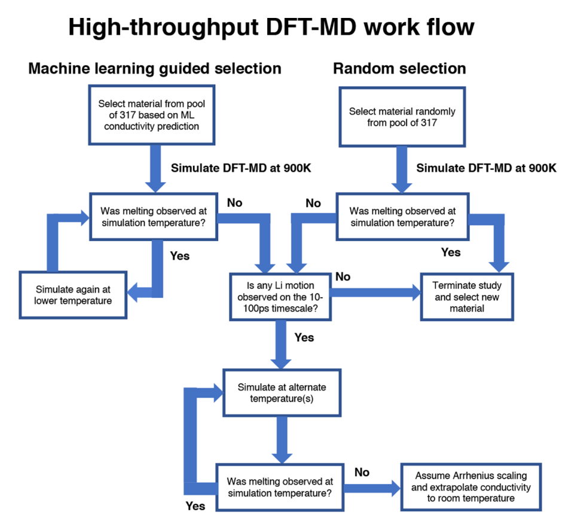
  <figcaption>.smaller[Source: <a href="https://pubs.acs.org/cmatex/article-abstract/31/2/342/1287786/Machine-Learning-Assisted-Discovery-of-Solid-Li">Sendek et al. (2018)</a>]</figcaption>
</figure>
]

.references[Sendek et al. [Machine learning-assisted discovery of solid Li-ion conducting materials](https://pubs.acs.org/cmatex/article-abstract/31/2/342/1287786/Machine-Learning-Assisted-Discovery-of-Solid-Li). Chemistry of Materials, 2018.]

---

## Our approach
### Iterative _de novo_ design with generative models and active learning

.right-column-66[.center[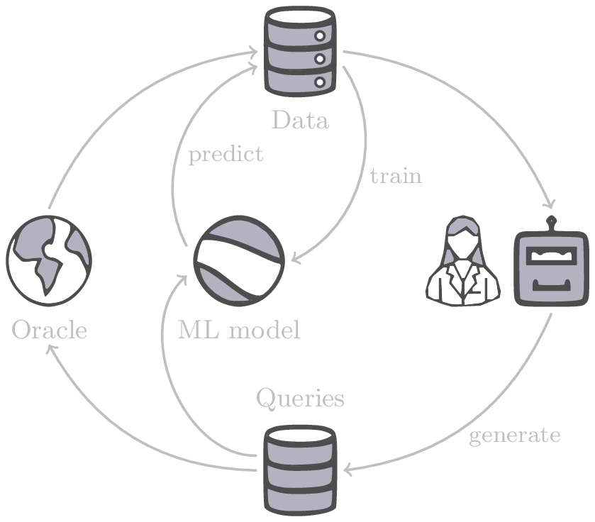]]

.left-column-33[
.highlight2[Iterative active learning]:
* mimics the .h1[traditional scientific discovery cycle],
* enables .h1[continuous improvement and refinement].
]

--

.left-column-33[
.highlight2[Generative machine learning] can:
* .highlight1[explore] unseen regions of the search space and
* propose .highlight1[novel candidates _de novo_].
]

---

## _Multi-fidelity_ active learning with generative modelling

.right-column-66[ .center[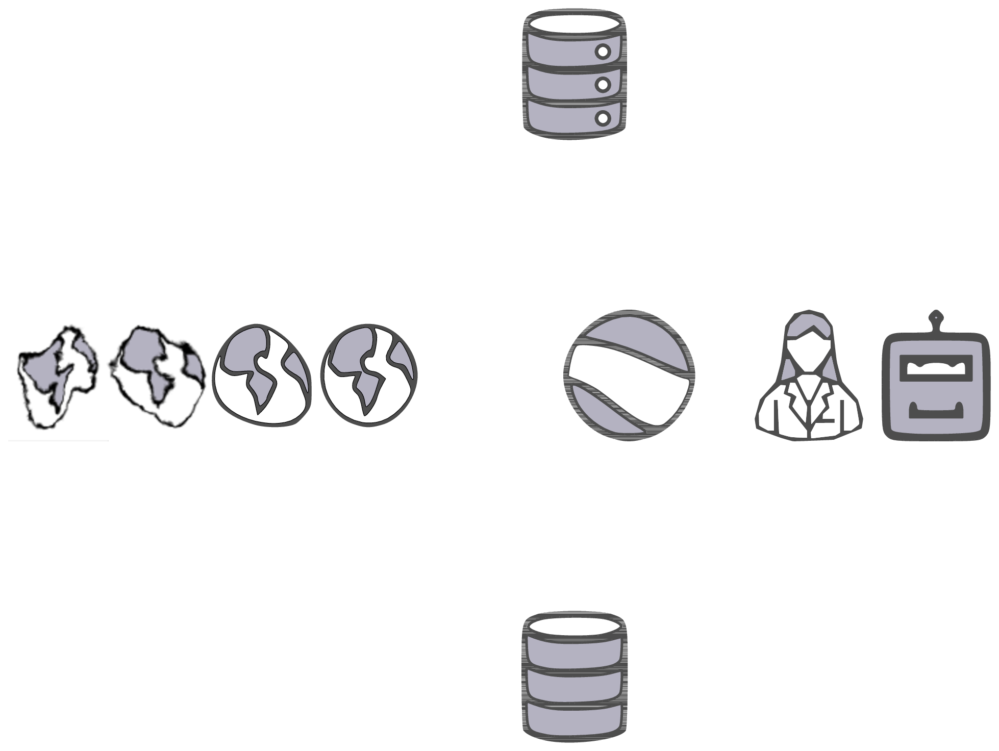]]

.left-column-33[
 
.highlight1[Multi-fidelity active learning] can:
* leverage the availability of .highlight1[multiple oracles] with different .highlight1[costs and fidelity]
* efficiently use the right level of accuracy needed for each query
]

.references[Hernandez-Garcia, Saxena et al. [Multi-fidelity active learning with GFlowNets](https://arxiv.org/abs/2306.11715). TMLR, 2024]

---

count: false

## _Multi-fidelity_ active learning with generative modelling

.right-column-66[ .center[]]

.left-column-33[
 
.highlight1[Multi-fidelity active learning] can:
* leverage the availability of .highlight1[multiple oracles] with different .highlight1[costs and fidelity]
* efficiently use the right level of accuracy needed for each query

.conclusion-float[Multi-fidelity active learning can leverage the diversity of methods available in science.]
]

.references[Hernandez-Garcia, Saxena et al. [Multi-fidelity active learning with GFlowNets](https://arxiv.org/abs/2306.11715). TMLR, 2024]

---

count: false
name: solid-state-electrolytes
class: title, middle

## Design of novel lithium electrolytes with high ionic conductivity for solid-state batteries

.center[
<figure>
	
  <figcaption>.smaller[Adapted from: <a href="https://article.murata.com/en-sg/article/basic-lithium-ion-battery-4">Murata</a>]</figcaption>
</figure>
]

---

## Generative model
### Crystal-GFN

.context[Presented at the 2nd CEMDI Symposium in 2024.]

.right-column[.center[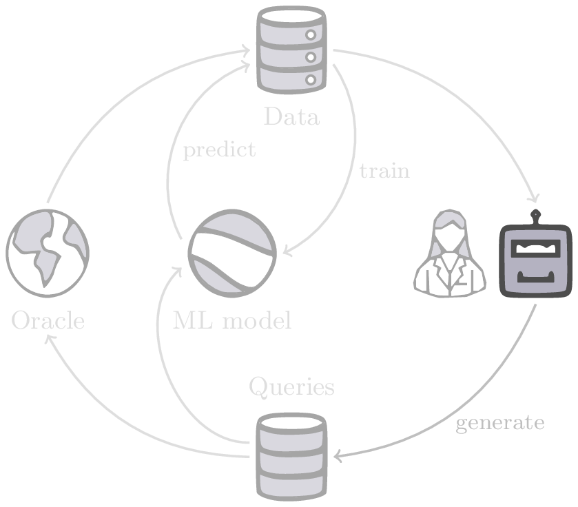]]

.left-column[
.h1[Generative ML model]:
- The generated candidates should:
    - have the target property
    - have other desirable properties (lithium, available elements, etc.)
    - be realistic (physical constraints)
    - be diverse
- The available data sets are extremely small for ML standards.
]

---

## Crystal-GFlowNet

.center[]

.conclusion-float[Crystal-GFN is a sequential generative model of crystal structures, to design candidates with desirable properties and constraints and inspired by theoretical crystallography.]

.references[Mila AI4Science et al. [Crystal-GFN: sampling crystals with desirable properties and constraints](https://arxiv.org/abs/2310.04925). AI4Mat, NeurIPS 2023 (spotlight)]

---

## Data
### OBELiX

.context[Presented at the 3rd CEMDI Symposium in 2025.]

.right-column-66[.center[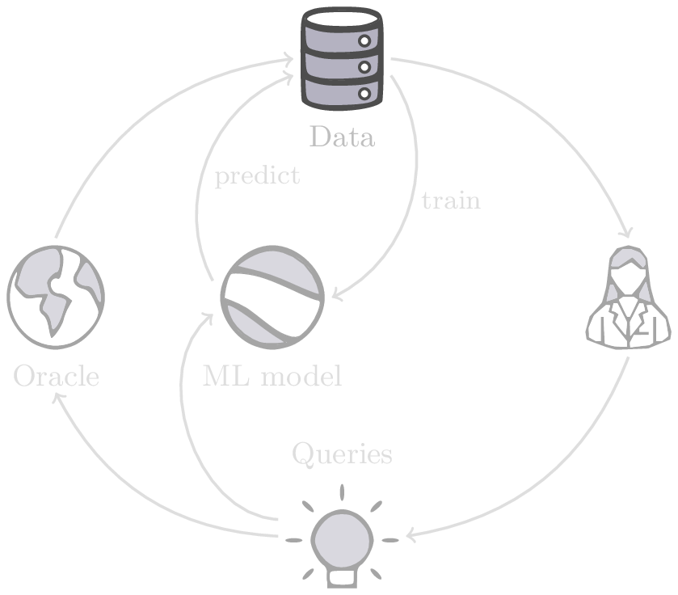]]

.left-column-33[
.h1[Data]:
* Scarce and scattered data
* Especially of high quality
* Not ready for ML use
]

---

## OBELiX
### Open solid Battery Electrolytes with Li: an eXperimental dataset

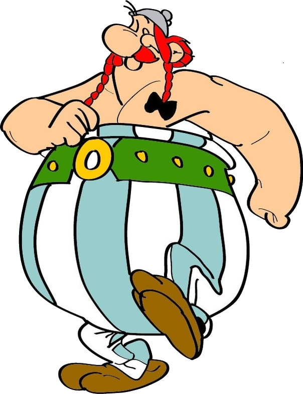

.right-column-66[.center[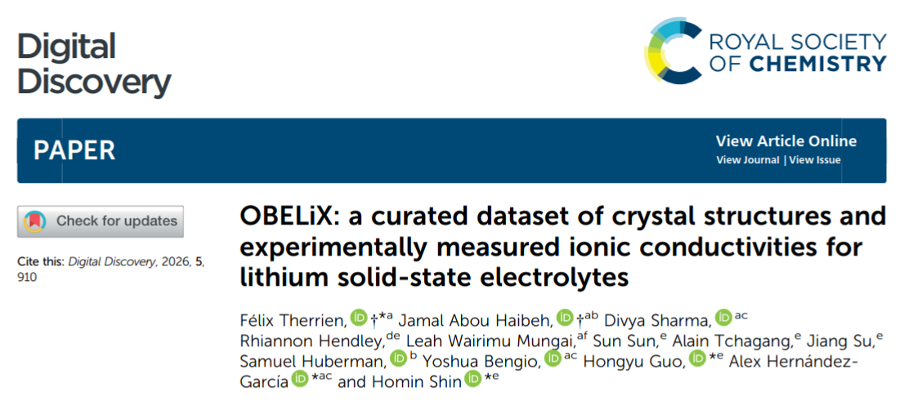]]

.left-column-33[
We curated a data set of nearly 600 materials with experimentally measured ionic conductivity.
  
.center[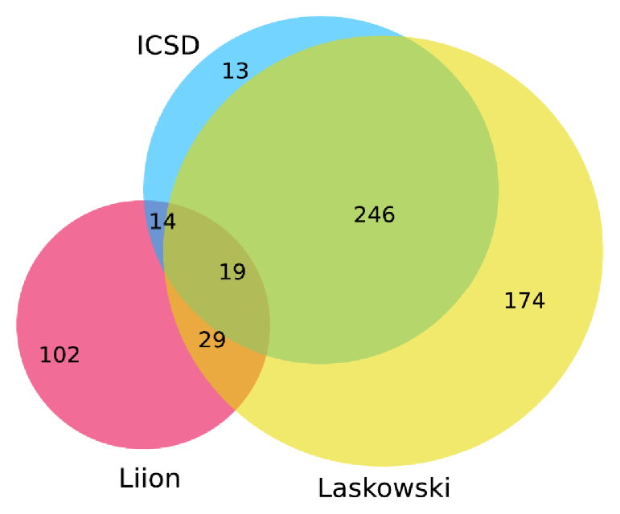]
]

.full-width[
- Paper: [arxiv.org/abs/2502.14234](https://arxiv.org/abs/2502.14234)
- Code and data set: [github.com/NRC-Mila/OBELiX](https://github.com/NRC-Mila/OBELiX/tree/main)
]

---

## OBELiX
### Open solid Battery Electrolytes with Li: an eXperimental dataset

.center[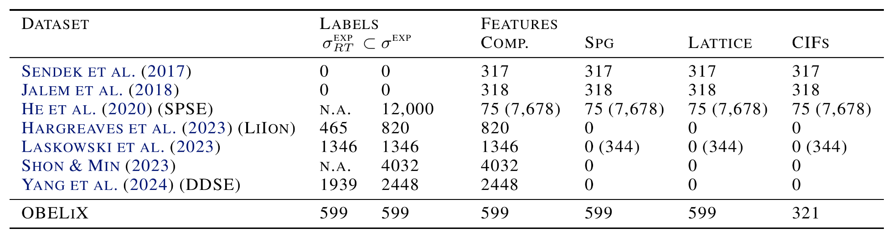]

- Ionic conducitivities at room temperature
- Composition, space groups and lattice parameters for all 599 materials
- CIF files (structure) for 321 materials
- Strict train, validation, test splits to avoid data leakage

.references[
- Paper: [arxiv.org/abs/2502.14234](https://arxiv.org/abs/2502.14234)
- Code and data set: [github.com/NRC-Mila/OBELiX](https://github.com/NRC-Mila/OBELiX/tree/main)
]

---

## ML predictive model

.context[Presented at the 3rd CEMDI Symposium in 2025.]

.right-column[.center[]]

.left-column[
.h1[ML predictive model]:
- Random forest
- Multi-layer perceptron
- Graph neural networks
- ...
]

---

count: false

## ML predictive model

.context[Presented at the 3rd CEMDI Symposium in 2025.]

.right-column[.center[]]

.left-column[
.h1[ML predictive model]:
- Random forest
- Multi-layer perceptron
- Graph neural networks
- ...
  
.center[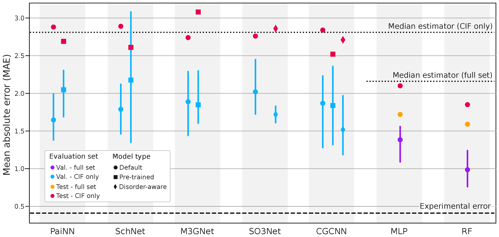]
]

---

count: false

## Oracle

.context[Today, the 4th CEMDI Symposium in 2026.]

.right-column-66[.center[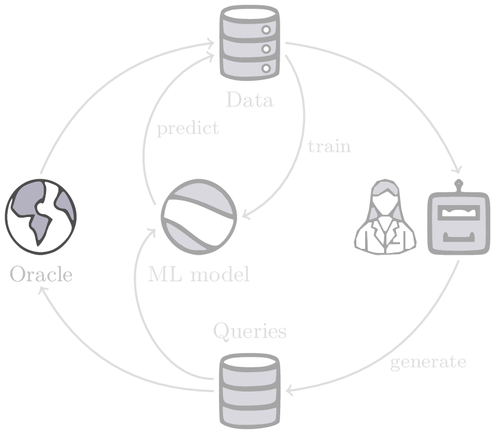]]

.left-column-33[
.h1[Oracle]: experimental validation
- Requires synthesising the material 
- Very high financial cost and multiple months per candidate.
]

---

## Oracle.h1[s]

.context[Today, the 4th CEMDI Symposium in 2026.]

.right-column-66[.center[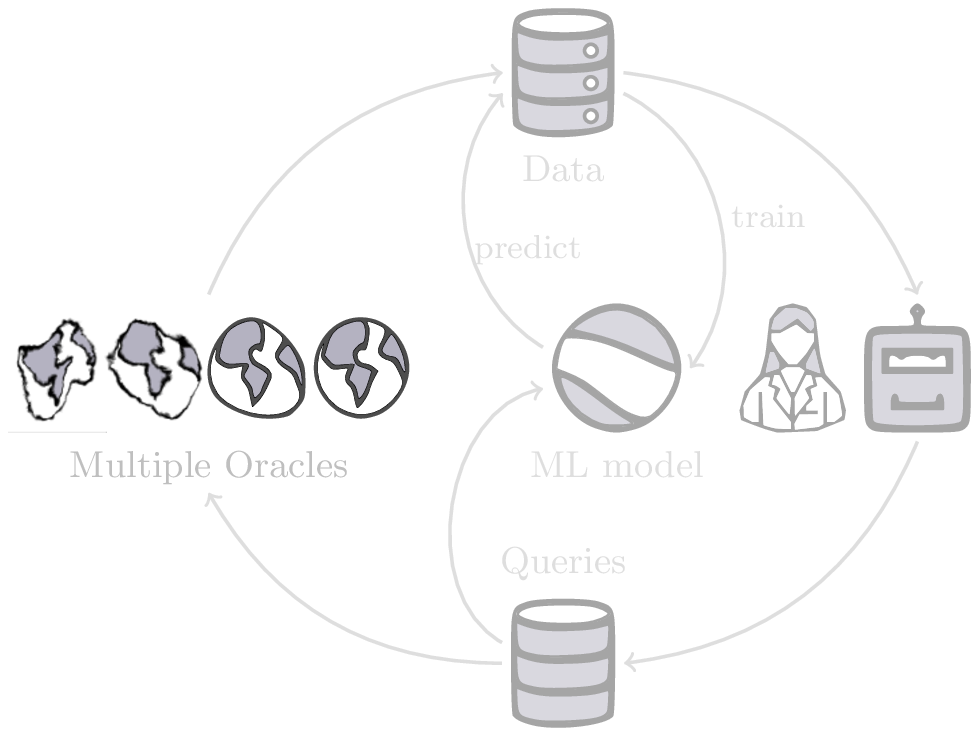]]

.left-column-33[
.h1[Oracles]: 
- Experimental validation
- .h2[DFT]
- .h2[MLIPs]
- ...
]

---

## Oracle.h1[s]

.context[Today, the 4th CEMDI Symposium in 2026.]

.right-column-66[.center[]]

.left-column-33[
.h1[Oracles]: 
- Experimental validation
- .h2[DFT]
- .h2[MLIPs]
- ...

.conclusion-float[What is the accuracy and the cost of DFT and MLIPs to estimate the ionic conductivity?]
]

---

## Ionic conductivity estimation
### A comparison of methods

.context[DFT has been widely used to estimate the ionic conductivity and recently MLIPs are widely available too.]

.left-column-33[.center[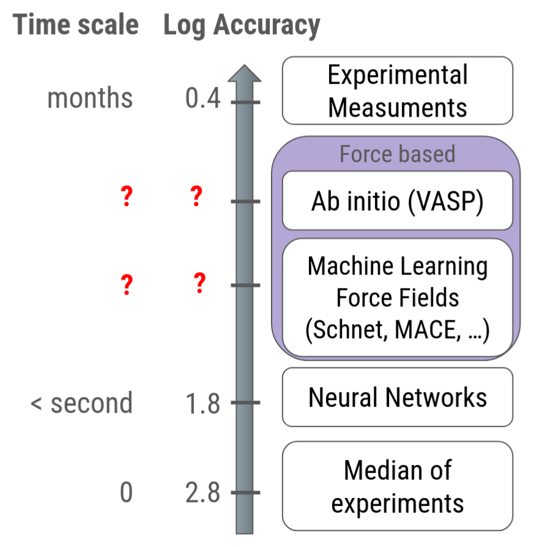]

Paper: [arxiv.org/abs/2603.28012](https://arxiv.org/abs/2603.28012)
]

.right-column-66[.center[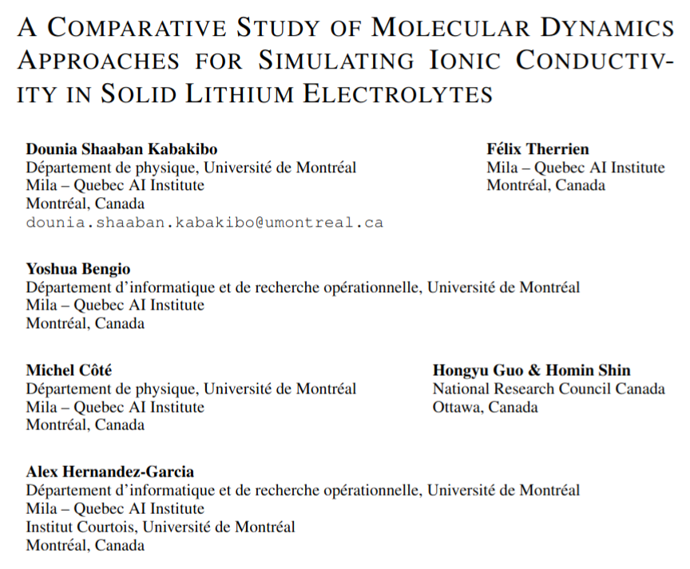]]

---

## Methodology

- .h1[Goal]: Benchmark molecular dynamics (MD) approaches to estimate the ionic conductivity of lithium solid-state electrolytes.

--
    - A guiding objective was to also establish a framework that enables systematic comparisons across additional calculators and materials.
--
- .h1[MD methods]: 
    - DFT
    - MLIPs: NequIP, MACE and CHGNet
--
- .h1[Data]: 76 lithium solid-state electrolytes from [OBELiX data set](https://pubs.rsc.org/en/content/articlepdf/2026/dd/d5dd00441a), with experimentally measured ionic conductivity.

--
    - Structures without disorder
    - DFT was evaluated on a subset of 21 structures.

---

## Ionic conductivity estimation

.left-column[
For each material and method:
]

---

count: false

## Ionic conductivity estimation

.left-column[
For each material and method:
1. 100 ps MD at 5 temperatures: 800, 900, 1000, 1100 and 1200 K.
]

.right-column[
.center[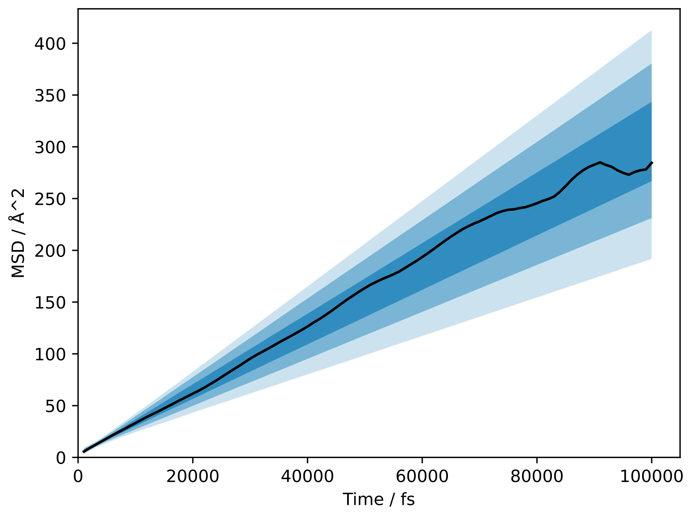]
]

---

count: false

## Ionic conductivity estimation

.left-column[
For each material and method:
1. 100 ps MD at 5 temperatures: 800, 900, 1000, 1100 and 1200 K.
2. Obtain the slope $D$ of the mean square displacement of Li over time.
]

.right-column[
.center[]
]

---

count: false

## Ionic conductivity estimation

.left-column[
For each material and method:
1. 100 ps MD at 5 temperatures: 800, 900, 1000, 1100 and 1200 K.
2. Obtain the slope $D$ of the mean square displacement of Li over time.
3. Extrapolate to room temperature via Arrhenius.
]

.right-column[
.center[]
.center[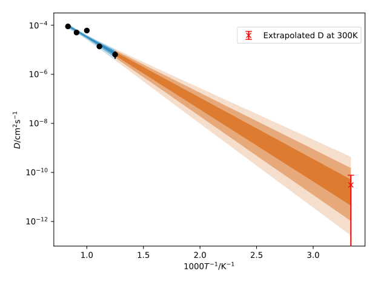]
]

---

count: false

## Ionic conductivity estimation

.left-column[
For each material and method:
1. 100 ps MD at 5 temperatures: 800, 900, 1000, 1100 and 1200 K.
2. Obtain the slope $D$ of the mean square displacement of Li over time.
3. Extrapolate to room temperature via Arrhenius.
4. Estimate the ionic conductivity $\sigma$ via the Nernst-Einstein relation.
]

.right-column[
.center[]
.center[]
]

---

## Results
#### NequIP vs DFT vs experimental

.full-width[.center[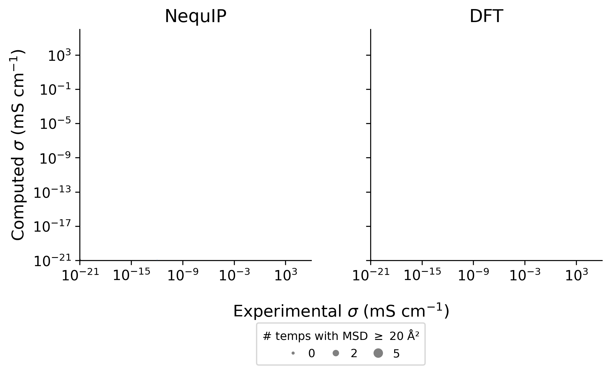]]

---

count: false

## Results
#### NequIP vs DFT vs experimental

.full-width[.center[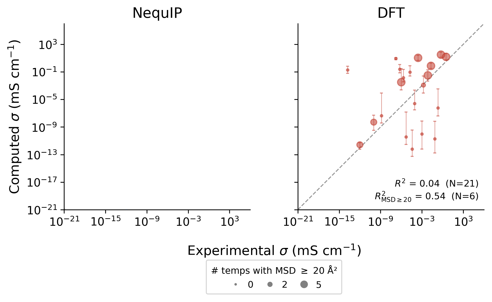]]

---

count: false

## Results
#### NequIP vs DFT vs experimental

.full-width[.center[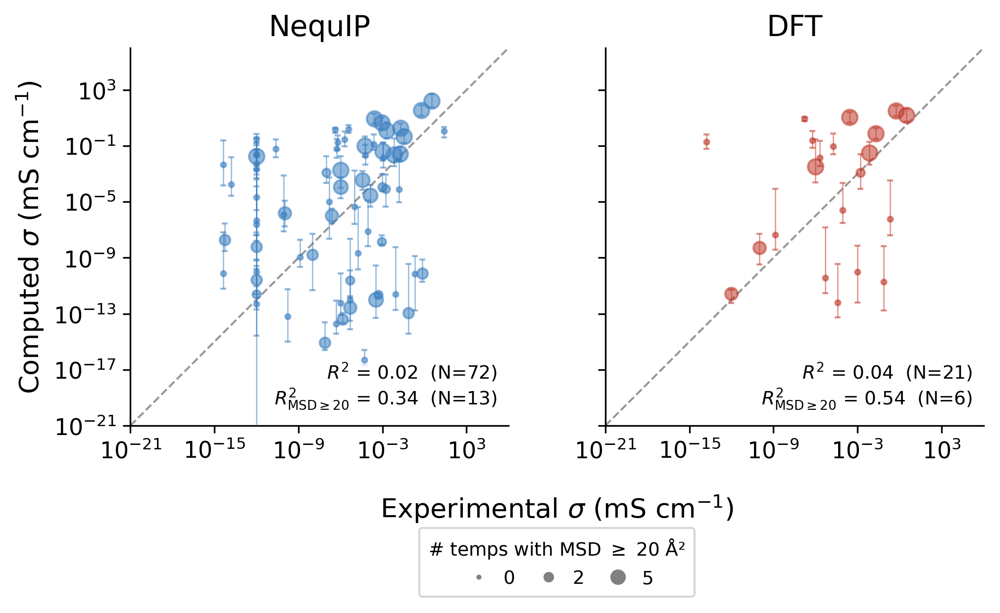]]

---

count: false

## Results
#### NequIP vs DFT vs experimental

.full-width[.center[]]

.conclusion[The DFT-estimated ionic conductivities exhibit weak correlation with experimental measurements (bad news), but the correlation of the MLIP-based estimations is only slightly weaker (good news).]

---

## Results: all vs. all

.left-column-66[.center[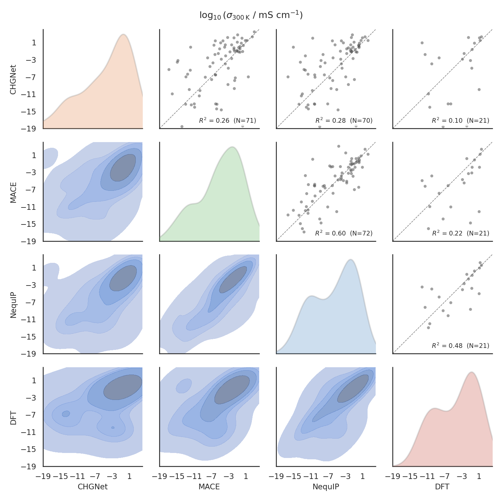]]

--

.right-column-33[
.conclusion-float[NequIP correlates best with DFT, then MACE, then CHGNet.]
]

--

.right-column-33[
.conclusion-float[NequIP and MACE are well correlated, more than with CHGNet.]
]

---

## Results
### Estimation time

We measure the wall time to estimate to ionic conductivity of each material with every method.

.center[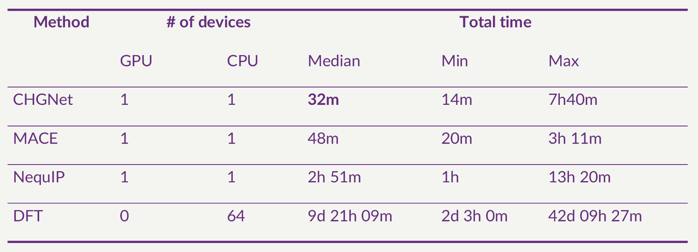]

.conclusion[DFT needs disproportionally more time than MLIPs; NequIP still needs about 3 hours per material, significantly longer than MACE.]

---

## Summary

- .h1[Crystal-GFN] offers a flexible framework for crystal structure generation with desirable properties and constraints, based on sequential decision making.
    - Mila AI4Science et al. [Crystal-GFN: sampling crystals with desirable properties and constraints](https://arxiv.org/abs/2310.04925). AI4Mat, NeurIPS 2023 (spotlight).
--
- .h1[OBELiX is a curated data set of nearly 600 materials with experimentally measured ionic conductivity], ready for ML use.
    - Therrien et al. [OBELiX: A curated dataset of crystal structures and experimentally measured ionic conductivities for lithium solid-state electrolytes](https://arxiv.org/abs/2502.14234), Digital Discovery, 2026.
--
- We have .h1[compared DFT and ML force fields for the estimation of ionic conductivities] in solid lithium electrolytees: both have similarly weak correlation with experimental values.
    - Shaaban Kabakibo et al. [A comparative study of molecular dynamics approaches for simulating ionic conductivity in solid lithium electrolytes](https://arxiv.org/abs/2603.28012), AI4Mat, ICML 2026.
--
- .h1[Multi-fidelity active learning] with generative models can be effective at exploring large candidate spaces with expensive validation methods.
    - Hernandez-Garcia, Saxena et al. [Multi-fidelity active learning with GFlowNets](https://arxiv.org/abs/2306.11715). TMLR, 2024 

---

## Acknowledgements

.left-column-33[.center[]

Paper: [arxiv.org/abs/2603.28012](https://arxiv.org/abs/2603.28012)
Funding and support: NRC, Calcul Québec,and the Digital Research Alliance of Canada, NSERC Doctoral program, FRQNT Doctoral research scholarship program and RQMP.
]

.right-column-66[.center[]]

---

## Looking for an internship?

.center[We look for students interested in .h1[4-6 months (paid!) research internships] to work on ML for materials!]

- Dates: September 2026 - March 2027
- Location: Mila in Montreal
- Relevant background:
    - Machine learning basics
    - Generative modelling (GFlowNets)
    - Active learning and Bayesian optimisation
    - MLIPs
    - DFT
    - ...
- Applications:
    - Solid-state electrolytes for batteries
    - Electrocatalysts for HER and OER
    - General machine learning for materials
    - ...

---

name: cemdi-paims-jul26
class: title, middle

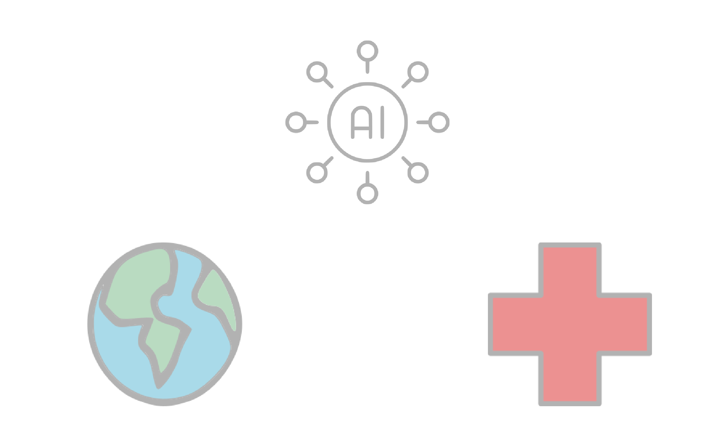

Alex Hernandez-Garcia, Dounia Shaaban Kabakibo, Divya Sharma, Félix Therrien, Lena Podina...

.center[

&nbsp&nbsp&nbsp&nbsp

&nbsp&nbsp&nbsp&nbsp

&nbsp&nbsp&nbsp&nbsp

]

.footer[[alexhernandezgarcia.com](https://alexhernandezgarcia.com/) | [alex.hernandez-garcia@mila.quebec](mailto:alex.hernandez-garcia@mila.quebec)] | [alexhergar.bsky.social](https://bsky.app/profile/alexhergar.bsky.social)  

.smaller[.footer[
Slides: [alexhernandezgarcia.com/slides/{{ name }}](https://alexhernandezgarcia.com/slides/{{ name }})
]]
