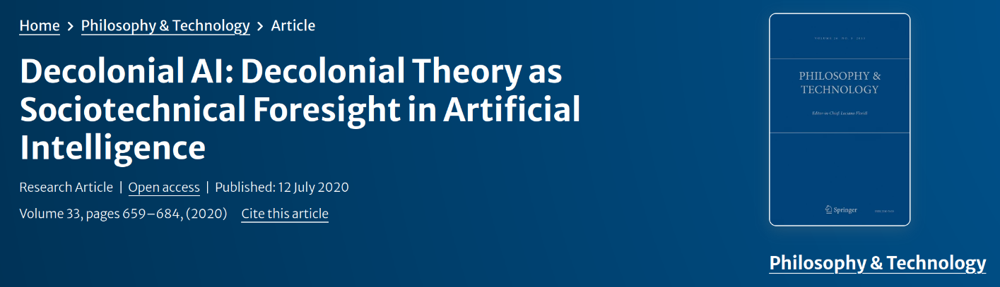

name: critical-science-rg-20250502
class: title, middle

## Critical Science RG
#### Decolonial AI: Decolonial Theory as Sociotechnical Foresight in Artificial Intelligence

.turquoise[Mila · Montreal · May 2nd 2025]

.center[

]

.smaller[.footer[
Slides: [alexhernandezgarcia.github.io/slides/{{ name }}](https://alexhernandezgarcia.github.io/slides/{{ name }})
]]

---

## The paper and the authors

.center[

]

--

.columns-3-left[
.center[]
.center[[Shakir Mohamed](https://shakirm.com/), DeepMind]
]
.columns-3-center[
.center[]
.center[[Marie-Therese Png](https://www.marietheresepng.com/), Oxford University]
]
.columns-3-right[
.center[]
.center[[William Isaac](https://scholar.google.com/citations?user=7WW10GYAAAAJ&hl=en), DeepMind]
]

???

- Shakir Mohamed: Director for research at Google DeepMind
- Marie-Therese Png: AI Ethics expert and PhD candidate at Oxford University
- William Isaac: Principal Scientist and Head of Ethics Research at Google DeepMind

---

## Overall summary

> _This paper explores the important role of critical science, and in particular of .highlight1[post-colonial and decolonial theories], in understanding and shaping the ongoing advances in artificial intelligence._

--

> _.highlight1[Decolonial theories] use historical hindsight to explain patterns of power that shape our intellectual, political, economic, and social world._

--

Pro-active goal: "By embedding a decolonial critical approach within its technical practice, AI communities can develop foresight and tactics that can better align research and technology development with established ethical principles."

---

## How values shape scientific knowledge and technology

--

> _The ongoing advances in artificial intelligence (AI), and innovations in technology more generally, encompass ever-larger aspects of the cultural, economic and political life of modern society._

--

AI .highlight1[as an object]:

- Advances in AI research have led to .highlight1[novel applications in many sectors].
- Despite some benefits, it is clear these innovations have the .highlight1[potential to be abused or misused] in ways their designers could not have imagined.

--

AI .highlight1[as a subject]:

- AI is no longer an obscure area of computer science
- AI has become a technological artefact embedded .highlight1[within governments, industry and civil society].
- These stakeholders play a significant role in shaping future directions.

---

## How values shape scientific knowledge and technology
### Questions

The paper poses some questions it aims at answering, which can serve as discussion points for us too:

- What values and norms should we aim to uphold when performing research or deployment of systems based on artificial intelligence?
- In what ways do failures to account for asymmetrical power dynamics undermine our ability to mitigate identified harms from AI?
- How do unacknowledged and unquestioned systems of values and power inhibit our ability to assess harms and failures in the future?

---

## On the role of values in the generation of knowledge

> The role that values play in the process of generating new knowledge is a perennial question, particularly in the sciences.

--

#### Epistemic values

The values that shape the veracity of scientific statements: internal consistency, falsifiability, generalisability of a particular theory, notions of scientific objectivity...

--

#### Contextual values

Science is a product not only of epistemic values, but also of .highlight[contextual values that reflect moral, societal or personal concerns in the application of scientific knowledge]. 

> There is strong consensus that non-epistemic values have a legitimate role in scientific reasoning, particularly in the choice of research projects and the application of scientific results.

---

## Instances of unethical research

Despite efforts to establish ethical principles to guide research, violations continue to occur.

- As AI and other advanced technologies become enmeshed within high-stakes spheres of our society, more problems arise
- According to the authors, it is important to consider .highlight1[the intersection of values and power]: whose values are being represented, and the .highlight1[structural inequities that result in an unequal spread of benefits and risk] within and across societies.

--

#### Example

A widely used prediction algorithm for selecting entry into healthcare programs was exhibiting racial bias against African-American patients.

--

.conclusion[The unique manner in which AI algorithms can quickly ingest, perpetuate, and legitimise forms of bias and harm represents a step change from previous technologies.]

---

## Critical science as a sociotechnical foresight tool

> _We argue that the field of AI would benefit from dynamic and robust foresight .highlight1[tactics and methodologies grounded in the critical sciences] to better identify limitations of a given technology and their prospective ethical and social harms._

--

Critical sciences: a loosely associated group of disciplines that seek to uncover the underlying cultural assumptions that dominate a field of study and the broader society, which aims to examine issues of values, culture and power at play between stakeholders and technological artefacts.

--

This paper particularly emphasises .highlight1[the role of post-colonial and decolonial critical theories], which is in turn deeply entangled with the .highlight1[critical theories of race, feminism, law, queerness, and science and technology studies].

.references[The paper provides a brief review of the literature in these disciplines.]

---

## Coloniality and Decolonial Theory

> _Decolonisation refers to the intellectual, political, economic and societal work concerned with the restoration of land and life following the end of historical colonial periods. Territorial appropriation, exploitation of the natural environment and of human labour, and direct control of social structures are the characteristics of historical colonialism._

--

> _Coloniality is what survives colonialism_

The continuation of power dynamics between those advantaged and disadvantaged by the historical processes of dispossession, enslavement, appropriation and extraction central to the emergence of the modern world.

--

Decolonisation takes two roles:
- Territorial decolonisation
- Structural decolonisation

---

## Views on the decolonial knowledge landscape

- A .highlight2[decentring view] of decolonisation seeks to reject an imitation of the West in all aspects of life.
    - Example: replacing the English language as the unassailable medium of teaching and discourse.
--
- An .highlight2[additive-inclusive view] continues to use existing knowledge, but in ways that recognises explicitly the value of new and alternative approaches, and that supports environments in which new ways of creating knowledge can genuinely flourish.
    - Example: critique of universalism and advocacy for localisation and pluriversalism.
--
- An .highlight2[engagement view] calls directly for more critical views of science.
    - Examines scientific practice from the margins, to place the needs of marginalised populations at the centre of the design and research process, and to ask where knowledge comes from, who is included and left out, in whose interest is science applied, who is silenced, and what unacknowledged assumptions might be at play.

---

## Tools from decolonial theory

The analysis of metropoles (centres of power) vs. peripheries could be applied to the analysis of AI development:

Today's technology corporations could be described as metropoles of technological power with civic society and consumers sitting at the periphery.

--

However, we should be mindful not to oversimplify reality into binaries such as ‘West and the rest’, ‘North and South’, ‘powerful and oppressed’

---

## Algorithmic coloniality

> _Digital spaces form digital territories that, like physical spaces, have the propensity to become sites of extraction and exploitation, and thus the sites of digital-territorial coloniality. [...] Emerging technologies like AI are directly subject to coloniality, giving decolonial critical theories a powerful analytical role._

--

The paper seeks to "introduce the language of decoloniality to the current discourse on fairness, accountability, and transparency in algorithmic systems, as well as introduce a taxonomy of decolonial foresight: institutionalised .highlight1[algorithmic oppression], .highlight1[algorithmic exploitation], and .highlight1[algorithmic dispossession].

--

Additionally, the paper identifies .highlight1[sites of coloniality].

---

## Algorithmic opression

Algorithmic oppression extends the unjust subordination of one social group and the privileging of another.

--

#### Site 1: Algorithmic Decision Systems

Predictive systems leveraging AI have led to the formation of new types of policing and surveillance. These systems risk entrenching historical injustice and amplify social biases in the data used to develop them.

---

## Algorithmic exploitation

Algorithmic exploitation considers the ways in which institutional actors and industries that surround algorithmic tools take advantage of (often already marginalised) people by unfair or unethical means, for the asymmetrical benefit of these industries.

--

#### Site 2: Ghost Workers

Many of the recent successes in AI are possible only when the large volumes of data needed are annotated by human experts. This establishes a form of knowledge and labour extraction, paid at very low rates, and with little consideration for working conditions, support systems and safeties.

--

#### Site 3: Beta-testing

There is a long and well-documented history on the exploitation of marginalised populations for the purpose of scientific and technological progress.

- Ethics dumping, such as the case of Cambridge Analytica.
- Palantir was found to have experimentally deployed predictive algorithms in the city of New Orleans, with a disproportionate impact on African-Americans.

---

## Algorithmic dispossession

Algorithmic dispossession describes how, in the growing digital economy, certain regulatory policies result in a centralisation of power, assets, or rights in the hands of a minority and the deprivation of power, assets, or rights from a disempowered majority

--

#### Site 4: National Policies and AI Governance

We must contend with questions of who any AI regulatory norms and standards are protecting, who is empowered to project these norms, and the risks posed by a minority continuing to benefit from the centralisation of power and capital through mechanisms of dispossession.

--

#### Site 5: International Social Development

Much of the current policy discourse surrounding AI in developing countries is in economic and social development where advanced technologies are propounded as solutions for complex developmental scenarios.

---

## Decolonial AI – A Call to Rethink

- AI reflects the .highlight1[coloniality of power] as both object and subject
- Challenge embedded logics of dominance in systems and infrastructures
- The authors propose **three key tactics** to counter systemic harm:
    - Critical technical practice
    - Reciprocal engagement
    - Rebuilding community

---

## Tactic 1 – Critical Technical Practice

- CTP (Agre, 1997): Blend technical work with critical reflection
- .highlight1[Heterogeneous engineering]: Tech shaped by technical, social, political, and cultural forces
- Together, they form a heterogeneous-critical practice
- Action areas:
    - Research
    - Community organizing
    - Real-world testing
    - Policy influence
    - Activism
- Key focus areas:
    - Algorithmic fairness
    - AI safety
    - Equity & diversity
    - Policy-making
    - AI as a tool of resistance

---

## Tactic 2 – Reciprocal Engagement & Plural Knowledges

- Colonized communities have long shaped dominant worldviews
- Challenge: What counts as knowledge?
    - **Universal & fixed** vs. **relational & evolving**
- Toward .highlight1[plural epistemologies] and co-created design
- Modes of engagement:
    - **Dialogue** – mutual learning
    - **Documentation** – data sheets, model cards, feedback
    - **Design** – systems shaped by diverse perspectives

---

## Tactic 3 – Renewing Affective & Political Communities
- Move beyond paternalistic and hierarchical AI development
- Center solidarity, mutual care, and collective agency
- Two critical tools:
    - Contrapuntal analysis (Said, 1993): Reveal binaries (West/rest, natural/artificial) and hold multiple perspectives
    - Grassroots support: Empower local, justice-oriented tech movements
