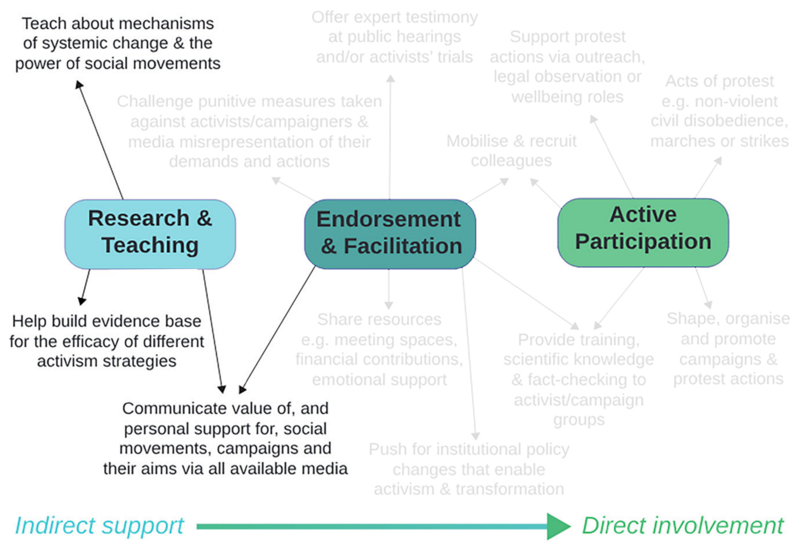
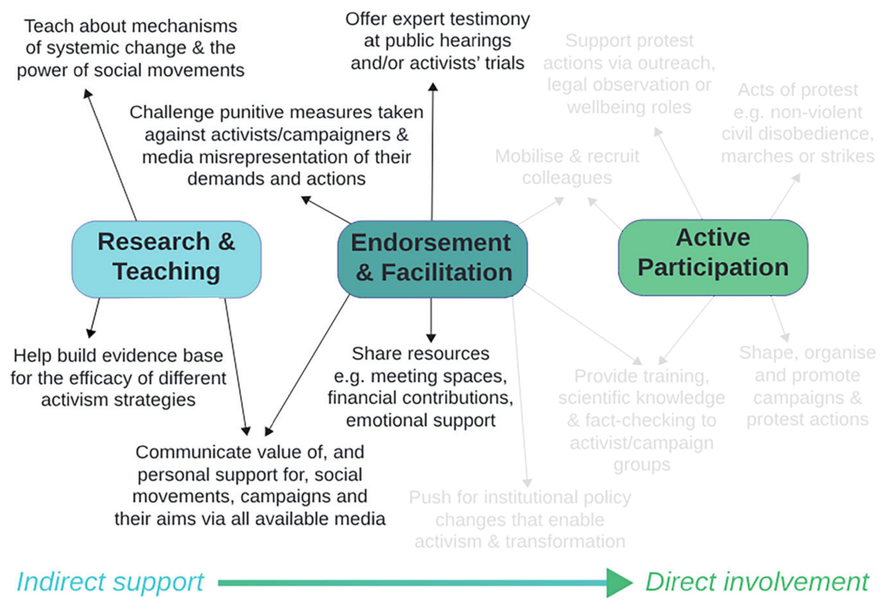

name: critical-science-rg-20251024
class: title, middle

## Critical Science RG
#### How scientists can contribute to the social movements essential to protecting climate and nature

.turquoise[Mila · Montreal · October 24th 2025]

.center[

]

.smaller[.footer[
Slides: [alexhernandezgarcia.github.io/slides/{{ name }}](https://alexhernandezgarcia.github.io/slides/{{ name }})
]]

---

## The paper and the authors

.center[

]

--

.left-column[
- Abigail J. Perrin (University of York, UK)
- Stuart Capstick (Cardiff University, UK)
- Tracey Elliott (Independent consultant, UK)
- Peter Knapp (Imperial College London, UK)
]
.right-column[
- Aaron Thierry (Cardiff University, UK)
- Tristram D. Wyatt (University of Oxford, UK)
- Charlie J. Gardner (University of Kent, UK)
]

---

## Overall summary

_This paper explores the practical ways scientists across all disciplines, backgrounds and career stages can be involved in activism._

--

.highlight1[Scientists can participate in social movements]:

- As members
- Behind the scenes

--

The Intergovernmental Panel on Climate Change recognises, with "high confidence", that "collective action as part of social or lifestyle movements underpins system change".

--

_But it is important not just to express concerns verbally and in writing but to act in ways commensurate with our warnings. In doing so, our message rings true and can hit home. In not doing so, we risk undermining our own advice._

---

## Mismatch between willingness to act and actual action

> Many scientists have indicated they are willing to join social movements but are not currently doing so in practice.

|                                    | Willingness | Engagement |
| ---------------------------------: | :---------: | :--------: |
| **Climate advocacy**               | 58 %        | 29 %       |
| **Legal protests**                 | 47 %        | 23 %       |
| **Non-violent civil disobedience** | 45 %        | 10 %       |

---

## What are the reasons?

.context[Many scientists indicate they are willing to join social movements but are not currently doing so in practice.]

 
- Political crackdowns on protest in many countries
- Systemic barriers to participation for scientists of colour or other discriminated-against groups
- Precarious contracts
- Caring responsibilities

--

However, even those scientists who are willing to become more involved in any form of climate advocacy have reported barriers and concerns.

- Lack of the required skills
- Fear, even if unwarranted, of losing credibility
- Fear of losing public trust and/or professional reputation
- Impact on employment prospects
- Lack of timee, opportunities or institutional support to engage
- Experiences of anxiety or burnout

---

## How can scientists contribute to social movements?

.center[]

---

count: false

## How can scientists contribute to social movements?

.center[]

---

count: false

## How can scientists contribute to social movements?

.center[]

---

count: false

## How can scientists contribute to social movements?

.center[]

---

count: false

## How can scientists contribute to social movements?

.center[]

---

count: false

## How can scientists contribute to social movements?

.center[]

---

count: false

## How can scientists contribute to social movements?

.center[]

---

count: false

## How can scientists contribute to social movements?

.center[]

---

count: false

## How can scientists contribute to social movements?

.center[]

---

count: false

## How can scientists contribute to social movements?

.center[]

---

count: false

## How can scientists contribute to social movements?

.center[]

---

count: false

## How can scientists contribute to social movements?

.center[]

---

count: false

## How can scientists contribute to social movements?

.center[]

---

## Discussion

- Should scientist participate in social movements at all?
- Are you willing to participate in climate advocacy, legal protests and/or non-violent civil disobedience?
- Have you done it yet?
- What are the main reasons for you?
- What are the relevant aspects of our particular context? In computer science or AI research? In Montréal or Canada? At Mila?
