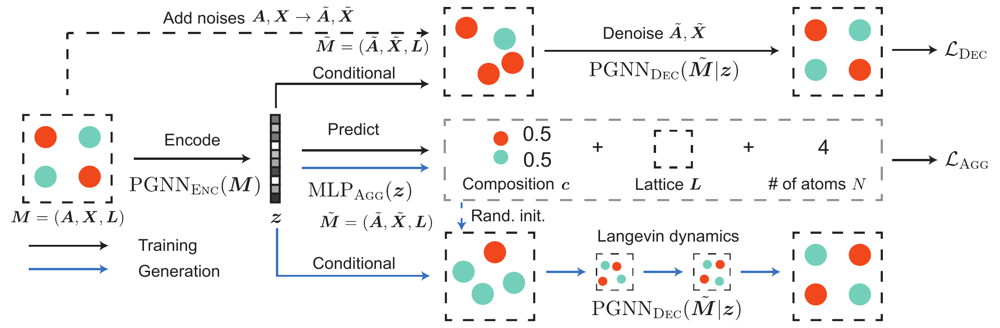
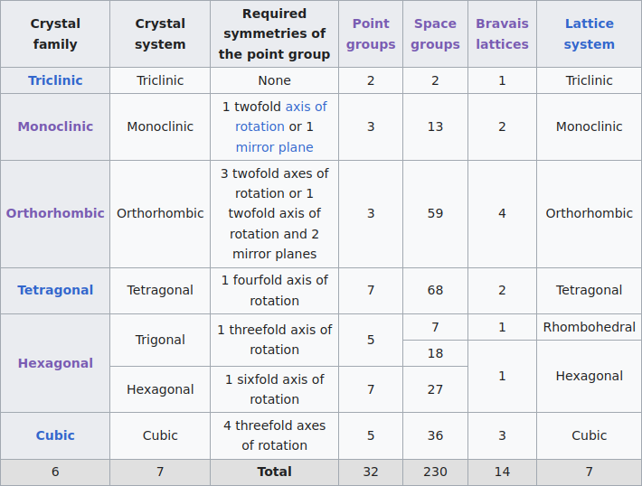
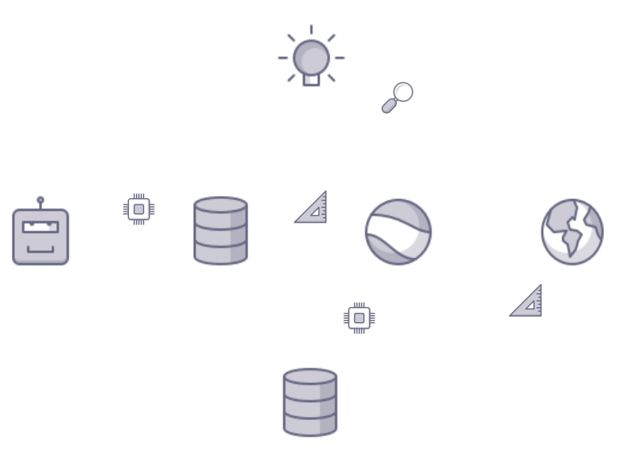

name: title
class: title, middle

## GFlowNets to generate crystal structures
### _Work in progress_: a presentation of ideas and plans

Alex Hernández-García (he/il/él)

.smaller[Divya Sharma, Michał Koziarski, Alexandra Volokhova, Victor Schmidt, Alexandre Duval, Oumar Kaba, Yasmine Benabed]

.turquoise[GFlowNets at Mila · March 28th 2023]

.center[

&nbsp&nbsp&nbsp&nbsp

]

.smaller[.footer[
Slides: [alexhernandezgarcia.github.io/slides/crystal-gflownets](https://alexhernandezgarcia.github.io/slides/crystal-gflownets)
]]

---

## What are crystals?

[Wikipedia](https://en.wikipedia.org/wiki/Crystal): A crystal or crystalline solid is a solid material whose constituents (such as atoms, molecules, or ions) are arranged in a .highlight1[highly ordered microscopic structure], forming .highlight1[a crystal lattice that extends in all directions].

.left-column[
.center[]
]
.right-column[
.center[]
]

--

Here, we are concerned mainly with _inorganic crystals_, where the constituents are atoms or ions.

--

A crystal structure is characterized by its .highlight1[unit cell], a small imaginary box containing atoms in a specific spatial arrangement with certain symmetry. The unit cell repeats iself periodically in all directions.

---

## Why do we care about crystals?

Many solid state materials are crystal structures and they are a core component of .highlight1[solar cells, batteries, electrocatalysts], etc.

--

Accelerating .highlight1[material discovery is key in the climate crisis] .cite[IPCC Sixth Assessment Report, 2022]:  
* Improving material efficiency can reduce 0.93 ($\pm$ 0.23) GtCO₂-eq per year.
* Fuel switching can reduce 2.1 ($\pm$ 0.52) GtCO₂-eq per year, only in the industry sector. 
* Carbon capture and storage can reduce 0.54 ($\pm$ 0.27) GtCO₂-eq per year in the energy sector.

.smaller[.footnote[† Global anthropogenic emissions in 2019 were estimated in 59 ($\pm$ 6.6) GtCO₂-eq. The budget from 2020 to limit warming to 1.5°C is estimated in 510 ($\pm$ 180) GtCO₂-eq.]]

--

However, .highlight1[material modelling is very challenging]:
* Limited data: only about 200k known inorganic materials, but potentially $10^{180} possible stable materials (for reference: more than a billion molecules are known)
* Sparsity: .highlight2[stable materials] only exist in a low-dimensional subspace of all possible 3D arrangements.

---

## Related work

Example: .highlight2[Crystal Diffusion Variational Autoencoder (CDVAE)]: a diffusion process that moves .highlight1[atomic coordinates] towards a lower energy state and updates atom types to satisfy bonding preferences between neighbors. The key idea is to learn the diffusion process from the data distribution of stable materials. .cite[(Xie et al., 2022)]

.center[]

.references[Xie et al. [Crystal diffusion variational autoencoder for periodic material generation](https://arxiv.org/abs/2110.06197). ICLR 2022] 

???

A: atom types
X: atom coordinates
L: perdiodic lattice: l1, l2, l3 (3x3)

---

## Our proposal
### Crystal structure parameters

.context[CDVAE and other works tackle crystal structure generation in the space of atom coordinates.]

Instead of optimising the atom positions to generate stable materials by learning from a small data set, we propose to .highlight1[learn to generate materials in a lower-dimensional space of crystal structure parameters].

.left-column[
.center[]
]
.right-column[
.center[]
]

.conclusion[The symmetry of a crystal is determined by one 230 possible space groups. The shape and size of the unit cell is defined by 6 parameters: $a, b, c, \alpha, \beta, \gamma$.]

---

## Our proposal
### Motivation and hypothesis

.context[We want to generate materials in the low-dimensional space of crystal structure parameters.]

.highlight1[Hypothesis A]: materials represented by their crystal structure parameters may be predictive of relevant properties.

.highlight1[Hypothesis B]: searching in the lower-dimensional space of crystal structure parameters may be more efficient than in the space of atom coordinates.

.center[]

---

## Crystal GFlowNet

* .highlight1[State space]: 
    * Stoichiometry: how many atoms of which elements (discrete)
    * Space group: 230 options, subdivided into crystal system, crystal lattice and point symmetry (discrete)
    * Lattice parameters: 6 parameters, $a, b, c, \alpha, \beta, \gamma$ (continuous)
    * Wyckoff positions: additional information about the arrangement of atoms in the unit cell (optional, discrete)
* .highlight1[Action space]: discrete and continuous movements in the subspace of the state space, with constraints.

Key advantage of GFlowNets: .highlight1[flexibility to incorporate domain knowledge] in the generation structure.

---

name: title
class: title, middle

## Thanks! Questions? 

Alex Hernández-García (he/il/él)

.center[

&nbsp&nbsp&nbsp&nbsp

]

.footer[[alexhernandezgarcia.github.io](https://alexhernandezgarcia.github.io/) | [alex.hernandez-garcia@mila.quebec](mailto:alex.hernandez-garcia@mila.quebec)] 
.footer[[@alexhg@scholar.social](https://scholar.social/@alexhg)  | [@alexhdezgcia](https://twitter.com/alexhdezgcia) ]

.smaller[.footer[
Slides: [alexhernandezgarcia.github.io/slides/crystal-gflownets](https://alexhernandezgarcia.github.io/slides/crystal-gflownets)
]]

