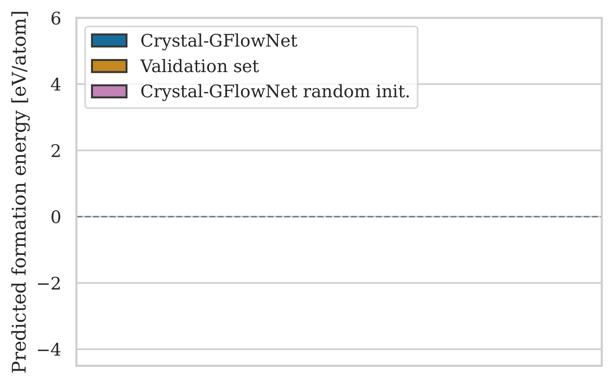
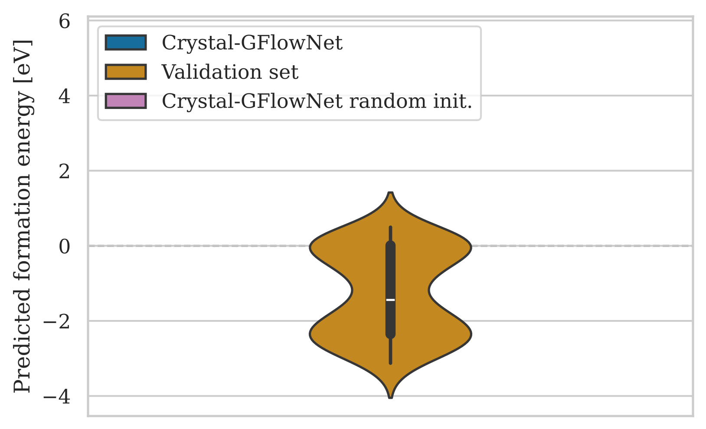
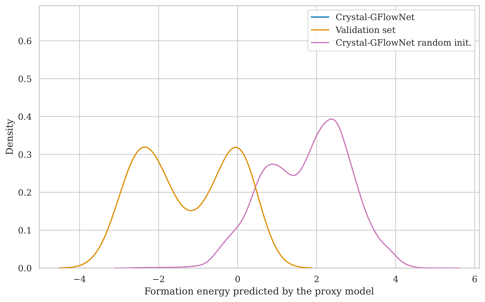
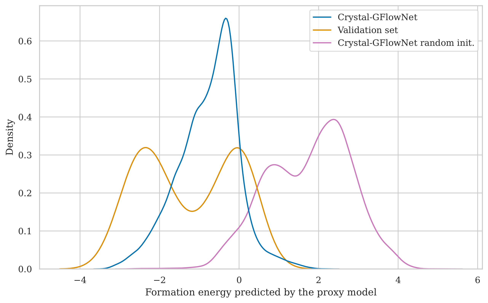

name: title
class: title, middle

## Crystal-GFN
### Sampling crystals with desirable properties and constraints

Alex Hernández-García (he/il/él)

.smaller[Divya Sharma, Michał Koziarski, Alexandra Volokhova, Victor Schmidt, Alexandre Duval, Pierre Luc Carrier, Yasmine Benabed]

.turquoise[Mila GFlowNet Workshop · Montreal · November 10th 2023]

.center[

&nbsp&nbsp&nbsp&nbsp

]

.smaller[.footer[
Slides: [alexhernandezgarcia.github.io/slides/crystal-gfn-nov23](https://alexhernandezgarcia.github.io/slides/crystal-gfn-nov23)
]]

---

## What are crystals?

[Wikipedia](https://en.wikipedia.org/wiki/Crystal): A crystal or crystalline solid is a solid material whose constituents (such as atoms, molecules, or ions) are arranged in a .highlight1[highly ordered microscopic structure], forming .highlight1[a crystal lattice that extends in all directions].

.left-column[
.center[]
]
.right-column[
.center[]
]

--

Here, we are concerned mainly with _inorganic crystals_, where the constituents are atoms or ions.

--

A crystal structure is characterized by its .highlight1[unit cell], a small imaginary box containing atoms in a specific spatial arrangement with certain symmetry. The unit cell repeats iself periodically in all directions.

---

## Why do we care about crystals?

Many solid state materials are crystal structures and they are a core component of .highlight1[solar cells, batteries, electrocatalysts], etc.

--

Accelerating .highlight1[material discovery is key in the climate crisis] .cite[IPCC Sixth Assessment Report, 2022]:  
* Improving material efficiency can reduce 0.93 ($\pm$ 0.23) GtCO₂-eq per year.
* Fuel switching can reduce 2.1 ($\pm$ 0.52) GtCO₂-eq per year, only in the industry sector. 
* Carbon capture and storage can reduce 0.54 ($\pm$ 0.27) GtCO₂-eq per year in the energy sector.

.smaller[.footnote[† Global anthropogenic emissions in 2019 were estimated in 59 ($\pm$ 6.6) GtCO₂-eq. The budget from 2020 to limit warming to 1.5°C is estimated in 510 ($\pm$ 180) GtCO₂-eq.]]

--

However, .highlight1[material modelling is very challenging]:
* Limited data: only about 200 K known inorganic materials, but potentially $10^{180}$ possible stable materials (for reference: more than a billion molecules are known)
* Sparsity: .highlight2[stable materials] only exist in a low-dimensional subspace of all possible 3D arrangements.

---

## Related work

Example: .highlight2[Crystal Diffusion Variational Autoencoder (CDVAE)]: a diffusion process that moves .highlight1[atomic coordinates] towards a lower energy state and updates atom types to satisfy bonding preferences between neighbors. The key idea is to learn the diffusion process from the data distribution of stable materials. .cite[(Xie et al., 2022)]

.center[]

.references[Xie et al. [Crystal diffusion variational autoencoder for periodic material generation](https://arxiv.org/abs/2110.06197). ICLR 2022] 

???

A: atom types
X: atom coordinates
L: perdiodic lattice: l1, l2, l3 (3x3)

---

## Our proposal
### Crystal structure parameters

.context[CDVAE and other works tackle crystal structure generation in the space of atom coordinates.]

Instead of optimising the atom positions by learning from a small data set, we draw .highlight1[inspiration from theoretical crystallography to sample crystals in a lower-dimensional space of crystal structure parameters].

.left-column[
.center[]
]
.right-column[
.center[]
]

.conclusion[The symmetry of a crystal is determined by one 230 possible space groups. The shape and size of the unit cell is defined by 6 parameters: $a, b, c, \alpha, \beta, \gamma$.]

---

## GFlowNet approach
### Advantages

.context[We generate materials in the lower-dimensional space of crystal structure parameters.]

* Materials represented by their crystal structure parameters are still .highlight1[predictive of relevant properties].

* Constructing materials by their crystal structure parameters allows us to introduce .highlight1[chemical, physical and geometric constraints].

* .highlight1[Searching in the lower-dimensional space] of crystal structure parameters may be more efficient than in the space of atom coordinates.

.center[]

---

## Crystal-GFlowNet
### Main properties

* .highlight1[State space]: 
    1. **Composition**: how many atoms of which elements (discrete)
    2. **Space group**: 230 groups, subdivided into crystal system, lattice system, point symmetry and space group (discrete)
    3. **Lattice parameters**: 6 parameters, $a, b, c, \alpha, \beta, \gamma$ (continuous)
* .highlight1[Action space]: discrete and continuous movements in the subspace of the state space, with constraints.
* .highlight1[Constraints]:
    * Charge neutrality of the composition.
    * Compatibility of composition and space group.
    * Hierarchical structure of the space group.
    * Compatibility of lattice parameters and lattice system.

---

## Results

.center[]

---

count: false

## Results

.center[]

---

count: false

## Results

.context[10,000 crystals randomly sampled.]

.center[]

---

count: false

## Results

.context[10,000 crystals sampled from a trained GFlowNet.]

.center[]

---

name: title
class: title, middle

## Summary and conclusions

.center[]

---

## Summary and conclusions

* Discovering new crystal structures with desirable properties can help mitigate the climate crisis.
* There are infinitely many conceivable crystals. Only a few are stable. Only a few stable crystals have interesting properties.
* GFlowNets enable the introduction of .highlight1[geometrical and physical constraints] to reduce the search space.
* Our results show that we can sample diverse, high scoring samples with the desired constraints.

.references[
* Mila AI4Science et al. [Crystal-GFN: sampling crystals with desirable properties and constraints](https://arxiv.org/abs/2310.04925). AI4Mat, NeurIPS 2023 (spotlight).
* Hernandez-Garcia, Saxena et al. [Multi-fidelity active learning with GFlowNets](https://arxiv.org/abs/2306.11715). RealML, NeurIPS 2023.
* Jain et al. [GFlowNets for AI-Driven Scientific Discovery](https://arxiv.org/abs/2302.00615). Digital Discovery, Royal Society of Chemistry, 2023.
]

--

.highlight2[Open source code]: [github.com/alexhernandezgarcia/gflownet](https://github.com/alexhernandezgarcia/gflownet)

---

## Acknowledgements

.left-column[
* Alexandre Duval
* Alexandra Volokhova
* Pierre Luc Carrier
* Divya Sharma
* Victor Schmidt
* Yasmine Benabed
* Michał Koziarski
* Yoshua Bengio
* ...
]

---

name: title
class: title, middle

Alex Hernández-García (he/il/él)

.center[

&nbsp&nbsp&nbsp&nbsp

]

.footer[[alexhernandezgarcia.github.io](https://alexhernandezgarcia.github.io/) | [alex.hernandez-garcia@mila.quebec](mailto:alex.hernandez-garcia@mila.quebec)] 
.footer[[@alexhg@scholar.social](https://scholar.social/@alexhg)  | [@alexhdezgcia](https://twitter.com/alexhdezgcia) ]

