name: title
class: title, middle

## Global visual salience of competing stimuli

.bigger[Alex Hernández-García (he/él)]

Ricardo Ramos Gameiro & Alessandro Grillini & Peter König

.gray224[European Conference on Visual Perception (ECVP) 2021 · The Internet · August 25th 2021]

.center[

&nbsp&nbsp&nbsp&nbsp

&nbsp&nbsp&nbsp&nbsp

&nbsp&nbsp&nbsp&nbsp

]

.footer[[alexhernandezgarcia.github.io](https://alexhernandezgarcia.github.io/) | [alex.hernandez-garcia@mila.quebec](mailto:alex.hernandez-garcia@mila.quebec) | [@alexhdezgcia](https://twitter.com/alexhdezgcia)] 

---

## Motivation

.context[Ultimate underlying goal: understanding visual attention]

.center[Accurate computational models of visual salience are already available .cite[(Kümmerer et al. 2016)]]

.center[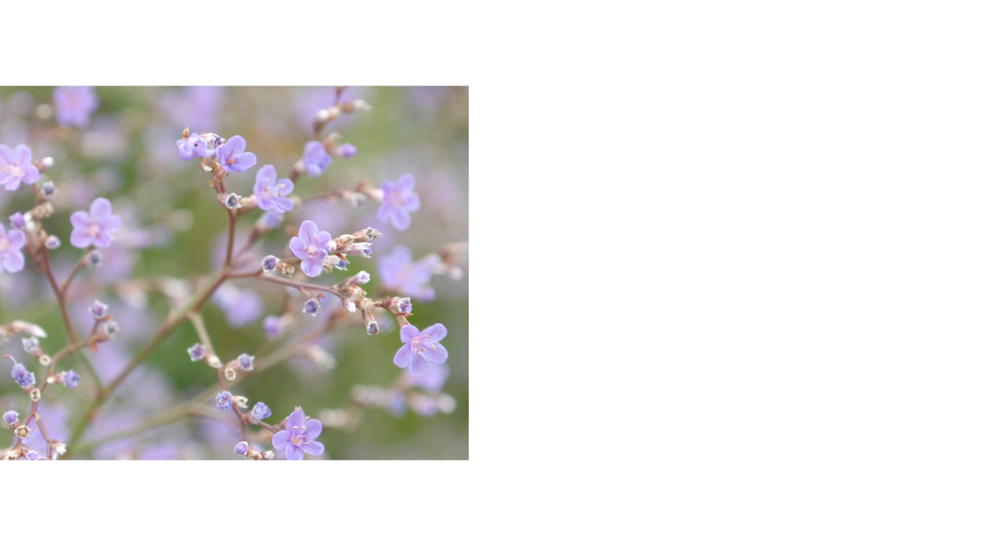]

.references[Kümmerer et al. [DeepGaze II: Reading fixations from deep features trained on object recognition](https://arxiv.org/abs/1610.01563). arXiv 1610.01563, 2016]

---

count: false

## Motivation

.context[Ultimate underlying goal: understanding visual attention]

.center[Accurate computational models of visual salience are already available .cite[(Kümmerer et al. 2016)]]

.center[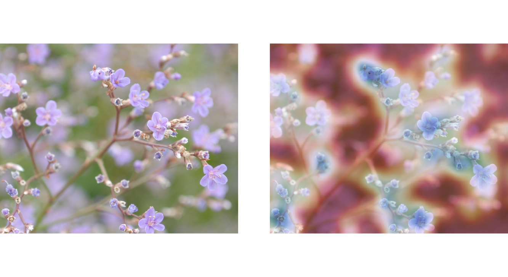]

.references[Kümmerer et al. [DeepGaze II: Reading fixations from deep features trained on object recognition](https://arxiv.org/abs/1610.01563). arXiv 1610.01563, 2016]

---

## Motivation

.context[Ultimate underlying goal: understanding visual attention]

.center[Accurate computational models of visual salience are already available .cite[(Kümmerer et al. 2016)]]

.center[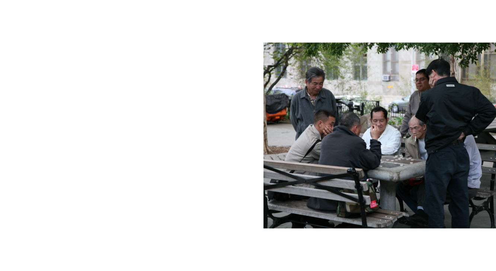]

.references[Kümmerer et al. [DeepGaze II: Reading fixations from deep features trained on object recognition](https://arxiv.org/abs/1610.01563). arXiv 1610.01563, 2016]

---

count: false

## Motivation

.context[Ultimate underlying goal: understanding visual attention]

.center[Accurate computational models of visual salience are already available .cite[(Kümmerer et al. 2016)]]

.center[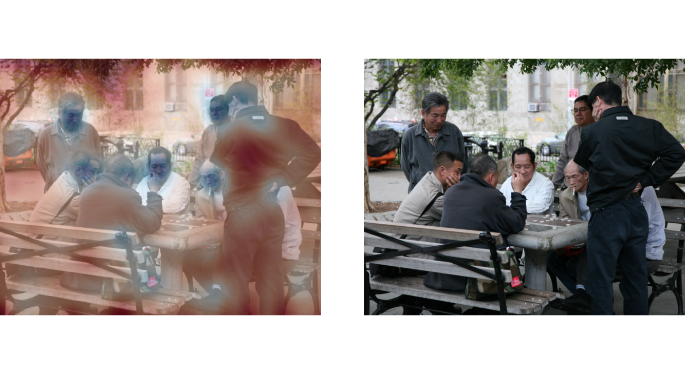]

.references[Kümmerer et al. [DeepGaze II: Reading fixations from deep features trained on object recognition](https://arxiv.org/abs/1610.01563). arXiv 1610.01563, 2016]

---

count: false

## Motivation

.context[Ultimate underlying goal: understanding visual attention]

.center[What if several images _compete_ for our visual attention?]

.center[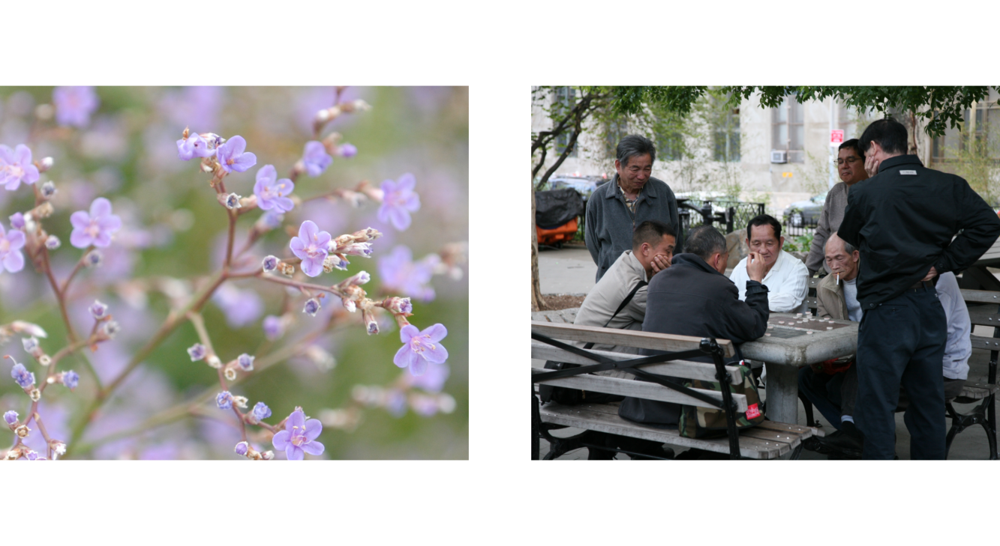]

---

count: false

## Motivation

.context[Ultimate underlying goal: understanding visual attention]

.center[Are some images, as a whole, more likely to attract human visual attention?]

.center[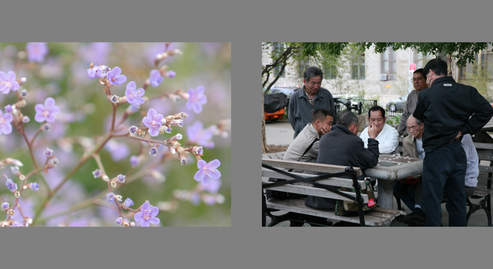]

---

count: false

## Motivation

.context[Ultimate underlying goal: understanding visual attention]

.center[_Global Visual Salience_]

.center[]

---

## Outline
### And main findings - spoiler!

--

1. [Data collection (eye tracking)](#datacollection)
--

2. [Computational model](#computationalmodel)
--

3. [Results](#results)
    * a. It is possible to measure the global salience of natural images
    * b. The global salience of images cannot be explained by their local salience properties
    * c. There is a strong spatial bias towards the left side
    * d. Task and familiarity with one image do not influence the first fixation
    * e. Images with larger global salience are explored for longer time

---

name: datacollection

## Data collection
### An eye-tracking experiment

* 200 images
* 6 categories
* 49 participants
* 200 trials per participant
* 3 seconds per trial
* Record first fixation after stimulus onset

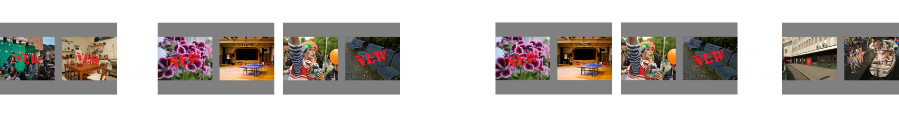

---

name: computationalmodel

## Computational model
### Logistic regression

.context[Can we learn a model of the behavioural visual responses?]

**Goal**: predict the location of the .highlight1[first fixation] (left or right) given a pair of images from the data.

--

#### Logistic regression for pairwise comparisons

* $u$: image on the left
* $v$: image on the right

--

$$
h_w(u,v) = p(u > v) = \frac{e^{w_u}}{e^{w_u} + e^{w_v}} = \frac{e^{w_u - w_v}}{1 - e^{w_u - w_v}}
$$

--

&nbsp&nbsp&nbsp&nbsp
.conclusion[If the model fits the data, each learnt coefficient $w_i$ should reflect the likelihood that image $i$ is fixated first.]

---

## Computational model
### Design matrix

.context[We want to model the location of the first fixation via logistic regression.]

We have a data set of 49 participants $\times$ 200 trials ($N=9800$), where we know which two images of $M=200$ were presented, $x_u$ and $x_v$, and which image was fixated first.

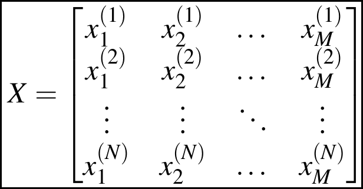

---

count: false

## Computational model
### Design matrix

.context[We want to model the location of the first fixation via logistic regression.]

We have a data set of 49 participants $\times$ 200 trials ($N=9800$), where we know which two images of $M=200$ were presented, $x_u$ and $x_v$, and which image was fixated first.

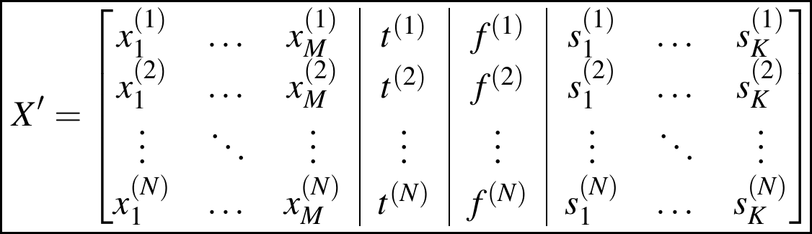

* $t$: task
* $f$: _familiarity_
* $s$: subject ($K=49$)

---

## Computational model
### Validation results

.context[Logistic regression model trained to predict the location of the first fixation given two images.]

&nbsp&nbsp&nbsp&nbsp
.center[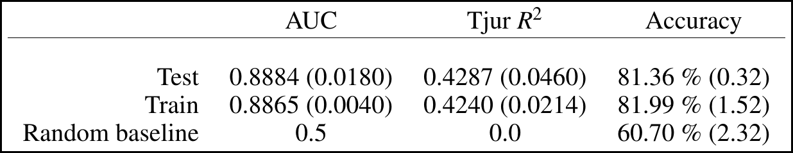]

&nbsp&nbsp&nbsp&nbsp
.conclusion[Since the model successfully learnt the behavioural patterns from the experimental data with very low overfitting and low variance, the learnt coefficients can be meaningfully used for further analysis.]

---

name: results

## Results
### a. Global salience of natural images

.context[The model learnt one coafficient for each image, which can be interpreted as its **global salience**.]

.center[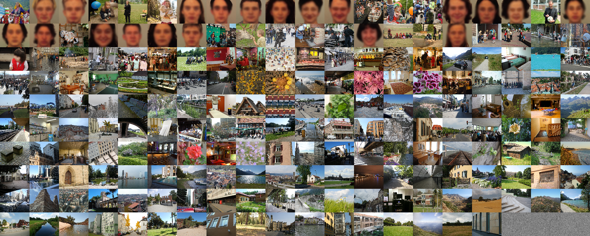]

---

count: false

## Results
### a. Global salience of natural images

.context[The model learnt one coafficient for each image, which can be interpreted as its **global salience**.]

.center[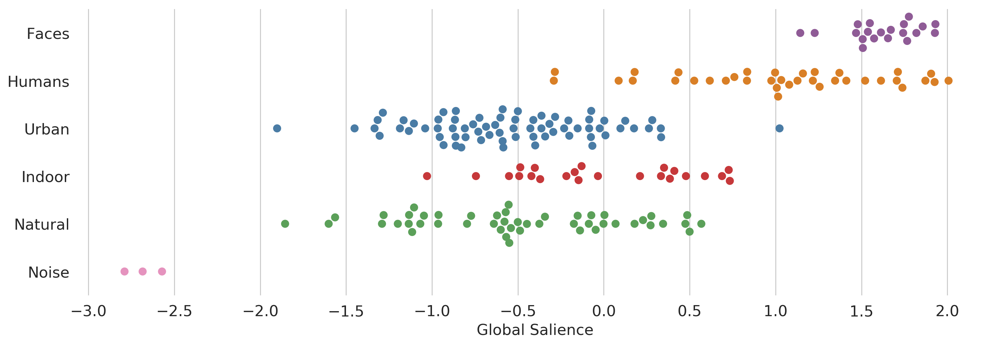]

.conclusion[Images with faces or social content are more likely to attract the first fixation.]

---

name: results

## Results
### b. Global vs. local salience

.context[Are our global salience results explained by the local salience properties of the images?]

--

We test 2 computational salience models:
* GBVS: based on low-level descriptors .cite[(Harel et al. 2007)]
* Deep Gaze II: high-level descriptors from a deep neural network .cite[(Kümmerer et al. 2016)]

.references[
* Harel et al. [Graph-based visual saliency](https://papers.nips.cc/paper/2006/file/4db0f8b0fc895da263fd77fc8aecabe4-Paper.pdf). NeurIPS, 2007
* Kümmerer et al. [DeepGaze II: Reading fixations from deep features trained on object recognition](https://arxiv.org/abs/1610.01563). arXiv 1610.01563, 2016
]

--

We perform 2 types of analysis:
* Predictivity of salience maps for the _location of the first fixation_
* Predictivity of salience maps for the _global salience scores_

---

## Results
### b. Global vs. local salience

.context35[Predictivity of salience maps for the _location of the first fixation_.]

--

KL divergence between the distribution of first fixations and .highlight1[GBVS] salience map:

$$
 D_{KL}(F_j||S_j) = \sum_b F_j(b) \log \left(\frac{F_j(b)}{S_j(b)+\epsilon}+\epsilon \right)
$$

--

.center[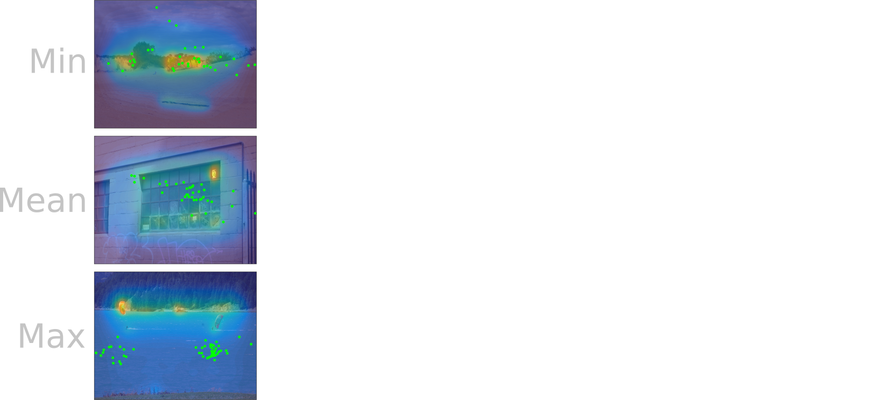]

---

count: false

## Results
### b. Global vs. local salience

.context35[Predictivity of salience maps for the _location of the first fixation_.]

KL divergence between the distribution of first fixations and .highlight1[GBVS] salience map:

$$
 D_{KL}(F_j||S_j) = \sum_b F_j(b) \log \left(\frac{F_j(b)}{S_j(b)+\epsilon}+\epsilon \right)
$$

.center[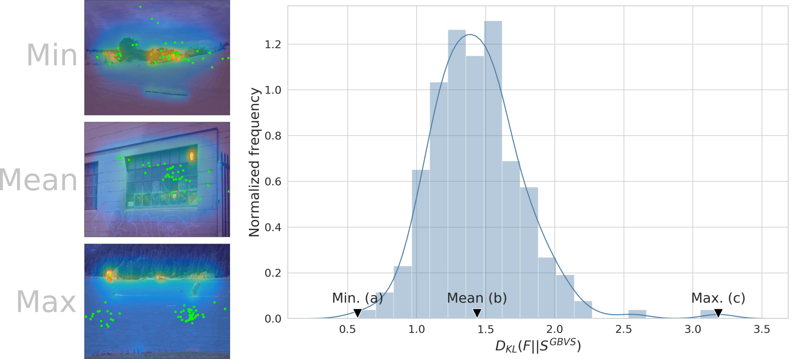]

---

count: false

## Results
### b. Global vs. local salience

.context35[Predictivity of salience maps for the _location of the first fixation_.]

KL divergence between the distribution of first fixations and .highlight1[Deep Gaze II] salience map:

$$
 D_{KL}(F_j||S_j) = \sum_b F_j(b) \log \left(\frac{F_j(b)}{S_j(b)+\epsilon}+\epsilon \right)
$$

.center[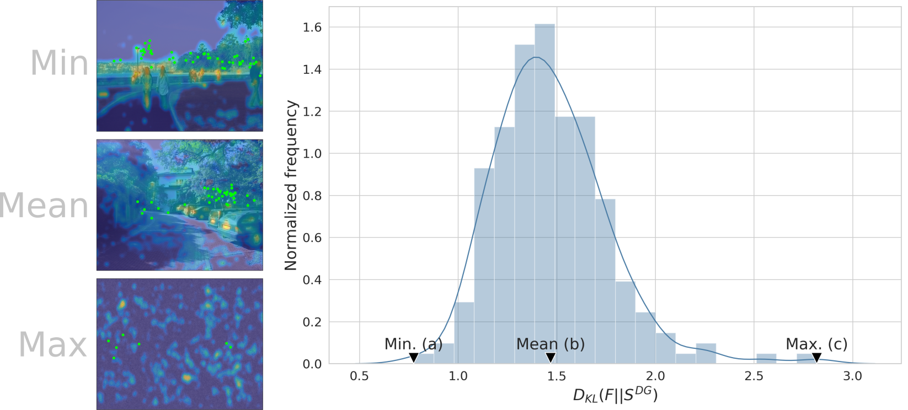]

---

count: false

## Results
### b. Global vs. local salience

.context35[Predictivity of salience maps for the _location of the first fixation_.]

KL divergence between the distribution of first fixations and .highlight1[Deep Gaze II] salience map:

$$
 D_{KL}(F_j||S_j) = \sum_b F_j(b) \log \left(\frac{F_j(b)}{S_j(b)+\epsilon}+\epsilon \right)
$$

&nbsp&nbsp&nbsp&nbsp
.conclusion[Salience maps are not predictive for the location of the first fixations.]

---

## Results
### b. Global vs. local salience

.context35[Predictivity of salience maps for the _global salience scores_.]

Correlation between the KL divergence (as before) and the global salience scores:

.left-column[.center[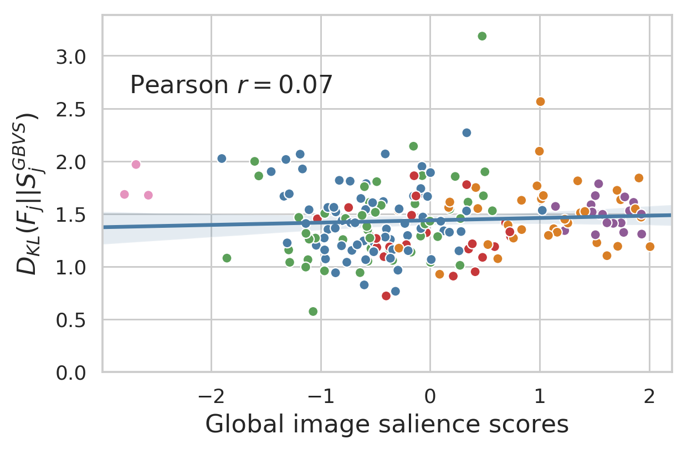]]
.right-column[.center[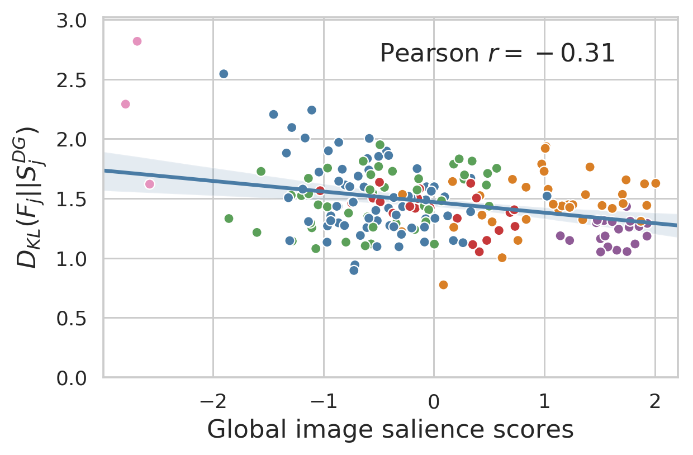]]

&nbsp&nbsp&nbsp&nbsp
.full-width[.conclusion[GBVS does not correlate with the global salience, Deep Gaze has low-to-moderate correlation.]]

---

## Results
### c. Lateral bias

.context[Previous studies have observed a general lateral bias of visual attention towards the left. Is that the case in our data too?]

.center[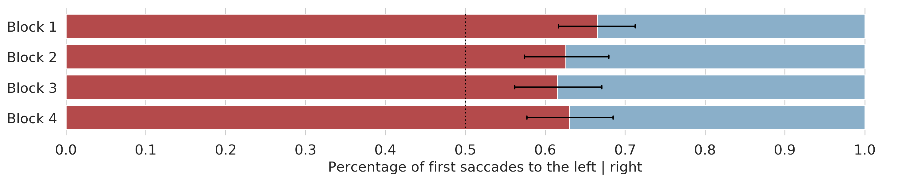]

* 63 % of all first fixations landed on the left side.
* ANOVA: general spatial bias of the initial saccade towards the left ($p < .001$) with no further effects.

---

count: falsej

## Results
### c. Lateral bias

.context[Previous studies have observed a general lateral bias of visual attention towards the left. Is that the case in our data too?]

.left-column[.center[]]
.right-column[.center[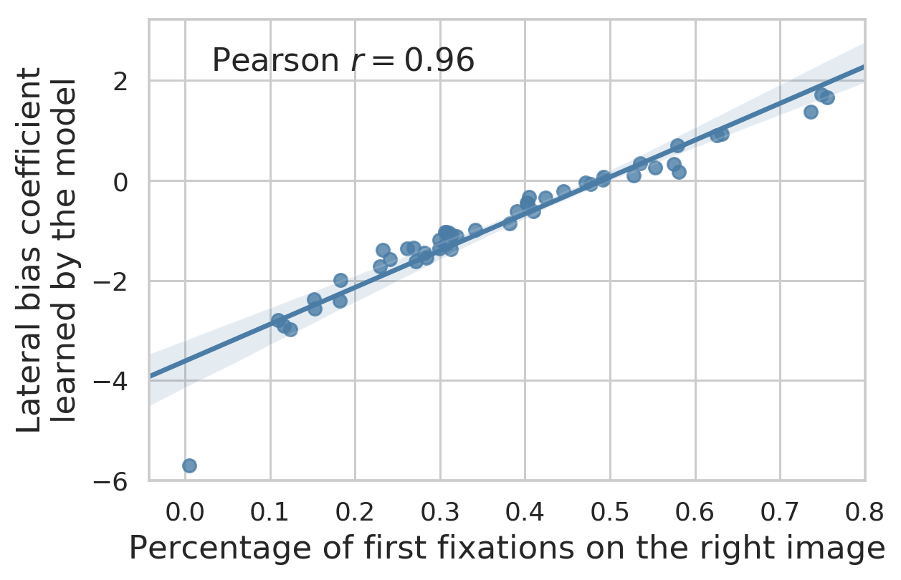]]

.full-width[
.alpha0[placeholder]
.conclusion[Our results confirm a general spatial bias towards the left, but with high inter-subject variability.]
]

---

## Results
### d. Task and familiarity

.context[Do task and familiarity play a role in the direction of the first saccade?]

.center[]

--

.center[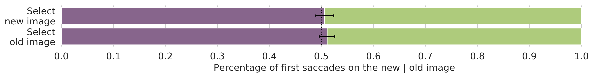]

* Participants correctly identified the new/old images in 91 % of the trials

.conclusion[Task and familiarity with one of the images did not influence the direction of the first saccade.]

---

## Results
### e. Exploration (dwell) time

.context[Do we also explore longer one of the sides? Or the new images? Or the images with higher global salience?]

--

### Dwell time and laterality

.center[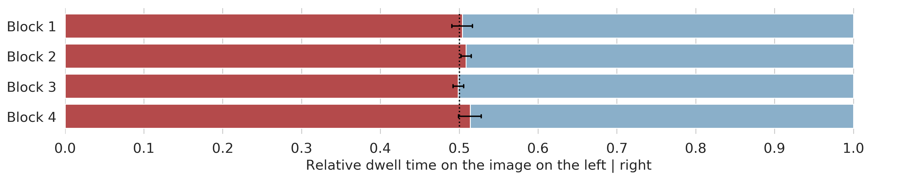]

.conclusion[Despite an initial lateral bias, neither the left or the right image were explored significantly longer.]

---

## Results
### e. Exploration (dwell) time

.context[Do we also explore longer one of the sides? Or the new images? Or the images with higher global salience?]

### Dwell time and task & familiarity

.center[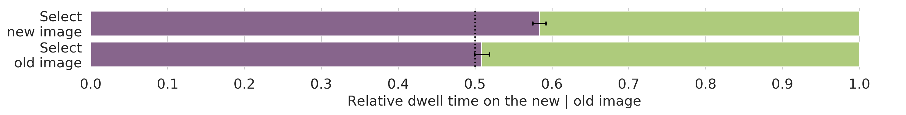]

.conclusion[Participants explored longer the new images, especially if the task was to select the new image.]

---

## Results
### e. Exploration (dwell) time

.context[Do we also explore longer one of the sides? Or the new images? Or the images with higher global salience?]

### Dwell time and global salience

.left-column[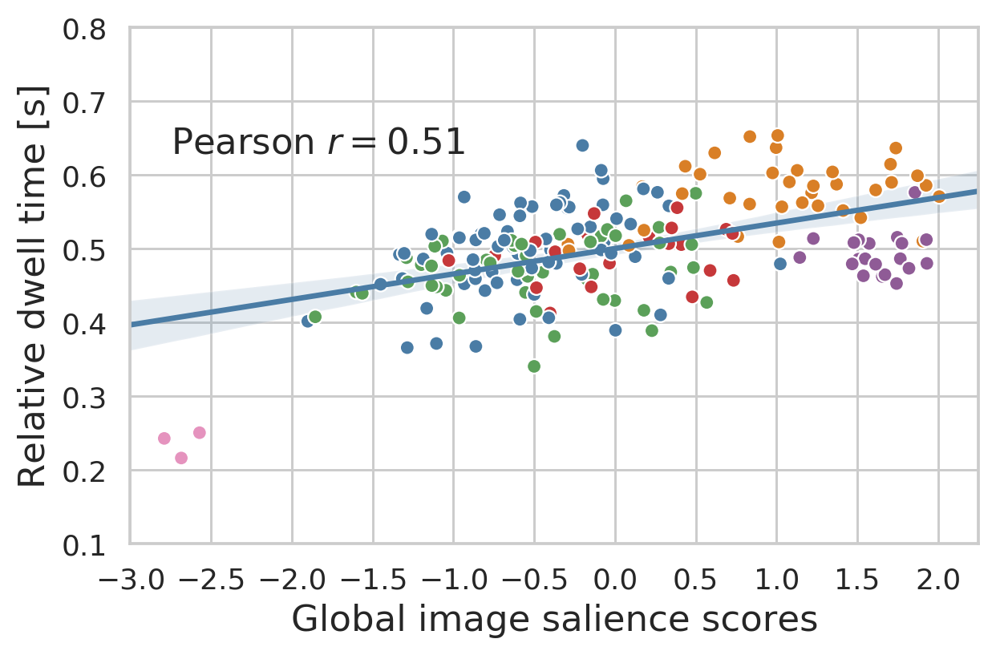]

.right-column[.conclusion[There is a moderate correlation between the global salience of images and the exploration time: images that are more likely to be fixated first are also explored longer. One difference: complex scenes with humans are explored for longer. 
]]

---

## Summary

.left-column-66[
* Eye-tracking experiment with .highlight1[competing visual stimuli].
* We studied the effect of a light .highlight1[task], the .highlight1[familiarity] with one of the images and the .highlight1[lateral bias].
]
.full-width[.center[]]
* We train a machine learning model with the eye-tracking data to obtain .highlight1[global salience scores].
* We compared our proposed global salience with local salience maps.

---

## Conclusions

.bigger[
* It is possible to measure the global salience of natural images.
* The global salience of images cannot be explained by their local salience properties.
* There is a strong spatial towards the left side (unsurprisingly).
* Task and familiarity with one image do not influence the first fixation.
* Images with larger global salience are explored for longer time.
]

---

## Want to know more?

.center[
<a href="https://psyarxiv.com/z7qp5">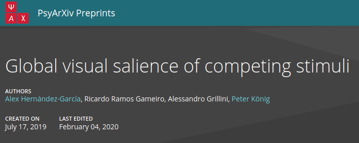</a>

<a href="https://jov.arvojournals.org/article.aspx?articleid=2770513">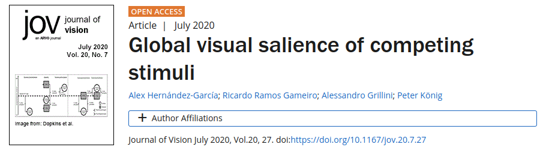</a>

* Code: [github.com/alexhernandezgarcia/global-salience](https://github.com/alexhernandezgarcia/global-salience)
* Poster follow-up project: _Temporal saccadic dynamics in free viewing of competing naturalistic images_, by Karla Matić et al - **Poster session 8, Thursday at 19:00 CEST**.

]

---

name: title
class: title, middle

## Thanks!

.bigger[Collaborators: Ricardo Ramos Gameiro & Alessandro Grillini & Peter König]

.smaller[Funding: This project has received funding from the European Union’s Horizon 2020 research and innovation programme under the Marie Sklodowska-Curie grant agreement No 641805.]

.gray224[European Conference on Visual Perception (ECVP) 2021 · The Internet · August 25th 2021]

.center[

&nbsp&nbsp&nbsp&nbsp

&nbsp&nbsp&nbsp&nbsp

&nbsp&nbsp&nbsp&nbsp

]

.footer[[alexhernandezgarcia.github.io](https://alexhernandezgarcia.github.io/) | [alex.hernandez-garcia@mila.quebec](mailto:alex.hernandez-garcia@mila.quebec) | [@alexhdezgcia](https://twitter.com/alexhdezgcia)] 

---

## Questions?

 
 
.left-column[]
.right-column[]

.full-width[.center[]]

.center[.footer[[alexhernandezgarcia.github.io](https://alexhernandezgarcia.github.io/) | [alex.hernandez-garcia@mila.quebec](mailto:alex.hernandez-garcia@mila.quebec) | [@alexhdezgcia](https://twitter.com/alexhdezgcia)] ]

