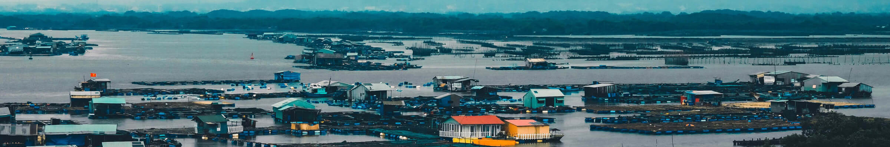
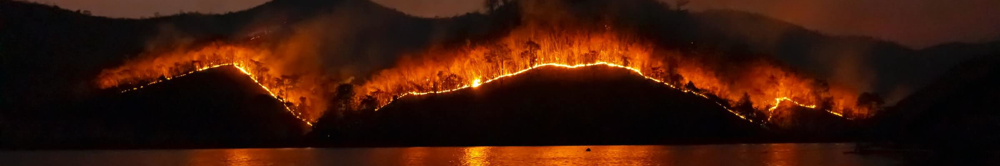
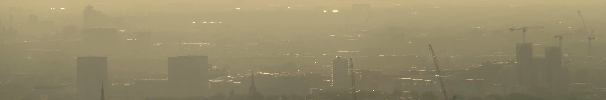

name: title
class: title, middle

## [ThisClimateDoesNotExist.com](https://thisclimatedoesnotexist.com/):
### AI to visualise climate change impacts on street photos

.bigger[Alex Hernández-García (he/il/él)]

Victor Schmidt, Sasha Luccioni, Yoshua Bengio et al.

.turquoise[Intelligent Machines, Emotions, and our Planet · Stockholm + virtual · Jan. 13-14th 2022]

.center[

]

.footer[[alexhernandezgarcia.github.io](https://alexhernandezgarcia.github.io/) | [alex.hernandez-garcia@mila.quebec](mailto:alex.hernandez-garcia@mila.quebec) | [@alexhdezgcia](https://twitter.com/alexhdezgcia)] 

---

## Contributors

Victor Schmidt, Alexandra Sasha Luccioni, Mélisande Teng, Tianyu Zhang, Alexia Reynaud, Sunand Raghupathi, Vahe Vardanyan, Yoshua Bengio, and others.

    
.conclusion[The work presented in this talk is the joint effort of a large and interdisciplinary team.]

---

## Visualising climate change impacts on street photos

---

## Visualising climate change impacts on street photos
### Motivation

--

There is a mismatch between the magnitude of the climate crisis and the public's concern about it. .highlight1[_Why?_]

--

* .highlight1[Psychological distance]: 
> "_People struggle to engage with climate change because they perceive it as distant: temporally, geographically and/or socially. _" .cite[Stoknes, 2016]

.references[
* Stoknes, P. E. [Why the human brain ignores climate change—and what to do about it](https://documentcloud.adobe.com/link/track?uri=urn%3Aaaid%3Ascds%3AUS%3A1ef80b88-177c-4e5d-b879-d6d3a059c694). Environmental Reality: Rethinking the Options, 2016.
]

---

count: false

## Visualising climate change impacts on street photos
### Motivation

There is a mismatch between the magnitude of the climate crisis and the public's concern about it. .highlight1[_Why?_]

* .highlight1[Psychological distance]: 
> "_People struggle to engage with climate change because they perceive it as distant: temporally, geographically and/or socially. _" .cite[Stoknes, 2016]
* .highlight1[Doom-framings and fatigue of clichéd messages]:
> "_[C]lichéd images of climate change [...]—such as ‘smokestacks’, deforestation, and polar bears on melting ice—were positively received [but] also produced a muted emotional response and often prompted cynicism._" .cite[Chapman et al., 2016]

.references[
* Stoknes, P. E. [Why the human brain ignores climate change—and what to do about it](https://documentcloud.adobe.com/link/track?uri=urn%3Aaaid%3Ascds%3AUS%3A1ef80b88-177c-4e5d-b879-d6d3a059c694). Environmental Reality: Rethinking the Options, 2016.
* Chapman, D. A. et al. [Climate visuals: A mixed methods investigation of public perceptions of climate images in three countries](https://sci-hub.st/https://www.sciencedirect.com/science/article/abs/pii/S095937801630351X). GCE, 2016.
]

---

## Our goal
### .alpha0[Placeholder]

.context[People perceive the threat of climate change as temporally, geographically and socially distant.]

--

.center[.bigger[.highlight1[Could we help people visualise the effects of climate change in _their own backyard_?]]]

--

.left-column[
<figure>
	
  <figcaption>Montréal, Québec, Canada</figcaption>
</figure>
]
.right-column[
<figure>
	
  <figcaption>Berlin, Germany</figcaption>
</figure>
]
.left[
]
.right[
]

---

count: false

## Our goal
### Floods

.context[People perceive the threat of climate change as temporally, geographically and socially distant.]

.center[.bigger[.highlight1[Could we help people visualise the effects of climate change in _their own backyard_?]]]

.left-column[
<figure>
	
  <figcaption>Montréal, Québec, Canada</figcaption>
</figure>
]
.right-column[
<figure>
	
  <figcaption>Berlin, Germany</figcaption>
</figure>
]
.left[
]
.right[
]

---

count: false

## Our goal
### Wildfires

.context[People perceive the threat of climate change as temporally, geographically and socially distant.]

.center[.bigger[.highlight1[Could we help people visualise the effects of climate change in _their own backyard_?]]]

.left-column[
<figure>
	
  <figcaption>Montréal, Québec, Canada</figcaption>
</figure>
]
.right-column[
<figure>
	
  <figcaption>Berlin, Germany</figcaption>
</figure>
]
.left[
]
.right[
]

---

count: false

## Our goal
### Smog

.context[People perceive the threat of climate change as temporally, geographically and socially distant.]

.center[.bigger[.highlight1[Could we help people visualise the effects of climate change in _their own backyard_?]]]

.left-column[
<figure>
	
  <figcaption>Montréal, Québec, Canada</figcaption>
</figure>
]
.right-column[
<figure>
	
  <figcaption>Berlin, Germany</figcaption>
</figure>
]
.left[
]
.right[
]

---

## Our goal
### A website to encourage climate change awareness and action

---

count: false

## Our goal
### A website to encourage climate change awareness and action

.center[]

---

count: false

## Our goal
### A website to encourage climate change awareness and action

.center[]

---

## Why floods, wildfire, smog?

.context[Our algorithm and the website simulates floods, wildfires and smog on input images.]

--

 
.columns-3-left[
* Flash floods kill **5,000** people per year.
* Sea levels are expected to rise by **2 metres** by the end of the century
* Rising sea levels could disrupt the lives of **1 billion people** by the end of 2050.
]

--

.columns-3-center[
* As much as **40% of the Amazon** forest is at risk of becoming a savanna.
* In 2015, forest fires claimed roughly **980 000 $km^2$** of the world’s forest.
* Forest fires emmitted **~1.8 Gt of CO2** in 2019.
]

--

.columns-3-right[
* Air pollution is believed to be responsible for **4.2 million** premature deaths per year.
* Air pollution is responsible for **6% of deaths** worldwide.
* **91% of the population** lives in places where air pollution levels safety limits.  
]

--

.full-width[
.conclusion[Floods, wildires and smog are some of the worst environmental hazards for humanity, and we can communicate their impacts visually.]
]

---

count: false

## Let's try it out!

.center[
.bigger[.bigger[[ThisClimateDoesNotExist.com](https://thisclimatedoesnotexist.com)]]

.bigger[.bigger[[CeClimatNExistePas.com](https://ceclimatnexistepas.com)]]
]

???

https://thisclimatedoesnotexist.com/en/share/56d8058c-23d5-4083-b1b4-4afe6a5b2fe9
---

## Future directions and limitations

* [_ThisClimateDoesNotExist.com_](https://thisclimatedoesnotexist.com) is not an exerise of climate prediction. There is no correlation between the consequence chosen and the address entered. Our algorithm applies a systematic transformation regardless of the address.
    * While this is in part a limitation, this allows us to simulate the impacts of climate change, at any location, regardless of the specific risk.
    * Still, it would be interesting to integrate climate prediction and modelling into our simulations, for other applications.
--
* Our algorithm systematically simulates the same level of water (about 1 metre). It would be interesting to allow for more flexible simulations.
    * An interesting application would be to make the simulations reflect the impacts of various climate actions.
--
* We are currently working with Prof. Erick Lachapelle and Thomas Bergeron on a study of the effect of personalised imagery in climate communication.

---

## To know more

* Visit the website: [ThisClimateDoesNotExist.com](https://thisclimatedoesnotexist.com)

.center[]
    
* Check out our preprint: [ClimateGAN: Raising Climate Change Awareness by Generating Images of Floods](https://arxiv.org/abs/2110.02871v1)

.center[]
    
---

name: title
class: title, middle

## Thank you!

.bigger[Alex Hernández-García (he/il/él)]

Victor Schmidt, Sasha Luccioni, Yoshua Bengio et al.

.turquoise[Intelligent Machines, Emotions, and our Planet · Stockholm + virtual · Jan. 13-14th 2022]

.center[

]

.footer[[alexhernandezgarcia.github.io](https://alexhernandezgarcia.github.io/) | [alex.hernandez-garcia@mila.quebec](mailto:alex.hernandez-garcia@mila.quebec) | [@alexhdezgcia](https://twitter.com/alexhdezgcia)] 

---

name: title
class: title, middle
count: false

.center[]

.center[

]

.footer[[alexhernandezgarcia.github.io](https://alexhernandezgarcia.github.io/) | [alex.hernandez-garcia@mila.quebec](mailto:alex.hernandez-garcia@mila.quebec) | [@alexhdezgcia](https://twitter.com/alexhdezgcia)] 

---

name: title
class: title, middle

## Back-up slides

.turquoise[Intelligent Machines, Emotions, and our Planet · Stockholm + virtual · Jan. 13-14th 2022]

---

## Methods
### Floods simulation with _ClimateGAN_

.context[The algorithm had to be able to generate realistic floods on any photo from Google Street View.]

--

.left-column-66[
Key challenges:

* Visual perception is sensitive to unrealistic scenes:
    * Water texture (reflections, luminosity, etc.)
    * Geometry of the scene (edges, obstacles, etc.)
    * Physics (slope, view point, etc.)
* The algorithm was meant to be deployed _in the wild_ and should work with highly variant range of photos.
* We had to overcome the lack of training data: there is no data set of photos of _before and after_ the flood.
]
.right-column-33[
.center[

]
]

---

## Methods
### Floods simulation with _ClimateGAN_

.context[Simulating photo-realistic floods is challenging because visual perception is very sensitive to unrealistic scenes and the lack of data.]

--

.left-column[
Key features:

* Data from a simulated virtual word to overcome the lack of training data
* Domain adaptation to bridge the gap between simulated and real photos
* Two-stage flood generation: _Masker_ + _Painter_
* Combination of _depth_ and _semantic segmentation_  to improve water mask predictions
* Conditional image generation to _paint_ realistic water on the predicted mask
]
.right-column[

]

---

## ClimateGAN
### Simulated data

.context[We collected 1,200 photos of real floods and 5,500+ _non-flooded_ scenes to train our model. However, _real_ photos lack geometry and segmentation labels.]

We simulated a $1.5~km^2$ virtual world and generated 20,000 images that mimic Google Street View.

.center[]

---

count: false

## ClimateGAN
### Simulated data

.context[We collected 1,200 photos of real floods and 5,500+ _non-flooded_ scenes to train our model. However, _real_ photos lack geometry and segmentation labels.]

We simulated a $1.5~km^2$ virtual world and generated 20,000 images that mimic Google Street View.

.center[]

---

## ClimateGAN
### Masker

.left-column[
* Trained with _real_ and _simulated_ images
* Domain adaptation with ADVENT
* Depth decoder
* Segmentation decoder
* Mask decoder conditioned on depth and segmentation using SPADE
* All decoders trained simultaneously (multi-task learning)
]
.right-column[

]

---

counter: false

## ClimateGAN
### Masker

.left-column[
* Trained with _real_ and _simulated_ images
* Domain adaptation with ADVENT
* Depth decoder
* Segmentation decoder
* Mask decoder conditioned on depth and segmentation using SPADE
* All decoders trained simultaneously (multi-task learning)
]
.right-column[

]

.conclusion[The masker receives an input image and outputs a binary mask of the water location, making intermediate predictions of depth and semantic segmentation.]

---

## ClimateGAN
### Painter

.left-column[
* Trained with 1,200 real images of floods
* The painter has to generate flooding water conditioned on the context of the image: sky, buildings, etc.
* Conditional image generation with GauGAN
* Conditioned on the Masked image
* SPADE blocks
]
.right-column[

]

---

counter: false

## ClimateGAN
### Painter

.left-column[
* Trained with 1,200 real images of floods
* The painter has to generate flooding water conditioned on the context of the image: sky, buildings, etc.
* Conditional image generation with GauGAN
* Conditioned on the Masked image
* SPADE blocks
]
.right-column[

]

.conclusion[The painter receives an input image and a mask prediction and outputs an image of a flood that we combine with the masked input.]

---

## ClimateGAN
### Masker + Painter

.center[]

---

## ClimateGAN
### Comparison with other methods

.center[]

---

## ClimateGAN
### Human evaluation

.context[We asked human participants to assess the visual quality of the output images, compared to alternative algorithms.]

_Which image looks more like an actual flood?_

.center[]

.conclusion[The images from our algorithm were consistently judged as more realistic than those from other methods.]

---

## ClimateGAN
### Ablation study

.context[We systematically evaluated the contribution of several components of the algorithm.]

* We annotated the pixels a set of _test_ images as _must be flooded_, _cannot be flooded_ or _may be flooded_.
* We proposed 3 metrics to best evaluate the quality of the water masks: error, F05 score and _edge coherence_.

.center[]

---

count: false

## ClimateGAN
### Ablation study

.context[We systematically evaluated the contribution of several components of the algorithm.]

* We analysed each component according to the three proposed metrics.

.center[]

.conclusion[6 of the 5 proposed components for the architecture proved to positively contribute to the performance.]
