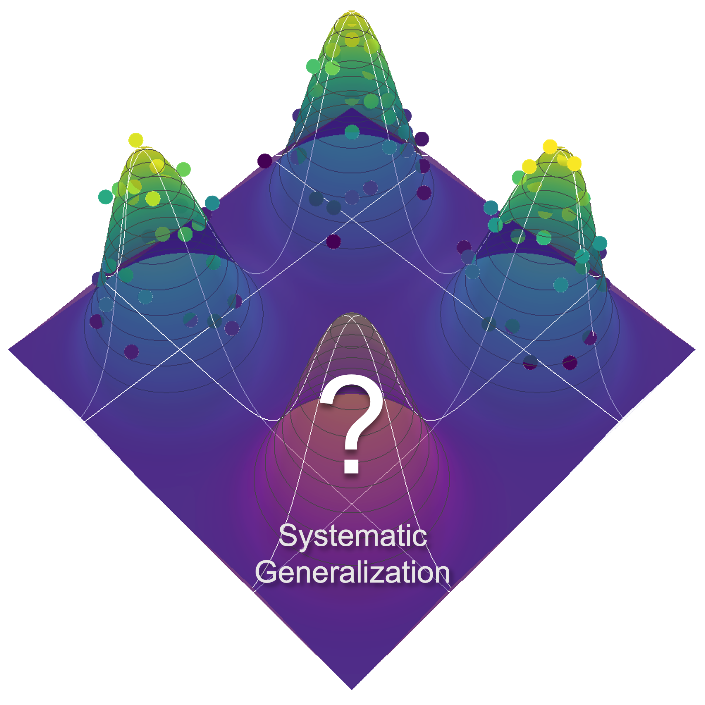
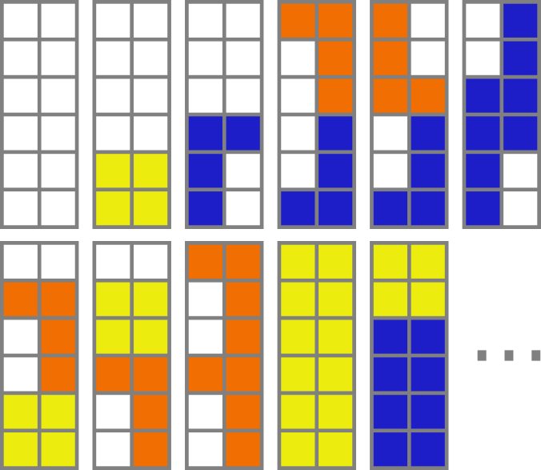
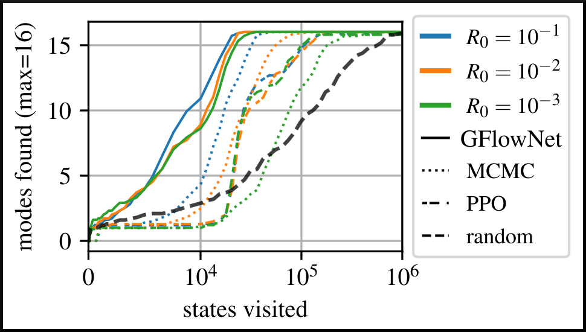
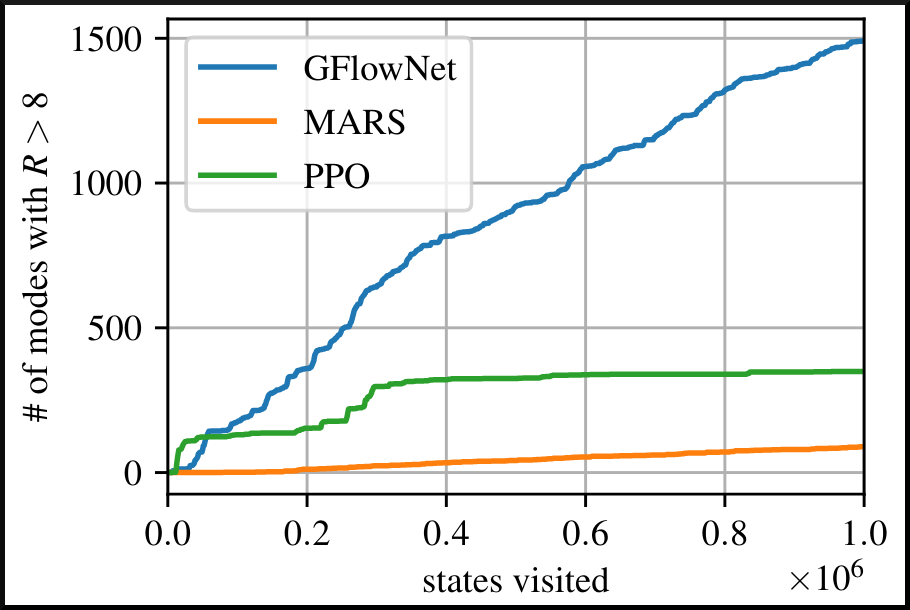
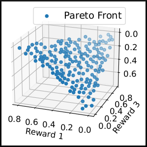
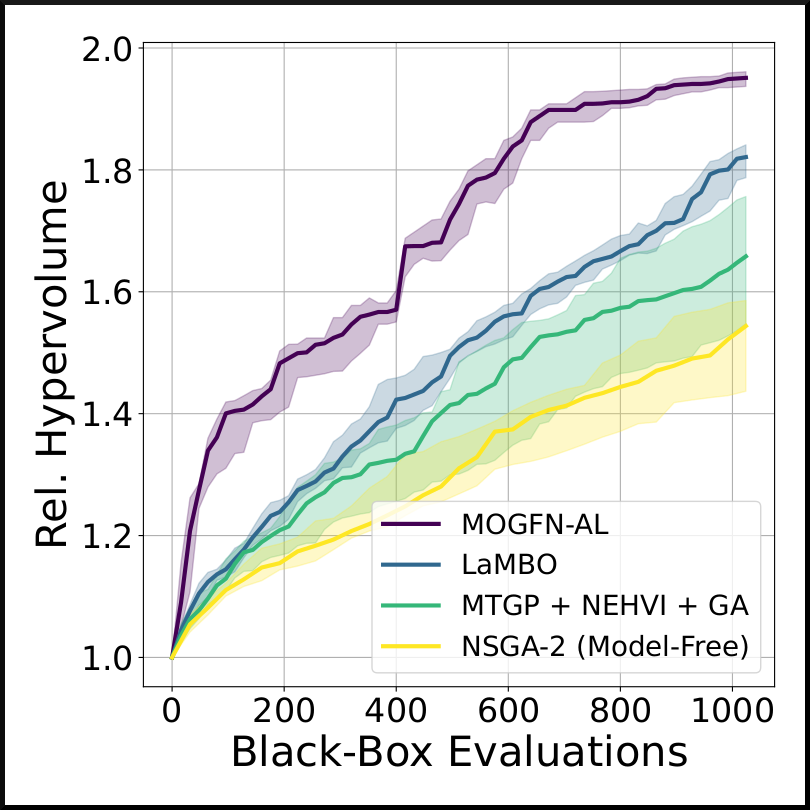
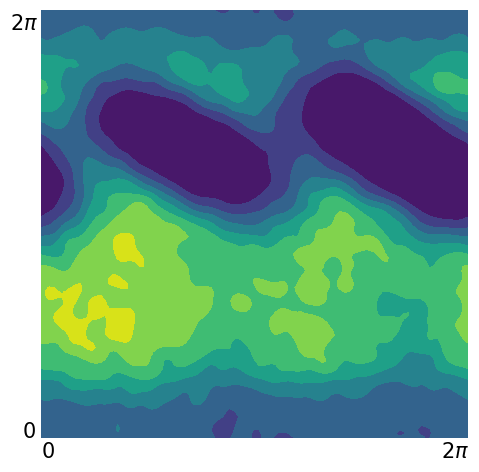
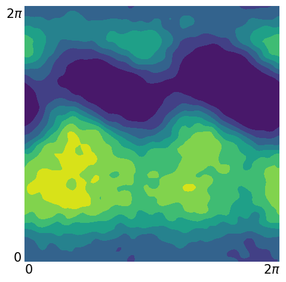

name: title
class: title, middle

## GFlowNets
### Introduction and Applications to Biological Sequence Design

Alex Hernández-García (he/il/él), on behalf of Moksh Jain and collaborators

.turquoise[Genetech x Mila · April 25th 2023]

.center[

&nbsp&nbsp&nbsp&nbsp

]

.smaller[.footer[
Slides: [alexhernandezgarcia.github.io/slides/genentech-apr23](https://alexhernandezgarcia.github.io/slides/genentech-apr23)
]]

---

## Machine learning for scientific discovery
### Challenges and limitations of existing methods

.highlight1[Challenge]: very large search spaces.

--

&rarr; Need for .highlight2[efficient search and generalisation] of underlying structure.

--

.highlight1[Challenge]: underspecification of objective functions or metrics.

--

&rarr; Need for .highlight2[diverse] candidates.

--

.highlight1[Limitation]: Reinforcement learning and MCMC methods are good at optimisation but bad at mode mixing.

--

&rarr; Need for .highlight2[multi-modal optimisation].

---

## An intuitive toy task

.context[Scientific discovery involves exploring in large, multi-modal search spaces.]

 
Task: find arrangements of Tetris pieces on the board that minimise the empty space.

.left-column[
.center[]
]

.right-column[
  
]

--

.conclusion[This task resembles designing DNA sequences or molecules or materials via fragments, to optimise certain properties.]

---

## An intuitive toy task

.context[Scientific discovery involves exploring in large, multi-modal search spaces.]

 
Task: find arrangements of Tetris pieces on the board that minimise the empty space.

.center[

  

  <figure>
      
    <figcaption>Score: 0/12</figcaption>
  </figure>
  

  

  <figure>
      
    <figcaption>Score: 4/12</figcaption>
  </figure>
  

  

  <figure>
      
    <figcaption>Score: 8/12</figcaption>
  </figure>
  

  

  <figure>
      
    <figcaption>Score: 12/12</figcaption>
  </figure>
  

]

---

## An intuitive toy task

.context[Scientific discovery involves exploring in large, multi-modal search spaces.]

 
Task: find arrangements of Tetris pieces on the board that minimise the empty space.

.center[

  

  <figure>
      
    <figcaption>Score: 12/12</figcaption>
  </figure>
  

  

  <figure>
      
    <figcaption>Score: 12/12</figcaption>
  </figure>
  

  

  <figure>
      
    <figcaption>Score: 12/12</figcaption>
  </figure>
  

  

  <figure>
      
    <figcaption>Score: 12/12</figcaption>
  </figure>
  

  

  <figure>
      
    <figcaption>Score: 12/12</figcaption>
  </figure>
  

]

.conclusion[The _reward function_ of this task has multiple modes. With a larger board and more pieces, the number of combinations and modes grow exponentially and the task of efficiently finding them is non-trivial for machine learning models.]

---

name: title
class: title, middle

## A gentle introduction to GFlowNets

.center[]

---

## GFlowNet in a nutshell

.context[Existing ML methods struggle with large, multi-modal search spaces.]

 
Given a reward or objective function $R(x)$, GFlowNet can be seen a generative model trained to sample objects $x \in \cal X$ according to .highlight1[a sampling policy $\pi(x)$ proportional to the reward $R(x)$]: $\pi(x) \propto R(x)$

&rarr; Sampling proportionally to the reward function induces .highlight1[multi-modal search and diversity].

--

.left-column[
The policy $\pi_{\theta}(x)$ is modelled by a deep neural network, parameterised by $\theta$, thus providing .highlight1[amortised inference].

&rarr; Amortised inference can be thought of as _exploration with memory_, which induces .highlight1[systematic generalisation].
]

--

.right-column[
.center[]
]

---

## GFlowNet in a nutshell

* Objects $x \in \cal X$ are constructed through a sequence of steps $\tau$ from an action space $\cal A$.
* At each step of the trajectory $\tau=(s_0\rightarrow s_1 \rightarrow \dots \rightarrow s_f)$, we get a partially constructed object $s$ in state space $\cal S$.
* This induces a directed acyclic graph (DAG) $\mathcal{G}=(\mathcal{S},\mathcal{A})$, with all possible constructions in the domain.

.left-column[.center[]]

.right-column[.center[

  

  <figure>
      
    <figcaption>$s_0$</figcaption>
  </figure>
  

  

  $\rightarrow$
  

  

  <figure>
      
    <figcaption>$s_1$</figcaption>
  </figure>
  

  

  $\rightarrow$
  

  

  <figure>
      
    <figcaption>$s_2$</figcaption>
  </figure>
  

]]
---

## GFlowNet in a nutshell

.context[GFlowNet induces a DAG $\mathcal{G}=(\mathcal{S},\mathcal{A})$, with all possible constructions in the domain.]

 

.left-column[.center[
  <figure>
    
    <figcaption>State space $\cal S$</figcaption>
  </figure>
]]

.right-column[.center[
  <figure>
    
    <figcaption>Action space $\cal A$</figcaption>
  </figure>
]]

.conclusion[This terminology is reminiscent of reinforcement learning.]

---

## GFlowNet flows

.context[The edges or transitions in the DAG can be quantified by their _flow_.]

* Analogous to water-flow in pipes.
* Trajectory Flow $F(\tau)$ denotes probability mass assigned to trajectory $\tau$.
* State Flow $F(s)$ is the flow of all trajectories passing through the state $s$.
* Edge Flow $F(s\rightarrow s')$ is the flow through a particular edge $s\rightarrow s'$.
* Forward Policy $P_F$: $P\_F(s'|s) = \frac{F(s\rightarrow s')}{F(s)}$
* Backward Policy $P_B$: $P\_B(s|s') = \frac{F(s\rightarrow s')}{F(s')}$

.center[]

.references[
Bengio et al. [Flow network based generative models for non-iterative diverse candidate generation](https://arxiv.org/abs/2106.04399), NeurIPS, 2021. 
]

???

Not to be confused with normalizing flows!

---

## Principle of conservation as a training objective

.right-column-33[.center[]]

.left-column-66[
**Consistent Flow**:  Flow $F$ satisfies the _flow consistency equation_
$$\sum\_{s' \in \text{Parent}(s)} F\_\theta(s' \rightarrow s) = \sum\_{s'' \in \text{Child}(s)} F\_\theta(s \rightarrow s')$$

**Theorem**: For a consistent flow $F$ with terminal flow set as the reward $F(x\rightarrow s_f)=R(x)$, the forward policy samples $x$ proportionally to $R(x)$.
$$\pi(x)\propto R(x)$$

**Corollary**: The flow at $s_0$, $F(s_0)$ is the partition function $Z$! 
]

.references[
Bengio et al. [Flow network based generative models for non-iterative diverse candidate generation](https://arxiv.org/abs/2106.04399), NeurIPS, 2021. 
]

---

## Principle of conservation as a training objective

$$\sum\_{s' \in \text{Parent}(s)} F\_\theta(s' \rightarrow s) = \sum\_{s'' \in \text{Child}(s)} F\_\theta(s \rightarrow s')$$

* **Flow Matching Objective**: $$\mathcal{L}\_{FM}(s; \theta) = \left(\log \frac{\sum\_{s'\in \text{Parent}(s)} F\_\theta(s'{\rightarrow} s)}{\sum\_{s'' \in \text{Child}(s)}F\_\theta(s{\rightarrow} s'')}\right)^2$$
* **Trajectory Balance**: $$\mathcal{L}\_{TB} (\tau;\theta) = \left(\log \frac{Z\_\theta \prod\_{s{\rightarrow} s' \in \tau}P\_{F\_\theta}(s'|s)}{R(x)\prod\_{s\rightarrow s' \in \tau} P\_{B\_\theta}(s|s') }\right)^2$$

---

## Results
### Tetris GFlowNets

.context[If the model is sufficiently trained, the sampling policy $\pi(x)$ should be proportional to the reward $R(x)$: $\pi(x) \propto R(x)$]

 

.center[

  

  <figure>
      
    <figcaption>$\pi(x) = 8.12~\%$</figcaption>
  </figure>
  

  

  <figure>
      
    <figcaption>$\pi(x) = 8.96~\%$</figcaption>
  </figure>
  

  

  <figure>
      
    <figcaption>$\pi(x) = 8.61~\%$</figcaption>
  </figure>
  

  

  <figure>
      
    <figcaption>$\pi(x) = 9.16~\%$</figcaption>
  </figure>
  

  

  <figure>
      
    <figcaption>$\pi(x) = 8.39~\%$</figcaption>
  </figure>
  

]

After training, GFlowNet samples a mode with probability 43.24 %.

.footnote[The energy function $\varepsilon(x)$ is the fraction of the board occupied by pieces and the reward function is $R(X) = \varepsilon(x)^4$ to disproportionally favour the discovery of modes.]

---

## Results
### Hyper-grid and molecule fragments

.context[GFlowNet has been successfully trained in other toy and practically relevant tasks. .cite[(Bengio et al., 2019)]]

.columns-3-left[
.highlight1[Hyper-grid]: The action space is in which dimension to move and the reward function has high reward in the corners.

.center[

]
]

--

.columns-3-center[
.highlight1[Small molecules]: The action space is molecular fragments and the reward function is the binding energy to a particular protein.

.center[

]
]

--

.columns-3-right[
.highlight1[Active learning with molecules]: Multi-round active learning with a limited oracle budget.

.center[

]
]

--

.conclusion[GFlowNet is able to efficiently explore the search space and generalise to unseen modes of the reward.]

---

##  GFlowNet extensions
### Multi-objective GFlowNets

We have extended GFlowNets to handle multi-objective optimisation and not only cover the Pareto front but also sample diverse objects at each pointin the Pareto front.

.center[

]

.references[
Jain et al. [Multi-Objective GFlowNets](https://arxiv.org/abs/2210.12765), arXiv 2210.12765, 2022. 
]

---

##  GFlowNet extensions
### Continuous GFlowNets

We have recently generalised the theory and implementation of GFlowNets to encompass both discrete and continuous or hybrid state spaces. 

.center[

]

.references[
Lahlou et al. [A Theory of Continuous Generative Flow Networks](https://arxiv.org/abs/2301.12594), arXiv 2301.12594, 2023. 
]

---

name: title
class: title, middle

## Application: Biological Sequence Design

.center[]

---

## Biological sequence design: anti-microbial peptides

* Peptides are short chains of amino acids (proteins) .cite[(Pirtskhalava et al., 2021)]
* The goal is to find peptides with anti-microbial properties
* We consider chains of length 50 or shorter, with a vocabulary of 20 aminoacids ($>10^{65}$)
* Data set: 6438 positive (anti-microbial samples) and 9522 negative samples.

.references[
* Pirtskhalava et al. DBAASP V3: Database of antimicrobial/cytotoxic activity and structure of peptides as a resource for development of new therapeutics. Nucleic Acids Research, 2021.
* Jain et al. [Biological Sequence Design with GFlowNets](https://arxiv.org/abs/2203.04115), ICML, 2022. 
]

???

3219 AMP, 4611 non-AMP (anti-microbial properties)

---

## Application
### Biological sequence design: anti-microbial peptides

.context[An **active learning** pipeline for biological sequence design]

.right-column-66[.center[]]

---

count: false

## Application
### Biological sequence design: anti-microbial peptides

.context[An **active learning** pipeline for biological sequence design]

.right-column-66[.center[]]

.left-column-33[
**Oracle**: MLPs trained on a separate partition of the data.

In other tasks, such as DNA aptamers, we have access to computational libraries.
]

---

## Application
### Biological sequence design: anti-microbial peptides

.context[An **active learning** pipeline for biological sequence design]

.right-column-66[.center[]]

.left-column-33[
**Model**: MLPs and transformers.
]

---

count: false

## Application
### Biological sequence design: anti-microbial peptides

.context[An **active learning** pipeline for biological sequence design]

.right-column-66[.center[]]

.left-column-33[
**Agent**: GFlowNet

.center[]
]

---

## Methodology
### Algorithm

.context[An **active learning** pipeline for biological sequence design]

.right-column-66[.center[]]

.left-column-33[
**1**: Generate a _small_ initial _labelled_ data set from the oracle:
$$\mathcal{D} = \mathcal{D_0}$$

In our main experiments:
* $|\mathcal{D_0}| = 7830$
* Length: up to 50
* Alphabet: 20 aminoacids
]

---

count: false

## Methodology
### Algorithm

.context[An **active learning** pipeline for biological sequence design]

.right-column-66[.center[]]

.left-column-33[
**2**: Train model by minimising the error on $\mathcal{D}$:
$$\min L(f_{\theta}(\mathcal{D}))$$

In our main experiments we train with MC dropout or an ensemble of MLPs that provides with both _energy_ and _uncertainty_.
]

---

count: false

## Methodology
### Algorithm

.context[An **active learning** pipeline for biological sequence design]

.right-column-66[.center[]]

.left-column-33[
**3**: Train GFlowNet until convergence using the ML model as a proxy oracle:

.center[]
]

---

count: false

## Methodology
### Algorithm

.context[An **active learning** pipeline for biological sequence design]

.right-column-66[.center[]]

.left-column-33[
**4**: Generate samples with GFlowNet and select a query of best candidates 

We select 1000 samples per iteration.
]

---

count: false

## Methodology
### Algorithm

.context[An **active learning** pipeline for biological sequence design]

.right-column-66[.center[]]

.left-column-33[
**5**: Score the selected query with the oracle ($\mathcal{D_1}$) and add to the data set:
$$\mathcal{D} = \mathcal{D} \cup \mathcal{D_1}$$

Then repeat all steps for $k=10$ iterations.
]

---

## Evaluation
### Desiderata for candidates

.context[We look for a .highlight1[diverse] set of .highlight1[good] candidates.]

The set of top $k$ candidates: $\mathcal{D}_{Best} = TopK(\mathcal{D}_K \backslash \mathcal{D}_0)$

* .highlight1[Performance / usefulness score]: mean score of $\mathcal{D}_{Best}$
* .highlight1[Diversity]: mean distance within $\mathcal{D}_{Best}$
* .highlight1[Novelty]: mean distance with between $\mathcal{D}_{Best}$ and $\mathcal{D}_0$

--

&nbsp
&nbsp

.conclusion[A set of candidates should be evaluated holistically, considering all three metrics.]

---

## Evaluation
### Baselines

Three representative recent machine learning models for sequence design:

* DynaPPO: Active Learning with RL as Generator .cite[Angermueller et al., 2019]
* AmortizedBO: Bayesian Optimization with RL-based Genetic Algorithm .cite[Swersky et al., 2020]
* COMs: Deep Model Based Optimization .cite[Trabucco et al., 2021]

.references[
* Angermueller et al. Model-based reinforcement learning for biological sequence design. ICLR, 2019.
* Swersky et al. Amortized bayesian optimization over discrete spaces. PMLR, 2020.
* Trabucco et al. Conservative objective models for effective offline model-based optimization. ICML, 2021.
]

---

## Results

.context[Active learning with 10 rounds, $b = 1000$, $K = 100$.]

* GFlowNet generates sequences with .highlight1[score] on par or higher than the strongest baseline.
* GFlowNet generates much more .highlight1[diverse] and .highlight1[novel] samples than the baselines.

.center[
<figure>
	
  <figcaption>Metrics with $K=100$</figcaption>
</figure>
]

--

.smaller[
* AmortizedBO generated nonsensical peptides because it is designed for fixed-length sequences.
* Methods such as COMs, which perform local search around known candidates, perform poorly when the goal is to generate .highlight1[large], .highlight1[diverse] and .highlight1[novel] batches.
]

--

.conclusion[GFlowNet succeeds at generating sequences that satisfy all three metrics: high score, diversity and novelty.]

---

## Publications and code

- Jain et al.. [GFlowNets for AI-Driven Scientific Discovery](https://arxiv.org/abs/2302.00615). Digital Discovery, Royal Society of Chemistry, 2023.
- Jain et al. [Biological Sequence Design with GFlowNets](https://arxiv.org/abs/2203.04115), ICML, 2022. 
- Jain et al. [Multi-Objective GFlowNets](https://arxiv.org/abs/2210.12765), ICML, 2023. 
- Lahlou et al. [A theory of continuous generative flow networks](https://arxiv.org/abs/2301.12594), ICML, 2023.
- ...
- .highlight2[Open source code]: [github.com/alexhernandezgarcia/gflownet](https://github.com/alexhernandezgarcia/gflownet)
