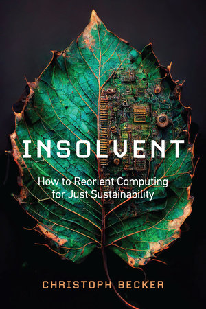

name: greenecc-jun25
class: title, middle

## Green Computing
### Intelligence artificielle et la crise climatique

Alex Hernández-García (he/il/él)

.turquoise[Green ECC · Virtuel · 12 juin 2025]

.center[

&nbsp&nbsp&nbsp&nbsp

]

.center[

&nbsp&nbsp&nbsp&nbsp

]

.smaller[.footer[
Slides: [alexhernandezgarcia.github.io/slides/{{ name }}](https://alexhernandezgarcia.github.io/slides/{{ name }})
]]

.qrcode[]

---

.left-column[
<figure>
	
  <figcaption>.center[.smaller[<a href="https://www.ledevoir.com/environnement/815840/emissions-carbone-google-ont-augmente-48-cinq-ans-cause-ia">Le Devoir</a>, 2 juillet 2024]]</figcaption>
</figure>
<figure>
	
  <figcaption>.center[.smaller[<a href="https://ici.radio-canada.ca/nouvelle/2045059/changements-climatiques-intelligence-artificielle-environnement-ia">Radio Canada</a>, 27 janvier 2024]]</figcaption>
</figure>
<figure>
	
  <figcaption>.center[.smaller[<a href="https://www.lapresse.ca/affaires/economie/2023-06-03/intelligence-artificielle/un-impact-environnemental-monstre.php">La Presse</a>, 3 juin 2023]]</figcaption>
</figure>
]
.right-column[
   
<figure>
	
  <figcaption>.center[.smaller[<a href="https://www.sciencepresse.qc.ca/actualite/2024/02/26/empreinte-environnementale-estimee-ia">Science Presse</a>, 26 février 2024]]</figcaption>
</figure>
<figure>
	
  <figcaption>.center[.smaller[<a href="https://www.lapresse.ca/affaires/economie/2023-06-03/intelligence-artificielle/un-impact-environnemental-monstre.php">Digital HEC</a>, 27 mars 2024]]</figcaption>
</figure>
]

---

count: false
name: title
class: title, middle

## L’empreinte carbone de l’IA

.center[]

---

## Pourquoi l’IA est-elle énergivore ?

--

.highlight1[Réponse courte et simple]: Les modèles d'intelligence artificielle sont exécutés par des ordinateurs et les ordinateurs sont énergivores.

--

> _Mais un ordinateur n'est pas si énergivore par rapport à d'autres choses, non ?_

--

> _Pas de tout !_

--

> _Et donc ?_

--

La question et la réponse sont plus complexes. Pour y réfléchir :

- Pourquoi le transport est-il énergivore ?
- Pourquoi la production alimentaire est-elle énergivore ?

???

Walking and biking is not energy-demanding, but transportation within car culture and mindless flying is.

Traditional agriculture is not energy-demanding, but food production based on animal products and fertilizers is.

--

.conclusion[L'intelligence artificielle n'est pas _nécessairement_ énergivore. Il existe une IA efficace et à petite échelle. Le principal **problème est l'échelle** que nous avons atteinte.]

---

## Pourquoi l’IA est-elle énergivore ?
### Une réponse plus nuancée

--

.left-column[
Qu'est-ce qu'un modèle d'intelligence artificielle ?

On peut considérer le pilier des modèles actuels d'intelligence artificielle comme des programmes informatiques qui transforment des données d'entrée par des opérations mathématiques pour produire des données de sortie.
]

.right-column[
.center[
<figure>
	
  .smaller[<figcaption>Schéma d'un réseau neuronal très simple.</figcaption>]
</figure>
]
]

--

.right-column[
.conclusion[Chaque opération mathématique consomme en peu d'énergie. Les grands modèles d'IA effectuent une myriade de ces opérations.]
]

---

## Pourquoi l’IA est-elle énergivore ?
### Une réponse plus nuancée

--

Il est important de distinguer deux phases principales dans la vie d'un modèle d'IA: .highlight1[entraînement] et .highlight1[déploiement]

--

- .highlight1[Entraînement]: Il s'agit du processus d'ajustement des poids qui modulent les opérations mathématiques dans le réseau neuronal afin que le modèle exécute avec succès la tâche souhaitée.

Certains modèles s'entraînent sur un ordinateur portable en quelques minutes ou quelques heures. Les modèles comme ChatGPT nécessitent plusieurs semaines et de nombreux ordinateurs puissants.

--

- .highlight1[Déploiement]: Il s'agit de l'utilisation du modèle une fois qu'il a été entraîné.

Certains modèles ne sont utilisés qu'avec modération. Les modèles comme ChatGPT sont utilisés par des millions d'utilisateurs chaque minute.

--

.conclusion[C'est le déploiement à grande échelle de très grands modèles qui pose problème dans un contexte de crise climatique.]

???

Talk about scaling is all you need and this philosophy promoted from the industry as part of a capitalist mindset.

---

## Estimation des émissions de carbone de l'IA

De quoi dépendent la consommation d'énergie et les émissions de GES d'un modèle IA ?

1. .highlight1[Temps des entraînements], $T$: somme totale du temps d'utilisation des machines de calcul (heures).
2. .highlight1[Puissance électrique], $P$, des machines de calcul (watts).
3. .highlight1[Facteur d'émission], $I$: ratio entre la quantité de gaz à effet de serre émis par quantité d'électricité produite par la source d'énergie (grammes de dioxyde de carbone par kilowatt-heure).

.references[
Luccioni and Hernandez-Garcia. [Counting Carbon: A Survey of Factors Influencing the Emissions of Machine Learning](https://arxiv.org/abs/2302.08476). arXiv 2302.08476, 2023.
]

--

La quantité de CO2 équivalent [CO2eq] émise lors de l'entraînement d'un modèle, C:

$$C = T \times P \times I = E \times I$$

--

.conclusion[Il est assez simple d'obtenir une estimation approximative, mais **il est vraiment difficile de calculer exactement** l'énergie due à des processus spécifiques.]

---

## Estimation des émissions
## de carbone de l'IA

.context[Les facteurs principaux sont les temps d'entraînement, la puissance électrique et le facteur d'émission.]

En 2022, avec Sasha Luccioni, nous avons réalisé une analyse des émissions de 95 modèles d'apprentissage automatique, en interrogeant les auteurs sur les détails de leur entraînement.

.center[]

.references[
Luccioni and Hernandez-Garcia. [Counting Carbon: A Survey of Factors Influencing the Emissions of Machine Learning](https://arxiv.org/abs/2302.08476). arXiv 2302.08476, 2023.
]

???

Talk about lack of transparency and difficulty to obtain data.

---

count: false

## Estimation des émissions
## de carbone de l'IA

.context[Les facteurs principaux sont les temps d'entraînement, la puissance électrique et le facteur d'émission.]

En 2022, avec Sasha Luccioni, nous avons réalisé une analyse des émissions de 95 modèles d'apprentissage automatique, en interrogeant les auteurs sur les détails de leur entraînement.

.center[]

.references[
Luccioni and Hernandez-Garcia. [Counting Carbon: A Survey of Factors Influencing the Emissions of Machine Learning](https://arxiv.org/abs/2302.08476). arXiv 2302.08476, 2023.
]

---

count: false

## Estimation des émissions
## de carbone de l'IA

.context[Les facteurs principaux sont les temps d'entraînement, la puissance électrique et le facteur d'émission.]

En 2022, avec Sasha Luccioni, nous avons réalisé une analyse des émissions de 95 modèles d'apprentissage automatique, en interrogeant les auteurs sur les détails de leur entraînement.

.center[]

.conclusion[Il existe de grandes différences dans le [facteur d'émission du réseau énergétique](https://ourworldindata.org/grapher/carbon-intensity-electricity). De ~10 gCO2eq/kWh dans le cas de l'énergie hydroélectrique à près de 700 gCO2eq/kWh pour le charbon.]

---

## Estimation des émissions
## de carbone de l'IA
### Puissance électrique

.context[Les facteurs principaux sont les temps d'entraînement, la puissance électrique et le facteur d'émission.]

.center[]

.conclusion[Par contre, il n'existe de grandes différences de puissance électrique dans le hardware utilisé.]

---

## Estimation des émissions
## de carbone de l'IA

.context[Les facteurs principaux sont les temps d'entraînement, la puissance électrique et le facteur d'émission.]

Le facteur d'émission depends du réseau énergétique et la puissance électrique est similaire pour les différentes options de hardware. .highlight1[Le facteur définitif restant est le temps d'entraînement].

.center[]

--

.conclusion[Il existe de grandes différences de temps d'entraînement et donc des émissions de CO2eq.]

???

Charging an average smartphone uses about 22 Wh.

In terms of training time, the models in our sample range from just about 15 minutes (total GPU/TPU time) up to more than 400,000 hours, with a median of 72 hours, pointing again to large variance in our sample. While the maximum of of 400,000 GPU hours (equivalent to about 170 days with 100 GPUs) in our sample seems very large, note that the total training time of GPT-3 was estimated to be over 3.5 million hours (14.8 days with 10,000 GPUs).

The total carbon emissions of the models analyzed in our study is about 253 tons of CO2eq, which is equivalent to about 100 flights from London to San Francisco or from Nairobi to Beijing.

---

## Estimation de la consommation d'énergie de l'IA
### Comparison des modèles IA

Le modèle .highlight1[le plus léger] a été entraîné en .highlight1[15 minutes], tandis que l'un des modèles a nécessité 400 000 heures.

--

Le .highlight1[total des émissions] de carbone des modèles analysés dans notre étude (95) est d'environ .highlight1[253 tonnes de CO2eq], ce qui correspond à .highlight1[environ 100 vols] de Londres à San Francisco.

--

.highlight1[GPT-3], le prédécesseur de ChatGPT, a nécessité .highlight1[3,5 millions d'heures] d'entraînement (14,8 jours avec 10 000 GPU) et .highlight1[500 toones de CO2eq], ce qui équivaut à .highlight1[450 vols] transatlantiques.

---

## Comparison des modèles IA

.context[Est-ce que plus d'énergie et de CO2 conduisent à une meilleure performance du modèle ?]

 
.center[]

---

count: false

## Comparison des modèles IA

.context[Est-ce que plus d'énergie et de CO2 conduisent à une meilleure performance du modèle ?]

 
.center[]

.conclusion[L'une des conclusions de notre étude est qu'il n'existe qu'une faible corrélation entre la consommation d'énergie et la performance. _Plus gros n'est pas mieux_.]

---

## Comparison des modèles IA
### Que dire des grands modèles de langage modernes ?

Tout d'abord, les grandes entreprises ne fournissent pratiquement aucune information sur les besoins énergétiques de leurs modèles.

Grâce au travail des chercheuses et chercheurs, nous en savons de plus en plus.

--

- Les émissions de carbone de l'entraînement de BLOOM ont été estimées à 25 tonnes de CO2eq. .cite[(Luccioni et al., 2022)]
- Au plus fort de la popularité de ChatGPT en 2023, l'application consommait environ 564 mégawattheures d'électricité par jour, équivalent à la consommation quotidienne d'énergie d'environ 19 000 familles des États Unis. .cite[(de Vries, 2023)]

.references[
- Luccioni, Viguier, Ligozat. [Estimating the Carbon Footprint of BLOOM, a 176B Parameter Language Model](https://arxiv.org/abs/2211.02001). arXiv 2211.02001, 2022.
- de Vries. [The growing energy footprint of artificial intelligence](https://www.cell.com/action/showPdf?pii=S2542435123003653). CellPress, 2023.
- Luccioni, Jernite, Strubell. [Power Hungry Processing: Watts Driving the Cost of AI Deployment?](https://arxiv.org/abs/2311.16863). arXiv 2311.16863, 2023.
- [AI Energy Score](https://huggingface.co/spaces/AIEnergyScore/Leaderboard)
]

???

25 tons of CO2eq are equivalent to 180,000 km en voiture.

25 tons of CO2eq are equivalent to 40 short-haul flights.

https://www.openco2.net/en/co2-converter

---

## Comparison des modèles IA
### Que dire des grands modèles de langage modernes ?

.center[]

.references[
de Vries. [The growing energy footprint of artificial intelligence](https://www.cell.com/action/showPdf?pii=S2542435123003653). CellPress, 2023.
]

---

count: false

## Comparison des modèles IA
### Que dire des grands modèles de langage modernes ?

.center[]

.conclusion[Une interaction avec ChatGPT pourrait consommer 10 fois plus d'énergie qu'une recherche Google.]

???

Charging an average smartphone uses about 22 W.

---

## Comparison des modèles IA
### Que dire des grands modèles de langage modernes ?

.center[]

.references[
- [AI Energy Score](https://huggingface.co/spaces/AIEnergyScore/Leaderboard)
- Chen. [How much energy will AI really consume? The good, the bad and the unknown](https://www.nature.com/articles/d41586-025-00616-z). Nature, News Feature, 2025.
]

---

## Demande d'énergie des centres de données
### Estimations actuelles et projections future

.center[]

.references[
- Chen. [How much energy will AI really consume? The good, the bad and the unknown](https://www.nature.com/articles/d41586-025-00616-z). Nature, News Feature, 2025.
]

---

## Autres impacts de l'IA

.context[Les grands modèles d'IA déployés à grande échelle demandent beaucoup d'énergie et émettent donc des GES.]

 
Outre l'énergie, les centres de données et donc l'IA consomment de .highlight1[grandes quantités d'eau potable] et exigent des .highlight1[matériaux rares].

De plus, il ne faut pas oublier l'impact social, comme les .highlight1[mauvaises conditions de travail] et l'.highlight1[accroissement des inégalités].

.center[]

.references[
- Li et al. [Making AI Less "Thirsty": Uncovering and Addressing the Secret Water Footprint of AI Models](https://arxiv.org/abs/2304.03271). arXiv 2304.03271, 2023.
- Crawford. [Atlas of AI](https://en.wikipedia.org/wiki/Atlas_of_AI), 2021
]

---

## Initiatives pour réduire l'impact

- Sensibilisation aux impacts environnementaux
- Transparence améliorée des impacts sur l'environnement
- Développement de modèles plus efficaces
- Privilégier les modèles plus efficaces
- Utilisation modérée, proportionnée et consciente des outils d'intelligence artificielle

--

En ce qui concerne l'efficacité, il est important de toujours se rappeler le [paradoxe de Jevons](https://www.sciencedirect.com/science/article/abs/pii/S0921800905001084?via%3Dihub): les gains d'efficacité technologique augmentent souvent l'utilisation globale des ressources.

.references[
- Alcott. [Jevons' paradox](https://www.sciencedirect.com/science/article/abs/pii/S0921800905001084?via%3Dihub), Ecological Economics, 2005.
- Lange and Santarius. [Digitalization and energy consumption. Does ICT reduce energy demand?](https://doi.org/10.1016/j.ecolecon.2020.106760), Ecological Economics, 2020.
]

???

For example, historically, despite a one hundredfold efficiency increase from the first light bulb to a contemporary LED bulb, increase in electricity demand for light bulbs has entirely offset these gains. A landmark study concluded that “global energy use for lighting has experienced 100% rebound over 300 years, six continents, and five technologies” (Saunders and Tsao 2012; Tsao et al. 2010). (Insolvent)

100x efficiency gains since first bulb but 2x more energy usage

---

## Sur l'utilisation consciente de l'IA

.context35[Récemment, l'IA a été déployée dans un grand nombre de nos outils quotidiens.]

 
Copilot est un exemple d'intégration de l'IA dans les outils professionnels. Des chercheurs en France ont étudié son impact énergétique.

.center[]

.references[
Coignion, Quinton, Rouvoy. [Green My LLM: Studying the key factors affecting the energy consumption of code assistants](https://arxiv.org/abs/2411.11892), arXiv 2411.11892, 2024.
]

---

count: false

## Sur l'utilisation consciente de l'IA

.context35[Récemment, l'IA a été déployée dans un grand nombre de nos outils quotidiens.]

 
Copilot est un exemple d'intégration de l'IA dans les outils professionnels. Des chercheurs en France ont étudié son impact énergétique.

.center[]

.conclusion[La plupart des résultats de Copilot sont simplement gaspillés.]

---

## Pour en savoir plus

.columns-4[.center[
<figure>
	
  <figcaption>.smaller[[Insolvent, Christoph Becker (2023)](https://direct.mit.edu/books/oa-monograph/5594/InsolventHow-to-Reorient-Computing-for-Just)]</figcaption>
</figure>
]]
.columns-4[.center[
<figure>
	
  <figcaption>.smaller[[Science as Social Knowledge, Helen Longino (1990)](https://www.jstor.org/stable/j.ctvx5wbfz)]</figcaption>
</figure>
]]
.columns-4[.center[
<figure>
	
  <figcaption>.smaller[[Atlas of AI, Kate Crawford (2021)](https://en.wikipedia.org/wiki/Atlas_of_AI)]</figcaption>
</figure>
]]
.columns-4[.center[
<figure>
	
  <figcaption>.smaller[[Race After Technology, Ruha Benjamin (2019)](https://en.wikipedia.org/wiki/Race_After_Technology)]</figcaption>
</figure>
]]

.references[
- Fernandes, Sano-Franchini and McIntyre. [What Is GenAI Refusal?](https://refusinggenai.wordpress.com/what-is-refusal/). 2024.
- Abramovich and Ma. [Evaluating Refusal](https://evaleval.github.io/accepted_papers/EvalEval_24_Abramovich.pdf). 2024.
]

---

count: false
name: title
class: title, middle

## Le rôle de l'IA dans le développement durable

.center[]

???

More positive note

---

## Panorama des applications de l'IA pour le développement durable

.highlight1[L'intelligence artificielle] ne doit pas être considérée comme la principale solution à la crise climatique, mais elle .highlight1[peut être utilisée dans de nombreux domaines] liés à l'.highlight1[atténuation] du changement climatique et à l'.highglight1[adaptation] à celui-ci.

- Optimisation énergétique des bâtiments et infrastructures.
- Optimisation de la production et de la distribution d'énergie
- Prédiction et gestion des ressources naturelles.
- Optimisation des réseaux et de la gestion des transports
- Amélioration des modèles climatiques
- Sensibilisation au changement climatique
- Applications dans la conception de matériaux innovants

.references[
Rolnick et al. [Tackling Climate Change with Machine Learning](https://dl.acm.org/doi/10.1145/3485128), ACM Computing Surveys, 2022.
]

---

## Panorama des applications de l'IA pour le développement durable

.highlight1[L'intelligence artificielle] ne doit pas être considérée comme la principale solution à la crise climatique, mais elle .highlight1[peut être utilisée dans de nombreux domaines] liés à l'.highlight1[atténuation] du changement climatique et à l'.highglight1[adaptation] à celui-ci.

- Optimisation énergétique des bâtiments et infrastructures.
- Optimisation de la production et de la distribution d'énergie
- Prédiction et gestion des ressources naturelles.
- Optimisation des réseaux et de la gestion des transports
- Amélioration des modèles climatiques
- .highlight2[Sensibilisation au changement climatique]
- .highlight2[Applications dans la conception de matériaux innovants]

.references[
Rolnick et al. [Tackling Climate Change with Machine Learning](https://dl.acm.org/doi/10.1145/3485128), ACM Computing Surveys, 2022.
]

---

name: title
class: title, middle

## Cas concret
### Sensibilisation au changement climatique

.center[]

---

## Sensibilisation au changement climatique

Il y a un décalage entre la gravité de la crise climatique et les préoccupations du public à ce sujet.

.center[
<figure>
	
  .smaller[<figcaption>Stokes et al., <a href="https://www.pewresearch.org/global/2015/11/05/1-concern-about-climate-change-and-its-consequences/">Global concern about climate change, broad support for limiting emissions</a>. Pew Research, 2015</figcaption>]
</figure>
]

---

count: false

## Cas concret
### Sensibilisation au changement climatique

Il y a un décalage entre la gravité de la crise climatique et les préoccupations du public à ce sujet. .highlight1[_Pourquoi ?_]

--

* .highlight1[Distance psychologique]: 
> "_People struggle to engage with climate change because they perceive it as distant: temporally, geographically and/or socially. _" .cite[Stoknes, 2016]

.references[
* Stoknes, P. E. [Why the human brain ignores climate change—and what to do about it](https://documentcloud.adobe.com/link/track?uri=urn%3Aaaid%3Ascds%3AUS%3A1ef80b88-177c-4e5d-b879-d6d3a059c694). Environmental Reality: Rethinking the Options, 2016.
]

???

The dot next to US is Australia, then Canada, then Russia.

---

count: false

## Cas concret
### Sensibilisation au changement climatique

Il y a un décalage entre la gravité de la crise climatique et les préoccupations du public à ce sujet. .highlight1[_Pourquoi ?_]

* .highlight1[Distance psychologique]: 
> "_People struggle to engage with climate change because they perceive it as distant: temporally, geographically and/or socially. _" .cite[Stoknes, 2016]
* .highlight1[Doom-framings et fatigue des messages clichés]:
> "_[C]lichéd images of climate change [...]—such as ‘smokestacks’, deforestation, and polar bears on melting ice—were positively received [but] also produced a muted emotional response and often prompted cynicism._" .cite[Chapman et al., 2016]

.references[
* Stoknes, P. E. [Why the human brain ignores climate change—and what to do about it](https://documentcloud.adobe.com/link/track?uri=urn%3Aaaid%3Ascds%3AUS%3A1ef80b88-177c-4e5d-b879-d6d3a059c694). Environmental Reality: Rethinking the Options, 2016.
* Chapman, D. A. et al. [Climate visuals: A mixed methods investigation of public perceptions of climate images in three countries](https://sci-hub.st/https://www.sciencedirect.com/science/article/abs/pii/S095937801630351X). GCE, 2016.
]

---

count: false

## Cas concret
### Sensibilisation au changement climatique

Il y a un décalage entre la gravité de la crise climatique et les préoccupations du public à ce sujet. .highlight1[_Pourquoi ?_]

* .highlight1[Distance psychologique]: 
> "_People struggle to engage with climate change because they perceive it as distant: temporally, geographically and/or socially. _" .cite[Stoknes, 2016]
* .highlight1[Doom-framings et fatigue des messages clichés]:
> "_[C]lichéd images of climate change [...]—such as ‘smokestacks’, deforestation, and polar bears on melting ice—were positively received [but] also produced a muted emotional response and often prompted cynicism._" .cite[Chapman et al., 2016]

.conclusion[Une plus grande sensibilisation du public pourrait accélérer les changements politiques. L'IA peut-elle aider ?]

---

## Notre objectif
### .alpha0[Placeholder]

.context[On perçoit la menace du changement climatique comme étant éloignée dans le temps, géographiquement et socialement.]

--

 
.center[.bigger[.highlight1[Est-il possible d'aider les gens à visualiser les effets du changement climatique chez eux ?]]]

--

.left-column[
<figure>
	
  <figcaption>Montréal, Québec, Canada</figcaption>
</figure>
]
.right-column[
<figure>
	
  <figcaption>Berlin, Germany</figcaption>
</figure>
]
.left[
]
.right[
]

---

count: false

## Notre objectif
### Inondations

.context[On perçoit la menace du changement climatique comme étant éloignée dans le temps, géographiquement et socialement.]

 
.center[.bigger[.highlight1[Est-il possible d'aider les gens à visualiser les effets du changement climatique chez eux ?]]]

.left-column[
<figure>
	
  <figcaption>Montréal, Québec, Canada</figcaption>
</figure>
]
.right-column[
<figure>
	
  <figcaption>Berlin, Germany</figcaption>
</figure>
]
.left[
]
.right[
]

---

count: false

## Notre objectif
### Feux de fôret

.context[On perçoit la menace du changement climatique comme étant éloignée dans le temps, géographiquement et socialement.]

 
.center[.bigger[.highlight1[Est-il possible d'aider les gens à visualiser les effets du changement climatique chez eux ?]]]

.left-column[
<figure>
	
  <figcaption>Montréal, Québec, Canada</figcaption>
</figure>
]
.right-column[
<figure>
	
  <figcaption>Berlin, Germany</figcaption>
</figure>
]
.left[
]
.right[
]

---

count: false

## Notre objectif
### Smog

.context[On perçoit la menace du changement climatique comme étant éloignée dans le temps, géographiquement et socialement.]

 
.center[.bigger[.highlight1[Est-il possible d'aider les gens à visualiser les effets du changement climatique chez eux ?]]]

.left-column[
<figure>
	
  <figcaption>Montréal, Québec, Canada</figcaption>
</figure>
]
.right-column[
<figure>
	
  <figcaption>Berlin, Germany</figcaption>
</figure>
]
.left[
]
.right[
]

---

## Notre objectif

Un site web pour encourager la sensibilisation et l'action en matière de changement climatique.

.context[On peut rechercher l'adresse de notre choix.]

.center[]

---

count: false

## Notre objectif

Un site web pour encourager la sensibilisation et l'action en matière de changement climatique.

.context65[Obtenir une visualisation générée par l'IA sur une photo de rue.]

.center[]

---

count: false

## Notre objectif

Un site web pour encourager la sensibilisation et l'action en matière de changement climatique.

.context65[En savoir plus sur le changement climatique et les moyens d'agir maintenant.]

.center[]

---

count: false

## Essayons-la !

.center[
.bigger[.bigger[[CeClimatNExistePas.com](https://ceclimatnexistepas.com)]]
]

.center[]

???

https://thisclimatedoesnotexist.com/en/share/56d8058c-23d5-4083-b1b4-4afe6a5b2fe9

---

## Méthodes
### Défis principaux

.context[L'algorithme devait être capable de générer des inondations réalistes sur n'importe quelle photo de Google Street View.]

--

.left-column-66[

* La perception visuelle est sensible aux scènes irréalistes :
    * Texture de l'eau (reflets, luminosité, etc.)
    * Géométrie de la scène (bords, obstacles, etc.)
    * Physique (pente, point de vue, etc.)
* L'algorithme a été conçu pour être déployé _in the wild_ et devrait fonctionner avec une grande variété de photos.
* Nous avons dû surmonter le manque de données d'entraînement : il n'existe pas de bases de donnés de photos avant et après une inondation.
]
.right-column-33[
.center[

]
]

---

## Methods
### Caractéristiques principales

.context[La simulation d'inondations photo-réalistes est un défi car la perception visuelle est très sensible aux scènes irréalistes et au manque de données.]

--

.left-column[

* Des données provenant d'un .highlight1[monde virtuel simulé] pour pallier le manque de données de formation
* .highlight1[Domain adaptation] pour réduire l'écart entre les photos simulées et les photos réelles
* Génération d'inondations en deux temps : .highlight1[Masker] + .highlight1[Painter]
* Combinaison de la .highlight1[segmentation de profondeur] et de la .highlight1[segmentation sémantique] pour améliorer les prédictions de masque d'eau
* .highlight1[Génération d'images conditionnelles] pour peindre de l'eau réaliste sur le masque prédit
]
.right-column[

]

---

## Pour en savoir plus

Visitez le site web : [CeClimatNEXistePas.com](https://ceclimatnexistepas.com)

.center[]
    
Lisez l'article (ICLR 2022): [ClimateGAN: Raising Climate Change Awareness by Generating Images of Floods](https://arxiv.org/abs/2110.02871v1)

.center[]
    
---

## Résumé

- Certains modèles actuels d'intelligence artificielle ont un impact environnemental important en raison de leur taille et de leur déploiement à grande échelle.
	- Mais tous les modèles ne sont pas énergivores.

--
- Nous jouons un rôle important dans la durabilité du développement, de l'utilisation et de l'adoption de l'IA.

--
- L'intelligence artificielle peut être appliquée dans de nombreux domaines pour contribuer à la lutte contre la crise climatique. Par exemple, pour la sensibilisation au changement climatique.

---

name: greenecc-jun25
class: title, middle

Alex Hernández-García (he/il/él)

.center[

&nbsp&nbsp&nbsp&nbsp

&nbsp&nbsp&nbsp&nbsp

&nbsp&nbsp&nbsp&nbsp

]

.footer[[alexhernandezgarcia.github.io](https://alexhernandezgarcia.github.io/) | [alex.hernandez-garcia@mila.quebec](mailto:alex.hernandez-garcia@mila.quebec)] | [alexhergar.bsky.social](https://bsky.app/profile/alexhergar.bsky.social)  

.smaller[.footer[
Slides: [alexhernandezgarcia.github.io/slides/{{ name }}](https://alexhernandezgarcia.github.io/slides/{{ name }})
]]
