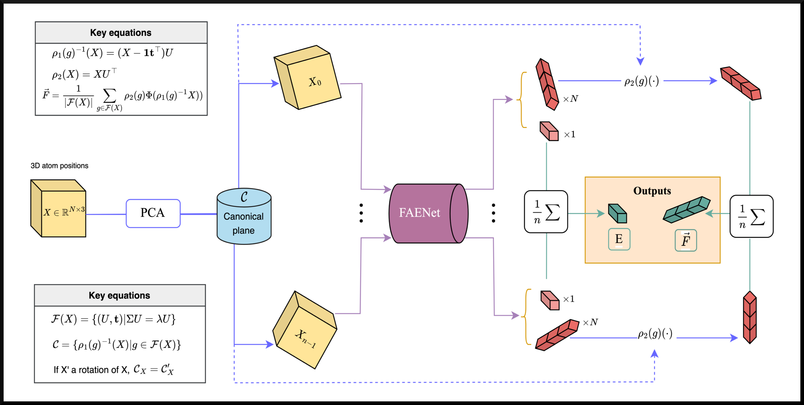
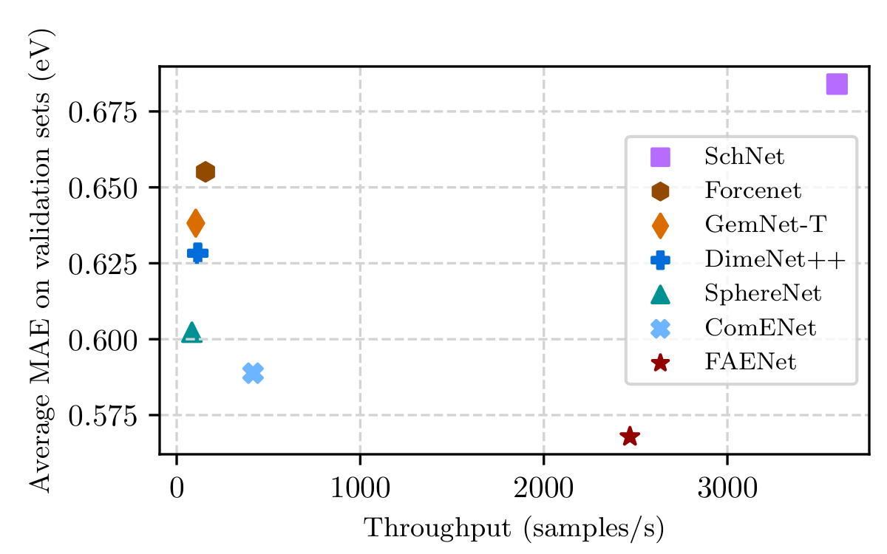

name: title
class: title, middle

### Generative and predictive models for scientific discovery with machine learning

Alex Hernández-García (he/il/él)

.turquoise[ICML at Mila · July 24th 2023]

.center[

&nbsp&nbsp&nbsp&nbsp

]

.smaller[.footer[
Slides: [alexhernandezgarcia.github.io/slides/icml-mila-23](https://alexhernandezgarcia.github.io/slides/icml-mila-23)
]]

---

## A transversal summary of different but related papers

* [A theory of continuous generative flow networks](https://icml.cc/virtual/2023/poster/25220) .smaller[(Salem, Tristan, Pablo, Dinghuai, Sasha, Léna, Yoshua and Kolya)]
* [Multi-Objective GFlowNets](https://icml.cc/virtual/2023/poster/23924) .smaller[(Moksh, Sharath, Jarrid, Yoshua, Emmanuel et al.)]
* [FAENet: Frame Averaging Equivariant GNN for Materials Modeling](https://icml.cc/virtual/2023/poster/23593) .smaller[(Alexandre, Victor, Yoshua, David et al.)]

   
.conclusion[Common thread: Generative and predictive models for scientific discovery with machine learning]

---

name: title
class: title, middle

## Motivation: Why scientific discovery?
### Part 1

.center[]

---

## Why scientific discovery?

.context[Climate change is a major challenge for humanity.]

.left-column-66[.center[
<figure>
	
  <figcaption>.smaller[Modelled and observed global average temperatures in the last 2 millenia (source graphic: <a href="https://www.theguardian.com/science/2021/aug/09/humans-have-caused-unprecedented-and-irreversible-change-to-climate-scientists-warn">The Guardian</a>.)]</figcaption>
</figure>
]]

.right-column-33[
Consequences:
* Melting glaciers and polar ice
* Sea level rise
* Heatwaves
* Floods
* Droughts
* Wildfires
* ...
]

--

.conclusion[But [global warming will stop](https://www.carbonbrief.org/explainer-will-global-warming-stop-as-soon-as-net-zero-emissions-are-reached/) if we stop GHG emissions!]

???

* Flash floods kill **5,000** people per year.
* Sea levels are expected to rise by **2 metres** by the end of the century
* Rising sea levels could disrupt the lives of **1 billion people** by the end of 2050.
* As much as **40% of the Amazon** forest is at risk of becoming a savanna.
* In 2015, forest fires claimed roughly **980 000 $km^2$** of the world’s forest.
* Forest fires emmitted **~1.8 Gt of CO2** in 2019.

---

## Why scientific discovery?

.context["The time for action is now"]

> "Limiting global warming will require major transitions in the energy sector. This will involve a substantial reduction in fossil fuel use, widespread electrification, .highlight1[improved energy efficiency, and use of alternative fuels (such as hydrogen)]." .cite[IPCC Sixth Assessment Report, 2022]

> "Net-zero CO2 emissions from the industrial sector are challenging but possible. Reducing industry emissions will entail coordinated action throughout value chains to promote all mitigation options, including demand management, .highlight1[energy and materials efficiency, circular material flows], as well as abatement technologies and transformational changes in production processes." .cite[IPCC Sixth Assessment Report, 2022]

--

 

.conclusion[Mitigation of the climate crisis requires transformational changes in the energy and materials efficiency.]

---

## Traditional scientific discovery loop

.context35[The climate crisis demands accelerating scientific discoveries.]

.right-column-66[ .center[]]

.left-column-33[
The .highlight1[traditional pipeline] for scientific discovery (paradigms 1-3):
* relies on .highlight1[highly specialised human expertise],
* it is .highlight1[time-consuming] and
* .highlight1[financially and computationally expensive].
]

---

count: false

## Machine learning in the loop

.context35[The traditional scientific discovery loop is too slow.]

.right-column-66[ .center[]]

.left-column-33[
A .highlight1[machine learning model] can be:
* trained with data from _real-world_ experiments and
* used to quickly and cheaply evaluate queries
]

---

count: false

## Machine learning in the loop

.context35[The traditional scientific discovery loop is too slow.]

.right-column-66[ .center[]]

.left-column-33[
A .highlight1[machine learning model] can be:
* trained with data from _real-world_ experiments and
* used to quickly and cheaply evaluate queries

.conclusion[A machine learning model replacing real-world experiments can _only_ provide _linear_ gains.]

.conclusion[Not enough if the search space is very large ($10^{180}$ stable materials)]
]

---

count: false

## _Generative_ machine learning in the loop

.context[Can we do better than _linear_? An agent in the loop.]

.right-column-66[ .center[]]

.left-column-33[
A .highlight1[machine learning **agent**] in the loop can:
* .highlight1[learn structure] from the available data,
* .highlight1[generalise] to unexplored regions of the search space and
* .highlight1[build better queries]
]

---

count: false

## _Generative_ machine learning in the loop

.context[Can we do better than _linear_? An agent in the loop.]

.right-column-66[ .center[]]

.left-column-33[
A .highlight1[machine learning **agent**] in the loop could (ideally):
* .highlight1[learn structure] from the available data,
* .highlight1[generalise] to unexplored regions of the search space and
* .highlight1[build better queries]

.conclusion[A successful AL pipeline with an ML agent in the loop can provide _exponential_ gains.]
]

---

count: false

## _Generative_ machine learning in the loop

.context[GFlowNet as the agent.]

.right-column-66[ .center[]]

.left-column-33[
A .highlight1[machine learning **agent**] in the loop could (ideally):
* .highlight1[learn structure] from the available data,
* .highlight1[generalise] to unexplored regions of the search space and
* .highlight1[build better queries]

.conclusion[A successful AL pipeline with an ML agent in the loop can provide _exponential_ gains.]
]

.references[
Jain et al. [GFlowNets for AI-Driven Scientific Discovery](https://arxiv.org/abs/2302.00615). Digital Discovery, Royal Society of Chemistry, 2023.
]

---

## Machine learning for scientific discovery
### Challenges and limitations of existing methods

.highlight1[Challenge]: very large search spaces.

--

&rarr; Need for .highlight2[efficient modelling, search and generalisation] of underlying structure.

--

.highlight1[Challenge]: underspecification of objective functions or metrics.

--

&rarr; Need for .highlight2[diverse] candidates.

--

.highlight1[Limitation]: Reinforcement learning and MCMC methods are good at optimisation but poor at mode mixing.

--

&rarr; Need for .highlight2[_multi-modal_ optimisation].

---

name: title
class: title, middle

## A flash introduction to GFlowNets
### Part 2

.center[]

---

## GFlowNet in a nutshell

 
Given a reward or objective function $R(x)$, GFlowNet can be seen a generative model trained to sample objects $x \in \cal X$ according to .highlight1[a sampling policy $\pi(x)$ proportional to the reward $R(x)$]: $\pi(x) \propto R(x)$

--

&rarr; Sampling proportionally to the reward function induces .highlight1[multi-modal search and diversity].

--

.left-column[
The policy $\pi_{\theta}(x)$ is modelled by a deep neural network, parameterised by $\theta$, thus providing .highlight1[amortised inference].

&rarr; Amortised inference can be thought of as _exploration with memory_, which induces .highlight1[systematic generalisation].
]

.right-column[
.center[]
]

---

## GFlowNet in a nutshell

* Objects $x \in \cal X$ are constructed through a sequence of steps $\tau$ from an action space $\cal A$.
* At each step of the trajectory $\tau=(s_0\rightarrow s_1 \rightarrow \dots \rightarrow s_f)$, we get a partially constructed object $s$ in state space $\cal S$.
* This induces a directed acyclic graph (DAG) $\mathcal{G}=(\mathcal{S},\mathcal{A})$, with all possible constructions in the domain.

.center[]

--

.conclusion[This terminology is reminiscent of reinforcement learning.]

---

## An intuitive toy example

Task: find arrangements of Tetris pieces on the board that minimise the empty space.

.left-column[
.center[]
]

.right-column[
  
]

--

.conclusion[This task resembles designing DNA sequences or molecules or materials via fragments, with the objective of optimising certain properties.]

---

## An intuitive toy example

Task: find arrangements of Tetris pieces on the board that minimise the empty space.

.columns-3-left[.center[
  <figure>
    
    <figcaption>State space $\cal S$</figcaption>
  </figure>
]]

.columns-3-center[.center[
  <figure>
    
    <figcaption>Action space $\cal A$</figcaption>
  </figure>
]]

.columns-3-right[.center[

  

  <figure>
      
    <figcaption>$s_0$</figcaption>
  </figure>
  

  

  $\rightarrow$
  

  

  <figure>
      
    <figcaption>$s_1$</figcaption>
  </figure>
  

  

  $\rightarrow$
  

  

  <figure>
      
    <figcaption>$s_2$</figcaption>
  </figure>
  

]]

---

## An intuitive toy example

Task: find arrangements of Tetris pieces on the board that minimise the empty space.

.center[

  

  <figure>
      
    <figcaption>Score: 0/12</figcaption>
  </figure>
  

  

  <figure>
      
    <figcaption>Score: 4/12</figcaption>
  </figure>
  

  

  <figure>
      
    <figcaption>Score: 8/12</figcaption>
  </figure>
  

  

  <figure>
      
    <figcaption>Score: 12/12</figcaption>
  </figure>
  

]

---

## An intuitive toy example

Task: find arrangements of Tetris pieces on the board that minimise the empty space.

.center[

  

  <figure>
      
    <figcaption>Score: 12/12</figcaption>
  </figure>
  

  

  <figure>
      
    <figcaption>Score: 12/12</figcaption>
  </figure>
  

  

  <figure>
      
    <figcaption>Score: 12/12</figcaption>
  </figure>
  

  

  <figure>
      
    <figcaption>Score: 12/12</figcaption>
  </figure>
  

  

  <figure>
      
    <figcaption>Score: 12/12</figcaption>
  </figure>
  

]

.conclusion[The _reward function_ of this task has multiple modes. With a larger board and more pieces, the number of combinations and modes grow exponentially and the task of efficiently finding them is non-trivial for machine learning models.]

---

name: title
class: title, middle

## A theory of continuous generative flow networks

.references[
Lahlou et al. [A Theory of Continuous Generative Flow Networks](https://arxiv.org/abs/2301.12594), ICML, 2023. 
]

---

## Continuous GFlowNets

We have generalised the theory and implementation of GFlowNets to encompass both discrete and continuous or hybrid state spaces.

.center[

]

.conclusion[Continuous GFlowNets are allowing us to progress in our efforts to generate molecular conformations and crystal structure to accelerate scientific discoveries.]

---

name: title
class: title, middle

## Multi-Objective GFlowNets

.references[
Jain et al. [Multi-Objective GFlowNets](https://arxiv.org/abs/2210.12765), ICML, 2023. 
]

---

## Multi-objective GFlowNets (MOGFN)

We have extended GFlowNets to handle multi-objective optimisation and not only cover the Pareto front but also sample diverse objects at each pointin the Pareto front.

.center[

]

.conclusion[Multi-objective GFlowNets allow us to generate diverse candidates with high scores of multiple properties, reducing the impact of the critical problem of underspecification in scientific discovery.]

---

name: title
class: title, middle

## FAENet: Frame Averaging Equivariant GNN for Materials Modeling

.references[
Duval, Schmidt et al. [FAENet: Frame Averaging Equivariant GNN for Materials Modeling](https://arxiv.org/abs/2305.05577), ICML, 2023. 
]

---

## FAENet

We have presented a flexible framework for data-driven equivariance of GNNs and an architecture (FAENet) that is simple, fast at inference and expressive. 

.center[

]

.conclusion[FAENet will allow us to efficiently and effectively train GFlowNets in a multi-fidelity active learning pipeline.]

---

## FAENet

We have presented a flexible framework for data-driven equivariance of GNNs and an architecture (FAENet) that is simple, fast at inference and expressive. 

.center[

]

.conclusion[FAENet will allow us to efficiently and effectively train GFlowNets in a multi-fidelity active learning pipeline.]

---

name: title
class: title, middle

## Summary and conclusions

.center[]

---

## Summary and conclusions

* Tackling the most pressing problems for humanity, such as the climate crisis and the threat of global pandemics, requires .highlight1[accelerating the pace of scientific discovery].
* AI-driven scientific discovery demands learning methods that can .highlight1[efficiently model and discover diverse candidates in very large, multi-modal search spaces].
* .highlight1[GFlowNet] is a suitable method for diverse sampling.
* .highlight1[Continuous GFlowNets] enable search in continuous spaces.
* .highlight1[Multi-objective GFlowNets] enable multi-objective optimisation.
* .highlight1[FAENet] provides efficient and effective modelling of materials to train GFlowNets.

.references[
* Lahlou et al. [A Theory of Continuous Generative Flow Networks](https://arxiv.org/abs/2301.12594), ICML, 2023. 
* Jain et al. [Multi-Objective GFlowNets](https://arxiv.org/abs/2210.12765), ICML, 2023. 
* Duval, Schmidt et al. [FAENet: Frame Averaging Equivariant GNN for Materials Modeling](https://arxiv.org/abs/2305.05577), ICML, 2023. 
]

--

.highlight2[Open source code]: [github.com/alexhernandezgarcia/gflownet](https://github.com/alexhernandezgarcia/gflownet)

---

## Acknowledgements

.left-column[
* Salem
* Tristan
* Sasha
* Kolya
* Pablo
* Moksh
* Sharath
* Emmanuel
* Alexandre
* Victor
]

.right-column[
* Yoshua
* David
* Santiago
* IVADO
* CIFAR
* ...
]

---

name: title
class: title, middle

## Thanks! Questions? 

Alex Hernández-García (he/il/él)

.center[

&nbsp&nbsp&nbsp&nbsp

]

.footer[[alexhernandezgarcia.github.io](https://alexhernandezgarcia.github.io/) | [alex.hernandez-garcia@mila.quebec](mailto:alex.hernandez-garcia@mila.quebec)] 
.footer[[@alexhg@scholar.social](https://scholar.social/@alexhg)  | [@alexhdezgcia](https://twitter.com/alexhdezgcia) ]

.smaller[.footer[
Slides: [alexhernandezgarcia.github.io/slides/icml-mila-23](https://alexhernandezgarcia.github.io/slides/icml-mila-23)
]]

