name: implicated-scientist-iclr26
class: title, middle

## The implicated scientist
### On the role of AI researchers in the development of weapons systems

Alexandra Volokhova, Alex Hernández-García

.turquoise[[AI for Peace workshop](https://aiforpeaceworkshop.github.io/) · ICLR 2026 · Rio de Janeiro · April 26 2026]

.center[

&nbsp&nbsp&nbsp&nbsp

]

.center[

]

.smaller[.footer[
Slides: [alexhernandezgarcia.com/slides/{{ name }}](https://alexhernandezgarcia.com/slides/{{ name }})
]]

---

name: title
class: title, middle

## Context
### The world is struggling with armed conflicts

---

.center[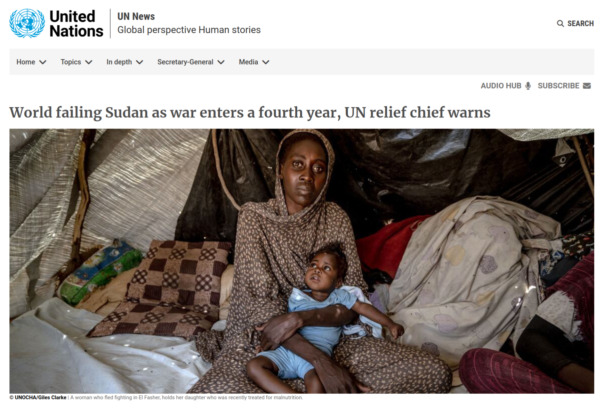]

.references[[April 14th, 2026](https://news.un.org/en/story/2026/04/1167301)]

---

count: false

.center[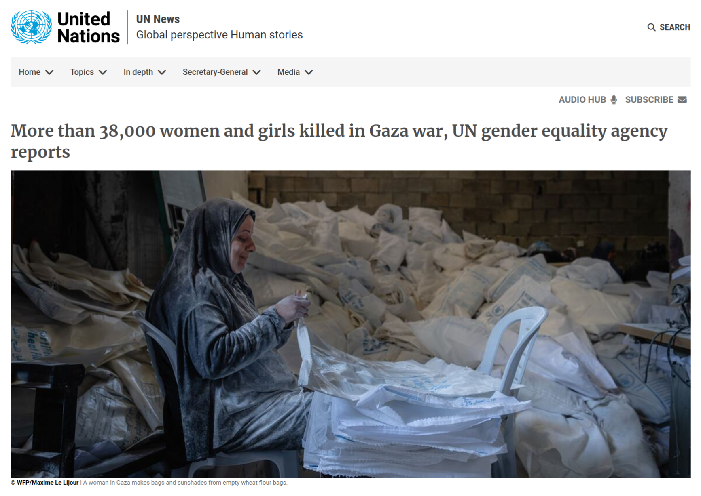]

.references[[April 17th, 2026](https://news.un.org/en/story/2026/04/1167319)]

---

count: false

.center[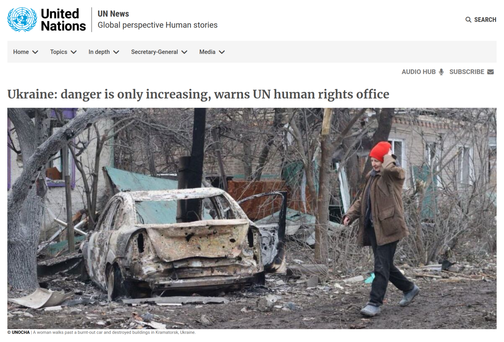]

.references[[March 26th, 2026](https://news.un.org/en/story/2026/03/1167201)]

---

count: false

.center[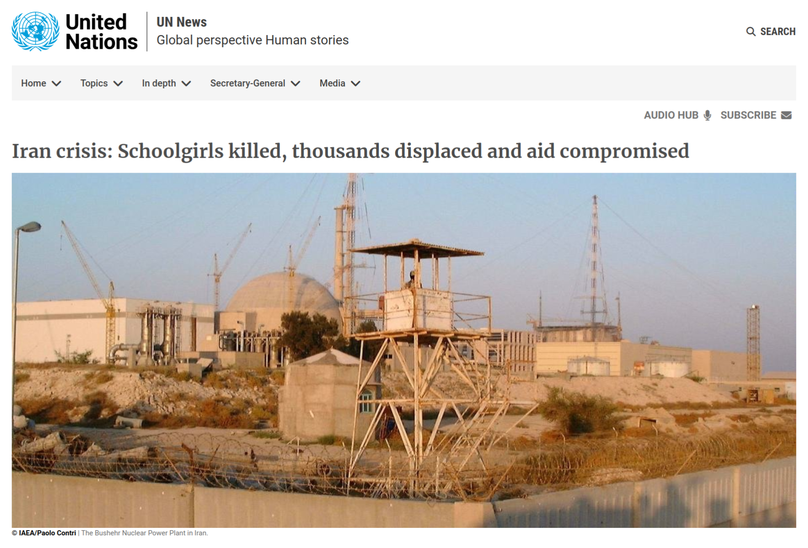]

.references[[March 3rd, 2026](https://news.un.org/en/story/2026/03/1167071)]

---

count: false

.center[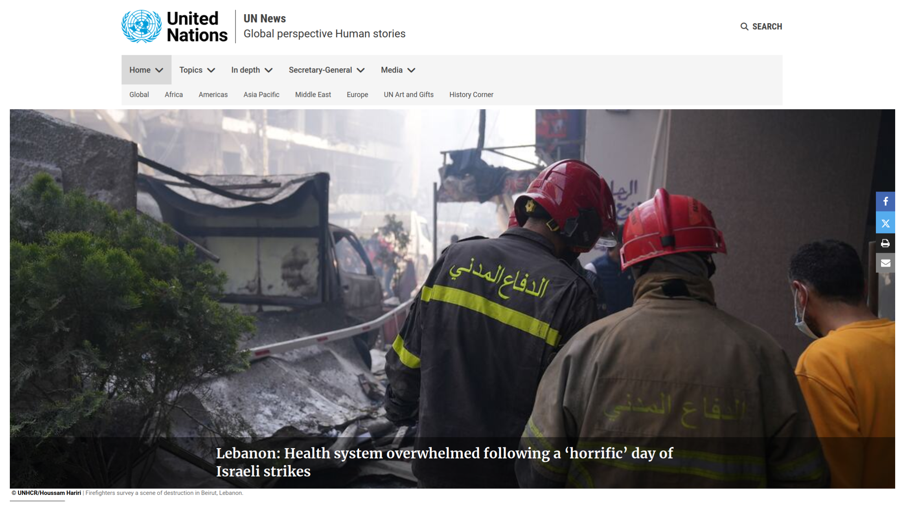]

.references[[April 9th, 2026](https://news.un.org/en/story/2026/04/1167276)]

---

## Context
### Expanding military expenditure

.center[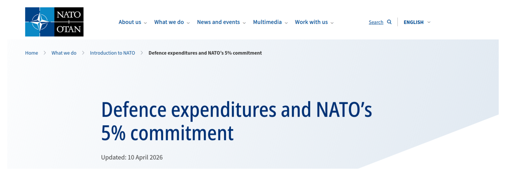]

.references[[Defence expenditures and NATO’s 5% commitment](https://www.nato.int/en/what-we-do/introduction-to-nato/defence-expenditures-and-natos-5-commitment)]

---

## Context
### Expanding revenues of military companies

.center[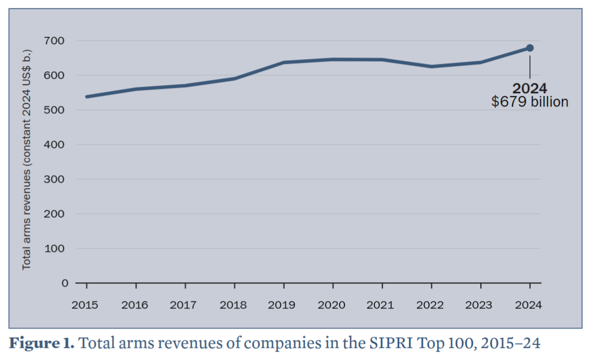]

.references[
- [The SIPRI Top 100 Arms-producing and Military Services Companies, 2024](https://www.sipri.org/publications/2025/sipri-fact-sheets/sipri-top-100-arms-producing-and-military-services-companies-2024), SIPRI, 2025.
- [Top global arms producers’ revenues surge as major wars rage: SIPRI report](https://www.aljazeera.com/news/2025/11/30/top-global-arms-producers-revenues-surged-as-major-wars-rage-sipri-report), Al Jazeera, 2025.
]

---

name: title
class: title, middle

## Context
### Artificial intelligence is increasingly used in warfare

---

## Surveillance technology

.center[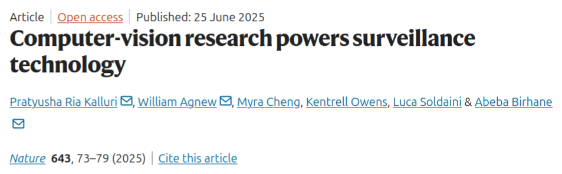]

.references[Kalluri et al., [Computer-vision research powers surveillance technology](https://www.nature.com/articles/s41586-025-08972-6). Nature, 2025.]

---

count: false

## Surveillance technology

.center[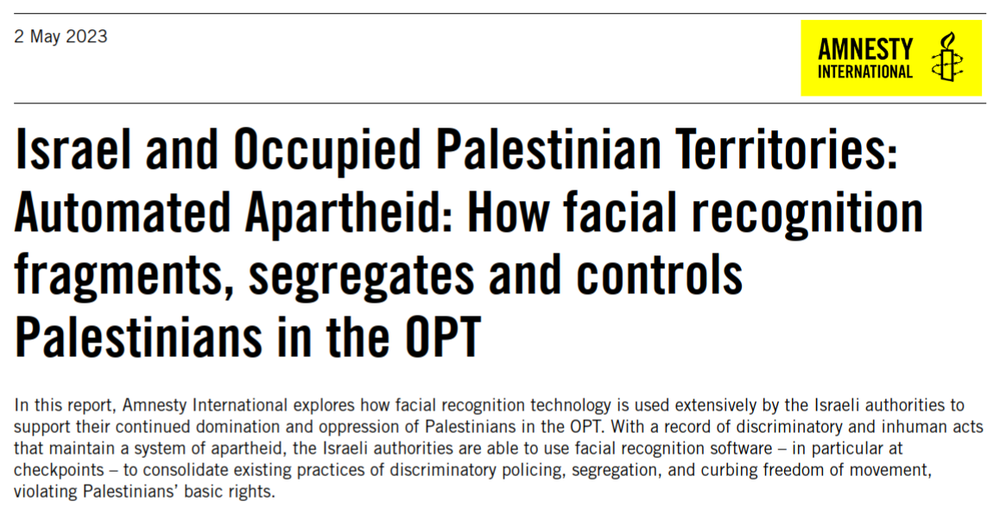]

.references[[Israel and Occupied Palestinian Territories: Automated Apartheid: How facial recognition fragments, segregates and controls Palestinians in the OPT](https://www.amnesty.org/en/documents/mde15/6701/2023/en/). Amnesty International, 2023.]

---

## Killer drones

.center[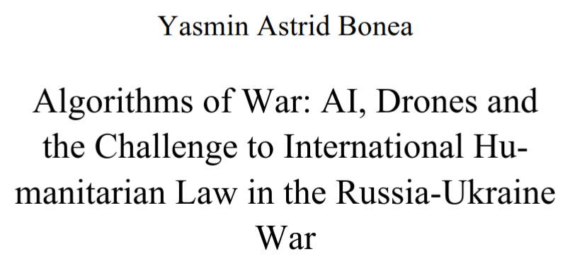]

.references[Yasmin Astrid Bonea. [Algorithms of war: AI, drones and the challenge to international humanitarian law in the Russia-Ukraine war](lup.lub.lu.se/luur/download?func=downloadFile&recordOId=9196688). Faculty of Law, Lund University, 2025.]

---

count: false

## Killer drones

.center[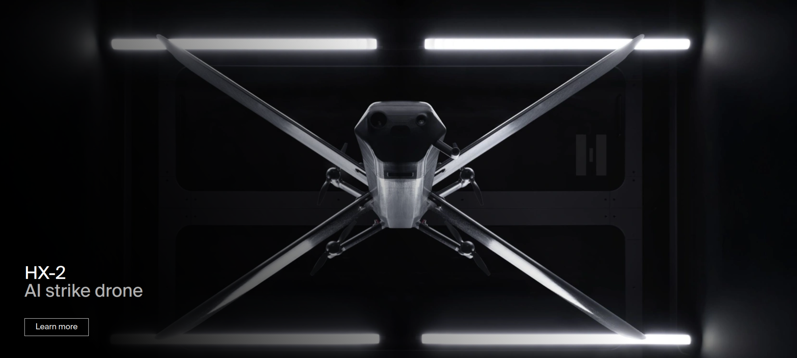]

---

## Targeting systems

.center[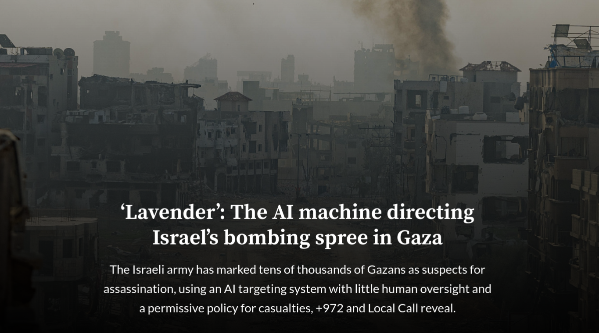]

.references[Yuval Abraham. [‘Lavender’: The AI machine directing Israel’s bombing spree in Gaza](https://www.972mag.com/lavender-ai-israeli-army-gaza/). +972 Magazine, 2024]

---

name: title
class: title, middle

## As AI researchers
### How does our work contribute to the development of autonomous weapons and military AI?

---

name: title
class: title, middle

## The implicated subject
### A framework to analyse positions of implication, beyond victims and perpetrators

---

## The implicated subject
### Beyond victims and perpetrators

.left-column[
.center[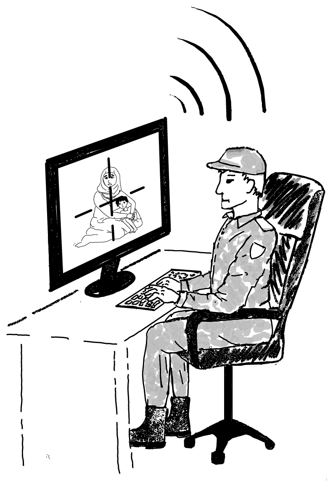]
.center[Perpetrator]
]

.right-column[
.center[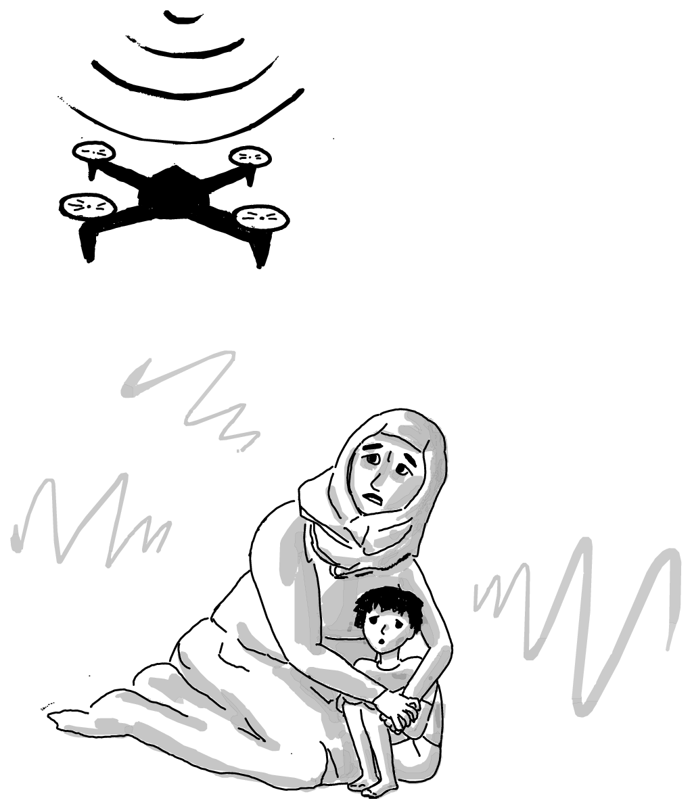]
.center[Victim]
]

---

## The implicated subject
### Beyond victims and perpetrators

.references[Michael Rothberg. [The Implicated Subject: Beyond Victims and Perpetrators](https://www.sup.org/books/literary-studies-and-literature/implicated-subject). Stanford University Press, 2019]

> _.h1[An implicated subject is neither a victim nor a perpetrator, but rather a participant in histories and social formations that generate the positions of victim and perpetrator], and yet in which most people do not occupy such clear-cut roles. Less "actively" involved than perpetrators, implicated subjects do not fit the mold of the "passive" bystander, either._

--

> _.h1[Implicated subjects occupy positions aligned with power and privilege] without being themselves direct agents of harm; they contribute to, inhabit, inherit or benefit from regimes of domination but do not originate or control such regimes. [...] .h1[Although indirect or belated, their actions and inactions help produce and reproduce the positions of victims and perpetrators]._

--

- The implicated position is not defining of one’s identity
- Implication does not suggest a sentiment of blame or guilt.
- A position of implication invites an attentive reflection on individual contributions to the system of oppression and available leverages for its transformation.

---

## The implicated subject
### Beyond victims and perpetrators

.columns-3-left[
.center[]
.center[Perpetrator]
]

.columns-3-right[
.center[]
.center[Victim]
]

--

.columns-3-center[
.center[]
.center[Implicated AI researcher]
]

---

name: title
class: title, middle

## Implication of AI researchers in the military

---

## Historical perspective

- Since the 1960s, the artificial intelligence field has been receiving significant funding from the United States Department of Defense.
- This close relationship deeply affected core aspects of the AI research epistemology and methodology:
    - The notion of "intelligence" operationalised in AI research is about solving abstract puzzles.
    - The focus is on accumulating knowledge, dominance and control.

.references[Yarden Katz. [Artificial whiteness: Politics and ideology in artificial intelligence](https://cup.columbia.edu/book/artificial-whiteness/9780231194914/). Columbia University Press, 2020.]

---

## Historical perspective

.left-column[
- In the 1980s, the concept of "dual use" was developed in the U.S. as a strategy for managing and expanding military innovation.
- The .h1[dual system of innovation] is a strategy of cooperation between civilian and military agents to share knowledge, expertise and talent.
]

.right-column[
.center[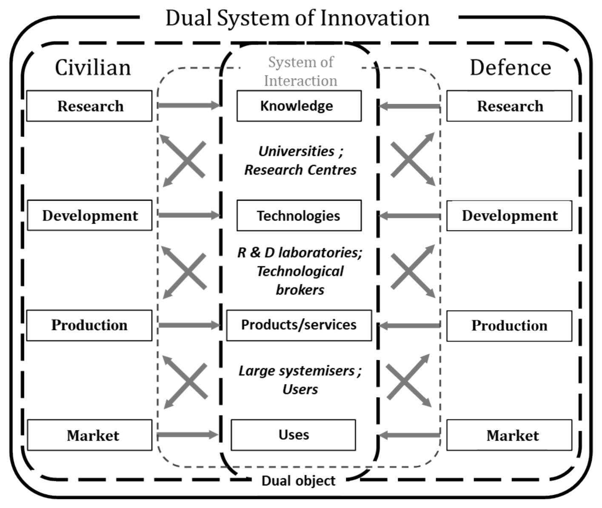]
]

.references[
- Lucas Maaser and Stephanie Verlaan. [Big tech goes to war: Uncovering the growing role of US and European technology firms in the military–industrial complex](https://www.rosalux.de/en/publication/id/49560/big-tech-goes-to-war). Studien, 2022.
- François-Xavier Meunier. Construction of an operational concept of technological military/civilian duality. Journal of Innovation Economics & Management, 2019.
]

---

## Military funding
### _Basic research, lethal effects_

.references[David Gray Widder et al. [Basic research, lethal effects: Military AI research funding as enlistment](https://arxiv.org/abs/2411.17840). arXiv:2411.17840, 2024.]

- An analysis of grant solicitations between 2007 and 2023 from the U.S. Department of Defense (DoD) .cite[(Widder et al., 2024)]

- Conclusion: military technology and AI research co-evolve in a synergistic way, described as "mutual enlistment".

--

- The DoD uses the notion of .h1[basic research] to provide a .h1[moral shelter] for researchers.
- However, "basic research" should still be aligned with DoD objectives:
    - "long-term relationships between university researchers and the DoD"
    - training students "for the defense workforce"

---

## Military funding
### Currently expanding

.left-column[
- U.S. DoD: 269 M USD in 2022 to 4,323 M USD in 2023 (16x)
- Canada plans to increase “defence-related research and development” by 85 %, with AI as a key sector.
- Europe and its member states are also increasing their military research budgets, and developing specific AI strategies.
]

.right-column[
.center[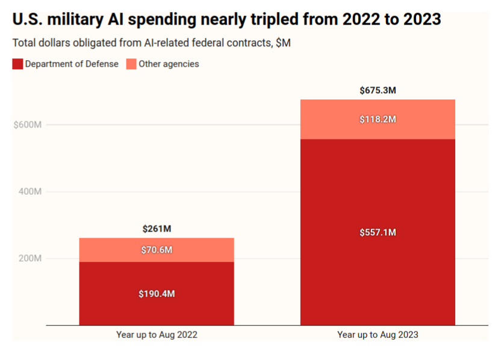]
]

.references[Will Henshall, [The U.S. Military's Investments Into Artificial Intelligence Are Skyrocketing](https://time.com/6961317/ai-artificial-intelligence-us-military-spending/), TIME, 2026.]

---

## Industry involvement

.center[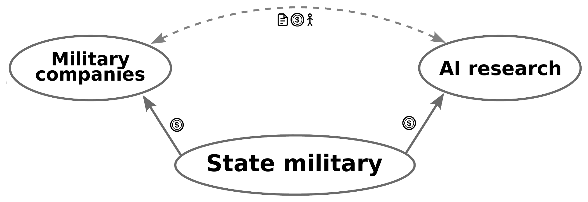]

- Many would argue that the link between AI research and weapons manufacturers is rather weak.
- However, this link is not negligible. Examples:
    - Directors of Helsing (killer drones) are former AI academics and still publish at AI conferences.
    - Weapons manufacturers have partnerships with computer science departments.

---

## Industry involvement
### The role of big tech

.references[Lucas Maaser and Stephanie Verlaan. [Big tech goes to war: Uncovering the growing role of US and European technology firms in the military–industrial complex](https://www.rosalux.de/en/publication/id/49560/big-tech-goes-to-war). Studien, 2022.]

.center[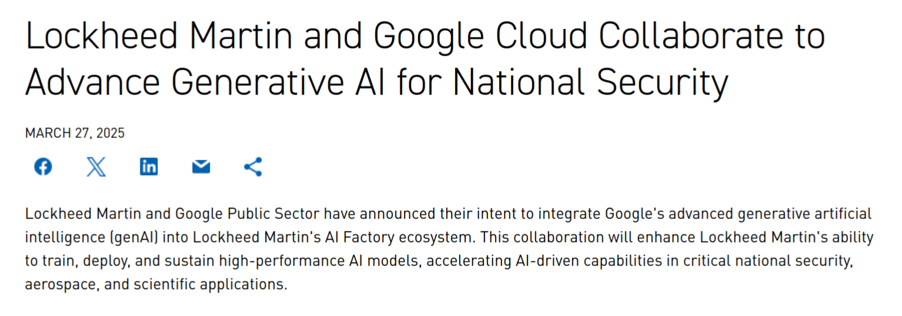]

---

count: false

## Industry involvement
### The role of big tech

.references[Lucas Maaser and Stephanie Verlaan. [Big tech goes to war: Uncovering the growing role of US and European technology firms in the military–industrial complex](https://www.rosalux.de/en/publication/id/49560/big-tech-goes-to-war). Studien, 2022.]

.center[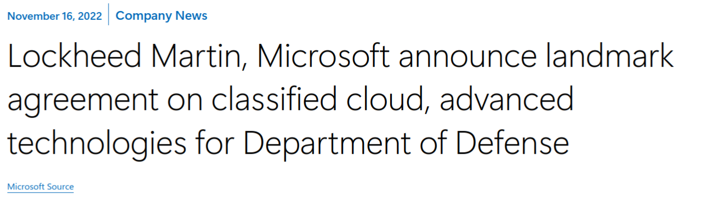]

---

count: false

## Industry involvement
### The role of big tech

.references[Lucas Maaser and Stephanie Verlaan. [Big tech goes to war: Uncovering the growing role of US and European technology firms in the military–industrial complex](https://www.rosalux.de/en/publication/id/49560/big-tech-goes-to-war). Studien, 2022.]

.center[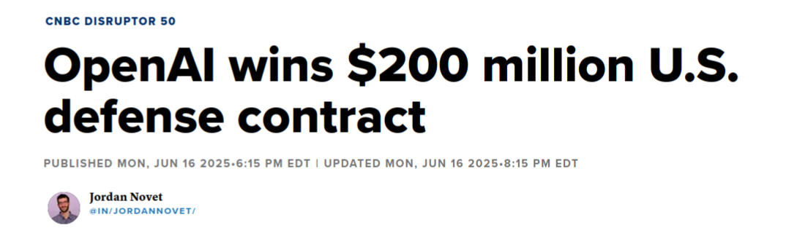]

---

count: false

## Industry involvement
### The role of big tech

.center[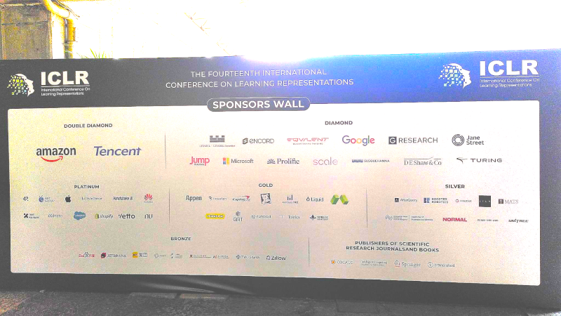]

---

## Industry involvement
### The role of big tech

.center[]

---

count: false

## Industry involvement
### The role of big tech

.center[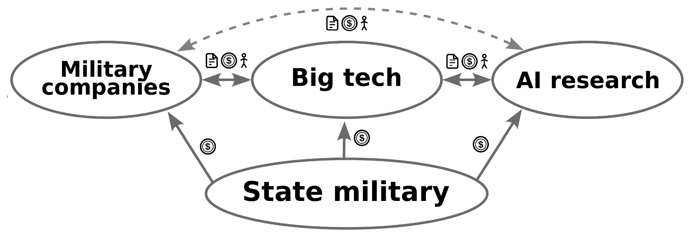]

- Big tech companies have a strong influence in AI research and development.
- Big tech companies have strong ties with the military industrial complex.
- Big tech serves as the interface between AI research and weapons companies.

---

.center[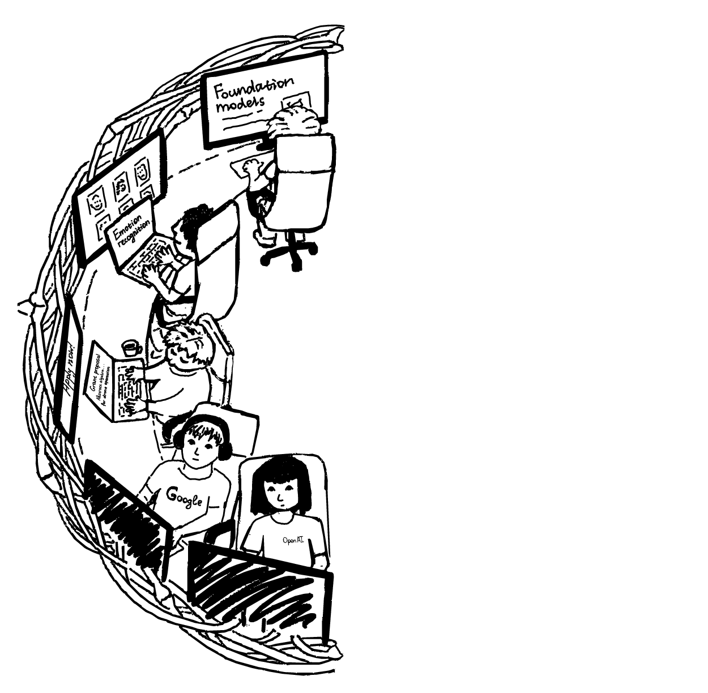]

---

count: false

.center[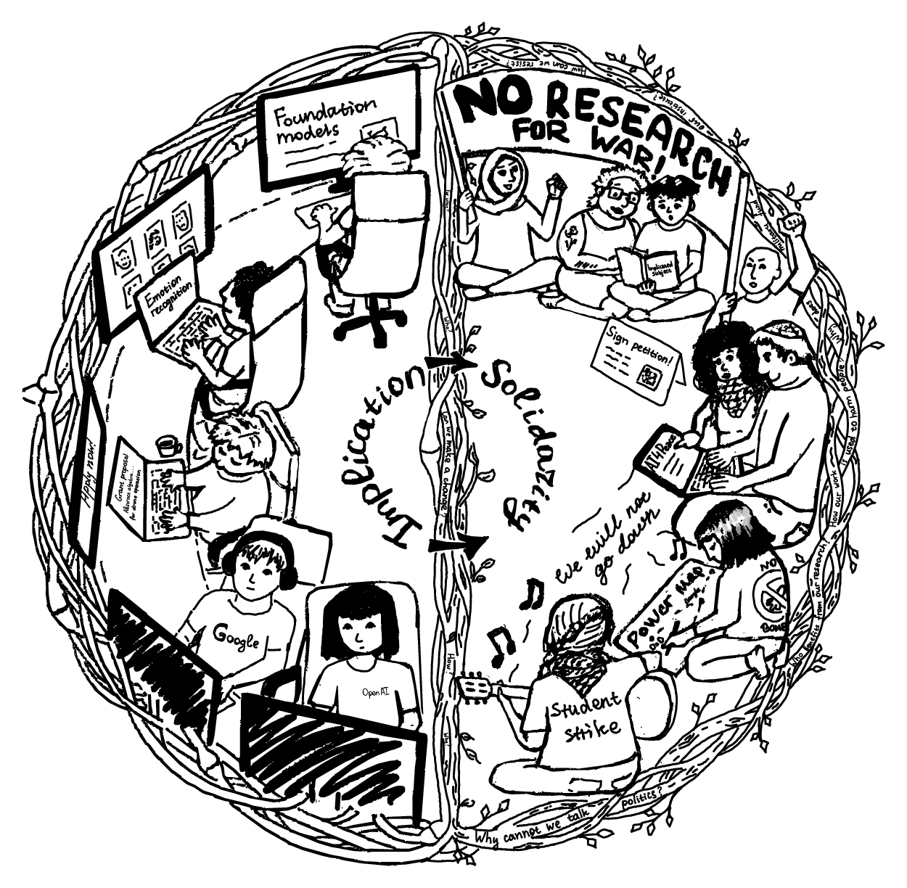]

---

name: title
class: title, middle

## How to resist
### From implication to solidarity

.center[]

---

## How to resist
### From implication to solidarity

- Implicated subjects are embedded in the oppressive system.

- They collectively support the system and enable its harms.

--

- Therefore, they also have a potential to transform the system!
    - By acting differently individually and collectively. 

---

## Challenge epistemic assumptions

- Feminist and decolonial scholars suggest adopting .h1[alternative notions of intelligence] and embracing a .h1[diversity of forms of the situated knowledge], “produced by specific people in specific circumstances - cultural, historical, and geographic”
- These ideas lead to methodologies which prioritise:
    - Data sovereignty
    - Participatory design
    - Social relations
    - Ethical labour
    - Situated narrowly-scoped technologies

.references[Catherine D’Ignazio and Lauren F Klein. [Data feminism](https://data-feminism.mitpress.mit.edu/). MIT press, 2023]

---

## Develop critical approaches

.context[Structural transformations happen in non-linear ways.]

We can start by combating the ignorance and denial of our implication: within ourselves, our institutions and our research field (what we are doing today in this workshop!):
- .h1[(Self-)educate in critical theory and thinking]: to fill the gaps of the STEM curriculum.
- .h1[Create spaces for critical discussions] at universities, workplaces, and conferences: to raise awareness and strengthen the community.
- .h1[Scrutinise power and values] behind AI research: to gain insight into effective strategies and targets for transformative action.

---

## Refuse military collaborations

- When possible: pursue more ethical funding sources, such as government funding for civilian science, professional societies grants, trustworthy philanthropic foundations, industry partnerships with an ethical mission, and citizen science crowdfunding

--

- When _not_ possible: put increased effort into the critical evaluation of one’s own research, its contribution to the military agendas and possible ways to sabotage them through collective direct action.

---

## Build coalitions for direct action

.center[]

---

count: false

## Build coalitions for direct action

.center[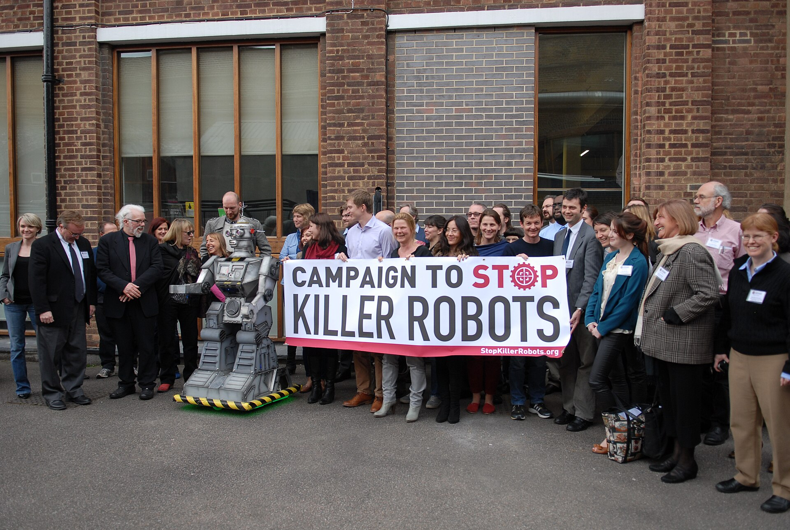]

---

count: false

## Build coalitions for direct action

.center[]

---

count: false

## Build coalitions for direct action

.center[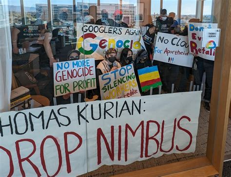]

---

## Embrace complexity

- .h1[Everyone’s position of implication is uniquely complex]
    - Our context is constantly evolving
    - We exist within the interlocking histories and actualities of opression

--

- Collective resistance cannot be distilled into a list of unified recommendations uniformly applicable to everyone.
- Each of us has to put effort into a critical evaluation of our own context and available leverages for contributing to systemic transformation.

--

.conclusion[We find value-based honest critical thinking to be the most helpful in guiding personal decisions for specific solidarity strategies.]

---

name: title
class: title, middle

.center[]

---

## Conclusions

- The implicated subject framework allows to analyse the implication of AI researchers in the development of weapons systems
- The artificial intelligence field has been part of the military industrial complex since its inception
- As implicated scientists we can turn our implication into solidarity

.center[]

---

.center[]

.references[Museu do Amanhã (Museum of Tomorrow), Rio de Janeiro]
