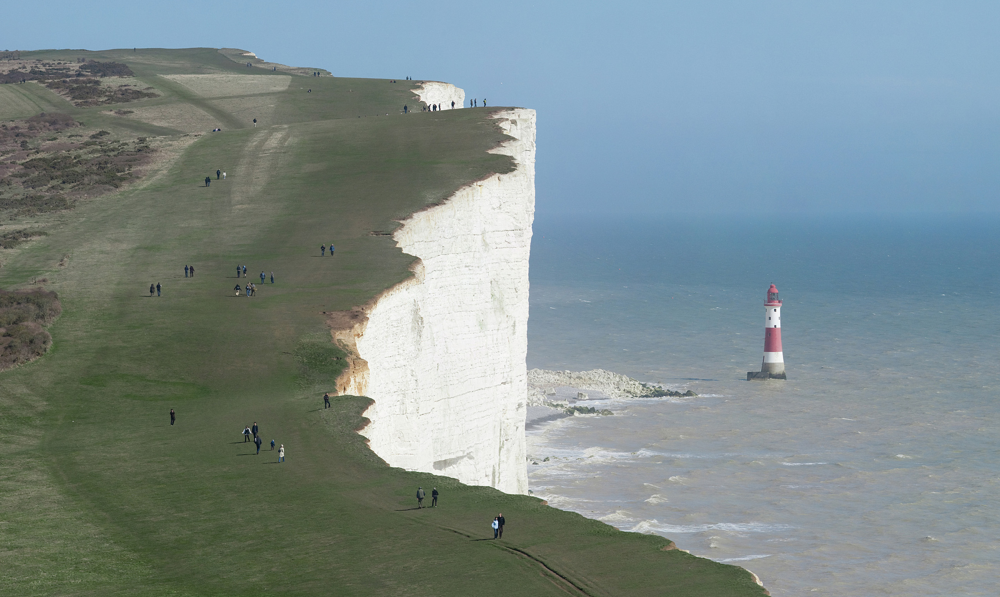

name: institut-courtois-jun24
class: title, middle

## Crystal-GFN
### Sampling crystals with desirable properties and constraints

#### Overview of the method, current extensions and future plans

Presenting: Alex Hernández-García (he/il/él)

Mila AI4Science: Alex Hernandez-Garcia, Alexandre Duval, Alexandra Volokhova, Yoshua Bengio, Divya Sharma, Pierre Luc Carrier, Yasmine Benabed, Michał Koziarski, Victor Schmidt, Pierre-Paul De Breuck

.turquoise[Rencontre des membres de l'Institut Courtois · 7 juin 2024 · Montréal]

.center[

&nbsp&nbsp&nbsp&nbsp

]

.smaller[.footer[
Slides: [alexhernandezgarcia.github.io/slides/{{ name }}](https://alexhernandezgarcia.github.io/slides/{{ name }})
]]

---

## Problem and goals

.center[.bigger[We aim to develop machine learning algorithms for the .highlight1[inverse design of crystalline solids].]]

--

#### Desiderata:

- Candidates should have the desired properties.
- Candidates should be reasonable (constraints).
- Candidates should be diverse.
- Efficient exploration of the vast materials space.

--

#### Applications:

- Catalyst design for sustainability
- Solid electrolytes with high ionic conductivity
- _Your application here_

---

## Inverse design of crystals
### A domain-inspired approach

.context[CDVAE and other works tackle crystal structure generation in the space of atom coordinates.]

--

Instead of optimising the atom positions by learning from a small data set, we draw .highlight1[inspiration from theoretical crystallography to sample crystals in a lower-dimensional space of crystal structure parameters].

--

.highlight2[Space group]: symmetry operations of a repeating pattern in space that leave the pattern unchanged.

--

- There are 17 symmetry groups in 2 dimensions (wallpaper groups).
- There are 230 space groups in 3 dimensions.

---

count: false

## Inverse design of crystals
### A domain-inspired approach

.context[CDVAE and other works tackle crystal structure generation in the space of atom coordinates.]

Instead of optimising the atom positions by learning from a small data set, we draw .highlight1[inspiration from theoretical crystallography to sample crystals in a lower-dimensional space of crystal structure parameters].

.highlight2[Lattice system]: all 230 space groups can be classified into one of the 7 lattices.

.center[

  

  <figure>
      
    <figcaption><small>Triclinic</small></figcaption>
  </figure>
  

  

  <figure>
      
    <figcaption><small>Monoclinic</small></figcaption>
  </figure>
  

  

  <figure>
      
    <figcaption><small>Orthorhombic</small></figcaption>
  </figure>
  

  

  <figure>
      
    <figcaption><small>Tetragonal</small></figcaption>
  </figure>
  

  

  <figure>
      
    <figcaption><small>Rhombohedral</small></figcaption>
  </figure>
  

  

  <figure>
      
    <figcaption><small>Hexagonal</small></figcaption>
  </figure>
  

  

  <figure>
      
    <figcaption><small>Cubic</small></figcaption>
  </figure>
  

]

---

count: false

## Inverse design of crystals
### A domain-inspired approach

.context[CDVAE and other works tackle crystal structure generation in the space of atom coordinates.]

Instead of optimising the atom positions by learning from a small data set, we draw .highlight1[inspiration from theoretical crystallography to sample crystals in a lower-dimensional space of crystal structure parameters].

.highlight2[Lattice parameters]: The lattice's size and shape is characterised by 6 parameters: .highlight1[$a, b, c, \alpha, \beta, \gamma$].

.center[]

---

## GFlowNets as the generative framework
### A one-slide summary

--

#### 3 key ingredients

--

 

1. .highlight1[Diversity] by design.

--
    - Given a score or reward function $R(x)$, learn to _sample objects $x$ proportionally to the reward_.
--
2. .highlight1[Compositionality] in the sample generation.

--
    - A meaningful decomposition of samples $x$ into multiple sub-states $s_0\rightarrow s_1 \rightarrow \dots \rightarrow x$ can yield generalisable patterns.
--
3. .highlight1[Deep learning] to learn from the generated samples.

--
    - A machine learning model can learn the transition function $F(s\rightarrow s')$ and generalise the patterns.

--

.references[
- Bengio et al. [Flow network based generative models for non-iterative diverse candidate generation](https://arxiv.org/abs/2106.04399), NeurIPS, 2021.
- Jain et al. [GFlowNets for AI-Driven Scientific Discovery](https://pubs.rsc.org/en/content/articlelanding/2023/dd/d3dd00002h). Digital Discovery, Royal Society of Chemistry, 2023.
]

---

## Crystal-GFlowNet

.context[Compositional generation of crystals in the space of crystallographic properties.]

 
.center[]

---

count: false

## Crystal-GFlowNet

.context[Compositional generation of crystals in the space of crystallographic properties.]

 
.center[]

---

count: false

## Crystal-GFlowNet

.context[Compositional generation of crystals in the space of crystallographic properties.]

 
.center[]

---

count: false

## Crystal-GFlowNet

.context[Compositional generation of crystals in the space of crystallographic properties.]

 
.center[]

---

count: false

## Crystal-GFlowNet

.context[Compositional generation of crystals in the space of crystallographic properties.]

 
.center[]

---

count: false

## Crystal-GFlowNet

.context[Compositional generation of crystals in the space of crystallographic properties.]

 
.center[]

---

count: false

## Crystal-GFlowNet

.context[Compositional generation of crystals in the space of crystallographic properties.]

 
.center[]

---

count: false

## Crystal-GFlowNet

.context[Compositional generation of crystals in the space of crystallographic properties.]

 
.center[]

---

count: false

## Crystal-GFlowNet

.context[Compositional generation of crystals in the space of crystallographic properties.]

 
.center[]

.conclusion[Crystal-GFN binds multiple spaces representing crystallographic and material properties, setting intra- and inter-space hard constraints in the generation process.]

---

## GFlowNet approach
### Advantages

.context[We generate materials in the lower-dimensional space of crystal structure parameters.]

* Constructing materials by their crystal structure parameters allows us to introduce .highlight1[physicochemical and geometric _hard_ constraints]:
--

    * Charge neutrality of the composition.
    * Compatibility of composition and space group.
    * Hierarchical structure of the space group.
    * Compatibility of lattice parameters and lattice system.
--
* .highlight1[Searching in the lower-dimensional space] of crystal structure parameters may be more efficient than in the space of atom coordinates.

--
* Provided we have access to a predictive model of a material property, we can .highlight1[flexibly generate materials with desirable properties].

--
* We can .highlight1[flexibly sample materials with specific characteristics, such as composition or space group]. 

---

## Results
### Formation energy

.context35[The formation energy is predicted by a pre-trained ML model.]

.center[]

---

count: false

## Results
### Formation energy

.context35[The formation energy is predicted by a pre-trained ML model.]

.center[]

---

count: false

## Results
### Formation energy

.context35[The formation energy is predicted by a pre-trained ML model.]

.center[]

---

count: false

## Results
### Formation energy

.context35[The formation energy is predicted by a pre-trained ML model.]

.center[]

---

count: false

## Results
### Formation energy

.context[.highlight1[After training, Crystal-GFN samples structures with even lower formation energy [eV/atom] than the validation set.]]

.center[]

---

## Results
### Band gap

.context35[We aimed at sampling structures with band gap close to 1.34 eV.]

.center[]

---

count: false

## Results
### Band gap

.context35[We aimed at sampling structures with band gap close to 1.34 eV.]

.center[]

---

count: false

## Results
### Band gap

.context35[We aimed at sampling structures with band gap close to 1.34 eV.]

.center[]

---

count: false

## Results
### Band gap

.context35[We aimed at sampling structures with band gap close to 1.34 eV.]

.center[]

---

count: false

## Results
### Band gap

.context[.highlight1[After training, Crystal-GFN samples structures with band gap [eV] around the target value.]]

.center[]

---

## Results
### Restricted sampling

We restrict the sampling space at sampling time:

- A: The composition is restricted to only elements Fe and O, with a maximum of 10 atoms per element.
- B: We sample in the ternary space for Li-Mn-O, keeping the element count to maximum 16 atoms.
- C: We restrict the space groups to only cubic lattices.
- D: We restrict the range of the lattice parameters to lengths between 10 and 20 angstroms and angles between 75 and 135 degrees.

---

## Results
### Restricted sampling

.center[]

---

name: title
class: title, middle

## Current extensions

.center[]

---

## Current extensions

.context[A limitation of the original Crystal-GFN is that it does not generate fully described crystals - atomic coordinates are missing.]

  
--

We can leverage the same principles and inspiration to extend the method to generate fully described crystals:

--
1. Space group (as before). .highlight1[Example: 62 (Pnma, orthorhombic)]

--
2. Pairs of Wyckoff position and element (_Wyckomposition_). .highlight1[Example: (4c, Ca), (8d, O), (4c, O), (4b, Ti)]

--
3. Crystallographic orbits. .highlight1[Example: (0.51, 0.54, 3/4), (0.79 0.79, 0.96), (0.08,  0.48, 3/4), (0, 1/2, 1/2) ]

--
4. Lattice parameters (as before). .highlight1[Example: a = b = 5.37 Å, c = 7.64 Å, α = γ = β = 90 º]

--

[CaTiO₃, mp-4019](https://next-gen.materialsproject.org/materials/mp-4019?formula=CaTiO3)

--

.conclusion[The sequential generation of crystals with this parameterisation is feasible with GFlowNets, fully describes a crystal and allows to incorporate symmetry-preserving cosntraints.]

---

name: title
class: title, middle

## Future plans and perspective

.center[]

---

## Future plans and perspective

.context[In many relevant applications, we are interested in crystal structures _with defects_]

 

- We want to hear what you need!
- We are confident that the method can be flexibly extended to generate crystal structures with vacancy defects.
- To our knowledge, there is little or no work on generative machine learning for such structures.

---

## Summary and conclusions

name: title
class: title, middle

.center[]

---

## Summary and conclusions

* Instead of generating crystal structures in the space of atomic positions, we proposed to sample in a lower-dimensional space of crystallographic properties (space group, composition and lattice parameters).
* This representation allowed us to introduce .highlight1[physicochemical and structural _hard_ constraints], reducing the search space and improving validity.
    * Crystal-GFN was trained in 30 hours in a CPU-only machine.
* Our results show that we can generate .highlight1[diverse, high scoring samples with the desired constraints].
* We can flexibly select the desired material characteristics.
* The .highlight1[framework can be flexibly extended] with more constraints, crystal structure descriptors (atomic positions) and other properties. 

.references[
* Mila AI4Science et al. [Crystal-GFN: sampling crystals with desirable properties and constraints](https://arxiv.org/abs/2310.04925). AI4Mat Workshop, NeurIPS 2023 (spotlight).
]

.highlight2[Open source code]: [github.com/alexhernandezgarcia/gflownet](https://github.com/alexhernandezgarcia/gflownet)

---

## Acknowledgements
### Amazing co-authors and friends

.left-column[
* Alexandre Duval
* Alexandra Volokhova
* Pierre Luc Carrier
* Divya Sharma
* Victor Schmidt
* Pierre Paul de Breuck
* Yasmine Benabed
* Michał Koziarski
* Yoshua Bengio
]

---

name: institut-courtois-jun24
class: title, middle

Mila AI4Science: Alex Hernandez-Garcia, Alexandre Duval, Alexandra Volokhova, Yoshua Bengio, Divya Sharma, Pierre Luc Carrier, Yasmine Benabed, Michał Koziarski, Victor Schmidt, Pierre-Paul De Breuck

[github.com/alexhernandezgarcia/gflownet](https://github.com/alexhernandezgarcia/gflownet)

.center[

&nbsp&nbsp&nbsp&nbsp

]

.footer[[alexhernandezgarcia.github.io](https://alexhernandezgarcia.github.io/) | [alex.hernandez-garcia@mila.quebec](mailto:alex.hernandez-garcia@mila.quebec)] 
.footer[[@alexhg@scholar.social](https://scholar.social/@alexhg)  | [@alexhdezgcia](https://twitter.com/alexhdezgcia) ]

.smaller[.footer[
Slides: [alexhernandezgarcia.github.io/slides/{{ name }}](https://alexhernandezgarcia.github.io/slides/{{ name }})
]]

