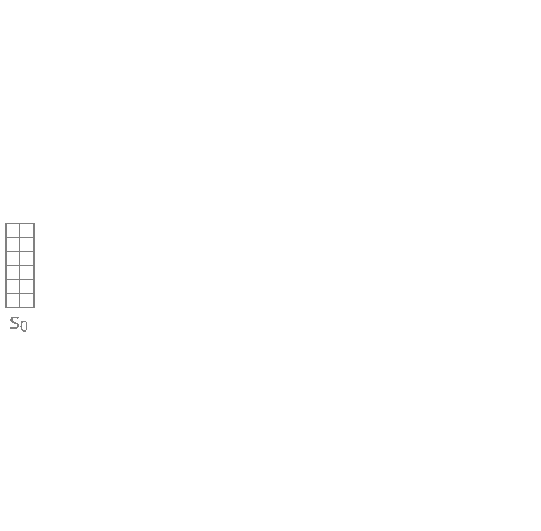

name: ivado-materials-apr24
class: title, middle

## Crystal-GFN 
### A generative model to discover crystal structures with desirable properties and constraints

Presenting: Alex Hernández-García (he/il/él)

.smaller[Alexandre Duval, Alexandra Volokhova, Yoshua Bengio, Divya Sharma, Pierre Luc Carrier, Yasmine Benabed, Michał Koziarski, Victor Schmidt, Félix Therrien, Mickaël Dollé]

.turquoise[[Exploiter l’IA pour accélérer la découverte de nouveaux matériaux et molécules](https://ivado.ca/evenements/exploiter-lia-pour-accelerer-la-decouverte-de-nouveaux-materiaux-et-molecules/) · April 16th 2024]

.center[

&nbsp&nbsp&nbsp&nbsp

]

.smaller[.footer[
Slides: [alexhernandezgarcia.github.io/slides/{{ name }}](https://alexhernandezgarcia.github.io/slides/{{ name }})
]]

---

## Why materials discovery?
### The potential on sustainability

.context["The time for action is now"]

--

> "Limiting global warming will require major transitions in the energy sector. This will involve a substantial reduction in fossil fuel use, widespread electrification, .highlight1[improved energy efficiency, and use of alternative fuels (such as hydrogen)]." .cite[IPCC Sixth Assessment Report, 2022]

> "Reducing industry emissions will entail coordinated action throughout value chains to promote all mitigation options, including demand management, .highlight1[energy and materials efficiency, circular material flows]." .cite[IPCC Sixth Assessment Report, 2022]

--

 

.conclusion[Mitigation of the climate crisis requires innovation in the materials sector.]

---

## Crystal structure generation
### What are crystals?

Definition: A crystal or crystalline solid is a solid material whose constituents (such as atoms, molecules, or ions) are arranged in a .highlight1[highly ordered microscopic structure], forming .highlight1[a crystal lattice that extends in all directions].

.left-column[
.center[]
]
.right-column[
.center[]
]

--

Here, we are concerned mainly with _inorganic crystals_, where the constituents are atoms or ions.

--

A crystal structure is characterized by its .highlight1[unit cell], a small imaginary box containing atoms in a specific spatial arrangement with certain symmetry. The unit cell repeats iself periodically in all directions.

---

## Crystal structure generation
### Why do we care about crystals?

.context35[Materials discovery can help reduce greenhouse gas emissions in multiple sectors.]

--

Many solid state materials are crystal structures and they are a core component of:

* Electrocatalysts for fuel cells, hydrogen storage, industrial chemical reactions, carbon capture, etc.
* Solid electrolytes for batteries.
* Thin film materials for photovoltaics.
* ...

--

However, .highlight1[material modelling is very challenging]:
* Limited data: only about 200 K known inorganic crystals, but potentially $10^{180}$ plausible stable structures (for reference: more than a billion molecules are known)
* Sparsity: .highlight2[stable materials] only exist in a low-dimensional subspace of all possible 3D arrangements.

--

.conclusion[There is a need for efficient generative models of crystal structures.]

---

## A domain-inspired approach
### Crystal structure parameters

.context[Most previous works tackle crystal structure generation in the space of atomic coordinates and struggle to preserve the symmetry properties.]

--

Instead of optimising the atom positions by learning from a small data set, we draw .highlight1[inspiration from theoretical crystallography to sample crystals in a lower-dimensional space of crystal structure parameters].

--

.highlight2[Space group]: symmetry operations of a repeating pattern in space that leave the pattern unchanged.

--

- There are 17 symmetry groups in 2 dimensions (wallpaper groups).
- There are 230 space groups in 3 dimensions.

---

count: false

## A domain-inspired approach
### Crystal structure parameters

.context[Most previous works tackle crystal structure generation in the space of atomic coordinates and struggle to preserve the symmetry properties.]

Instead of optimising the atom positions by learning from a small data set, we draw .highlight1[inspiration from theoretical crystallography to sample crystals in a lower-dimensional space of crystal structure parameters].

.highlight2[Lattice system]: all 230 space groups can be classified into one of the 7 lattices.

.center[

  

  <figure>
      
    <figcaption><small>Triclinic</small></figcaption>
  </figure>
  

  

  <figure>
      
    <figcaption><small>Monoclinic</small></figcaption>
  </figure>
  

  

  <figure>
      
    <figcaption><small>Orthorhombic</small></figcaption>
  </figure>
  

  

  <figure>
      
    <figcaption><small>Tetragonal</small></figcaption>
  </figure>
  

  

  <figure>
      
    <figcaption><small>Rhombohedral</small></figcaption>
  </figure>
  

  

  <figure>
      
    <figcaption><small>Hexagonal</small></figcaption>
  </figure>
  

  

  <figure>
      
    <figcaption><small>Cubic</small></figcaption>
  </figure>
  

]

---

count: false

## A domain-inspired approach
### Crystal structure parameters

.context[Most previous works tackle crystal structure generation in the space of atomic coordinates and struggle to preserve the symmetry properties.]

Instead of optimising the atom positions by learning from a small data set, we draw .highlight1[inspiration from theoretical crystallography to sample crystals in a lower-dimensional space of crystal structure parameters].

.highlight2[Lattice parameters]: The lattice's size and shape is characterised by 6 parameters: .highlight1[$a, b, c, \alpha, \beta, \gamma$].

.center[]

---

## GFlowNets as the generative framework
### 3 key ingredients

--

 

1. .highlight1[Diversity] as an objective.

--
    - Given a score or reward function $R(x)$, learn to _sample objects $x$ proportionally to the reward_.
--
2. .highlight1[Compositionality] in the sample generation.

--
    - A meaningful decomposition of samples $x$ into multiple sub-states $s_0\rightarrow s_1 \rightarrow \dots \rightarrow x$ can yield generalisable patterns.
--
3. .highlight1[Deep learning] to learn from the generated samples.

--
    - A machine learning model can learn the transition function $F(s\rightarrow s')$ and generalise the patterns.

--

.references[
- Bengio et al. [Flow network based generative models for non-iterative diverse candidate generation](https://arxiv.org/abs/2106.04399), NeurIPS, 2021.
- Jain et al. [GFlowNets for AI-Driven Scientific Discovery](https://pubs.rsc.org/en/content/articlelanding/2023/dd/d3dd00002h). Digital Discovery, Royal Society of Chemistry, 2023.
]

---

## GFlowNets as the generative framework
### Compositional generation

.center[]

---

count: false

## Crystal-GFlowNet
### Sequential generation

.center[]

---

count: false

## Crystal-GFlowNet
### Sequential generation

.center[]

---

count: false

## Crystal-GFlowNet
### Sequential generation

.center[]

---

count: false

## Crystal-GFlowNet
### Sequential generation

.center[]

---

count: false

## Crystal-GFlowNet
### Sequential generation

.center[]

---

count: false

## Crystal-GFlowNet
### Sequential generation

.center[]

---

count: false

## Crystal-GFlowNet
### Sequential generation

.center[]

---

count: false

## Crystal-GFlowNet
### Sequential generation

.center[]

---

count: false

## Crystal-GFlowNet
### Sequential generation

.center[]

.conclusion[Crystal-GFN binds multiple spaces representing crystallographic and material properties, setting intra- and inter-space hard constraints in the generation process.]

---

## GFlowNet approach
### Advantages

.context[We generate materials in the lower-dimensional space of crystal structure parameters.]

* Constructing materials by their crystal structure parameters allows us to introduce .highlight1[physicochemical and geometric _hard_ constraints]:
--

    * Charge neutrality of the composition.
    * Compatibility of composition and space group.
    * Hierarchical structure of the space group.
    * Compatibility of lattice parameters and lattice system.
--
* .highlight1[Searching in the lower-dimensional space] of crystal structure parameters may be more efficient than in the space of atom coordinates.

--
* Provided we have access to a predictive model of a material property, we can .highlight1[flexibly generate materials with desirable properties], without the need for a data set.

--
* We can .highlight1[flexibly sample materials with specific characteristics, such as composition or space group]. 

---

## Crystal-GFlowNet
### Material properties

We can train a Crystal-GFN with any reward function, provided it is computationally tractable. Therefore, we can use it to .highlight1[generate materials with different properties]. 
--
We have tested the following properties:

- .highlight2[Formation energy] per atom [eV/atom], via a pre-trained machine learning model: indicative of the material's stability.

--
- .highlight2[Electronic band gap] [eV] (squared distance to a target value, 1.34 eV), via a pre-trained machine learning model: relevant in photovoltaics, for instance.

--
- Unit cell .highlight2[density] [g/cm3]: convenient as a proof of concept because we can calculate it _exactly_ from the GFN outputs.

---

count: false

## Crystal-GFlowNet
### Material properties

We can train a Crystal-GFN with any reward function, provided it is computationally tractable. Therefore, we can use it to .highlight1[generate materials with different properties]. We have tested the following properties:

- .highlight2[Formation energy] per atom [eV/atom], via a pre-trained machine learning model: indicative of the material's stability.
- .highlight2[Electronic band gap] [eV] (squared distance to a target value, 1.34 eV), via a pre-trained machine learning model: relevant in photovoltaics, for instance.
- .alpha50[Unit cell .highlight2[density] [g/cm3]: convenient as a proof of concept because we can calculate it _exactly_ from the GFN outputs.]

---

## Results
### Formation energy

.context35[The formation energy correlates with stability. The lower, the better.]

.center[]

---

count: false

## Results
### Formation energy

.context35[The formation energy correlates with stability. The lower, the better.]

.center[]

---

count: false

## Results
### Formation energy

.context35[The formation energy correlates with stability. The lower, the better.]

.center[]

---

count: false

## Results
### Formation energy

.context35[The formation energy correlates with stability. The lower, the better.]

.center[]

---

count: false

## Results
### Formation energy

.context[.highlight1[After training, Crystal-GFN samples structures with even lower formation energy [eV/atom] than the validation set.]]

.center[]

---

## Results
### Band gap

.context35[We aimed at sampling structures with band gap close to 1.34 eV.]

.center[]

---

count: false

## Results
### Band gap

.context35[We aimed at sampling structures with band gap close to 1.34 eV.]

.center[]

---

count: false

## Results
### Band gap

.context35[We aimed at sampling structures with band gap close to 1.34 eV.]

.center[]

---

count: false

## Results
### Band gap

.context35[We aimed at sampling structures with band gap close to 1.34 eV.]

.center[]

---

count: false

## Results
### Band gap

.context[.highlight1[After training, Crystal-GFN samples structures with band gap [eV] around the target value.]]

.center[]

---

## Results
### Diversity

.context[.highlight2[Diversity] is key in materials discovery.]

Analysis of 10,000 sampled crystals and the top-100 with lowest formation energy.

--

- All 10,000 samples are unique.

--
- All crystal systems, lattice systems and point symmetries found in the 10,000 samples.
    - 4 out of 8 crystal-lattice systems in the top-100.
    - 4 out of the 5 point symmetries in the top-100.
--
- All 22 elements found in the 10,000 samples.
    - 15 out of 22 elements in the top-100.
--
- 73 out of 113 space groups (65 %) found in the 10,000 samples
    - 19 out of 113 space groups in the top-100.

--

.conclusion[Crystal-GFN samples are highly diverse.]

---

## Results
### Restricted sampling

.context[Crystal-GFN is flexible by design, inspired by the needs of domain experts.]

We restrict the sampling space at sampling time:

- A: The composition is restricted to only elements Fe and O, with a maximum of 10 atoms per element.
- B: We sample in the ternary space for Li-Mn-O, keeping the element count to maximum 16 atoms.
- C: We restrict the space groups to only cubic lattices.
- D: We restrict the range of the lattice parameters to lengths between 10 and 20 angstroms and angles between 75 and 135 degrees.

---

## Results
### Restricted sampling

.center[]

---

## Crystal-GFN
### Summary and conclusions

.references[
Mila AI4Science et al. [Crystal-GFN: sampling crystals with desirable properties and constraints](https://arxiv.org/abs/2310.04925). AI4Mat workshop at NeurIPS 2023 (spotlight)
]

* Discovering new crystal structures with desirable properties can help mitigate the climate crisis.

--
* There are infinitely many conceivable crystals. Only a few are stable. Only a few stable crystals have interesting properties. This is a really hard problem.

--
* Most methods in the literature struggle to preserve the symmetry properties of the crystals.

--
* Crystal-GFN introduces .highlight1[physicochemical and structural constraints], reducing the search space.
    * Crystal-GFN was trained in 30 hours in a CPU-only machine.
--
* Our results show that we can generate .highlight1[diverse, high scoring samples with the desired constraints].

--
* The .highlight1[framework can be flexibly extended] with more constraints, crystal structure descriptors (atomic positions) and other properties. 

--
* .highlight2[Open source code]: [github.com/alexhernandezgarcia/gflownet](https://github.com/alexhernandezgarcia/gflownet)

---

## Acknowledgements
### Amazing colleagues and friends

.left-column[
* Alexandre Duval
* Alexandra Volokhova
* Pierre Luc Carrier
* Divya Sharma
* Victor Schmidt
* Pierre Paul de Breuck
* Yasmine Benabed
* Michał Koziarski
* Yoshua Bengio
* Félix Therrien
* Mickaël Dollé
]

---

name: title
class: title, middle

.smaller[Mila AI4Science: Alex Hernandez-Garcia, Alexandre Duval, Alexandra Volokhova, Yoshua Bengio, Divya Sharma, Pierre Luc Carrier, Yasmine Benabed, Michał Koziarski, Victor Schmidt, Pierre-Paul De Breuck, Félix Therrien, Mickaël Dollé]

[github.com/alexhernandezgarcia/gflownet](https://github.com/alexhernandezgarcia/gflownet)

.center[

&nbsp&nbsp&nbsp&nbsp

]

.footer[[alexhernandezgarcia.github.io](https://alexhernandezgarcia.github.io/) | [alex.hernandez-garcia@mila.quebec](mailto:alex.hernandez-garcia@mila.quebec)] 
.footer[[@alexhg@scholar.social](https://scholar.social/@alexhg)  | [@alexhdezgcia](https://twitter.com/alexhdezgcia) ]
