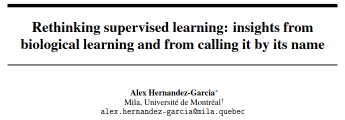

name: title
class: title, middle

## Rethinking (un-, semi-, self-, ...)supervised learning:
### Insights from biological learning and from calling it by its name

Alex Hernández-García (he/él)

.gray224[Kietzmann Lab, Donders Institute for Brain Cognition and Behaviour · The Internet · June 29th 2021]

.footer[[alexhernandezgarcia.github.io](https://alexhernandezgarcia.github.io/) | [alex.hernandez-garcia@mila.quebec](mailto:alex.hernandez-garcia@mila.quebec) | [@alexhdezgcia](https://twitter.com/alexhdezgcia)] 

---

## About me

--

* .lightblue[Bachelor's]: Image and Sound Engineering, University Carlos III of Madrid (2013)

--

* .lightblue[Master's]: Machine Learning and Computer Vision, University Carlos III of Madrid (2015)

--

* .lightblue[PhD]: Institute of Cognitive Science, Universität Osnabrück, with Prof. Peter König (2016–2020)

  * Based in Berlin
  * Marie Skłodowska Curie ITN “NextGenVis” (_Next generation of European visual neuroscientists_)
  * Intern at University of Cambridge (UK) and Spinoza Centre for Neuroimaging in Amsterdam (NL)
  * Thesis topics: Brain-inspired DL, visual perception and visual computational neuroscience

--

* .lightblue[Postdoc]: Mila (Québec AI Institute in Montréal) with Prof. Prof. Yoshua Bengio (2021–_present_)

---

## When I am not training models or reading papers...

~~...I am reviewing papers, trying to empty my email inbox, having meetings...~~

---

count: false

## When I am not training models or reading papers...

~~...I am reviewing papers, trying to empty my email inbox, having meetings...~~

.center[]

.footnote[[BrokenJugRamblers.bandcamp.com](https://brokenjugramblers.bandcamp.com/)]

---

count: false

## When I am not training models or reading papers...

~~...I am reviewing papers, trying to empty my email inbox, having meetings...~~

.center[]

---

count: false

## When I am not training models or reading papers...

~~...I am reviewing papers, trying to empty my email inbox, having meetings...~~

.center[]

.footnote[[LumeDeBiqueira.es](https://www.lumedebiqueira.es/en/)]

---

name: title
class: title, middle

## Rethinking supervised learning:
### Insights from biological learning and from calling it by its name

???

So, after this brief ice-breaker, I can go back to the topic of my talk today, which is "Rethinking supervised learning: Insights from biological learning and from calling it by its name"

[NEXT SLIDE]

This is actually the title of a paper that is on arXiv since last December, when I presented it at the workshop Shared visual representations in human and machine intelligence (SVRHM), at NeurIPS 2020, and I have updated it recently with a hopefully more polished version. It is a perspective or opinion paper, potentially controversial and single authored as you see, so it was a bit daunting to write and then publish this.

I titled it "Rethinking supervised learning", but I actually would have liked to titled it

[NEXT SLIDE] ...

--

.center[]

.footnote[[arXiv:2012.02526](https://arxiv.org/abs/2012.02526)]

---

name: title
class: title, middle
count: false

## Rethinking (.lightblue[un-], .lightblue[semi-], .lightblue[self-], .lightblue[...]).lightblue[supervised learning]:
### Insights from biological learning and from calling it by its name

.center[]

.footnote[[arXiv:2012.02526](https://arxiv.org/abs/2012.02526)]

???

... "Rethinking unsupervised, semi-supervised, self-supervised, supervised, etcetera and what not learning", but that would have looked too ugly for a paper title, right? 

---

name: title
class: title, middle
count: false

## .lightblue[Rethinking] (.lightblue[un-], .lightblue[semi-], .lightblue[self-], .lightblue[...]).lightblue[supervised learning]:
### Insights from biological learning and from .lightblue[calling it by its name]
 
### .left[Outline]

.left[
* .lightblue[Supervision in machine learning]
]

.footnote[[arXiv:2012.02526](https://arxiv.org/abs/2012.02526)]

???

The reason is that the paper, and my talk today, are not about what people generally think of when we say "supervised learning", but I actually propose to critically review all these terms, some of which I consider to be just overselling brand names, rather than rigorous categories of a grounded taxonomy. And this has of course negative consequences, as I will try to convey. And in fact, I will argue that we'd rather take a step back and realise that these are all "supervised learning", only that supervision comes in different flavours. And this is going to be one part of my talk.

---

name: title
class: title, middle
count: false

## .lightblue[Rethinking] (.lightblue[un-], .lightblue[semi-], .lightblue[self-], .lightblue[...]).lightblue[supervised learning]:
### .lightgreen[Insights from biological learning] and from .lightblue[calling it by its name]

 
### .left[Outline]

.left[
* .lightgreen[Supervision in biological learning]
* .lightblue[Supervision in machine learning]
]

.footnote[[arXiv:2012.02526](https://arxiv.org/abs/2012.02526)]

???

The other part, which will come earlier actually, is going to be about biological learning, or learning in nature, by animals in general and humans in particular. Like I assume everyone in this lab, I also believe that biological learning has a lot to offer to artificial intelligence, and machine learning in particular, (also the other way around, of course), but I think we have to do it the right way. I have the impression, by reading papers, that we are also overselling the capabilities of human learning and generalisation and robustness, etc.

---

name: title
class: title, middle
count: false

## .lightblue[Rethinking] (.lightblue[un-], .lightblue[semi-], .lightblue[self-], .lightblue[...]).lightblue[supervised learning]:
### .lightgreen[Insights from biological learning] and from .lightblue[calling it by its name]

 
### .left[Outline]

.left[
* Motivation: The DL Hype
* .lightgreen[Supervision in biological learning]
* .lightblue[Supervision in machine learning]
* Conclusions for future research directions
]

.footnote[[arXiv:2012.02526](https://arxiv.org/abs/2012.02526)]

???

Just to anchor you on what you will hear today, I will start with some motivation for these issues and conclude with some ideas for future directions in machine learning research.

---

## Motivation: The DL Hype

.context[Deep learning provoked a shift from _feature engineering_ to _representation learning_ by training artificial neural networks.]

???

Alright, so I will start with some motivation, and more precisely, some historical notes---I mean, 2015, but you know that is time immemorial in deep learning, right. I guess if we had to sum up what the difference is between deep learning and other machine learning methods is that deep learning allows learning deep representations of our input data, as opposed to learning a more direct mapping between inputs and outputs, which requires some feature engineering.

This is more or less true, but in those early days, we all learnt a more hardcore version of this, in which deep learning is the shit and everything else was just for the kids.

[NEXT SLIDE]

For example, see this quote: [READ IT]

Any guess of which article is this? Hint: It's a famous one! By famous folks!

[NEXT SLIDE]

We all know these guys right?

[NEXT SLIDE]

The thing is, we can now look back with the privilege of time perspective, and critically review if that claim was perhaps a little overstated.

[NEXT SLIDE] [READ] [AND REPEAT UNTIL CONCLUSION]

I do not really blame Yann, Yoshua and Geoff, because those were exiciting times and it is needless to say that deep learning has been indeed an absolute breakthrough. But I also think it is fair to say that some early claims about deep learning were an overstatement, and we all kind know that, but the problem is that that philosophy built in the early days has permeated machine learning research up to these days.

--

> "_\[.lightblue[Hand designing] good feature extractors, .lightgreen[engineering skill] and .cyan[domain expertise]\] **can all be avoided** if good features can be learned automatically using a general-purpose learning procedure. This is the key advantage of deep learning._" .smaller[(highlighting mine)]
--

.right[.cite[LeCun, Bengio and Hinton. Nature. 2015]]

--

However, the success of deep learning required:
--

* .lightblue[Iterative hand design of network architectures and methods]
--

* .lightgreen[Collective, high engineering skill]
--

* A large dose of .cyan[interdisciplinary domain expertise]
--

* ...

--

.conclusion[Read in hindsight, the claim is _clearly_ an overstatement. But its gist has has permeated machine learning research up to these days]

---

## Motivation: The DL Hype
#### Reactions after first (small) disappointment

.context[The success of deep learning was admitted to be largely due to the availability of huge _labelled_ data sets.]

???

Now we know that a big big reason for the success of deep learning has been the availability of huge data sets. And this is actually, in my view, a major advantage of deep learning over other methods, by the way.

However, a lot of people were disappointed and frustrated by this. 

--

* Some questioned the usefulness of deep learning itself .cite[(Marcus, 2018)]
* Some questioned whether neural networks generalise beyond or simply memorise the training examples .cite[(Zhang et al., 2017, Arpit et al., 2017)]
* (.orange[Alert]: shameless self-promotion) I studied the benefits of data augmentation .cite[(Hernandez-Garcia et al., rejected ICLR 17)]
* Some proposed new research horizons .cite[(Vinyals et al., 2016)]: "\[L\]earning a class from a single labelled example", based on the statement that "**humans learn new concepts with very little supervision**, [but] the standard **supervised deep learning** paradigm **does not offer a satisfactory solution** for learning new concepts rapidly from little data". .smaller[(highlighting mine)]

.references[
* Marcus, G. [Deep learning: A critical appraisal](https://arxiv.org/abs/1801.00631). arXiv:1801.00631, 2018.
* Zhang, C. et al. [Understanding deep learning requires rethinking generalization](https://arxiv.org/abs/1611.03530). ICLR 2017.
* Arpit, D. et al. [A closer look at memorization in deep networks](https://arxiv.org/abs/1706.05394). arXiv:1706.05394, 2017.
* Hernández-García, A. and König, P. [Data augmentation instead of explicit regularization](https://arxiv.org/abs/1806.03852). arXiv:1806.03852, 2018.
* Vinyals, O. et al. [Matching networks for one shot learning](https://arxiv.org/abs/1606.04080). NeurIPS, 2016
]

---

count: false

## Motivation: The DL Hype
#### Reactions after first (small) disappointment

.context[The success of deep learning was admitted to be largely due to the availability of huge _labelled_ data sets.]

* Some questioned the usefulness of deep learning itself .cite[(Marcus, 2018)]
* Some questioned whether neural networks generalise beyond or simply memorise the training examples .cite[(Zhang et al., 2017, Arpit et al., 2017)]
* (Alert: shameless self-promotion) I studied the benefits of data augmentation .cite[(Hernandez-Garcia et al., rejected ICLR 17)]
* Some proposed new research horizons .cite[(Vinyals et al., 2016)]: "\[L\]earning a class from a single labelled example", based on the statement that "**.lightgreen[humans learn new concepts with very little supervision]**, [but] the standard **.cyan[supervised deep learning]** paradigm **.cyan[does not offer a satisfactory solution]** for learning new concepts rapidly from little data". .smaller[(highlighting mine)]

.conclusion[A call to .cyan[banish _supervision_]: _few-shot_, _one-shot_, _zero-shot_, _predictive_, _unsupervised_, _semi-supervised_, _self-supervised_ learning, etc. Based on alleged .lightgreen[generalisation capabilities of humans].]

