name: title
class: title, middle

## Rethinking (un-, semi-, self-, ...)supervised learning:
### Insights from biological learning and from calling it by its name

Alex Hernández-García (he/él)

.gray224[Kietzmann Lab, Donders Institute for Brain Cognition and Behaviour · The Internet · June 29th 2021]

.footer[[alexhernandezgarcia.github.io](https://alexhernandezgarcia.github.io/) | [alex.hernandez-garcia@mila.quebec](mailto:alex.hernandez-garcia@mila.quebec) | [@alexhdezgcia](https://twitter.com/alexhdezgcia)] 

---

## About me

--

* .lightblue[Bachelor's]: Image and Sound Engineering, University Carlos III of Madrid (2013)

--

* .lightblue[Master's]: Machine Learning and Computer Vision, University Carlos III of Madrid (2015)

--

* .lightblue[PhD]: Institute of Cognitive Science, Universität Osnabrück, with Prof. Peter König (2016–2020)

  * Based in Berlin
  * Marie Skłodowska Curie ITN “NextGenVis” (_Next generation of European visual neuroscientists_)
  * Intern at University of Cambridge (UK) and Spinoza Centre for Neuroimaging in Amsterdam (NL)
  * Thesis topics: Brain-inspired DL, visual perception and visual computational neuroscience

--

* .lightblue[Postdoc]: Mila (Québec AI Institute in Montréal) with Prof. Prof. Yoshua Bengio (2021–_present_)

---

## When I am not training models or reading papers...

~~...I am reviewing papers, trying to empty my email inbox, having meetings...~~

---

count: false

## When I am not training models or reading papers...

~~...I am reviewing papers, trying to empty my email inbox, having meetings...~~

.center[]

.footnote[[BrokenJugRamblers.bandcamp.com](https://brokenjugramblers.bandcamp.com/)]

---

count: false

## When I am not training models or reading papers...

~~...I am reviewing papers, trying to empty my email inbox, having meetings...~~

.center[]

---

count: false

## When I am not training models or reading papers...

~~...I am reviewing papers, trying to empty my email inbox, having meetings...~~

.center[]

.footnote[[LumeDeBiqueira.es](https://www.lumedebiqueira.es/en/)]

---

name: title
class: title, middle

## Rethinking supervised learning:
### Insights from biological learning and from calling it by its name

???

So, after this brief ice-breaker, I can go back to the topic of my talk today, which is "Rethinking supervised learning: Insights from biological learning and from calling it by its name"

[NEXT SLIDE]

This is actually the title of a paper that is on arXiv since last December, when I presented it at the workshop Shared visual representations in human and machine intelligence (SVRHM), at NeurIPS 2020, and I have updated it recently with a hopefully more polished version. It is a perspective or opinion paper, potentially controversial and single authored as you see, so it was a bit daunting to write and then publish this.

I titled it "Rethinking supervised learning", but I actually would have liked to titled it

[NEXT SLIDE] ...

--

.center[]

.footnote[[arXiv:2012.02526](https://arxiv.org/abs/2012.02526)]

---

name: title
class: title, middle
count: false

## Rethinking (.lightblue[un-], .lightblue[semi-], .lightblue[self-], .lightblue[...]).lightblue[supervised learning]:
### Insights from biological learning and from calling it by its name

.center[]

.footnote[[arXiv:2012.02526](https://arxiv.org/abs/2012.02526)]

???

... "Rethinking unsupervised, semi-supervised, self-supervised, supervised, etcetera and what not learning", but that would have looked too ugly for a paper title, right? 

---

name: title
class: title, middle
count: false

## .lightblue[Rethinking] (.lightblue[un-], .lightblue[semi-], .lightblue[self-], .lightblue[...]).lightblue[supervised learning]:
### Insights from biological learning and from .lightblue[calling it by its name]
 
### .left[Outline]

.left[
* [.lightblue[Supervision in machine learning]](#supervisionml)
]

.footnote[[arXiv:2012.02526](https://arxiv.org/abs/2012.02526)]

???

The reason is that the paper, and my talk today, are not about what people generally think of when we say "supervised learning", but I actually propose to critically review all these terms, some of which I consider to be just overselling brand names, rather than rigorous categories of a grounded taxonomy. And this has of course negative consequences, as I will try to convey. And in fact, I will argue that we'd rather take a step back and realise that these are all "supervised learning", only that supervision comes in different flavours. And this is going to be one part of my talk.

---

name: title
class: title, middle
count: false

## .lightblue[Rethinking] (.lightblue[un-], .lightblue[semi-], .lightblue[self-], .lightblue[...]).lightblue[supervised learning]:
### .lightgreen[Insights from biological learning] and from .lightblue[calling it by its name]

 
### .left[Outline]

.left[
* [.lightgreen[Supervision in biological learning]](#supervisionbio)
* [.lightblue[Supervision in machine learning]](#supervisionml)
]

.footnote[[arXiv:2012.02526](https://arxiv.org/abs/2012.02526)]

???

The other part, which will come earlier actually, is going to be about biological learning, or learning in nature, by animals in general and humans in particular. Like I assume everyone in this lab, I also believe that biological learning has a lot to offer to artificial intelligence, and machine learning in particular, (also the other way around, of course), but I think we have to do it the right way. I have the impression, by reading papers, that we are also overselling the capabilities of human learning and generalisation and robustness, etc.

---

name: title
class: title, middle
count: false

## .lightblue[Rethinking] (.lightblue[un-], .lightblue[semi-], .lightblue[self-], .lightblue[...]).lightblue[supervised learning]:
### .lightgreen[Insights from biological learning] and from .lightblue[calling it by its name]

 
### .left[Outline]

.left[
* [Motivation: The DL Hype](#motivation)
* [.lightgreen[Supervision in biological learning]](#supervisionbio)
* [.lightblue[Supervision in machine learning]](#supervisionml)
* [Conclusions for future research directions](#conclusions)
]

.footnote[[arXiv:2012.02526](https://arxiv.org/abs/2012.02526)]

???

Just to anchor you on what you will hear today, I will start with some motivation for these issues and conclude with some ideas for future directions in machine learning research.

---

name:motivation

## Motivation: The DL Hype

.context[Deep learning provoked a shift from _feature engineering_ to _representation learning_ by training artificial neural networks.]

???

Alright, so I will start with some motivation, and more precisely, some historical notes---I mean, 2015, but you know that is time immemorial in deep learning, right. I guess if we had to sum up what the difference is between deep learning and other machine learning methods is that deep learning allows learning deep representations of our input data, as opposed to learning a more direct mapping between inputs and outputs, which requires some feature engineering.

This is more or less true, but in those early days, we all learnt a more hardcore version of this, in which deep learning is the shit and everything else was just for the kids.

[NEXT SLIDE]

For example, see this quote: [READ IT]

Any guess of which article is this? Hint: It's a famous one! By famous folks!

[NEXT SLIDE]

We all know these guys right?

[NEXT SLIDE]

The thing is, we can now look back with the privilege of time perspective, and critically review if that claim was perhaps a little overstated.

[NEXT SLIDE] [READ] [AND REPEAT UNTIL CONCLUSION]

I do not really blame Yann, Yoshua and Geoff, because those were exiciting times and it is needless to say that deep learning has been indeed an absolute breakthrough. But I also think it is fair to say that some early claims about deep learning were an overstatement, and we all kind know that, but the problem is that that philosophy built in the early days has permeated machine learning research up to these days.

--

> "_\[.lightblue[Hand designing] good feature extractors, .lightgreen[engineering skill] and .cyan[domain expertise]\] **can all be avoided** if good features can be learned automatically using a general-purpose learning procedure. This is the key advantage of deep learning._" .smaller[(highlighting mine)]
--

.right[.cite[LeCun, Bengio and Hinton. Nature. 2015]]

--

However, the success of deep learning required:
--

* .lightblue[Iterative hand design of network architectures and methods]
--

* .lightgreen[Collective, high engineering skill]
--

* A large dose of .cyan[interdisciplinary domain expertise]
--

* ...

--

.conclusion[Read in hindsight, the claim is _clearly_ an overstatement. But its gist has has permeated machine learning research up to these days]

---

## Motivation: The DL Hype
#### Reactions after first (small) disappointment

.context[The success of deep learning was admitted to be largely due to the availability of huge _labelled_ data sets.]

???

Now we know that a big big reason for the success of deep learning has been the availability of huge data sets. And this is actually, in my view, a major advantage of deep learning over other methods, by the way.

However, a lot of people were disappointed and frustrated by this. And accordingly there were a bunch of different reactions to this need for a lot of data:

[NEXT SLIDE]

* Some people like Gary Marcus were generally sceptic about deep learning and questioned the usefulness of the method itself.
* Other people started to report suspicious properties of artificial neural networks, such as their ability to perfectly fit random noise and therefore memorise whichever input data. That was the well-known work by Zhang et al. at ICLR 2017.
* In my case, ... OK this is some shameless self-promotion, but I think it's relevant. Back in 2017, steered by what I had seen at ICLR actually, I thought, well, if deep nets need a lot of data, let's create more with data augmentation! And I started studying the properties of data augmentation, but that wasn't popular back then and it got rejected several times. Now you know, data augmentation is the shit for self-supervised learning.
* And finally, there's the reaction I am most interested regarding this talk: new research avenues aiming at learning with less and less supervision and data. And this is the seed for research programs such as few-shot learning, one-shot learning, zero-shot learning, and a new wave of semi-supervised and unsupervised learning. 

[NEXT SLIDE]

--

* Some questioned the usefulness of deep learning itself .cite[(Marcus, 2018)]
* Some questioned whether neural networks generalise beyond or simply memorise the training examples .cite[(Zhang et al., 2017, Arpit et al., 2017)]
* (.orange[Alert]: shameless self-promotion) I studied the benefits of data augmentation .cite[(Hernandez-Garcia et al., rejected ICLR 18)]
* Some proposed new research horizons .cite[(Vinyals et al., 2016)]: "\[L\]earning a class from a single labelled example", based on the statement that "**humans learn new concepts with very little supervision**, [but] the standard **supervised deep learning** paradigm **does not offer a satisfactory solution** for learning new concepts rapidly from little data". .smaller[(highlighting mine)]

.references[
* Marcus, G. [Deep learning: A critical appraisal](https://arxiv.org/abs/1801.00631). arXiv:1801.00631, 2018.
* Zhang, C. et al. [Understanding deep learning requires rethinking generalization](https://arxiv.org/abs/1611.03530). ICLR 2017.
* Arpit, D. et al. [A closer look at memorization in deep networks](https://arxiv.org/abs/1706.05394). arXiv:1706.05394, 2017.
* Hernández-García, A. and König, P. [Data augmentation instead of explicit regularization](https://arxiv.org/abs/1806.03852). arXiv:1806.03852, 2018.
* Vinyals, O. et al. [Matching networks for one shot learning](https://arxiv.org/abs/1606.04080). NeurIPS, 2016
]

---

count: false

## Motivation: The DL Hype
#### Reactions after first (small) disappointment

.context[The success of deep learning was admitted to be largely due to the availability of huge _labelled_ data sets.]

* Some questioned the usefulness of deep learning itself .cite[(Marcus, 2018)]
* Some questioned whether neural networks generalise beyond or simply memorise the training examples .cite[(Zhang et al., 2017, Arpit et al., 2017)]
* (Alert: shameless self-promotion) I studied the benefits of data augmentation .cite[(Hernandez-Garcia et al., rejected ICLR 17)]
* Some proposed new research horizons .cite[(Vinyals et al., 2016)]: "\[L\]earning a class from a single labelled example", based on the statement that "**.lightgreen[humans learn new concepts with very little supervision]**, [but] the standard **.cyan[supervised deep learning]** paradigm **.cyan[does not offer a satisfactory solution]** for learning new concepts rapidly from little data". .smaller[(highlighting mine)]

.conclusion[A call to .cyan[banish _supervision_]: _few-shot_, _one-shot_, _zero-shot_, _predictive_, _unsupervised_, _semi-supervised_, _self-supervised_ learning, etc. Based on alleged .lightgreen[generalisation capabilities of humans].]

???

I would like to stop a little bit on this quote in this article by Oriol Vinyals, because it's a good example on the points I want to make in the rest of the talk. First, there is the idea that supervision is evil and we need to find alternatives (what you see in blue). And this is motivated by what I consider I wrong claim that humans learn with little supervision (what you see in green), with little data and are capable of robust out-of-distribution generalisation. 

---

## Outline

* [.darkgray[~~Motivation: The DL Hype~~]](#motivation)
* [.lightgreen[Supervision in biological learning]](#supervisionbio)
* [.darkgray[Supervision in machine learning]](#supervisionml)
* [.darkgray[Conclusions for future research directions]](#conclusions)

???

This takes me to the first one of the two main parts of the paper and the talk, which is the role of supervision in biological learning.

---

name: supervisionbio

## Supervision in biological learning

.context35[Biological learning has always been intrinsic source of inspiration for AI. Often ML programs aim at mirroring human capabilities.]

--

 
> "_Humans learn new concepts with very little supervision – e.g. a child can generalize the concept of 'giraffe' from a single picture in a book._"
.right[.cite[Vinyals et al., 2016]]
--

> "_Human beings can learn abstract relationships in a few trials._"
.right[.cite[Marcus, 2018]]
--

> "_Humans can effortlessly learn new visual concepts from only one or a few visual examples._"
.right[.cite[Sorscher, 2021]]
--

> "_An interesting challenge of current machine learning research is thus out-of-distribution adaptation and generalization. Humans seem to be able to learn a new task quickly._"
.right[.cite[Madan, 2021]]

--

.conclusion[Are humans really so good at o.o.d generalisation, learning from few examples, without supervision?]

???

Since its inception, artificial intelligence has been intrinsically linked to biological learning, and specifically the field of artificial neural networks from the times of Rosenblatt and Fukushima. One long-term goal of artificial intelligence is to mirror the capabilities of human intelligence. However, are we sure we are estimating our own capabilities fairly? I have the impression that they are often overestimated. I have here just a few examples

[NEXT SLIDE] [READ] [AGAIN]

These are just a few examples, from papers co-authored by well-established scientists, but I am sure you have read similar stuff too. One question I pose is: Are humans really so good at o.o.d generalisation, learning from few examples, without supervision?

Our quick answer is sure, of course, and I actually wonder what you all think. Please feel free to comment in the chat or interrupt me. 

My answer is that if we analyse this carefully, we realise that we often overlook some important ingredients, and this is what I want to review in the next few slides.

---

## Outline

* [.darkgray[~~Motivation: The DL Hype~~]](#motivation)
* [.lightgreen[Supervision in biological learning]](#supervisionbio)
	* [.lightgreen[Generalisation requires exposure to relevant training data]](#generalisation-requires-data)
	* [.lightgreen[Supervisory signals for the brain]](#supervision-brain)
	* [.lightgreen[The role of evolution and brain development]](#evolution)
* [.darkgray[Supervision in machine learning]](#supervisionml)
* [.darkgray[Conclusions for future research directions]](#conclusions)

???

In the next few slides I will discuss three aspects of biological learning that are often overlooked and kind of run against these assumptions we read in machine learning papers.

---

count: false

## Outline

* [.darkgray[~~Motivation: The DL Hype~~]](#motivation)
* [Supervision in biological learning](#supervisionbio)
	* [.lightgreen[Generalisation requires exposure to relevant training data]](#generalisation-requires-data)
	* [Supervisory signals for the brain](#supervision-brain)
	* [The role of evolution and brain development](#evolution)
* [.darkgray[Supervision in machine learning]](#supervisionml)
* [.darkgray[Conclusions for future research directions]](#conclusions)

---

name: generalisation-requires-data

## Supervision in biological learning
#### Generalisation requires exposure to relevant training data

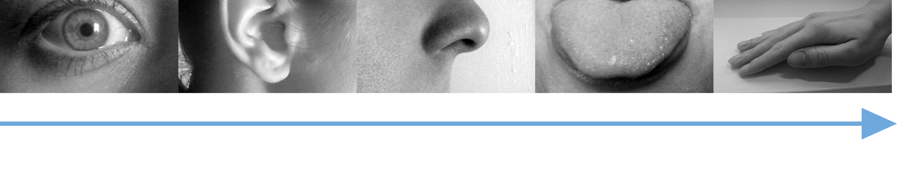

.conclusion[The brain receives, processes, and integrates a continuous flow of multimodal coherent inputs.]

???

First, the amount of data that animals and humans in particular are exposed to is often underestimated. A biological brain continuously receives, processes and integrates multimodal inputs from various sensors—images (light), sound, smell, etc. Humans do not learn to recognise objects by looking at photos from ImageNet, but are rather exposed to a continuous flow of visual stimuli with slow changes of the viewing angle and lighting conditions. Furthermore, the stimuli are coherent across modalities, we are allowed to interact with the objects and we even receive multiple supervision signals.

---

count: false

## Supervision in biological learning
#### Generalisation requires exposure to relevant training data

.center[
<figure>
	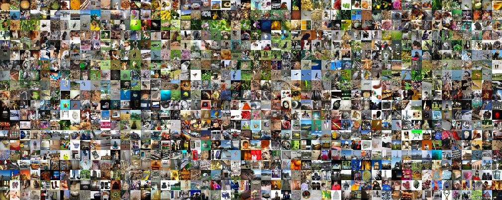
  <figcaption>ImageNet</figcaption>
</figure>
]

---

## Supervision in biological learning
#### Generalisation requires exposure to relevant training data

.context35[The human visual system is remarkably robust, but it has insightful limitations.]

---

count: false

## Supervision in biological learning
#### Generalisation requires exposure to relevant training data

.context35[The human visual system is remarkably robust, but it has insightful limitations.]

.center[ 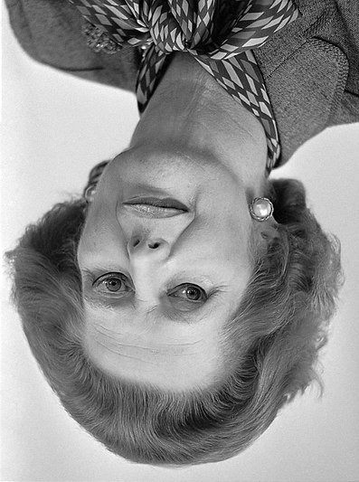  ]

---

count: false

## Supervision in biological learning
#### Generalisation requires exposure to relevant training data

.context35[The human visual system is remarkably robust, but it has insightful limitations.]

.center[   ]

---

count: false

## Supervision in biological learning
#### Generalisation requires exposure to relevant training data

.context35[The human visual system is remarkably robust, but it has insightful limitations.]

.center[   ]

---

count: false

## Supervision in biological learning
#### Generalisation requires exposure to relevant training data

.context35[The human visual system is remarkably robust, but it has insightful limitations.]

.center[   ]

Face perception is severely impaired if faces are presented upside down. More generally, object recognition is impaired when we see objects from unfamiliar viewpoints.

.conclusion[Our perceptual abilities are optimised for our needs, and determined by the _training data distribution_.]

---

## Supervision in biological learning
#### Generalisation requires exposure to relevant training data

.context35[A commonly seen claim is that humans learn to categorise novel classes from a few examples.]

.center[
<figure>
	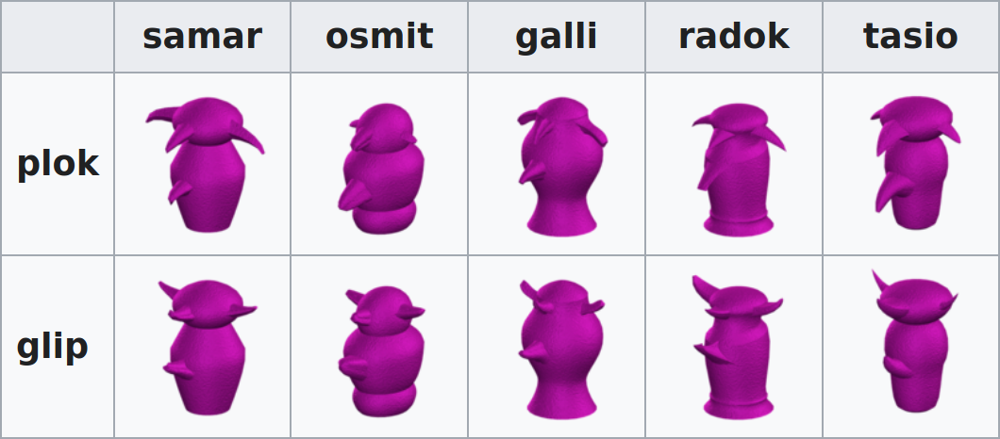
  <figcaption>Greebles</figcaption>
</figure>
]

.conclusion[When exposed to unfamiliar objects, humans need substantial training (data) to recognise the new objects.]

???

LANGUAGE:
- German, but not fluent
- Generalisation to Dutch because it is similar...

---

## Outline

* [.darkgray[~~Motivation: The DL Hype~~]](#motivation)
* [Supervision in biological learning](#supervisionbio)
	* [~~Generalisation requires exposure to relevant training data~~](#generalisation-requires-data)
	* [.lightgreen[Supervisory signals for the brain]](#supervision-brain)
	* [The role of evolution and brain development](#evolution)
* [.darkgray[Supervision in machine learning]](#supervisionml)
* [.darkgray[Conclusions for future research directions]](#conclusions)

---

name: supervision-brain

## Supervision in biological learning
#### Supervisory signals for the brain

.context35["A child can generalize the concept of ‘giraffe’ from a single picture in a book"]

--

_Supervision_, as used currently by the machine learning community, is this:
.center[

]

---

## Supervision in biological learning
#### Supervisory signals for the brain

We indeed do not see a class label over each object we look at, but we use multiple sources of supervision:

* Parents point at objects and name them, and play a crucial role in language development .cite[(Kuhl et al., 2007)].
* Zebra-finches also rely on feedback (supervision) from the female adult, and not just on imitation, to learn to sing .cite[(Carouso-Peck & Goldstein, 2019)].
* Children follow hierarchical learning, instead of learning all breeds of dogs.
* Social cues to recognise individual faces, and produce grammatical sentences .cite[(Hasson et al., 2020)].
* Embodiment: learning to balance the body and grasp objects.
* "We learn more from other people than we do from any other source" .cite[(Gopnik, 2021)].

.conclusion[In virtually any learning process, we can identify a supervisory signal that influences the brain.]

---

## Supervision in biological learning
#### Supervisory signals for the brain

Do we learn to recognise plants and animals just by looking at them, or do we use "labels"?
.center[
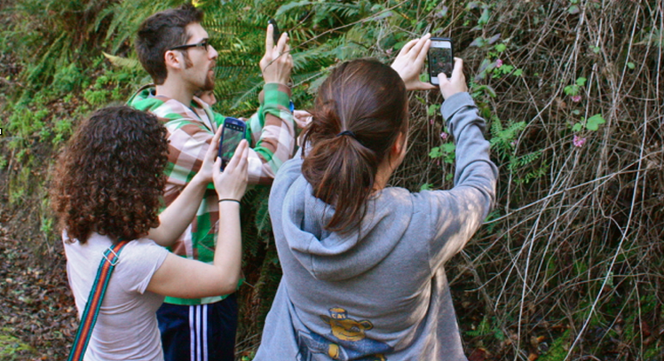
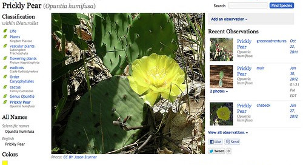
]

Do we learn a new language just by listening to it, or do we use dictionaries, teachers, etc.?

.conclusion[Not only does supervision facilitate learning, but humans actively seek for it. ]

???

Besides this kind of explicit supervision, the brain certainly makes use of more subtle, implicit supervised signals, such as temporal stability (Becker, 1999; Wyss et al., 2003): The light that enters the retina, and the sound waves that reach the cochlea, are not random signals from a sequence of rapidly changing arbitrary photos or noise, but highly coherent and regular flows of slowly changing stimuli, especially at the higher, semantical level (Kording et al., 2004). At the very least, this is how we perceive it and if such a smooth perception turns out to be a consequence rather than a cause, then it should be a by-product of a long process of evolution that would be worth taking into account.

---

## Outline

* [.darkgray[~~Motivation: The DL Hype~~]](#motivation)
* [Supervision in biological learning](#supervisionbio)
	* [~~Generalisation requires exposure to relevant training data~~](#generalisation-requires-data)
	* [~~Supervisory signals for the brain~~](#supervision-brain)
	* [.lightgreen[The role of evolution and brain development]](#evolution)
* [.darkgray[Supervision in machine learning]](#supervisionml)
* [.darkgray[Conclusions for future research directions]](#conclusions)

---

name: evolution

## Supervision in biological learning
#### The role of evolution .darkgray[and brain development]

.context35[Neural networks are trained from _tabula rasa_, but our brains are the outcome of millions of years of evolution.]

.center[
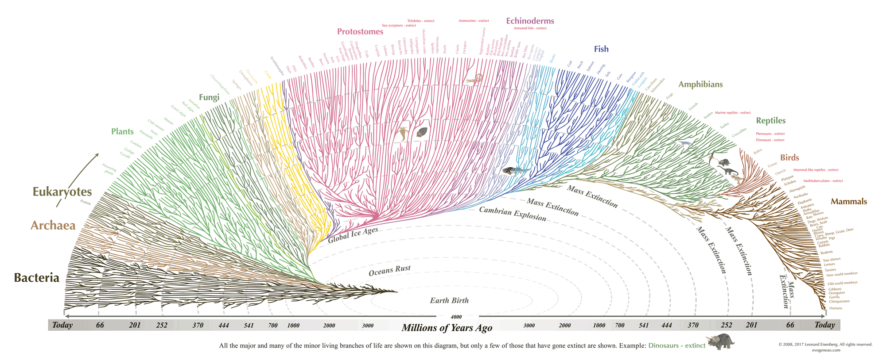
]

.references[
* Hasson, U. et al. [Direct fit to nature: An evolutionary perspective on biological and artificial neural networks](https://www.biorxiv.org/content/10.1101/764258). Neuron, 2020
* Zador, A. M. [A critique of pure learning and what artificial neural networks can learn from animal brains](https://www.biorxiv.org/content/10.1101/582643). Nature Communications, 2019
]

???

Importantly, evolution not only provides innate behaviour, but also determines what cannot be learnt, or relevant constraints—scientists who have trained animals in the laboratory for psychological or neuroscientific studies are well aware that tasks have to be carefully adapted to the ecological behaviour and limitations of the animal, determined by evolution.

Taking into account the role of evolution, we can ask relevant questions that relate to the claims discussed in the previous sections. If our brains are the product of millions of years of exposure to relevant stimuli and adaptation, is it really fair to say that humans are capable of robust out-of- distribution generalisation and that we learn from from a few examples? If evolution has largely determined what our brain can and cannot learn, providing as with a pre-trained model, is it really fair to say that humans learn in a unsupervised fashion? These questions are relevant for machine learning research: if we take biological learning as motivation for artificial intelligence, should we not temper our expectations of what learning algorithms should aspire to? And, therefore, would it not be worth reconsidering some research programmes?  

As a shortcut to simulating evolution, neuroscience is a rich source of inspiration of constraints and inductive biases that determine learning in the biological brain and can potentially inform machine learning.

---

## Supervision in biological learning
#### The role of .darkgray[evolution and] brain development

.context35[Most often, machine learning models are compared with learning in the adult brain.]

.left-column-33[
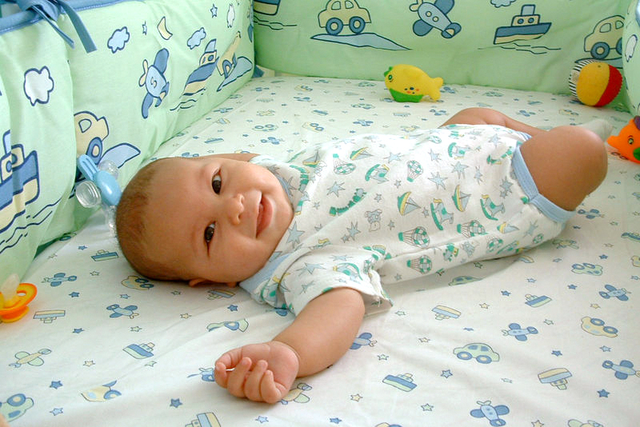
]
.right-column-66[
* Comparisons with human learning in ML papers often underestimate the amount of input stimuli and supervision that infants receive.
* Childhood can be regarded as a period dedicated almost exclusively to learning .cite[(Pelz & Kidd, 2020)].
* In the case of humans and other animals with cultural learning (e.g. corvid birds), the extended childhood and parenting have been proposed to be pivotal in the evolution of cognition .cite[(Uomini et al. 2020)]
]

.full-width[
.conclusion[Machine learning research can draw more inspiration from both evolutionary biology and the literature on developmental psychology, brain development and life history and learning.]
]

---

## Outline

* [.darkgray[~~Motivation: The DL Hype~~]](#motivation)
* [Supervision in biological learning](#supervisionbio)
	* [~~Generalisation requires exposure to relevant training data~~](#generalisation-requires-data)
	* [~~Supervisory signals for the brain~~](#supervision-brain)
	* [~~The role of evolution and brain development~~](#evolution)
* [.lightblue[Supervision in machine learning]](#supervisionml)
* [.darkgray[Conclusions for future research directions]](#conclusions)

---

count: false

## Outline

* [.darkgray[~~Motivation: The DL Hype~~]](#motivation)
* [.darkgray[~~Supervision in biological learning~~]](#supervisionbio)
* [.lightblue[Supervision in machine learning]](#supervisionml)
* [.darkgray[Conclusions for future research directions]](#conclusions)

---

name: supervisionml

## Supervision in machine learning

.context35[Machine learning textbooks draw a hard distinction between _supervised learning_ and _unsupervised learning_.]

.center[
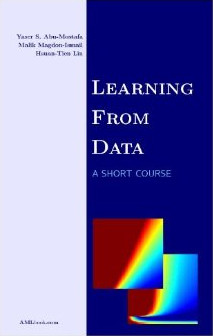
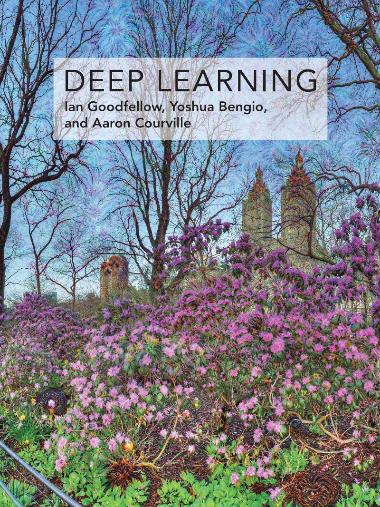
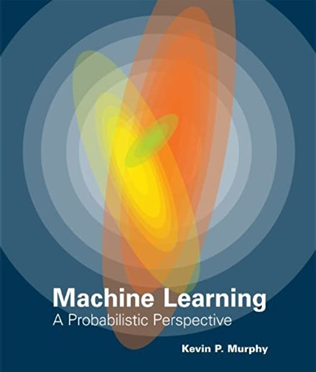
]

Are the boundaries clear enough? 

What happens with the variants _in-between_—semi-supervised learning, self-supervised learning, etc.?

---

## Outline

* [.darkgray[~~Motivation: The DL Hype~~]](#motivation)
* [.darkgray[~~Supervision in biological learning~~]](#supervisionbio)
* [Supervision in machine learning](#supervisionml)
  * [.lightblue[Catastrophic forgetting of old concepts]](#catastrophic-forgetting)
  * [The brands of _alt-supervised_ learning](#alt-supervised)
  * [Supervision comes in different flavours](#flavours-supervision)
* [.darkgray[Conclusions for future research directions]](#conclusions)

---

name: catastrophic-forgetting

## Supervision in machine learning
#### Catastrophic forgetting of old concepts

.left-column-66[
* _No free lunch_ theorem: No learning algorithm is better than any other, when averaged over all possible data distributions .cite[(Wolpert, 1996)]. 
    * Therefore, we need prior knowledge, or _supervision_.
* A recent version for unsupervised learning of disentangled representations: without inductive biases for both the models and the data sets, unsupervised disentanglement learning is fundamentally impossible .cite[(Locatello et al., 2018)]. 
]

.right-column-33[

]

.references[
* Wolpert, D. H. [The lack of a priori distinctions between learning algorithms](https://direct.mit.edu/neco/article/8/7/1341/6016/The-Lack-of-A-Priori-Distinctions-Between-Learning). Neural Computation, 1996.
* Locatello, F. et al. [Challenging common assumptions in the unsupervised learning of disentangled representations](https://arxiv.org/abs/1811.12359). ICML, 2019
]

???

While this is not news, the terminology used in the recent and current machine learning literature seems to reject supervision and neglect these nuances, evidencing that the field suffers catastrophic forgetting of well-established notions.

--

.full-width[
.conclusion[Without inductive bias, learning is not possible: purely unsupervised learning is an illusion.]
]

---

## Outline

* [.darkgray[~~Motivation: The DL Hype~~]](#motivation)
* [.darkgray[~~Supervision in biological learning~~]](#supervisionbio)
* [Supervision in machine learning](#supervisionml)
  * [~~Catastrophic forgetting of old concepts~~](#catastrophic-forgetting)
  * [.lightblue[The brands of _alt-supervised_ learning]](#alt-supervised)
  * [Supervision comes in different flavours](#flavours-supervision)
* [.darkgray[Conclusions for future research directions]](#conclusions)

---

name: alt-supervised

## Supervision in machine learning
#### The brands of _alt-supervised_ learning

.context35[In deep learning, the term _supervised learning_ has adopted the meaning of _classification_ of examples annotated by humans.]

--

1. _Supervised learning_ is a broader category than _classification_: regression, ranking, etc.
--

2. Even for classification, labels are not restricted to _human annotations_.
--

> "_In many cases the outputs $y$ may be difficult to collect automatically and must be provided by a human 'supervisor', but .lightblue[the term still applies even when the training set targets were collected automatically]_" .smaller[(highlighting mine)]
.right[.cite[Goodfellow et al. Deep Learning. 2016]]

--

Would you dare to provide definitions of _unsupervised learning_, _predictive learning_, _semi-supervised learning_, _self-supervised learning_, etc.?

(This is a recurrent question by students starting to delve into the world of deep learning.)

---

## Supervision in machine learning
#### The brands of _alt-supervised_ learning

.context[Let's play the game of finding the differences!]

.left-column[
Prof. LeCun, NeurIPS 2016
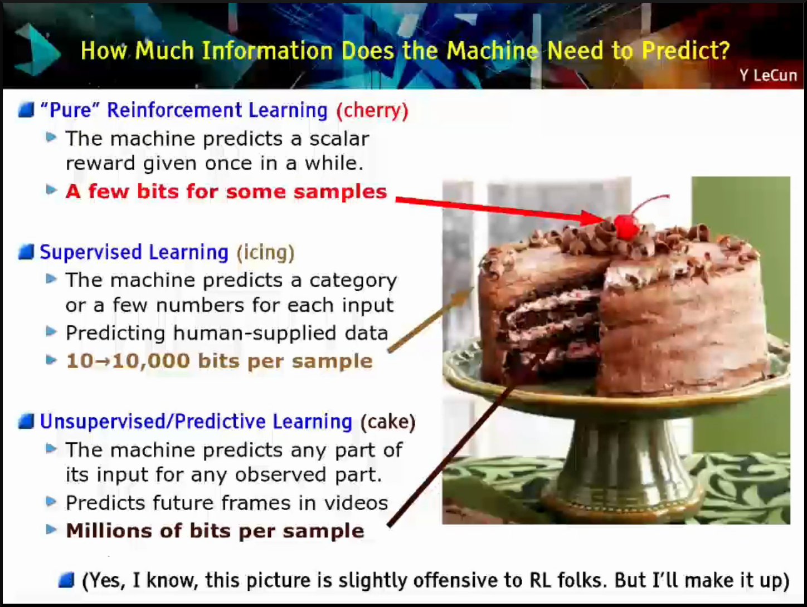
]
.right-column[
Prof. LeCun, ISSCC 2019
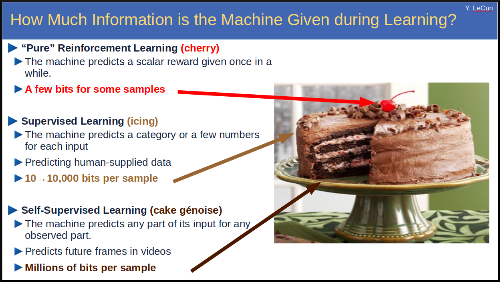
]

---

count: false

## Supervision in machine learning
#### The brands of _alt-supervised_ learning

.context[Let's play the game of finding the differences!]

.left-column[

]
.right-column[

]

In December 2016, Prof. Yann LeCun titled his NeurIPS keynote presentation "Predictive Learning", to refer to "what many people mean by unsupervised learning".

In 2019: "I now call it 'self-supervised learning', because 'unsupervised' is both a loaded and confusing term".

---

count: false

## Supervision in machine learning
#### The brands of _alt-supervised_ learning

.context[Let's play the game of finding the differences!]

.left-column[

]
.right-column[

]

.conclusion[No wonder that students (and not-so-students) are confused...]

---

## Supervision in machine learning
#### The brands of _alt-supervised_ learning

In practice, the use of the terms is _currently_ and _approximately_:
--

* .lightblue[Unsupervised learning]: anything that does not use the human annotations.
--

* .lightblue[Predictive learning]: see unsupervised learning.
--

* .lightblue[Self-supervised learning]: anything trained on tasks other than typical classification, e.g. _unsupervised learning_.
--

* .lightblue[Semi-supervised learning]: like all of the above, but using some of the labels too.

--

\* Note: all methods are eventually evaluated on the task defined by the classification labels.

.conclusion[Different terms have been used to refer to pretty much the same things, depending of what was selling better at the moment. We are using _brand names_ rather than a theoretically grounded taxonomy, leading many astray.]

---

## Outline

* [.darkgray[~~Motivation: The DL Hype~~]](#motivation)
* [.darkgray[~~Supervision in biological learning~~]](#supervisionbio)
* [Supervision in machine learning](#supervisionml)
  * [~~Catastrophic forgetting of old concepts~~](#catastrophic-forgetting)
  * [~~The brands of _alt-supervised_ learning~~](#alt-supervised)
  * [.lightblue[Supervision comes in different flavours]](#flavours-supervision)
* [.darkgray[Conclusions for future research directions]](#conclusions)

---

name: flavours-supervision

## Supervision in machine learning
#### Supervision comes in different flavours

.context35[Automatic differentiation has opened the possibility of training nearly with any objective (task), without having to do the maths.]

.center[
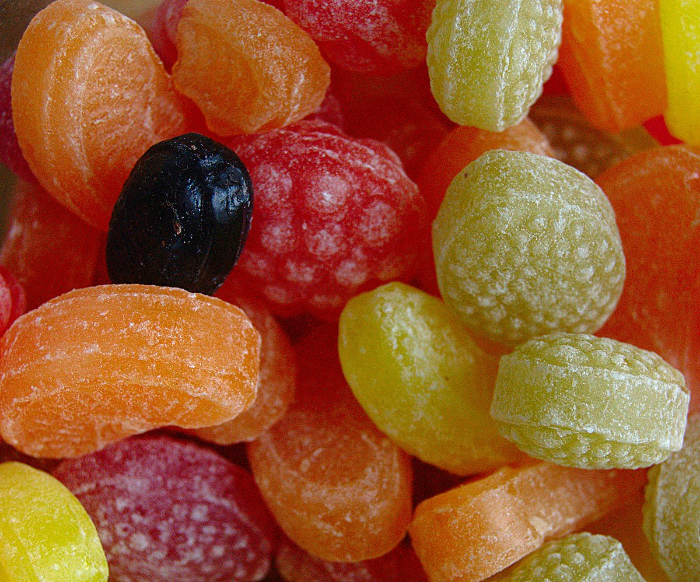
]

---

count: false

## Supervision in machine learning
#### Supervision comes in different flavours

.context35[Automatic differentiation has opened the possibility of training nearly with any objective (task), without having to do the maths.]

.center[
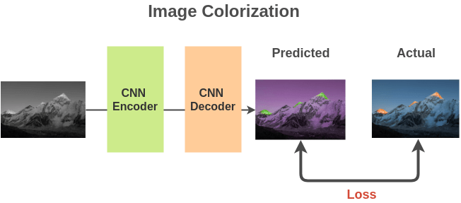
]

.footnote[Ref: [The Illustrated Self-Supervised Learning](https://amitness.com/2020/02/illustrated-self-supervised-learning/), by [Amit Chaudhary](https://amitness.com/)]

---

count: false

## Supervision in machine learning
#### Supervision comes in different flavours

.context35[Automatic differentiation has opened the possibility of training nearly with any objective (task), without having to do the maths.]

.center[

]

.footnote[Ref: [The Illustrated Self-Supervised Learning](https://amitness.com/2020/02/illustrated-self-supervised-learning/), by [Amit Chaudhary](https://amitness.com/)]

---

count: false

## Supervision in machine learning
#### Supervision comes in different flavours

.context35[Automatic differentiation has opened the possibility of training nearly with any objective (task), without having to do the maths.]

.center[
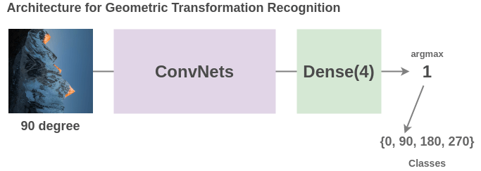
]

.footnote[Ref: [The Illustrated Self-Supervised Learning](https://amitness.com/2020/02/illustrated-self-supervised-learning/), by [Amit Chaudhary](https://amitness.com/)]

---

count: false

## Supervision in machine learning
#### Supervision comes in different flavours

.context35[Automatic differentiation has opened the possibility of training nearly with any objective (task), without having to do the maths.]

.center[
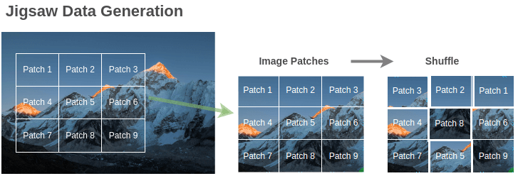
]

.footnote[Ref: [The Illustrated Self-Supervised Learning](https://amitness.com/2020/02/illustrated-self-supervised-learning/), by [Amit Chaudhary](https://amitness.com/)]

---

count: false

## Supervision in machine learning
#### Supervision comes in different flavours

.context35[Automatic differentiation has opened the possibility of training nearly with any objective (task), without having to do the maths.]

.center[
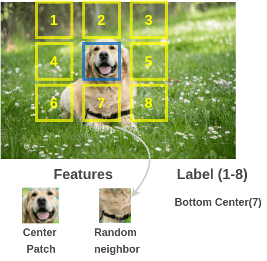
]

.footnote[Ref: [The Illustrated Self-Supervised Learning](https://amitness.com/2020/02/illustrated-self-supervised-learning/), by [Amit Chaudhary](https://amitness.com/)]

---

count: false

## Supervision in machine learning
#### Supervision comes in different flavours

.context35[Automatic differentiation has opened the possibility of training nearly with any objective (task), without having to do the maths.]

.center[
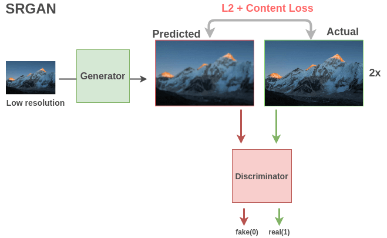
]

.footnote[Ref: [The Illustrated Self-Supervised Learning](https://amitness.com/2020/02/illustrated-self-supervised-learning/), by [Amit Chaudhary](https://amitness.com/)]

---

count: false

## Supervision in machine learning
#### Supervision comes in different flavours

.context35[Automatic differentiation has opened the possibility of training nearly with any objective (task), without having to do the maths.]

.center[
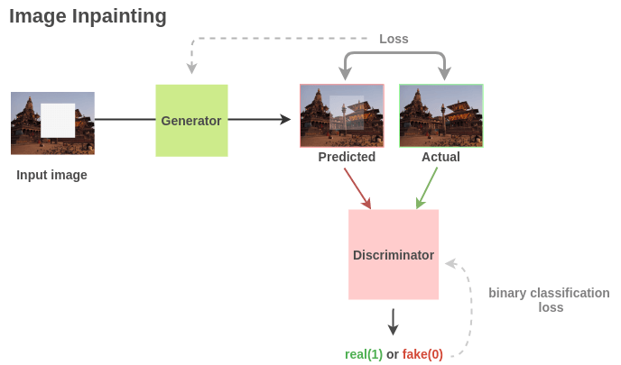
]

.footnote[Ref: [The Illustrated Self-Supervised Learning](https://amitness.com/2020/02/illustrated-self-supervised-learning/), by [Amit Chaudhary](https://amitness.com/)]

---

## Supervision in machine learning
#### Supervision comes in different flavours

.context35[A (now) popular technique to incorporate supervision into computer vision models is _data augmentation_.]

.center[

]

--

* .orange[Alert]: shameless plug #2: In 2018-2019, we proposed using data augmentation to learn layer-wise invariant representations, inspired by the increasing invariance along the ventral stream .cite[(Hernandez-Garcia et al., 2019)]

.references[
* Hernández-García, König, and Kietzmann. [Learning robust visual representations using data augmentation invariance](https://arxiv.org/abs/1906.04547). arXiv:1906.04547, 2019.
]

---

count: false

## Supervision in machine learning
#### Supervision comes in different flavours

.context35[A (now) popular technique to incorporate supervision into computer vision models is _data augmentation_.]

.center[

]

* Alert: shameless plug #2: In 2018-2019, we proposed using data augmentation to learn layer-wise invariant representations, inspired by the increasing invariance along the ventral stream .cite[(Hernandez-Garcia et al., 2019)]

.conclusion[Most of these techniques make use of a wide range of surrogate tasks with supervisory signals defined by humans. In fact, they could have been called _hyper-supervised_ learning.]

---

## Outline

* [.darkgray[~~Motivation: The DL Hype~~]](#motivation)
* [.darkgray[~~Supervision in biological learning~~]](#supervisionbio)
* [Supervision in machine learning](#supervisionml)
  * [~~Catastrophic forgetting of old concepts~~](#catastrophic-forgetting)
  * [~~The brands of _alt-supervised_ learning~~](#alt-supervised)
  * [~~Supervision comes in different flavours~~](#flavours-supervision)
* [.darkgray[Conclusions for future research directions]](#conclusions)

---

count: false

## Outline

* [.darkgray[~~Motivation: The DL Hype~~]](#motivation)
* [.darkgray[~~Supervision in biological learning~~]](#supervisionbio)
* [.darkgray[~~Supervision in machine learning~~]](#supervisionml)
* [Conclusions for future research directions](#conclusions)

---

## Summary

* .lightgreen[Generalisation in biological learning (also) needs exposure to relevant training data]
--

* .lightgreen[Learning in nature is also mediated by multiple supervisory signals]
--

* .lightgreen[Evolution plays a crucial role in what can and cannot be learnt, and brain development is often overlooked]
--

  
* .lightblue[Good old statistical learning theory tells us that supervision or inductive biases _are_ necessary]
--

* .lightblue[The deep learning community has (ab)used an overselling and confusing terminology around supervised learning]
--

* .lightblue[The methods proposed to escape supervised learning are in fact _hyper_-supervised learning, only that supervision comes in different flavours]
--

---

name: conclusions

## Conclusions for future research directions

* Machine learning needs more interdisciplinary influences:
  * Neuroscience
  * Biology
  * Developmental psychology
  * Evolutionary theory
--

* Machine learning would benefit from moving beyond measuring the accuracy on ImageNet (or the like). We should better measure the quality of the learnt representations:
  * Suitability for transfer learning
  * (Adversarial) robustness
  * Comparison with brain data
  * Comparison with behavioural tasks
--

* The time might have come to devise a theoretically grounded taxonomy of learning methods that better survive the test of time
--

* Developing learning theory beyond simple objectives such as binary classification

---

name: title
class: title, middle

## Rethinking (un-, semi-, self-, ...)supervised learning:
### Insights from biological learning and from calling it by its name

Alex Hernández-García (he/él)

.gray224[Kietzmann Lab, Donders Institute for Brain Cognition and Behaviour · The Internet · June 29th 2021]

.footer[[alexhernandezgarcia.github.io](https://alexhernandezgarcia.github.io/) | [alex.hernandez-garcia@mila.quebec](mailto:alex.hernandez-garcia@mila.quebec) | [@alexhdezgcia](https://twitter.com/alexhdezgcia)] 

.footnote[[arXiv:2012.02526](https://arxiv.org/abs/2012.02526)]

---

## Summary

* .lightgreen[Generalisation in biological learning (also) needs exposure to relevant training data]
* .lightgreen[Learning in nature is also mediated by multiple supervisory signals]
* .lightgreen[Evolution plays a crucial role in what can and cannot be learnt, and brain development is often overlooked]
* .lightblue[Good old statistical learning theory tells us that supervision or inductive biases _are_ necessary]
* .lightblue[The deep learning community has (ab)used an overselling and confusing terminology around supervised learning]
* .lightblue[The methods proposed to escape supervised learning are in fact _hyper_-supervised learning, only that supervision comes in different flavours]

