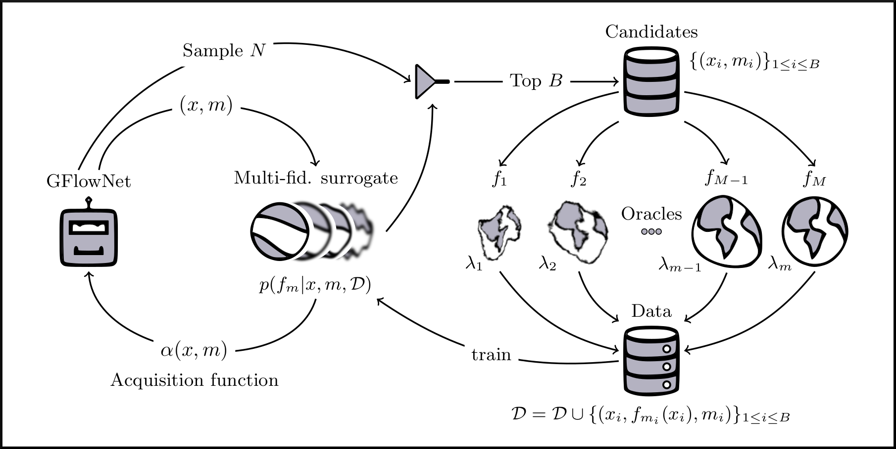
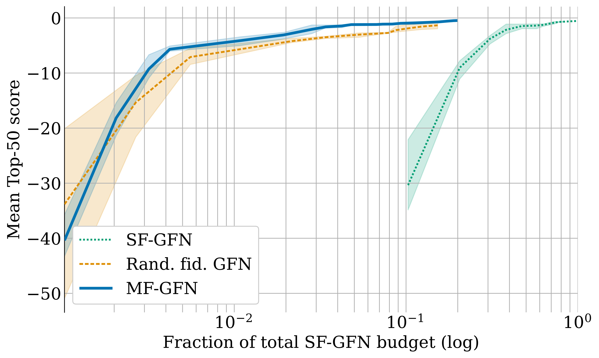
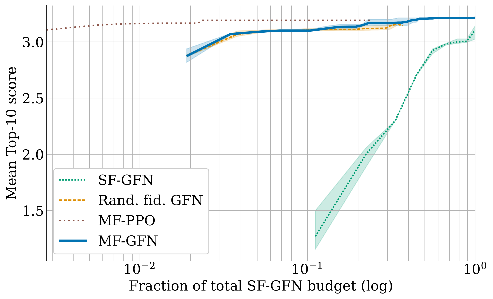
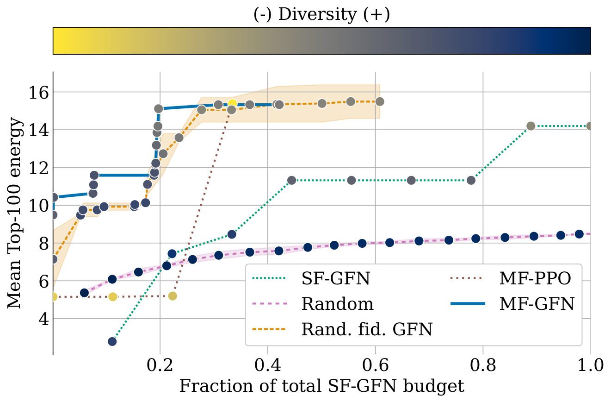
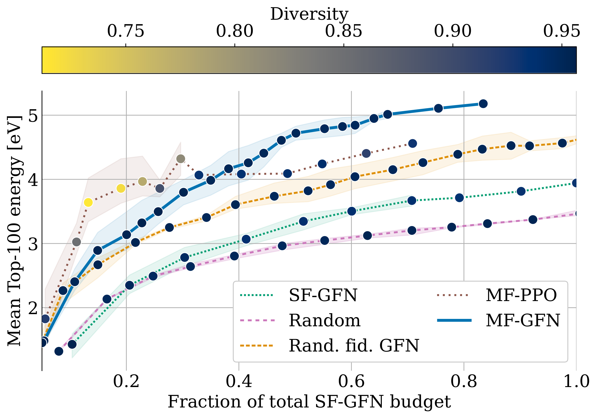
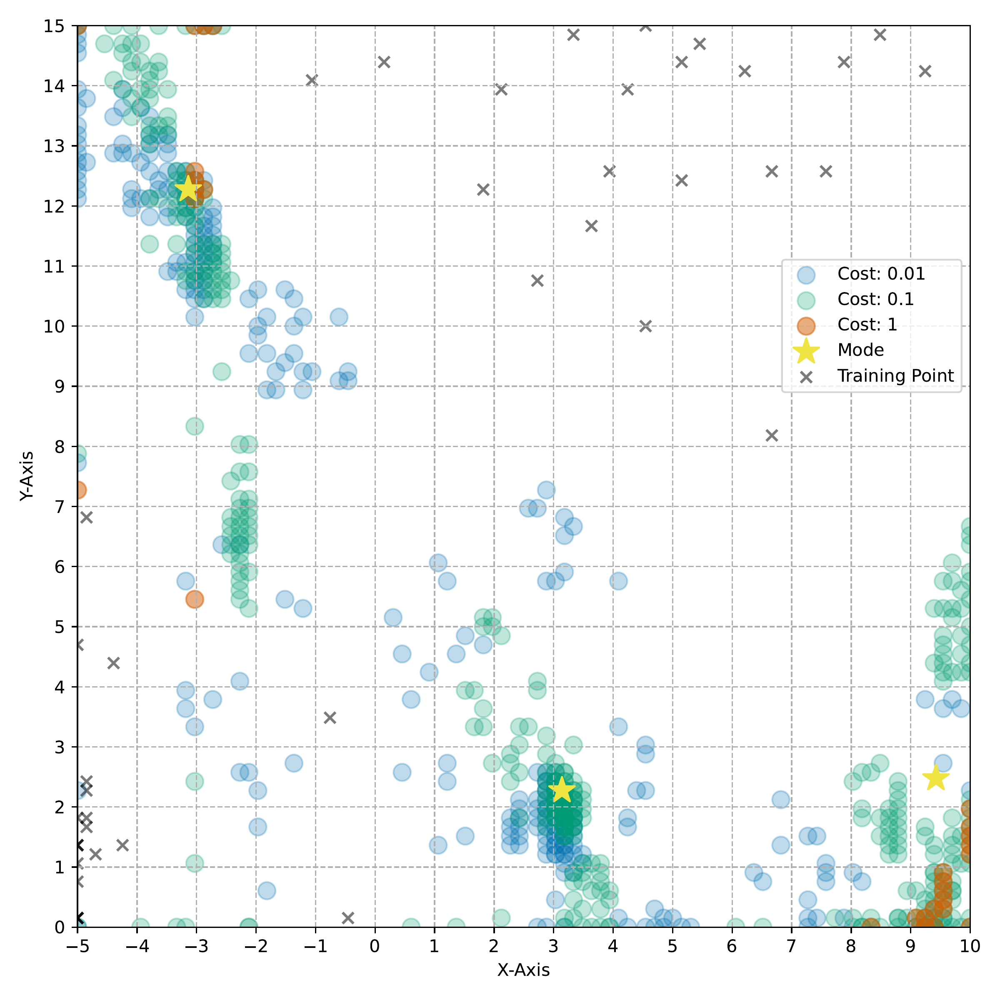

name: mfgfn-dec23
class: title, middle

### Multi-fidelity active learning with GFlowNets for scientific discovery

Alex Hernández-García (he/il/él)

.center[

&nbsp&nbsp&nbsp&nbsp

]

.smaller[.footer[
Slides: [alexhernandezgarcia.github.io/slides/{{ name }}](https://alexhernandezgarcia.github.io/slides/{{ name }})
]]

---

## Collaborators

.left-column[
* Nikita Saxena
* Moksh Jain
* Chenghao Liu
* Yoshua Bengio
* ...
]

.right-column[
* Kolya Malkin
* Salem Lahlou
* Alexandra Volokhova
* Emmanuel Bengio
* ...
]

---

## Outline

* Part 1: Motivation: Why scientific discovery?
    * Challenges, limitations and opportunities for machine learning
* Part 2: A brief introduction to GFlowNets
* Part 3: Multi-fidelity active learning with GFlowNets

---

name: title
class: title, middle

## Motivation: Why scientific discovery?
### Part 1

.center[]

---

## Why scientific discovery?

.context[Climate change is a major challenge for humanity.]

.left-column-66[.center[
<figure>
	
  <figcaption>.smaller[Modelled and observed global average temperatures in the last 2 millenia (source graphic: <a href="https://www.theguardian.com/science/2021/aug/09/humans-have-caused-unprecedented-and-irreversible-change-to-climate-scientists-warn">The Guardian</a>.)]</figcaption>
</figure>
]]

.right-column-33[
Consequences:
* Melting glaciers and polar ice
* Sea level rise
* Heatwaves
* Floods
* Droughts
* Wildfires
* ...
]

???

* Flash floods kill **5,000** people per year.
* Sea levels are expected to rise by **2 metres** by the end of the century
* Rising sea levels could disrupt the lives of **1 billion people** by the end of 2050.
* As much as **40% of the Amazon** forest is at risk of becoming a savanna.
* In 2015, forest fires claimed roughly **980 000 $km^2$** of the world’s forest.
* Forest fires emmitted **~1.8 Gt of CO2** in 2019.

---

## Why scientific discovery?

.context[Climate change is a major challenge for humanity.]

.center[
<figure>
	
  <figcaption>Median global warming across modelled scenarios. Adapted from IPCC Sixth Assessment Report, 2022</figcaption>
</figure>
]

--

.conclusion["The evidence is clear: the time for action is now." .smaller[IPCC Sixth Assessment Report, 2022]]

???

* Category C1: scenarios that limit warming to 1.5°C in 2100 with a likelihood of greater than 50%, and reach or exceed warming of 1.5°C during the 21st century with a likelihood of 67% or less. 
* Category C2: same as C1 but exceed warming of 1.5°C during the 21st century with a likelihood of _greater_ than 67%.
* Category C3: scenarios that limit peak warming to 2°C throughout the 21st century with a likelihood of greater than 67%
* Category C8: scenarios that exceed warming of 4°C during the 21st century with a likelihood of 50% or greater.

---

## Why scientific discovery?

.context["The time for action is now"]

> "Limiting global warming will require major transitions in the energy sector. This will involve a substantial reduction in fossil fuel use, widespread electrification, .highlight1[improved energy efficiency, and use of alternative fuels (such as hydrogen)]." .cite[IPCC Sixth Assessment Report, 2022]

> "Net-zero CO2 emissions from the industrial sector are challenging but possible. Reducing industry emissions will entail coordinated action throughout value chains to promote all mitigation options, including demand management, .highlight1[energy and materials efficiency, circular material flows], as well as abatement technologies and transformational changes in production processes." .cite[IPCC Sixth Assessment Report, 2022]

--

 

.conclusion[Mitigation of the climate crisis requires transformational changes in the energy and materials efficiency.]

---

## Why scientific discovery?
### The potential of better materials

.context[The climate crisis demands more efficient materials.]

* Improving material efficiency can reduce 0.93 ($\pm$ 0.23) GtCO₂-eq per year.
* Fuel switching can reduce 2.1 ($\pm$ 0.52) GtCO₂-eq per year, only in the industry sector. 
* Carbon capture and storage can reduce 0.54 ($\pm$ 0.27) GtCO₂-eq per year in the energy sector.

.right[.cite[IPCC Sixth Assessment Report (2022)]]

.smaller[.footnote[† Global anthropogenic emissions in 2019 were estimated in 59 ($\pm$ 6.6) GtCO₂-eq.]]

---

count: false

## Why scientific discovery?
### The potential of better materials

.context[The climate crisis demands more efficient materials.]

* Improving material efficiency can reduce 0.93 ($\pm$ 0.23) GtCO₂-eq per year.
* Fuel switching can reduce 2.1 ($\pm$ 0.52) GtCO₂-eq per year, only in the industry sector. 
* Carbon capture and storage can reduce 0.54 ($\pm$ 0.27) GtCO₂-eq per year in the energy sector.

.right[.cite[IPCC Sixth Assessment Report (2022)]]

What are better, new materials needed for?

* Electrocatalysts for fuel cells, hydrogen storage, industrial chemical reactions, carbon capture, etc.
* Solid electrolytes for batteries.
* Thin film materials for photovoltaics.
* ...

.smaller[.footnote[† Global anthropogenic emissions in 2019 were estimated in 59 ($\pm$ 6.6) GtCO₂-eq.]]

---

## Traditional scientific discovery loop

.context35[The climate crisis demands accelerating scientific discoveries.]

.right-column-66[ .center[]]

.left-column-33[
The .highlight1[traditional pipeline] for scientific discovery (paradigms 1-3):
* relies on .highlight1[highly specialised human expertise],
* it is .highlight1[time-consuming] and
* .highlight1[financially and computationally expensive].
]

---

count: false

## Machine learning in the loop

.context35[The traditional scientific discovery loop is too slow.]

.right-column-66[ .center[]]

.left-column-33[
A .highlight1[machine learning model] can be:
* trained with data from _real-world_ experiments and
* used to quickly and cheaply evaluate queries
]

---

count: false

## Machine learning in the loop

.context35[The traditional scientific discovery loop is too slow.]

.right-column-66[ .center[]]

.left-column-33[
A .highlight1[machine learning model] can be:
* trained with data from _real-world_ experiments and
* used to quickly and cheaply evaluate queries

.conclusion[A machine learning model replacing real-world experiments can _only_ provide _linear_ gains.]

.conclusion[Not enough if the search space is very large ($10^{180}$ stable materials)]
]

---

count: false

## _Generative_ machine learning in the loop

.context[Can we do better than _linear_? An agent in the loop.]

.right-column-66[ .center[]]

.left-column-33[
A .highlight1[machine learning **agent**] in the loop could (ideally):
* .highlight1[learn structure] from the available data,
* .highlight1[generalise] to unexplored regions of the search space and
* .highlight1[build better queries]
]

---

count: false

## _Generative_ machine learning in the loop

.context[Can we do better than _linear_? An agent in the loop.]

.right-column-66[ .center[]]

.left-column-33[
A .highlight1[machine learning **agent**] in the loop could (ideally):
* .highlight1[learn structure] from the available data,
* .highlight1[generalise] to unexplored regions of the search space and
* .highlight1[build better queries]

.conclusion[A successful AL pipeline with an ML agent in the loop can provide _exponential_ gains.]
]

---

count: false

## _Generative_ machine learning in the loop

.context[GFlowNet as the agent.]

.right-column-66[ .center[]]

.left-column-33[
A .highlight1[machine learning **agent**] in the loop could (ideally):
* .highlight1[learn structure] from the available data,
* .highlight1[generalise] to unexplored regions of the search space and
* .highlight1[build better queries]

.conclusion[A successful AL pipeline with an ML agent in the loop can provide _exponential_ gains.]
]

.references[
Jain et al. [GFlowNets for AI-Driven Scientific Discovery](https://arxiv.org/abs/2302.00615). Digital Discovery, Royal Society of Chemistry, 2023.
]

---

## Machine learning for scientific discovery
### Challenges and limitations of existing methods

.highlight1[Challenge]: very large search spaces.

--

&rarr; Need for .highlight2[efficient search and generalisation] of underlying structure.

--

.highlight1[Challenge]: underspecification of objective functions or metrics.

--

&rarr; Need for .highlight2[diverse] candidates.

--

.highlight1[Limitation]: Reinforcement learning and MCMC methods are good at optimisation but poor at mode mixing.

--

&rarr; Need for .highlight2[_multi-modal_ optimisation].

---

name: title
class: title, middle

## A brief introduction to GFlowNets
### Part 2

.center[]

---

## GFlowNet in a nutshell

 
Given a reward or objective function $R(x)$, GFlowNet can be seen a generative model trained to sample objects $x \in \cal X$ according to .highlight1[a sampling policy $\pi(x)$ proportional to the reward $R(x)$]: $\pi(x) \propto R(x)$

--

&rarr; Sampling proportionally to the reward function induces .highlight1[multi-modal search and diversity].

--

.left-column[
The policy $\pi_{\theta}(x)$ is modelled by a deep neural network, parameterised by $\theta$, thus providing .highlight1[amortised inference].

&rarr; Amortised inference can be thought of as _exploration with memory_, which induces .highlight1[systematic generalisation].
]

.right-column[
.center[]
]

---

## GFlowNet in a nutshell

* Objects $x \in \cal X$ are constructed through a sequence of steps $\tau$ from an action space $\cal A$.
* At each step of the trajectory $\tau=(s_0\rightarrow s_1 \rightarrow \dots \rightarrow s_f)$, we get a partially constructed object $s$ in state space $\cal S$.
* This induces a directed acyclic graph (DAG) $\mathcal{G}=(\mathcal{S},\mathcal{A})$, with all possible constructions in the domain.

.center[]

--

.conclusion[This terminology is reminiscent of reinforcement learning.]

---

## An intuitive toy example

Task: find arrangements of Tetris pieces on the board that minimise the empty space.

.left-column[
.center[]
]

.right-column[
  
]

--

.conclusion[This task resembles designing DNA sequences or molecules or materials via fragments, with the objective of optimising certain properties.]

---

## An intuitive toy example

Task: find arrangements of Tetris pieces on the board that minimise the empty space.

.columns-3-left[.center[
  <figure>
    
    <figcaption>State space $\cal S$</figcaption>
  </figure>
]]

.columns-3-center[.center[
  <figure>
    
    <figcaption>Action space $\cal A$</figcaption>
  </figure>
]]

.columns-3-right[.center[

  

  <figure>
      
    <figcaption>$s_0$</figcaption>
  </figure>
  

  

  $\rightarrow$
  

  

  <figure>
      
    <figcaption>$s_1$</figcaption>
  </figure>
  

  

  $\rightarrow$
  

  

  <figure>
      
    <figcaption>$s_2$</figcaption>
  </figure>
  

]]

---

## An intuitive toy example

Task: find arrangements of Tetris pieces on the board that minimise the empty space.

.center[

  

  <figure>
      
    <figcaption>Score: 0/12</figcaption>
  </figure>
  

  

  <figure>
      
    <figcaption>Score: 4/12</figcaption>
  </figure>
  

  

  <figure>
      
    <figcaption>Score: 8/12</figcaption>
  </figure>
  

  

  <figure>
      
    <figcaption>Score: 12/12</figcaption>
  </figure>
  

]

---

## An intuitive toy example

Task: find arrangements of Tetris pieces on the board that minimise the empty space.

.center[

  

  <figure>
      
    <figcaption>Score: 12/12</figcaption>
  </figure>
  

  

  <figure>
      
    <figcaption>Score: 12/12</figcaption>
  </figure>
  

  

  <figure>
      
    <figcaption>Score: 12/12</figcaption>
  </figure>
  

  

  <figure>
      
    <figcaption>Score: 12/12</figcaption>
  </figure>
  

  

  <figure>
      
    <figcaption>Score: 12/12</figcaption>
  </figure>
  

]

.conclusion[The _reward function_ of this task has multiple modes. With a larger board and more pieces, the number of combinations and modes grow exponentially and the task of efficiently finding them is non-trivial for machine learning models.]

---

## GFlowNet flows

.context[The edges or transitions in the DAG can be quantified by their _flow_.]

* Analogous to water-flow in pipes.
* Trajectory Flow $F(\tau)$ denotes probability mass assigned to trajectory $\tau$.
* State Flow $F(s)$ is the flow of all trajectories passing through the state $s$.
* Edge Flow $F(s\rightarrow s')$ is the flow through a particular edge $s\rightarrow s'$.
* Forward Policy $P_F$: $P\_F(s'|s) = \frac{F(s\rightarrow s')}{F(s)}$
* Backward Policy $P_B$: $P\_B(s|s') = \frac{F(s\rightarrow s')}{F(s')}$

.center[]

.references[
Bengio et al. [Flow network based generative models for non-iterative diverse candidate generation](https://arxiv.org/abs/2106.04399), NeurIPS, 2021. 
]

???

Not to be confused with normalizing flows!

---

## Principle of conservation as a training objective

.right-column-33[.center[]]

.left-column-66[
**Consistent Flow**:  Flow $F$ satisfies the _flow consistency equation_
$$\sum\_{s' \in \text{Parents}(s)} F\_\theta(s' \rightarrow s) = \sum\_{s' \in \text{Children}(s)} F\_\theta(s \rightarrow s')$$

**Theorem**: For a consistent flow $F$ with terminal flow set as the reward $F(x\rightarrow s_f)=R(x)$, the forward policy samples $x$ proportionally to $R(x)$:
$$\pi(x) = \frac{R(x)}{Z}\propto R(x)$$

**Corollary**: The flow at $s_0$, $F(s_0)$ is the partition function $Z$! 
]

.references[
Bengio et al. [Flow network based generative models for non-iterative diverse candidate generation](https://arxiv.org/abs/2106.04399), NeurIPS, 2021. 
]

---

## Principle of conservation as a training objective

$$\sum\_{s' \in \text{Parent}(s)} F\_\theta(s' \rightarrow s) = \sum\_{s'' \in \text{Child}(s)} F\_\theta(s \rightarrow s')$$

* **Flow Matching Objective**: $$\mathcal{L}\_{FM}(s; \theta) = \left(\log \frac{\sum\_{s'\in \text{Parent}(s)} F\_\theta(s'{\rightarrow} s)}{\sum\_{s'' \in \text{Child}(s)}F\_\theta(s{\rightarrow} s'')}\right)^2$$
* **Trajectory Balance** (better credit assignment): $$\mathcal{L}\_{TB} (\tau;\theta) = \left(\log \frac{Z\_\theta \prod\_{s{\rightarrow} s' \in \tau}P\_{F\_\theta}(s'|s)}{R(x)\prod\_{s\rightarrow s' \in \tau} P\_{B\_\theta}(s|s') }\right)^2$$

---

## Results
### Tetris GFlowNets

.context[If the model is sufficiently trained, the sampling policy $\pi(x)$ should be proportional to the reward $R(x)$: $\pi(x) \propto R(x)$]

 

.center[

  

  <figure>
      
    <figcaption>$\pi(x) = 8.12~\%$</figcaption>
  </figure>
  

  

  <figure>
      
    <figcaption>$\pi(x) = 8.96~\%$</figcaption>
  </figure>
  

  

  <figure>
      
    <figcaption>$\pi(x) = 8.61~\%$</figcaption>
  </figure>
  

  

  <figure>
      
    <figcaption>$\pi(x) = 9.16~\%$</figcaption>
  </figure>
  

  

  <figure>
      
    <figcaption>$\pi(x) = 8.39~\%$</figcaption>
  </figure>
  

]

After training, GFlowNet samples multiple (diverse) modes with high probability.

.footnote[The energy function $\varepsilon(x)$ is the fraction of the board occupied by pieces and the reward function is $R(X) = \varepsilon(x)^4$ to disproportionally favour the discovery of modes.]

---

## Results
### Hyper-grid and molecule fragments

.context[GFlowNet has been successfully trained in other toy and practically relevant tasks. .cite[(Bengio et al., 2019)]]

.columns-3-left[
.highlight1[Hyper-grid]: The action space is in which dimension to move and the reward function has high reward in the corners.

.center[

]
]

--

.columns-3-center[
.highlight1[Small molecules]: The action space is molecular fragments and the reward function is the binding energy to a particular protein.

.center[

]
]

--

.columns-3-right[
.highlight1[Active learning with molecules]: Multi-round active learning with a limited oracle budget.

.center[

]
]

--

.conclusion[GFlowNet is able to efficiently explore the search space and generalise to unseen modes of the reward.]

---

##  GFlowNet extensions
### Multi-objective GFlowNets

We have extended GFlowNets to handle multi-objective optimisation and not only cover the Pareto front but also sample diverse objects at each pointin the Pareto front.

.center[

]

.references[
Jain et al. [Multi-Objective GFlowNets](https://arxiv.org/abs/2210.12765), ICML, 2023. 
]

---

##  GFlowNet extensions
### Continuous GFlowNets

We have recently generalised the theory and implementation of GFlowNets to encompass both discrete and continuous or hybrid state spaces. 

.center[

]

.references[
Lahlou et al. [A Theory of Continuous Generative Flow Networks](https://arxiv.org/abs/2301.12594), ICML, 2023. 
]

---

name: title
class: title, middle

## Multi-fidelity active learning with GFlowNets
### Part 3

.center[]

---

## Why multi-fidelity?

In many areas of scientific applications we have access to multiple approximations of the objective function.

For example, for material discovery:

* Synthesis of a material and characterisation of a property in the lab
* Density Functional Theory (DFT)
* An ensemble of large graph neural networks trained on DFT data
* An efficient, smaller neural network

--

However, current multi-fidelity methods struggle with structured, large, high-dimensional search spaces and lack **diversity**.

---

## Multi-fidelity active learning with GFlowNets

.center[]

---

## Multi-fidelity surrogate models

* Small (synthetic) tasks: exact Gaussian Processes
* Larger-scale, benchmark tasks: Deep Kernel Learning with stochastic variational Gaussian processes

Multi-fidelity kernel learning:

$$K(x, \tilde{x}, m, \tilde{m}) = K_1(x, \tilde{x}) \times K_2(m, \tilde{m})$$

* $K_1$: RBF kernel
* $K_2$: Downsampling kernel

.references[
* Wilson, Hu et al. [Deep Kernel Learning](https://arxiv.org/abs/1511.02222), AISTATS, 2016.
* Wu et al. [Practical multi-fidelity Bayesian optimization for hyperparameter tuning](https://arxiv.org/abs/1903.04703) , UAI, 2019.
]

---

## Multi-fidelity acquisition function
### Maximum Entropy Search (MES)

MES it aims to maximise the mutual information between .hihglight1[the value] of the objective function $f$ when choosing point *x* and the maximum of the objective function, $f^{\star}$ (instead of considering the `arg max`).

The multi-fidelity variant is designed to select the candidate $x$ and the fidelity $m$ that maximise the mutual information between $f_M^\star$ and the oracle at fidelity $m$, $f_m$ , weighted by the cost of the oracle $\lambda_m$.

$$\alpha(x, m) = \frac{1}{\lambda_{m}} I(f_M^\star; f_m | \mathcal{D})$$

.references[
* Moss et al. [GIBBON: General-purpose Information-Based Bayesian OptimisatioN](https://arxiv.org/abs/2102.03324), JMLR, 2021.
]

---

## Multi-fidelity GFlowNets (MF-GFN)

Given a baseline GFlowNet with state space $\mathcal{S}$ and action space $\mathcal{A}$, we augment the state space with a new dimension for the fidelity $\mathcal{M'} = \{0, 1, 2, \ldots, M\}$ (including $m = 0$, which corresponds to unset fidelity). 

The set of allowed transitions $\mathcal{A}_M$ is augmented such that a fidelity $m > 0$ of a trajectory must be selected once, and only once, from any intermediate state. This is meant to provide flexibility and improve generalisation.

Finished trajectories are the concatenation of an object $x$ and the fidelity $m$.

GFlowNet is trained with the acquisition function $\alpha(x, m)$ as reward function.

---

## Experiments
### Baselines

* .highlight1[SF-GFN]: GFlowNet with highest fidelity oracle to establish a benchmark for performance without considering the cost-accuracy trade-offs.
* .highlight1[Random fid. GFN]: GFlowNet with random fidelities, that is a variant of SF-GFN where the candidates are generated with the GFlowNet but the fidelities are picked randomly and a multi-fidelity acquisition function is used, to investigate the benefit of deciding the fidelity with GFlowNets.
* .highlight1[Random]: Quasi-random approach where the candidates and fidelities are picked randomly and the top $(x, m)$ pairs scored by the acquisition function are queried.
* .highlight1[MF-PPO]: Instantiation of multi-fidelity Bayesian optimisation where the acquisition function is optimised using proximal policy optimisation (reinforcement learning).

---

## Synthetic tasks: Branin and Hartmann

.highlight1[Branin]: $100 \times 100$ grid, 3 oracles (from the BO literature).

.highlight1[Hartmann]: 6D grid of length 10, 3 oracles (from the BO literature).

.left-column[.center[
  <figure>
    
    <figcaption>Branin task</figcaption>
  </figure>
]]

.right-column[.center[
  <figure>
    
    <figcaption>Hartmann task</figcaption>
  </figure>
]]

---

## DNA aptamers and antimicrobial peptides (AMP)

.highlight1[DNA]: GFlowNet adds one nucleobase (`A`, `T`, `C`, `G`) at a time up to length 30. This yields a design space of size $|\mathcal{X}| = 4^{30}$. The objective function is the free energy estimated by NUPACK. The (simulated) lower fidelity oracle is a transformer trained with 1 million sequences.

.highlight1[AMP]: Protein sequences with variable length (max. 50). The oracles are 3 ML models trained with different subsets of data.

.left-column[.center[
  <figure>
    
    <figcaption>DNA task</figcaption>
  </figure>
]]

.right-column[.center[
  <figure>
    
    <figcaption>AMP task</figcaption>
  </figure>
]]

---

## Small molecules

More realistic experiments, with oracles that correlate with experimental results as approximations of the scoring function. The costs reflect the computational demands of each oracle (1, 3, 7).

.left-column[.center[
  <figure>
    
    <figcaption>Ionisation potential task</figcaption>
  </figure>
]]

.right-column[.center[
  <figure>
    
    <figcaption>Electron affinity task</figcaption>
  </figure>
]]

---

## How does multi-fidelity help?

.context[Visualisation of results on the 2D Branin function.]

.center[]

---

name: title
class: title, middle

## Summary and conclusions

.center[]

---

## Summary and conclusions

* Tackling the most pressing problems for humanity, such as the climate crisis and the threat of global pandemics, requires .highlight1[accelerating the pace of scientific discovery].
* Current AI tools are not enough to truly utilize all the information and resources at our disposal.
* AI-driven scientific discovery demands learning methods that can .highlight1[efficiently discover diverse candidates in very large, multi-modal search spaces].
* .highlight1[GFlowNet] is a learning method for amortised inference that can sample proportionally to a reward function.
* .highlight1[Multi-fidelity active learning with GFlowNets] enables .highlight1[cost-effective exploration] of large, high-dimensional and structured spaces, and discovers multiple, diverse modes of black-box score functions.

.references[
* Hernandez-Garcia, Saxena et al. [Multi-fidelity active learning with GFlowNets](https://arxiv.org/abs/2306.11715). arXiv 2306.11715, 2023.
* Jain et al. [GFlowNets for AI-Driven Scientific Discovery](https://arxiv.org/abs/2302.00615). Digital Discovery, Royal Society of Chemistry, 2023.
* Jain et al. [Biological Sequence Design with GFlowNets](https://arxiv.org/abs/2203.04115), ICML, 2022. 
]

--

.highlight2[Open source code]: [github.com/alexhernandezgarcia/gflownet](https://github.com/alexhernandezgarcia/gflownet)

---

## Acknowledgements

.left-column[
* Nikita Saxena (Mila) - equivalent contribution
* Moksh Jain (Mila)
* Chenghao Liu (Mila)
* Yoshua Bengio (Mila)
]

.right-column[
* IVADO
* CIFAR
]

---

name: title
class: title, middle

## Thanks! Questions? 

Alex Hernández-García (he/il/él)

.center[

&nbsp&nbsp&nbsp&nbsp

]

.footer[[alexhernandezgarcia.github.io](https://alexhernandezgarcia.github.io/) | [alex.hernandez-garcia@mila.quebec](mailto:alex.hernandez-garcia@mila.quebec)] 
.footer[[@alexhg@scholar.social](https://scholar.social/@alexhg)  | [@alexhdezgcia](https://twitter.com/alexhdezgcia) ]

.smaller[.footer[
Slides: [alexhernandezgarcia.github.io/slides/mifpp-sep23](https://alexhernandezgarcia.github.io/slides/mifpp-sep23)
]]

