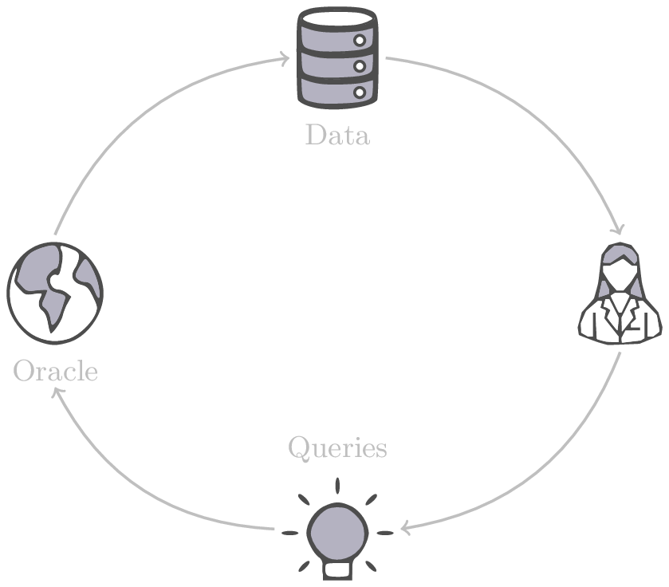
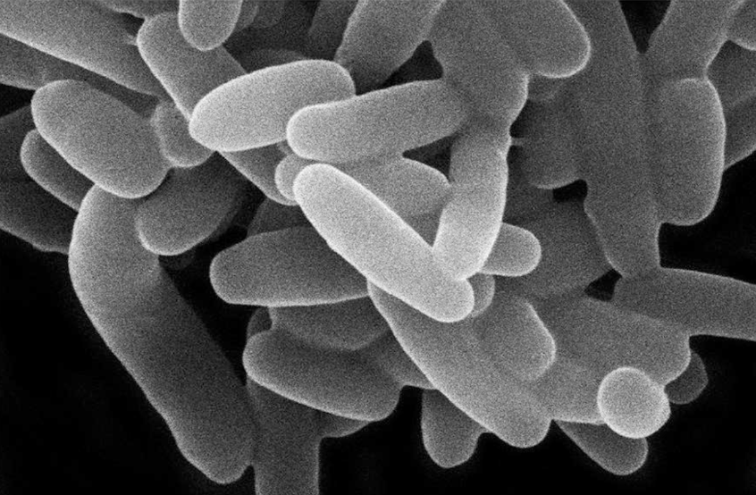

name: mila-kaist-jul25
class: title, middle

### Multi-fidelity active learning for materials and drug discoveries

Alex Hernández-García (he/il/él)

.turquoise[KAIST–Mila Prefrontal Research Center · Mila · July 9th 2025]

.center[

&nbsp&nbsp&nbsp&nbsp

]

.center[

&nbsp&nbsp&nbsp&nbsp

]

.smaller[.footer[
Slides: [alexhernandezgarcia.github.io/slides/{{ name }}](https://alexhernandezgarcia.github.io/slides/{{ name }})
]]

.qrcode[]

---

count: false
name: title
class: title, middle

## Why materials and drug discoveries?

.center[]

---

## Machine Learning for Science

.center[]

.conclusion[Machine learning research has the potential to facilitate scientific discoveries to tackle climate and health challenges.]

---

count: false

## Machine Learning for Science and Science for Machine Learning

.center[]

.conclusion[Machine learning research has the potential to facilitate scientific discoveries to tackle climate and health challenges. Scientific challenges stimulate in turn machine learning research.]

---

count: false
name: mlforscience
class: title, middle

### **Generative** and **active** learning for scientific discoveries

.center[]

---

## Traditional discovery cycle

.context35[The climate crisis demands accelerating scientific discoveries.]

--

.right-column-66[ .center[]]

.left-column-33[
 
The .highlight1[traditional pipeline] for scientific discovery:
* relies on .highlight1[highly specialised human expertise],
* it is .highlight1[time-consuming] and
* .highlight1[financially and computationally expensive].
]

---

count: false

## _Active_ machine learning

.context35[The traditional scientific discovery loop is too slow for certain applications.]

.right-column-66[ .center[]]

.left-column-33[
 
A .highlight1[machine learning model] can be:
* trained with data from _real-world_ experiments and
]

---

count: false

## _Active_ machine learning

.context35[The traditional scientific discovery loop is too slow for certain applications.]

.right-column-66[ .center[]]

.left-column-33[
 
A .highlight1[machine learning model] can be:
* trained with data from _real-world_ experiments and
* used to quickly and cheaply evaluate queries
]

---

count: false

## _Active_ machine learning

.context35[The traditional scientific discovery loop is too slow for certain applications.]

.right-column-66[ .center[]]

.left-column-33[
 
A .highlight1[machine learning model] can be:
* trained with data from _real-world_ experiments and
* used to quickly and cheaply evaluate queries

.conclusion[There are infinitely many conceivable materials and combinatorially many molecules. Are predictive models enough?]
]

---

count: false

## Active and _generative_ machine learning

.right-column-66[ .center[]]

.left-column-33[
 
.highlight1[Generative machine learning] can:
* .highlight1[learn patterns] from the available data,
* .highlight1[generalise] to unexplored regions of the search space and
* .highlight1[build better queries]
]

--

.left-column-33[
.conclusion[Active learning with generative machine learning can in theory more efficiently explore the candidate space.]
]

---

count: false
name: title
class: title, middle

### The challenges of scientific discoveries

.center[]
.center[]

---

## An intuitive trivial problem

.highlight1[Problem]: find one arrangement of Tetris pieces on the board that minimise the empty space.

.left-column-33[
.center[]
]

.right-column-66[
.center[]
]

--

.full-width[.center[
<figure>
  
<figcaption>Score: 12</figcaption>
</figure>
]]

---

count: false

## An intuitive ~~trivial~~ easy problem

.highlight1[Problem]: find .highlight2[all] the arrangements of Tetris pieces on the board that minimise the empty space.

.left-column-33[
.center[]
]

.right-column-66[
.center[]
]

--

.full-width[.center[

  

  <figure>
      
    <figcaption>12</figcaption>
  </figure>
  

  

  <figure>
      
    <figcaption>12</figcaption>
  </figure>
  

  

  <figure>
      
    <figcaption>12</figcaption>
  </figure>
  

  

  <figure>
      
    <figcaption>12</figcaption>
  </figure>
  

  

  <figure>
      
    <figcaption>12</figcaption>
  </figure>
  

]]

---

count: false

## An intuitive ~~easy~~ hard problem

.highlight1[Problem]: find .highlight2[all] the arrangements of Tetris pieces on the board that minimise the empty space.

.left-column-33[
.center[]
]

.right-column-66[
.center[]
]

--

.full-width[.center[

  

  <figure>
      
  </figure>
  

  

  <figure>
      
  </figure>
  

  

  <figure>
      
  </figure>
  

  

  <figure>
      
  </figure>
  

  

  <figure>
      
  </figure>
  

]]

---

count: false

## An incredibly ~~intuitive easy~~ hard problem

.highlight1[Problem]: find .highlight2[all] the arrangements of Tetris pieces on the board that .highlight2[optimise an unknown function].

.left-column-33[
.center[]
]

.right-column-66[
.center[]
]

--

.full-width[.center[

  

  <figure>
      
  </figure>
  

  

  <figure>
      
  </figure>
  

  

  <figure>
      
  </figure>
  

  

  <figure>
      
  </figure>
  

  

  <figure>
      
  </figure>
  

]]

---

count: false

## An incredibly ~~intuitive easy~~ hard problem

.highlight1[Problem]: find .highlight2[all] the arrangements of Tetris pieces on the board that .highlight2[optimise an unknown function].

.left-column-33[
.center[]
]

.right-column-66[
.center[]
]

.full-width[.conclusion[Materials and drug discovery involve finding candidates with rare properties from combinatorially or infinitely many options.]]

---

## Why Tetris for scientific discovery?

.context35[The "Tetris problem" involves .highlight1[sampling from an unknown distribution] in a .highlight1[discrete, high-dimensional, combinatorially large space].]

---

count: false

## Why Tetris for scientific discovery?
### Biological sequence design

 
Proteins, antimicrobial peptides (AMP) and DNA can be represented as sequences of amino acids or nucleobases. There are $22^{100} \approx 10^{134}$ protein sequences with 100 amino acids.

.context35[The "Tetris problem" involves sampling from an unknown distribution in a discrete, high-dimensional, combinatorially large space]

.center[]

--

.left-column-66[
.dnag[`G`].dnaa[`A`].dnag[`G`].dnag[`G`].dnag[`G`].dnac[`C`].dnag[`G`].dnaa[`A`].dnac[`C`].dnag[`G`].dnag[`G`].dnat[`T`].dnaa[`A`].dnac[`C`].dnag[`G`].dnag[`G`].dnaa[`A`].dnag[`G`].dnac[`C`].dnat[`T`].dnac[`C`].dnat[`T`].dnag[`G`].dnac[`C`].dnat[`T`].dnac[`C`].dnac[`C`].dnag[`G`].dnat[`T`].dnat[`T`].dnaa[`A`] 
.dnat[`T`].dnac[`C`].dnaa[`A`].dnac[`C`].dnac[`C`].dnat[`T`].dnac[`C`].dnac[`C`].dnac[`C`].dnag[`G`].dnaa[`A`].dnag[`G`].dnac[`C`].dnaa[`A`].dnaa[`A`].dnat[`T`].dnaa[`A`].dnag[`G`].dnat[`T`].dnat[`T`].dnag[`G`].dnat[`T`].dnaa[`A`].dnag[`G`].dnag[`G`].dnac[`C`].dnaa[`A`].dnag[`G`].dnac[`C`].dnag[`G`].dnat[`T`].dnac[`C`].dnac[`C`].dnat[`T`].dnaa[`A`].dnac[`C`].dnac[`C`].dnag[`G`].dnat[`T`].dnat[`T`].dnac[`C`].dnag[`G`] 
.dnac[`C`].dnat[`T`].dnaa[`A`].dnac[`C`].dnag[`G`].dnac[`C`].dnag[`G`].dnat[`T`].dnac[`C`].dnat[`T`].dnac[`C`].dnat[`T`].dnat[`T`].dnat[`T`].dnac[`C`].dnag[`G`].dnag[`G`].dnag[`G`].dnag[`G`].dnag[`G`].dnat[`T`].dnat[`T`].dnaa[`A`] 
.dnat[`T`].dnat[`T`].dnag[`G`].dnac[`C`].dnaa[`A`].dnag[`G`].dnaa[`A`].dnag[`G`].dnag[`G`].dnat[`T`].dnat[`T`].dnaa[`A`].dnaa[`A`].dnac[`C`].dnag[`G`].dnac[`C`].dnag[`G`].dnac[`C`].dnaa[`A`].dnat[`T`].dnag[`G`].dnac[`C`].dnag[`G`].dnaa[`A`].dnac[`C`].dnat[`T`].dnag[`G`].dnag[`G`].dnag[`G`].dnag[`G`].dnat[`T`].dnat[`T`].dnaa[`A`].dnag[`G`].dnat[`T`].dnaa[`A`].dnag[`G`].dnat[`T`].dnac[`C`].dnag[`G`].dnaa[`A`].dnaa[`A`].dnac[`C`].dnaa[`A`].dnat[`T`].dnaa[`A`].dnat[`T`].dnaa[`A`].dnat[`T`].dnat[`T`].dnag[`G`].dnaa[`A`].dnat[`T`].dnaa[`A`].dnaa[`A`].dnaa[`A`].dnac[`C`].dnaa[`A`] 
.dnag[`G`].dnac[`C`].dnat[`T`].dnac[`C`].dnag[`G`].dnac[`C`].dnat[`T`].dnat[`T`].dnaa[`A`].dnag[`G`].dnag[`G`].dnag[`G`].dnac[`C`].dnac[`C`].dnat[`T`].dnac[`C`].dnag[`G`].dnaa[`A`].dnac[`C`].dnat[`T`].dnac[`C`].dnac[`C`].dnat[`T`].dnac[`C`].dnat[`T`].dnag[`G`].dnaa[`A`].dnaa[`A`].dnat[`T`].dnag[`G`].dnag[`G`].dnaa[`A`].dnag[`G`].dnat[`T`].dnag[`G`].dnat[`T`].dnat[`T`].dnac[`C`].dnaa[`A`].dnat[`T`].dnac[`C`].dnag[`G`].dnaa[`A`].dnaa[`A`].dnat[`T`].dnag[`G`].dnag[`G`].dnaa[`A`].dnag[`G`].dnat[`T`].dnag[`G`] 
]

---

## Why Tetris for scientific discovery?
### Molecular generation

.context35[The "Tetris problem" involves sampling from an unknown distribution in a discrete, high-dimensional, combinatorially large space]

 
Small molecules can also be represented as sequences or by a combination of of higher-level fragments. There may be about $10^{60}$ drug-like molecules.

--

.columns-3-left[
.center[

`CC(=O)NCCC1=CNc2c1cc(OC)cc2
CC(=O)NCCc1c[nH]c2ccc(OC)cc12`
]]

.columns-3-center[
.center[

`OCCc1c(C)[n+](cs1)Cc2cnc(C)nc2N`
]]

.columns-3-right[
.center[

`CN1CCC[C@H]1c2cccnc2`
]]

---

## Why Tetris for scientific discovery?
### Crystal structure generation

.context35[The "Tetris problem" involves sampling from an unknown distribution in a discrete, high-dimensional, combinatorially large space]

 
Crystal structures can be described by their chemical composition, the symmetry group and the lattice parameters (and more generally by atomic positions).

--

.center[]

.references[
* Mila AI4Science et al. [Crystal-GFN: sampling crystals with desirable properties and constraints](https://arxiv.org/abs/2310.04925). AI4Mat, NeurIPS 2023 (spotlight).
]

---

## Machine learning for scientific discovery
### Challenges and limitations of existing methods

--

.highlight1[Challenge]: very large and high-dimensional search spaces.

--

&rarr; Need for .highlight2[efficient search and generalisation] of underlying structure.

--

.highlight1[Challenge]: underspecification of objective functions or metrics.

--

&rarr; Need for .highlight2[diverse] candidates.

--

.highlight1[Limitation]: Reinforcement learning excels at optimisation in complex spaces but tends to lack diversity.

--
.highlight1[Limitation]: Markov chain Monte Carlo (MCMC) can _sample_ from a distribution (diversity) but struggles at mode mixing in high dimensions.

--

&rarr; Need to .highlight2[combine all of the above]: sampling from complex, high-dimensional distributions.

--

.conclusion[Generative flow networks (GFlowNets) and active learning address these challenges.]

---

count: false
name: mfal
class: title, middle

## Multi-fidelity active learning

Nikita Saxena, Moksh Jain, Cheng-Hao Liu, Yoshua Bengio

.smaller[[Multi-fidelity active learning with GFlowNets](https://arxiv.org/abs/2306.11715). Transactions on Machine Learning Research (TMLR). 2024.]

.center[]

---

## Why multi-fidelity?

.context35[We had described the scientific discovery loop as a cycle with one single oracle.]

  
.right-column[
.center[]
]

--

.left-column[
Example: "incredibly hard" Tetris problem: find arrangements of Tetris pieces that optimise an .highlight2[unknown function $f$].
- $f$: Oracle, cost per evaluation 1,000 CAD or 1,000,000 ₩.

.center[

  

  <figure>
      
  </figure>
  

  

  <figure>
      
  </figure>
  

  

  <figure>
      
  </figure>
  

  

  <figure>
      
  </figure>
  

  

  <figure>
      
  </figure>
  

]
]

---

count: false

## Why multi-fidelity?

.context35[However, in practice, multiple oracles (models) of different fidelity and cost are available in scientific applications.]

  
.right-column[
.center[]
]

.left-column[
Example: "incredibly hard" Tetris problem: find arrangements of Tetris pieces that optimise an .highlight2[unknown function $f$].
- $f$: Oracle, cost per evaluation 1,000 CAD or 1,000,000 ₩.

.center[

  

  <figure>
      
  </figure>
  

  

  <figure>
      
  </figure>
  

  

  <figure>
      
  </figure>
  

  

  <figure>
      
  </figure>
  

  

  <figure>
      
  </figure>
  

]
]

---

count: false

## Why multi-fidelity?

.context35[However, in practice, multiple oracles (models) of different fidelity and cost are available in scientific applications.]

  
.right-column[
.center[]
]

.left-column[
Example: "incredibly hard" Tetris problem: find arrangements of Tetris pieces that optimise an .highlight2[unknown function $f$].
- $f$: Oracle, cost 1,000 CAD or 1,000,000 ₩.
- $f\_1$: Slightly inaccurate oracle, cost 100 CAD or 100,000 ₩.
- $f\_2$: Noisy but informative oracle, cost 1 CAD or 1,000 ₩.

.center[

  

  <figure>
      
  </figure>
  

  

  <figure>
      
  </figure>
  

  

  <figure>
      
  </figure>
  

  

  <figure>
      
  </figure>
  

  

  <figure>
      
  </figure>
  

]
]

---

count: false

## Why multi-fidelity?

.context[In many scientific applications we have access to multiple approximations of the objective function.]

.left-column[
For example, in .highlight1[material discovery]:

* .highlight1[Synthesis] of a material and characterisation of a property in the lab
* Molecular dynamic .highlight1[simulations] to estimate the property
* .highlight1[Machine learning] models trained to predict the property
]

.right-column[
.center[]
]

--

.conclusion[However, current machine learning methods cannot efficiently leverage the availability of multiple oracles and multi-fidelity data. Especially with .highlight1[structured, large, high-dimensional search spaces].]

---

## Contribution

- An .highlight1[active learning] algorithm to leverage the availability of .highlight1[multiple oracles at different fidelities and costs].

--
- The goal is two-fold:
    1. Find high-scoring candidates
    2. Candidates must be diverse
--
- Experimental evaluation with .highlight1[biological sequences and molecules]:
    - DNA
    - Antimicrobial peptides
    - Small molecules
    - Classical multi-fidelity toy functions (Branin and Hartmann)

--

.conclusion[Likely the first multi-fidelity active learning method for biological sequences and molecules.]

---

## Our multi-fidelity active learning algorithm

.center[]

---

count: false

## Our multi-fidelity active learning algorithm

.center[]

---

count: false

## Our multi-fidelity active learning algorithm

.center[]

---

count: false

## Our multi-fidelity active learning algorithm

.center[]

---

count: false

## Our multi-fidelity active learning algorithm

.center[]

---

count: false

## Our multi-fidelity active learning algorithm

.center[]

---

count: false

## Our multi-fidelity active learning algorithm

.center[]

---

count: false

## Our multi-fidelity active learning algorithm

.center[]

---

count: false

## Our multi-fidelity active learning algorithm

.center[]

---

count: false

## Our multi-fidelity active learning algorithm

.center[]

---

count: false

## Our multi-fidelity active learning algorithm

.center[]

---

count: false

## Our multi-fidelity active learning algorithm

.center[]

---

count: false

## Our multi-fidelity active learning algorithm

.center[]

---

count: false

## Our multi-fidelity active learning algorithm

.center[]

---

## Experiments
### Baselines

.context[This may be the .highlight1[first multi-fidelity active learning algorithm tested on biological sequence design and molecular design problems]. There did not exist baselines from the literature.]

--

 
* .highlight1[SF-GFN]: GFlowNet with highest fidelity oracle to establish a benchmark for performance without considering the cost-accuracy trade-offs.

--
* .highlight1[Random]: Quasi-random approach where the candidates and fidelities are picked randomly and the top $(x, m)$ pairs scored by the acquisition function are queried.

--
* .highlight1[Random fid. GFN]: GFlowNet with random fidelities, to investigate the benefit of deciding the fidelity with GFlowNets.

--
* .highlight1[MF-PPO]: Replacement of MF-GFN with a reinforcement learning algorithm to _optimise_ the acquisition function.

---

## Small molecules

- Realistic experiments with experimental oracles and costs that reflect computational demands (1, 3, 7).
- GFlowNet adds one SELFIES token (out of 26) at a time with variable length up to 64 ($|\mathcal{X}| > 26^{64}$). 
- Property: Adiabatic electron affinity (EA). Relevant in organic semiconductors, photoredox catalysis and organometallic synthesis.

--

.center[]

---

count: false

## Small molecules

- Realistic experiments with experimental oracles and costs that reflect computational demands (1, 3, 7).
- GFlowNet adds one SELFIES token (out of 26) at a time with variable length up to 64 ($|\mathcal{X}| > 26^{64}$). 
- Property: Adiabatic electron affinity (EA). Relevant in organic semiconductors, photoredox catalysis and organometallic synthesis.

.center[]

---

count: false

## Small molecules

- Realistic experiments with experimental oracles and costs that reflect computational demands (1, 3, 7).
- GFlowNet adds one SELFIES token (out of 26) at a time with variable length up to 64 ($|\mathcal{X}| > 26^{64}$). 
- Property: Adiabatic electron affinity (EA). Relevant in organic semiconductors, photoredox catalysis and organometallic synthesis.

.center[]

---

count: false

## Small molecules

- Realistic experiments with experimental oracles and costs that reflect computational demands (1, 3, 7).
- GFlowNet adds one SELFIES token (out of 26) at a time with variable length up to 64 ($|\mathcal{X}| > 26^{64}$). 
- Property: Adiabatic electron affinity (EA). Relevant in organic semiconductors, photoredox catalysis and organometallic synthesis.

.center[]

---

count: false

## Small molecules

- Realistic experiments with experimental oracles and costs that reflect computational demands (1, 3, 7).
- GFlowNet adds one SELFIES token (out of 26) at a time with variable length up to 64 ($|\mathcal{X}| > 26^{64}$). 
- Property: Adiabatic electron affinity (EA). Relevant in organic semiconductors, photoredox catalysis and organometallic synthesis.

.center[]

---

count: false

## Small molecules

- Realistic experiments with experimental oracles and costs that reflect computational demands (1, 3, 7).
- GFlowNet adds one SELFIES token (out of 26) at a time with variable length up to 64 ($|\mathcal{X}| > 26^{64}$). 
- Property: Adiabatic electron affinity (EA). Relevant in organic semiconductors, photoredox catalysis and organometallic synthesis.

.center[]

---

count: false

## Small molecules

- Realistic experiments with experimental oracles and costs that reflect computational demands (1, 3, 7).
- GFlowNet adds one SELFIES token (out of 26) at a time with variable length up to 64 ($|\mathcal{X}| > 26^{64}$). 
- Property: Adiabatic electron affinity (EA). Relevant in organic semiconductors, photoredox catalysis and organometallic synthesis.

.center[]

---

count: false

## Small molecules

- Realistic experiments with experimental oracles and costs that reflect computational demands (1, 3, 7).
- GFlowNet adds one SELFIES token (out of 26) at a time with variable length up to 64 ($|\mathcal{X}| > 26^{64}$). 
- Property: Adiabatic .highlight1[ionisation potential (IP)]. Relevant in organic semiconductors, photoredox catalysis and organometallic synthesis.

.center[]

---

## DNA aptamers

- GFlowNet adds one nucleobase (`A`, `T`, `C`, `G`) at a time up to length 30. This yields a design space of size $|\mathcal{X}| = 4^{30}$. 
- The objective function is the free energy estimated by a bioinformatics tool. 
- The (simulated) lower fidelity oracle is a transformer trained with 1 million sequences.

--

.center[]

---

count: false

## Antimicrobial peptides (AMP)

- Protein sequences (20 amino acids) with variable length (max. 50).
- The oracles are 3 ML models trained with different subsets of data.

--

.center[]

---

exclude: true

## How does multi-fidelity help?

.context[Visualisation on the synthetic 2D Branin function task.]

.center[]

---

exclude: true
count: false

## How does multi-fidelity help?

.context[Visualisation on the synthetic 2D Branin function task.]

.center[]

---

exclude: true
count: false

## How does multi-fidelity help?

.context[Visualisation on the synthetic 2D Branin function task.]

.center[]

---

exclude: true
count: false

## How does multi-fidelity help?

.context[Visualisation on the synthetic 2D Branin function task.]

.center[]

---

exclude: true
count: false

## Details of the algorithm
### Multi-fidelity surrogate models

* Small (synthetic) tasks: exact Gaussian Processes
* Larger-scale, benchmark tasks: Deep Kernel Learning with stochastic variational Gaussian processes

Multi-fidelity kernel learning:

$$K_{MF}((x, m), (\tilde{x}, \tilde{m})) = K_X(g(x), g(\tilde{x})) + K_M(m, \tilde{m}) \times K_X^M(g(x), g(\tilde{x}))$$

* $K_X$ and $K_X^M$: Matérn kernels with different lengthscales each
* Kernel of the fidelity confidences: $K_M(i, j) = (1 - \ell_i)(1 - \ell_j)(1 + \ell_i\ell_j)$
    * $\ell_m = \frac{\lambda_m}{\lambda_M}$

.references[
* Wilson, Hu et al. [Deep Kernel Learning](https://arxiv.org/abs/1511.02222), AISTATS, 2016.
* Mikkola et al. [Multi-fidelity Bayesian optimization with unreliable information sources](https://arxiv.org/abs/2210.13937) , AISTATS, 2023.
]

---

exclude: true
count: false

## Details of the algorithm
### Multi-fidelity acquisition function: Maximum Entropy Search (MES)

MES it aims to maximise the mutual information between .hihglight1[the value] of the objective function $f$ when choosing point *x* and the maximum of the objective function, $f^{\star}$ (instead of considering the `arg max`).

The multi-fidelity variant is designed to select the candidate $x$ and the fidelity $m$ that maximise the mutual information between $f_M^\star$ and the oracle at fidelity $m$, $f_m$ , weighted by the cost of the oracle $\lambda_m$.

$$\alpha(x, m) = \frac{1}{\lambda_{m}} I(f_M^\star; f_m(x) | \mathcal{D})$$

.references[
* Moss et al. [GIBBON: General-purpose Information-Based Bayesian OptimisatioN](https://arxiv.org/abs/2102.03324), JMLR, 2021.
]

---

exclude: true
count: false

## Details of the algorithm
### Multi-fidelity GFlowNets (MF-GFN)

Given a baseline GFlowNet with state space $\mathcal{S}$ and action space $\mathcal{A}$, we augment the state space with a new dimension for the fidelity $\mathcal{M'} = \{0, 1, 2, \ldots, M\}$ (including $m = 0$, which corresponds to unset fidelity): $\mathcal{S}_M = \mathcal{S} \times \mathcal{M'}$

The set of allowed transitions $\mathcal{A}_M$ is augmented such that a fidelity $m > 0$ of a trajectory must be selected once, and only once, from any intermediate state. This is meant to provide flexibility and improve generalisation.

Finished trajectories are the concatenation of an object $x$ and the fidelity $m$: $(x, m) \in \mathcal{X}_M = \mathcal{X} \times \mathcal{M}$.

GFlowNet is trained with the acquisition function $\alpha(x, m)$ as reward function.

---

## Applications
### Ongoing, planned and potential

* Discovering materials with high ionic conductivity for solid-state electrolyte batteries. 

* Discovering novel antibiotics through a lab-in-the-loop approach.

* Designing electrocatalysts for sustainability purposes.

* Designing DNA aptamers and proteins that can bind to specific targets.

* `<your application here>`

---

count: false

## Applications
### Ongoing, planned and potential

* .highlight1[Discovering materials with high ionic conductivity for solid-state electrolyte batteries.]

* .highlight1[Discovering novel antibiotics through a lab-in-the-loop approach.]

* Designing electrocatalysts for sustainability purposes.

* Designing DNA aptamers and proteins that can bind to specific targets.

* `<your application here>`

---

count: false
name: title
class: title, middle

### Application: Solid-state electrolytes with high ionic conductivity

.center[]

---

## Challenge
### Lack of high quality data

.context[We need to be able to efficiently and accurately predict the ionic conductivity of new crystal structures.]

.center[]

.conclusion[Existing data sets with experimental ionic conductivity measurements are small and messy.]

---

## New data set: OBELiX
### Open solid Battery Electrolytes with Li: an eXperimental dataset

.center[]

- Ionic conducitivities at room temperature
- Composition, space groups and lattice parameters for all 599 materials
- CIF files (structure) for 321 materials
- Strict train, validation, test splits to avoid data leakage

---

## Data collection

1. Build from the Liverpool Ionics Dataset and Laskowski et al. (2023).

--
2. Select materials for which the experimental room temperature ionic conductivity, space group and lattice parameters could be obtained.

--
3. Record the total composition including the number of formula unit Z.

--
4. Filter the dataset for exact duplicates and ensured that near duplicates were truly different materials. We obtained 599 unique materials.

--
5. Obtain CIFs for as many materials as possible, from ICSD and Materials Project, considering exact and approximate matches. We obtained CIFs for 321 materials.

--

.conclusion[OBELiX contains 599 materials with experimentally measured ionic conductivities, represented by their composition, space group and lattice paramters, and 321 by their full structure too.]

---

exclude: true
count: false

## Data collection

.center[]

---

## Data splits

Ensuring _fair_ data splits between train, validation and test is essential to ensure rigorous machine learning evaluation that leads to progress in the field.

Criteria for splitting the data:
1. Entries from the same paper must be in the same set.
2. Splits should have approximately the same target distribution: Monte Carlo matching.
3. Approximately the same amount of entries with CIFs.
4. Test set size between 20 and  30 %.

---

exclude: true
count: false

## Data set statistics
### Elements

.center[]

---

exclude: true
count: false

## Data set statistics
### Space groups

.left-column[.center[]]
.right-column[.center[]]

---

exclude: true
count: false

## Data set statistics
### Distribution of the ionic conductivity

.center[]

---

## Benchmark of machine learning models

.left-column[
* PaiNN enforces E(3)-equivariance
* SchNet learns continuous filter representations
* M3GNet integrates message passing with three-body interactions
* SO3Net leverages spherical harmonics to enhance equivariant representations
* CGCNN models crystal structures directly as graphs
* Good old Random Forest
* Good old multi-layer perceptron
]
.right-column[.center[]]

--

 
.conclusion[Fancy models fail in this problem. Simple models are better, but not great. Exciting problem for machine learning!]

---

## To know more and use it

Paper: [arxiv.org/abs/2502.14234](https://arxiv.org/abs/2502.14234)

Code and data set: [github.com/NRC-Mila/OBELiX](https://github.com/NRC-Mila/OBELiX/tree/main)

---

## Ongoing work

- Goal: multi-fidelity active learning with GFlowNets to progressively acquire novel, diverse and promising ionic conductive materials.
- Intermediate goal: characterise the accuracy and cost of candidate oracles.
- Intermediate goal: further develop Crystal-GFN for its application of this class of materials.
- Intermediate goal: improve predictive models of the ionic conductivity.

.highlight1[Work by: Dounia Shaaban Kabakibo, Divya Sharma, Leah Wairimu, Om Patel, Felix Therrien and more collaborators]

---

count: false
name: title
class: title, middle

### Application: Antibiotics discovery through a lab-in-the-loop approach.

.center[]

---

## Data challenges

.context[Antimicrobial resistance contributed to 4.95 million deaths in 2019, is on the rise, while no new class of antibiotics have been discovered in decades.]

  
- Humongous search space of candidate compounds, $\sim10^{60}$
- Very small annotated data:
    - Total size: 50,000 compounds
    - Compounds showing antimicrobial activity: 1,000
--
- .highlight1[Good news]: access to high quality experimental validation through collaborators

---

## Ongoing work

- Goal: multi-fidelity active learning with reaction-based GFlowNets to progressively acquire novel, diverse and promising antimicrobial compounds.
- Intermediate goal: organise and leverage existing data sources to improve predictive models.
- Intermediate goal: improve reaction-based GFlowNets to better handle large synthesisable virtual databases.
- Intermediate goal: harness mid-fidelity oracles

.highlight1[Work by: Céline Roget, Hyeonah Kim and more collaborators]

---

## Multi-fidelity active learning with GFlowNets
### Summary and conclusions

.references[
* Hernandez-Garcia, Saxena et al. [Multi-fidelity active learning with GFlowNets](https://openreview.net/forum?id=dLaazW9zuF). TMLR, 2024.
]

* Current ML for science methods do not utilise all the information and resources at our disposal.

* AI-driven scientific discovery demands learning methods that can .highlight1[efficiently discover diverse candidates in combinatorially large, high-dimensional search spaces].

* .highlight1[Multi-fidelity active learning with GFlowNets] enables .highlight1[cost-effective exploration] of large, high-dimensional and structured spaces, and discovers multiple, diverse modes of black-box score functions.

* This is to our knowledge the first algorithm capable of effectively leveraging multi-fidelity oracles to discover diverse biological sequences and molecules.

* .highlight2[Open source code]: 
    * [github.com/nikita-0209/mf-al-gfn](https://github.com/nikita-0209/mf-al-gfn)
    * [github.com/alexhernandezgarcia/gflownet](https://github.com/alexhernandezgarcia/gflownet)

---

## Acknowledgements

.columns-4[
.center[]
.center[Nikita Saxena]
]
.columns-4[
.center[]
.center[Moksh Jain]
]
.columns-4[
.center[]
.center[Chenghao Liu]
]
.columns-4[
.center[]
.center[Yoshua Bengio]
]

---

## Acknowledgements

.columns-3-left[
Céline Roget 
Divya Sharma 
Lena Podina 
...
]

.columns-3-center[
Dounia Shaaban Kabakibo 
Shahana Shatterjee 
Leah Wairimu 
...
]

.columns-3-right[
Hyeonah Kim 
Felix Therrien 
Om Patel 
...
]

   
.full-width[.conclusion[Science is a lot more fun when shared with bright and interesting people!]]

---

name: mila-kaist-jul25
class: title, middle

Alex Hernández-García (he/il/él)

.center[

&nbsp&nbsp&nbsp&nbsp

&nbsp&nbsp&nbsp&nbsp

&nbsp&nbsp&nbsp&nbsp

]

.highlight2[We are always excited to collaborate on machine learning for science!]

.footer[[alexhernandezgarcia.github.io](https://alexhernandezgarcia.github.io/) | [alex.hernandez-garcia@mila.quebec](mailto:alex.hernandez-garcia@mila.quebec)] | [alexhergar.bsky.social](https://bsky.app/profile/alexhergar.bsky.social)  

.smaller[.footer[
Slides: [alexhernandezgarcia.github.io/slides/{{ name }}](https://alexhernandezgarcia.github.io/slides/{{ name }})
]]

<!--

Abstract

Science plays a fundamental role in tackling the most pressing challenges for humanity, such as the climate crisis, the threat of pandemics and antibiotic resistance. Meanwhile, the increasing capacity to generate large amounts of data, the progress in computer engineering and the maturity of machine learning methods offer an excellent opportunity to assist scientific progress. In this talk, I would like to offer an overview of our recent work on multi-fidelity active learning with GFlowNets, inspired by applications in materials and drug discovery. First, I will discuss why GFlowNets are a suitable generative framework for scientific discovery, and present examples in both materials and drug discovery. Then, I will also present our recent algorithm for multi-fidelity active learning with GFlowNets, designed to efficiently explore combinatorially large, high-dimensional and mixed spaces (discrete and continuous).
-->
