name: mlforscience-mar24
class: title, middle

## Machine learning for science
### Tackling climate and health challenges

Alex Hernández-García (he/il/él)

.center[

&nbsp&nbsp&nbsp&nbsp

]

.smaller[.footer[
Slides: [alexhernandezgarcia.github.io/slides/{{ name }}](https://alexhernandezgarcia.github.io/slides/{{ name }})
]]

---

count: false
name: title
class: title, middle

### Why climate and health?

.center[]

---

## Why climate and health?

.context[Climate change is a major challenge for humanity.]

.center[
<figure>
	
  <figcaption>.smaller[Modelled and observed global average temperatures in the last 2 millenia (source graphic: <a href="https://www.theguardian.com/science/2021/aug/09/humans-have-caused-unprecedented-and-irreversible-change-to-climate-scientists-warn">The Guardian</a>.)]</figcaption>
</figure>
]

.conclusion["The evidence is clear: the time for action is now." .smaller[IPCC Report, 2022]]

---

## Why climate and health?

.context[Climate change is a major challenge for humanity.]

.center[
<figure>
	
  <figcaption>.smaller[Climate-sensitive health risks (Adapted from: <a href="https://www.who.int/news-room/fact-sheets/detail/climate-change-and-health">World Health Organization</a>.)]</figcaption>
</figure>
]

.smaller[
* Environmental factors take the lives of around 13 million people _per year_.
* Climate change affects people’s mental and physical health, access to clean air, safe water, food and health care.
]

.full-width[
.conclusion["Climate change is the single biggest health threat facing humanity." .smaller[[WHO and WMO](https://climahealth.info/), 2024]]
]

---

## Why climate _and_ health?

.center[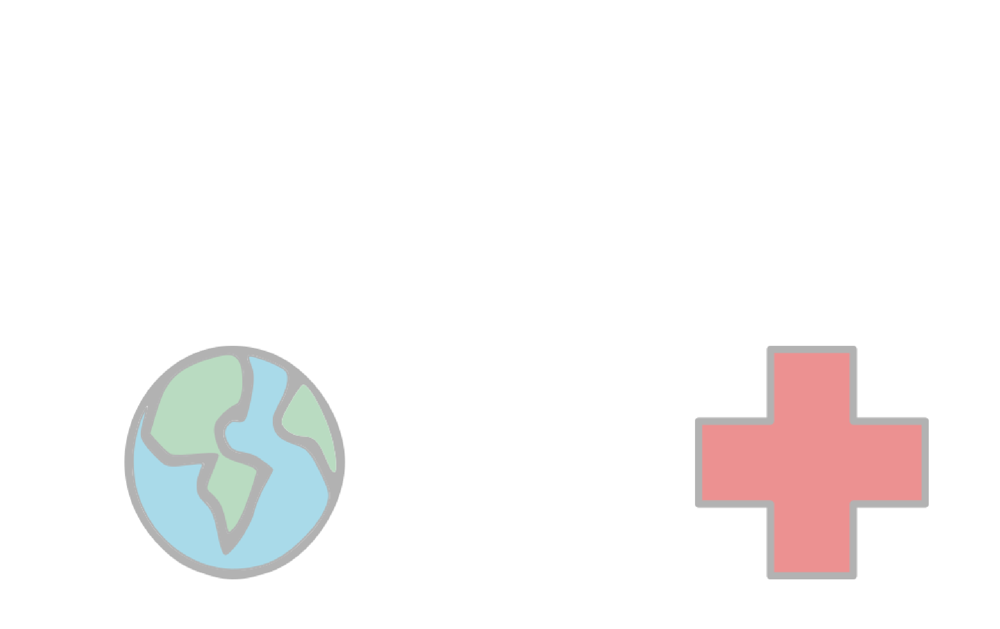]

---

count: false

## Why climate _and_ health?

.center[]

--

.conclusion[Tackling climate change has a direct positive impact on global health. There is a strong synergy between machine learning research for climate and health.]

---

## Outline

--

- [Machine learning for scientific discoveries to tackle climate and health challenges](#mlforscience)

--
- [Gentle introduction to GFlowNets and overview of contributions](#gflownets)

--
- [Crystal-GFN: materials discovery](#crystal-gfn)

--
- [Multi-fidelity active learning: drug and materials discovery](#mfal)

---

count: false
name: mlforscience
class: title, middle

### Machine learning for scientific discoveries

.center[]

---

## Why scientific discovery?
### The potential on sustainability

.context["The time for action is now"]

--

> "Limiting global warming will require major transitions in the energy sector. This will involve a substantial reduction in fossil fuel use, widespread electrification, .highlight1[improved energy efficiency, and use of alternative fuels (such as hydrogen)]." .cite[IPCC Sixth Assessment Report, 2022]

> "Reducing industry emissions will entail coordinated action throughout value chains to promote all mitigation options, including demand management, .highlight1[energy and materials efficiency, circular material flows]." .cite[IPCC Sixth Assessment Report, 2022]

--

 

.conclusion[Mitigation of the climate crisis requires innovation in the materials sector.]

???

Antimicrobial resistance

- https://www.who.int/news-room/fact-sheets/detail/antimicrobial-resistance
- https://www.who.int/news-room/feature-stories/detail/donors-making-a-difference--climate-change-and-its-impact-on-health
- https://www.who.int/news/item/31-10-2022-who-and-wmo-launch-a-new-knowledge-platform-for-climate-and-health
- https://www.who.int/news/item/08-02-2024-who-medically-important-antimicrobial-list-2024
- https://cdn.who.int/media/docs/default-source/gcp/who-mia-list-2024-lv.pdf?sfvrsn=3320dd3d_2
- https://www.who.int/publications/i/item/9789240047655

---

## Why scientific discovery?
### The potential on health

.context[Drug discovery and vaccine development play a crucial role in modern healthcare systems.]

.right-column-33[
.center[]
]

---

count: false

## Why scientific discovery?
### The potential on health

.context[Drug discovery and vaccine development play a crucial role in modern healthcare systems.]

.right-column-33[
.center[]
]

.left-column-66[
.highlight1[Bacterial antimicrobial resistance] contributed to 4.95 million deaths in 2019. .cite[World Health Organisation (WHO), 2023]

The World Bank estimates that antimicrobial resistance could result in .highlight1[one _trillion_ USD additional healthcare costs] by 2050.

WHO's latest annual review identified 27 antibiotics in clinical development that address WHO bacterial priority pathogens, of which .highlight1[only 6 were classified as innovative].
]

---

count: false

## Why scientific discovery?
### The potential on health

.context[Drug discovery and vaccine development play a crucial role in modern healthcare systems.]

.right-column-33[
.center[
<figure>
	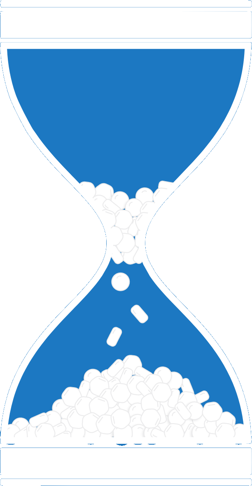
  <figcaption><small>"No time to wait". Source: <a href="https://www.who.int/docs/default-source/documents/no-time-to-wait-securing-the-future-from-drug-resistant-infections-en.pdf">WHO</a>.</small></figcaption>
</figure>
]
]

.left-column-66[
.highlight1[Bacterial antimicrobial resistance] contributed to 4.95 million deaths in 2019. .cite[World Health Organisation (WHO), 2023]

The World Bank estimates that antimicrobial resistance could result in .highlight1[one _trillion_ USD additional healthcare costs] by 2050.

WHO's latest annual review identified 27 antibiotics in clinical development that address WHO bacterial priority pathogens, of which .highlight1[only 6 were classified as innovative].
]

.full-width[
.conclusion["No time to wait". Alongside other necessary actions, drug discovery plays a key role in tackling the antimicrobial resistance global threat.]
]

---

## Traditional discovery cycle

.context35[The climate crisis demands accelerating scientific discoveries.]

--

.right-column-66[ .center[]]

.left-column-33[
 
The .highlight1[traditional pipeline] for scientific discovery:
* relies on .highlight1[highly specialised human expertise],
* it is .highlight1[time-consuming] and
* .highlight1[financially and computationally expensive].
]

---

count: false

## Machine learning in the loop

.context35[The traditional scientific discovery loop is too slow for certain applications.]

.right-column-66[ .center[]]

.left-column-33[
 
A .highlight1[machine learning model] can be:
* trained with data from _real-world_ experiments and
]

---

count: false

## Machine learning in the loop

.context35[The traditional scientific discovery loop is too slow for certain applications.]

.right-column-66[ .center[]]

.left-column-33[
 
A .highlight1[machine learning model] can be:
* trained with data from _real-world_ experiments and
* used to quickly and cheaply evaluate queries
]

---

count: false

## Machine learning in the loop

.context35[The traditional scientific discovery loop is too slow for certain applications.]

.right-column-66[ .center[]]

.left-column-33[
 
A .highlight1[machine learning model] can be:
* trained with data from _real-world_ experiments and
* used to quickly and cheaply evaluate queries

.conclusion[There are infinitely many conceivable materials, $10^{180}$ potentially stable and $10^{60}$ drug molecules. Are predictive models enough?]
]

---

count: false

## _Generative_ machine learning in the loop

.right-column-66[ .center[]]

.left-column-33[
 
.highlight1[Generative machine learning] can:
* .highlight1[learn structure] from the available data,
* .highlight1[generalise] to unexplored regions of the search space and
* .highlight1[build better queries]
]

---

count: false

## _Generative_ machine learning in the loop

.right-column-66[ .center[]]

.left-column-33[
 
.highlight1[Generative machine learning] can:
* .highlight1[learn structure] from the available data,
* .highlight1[generalise] to unexplored regions of the search space and
* .highlight1[build better queries]

.conclusion[Active learning with generative machine learning can in theory more efficiently explore the candidate space.]
]

---

count: false
name: title
class: title, middle

### The challenges of scientific discoveries

.center[]
.center[]

---

## An intuitive trivial problem

.highlight1[Problem]: find one arrangement of Tetris pieces on the board that minimise the empty space.

.left-column-33[
.center[]
]

.right-column-66[
.center[]
]

--

.full-width[.center[
<figure>
  
<figcaption>Score: 12</figcaption>
</figure>
]]

---

count: false

## An intuitive ~~trivial~~ easy problem

.highlight1[Problem]: find .highlight2[all] the arrangements of Tetris pieces on the board that minimise the empty space.

.left-column-33[
.center[]
]

.right-column-66[
.center[]
]

--

.full-width[.center[

  

  <figure>
      
    <figcaption>12</figcaption>
  </figure>
  

  

  <figure>
      
    <figcaption>12</figcaption>
  </figure>
  

  

  <figure>
      
    <figcaption>12</figcaption>
  </figure>
  

  

  <figure>
      
    <figcaption>12</figcaption>
  </figure>
  

  

  <figure>
      
    <figcaption>12</figcaption>
  </figure>
  

]]

---

count: false

## An intuitive ~~easy~~ hard problem

.highlight1[Problem]: find .highlight2[all] the arrangements of Tetris pieces on the board that minimise the empty space.

.left-column-33[
.center[]
]

.right-column-66[
.center[]
]

--

.full-width[.center[

  

  <figure>
      
  </figure>
  

  

  <figure>
      
  </figure>
  

  

  <figure>
      
  </figure>
  

  

  <figure>
      
  </figure>
  

  

  <figure>
      
  </figure>
  

]]

---

count: false

## An incredibly ~~intuitive easy~~ hard problem

.highlight1[Problem]: find .highlight2[all] the arrangements of Tetris pieces on the board that .highlight2[optimise an unknown function].

.left-column-33[
.center[]
]

.right-column-66[
.center[]
]

--

.full-width[.center[

  

  <figure>
      
  </figure>
  

  

  <figure>
      
  </figure>
  

  

  <figure>
      
  </figure>
  

  

  <figure>
      
  </figure>
  

  

  <figure>
      
  </figure>
  

]]

---

count: false

## An incredibly ~~intuitive easy~~ hard problem

.highlight1[Problem]: find .highlight2[all] the arrangements of Tetris pieces on the board that .highlight2[optimise an unknown function].

.left-column-33[
.center[]
]

.right-column-66[
.center[]
]

.full-width[.conclusion[Materials and drug discovery involve finding candidates with rare properties from combinatorially or infinitely many options.]]

---

## Why Tetris for scientific discovery?

.context35[The "Tetris problem" involves .highlight1[sampling from an unknown distribution] in a .highlight1[discrete, high-dimensional, combinatorially large space].]

---

count: false

## Why Tetris for scientific discovery?
### Biological sequence design

 
Proteins, antimicrobial peptides (AMP) and DNA can be represented as sequences of amino acids or nucleobases. There are $22^{100} \approx 10^{134}$ protein sequences with 100 amino acids.

.context35[The "Tetris problem" involves sampling from an unknown distribution in a discrete, high-dimensional, combinatorially large space]

.center[]

--

.left-column-66[
.dnag[`G`].dnaa[`A`].dnag[`G`].dnag[`G`].dnag[`G`].dnac[`C`].dnag[`G`].dnaa[`A`].dnac[`C`].dnag[`G`].dnag[`G`].dnat[`T`].dnaa[`A`].dnac[`C`].dnag[`G`].dnag[`G`].dnaa[`A`].dnag[`G`].dnac[`C`].dnat[`T`].dnac[`C`].dnat[`T`].dnag[`G`].dnac[`C`].dnat[`T`].dnac[`C`].dnac[`C`].dnag[`G`].dnat[`T`].dnat[`T`].dnaa[`A`] 
.dnat[`T`].dnac[`C`].dnaa[`A`].dnac[`C`].dnac[`C`].dnat[`T`].dnac[`C`].dnac[`C`].dnac[`C`].dnag[`G`].dnaa[`A`].dnag[`G`].dnac[`C`].dnaa[`A`].dnaa[`A`].dnat[`T`].dnaa[`A`].dnag[`G`].dnat[`T`].dnat[`T`].dnag[`G`].dnat[`T`].dnaa[`A`].dnag[`G`].dnag[`G`].dnac[`C`].dnaa[`A`].dnag[`G`].dnac[`C`].dnag[`G`].dnat[`T`].dnac[`C`].dnac[`C`].dnat[`T`].dnaa[`A`].dnac[`C`].dnac[`C`].dnag[`G`].dnat[`T`].dnat[`T`].dnac[`C`].dnag[`G`] 
.dnac[`C`].dnat[`T`].dnaa[`A`].dnac[`C`].dnag[`G`].dnac[`C`].dnag[`G`].dnat[`T`].dnac[`C`].dnat[`T`].dnac[`C`].dnat[`T`].dnat[`T`].dnat[`T`].dnac[`C`].dnag[`G`].dnag[`G`].dnag[`G`].dnag[`G`].dnag[`G`].dnat[`T`].dnat[`T`].dnaa[`A`] 
.dnat[`T`].dnat[`T`].dnag[`G`].dnac[`C`].dnaa[`A`].dnag[`G`].dnaa[`A`].dnag[`G`].dnag[`G`].dnat[`T`].dnat[`T`].dnaa[`A`].dnaa[`A`].dnac[`C`].dnag[`G`].dnac[`C`].dnag[`G`].dnac[`C`].dnaa[`A`].dnat[`T`].dnag[`G`].dnac[`C`].dnag[`G`].dnaa[`A`].dnac[`C`].dnat[`T`].dnag[`G`].dnag[`G`].dnag[`G`].dnag[`G`].dnat[`T`].dnat[`T`].dnaa[`A`].dnag[`G`].dnat[`T`].dnaa[`A`].dnag[`G`].dnat[`T`].dnac[`C`].dnag[`G`].dnaa[`A`].dnaa[`A`].dnac[`C`].dnaa[`A`].dnat[`T`].dnaa[`A`].dnat[`T`].dnaa[`A`].dnat[`T`].dnat[`T`].dnag[`G`].dnaa[`A`].dnat[`T`].dnaa[`A`].dnaa[`A`].dnaa[`A`].dnac[`C`].dnaa[`A`] 
.dnag[`G`].dnac[`C`].dnat[`T`].dnac[`C`].dnag[`G`].dnac[`C`].dnat[`T`].dnat[`T`].dnaa[`A`].dnag[`G`].dnag[`G`].dnag[`G`].dnac[`C`].dnac[`C`].dnat[`T`].dnac[`C`].dnag[`G`].dnaa[`A`].dnac[`C`].dnat[`T`].dnac[`C`].dnac[`C`].dnat[`T`].dnac[`C`].dnat[`T`].dnag[`G`].dnaa[`A`].dnaa[`A`].dnat[`T`].dnag[`G`].dnag[`G`].dnaa[`A`].dnag[`G`].dnat[`T`].dnag[`G`].dnat[`T`].dnat[`T`].dnac[`C`].dnaa[`A`].dnat[`T`].dnac[`C`].dnag[`G`].dnaa[`A`].dnaa[`A`].dnat[`T`].dnag[`G`].dnag[`G`].dnaa[`A`].dnag[`G`].dnat[`T`].dnag[`G`] 
]

---

## Why Tetris for scientific discovery?
### Molecular generation

.context35[The "Tetris problem" involves sampling from an unknown distribution in a discrete, high-dimensional, combinatorially large space]

 
Small molecules can also be represented as sequences or by a combination of of higher-level fragments. There may be about $10^{60}$ drug-like molecules.

--

.columns-3-left[
.center[

`CC(=O)NCCC1=CNc2c1cc(OC)cc2
CC(=O)NCCc1c[nH]c2ccc(OC)cc12`
]]

.columns-3-center[
.center[

`OCCc1c(C)[n+](cs1)Cc2cnc(C)nc2N`
]]

.columns-3-right[
.center[

`CN1CCC[C@H]1c2cccnc2`
]]

---

## Machine learning for scientific discovery
### Challenges and limitations of existing methods

--

.highlight1[Challenge]: very large and high-dimensional search spaces.

--

&rarr; Need for .highlight2[efficient search and generalisation] of underlying structure.

--

.highlight1[Challenge]: underspecification of objective functions or metrics.

--

&rarr; Need for .highlight2[diverse] candidates.

--

.highlight1[Limitation]: Reinforcement learning excels at optimisation in complex spaces but tends to lack diversity.

--
.highlight1[Limitation]: Markov chain Monte Carlo (MCMC) can _sample_ from a distribution (diversity) but struggles at mode mixing in high dimensions.

--

&rarr; Need to .highlight2[combine all of the above]: sampling from complex, high-dimensional distributions.

--

.conclusion[Generative flow networks (GFlowNets) address these challenges.]

---

count: false
name: gflownets
class: title, middle

### A gentle introduction to GFlowNets

.center[]

---

## GFlowNets for science
### 3 key ingredients

.context[Materials and drug discovery involve .highlight1[sampling from unknown distributions] in .highlight1[discrete or mixed, high-dimensional, combinatorially large spaces.]]

--

  

1. .highlight1[Diversity] as an objective.

--
    - Given a score or reward function $R(x)$, learn to _sample proportionally to the reward_.
--
2. .highlight1[Compositionality] in the sample generation.

--
    - A meaningful decomposition of samples $x$ into multiple sub-states $s_0\rightarrow s_1 \rightarrow \dots \rightarrow x$ can yield generalisable patterns.
--
3. .highlight1[Deep learning] to learn from the generated samples.

--
    - A machine learning model can learn the transition function $F(s\rightarrow s')$ and generalise the patterns.

---

## 1. Diversity as an objective

.context[Many existing approaches treat scientific discovery as an _optimisation_ problem.]

 
Given a reward or objective function $R(x)$, GFlowNet can be seen a generative model trained to sample objects $x \in \cal X$ according to .highlight1[a sampling policy $\pi(x)$ proportional to the reward $R(x)$]: 

--

.left-column[
$$\pi(x) = \frac{R(x)}{Z} \propto R(x)$$
]

--

.right-column[
$$Z = \sum_{x' \in \cal X} R(x')$$
]

--

.full-width[
.center[

]]

---

count: false

## 1. Diversity as an objective

.context[Many existing approaches treat scientific discovery as an _optimisation_ problem.]

 
Given a reward or objective function $R(x)$, GFlowNet can be seen a generative model trained to sample objects $x \in \cal X$ according to .highlight1[a sampling policy $\pi(x)$ proportional to the reward $R(x)$]: 

.left-column[
$$\pi(x) = \frac{R(x)}{Z} \propto R(x)$$
]

.right-column[
$$Z = \sum_{x' \in \cal X} R(x')$$
]

.full-width[
&rarr; Sampling proportionally to the reward function enables finding .highlight1[multiple modes], hence .highlight1[diversity].

.center[]
]

---

## 2. Compositionality
### Sample generation process

.context35[Sampling _directly_ from a complex, high-dimensional distribution is difficult.]

The principle of compositionality is fundamental in semantics, linguistics, mathematical logic and is thought to be a cornerstone of human reasoning.

---

count: false

## 2. Compositionality
### Sample generation process

.context35[Sampling _directly_ from a complex, high-dimensional distribution is difficult.]

For the Tetris problem, a meaningful decomposition of the samples is .highlight1[adding one piece to the board at a time].

--

.left-column[.center[]]

---

count: false

## 2. Compositionality
### Sample generation process

.context35[Sampling _directly_ from a complex, high-dimensional distribution is difficult.]

For the Tetris problem, a meaningful decomposition of the samples is .highlight1[adding one piece to the board at a time].

.left-column[.center[]]

---

count: false

## 2. Compositionality
### Sample generation process

.context35[Sampling _directly_ from a complex, high-dimensional distribution is difficult.]

For the Tetris problem, a meaningful decomposition of the samples is .highlight1[adding one piece to the board at a time].

.left-column[.center[]]

---

count: false

## 2. Compositionality
### Sample generation process

.context35[Sampling _directly_ from a complex, high-dimensional distribution is difficult.]

For the Tetris problem, a meaningful decomposition of the samples is .highlight1[adding one piece to the board at a time].

.left-column[.center[]]

---

count: false

## 2. Compositionality
### Sample generation process

.context35[Sampling _directly_ from a complex, high-dimensional distribution is difficult.]

For the Tetris problem, a meaningful decomposition of the samples is .highlight1[adding one piece to the board at a time].

.left-column[.center[]]

---

count: false

## 2. Compositionality
### Sample generation process

.context35[Sampling _directly_ from a complex, high-dimensional distribution is difficult.]

For the Tetris problem, a meaningful decomposition of the samples is .highlight1[adding one piece to the board at a time].

.left-column[.center[]]

---

count: false

## 2. Compositionality
### Sample generation process

.context35[Sampling _directly_ from a complex, high-dimensional distribution is difficult.]

For the Tetris problem, a meaningful decomposition of the samples is .highlight1[adding one piece to the board at a time].

.left-column[.center[]]

---

count: false

## 2. Compositionality
### Sample generation process

.context35[Sampling _directly_ from a complex, high-dimensional distribution is difficult.]

For the Tetris problem, a meaningful decomposition of the samples is .highlight1[adding one piece to the board at a time].

.left-column[.center[]]

---

count: false

## 2. Compositionality
### Sample generation process

.context35[Sampling _directly_ from a complex, high-dimensional distribution is difficult.]

For the Tetris problem, a meaningful decomposition of the samples is .highlight1[adding one piece to the board at a time].

.left-column[.center[]]

---

count: false

## 2. Compositionality
### Sample generation process

.context35[Sampling _directly_ from a complex, high-dimensional distribution is difficult.]

For the Tetris problem, a meaningful decomposition of the samples is .highlight1[adding one piece to the board at a time].

.left-column[.center[]]

---

count: false

## 2. Compositionality
### Sample generation process

.context35[Sampling _directly_ from a complex, high-dimensional distribution is difficult.]

For the Tetris problem, a meaningful decomposition of the samples is .highlight1[adding one piece to the board at a time].

.left-column[.center[]]

---

count: false

## 2. Compositionality
### Sample generation process

.context35[Sampling _directly_ from a complex, high-dimensional distribution is difficult.]

For the Tetris problem, a meaningful decomposition of the samples is .highlight1[adding one piece to the board at a time].

.left-column[.center[]]

---

count: false

## 2. Compositionality
### Sample generation process

.context35[Sampling _directly_ from a complex, high-dimensional distribution is difficult.]

For the Tetris problem, a meaningful decomposition of the samples is .highlight1[adding one piece to the board at a time].

.left-column[.center[]]

---

count: false

## 2. Compositionality
### Sample generation process

.context35[Sampling _directly_ from a complex, high-dimensional distribution is difficult.]

For the Tetris problem, a meaningful decomposition of the samples is .highlight1[adding one piece to the board at a time].

.left-column[.center[]]

---

count: false

## 2. Compositionality
### Sample generation process

.context35[Sampling _directly_ from a complex, high-dimensional distribution is difficult.]

For the Tetris problem, a meaningful decomposition of the samples is .highlight1[adding one piece to the board at a time].

.left-column[.center[]]

---

count: false

## 2. Compositionality
### Sample generation process

.context35[Sampling _directly_ from a complex, high-dimensional distribution is difficult.]

For the Tetris problem, a meaningful decomposition of the samples is .highlight1[adding one piece to the board at a time].

.left-column[.center[]]

---

count: false

## 2. Compositionality
### Sample generation process

.context35[Sampling _directly_ from a complex, high-dimensional distribution is difficult.]

For the Tetris problem, a meaningful decomposition of the samples is .highlight1[adding one piece to the board at a time].

.left-column[.center[]]

---

count: false

## 2. Compositionality
### Sample generation process

.context35[Sampling _directly_ from a complex, high-dimensional distribution is difficult.]

For the Tetris problem, a meaningful decomposition of the samples is .highlight1[adding one piece to the board at a time].

.left-column[.center[]]

---

count: false

## 2. Compositionality
### Sample generation process

.context35[Sampling _directly_ from a complex, high-dimensional distribution is difficult.]

For the Tetris problem, a meaningful decomposition of the samples is .highlight1[adding one piece to the board at a time].

.left-column[.center[]]

---

count: false

## 2. Compositionality
### Sample generation process

.context35[Sampling _directly_ from a complex, high-dimensional distribution is difficult.]

For the Tetris problem, a meaningful decomposition of the samples is .highlight1[adding one piece to the board at a time].

.left-column[.center[]]

---

count: false

## 2. Compositionality
### Sample generation process

.context35[Sampling _directly_ from a complex, high-dimensional distribution is difficult.]

For the Tetris problem, a meaningful decomposition of the samples is .highlight1[adding one piece to the board at a time].

.left-column[.center[]]

---

count: false

## 2. Compositionality
### Sample generation process

.context35[Sampling _directly_ from a complex, high-dimensional distribution is difficult.]

For the Tetris problem, a meaningful decomposition of the samples is .highlight1[adding one piece to the board at a time].

.left-column[.center[]]

---

count: false

## 2. Compositionality
### Sample generation process

.context35[Sampling _directly_ from a complex, high-dimensional distribution is difficult.]

For the Tetris problem, a meaningful decomposition of the samples is .highlight1[adding one piece to the board at a time].

.left-column[.center[]]

---

count: false

## 2. Compositionality
### Sample generation process

.context35[Sampling _directly_ from a complex, high-dimensional distribution is difficult.]

For the Tetris problem, a meaningful decomposition of the samples is .highlight1[adding one piece to the board at a time].

.left-column[.center[]]

---

count: false

## 2. Compositionality
### Sample generation process

.context35[Sampling _directly_ from a complex, high-dimensional distribution is difficult.]

For the Tetris problem, a meaningful decomposition of the samples is .highlight1[adding one piece to the board at a time].

.left-column[.center[]]

---

count: false

## 2. Compositionality
### Sample generation process

.context35[Sampling _directly_ from a complex, high-dimensional distribution is difficult.]

For the Tetris problem, a meaningful decomposition of the samples is .highlight1[adding one piece to the board at a time].

.left-column[.center[]]

.right-column[
  
.conclusion[The decomposition of the sampling process into meaningful steps yields patterns that may be correlated with the reward function and facilitates learning complex distributions.]
]

---

count: false

## 2. Compositionality
### Sample generation process

.context35[Sampling _directly_ from a complex, high-dimensional distribution is difficult.]

For the Tetris problem, a meaningful decomposition of the samples is .highlight1[adding one piece to the board at a time].

.left-column[.center[]]

.right-column[
Objects $x \in \cal X$ are constructed through a sequence of actions from an .highlight1[action space $\cal A$].
]

.right-column[
At each step of the .highlight1[trajectory $\tau=(s_0\rightarrow s_1 \rightarrow \dots \rightarrow s_f)$], we get a partially constructed object $s$ in .highlight1[state space $\cal S$].
]

--

.right-column[
.conclusion[These ideas and terminology is reminiscent of reinforcement learning (RL).]
]

---

## 3. Deep learning policy

.context35[GFlowNets learn a sampling policy $\pi\_{\theta}(x)$ proportional to the reward $R(x)$.]

--

.left-column[
.center[]
]

---

count: false

## 3. Deep learning policy

.context35[GFlowNets learn a sampling policy $\pi\_{\theta}(x)$ proportional to the reward $R(x)$.]

.left-column[
.center[]
]

.right-column[
 
Deep neural networks are trained to learn the transitions (flows) policy: $F\_{\theta}(s\_t\rightarrow s\_{t+1})$.
]

--

.right-column[
Consistent flow theorem (informal): if the sum of the flows into state $s$ is equal to the sum of the flows out, then $\pi(x) \propto R(x)$.
]

.references[
Bengio et al. [Flow network based generative models for non-iterative diverse candidate generation](https://arxiv.org/abs/2106.04399), NeurIPS, 2021. (_not_ co-authored)
]

--

.right-column[
.conclusion[GFlowNets can be trained with deep learning methods to learn a sampling policy $\pi\_{\theta}$ proportional to a reward $R(x)$.]
]

---

##  Contributions to GFlowNets extensions and applications

---

count: false

##  Contributions to GFlowNets extensions and applications
### Multi-objective GFlowNets

Extension of GFlowNets to handle multi-objective optimisation and not only cover the Pareto front but also sample diverse objects at each point in the Pareto front.

.center[]

.references[
Jain et al. [Multi-Objective GFlowNets](https://arxiv.org/abs/2210.12765), ICML, 2023. .highlight2[(co-authored)]
]

---

##  Contributions to GFlowNets extensions and applications
### Continuous GFlowNets

Generalisation of the theory and implementation of GFlowNets to encompass both discrete and continuous or hybrid state spaces. 

.center[]

.references[
Lahlou et al. [A Theory of Continuous Generative Flow Networks](https://arxiv.org/abs/2301.12594), ICML, 2023. .highlight2[(co-authored)]
]

---

##  Contributions to GFlowNets extensions and applications
### Molecular conformation generation

A continuous GFlowNets algorithm for sampling conformations of small molecules from the Boltzmann distribution, as determined by the molecule’s energy.

.references[
Volokhova, Koziarski et al. [Towards equilibrium molecular conformation generation with GFlowNets](https://arxiv.org/abs/2310.14782), Digital Discovery, 2024. .highlight2[(co-authored)]
]

.center[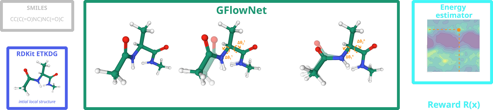]

---

##  Contributions to GFlowNets extensions and applications
### Biological sequence design

An active learning algorithm with GFlowNets as a sampler of biological sequence design (DNA, antimicrobial peptides, proteins) with desirable properties.

.center[]

.left-column-66[
.dnag[`G`].dnaa[`A`].dnag[`G`].dnag[`G`].dnag[`G`].dnac[`C`].dnag[`G`].dnaa[`A`].dnac[`C`].dnag[`G`].dnag[`G`].dnat[`T`].dnaa[`A`].dnac[`C`].dnag[`G`].dnag[`G`].dnaa[`A`].dnag[`G`].dnac[`C`].dnat[`T`].dnac[`C`].dnat[`T`].dnag[`G`].dnac[`C`].dnat[`T`].dnac[`C`].dnac[`C`].dnag[`G`].dnat[`T`].dnat[`T`].dnaa[`A`] 
.dnat[`T`].dnac[`C`].dnaa[`A`].dnac[`C`].dnac[`C`].dnat[`T`].dnac[`C`].dnac[`C`].dnac[`C`].dnag[`G`].dnaa[`A`].dnag[`G`].dnac[`C`].dnaa[`A`].dnaa[`A`].dnat[`T`].dnaa[`A`].dnag[`G`].dnat[`T`].dnat[`T`].dnag[`G`].dnat[`T`].dnaa[`A`].dnag[`G`].dnag[`G`].dnac[`C`].dnaa[`A`].dnag[`G`].dnac[`C`].dnag[`G`].dnat[`T`].dnac[`C`].dnac[`C`].dnat[`T`].dnaa[`A`].dnac[`C`].dnac[`C`].dnag[`G`].dnat[`T`].dnat[`T`].dnac[`C`].dnag[`G`] 
.dnac[`C`].dnat[`T`].dnaa[`A`].dnac[`C`].dnag[`G`].dnac[`C`].dnag[`G`].dnat[`T`].dnac[`C`].dnat[`T`].dnac[`C`].dnat[`T`].dnat[`T`].dnat[`T`].dnac[`C`].dnag[`G`].dnag[`G`].dnag[`G`].dnag[`G`].dnag[`G`].dnat[`T`].dnat[`T`].dnaa[`A`] 
.dnat[`T`].dnat[`T`].dnag[`G`].dnac[`C`].dnaa[`A`].dnag[`G`].dnaa[`A`].dnag[`G`].dnag[`G`].dnat[`T`].dnat[`T`].dnaa[`A`].dnaa[`A`].dnac[`C`].dnag[`G`].dnac[`C`].dnag[`G`].dnac[`C`].dnaa[`A`].dnat[`T`].dnag[`G`].dnac[`C`].dnag[`G`].dnaa[`A`].dnac[`C`].dnat[`T`].dnag[`G`].dnag[`G`].dnag[`G`].dnag[`G`].dnat[`T`].dnat[`T`].dnaa[`A`].dnag[`G`].dnat[`T`].dnaa[`A`].dnag[`G`].dnat[`T`].dnac[`C`].dnag[`G`].dnaa[`A`].dnaa[`A`].dnac[`C`].dnaa[`A`].dnat[`T`].dnaa[`A`].dnat[`T`].dnaa[`A`].dnat[`T`].dnat[`T`].dnag[`G`].dnaa[`A`].dnat[`T`].dnaa[`A`].dnaa[`A`].dnaa[`A`].dnac[`C`].dnaa[`A`] 
.dnag[`G`].dnac[`C`].dnat[`T`].dnac[`C`].dnag[`G`].dnac[`C`].dnat[`T`].dnat[`T`].dnaa[`A`].dnag[`G`].dnag[`G`].dnag[`G`].dnac[`C`].dnac[`C`].dnat[`T`].dnac[`C`].dnag[`G`].dnaa[`A`].dnac[`C`].dnat[`T`].dnac[`C`].dnac[`C`].dnat[`T`].dnac[`C`].dnat[`T`].dnag[`G`].dnaa[`A`].dnaa[`A`].dnat[`T`].dnag[`G`].dnag[`G`].dnaa[`A`].dnag[`G`].dnat[`T`].dnag[`G`].dnat[`T`].dnat[`T`].dnac[`C`].dnaa[`A`].dnat[`T`].dnac[`C`].dnag[`G`].dnaa[`A`].dnaa[`A`].dnat[`T`].dnag[`G`].dnag[`G`].dnaa[`A`].dnag[`G`].dnat[`T`].dnag[`G`] 
]

.references[
Jain et al. [Biological Sequence Design with GFlowNets](https://arxiv.org/abs/2203.04115), ICML, 2022. .highlight2[(co-authored)]
]

---

##  Contributions to GFlowNets extensions and applications
### Review paper

A review of the potential of GFlowNets for AI-driven scientific discoveries.

.center[]

.references[
Jain et al. [GFlowNets for AI-Driven Scientific Discovery](https://pubs.rsc.org/en/content/articlelanding/2023/dd/d3dd00002h). Digital Discovery, Royal Society of Chemistry, 2023. .highlight2[(co-authored)]
]

---

## GFlowNet Python package

I have led the development of an open sourced GFlowNet package, together with Mila collaborators: Nikita Saxena, Alexandra Volokhova, Michał Koziarski, Divya Sharma, Pierre Luc Carrier, Victor Schmidt, Joseph Viviano.

.highlight2[Open source GFlowNet implementation]: [github.com/alexhernandezgarcia/gflownet](https://github.com/alexhernandezgarcia/gflownet)

--

* A key design principle is the simplicity to create new environments.
* Current environments: Tetris, hyper-grid, hyper-cube, hyper-torus, scrabble, crystals, molecules, DNA...
* Discrete and continuous environments, multiple loss functions, etc.
* Visualisation of results on WandDB

---

count: false

## GFlowNet Python package

I have led the development of an open sourced GFlowNet package, together with Mila collaborators: Nikita Saxena, Alexandra Volokhova, Michał Koziarski, Divya Sharma, Pierre Luc Carrier Victor Schmidt, Joseph Viviano.

.highlight2[Open source GFlowNet implementation]: [github.com/alexhernandezgarcia/gflownet](https://github.com/alexhernandezgarcia/gflownet)

Research articles supported by this GFlowNet package:

.smaller[
* Lahlou et al. [A Theory of Continuous Generative Flow Networks](https://arxiv.org/abs/2301.12594), ICML, 2023. 
* Hernandez-Garcia, Saxena et al. [Multi-fidelity active learning with GFlowNets](https://arxiv.org/abs/2306.11715). RealML, NeurIPS 2023.
* Mila AI4Science et al. [Crystal-GFN: sampling crystals with desirable properties and constraints](https://arxiv.org/abs/2310.04925). AI4Mat, NeurIPS 2023 (spotlight).
* Volokhova, Koziarski et al. [Towards equilibrium molecular conformation generation with GFlowNets](https://arxiv.org/abs/2310.14782). Digital Discovery, NeurIPS 2023.
* Several other ongoing projects...
]

---

count: false
name: crystal-gfn
class: title, middle

## Crystal-GFN: GFlowNets for materials discovery

Mila AI4Science: Alex Hernandez-Garcia, Alexandre Duval, Alexandra Volokhova, Yoshua Bengio, Divya Sharma, Pierre Luc Carrier, Yasmine Benabed, Michał Koziarski, Victor Schmidt, Pierre-Paul De Breuck

.smaller70[Mila AI4Science et al. [Crystal-GFN: sampling crystals with desirable properties and constraints](https://arxiv.org/abs/2310.04925). AI4Mat, NeurIPS 2023 (spotlight) / under review.]

.center[]

---

## What are crystals?

Definition: A crystal or crystalline solid is a solid material whose constituents (such as atoms, molecules, or ions) are arranged in a .highlight1[highly ordered microscopic structure], forming .highlight1[a crystal lattice that extends in all directions].

.left-column[
.center[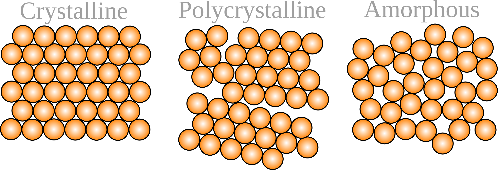]
]
.right-column[
.center[]
]

--

Here, we are concerned mainly with _inorganic crystals_, where the constituents are atoms or ions.

--

A crystal structure is characterized by its .highlight1[unit cell], a small imaginary box containing atoms in a specific spatial arrangement with certain symmetry. The unit cell repeats iself periodically in all directions.

---

## Why do we care about crystals?

.context35[Materials discovery can help reduce greenhouse gas emissions in multiple sectors.]

--

 
Many solid state materials are crystal structures and they are a core component of:

* Electrocatalysts for fuel cells, hydrogen storage, industrial chemical reactions, carbon capture, etc.
* Solid electrolytes for batteries.
* Thin film materials for photovoltaics.
* ...

--

However, .highlight1[material modelling is very challenging]:
* Limited data: only about 200 K known inorganic materials, but potentially $10^{180}$ possible stable materials (for reference: more than a billion molecules are known)
* Sparsity: .highlight2[stable materials] only exist in a low-dimensional subspace of all possible 3D arrangements.

--

.conclusion[There is a need for efficient generative models of crystal structures.]

---

## A domain-inspired approach
### Crystal structure parameters

.context[Most previous works tackle crystal structure generation in the space of atomic coordinates and struggle to preserve the symmetry properties.]

--

Instead of optimising the atom positions by learning from a small data set, we draw .highlight1[inspiration from theoretical crystallography to sample crystals in a lower-dimensional space of crystal structure parameters].

--

.highlight2[Space group]: symmetry operations of a repeating pattern in space that leave the pattern unchanged.

--

- There are 17 symmetry groups in 2 dimensions (wallpaper groups).
- There are 230 space groups in 3 dimensions.

---

count: false

## A domain-inspired approach
### Crystal structure parameters

.context[Most previous works tackle crystal structure generation in the space of atomic coordinates and struggle to preserve the symmetry properties.]

Instead of optimising the atom positions by learning from a small data set, we draw .highlight1[inspiration from theoretical crystallography to sample crystals in a lower-dimensional space of crystal structure parameters].

.highlight2[Lattice system]: all 230 space groups can be classified into one of the 7 lattices.

.center[

  

  <figure>
      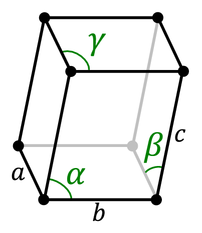
    <figcaption><small>Triclinic</small></figcaption>
  </figure>
  

  

  <figure>
      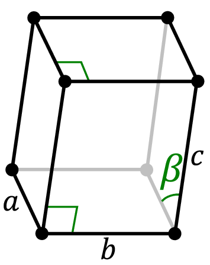
    <figcaption><small>Monoclinic</small></figcaption>
  </figure>
  

  

  <figure>
      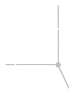
    <figcaption><small>Orthorhombic</small></figcaption>
  </figure>
  

  

  <figure>
      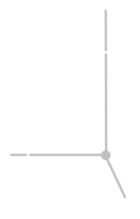
    <figcaption><small>Tetragonal</small></figcaption>
  </figure>
  

  

  <figure>
      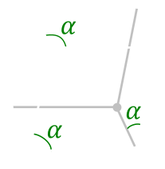
    <figcaption><small>Rhombohedral</small></figcaption>
  </figure>
  

  

  <figure>
      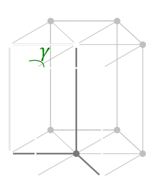
    <figcaption><small>Hexagonal</small></figcaption>
  </figure>
  

  

  <figure>
      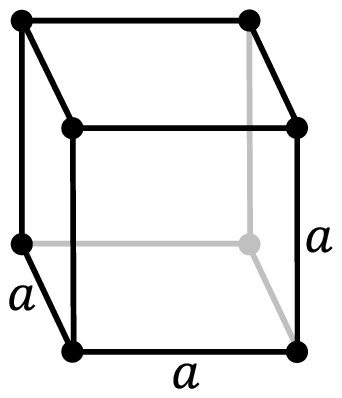
    <figcaption><small>Cubic</small></figcaption>
  </figure>
  

]

---

count: false

## A domain-inspired approach
### Crystal structure parameters

.context[Most previous works tackle crystal structure generation in the space of atomic coordinates and struggle to preserve the symmetry properties.]

Instead of optimising the atom positions by learning from a small data set, we draw .highlight1[inspiration from theoretical crystallography to sample crystals in a lower-dimensional space of crystal structure parameters].

.highlight2[Lattice parameters]: The lattice's size and shape is characterised by 6 parameters: .highlight1[$a, b, c, \alpha, \beta, \gamma$].

.center[]

---

## Crystal-GFlowNet
### Sequential generation

.center[]

---

count: false

## Crystal-GFlowNet
### Sequential generation

.center[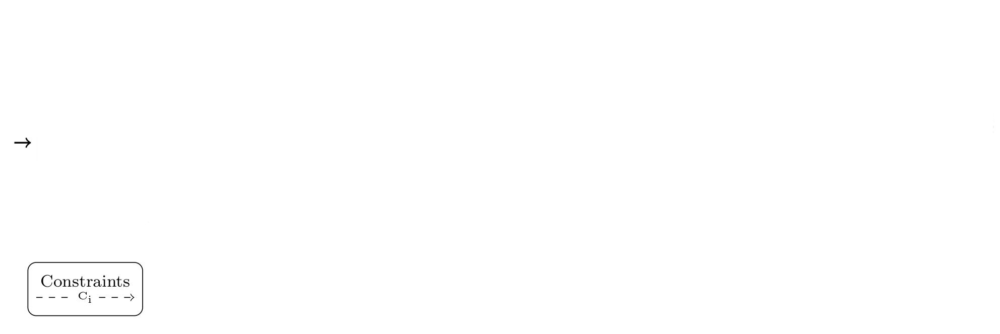]

---

count: false

## Crystal-GFlowNet
### Sequential generation

.center[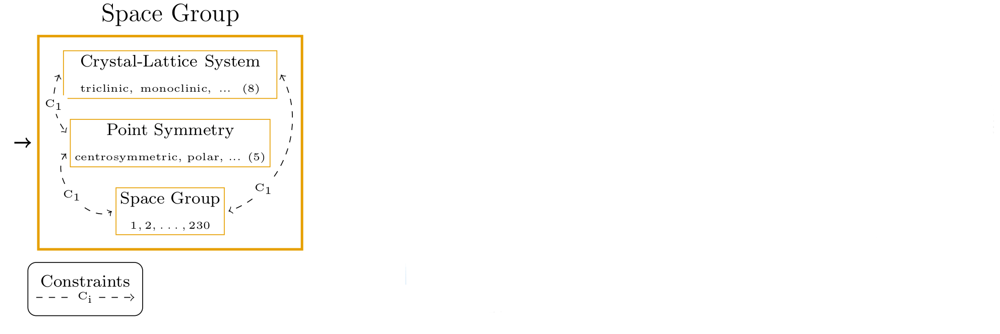]

---

count: false

## Crystal-GFlowNet
### Sequential generation

.center[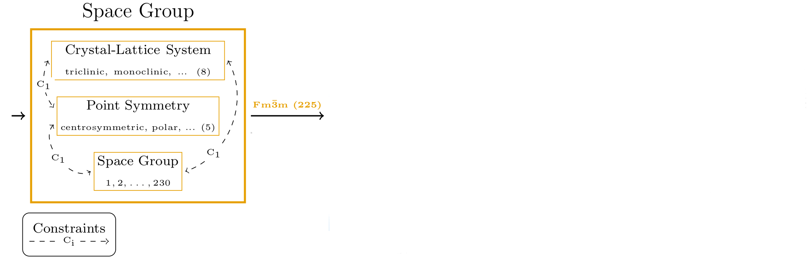]

---

count: false

## Crystal-GFlowNet
### Sequential generation

.center[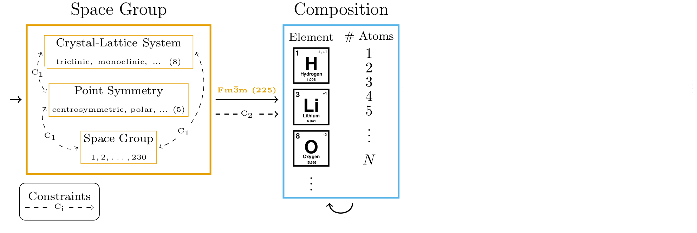]

---

count: false

## Crystal-GFlowNet
### Sequential generation

.center[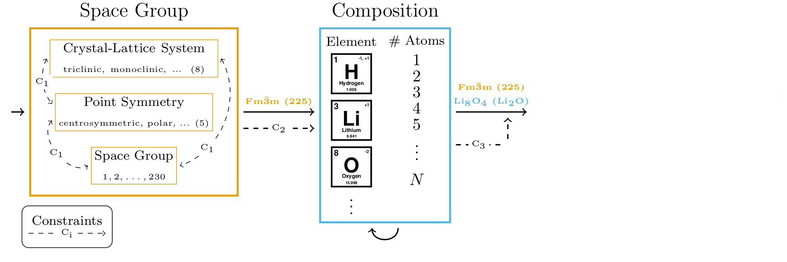]

---

count: false

## Crystal-GFlowNet
### Sequential generation

.center[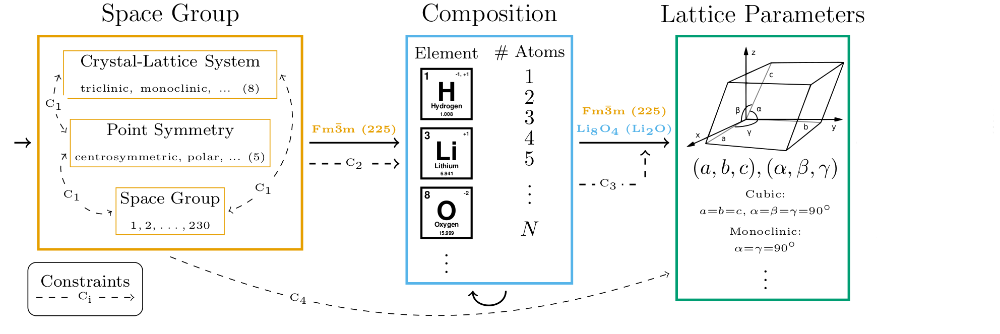]

---

count: false

## Crystal-GFlowNet
### Sequential generation

.center[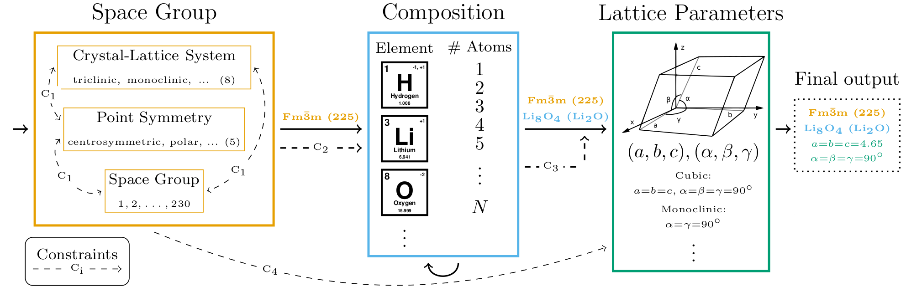]

---

count: false

## Crystal-GFlowNet
### Sequential generation

.center[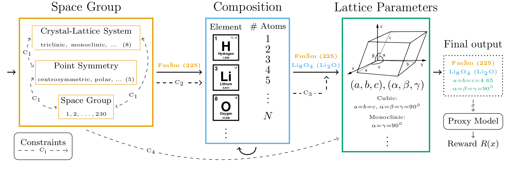]

---

count: false

## Crystal-GFlowNet
### Sequential generation

.center[]

.conclusion[Crystal-GFN binds multiple spaces representing crystallographic and material properties, setting intra- and inter-space hard constraints in the generation process.]

---

## GFlowNet approach
### Advantages

.context[We generate materials in the lower-dimensional space of crystal structure parameters.]

* Constructing materials by their crystal structure parameters allows us to introduce .highlight1[physicochemical and geometric _hard_ constraints]:
--

    * Charge neutrality of the composition.
    * Compatibility of composition and space group.
    * Hierarchical structure of the space group.
    * Compatibility of lattice parameters and lattice system.
--
* .highlight1[Searching in the lower-dimensional space] of crystal structure parameters may be more efficient than in the space of atom coordinates.

--
* Provided we have access to a predictive model of a material property, we can .highlight1[flexibly generate materials with desirable properties].

--
* We can .highlight1[flexibly sample materials with specific characteristics, such as composition or space group]. 

---

## Crystal-GFlowNet
### Material properties

We can train a Crystal-GFN with any reward function, provided it is computationally tractable. Therefore, we can use it to .highlight1[generate materials with different properties]. 
--
We have tested the following properties:

- .highlight2[Formation energy] per atom [eV/atom], via a pre-trained machine learning model: indicative of the material's stability.

--
- .highlight2[Electronic band gap] [eV] (squared distance to a target value, 1.34 eV), via a pre-trained machine learning model: relevant in photovoltaics, for instance.

--
- Unit cell .highlight2[density] [g/cm3]: convenient as a proof of concept because we can calculate it _exactly_ from the GFN outputs.

---

count: false

## Crystal-GFlowNet
### Material properties

We can train a Crystal-GFN with any reward function, provided it is computationally tractable. Therefore, we can use it to .highlight1[generate materials with different properties]. We have tested the following properties:

- .highlight2[Formation energy] per atom [eV/atom], via a pre-trained machine learning model: indicative of the material's stability.
- .highlight2[Electronic band gap] [eV] (squared distance to a target value, 1.34 eV), via a pre-trained machine learning model: relevant in photovoltaics, for instance.
- .alpha50[Unit cell .highlight2[density] [g/cm3]: convenient as a proof of concept because we can calculate it _exactly_ from the GFN outputs.]

---

## Results
### Formation energy

.context35[The formation energy correlates with stability. The lower, the better.]

.center[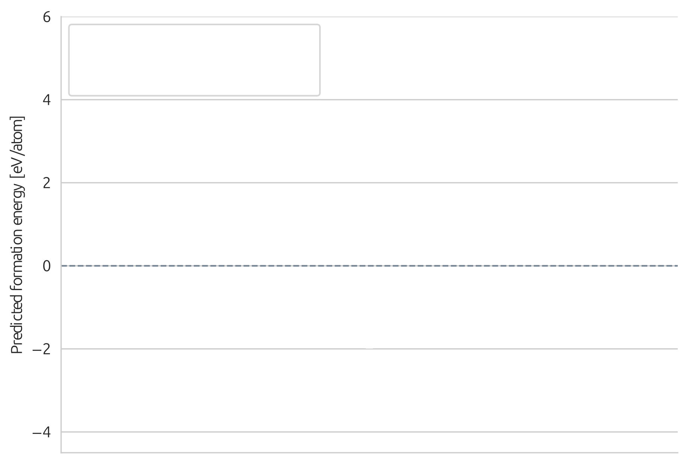]

---

count: false

## Results
### Formation energy

.context35[The formation energy correlates with stability. The lower, the better.]

.center[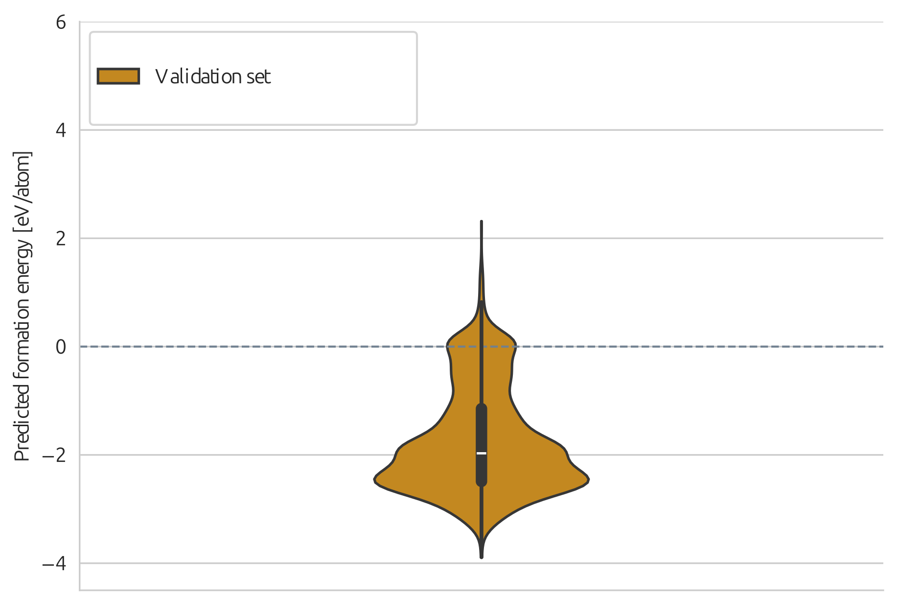]

---

count: false

## Results
### Formation energy

.context35[The formation energy correlates with stability. The lower, the better.]

.center[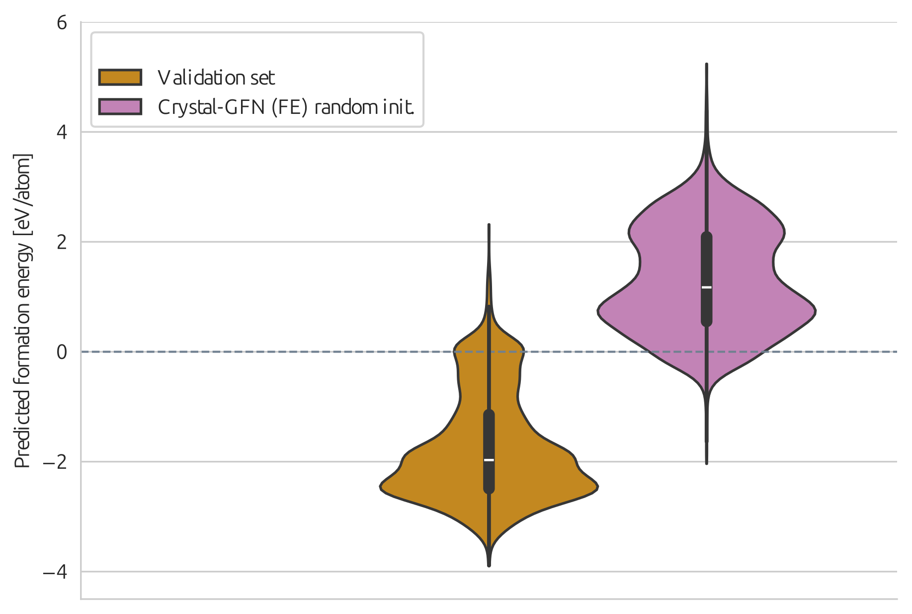]

---

count: false

## Results
### Formation energy

.context35[The formation energy correlates with stability. The lower, the better.]

.center[]

---

count: false

## Results
### Formation energy

.context[.highlight1[After training, Crystal-GFN samples structures with even lower formation energy [eV/atom] than the validation set.]]

.center[]

---

## Results
### Band gap

.context35[We aimed at sampling structures with band gap close to 1.34 eV.]

.center[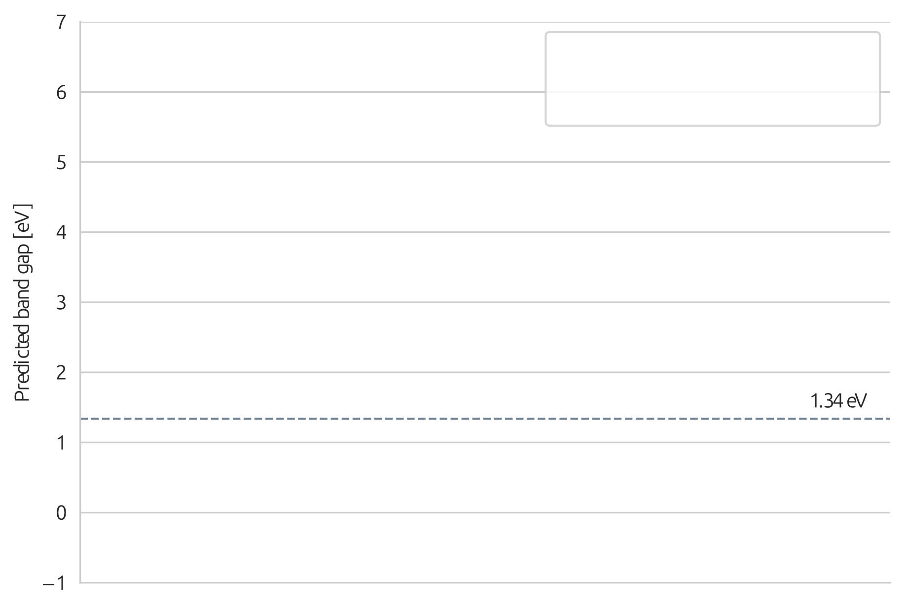]

---

count: false

## Results
### Band gap

.context35[We aimed at sampling structures with band gap close to 1.34 eV.]

.center[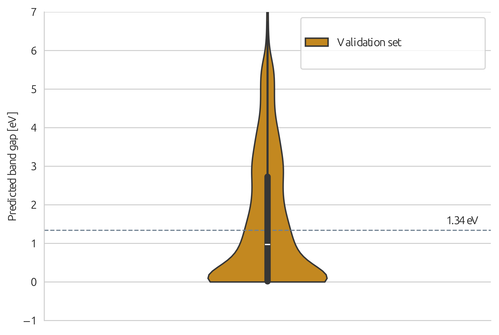]

---

count: false

## Results
### Band gap

.context35[We aimed at sampling structures with band gap close to 1.34 eV.]

.center[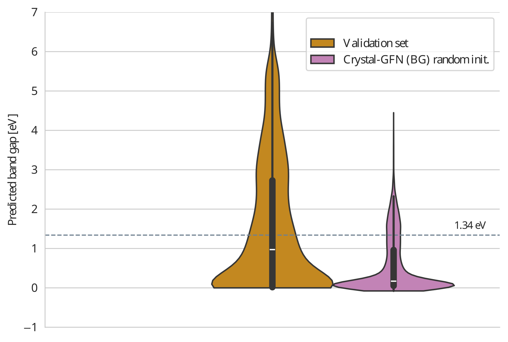]

---

count: false

## Results
### Band gap

.context35[We aimed at sampling structures with band gap close to 1.34 eV.]

.center[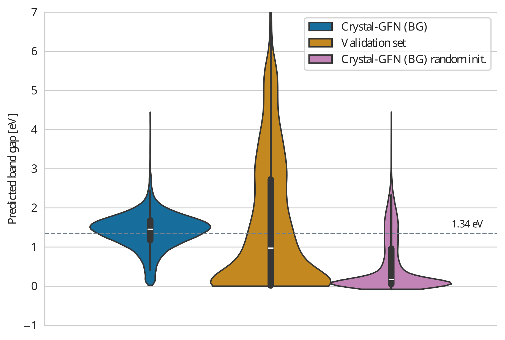]

---

count: false

## Results
### Band gap

.context[.highlight1[After training, Crystal-GFN samples structures with band gap [eV] around the target value.]]

.center[]

---

## Results
### Diversity

.context[.highlight2[Diversity] is key in materials discovery.]

Analysis of 10,000 sampled crystals and the top-100 with lowest formation energy.

--

- All 10,000 samples are unique.

--
- All crystal systems, lattice systems and point symmetries found in the 10,000 samples.
    - 4 out of 8 crystal-lattice systems in the top-100.
    - 4 out of the 5 point symmetries in the top-100.
--
- All 22 elements found in the 10,000 samples.
    - 15 out of 22 elements in the top-100.
--
- 73 out of 113 space groups (65 %) found in the 10,000 samples
    - 19 out of 113 space groups in the top-100.

--

.conclusion[Crystal-GFN samples are highly diverse.]

---

## Crystal-GFN
### Summary and conclusions

.references[
* Mila AI4Science et al. [Crystal-GFN: sampling crystals with desirable properties and constraints](https://arxiv.org/abs/2310.04925). AI4Mat, NeurIPS 2023 (spotlight).
]

* Discovering new crystal structures with desirable properties can help mitigate the climate crisis.

--
* There are infinitely many conceivable crystals. Only a few are stable. Only a few stable crystals have interesting properties. This is a really hard problem.

--
* Most methods in the literature struggle to preserve the symmetry properties of the crystals.

--
* Crystal-GFN introduces .highlight1[physicochemical and structural constraints], reducing the search space.
    * Crystal-GFN was trained in 30 hours in a CPU-only machine.
--
* Our results show that we can generate .highlight1[diverse, high scoring samples with the desired constraints].

--
* The .highlight1[framework can be flexibly extended] with more constraints, crystal structure descriptors (atomic positions) and other properties. 

---

count: false

name: mfal
class: title, middle

## Multi-fidelity active learning

Nikita Saxena, Moksh Jain, Cheng-Hao Liu, Yoshua Bengio

.smaller[[Multi-fidelity active learning with GFlowNets](https://arxiv.org/abs/2306.11715). RealML, NeurIPS 2023 / under review.]

.center[]

---

## Why multi-fidelity?

.context35[We had described the scientific discovery loop as a cycle with one single oracle.]

  
.right-column[
.center[]
]

--

.left-column[
Example: "incredibly hard" Tetris problem: find arrangements of Tetris pieces that optimise an .highlight2[unknown function $f$].
- $f$: Oracle, cost per evaluation 1000 CAD.

.center[

  

  <figure>
      
  </figure>
  

  

  <figure>
      
  </figure>
  

  

  <figure>
      
  </figure>
  

  

  <figure>
      
  </figure>
  

  

  <figure>
      
  </figure>
  

]
]

---

count: false

## Why multi-fidelity?

.context35[However, in practice, multiple oracles (models) of different fidelity and cost are available in scientific applications.]

  
.right-column[
.center[]
]

.left-column[
Example: "incredibly hard" Tetris problem: find arrangements of Tetris pieces that optimise an .highlight2[unknown function $f$].
- $f$: Oracle, cost per evaluation 1000 CAD.

.center[

  

  <figure>
      
  </figure>
  

  

  <figure>
      
  </figure>
  

  

  <figure>
      
  </figure>
  

  

  <figure>
      
  </figure>
  

  

  <figure>
      
  </figure>
  

]
]

---

count: false

## Why multi-fidelity?

.context35[However, in practice, multiple oracles (models) of different fidelity and cost are available in scientific applications.]

  
.right-column[
.center[]
]

.left-column[
Example: "incredibly hard" Tetris problem: find arrangements of Tetris pieces that optimise an .highlight2[unknown function $f$].
- $f$: Oracle, cost per evaluation 1000 CAD.
- $f\_1$: Slightly inaccurate oracle, cost 100 CAD.
- $f\_2$: Noisy but informative oracle, cost 1 CAD.

.center[

  

  <figure>
      
  </figure>
  

  

  <figure>
      
  </figure>
  

  

  <figure>
      
  </figure>
  

  

  <figure>
      
  </figure>
  

  

  <figure>
      
  </figure>
  

]
]

---

count: false

## Why multi-fidelity?

.context[In many scientific applications we have access to multiple approximations of the objective function.]

.left-column[
For example, in .highlight1[material discovery]:

* .highlight1[Synthesis] of a material and characterisation of a property in the lab
* Quantum mechanic .highlight1[simulations] to estimate the property
* .highlight1[Machine learning] models trained to predict the property
]

.right-column[
.center[]
]

--

.conclusion[However, current machine learning methods cannot efficiently leverage the availability of multiple oracles and multi-fidelity data. Especially with .highlight1[structured, large, high-dimensional search spaces].]

---

## Contribution

- An .highlight1[active learning] algorithm to leverage the availability of .highlight1[multiple oracles at different fidelities and costs].

--
- The goal is two-fold:
    1. Find high-scoring candidates
    2. Candidates must be diverse
--
- Experimental evaluation with .highlight1[biological sequences and molecules]:
    - DNA
    - Antimicrobial peptides
    - Small molecules
    - Classical multi-fidelity toy functions (Branin and Hartmann)

--

.conclusion[Likely the first multi-fidelity active learning method for biological sequences and molecules.]

---

## Our multi-fidelity active learning algorithm

.center[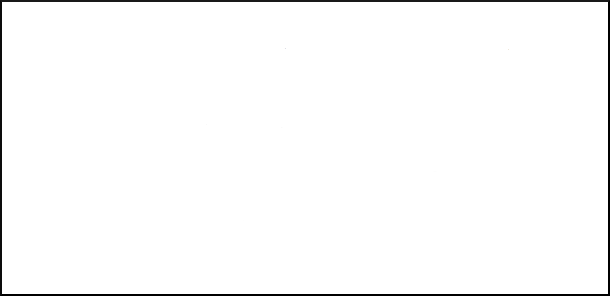]

---

count: false

## Our multi-fidelity active learning algorithm

.center[]

---

count: false

## Our multi-fidelity active learning algorithm

.center[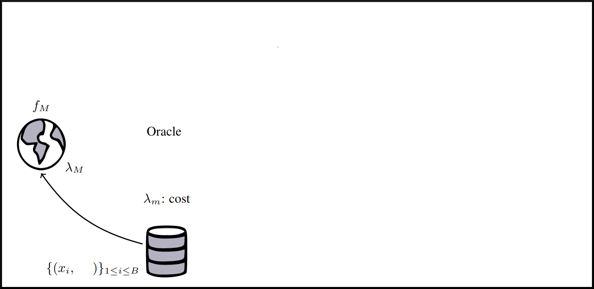]

---

count: false

## Our multi-fidelity active learning algorithm

.center[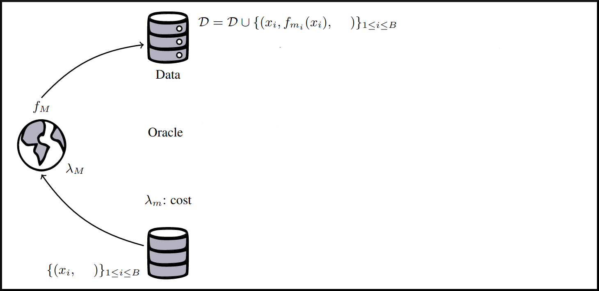]

---

count: false

## Our multi-fidelity active learning algorithm

.center[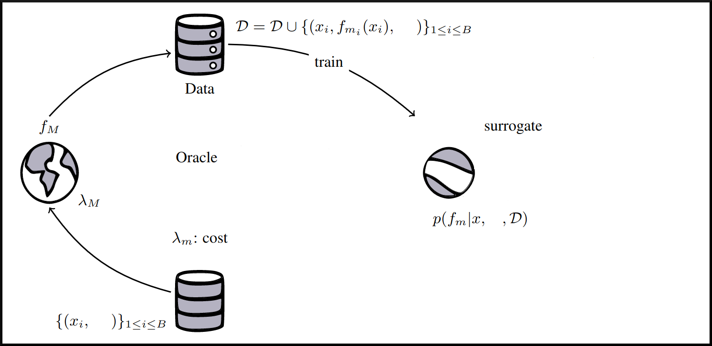]

---

count: false

## Our multi-fidelity active learning algorithm

.center[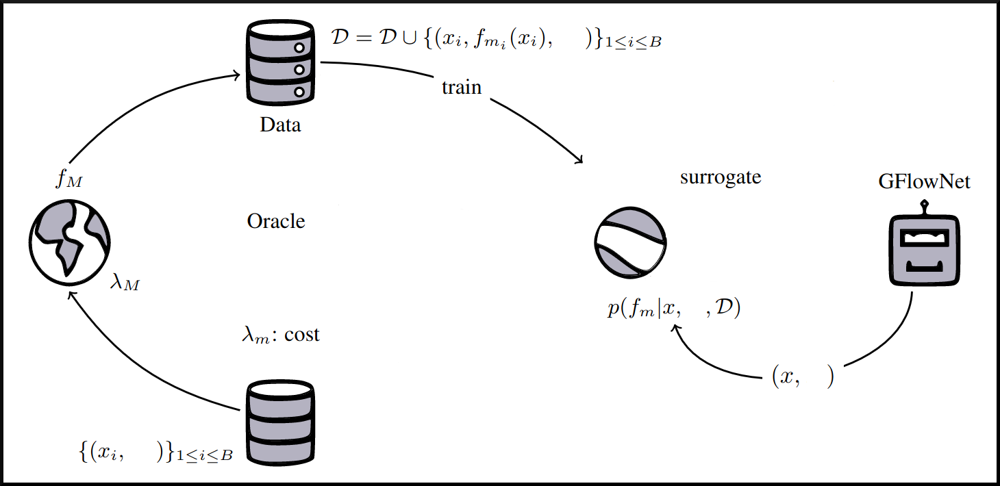]

---

count: false

## Our multi-fidelity active learning algorithm

.center[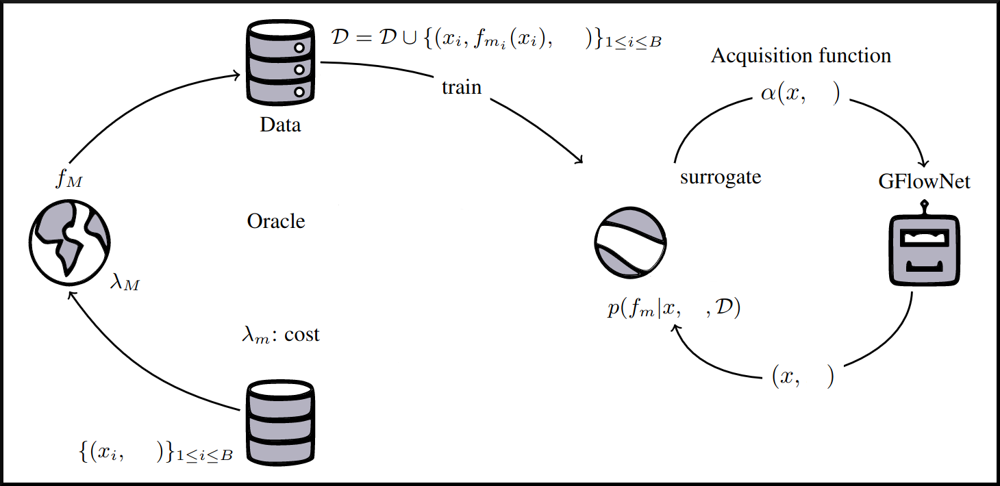]

---

count: false

## Our multi-fidelity active learning algorithm

.center[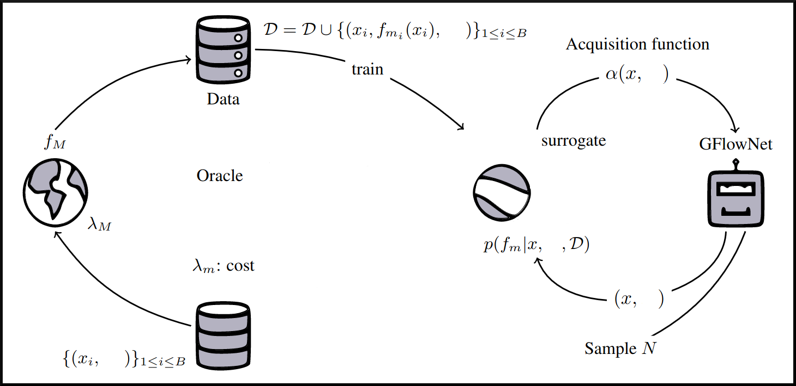]

---

count: false

## Our multi-fidelity active learning algorithm

.center[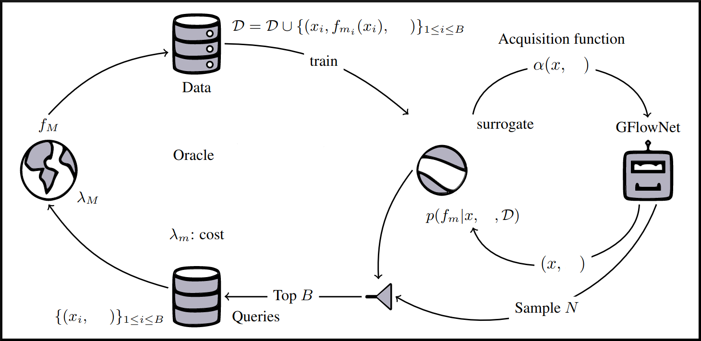]

---

count: false

## Our multi-fidelity active learning algorithm

.center[]

---

count: false

## Our multi-fidelity active learning algorithm

.center[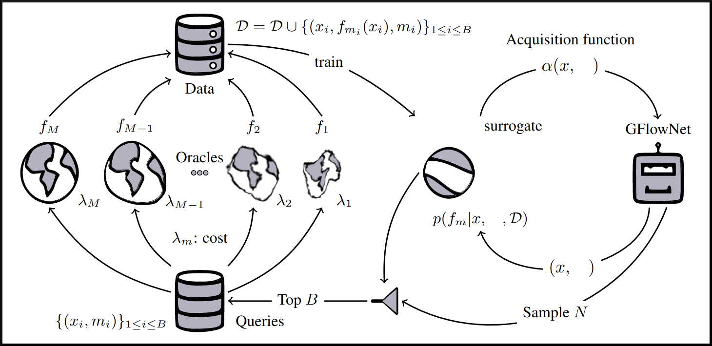]

---

count: false

## Our multi-fidelity active learning algorithm

.center[]

---

count: false

## Our multi-fidelity active learning algorithm

.center[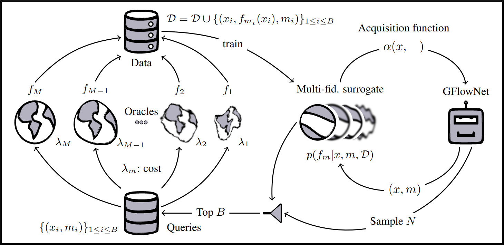]

---

count: false

## Our multi-fidelity active learning algorithm

.center[]

---

## Experiments
### Baselines

.context[This is the .highlight1[first multi-fidelity active learning algorithm tested on biological sequence design and molecular design problems]. There did not exist baselines from the literature.]

--

 
* .highlight1[SF-GFN]: GFlowNet with highest fidelity oracle to establish a benchmark for performance without considering the cost-accuracy trade-offs.

--
* .highlight1[Random]: Quasi-random approach where the candidates and fidelities are picked randomly and the top $(x, m)$ pairs scored by the acquisition function are queried.

--
* .highlight1[Random fid. GFN]: GFlowNet with random fidelities, to investigate the benefit of deciding the fidelity with GFlowNets.

--
* .highlight1[MF-PPO]: Replacement of MF-GFN with a reinforcement learning algorithm to _optimise_ the acquisition function.

---

## Small molecules

- Realistic experiments with experimental oracles and costs that reflect the computational demands (1, 3, 7).
- GFlowNet adds one SELFIES token (out of 26) at a time with variable length up to 64 ($|\mathcal{X}| > 26^{64}$). 
- Property: Adiabatic electron affinity (EA). Relevant in organic semiconductors, photoredox catalysis and organometallic synthesis.

--

.center[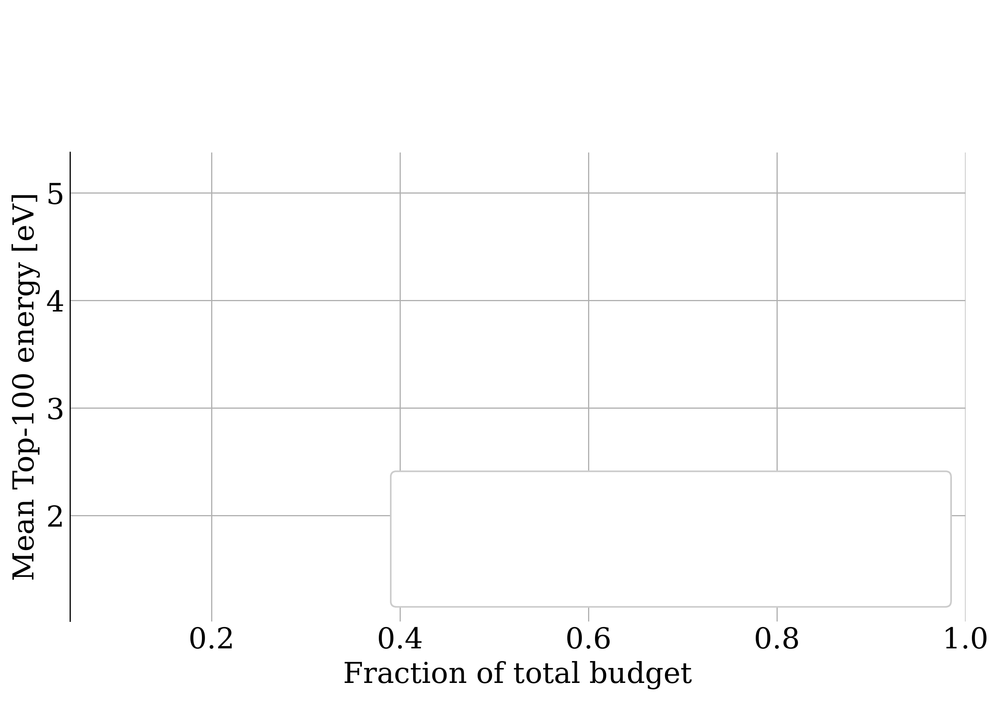]

---

count: false

## Small molecules

- Realistic experiments with experimental oracles and costs that reflect the computational demands (1, 3, 7).
- GFlowNet adds one SELFIES token (out of 26) at a time with variable length up to 64 ($|\mathcal{X}| > 26^{64}$). 
- Property: Adiabatic electron affinity (EA). Relevant in organic semiconductors, photoredox catalysis and organometallic synthesis.

.center[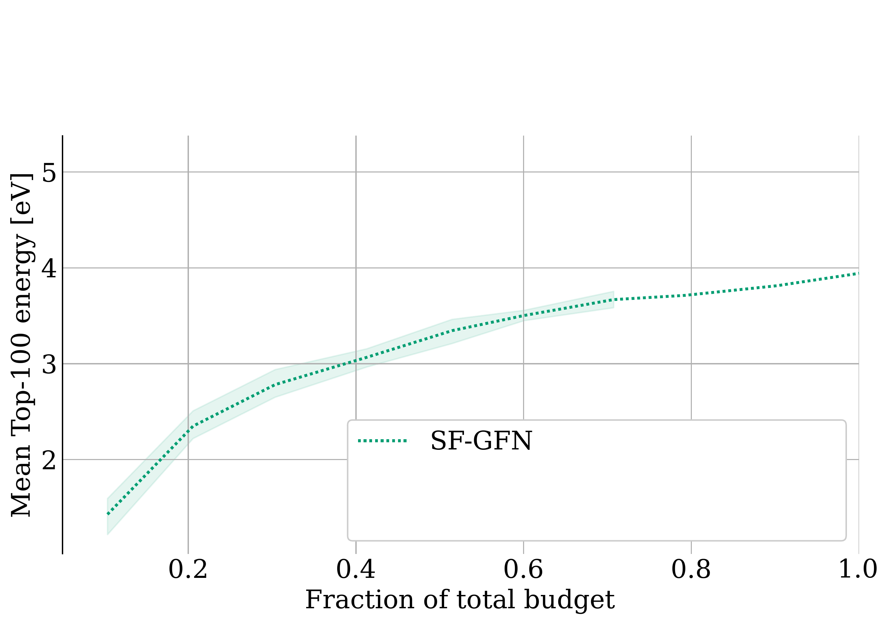]

---

count: false

## Small molecules

- Realistic experiments with experimental oracles and costs that reflect the computational demands (1, 3, 7).
- GFlowNet adds one SELFIES token (out of 26) at a time with variable length up to 64 ($|\mathcal{X}| > 26^{64}$). 
- Property: Adiabatic electron affinity (EA). Relevant in organic semiconductors, photoredox catalysis and organometallic synthesis.

.center[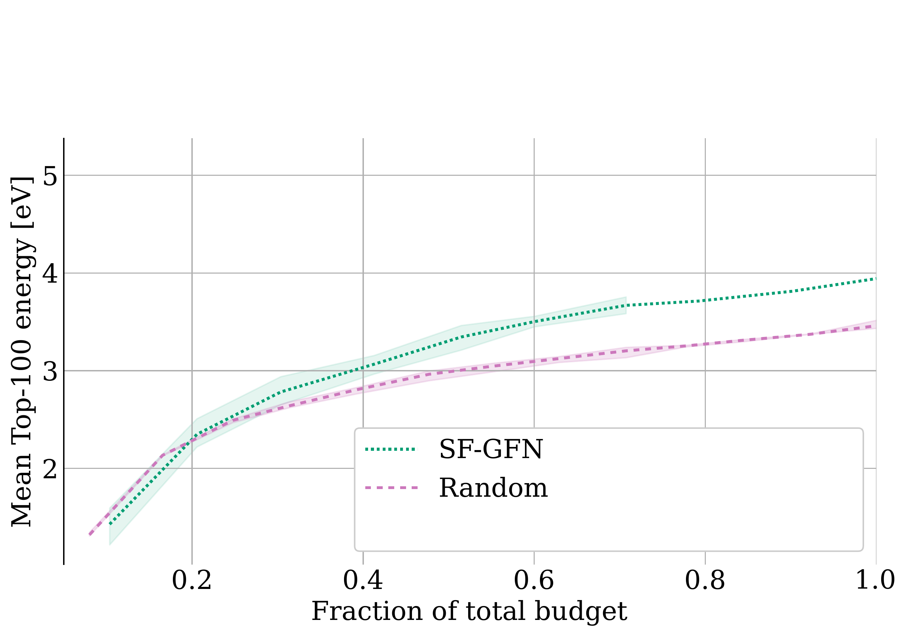]

---

count: false

## Small molecules

- Realistic experiments with experimental oracles and costs that reflect the computational demands (1, 3, 7).
- GFlowNet adds one SELFIES token (out of 26) at a time with variable length up to 64 ($|\mathcal{X}| > 26^{64}$). 
- Property: Adiabatic electron affinity (EA). Relevant in organic semiconductors, photoredox catalysis and organometallic synthesis.

.center[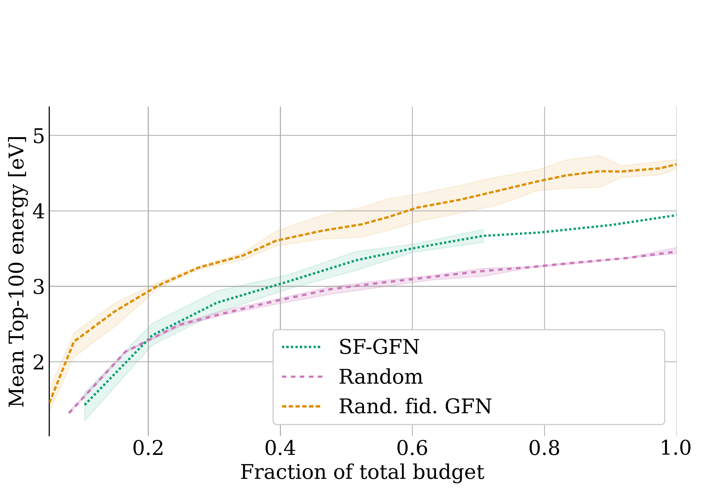]

---

count: false

## Small molecules

- Realistic experiments with experimental oracles and costs that reflect the computational demands (1, 3, 7).
- GFlowNet adds one SELFIES token (out of 26) at a time with variable length up to 64 ($|\mathcal{X}| > 26^{64}$). 
- Property: Adiabatic electron affinity (EA). Relevant in organic semiconductors, photoredox catalysis and organometallic synthesis.

.center[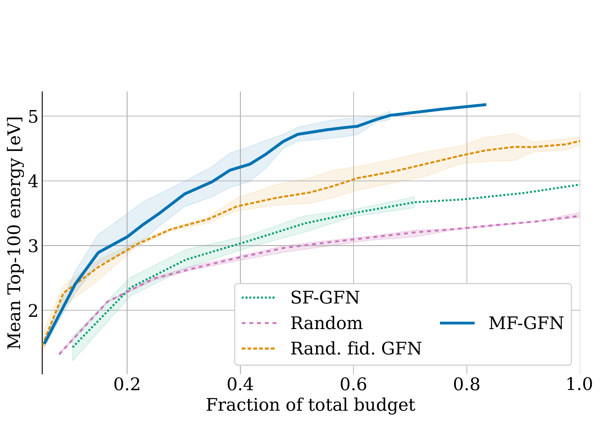]

---

count: false

## Small molecules

- Realistic experiments with experimental oracles and costs that reflect the computational demands (1, 3, 7).
- GFlowNet adds one SELFIES token (out of 26) at a time with variable length up to 64 ($|\mathcal{X}| > 26^{64}$). 
- Property: Adiabatic electron affinity (EA). Relevant in organic semiconductors, photoredox catalysis and organometallic synthesis.

.center[]

---

count: false

## Small molecules

- Realistic experiments with experimental oracles and costs that reflect the computational demands (1, 3, 7).
- GFlowNet adds one SELFIES token (out of 26) at a time with variable length up to 64 ($|\mathcal{X}| > 26^{64}$). 
- Property: Adiabatic electron affinity (EA). Relevant in organic semiconductors, photoredox catalysis and organometallic synthesis.

.center[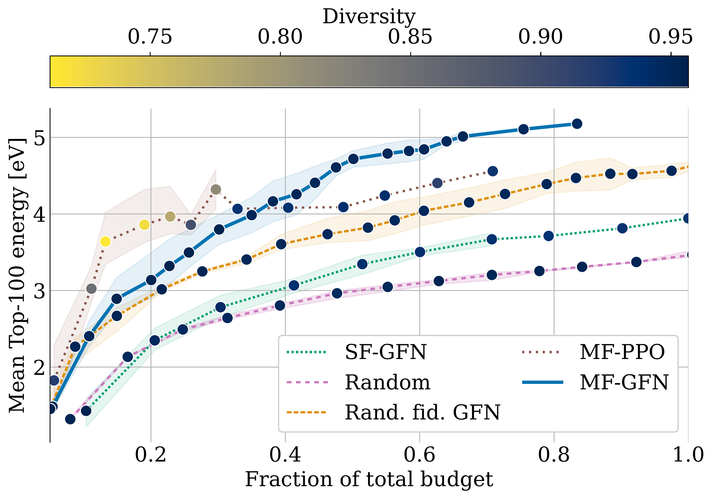]

---

count: false

## Small molecules

- Realistic experiments with experimental oracles and costs that reflect the computational demands (1, 3, 7).
- GFlowNet adds one SELFIES token (out of 26) at a time with variable length up to 64 ($|\mathcal{X}| > 26^{64}$). 
- Property: Adiabatic .highlight1[ionisation potential (IP)]. Relevant in organic semiconductors, photoredox catalysis and organometallic synthesis.

.center[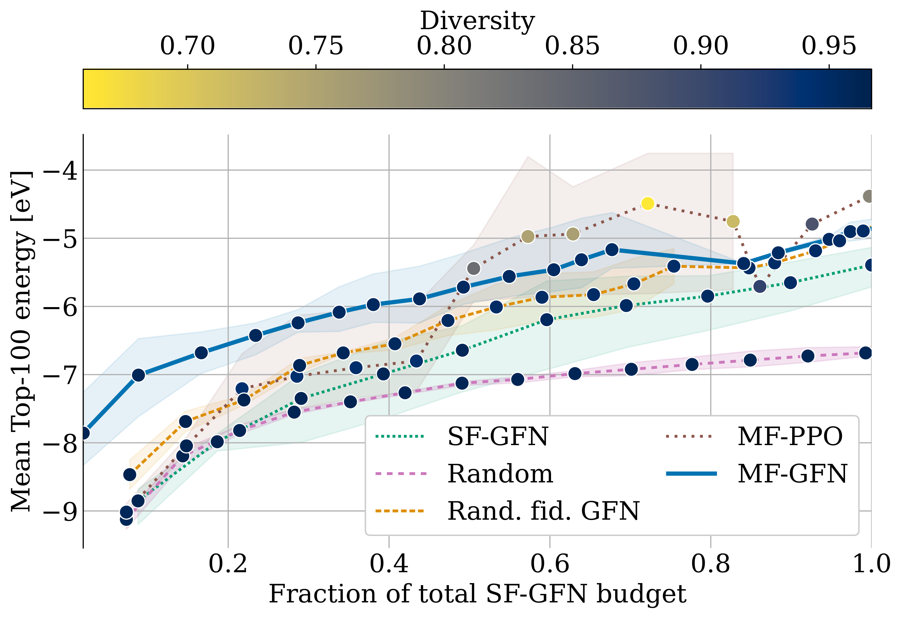]

---

## DNA aptamers

- GFlowNet adds one nucleobase (`A`, `T`, `C`, `G`) at a time up to length 30. This yields a design space of size $|\mathcal{X}| = 4^{30}$. 
- The objective function is the free energy estimated by a bioinformatics tool. 
- The (simulated) lower fidelity oracle is a transformer trained with 1 million sequences.

--

.center[]

---

count: false

## Antimicrobial peptides (AMP)

- Protein sequences (20 amino acids) with variable length (max. 50).
- The oracles are 3 ML models trained with different subsets of data.

--

.center[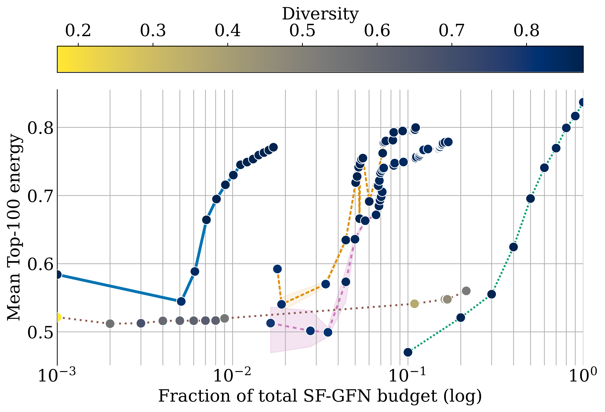]

---

## How does multi-fidelity help?

.context[Visualisation on the synthetic 2D Branin function task.]

.center[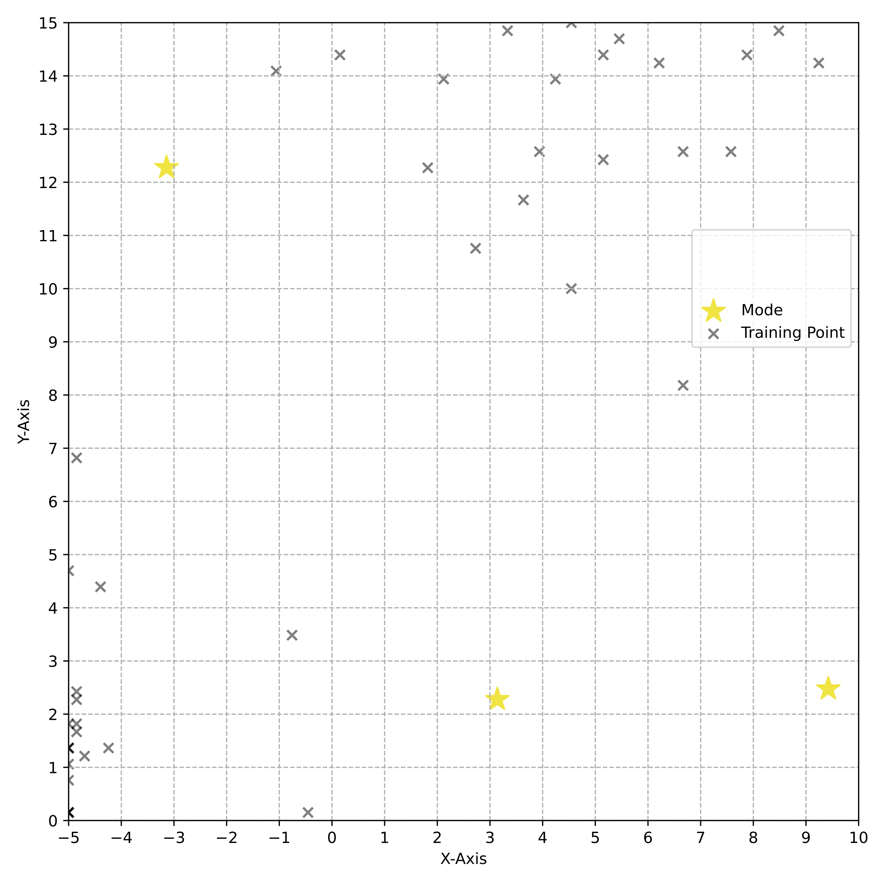]

---

count: false

## How does multi-fidelity help?

.context[Visualisation on the synthetic 2D Branin function task.]

.center[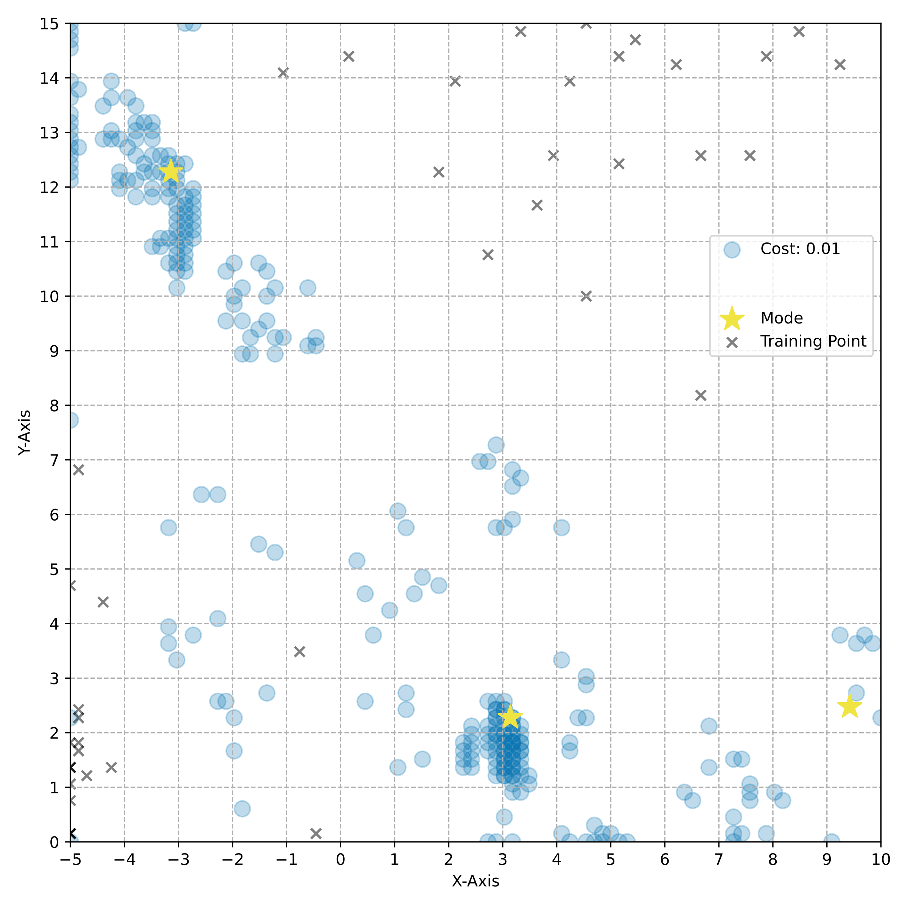]

---

count: false

## How does multi-fidelity help?

.context[Visualisation on the synthetic 2D Branin function task.]

.center[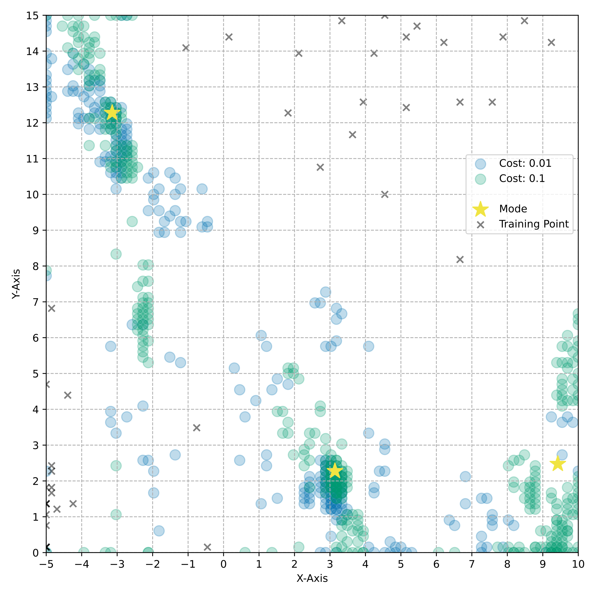]

---

count: false

## How does multi-fidelity help?

.context[Visualisation on the synthetic 2D Branin function task.]

.center[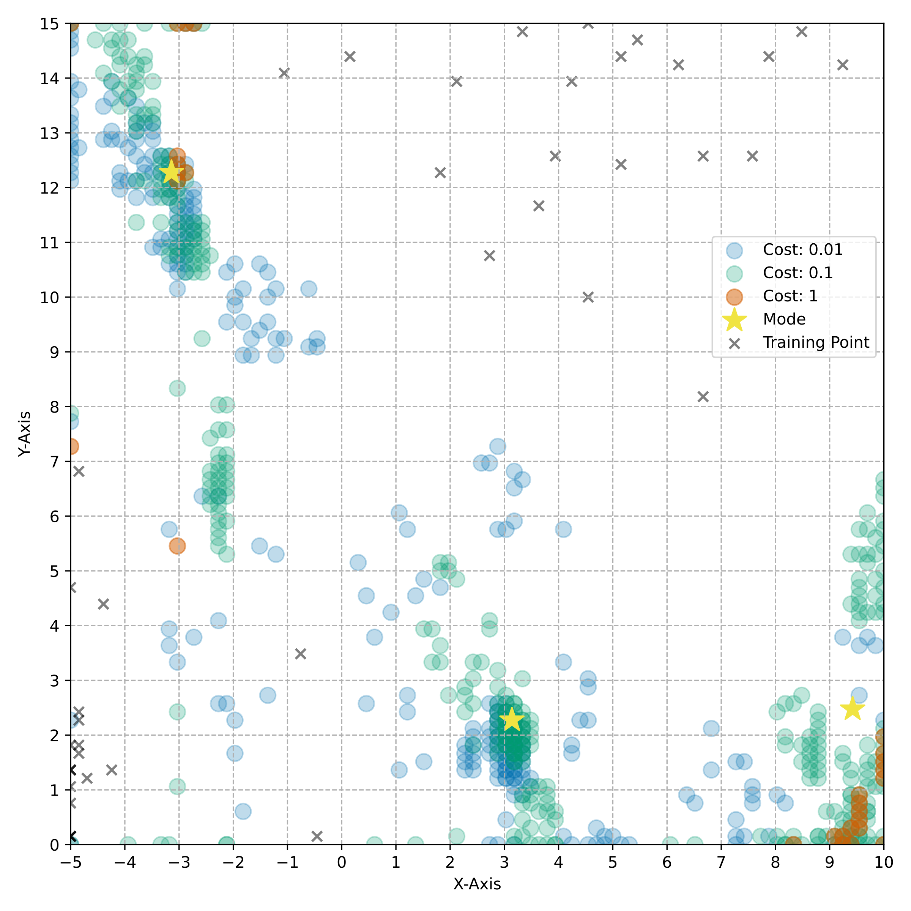]

---

## Multi-fidelity active learning with GFlowNets
### Summary and conclusions

.references[
* Hernandez-Garcia, Saxena et al. [Multi-fidelity active learning with GFlowNets](https://arxiv.org/abs/2306.11715). RealML, NeurIPS 2023.
]

* Current ML for science methods do not utilise all the information and resources at our disposal.

--
* AI-driven scientific discovery demands learning methods that can .highlight1[efficiently discover diverse candidates in combinatorially large, high-dimensional search spaces].

--
* .highlight1[Multi-fidelity active learning with GFlowNets] enables .highlight1[cost-effective exploration] of large, high-dimensional and structured spaces, and discovers multiple, diverse modes of black-box score functions.

--
* This is to our knowledge the first algorithm capable of effectively leveraging multi-fidelity oracles to discover diverse biological sequences and molecules.

---

## Acknowledgements

.columns-3-left[
Victor Schmidt 
Mélisande Teng 
Alexandre Duval 
Yasmine Benabed 
Pierre Luc Carrier 
Divya Sharma 
Yoshua Bengio 
Lena Simine 
Michael Kilgour 
...
]

.columns-3-center[
Alexandra Volokhova 
Michał Koziarski 
Paula Harder 
David Rolnick 
Qidong Yang 
Santiago Miret 
Sasha Luccioni 
Alexia Reynaud 
Tianyu Zhang 
...
]

.columns-3-right[
Nikita Saxena 
Moksh Jain 
Cheng-Hao Liu 
Kolya Malkin 
Tristan Deleu 
Salem Lahlou 
Alvaro Carbonero 
José González-Abad 
Emmanuel Bengio 
...
]

.conclusion[Science is a lot more fun when shared with bright and interesting people!]

---

count: false

name: title
class: title, middle

## Overall summary and conclusions

.center[]

---

## Summary and conclusions

- Tackling the climate crisis _is_ tackling health challenges.

--
- Machine learning has great potential to accelerate scientific discoveries. There are strong synergies between materials discovery and drug discovery methods.

--
- With GFlowNets, we are able to address some important challenges: discover diverse candidates in very large, complex search spaces.

--
- Crystal-GFN rethinks crystal structure generation by introducing domain knowledge and hard constraints to discover materials with desirable properties.

--
- Multi-fidelity active learning with GFlowNets effectively leverages the availability of multiple oracles for the first time for certain scientific discovery problems.

---

name: mlforscience-mar24
class: title, middle

Alex Hernández-García (he/il/él)

.center[

&nbsp&nbsp&nbsp&nbsp

]

.footer[[alexhernandezgarcia.github.io](https://alexhernandezgarcia.github.io/) | [alex.hernandez-garcia@mila.quebec](mailto:alex.hernandez-garcia@mila.quebec)] 
.footer[[@alexhg@scholar.social](https://scholar.social/@alexhg)  | [@alexhdezgcia](https://twitter.com/alexhdezgcia) ]

.smaller[.footer[
Slides: [alexhernandezgarcia.github.io/slides/{{ name }}](https://alexhernandezgarcia.github.io/slides/{{ name }})
]]
