name: mlforscience-udem-feb24
class: title, middle

## Machine learning for science
### Tackling climate and health challenges

## Apprentissage automatique pour les sciences
### S'attaquer à la crise climatique et aux défis en santé

Alex Hernández-García (he/il/él)

.center[

&nbsp&nbsp&nbsp&nbsp

]

.smaller[.footer[
Slides: [alexhernandezgarcia.github.io/slides/{{ name }}](https://alexhernandezgarcia.github.io/slides/{{ name }})
]]

---

## Outline

.bigger[
- About me
- Overview of machine learning to tackle climate and health challenges
- Machine learning for scientific discoveries
    - GFlowNets for materials discovery
    - Multi-fidelity active learning
- Challenges and perspectives
]

---

name: title
class: title, middle

## About me

.center[]

---

## About me
### My academic journey

--

* .highlight1[Bachelor's]: Image and Sound Engineering, University Carlos III of Madrid (2013)

--
* .highlight1[Bachelor's] (partial): Audiovisual Communication, University Carlos III of Madrid (2013)

--
* .highlight1[Master's]: Machine Learning and Computer Vision, University Carlos III of Madrid (2015)

--
* .highlight1[PhD]: Institute of Cognitive Science, Universität Osnabrück (2016–2020)
  * Based in Berlin
  * Marie Skłodowska Curie ITN fellow
  * Thesis topics: deep learning, visual perception and computational neuroscience
  * Internship at Spinoza Centre for Neuroimaging, Amsterdam, 2018
  * Internship at University of Cambridge, 2019

---

count: false

## About me
### My academic journey

* .highlight1[Bachelor's]: Image and Sound Engineering, University Carlos III of Madrid (2013)
* .highlight1[Bachelor's] (partial): Audiovisual Communication, University Carlos III of Madrid (2013)
* .highlight1[Master's]: Machine Learning and Computer Vision, University Carlos III of Madrid (2015)
* .highlight1[PhD]: Institute of Cognitive Science, Universität Osnabrück (2016–2020)
* .highlight1[Postdoc]: Mila and the Université de Montréal (2020–present)
    * Prof. Yoshua Bengio's group and Prof. David Rolnick's group as IVADO fellow.
    * Teaching assistant in _Fundamentals of machine learning_ (Prof. Ioannis Mitliagkas and Guillaume Rabusseau), 2021.
    * Main instructor of _Projets avancés en apprentissage automatique_ (English x1 and French x2), 2022-2024.
    * Mila Lab Representative (2021-2022), EDI Committee (2021-present), Sustainability Committee (2023-present)

---

## About me
### Alongside my academic journey...

---

count: false

## About me
### Alongside my academic journey...

.center[]

---

count: false

## About me
### Alongside my academic journey...

.center[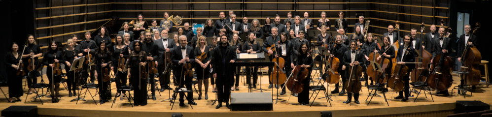]

.center[]

.footnote[[Orchestre Symphonique de l'Isle](https://osimontreal.com/)]

---

count: false

## About me
### Alongside my academic journey...

.center[]

.footnote[[BrokenJugRamblers.bandcamp.com](https://brokenjugramblers.bandcamp.com/)]

---

count: false

## About me
### Alongside my academic journey...

.center[]

.footnote[[LumeDeBiqueira.es](https://www.lumedebiqueira.es/en/)]

---

name: mlforscience-udem-feb24
class: title, middle

## Machine learning for science
### Tackling climate _or_ health challenges

## Apprentissage automatique pour les sciences
### S'attaquer à la crise climatique _ou_ aux défis en santé

---

count: false

name: mlforscience-udem-feb24
class: title, middle

## Machine learning for science
### Tackling climate .highlight2[and] health challenges

## Apprentissage automatique pour les sciences
### S'attaquer à la crise climatique .highlight2[et] aux défis en santé

---

name: title
class: title, middle

### Motivation and overview

.center[]

---

## Why climate and health?

.context[Climate change is a major challenge for humanity.]

.left-column-66[.center[
<figure>
	
  <figcaption>.smaller[Modelled and observed global average temperatures in the last 2 millenia (source graphic: <a href="https://www.theguardian.com/science/2021/aug/09/humans-have-caused-unprecedented-and-irreversible-change-to-climate-scientists-warn">The Guardian</a>.)]</figcaption>
</figure>
]]

.right-column-33[
Direct consequences:
* Melting glaciers and polar ice
* Sea level rise
* Heatwaves
* Floods
* Droughts
* Wildfires
* ...
]

???

* Flash floods kill **5,000** people per year.
* Sea levels are expected to rise by **2 metres** by the end of the century
* Rising sea levels could disrupt the lives of **1 billion people** by the end of 2050.
* As much as **40% of the Amazon** forest is at risk of becoming a savanna.
* In 2015, forest fires claimed roughly **980 000 $km^2$** of the world’s forest.
* Forest fires emmitted **~1.8 Gt of CO2** in 2019.

---

## Why climate and health?

.context[Climate change is a major challenge for humanity.]

.left-column-66[.center[
<figure>
	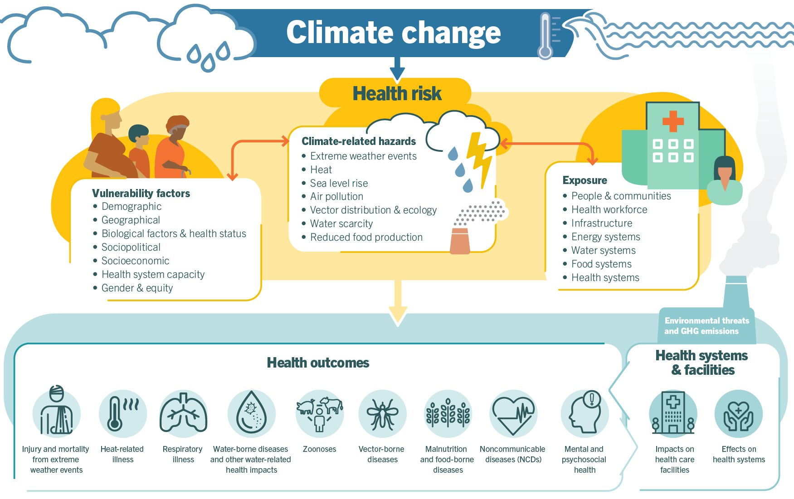
  <figcaption>.smaller[Climate-sensitive health risks (source graphic: <a href="https://www.who.int/news-room/fact-sheets/detail/climate-change-and-health">World Health Organization</a>.)]</figcaption>
</figure>
]]

.right-column-33[
* Environmental factors take the lives of around 13 million people _per year_.
* Climate change seriously affect people’s mental and physical health, access to clean air, safe water, food and health care.
]

--

.full-width[
.conclusion["Climate change is the single biggest health threat facing humanity." .smaller[[WHO and WMO](https://climahealth.info/), 2024]]
]

???

- https://www.who.int/news-room/fact-sheets/detail/climate-change-and-health
- 

---

## Why climate and health?

.context[Climate change is a fundamental threat to human health.]

.center[
<figure>
	
  <figcaption>Median <em>future</em> global warming across modelled scenarios. Adapted from IPCC Report, 2022</figcaption>
</figure>
]

???

* Category C1: scenarios that limit warming to 1.5°C in 2100 with a likelihood of greater than 50%, and reach or exceed warming of 1.5°C during the 21st century with a likelihood of 67% or less. 
* Category C2: same as C1 but exceed warming of 1.5°C during the 21st century with a likelihood of _greater_ than 67%.
* Category C3: scenarios that limit peak warming to 2°C throughout the 21st century with a likelihood of greater than 67%
* Category C8: scenarios that exceed warming of 4°C during the 21st century with a likelihood of 50% or greater.

---

count: false

## Why climate and health?

.context[Climate change is a fundamental threat to human health.]

.center[
<figure>
	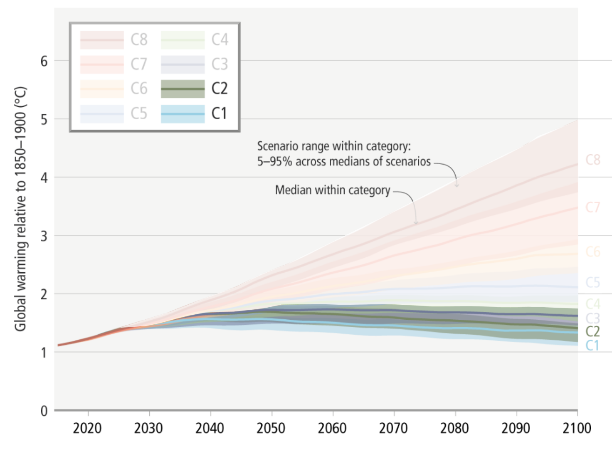
  <figcaption>Median <em>future</em> global warming across modelled scenarios. Adapted from IPCC Report, 2022</figcaption>
</figure>
]

.conclusion["The evidence is clear: the time for action is now." .smaller[IPCC Report, 2022]]

???

* Category C1: scenarios that limit warming to 1.5°C in 2100 with a likelihood of greater than 50%, and reach or exceed warming of 1.5°C during the 21st century with a likelihood of 67% or less. 
* Category C2: same as C1 but exceed warming of 1.5°C during the 21st century with a likelihood of _greater_ than 67%.
* Category C3: scenarios that limit peak warming to 2°C throughout the 21st century with a likelihood of greater than 67%
* Category C8: scenarios that exceed warming of 4°C during the 21st century with a likelihood of 50% or greater.

---

## Why climate _and_ health?

.orange[Figure with a schematic of the relationship between climate change, health and ML research]

- Tackling climate change _is_ tackling a wide range of health challenges.
- Machine learning can have a wide range of positive impacts in tackling climate and health challenges. .cite[(Rolnick et al, 2022)]
- Advancing scientific discoveries with machine learning has great potential for both health and climate.

.references[
Rolnick et al. [Tackling Climate Change with Machine Learning](https://dl.acm.org/doi/10.1145/3485128), ACM Comput. Surv., 2022.
]

---

name: title
class: title, middle

### Machine learning for scientific discoveries

.center[]

---

## Why scientific discovery?
### The potential on sustainability

.context["The time for action is now"]

--

> "Limiting global warming will require major transitions in the energy sector. This will involve a substantial reduction in fossil fuel use, widespread electrification, .highlight1[improved energy efficiency, and use of alternative fuels (such as hydrogen)]." .cite[IPCC Sixth Assessment Report, 2022]

--

> "Reducing industry emissions will entail coordinated action throughout value chains to promote all mitigation options, including demand management, .highlight1[energy and materials efficiency, circular material flows]." .cite[IPCC Sixth Assessment Report, 2022]

--

 

.conclusion[Mitigation of the climate crisis requires transformational changes in the energy and materials efficiency.]

???

Antimicrobial resistance

- https://www.who.int/news-room/fact-sheets/detail/antimicrobial-resistance
- https://www.who.int/news-room/feature-stories/detail/donors-making-a-difference--climate-change-and-its-impact-on-health
- https://www.who.int/news/item/31-10-2022-who-and-wmo-launch-a-new-knowledge-platform-for-climate-and-health
- https://www.who.int/news/item/08-02-2024-who-medically-important-antimicrobial-list-2024
- https://cdn.who.int/media/docs/default-source/gcp/who-mia-list-2024-lv.pdf?sfvrsn=3320dd3d_2
- https://www.who.int/publications/i/item/9789240047655

---

## Why scientific discovery?
### The potential of better materials

.context[The climate crisis demands more efficient materials.]

Anthropogenic emissions in 2019:
- Canada: 0.73 GtCO₂-eq
- Global: 59 ($\pm$ 6.6) GtCO₂-eq

--

Potential reduction impact of materials discovery:
- Improving material efficiency can reduce 0.93 ($\pm$ 0.23) GtCO₂-eq per year.
- Fuel switching can reduce 2.1 ($\pm$ 0.52) GtCO₂-eq per year, only in the industry sector. 
- Carbon capture and storage can reduce 0.54 ($\pm$ 0.27) GtCO₂-eq per year in the energy sector.

.right[.cite[IPCC Sixth Assessment Report (2022)]]

--

.conclusion[Materials discovery has the potential to reduce carbon emissions in multiple areas.] 

---

## Why scientific discovery?
### The potential on health

.context[Drug discovery and vaccine development play a crucial role in modern healthcare systems.]

.right-column-33[
.center[]
]

--

.left-column-66[
Bacterial antimicrobial resistance was directly responsible for 1.27 million global deaths in 2019 and contributed to 4.95 million deaths. .cite[World Health Organisation (WHO), 2023]
]

???

Antimicrobial resistance

- https://www.who.int/news-room/fact-sheets/detail/antimicrobial-resistance
- https://www.who.int/news-room/feature-stories/detail/donors-making-a-difference--climate-change-and-its-impact-on-health
- https://www.who.int/news/item/31-10-2022-who-and-wmo-launch-a-new-knowledge-platform-for-climate-and-health
- https://www.who.int/news/item/08-02-2024-who-medically-important-antimicrobial-list-2024
- https://cdn.who.int/media/docs/default-source/gcp/who-mia-list-2024-lv.pdf?sfvrsn=3320dd3d_2
- https://www.who.int/publications/i/item/9789240047655

---

count: false

## Why scientific discovery?
### The potential on health

.context[Drug discovery and vaccine development play a crucial role in modern healthcare systems.]

.right-column-33[
.center[]
]

.left-column-66[
Bacterial antimicrobial resistance was directly responsible for 1.27 million global deaths in 2019 and contributed to 4.95 million deaths. .cite[World Health Organisation (WHO), 2023]

The World Bank estimates that antimicrobial resistance could result in .highlight1[one _trillion_ USD additional healthcare costs] by 2050.
]

---

count: false

## Why scientific discovery?
### The potential on health

.context[Drug discovery and vaccine development play a crucial role in modern healthcare systems.]

.right-column-33[
.center[]
]

.left-column-66[
Bacterial antimicrobial resistance was directly responsible for 1.27 million global deaths in 2019 and contributed to 4.95 million deaths. .cite[World Health Organisation (WHO), 2023]

The World Bank estimates that antimicrobial resistance could result in .highlight1[one _trillion_ USD additional healthcare costs] by 2050.

WHO's latest annual review identified 27 antibiotics in clinical development that address WHO bacterial priority pathogens, of which .highlight1[only 6 were classified as innovative].
]

---

count: false

## Why scientific discovery?
### The potential on health

.context[Drug discovery and vaccine development play a crucial role in modern healthcare systems.]

.right-column-33[
.center[
<figure>
	
  <figcaption><small>"No time to wait". Source: <a href="https://www.who.int/docs/default-source/documents/no-time-to-wait-securing-the-future-from-drug-resistant-infections-en.pdf">WHO</a>.</small></figcaption>
</figure>
]
]

.left-column-66[
Bacterial antimicrobial resistance was directly responsible for 1.27 million global deaths in 2019 and contributed to 4.95 million deaths. .cite[World Health Organisation (WHO), 2023]

The World Bank estimates that antimicrobial resistance could result in .highlight1[one _trillion_ USD additional healthcare costs] by 2050.

WHO's latest annual review identified 27 antibiotics in clinical development that address WHO bacterial priority pathogens, of which .highlight1[only 6 were classified as innovative].
]

.full-width[
.conclusion["No time to wait". Alongside other necessary actions, drug discovery plays a key role in tackling the antimicrobial resistance global threat.]
]

---

## Traditional discovery cycle

.context35[The climate crisis demands accelerating scientific discoveries.]

.right-column-66[ .center[]]

.left-column-33[
 
The .highlight1[traditional pipeline] for scientific discovery:
* relies on .highlight1[highly specialised human expertise],
* it is .highlight1[time-consuming] and
* .highlight1[financially and computationally expensive].
]

---

count: false

## Machine learning in the loop

.context35[The traditional scientific discovery loop is too slow for certain applications.]

.right-column-66[ .center[]]

.left-column-33[
 
A .highlight1[machine learning model] can be:
* trained with data from _real-world_ experiments and
]

---

count: false

## Machine learning in the loop

.context35[The traditional scientific discovery loop is too slow for certain applications.]

.right-column-66[ .center[]]

.left-column-33[
 
A .highlight1[machine learning model] can be:
* trained with data from _real-world_ experiments and
* used to quickly and cheaply evaluate queries
]

---

count: false

## Machine learning in the loop

.context35[The traditional scientific discovery loop is too slow for certain applications.]

.right-column-66[ .center[]]

.left-column-33[
 
A .highlight1[machine learning model] can be:
* trained with data from _real-world_ experiments and
* used to quickly and cheaply evaluate queries

.conclusion[Is a linear speed-up enough to explore combinatorially large search spaces? ($10^{180}$ stable materials)]
]

---

count: false

## _Generative_ machine learning in the loop

.context[Can we do better than _linear_? An agent in the loop.]

.right-column-66[ .center[]]

.left-column-33[
 
A .highlight1[machine learning **agent**] could:
* .highlight1[learn structure] from the available data,
* .highlight1[generalise] to unexplored regions of the search space and
* .highlight1[build better queries]
]

---

count: false

## _Generative_ machine learning in the loop

.context[Can we do better than _linear_? An agent in the loop.]

.right-column-66[ .center[]]

.left-column-33[
 
A .highlight1[machine learning **agent**] could:
* .highlight1[learn structure] from the available data,
* .highlight1[generalise] to unexplored regions of the search space and
* .highlight1[build better queries]

.conclusion[An active learning pipeline with generative machine learning could provide _exponential_ gains.]
]

---

count: false

## _Generative_ machine learning in the loop

.context[GFlowNet as generative model.]

.right-column-66[ .center[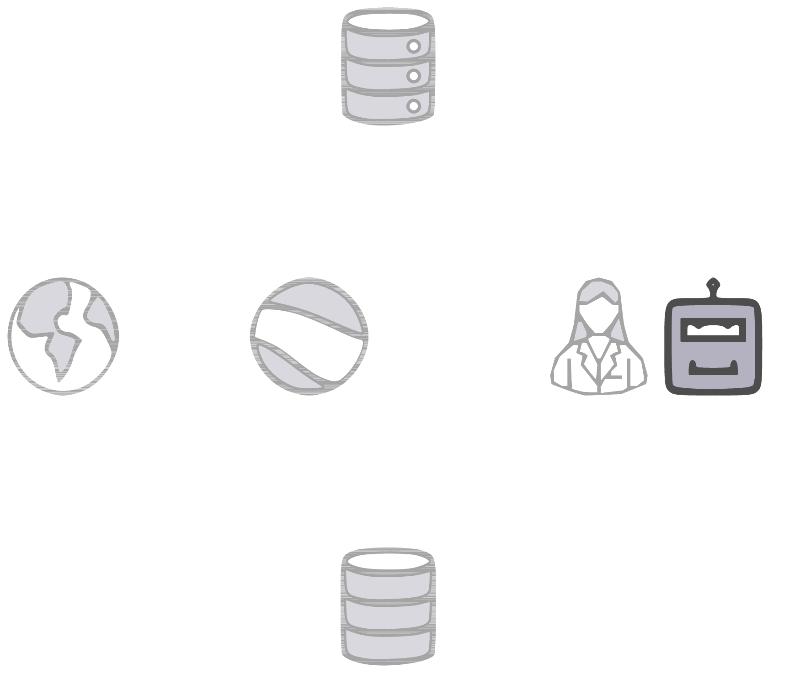]]

.left-column-33[
 
A .highlight1[machine learning **agent**] could:
* .highlight1[learn structure] from the available data,
* .highlight1[generalise] to unexplored regions of the search space and
* .highlight1[build better queries]

.conclusion[An active learning pipeline with generative machine learning could provide _exponential_ gains.]
]

.references[
Jain et al. [GFlowNets for AI-Driven Scientific Discovery](https://arxiv.org/abs/2302.00615). Digital Discovery, Royal Society of Chemistry, 2023.
]

---

## Machine learning for scientific discovery
### Challenges and limitations of existing methods

--

.highlight1[Challenge]: very large and high-dimensional search spaces.

--

&rarr; Need for .highlight2[efficient search and generalisation] of underlying structure.

--

.highlight1[Challenge]: underspecification of objective functions or metrics.

--

&rarr; Need for .highlight2[diverse] candidates.

--

.highlight1[Limitation]: Reinforcement learning excels at optimisation in complex spaces but tends to lack diversity.

--
.highlight1[Limitation]: Markov chain Monte Carlo (MCMC) can _sample_ from a distribution (diversity) but struggles at mode mixing in high dimensions.

--

&rarr; Need to .highlight2[combine all of the above]: sampling from complex, high-dimensional distributions.

---

name: title
class: title, middle

### A gentle introduction to GFlowNets

.center[]

---

## An intuitive trivial problem

.highlight1[Problem]: find one arrangement of Tetris pieces on the board that minimise the empty space.

.left-column-33[
.center[]
]

.right-column-66[
.center[]
]

--

.full-width[.center[
<figure>
  
<figcaption>Score: 12</figcaption>
</figure>
]]

---

## An intuitive toy problem

.highlight1[Problem]: find .highlight2[all] the arrangements of Tetris pieces on the board that minimise the empty space.

.left-column-33[
.center[]
]

.right-column-66[
.center[]
]

--

.full-width[.center[

  

  <figure>
      
    <figcaption>12</figcaption>
  </figure>
  

  

  <figure>
      
    <figcaption>12</figcaption>
  </figure>
  

  

  <figure>
      
    <figcaption>12</figcaption>
  </figure>
  

  

  <figure>
      
    <figcaption>12</figcaption>
  </figure>
  

  

  <figure>
      
    <figcaption>12</figcaption>
  </figure>
  

]]

---

## An intuitive ~~toy~~ hard problem

.highlight1[Problem]: find .highlight2[all] the arrangements of Tetris pieces on the board that minimise the empty space.

.left-column-33[
.center[]
]

.right-column-66[
.center[]
]

--

.full-width[.center[

  

  <figure>
      
  </figure>
  

  

  <figure>
      
  </figure>
  

  

  <figure>
      
  </figure>
  

  

  <figure>
      
  </figure>
  

  

  <figure>
      
  </figure>
  

]]

---

## An incredibly ~~intuitive toy~~ hard problem

.highlight1[Problem]: find .highlight2[all] the arrangements of Tetris pieces on the board that .highlight2[optimise an unknown function].

.left-column-33[
.center[]
]

.right-column-66[
.center[]
]

--

.full-width[.center[

  

  <figure>
      
  </figure>
  

  

  <figure>
      
  </figure>
  

  

  <figure>
      
  </figure>
  

  

  <figure>
      
  </figure>
  

  

  <figure>
      
  </figure>
  

]]

---

## How can GFlowNets tackle such problems?
### The three key GFlowNet ingredients

The "Tetris problem" involves .highlight1[sampling from an unknown distribution] in a .highlight1[discrete, high-dimensional, combinatorially large space.]

--

1. .highlight1[Diversity] as an objective.

--
    - Given a score or reward function $R(x)$, learn to _sample proportionally to the reward_.
--
2. .highlight1[Compositionality] in the samples generation.

--
    - A meaningful decomposition of samples $x$ into multiple sub-states $s_0\rightarrow s_1 \rightarrow \dots \rightarrow x$ can yield generalisable patterns.
--
3. .highlight1[Deep learning] to _amortise_ the generated samples.

--
    - A machine learning model can learn the transition function $F(s\rightarrow s')$ and generalise the patterns.

---

## 1. Diversity as an objective

.context[Many existing approaches treat scientific discovery as an _optimisation_ problem.]

 
Given a reward or objective function $R(x)$, GFlowNet can be seen a generative model trained to sample objects $x \in \cal X$ according to .highlight1[a sampling policy $\pi(x)$ proportional to the reward $R(x)$]: 

.left-column[
$$\pi(x) = \frac{R(x)}{Z} \propto R(x)$$
]

--

.right-column[
$$Z = \sum_{x' \in \cal X} R(x')$$
]

--

&rarr; Sampling proportionally to the reward function enables finding .highlight1[multiple modes], hence .highlight1[diversity].

.center[]

---

## 1. Diversity as an objective

.context[Many existing approaches treat scientific discovery as an _optimisation_ problem.]

 
Given a reward or objective function $R(x)$, GFlowNet can be seen a generative model trained to sample objects $x \in \cal X$ according to .highlight1[a sampling policy $\pi(x)$ proportional to the reward $R(x)$]: 

.left-column[
$$\pi(x) = \frac{R(x)}{Z} \propto R(x)$$
]
.right-column[
$$Z = \sum_{x' \in \cal X} R(x')$$
]

.left-column-66[.center[

]]

--

.left-column-33[.center[
.smaller[
$$Z = 4 \times 5 + 8 \times 25 + 12 \times 5 = 280$$

.smaller[
$R(x) = 4 \implies \pi(x) = \frac{4}{280} = 0.014$

$R(x) = 8 \implies \pi(x) = \frac{8}{280} = 0.029$

$R(x) = 12 \implies \pi(x) = \frac{12}{280} = 0.043$
]
]
]]

---

## 2. Compositionality
### Sample generation process

.context35[Sampling _directly_ from a complex, high-dimensional distribution is difficult.]

The principle of compositionality is fundamental in semantics, linguistics, mathematical logic and is thought to be a cornerstone of human reasoning.

---

count: false

## 2. Compositionality
### Sample generation process

.context35[Sampling _directly_ from a complex, high-dimensional distribution is difficult.]

For the Tetris problem, a meaningful decomposition of the samples is .highlight1[adding one piece to the board at a time].

--

.left-column[.center[]]

---

count: false

## 2. Compositionality
### Sample generation process

.context35[Sampling _directly_ from a complex, high-dimensional distribution is difficult.]

For the Tetris problem, a meaningful decomposition of the samples is .highlight1[adding one piece to the board at a time].

.left-column[.center[]]

---

count: false

## 2. Compositionality
### Sample generation process

.context35[Sampling _directly_ from a complex, high-dimensional distribution is difficult.]

For the Tetris problem, a meaningful decomposition of the samples is .highlight1[adding one piece to the board at a time].

.left-column[.center[]]

---

count: false

## 2. Compositionality
### Sample generation process

.context35[Sampling _directly_ from a complex, high-dimensional distribution is difficult.]

For the Tetris problem, a meaningful decomposition of the samples is .highlight1[adding one piece to the board at a time].

.left-column[.center[]]

---

count: false

## 2. Compositionality
### Sample generation process

.context35[Sampling _directly_ from a complex, high-dimensional distribution is difficult.]

For the Tetris problem, a meaningful decomposition of the samples is .highlight1[adding one piece to the board at a time].

.left-column[.center[]]

---

count: false

## 2. Compositionality
### Sample generation process

.context35[Sampling _directly_ from a complex, high-dimensional distribution is difficult.]

For the Tetris problem, a meaningful decomposition of the samples is .highlight1[adding one piece to the board at a time].

.left-column[.center[]]

---

count: false

## 2. Compositionality
### Sample generation process

.context35[Sampling _directly_ from a complex, high-dimensional distribution is difficult.]

For the Tetris problem, a meaningful decomposition of the samples is .highlight1[adding one piece to the board at a time].

.left-column[.center[]]

---

count: false

## 2. Compositionality
### Sample generation process

.context35[Sampling _directly_ from a complex, high-dimensional distribution is difficult.]

For the Tetris problem, a meaningful decomposition of the samples is .highlight1[adding one piece to the board at a time].

.left-column[.center[]]

---

count: false

## 2. Compositionality
### Sample generation process

.context35[Sampling _directly_ from a complex, high-dimensional distribution is difficult.]

For the Tetris problem, a meaningful decomposition of the samples is .highlight1[adding one piece to the board at a time].

.left-column[.center[]]

---

count: false

## 2. Compositionality
### Sample generation process

.context35[Sampling _directly_ from a complex, high-dimensional distribution is difficult.]

For the Tetris problem, a meaningful decomposition of the samples is .highlight1[adding one piece to the board at a time].

.left-column[.center[]]

---

count: false

## 2. Compositionality
### Sample generation process

.context35[Sampling _directly_ from a complex, high-dimensional distribution is difficult.]

For the Tetris problem, a meaningful decomposition of the samples is .highlight1[adding one piece to the board at a time].

.left-column[.center[]]

---

count: false

## 2. Compositionality
### Sample generation process

.context35[Sampling _directly_ from a complex, high-dimensional distribution is difficult.]

For the Tetris problem, a meaningful decomposition of the samples is .highlight1[adding one piece to the board at a time].

.left-column[.center[]]

---

count: false

## 2. Compositionality
### Sample generation process

.context35[Sampling _directly_ from a complex, high-dimensional distribution is difficult.]

For the Tetris problem, a meaningful decomposition of the samples is .highlight1[adding one piece to the board at a time].

.left-column[.center[]]

---

count: false

## 2. Compositionality
### Sample generation process

.context35[Sampling _directly_ from a complex, high-dimensional distribution is difficult.]

For the Tetris problem, a meaningful decomposition of the samples is .highlight1[adding one piece to the board at a time].

.left-column[.center[]]

---

count: false

## 2. Compositionality
### Sample generation process

.context35[Sampling _directly_ from a complex, high-dimensional distribution is difficult.]

For the Tetris problem, a meaningful decomposition of the samples is .highlight1[adding one piece to the board at a time].

.left-column[.center[]]

---

count: false

## 2. Compositionality
### Sample generation process

.context35[Sampling _directly_ from a complex, high-dimensional distribution is difficult.]

For the Tetris problem, a meaningful decomposition of the samples is .highlight1[adding one piece to the board at a time].

.left-column[.center[]]

---

count: false

## 2. Compositionality
### Sample generation process

.context35[Sampling _directly_ from a complex, high-dimensional distribution is difficult.]

For the Tetris problem, a meaningful decomposition of the samples is .highlight1[adding one piece to the board at a time].

.left-column[.center[]]

---

count: false

## 2. Compositionality
### Sample generation process

.context35[Sampling _directly_ from a complex, high-dimensional distribution is difficult.]

For the Tetris problem, a meaningful decomposition of the samples is .highlight1[adding one piece to the board at a time].

.left-column[.center[]]

---

count: false

## 2. Compositionality
### Sample generation process

.context35[Sampling _directly_ from a complex, high-dimensional distribution is difficult.]

For the Tetris problem, a meaningful decomposition of the samples is .highlight1[adding one piece to the board at a time].

.left-column[.center[]]

---

count: false

## 2. Compositionality
### Sample generation process

.context35[Sampling _directly_ from a complex, high-dimensional distribution is difficult.]

For the Tetris problem, a meaningful decomposition of the samples is .highlight1[adding one piece to the board at a time].

.left-column[.center[]]

---

count: false

## 2. Compositionality
### Sample generation process

.context35[Sampling _directly_ from a complex, high-dimensional distribution is difficult.]

For the Tetris problem, a meaningful decomposition of the samples is .highlight1[adding one piece to the board at a time].

.left-column[.center[]]

---

count: false

## 2. Compositionality
### Sample generation process

.context35[Sampling _directly_ from a complex, high-dimensional distribution is difficult.]

For the Tetris problem, a meaningful decomposition of the samples is .highlight1[adding one piece to the board at a time].

.left-column[.center[]]

---

count: false

## 2. Compositionality
### Sample generation process

.context35[Sampling _directly_ from a complex, high-dimensional distribution is difficult.]

For the Tetris problem, a meaningful decomposition of the samples is .highlight1[adding one piece to the board at a time].

.left-column[.center[]]

---

count: false

## 2. Compositionality
### Sample generation process

.context35[Sampling _directly_ from a complex, high-dimensional distribution is difficult.]

For the Tetris problem, a meaningful decomposition of the samples is .highlight1[adding one piece to the board at a time].

.left-column[.center[]]

---

count: false

## 2. Compositionality
### Sample generation process

.context35[Sampling _directly_ from a complex, high-dimensional distribution is difficult.]

For the Tetris problem, a meaningful decomposition of the samples is .highlight1[adding one piece to the board at a time].

.left-column[.center[]]

---

count: false

## 2. Compositionality
### Sample generation process

.context35[Sampling _directly_ from a complex, high-dimensional distribution is difficult.]

For the Tetris problem, a meaningful decomposition of the samples is .highlight1[adding one piece to the board at a time].

.left-column[.center[]]

.right-column[
  
.conclusion[The decomposition of the sampling process into meaningful steps yields patterns that may be correlated with the reward function and facilitates learning complex distributions.]
]

---

count: false

## 2. Compositionality
### Formal definitions

.context35[GFlowNets decompose the generation of samples into multiple steps.]

--

Objects $x \in \cal X$ are constructed through a sequence of steps $\tau$ from an .highlight1[action space $\cal A$].

--

At each step of the .highlight1[trajectory $\tau=(s_0\rightarrow s_1 \rightarrow \dots \rightarrow s_f)$], we get a partially constructed object $s$ in .highlight1[state space $\cal S$].

--

This induces a .highlight1[directed acyclic graph (DAG) $\mathcal{G}=(\mathcal{S},\mathcal{A})$], with all possible constructions in the domain.

--

 
.center[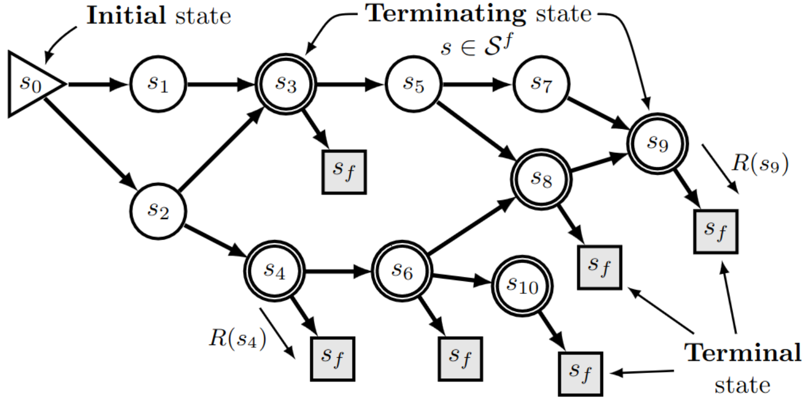]

---

## 3. Deep learning policy

.context35[GFlowNet learns a sampling policy $\pi(x)$ proportional to the reward $R(x)$.]

.orange[Tetris figure here showing flows.]

--

* Analogous to water-flow in pipes.
* Trajectory Flow $F(\tau)$ denotes probability mass assigned to trajectory $\tau$.
* State Flow $F(s)$ is the flow of all trajectories passing through the state $s$.
* Edge Flow $F(s\rightarrow s')$ is the flow through a particular edge $s\rightarrow s'$.
* Forward Policy $P_F$: $P\_F(s'|s) = \frac{F(s\rightarrow s')}{F(s)}$
* Backward Policy $P_B$: $P\_B(s|s') = \frac{F(s\rightarrow s')}{F(s')}$

.center[]

.references[
Bengio et al. [Flow network based generative models for non-iterative diverse candidate generation](https://arxiv.org/abs/2106.04399), NeurIPS, 2021. 
]

---

## Principle of conservation as a training objective

.right-column-33[.center[]]

.left-column-66[
**Consistent Flow**:  Flow $F$ satisfies the _flow consistency equation_
$$\sum\_{s' \in \text{Parents}(s)} F\_\theta(s' \rightarrow s) = \sum\_{s'' \in \text{Children}(s)} F\_\theta(s \rightarrow s'')$$
]

.references[
Bengio et al. [Flow network based generative models for non-iterative diverse candidate generation](https://arxiv.org/abs/2106.04399), NeurIPS, 2021. 
]

--
.left-column-66[
**Theorem**: For a consistent flow $F$ with terminal flow set as the reward $F(x\rightarrow s_f)=R(x)$, the forward policy samples $x$ proportionally to $R(x)$:

$$\pi(x) = \frac{R(x)}{Z}\propto R(x)$$
]

---

## Principle of conservation as a training objective

$$\sum\_{s' \in \text{Parent}(s)} F\_\theta(s' \rightarrow s) = \sum\_{s'' \in \text{Child}(s)} F\_\theta(s \rightarrow s'')$$

* **Flow Matching Objective**: $$\mathcal{L}\_{FM}(s; \theta) = \left(\log \frac{\sum\_{s'\in \text{Parent}(s)} F\_\theta(s'{\rightarrow} s)}{\sum\_{s'' \in \text{Child}(s)}F\_\theta(s{\rightarrow} s'')}\right)^2$$

--
* **Trajectory Balance** (better credit assignment): $$\mathcal{L}\_{TB} (\tau;\theta) = \left(\log \frac{Z\_\theta \prod\_{s{\rightarrow} s' \in \tau}P\_{F\_\theta}(s'|s)}{R(x)\prod\_{s\rightarrow s' \in \tau} P\_{B\_\theta}(s|s') }\right)^2$$

.references[
Malkin et al. [Trajectory balance: Improved credit assignment in GFlowNets](https://arxiv.org/abs/2201.13259), NeurIPS, 2022. 
]

---

## Results
### Tetris GFlowNets

.context[At convergence, the sampling policy $\pi_{\theta}(x)$ should be proportional to the reward $R(x)$.]

In order to increase the probability of sampling the five modes of the reward, I use the reward function $R(X) = \varepsilon(x)^4$, where $\varepsilon(x)$ is the Tetris score function that counts the number of occupied cells.

.center[

  

  <figure>
      
  </figure>
  

  

  <figure>
      
  </figure>
  

  

  <figure>
      
  </figure>
  

  

  <figure>
      
  </figure>
  

  

  <figure>
      
  </figure>
  

]

---

count: false

## Results
### Tetris GFlowNets

.context[At convergence, the sampling policy $\pi_{\theta}(x)$ should be proportional to the reward $R(x)$.]

In order to increase the probability of sampling the five modes of the reward, I use the reward function $R(X) = \varepsilon(x)^4$, where $\varepsilon(x)$ is the Tetris score function that counts the number of occupied cells.

.center[

  

  <figure>
      
    <figcaption>$\pi(x) = 8.12~\%$</figcaption>
  </figure>
  

  

  <figure>
      
    <figcaption>$\pi(x) = 8.96~\%$</figcaption>
  </figure>
  

  

  <figure>
      
    <figcaption>$\pi(x) = 8.61~\%$</figcaption>
  </figure>
  

  

  <figure>
      
    <figcaption>$\pi(x) = 9.16~\%$</figcaption>
  </figure>
  

  

  <figure>
      
    <figcaption>$\pi(x) = 8.39~\%$</figcaption>
  </figure>
  

]

.conclusion[After training, the learnt policy approximates the reward function and the GFlowNet samples multiple (diverse) modes with high probability.]

---

## Results
### Systematic generalisation

.context[We have hypothesised that thanks to compositionality and deep learning, GFlowNets may generalise seen patterns to unseen regions of the sample space.]

The potential of GFlowNets for systematic generalisation has not been systematically explored yet.

.center[]

---

count: false

## Results
### Systematic generalisation

.context[We have hypothesised that thanks to compositionality and deep learning, GFlowNets may generalise seen patterns to unseen regions of the sample space.]

I trained a Tetris GFlowNet by excluding samples with pieces in the upper half from the training batches.

.left-column[
.center[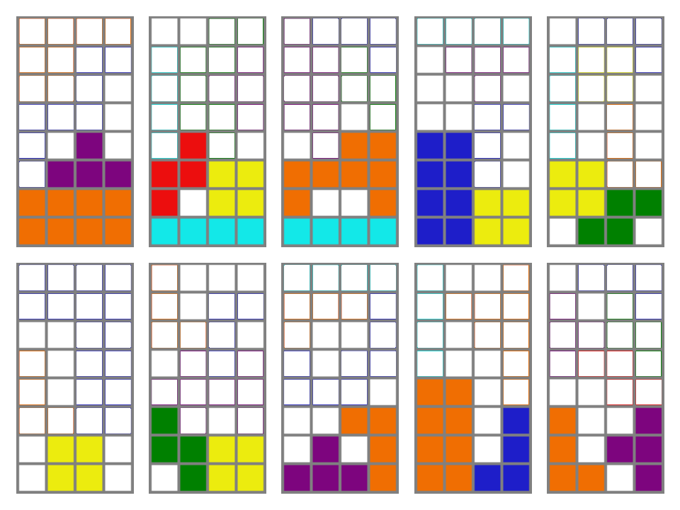

Training samples
]
]

--

.right-column[
.center[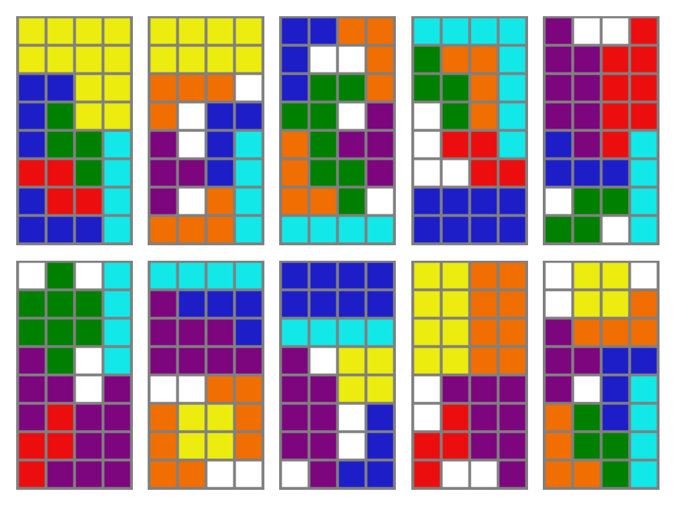

GFN samples post-training
]
]

---

## Why Tetris for scientific discovery?

.context35[The "Tetris problem" involves .highlight1[sampling from an unknown distribution] in a .highlight1[discrete, high-dimensional, combinatorially large space].]

---

count: false

## Why Tetris for scientific discovery?
### Biological sequence design

.smaller[Proteins, antimicrobial peptides (AMP) and DNA can be represented as sequences of amino acids or nucleobases.]

.context35[The "Tetris problem" involves sampling from an unknown distribution in a discrete, high-dimensional, combinatorially large space]

.center[]

.references[
* Jain et al. [Biological Sequence Design with GFlowNets](https://arxiv.org/abs/2203.04115), ICML, 2022. 
* Hernandez-Garcia, Saxena et al. [Multi-fidelity active learning with GFlowNets](https://arxiv.org/abs/2306.11715). RealML, NeurIPS 2023.
]

--

.left-column-66[
.dnag[`G`].dnaa[`A`].dnag[`G`].dnag[`G`].dnag[`G`].dnac[`C`].dnag[`G`].dnaa[`A`].dnac[`C`].dnag[`G`].dnag[`G`].dnat[`T`].dnaa[`A`].dnac[`C`].dnag[`G`].dnag[`G`].dnaa[`A`].dnag[`G`].dnac[`C`].dnat[`T`].dnac[`C`].dnat[`T`].dnag[`G`].dnac[`C`].dnat[`T`].dnac[`C`].dnac[`C`].dnag[`G`].dnat[`T`].dnat[`T`].dnaa[`A`] 
.dnat[`T`].dnac[`C`].dnaa[`A`].dnac[`C`].dnac[`C`].dnat[`T`].dnac[`C`].dnac[`C`].dnac[`C`].dnag[`G`].dnaa[`A`].dnag[`G`].dnac[`C`].dnaa[`A`].dnaa[`A`].dnat[`T`].dnaa[`A`].dnag[`G`].dnat[`T`].dnat[`T`].dnag[`G`].dnat[`T`].dnaa[`A`].dnag[`G`].dnag[`G`].dnac[`C`].dnaa[`A`].dnag[`G`].dnac[`C`].dnag[`G`].dnat[`T`].dnac[`C`].dnac[`C`].dnat[`T`].dnaa[`A`].dnac[`C`].dnac[`C`].dnag[`G`].dnat[`T`].dnat[`T`].dnac[`C`].dnag[`G`] 
.dnac[`C`].dnat[`T`].dnaa[`A`].dnac[`C`].dnag[`G`].dnac[`C`].dnag[`G`].dnat[`T`].dnac[`C`].dnat[`T`].dnac[`C`].dnat[`T`].dnat[`T`].dnat[`T`].dnac[`C`].dnag[`G`].dnag[`G`].dnag[`G`].dnag[`G`].dnag[`G`].dnat[`T`].dnat[`T`].dnaa[`A`] 
.dnat[`T`].dnat[`T`].dnag[`G`].dnac[`C`].dnaa[`A`].dnag[`G`].dnaa[`A`].dnag[`G`].dnag[`G`].dnat[`T`].dnat[`T`].dnaa[`A`].dnaa[`A`].dnac[`C`].dnag[`G`].dnac[`C`].dnag[`G`].dnac[`C`].dnaa[`A`].dnat[`T`].dnag[`G`].dnac[`C`].dnag[`G`].dnaa[`A`].dnac[`C`].dnat[`T`].dnag[`G`].dnag[`G`].dnag[`G`].dnag[`G`].dnat[`T`].dnat[`T`].dnaa[`A`].dnag[`G`].dnat[`T`].dnaa[`A`].dnag[`G`].dnat[`T`].dnac[`C`].dnag[`G`].dnaa[`A`].dnaa[`A`].dnac[`C`].dnaa[`A`].dnat[`T`].dnaa[`A`].dnat[`T`].dnaa[`A`].dnat[`T`].dnat[`T`].dnag[`G`].dnaa[`A`].dnat[`T`].dnaa[`A`].dnaa[`A`].dnaa[`A`].dnac[`C`].dnaa[`A`] 
.dnag[`G`].dnac[`C`].dnat[`T`].dnac[`C`].dnag[`G`].dnac[`C`].dnat[`T`].dnat[`T`].dnaa[`A`].dnag[`G`].dnag[`G`].dnag[`G`].dnac[`C`].dnac[`C`].dnat[`T`].dnac[`C`].dnag[`G`].dnaa[`A`].dnac[`C`].dnat[`T`].dnac[`C`].dnac[`C`].dnat[`T`].dnac[`C`].dnat[`T`].dnag[`G`].dnaa[`A`].dnaa[`A`].dnat[`T`].dnag[`G`].dnag[`G`].dnaa[`A`].dnag[`G`].dnat[`T`].dnag[`G`].dnat[`T`].dnat[`T`].dnac[`C`].dnaa[`A`].dnat[`T`].dnac[`C`].dnag[`G`].dnaa[`A`].dnaa[`A`].dnat[`T`].dnag[`G`].dnag[`G`].dnaa[`A`].dnag[`G`].dnat[`T`].dnag[`G`] 
]

--

.right-column-33[
.conclusion[Biological sequences can be generated by GFlowNet by adding one or multiple bases at a time.]
]

---

## Why Tetris for scientific discovery?
### Molecular generation

.smaller[Small molecules can be represented by the combination of fragments.]

.context35[The "Tetris problem" involves sampling from an unknown distribution in a discrete, high-dimensional, combinatorially large space]

.center[]

.references[
* Jain et al. [GFlowNets for AI-Driven Scientific Discovery](https://arxiv.org/abs/2302.00615). Digital Discovery, Royal Society of Chemistry, 2023.
* Hernandez-Garcia, Saxena et al. [Multi-fidelity active learning with GFlowNets](https://arxiv.org/abs/2306.11715). RealML, NeurIPS 2023.
]

---

## Systematic generalisation

.orange[Consider slide about systematic generalisation]

---

##  GFlowNet extensions
### Multi-objective GFlowNets

We have extended GFlowNets to handle multi-objective optimisation and not only cover the Pareto front but also sample diverse objects at each pointin the Pareto front.

.center[

]

.references[
Jain et al. [Multi-Objective GFlowNets](https://arxiv.org/abs/2210.12765), ICML, 2023. 
]

---

##  GFlowNet extensions
### Continuous GFlowNets

We have generalised the theory and implementation of GFlowNets to encompass both discrete and continuous or hybrid state spaces. 

.center[]

.references[
Lahlou et al. [A Theory of Continuous Generative Flow Networks](https://arxiv.org/abs/2301.12594), ICML, 2023. 
]

---

##  GFlowNet applications
### Molecular conformation generation

We have proposed a continuous GFlowNets algorithm for sampling conformations of small molecules from the Boltzmann distribution, as determined by the molecule’s energy.

.references[
Volokhova, Koziarski et al. [Towards equilibrium molecular conformation generation with GFlowNets](https://arxiv.org/abs/2310.14782), Digital Discovery, 2024. 
]

--

.center[]

---

##  GFlowNet applications
### Molecular conformation generation

We have proposed a continuous GFlowNets algorithm for sampling conformations of small molecules from the Boltzmann distribution, as determined by the molecule’s energy.

.references[
Volokhova, Koziarski et al. [Towards equilibrium molecular conformation generation with GFlowNets](https://arxiv.org/abs/2310.14782), Digital Discovery, 2024. 
]

.left-column[.center[
  <figure>
    
    <figcaption>Alanine dipeptide's energy landscape (KDE)</figcaption>
  </figure>
]]

--

.right-column[.center[
  <figure>
    
    <figcaption>GFlowNet's learnt distribution (KDE)</figcaption>
  </figure>
]]

---

##  GFlowNet Python package

.highlight2[Open source GFlowNet implementation]: [github.com/alexhernandezgarcia/gflownet](https://github.com/alexhernandezgarcia/gflownet)

--

* A key design principle is the simplicity to create new environments.
* Current environments: Tetris, hyper-grid, hyper-cube, hyper-torus, scrabble, crystals, molecules, DNA...
* Discrete and continuous environments
* Easy to extend flexibly
* Results visualisation on WandDB

--

 
Research articles supported by this GFlowNet package:
.references[
* Lahlou et al. [A Theory of Continuous Generative Flow Networks](https://arxiv.org/abs/2301.12594), ICML, 2023. 
* Hernandez-Garcia, Saxena et al. [Multi-fidelity active learning with GFlowNets](https://arxiv.org/abs/2306.11715). RealML, NeurIPS 2023.
* Mila AI4Science et al. [Crystal-GFN: sampling crystals with desirable properties and constraints](https://arxiv.org/abs/2310.04925). AI4Mat, NeurIPS 2023 (spotlight).
* Volokhova, Koziarski et al. [Towards equilibrium molecular conformation generation with GFlowNets](https://arxiv.org/abs/2310.14782). Digital Discovery, NeurIPS 2023.
]

---

name: title
class: title, middle

### Crystal-GFN: GFlowNets for materials discovery

.center[]

---

## What are crystals?

Definition: A crystal or crystalline solid is a solid material whose constituents (such as atoms, molecules, or ions) are arranged in a .highlight1[highly ordered microscopic structure], forming .highlight1[a crystal lattice that extends in all directions].

.left-column[
.center[]
]
.right-column[
.center[]
]

--

Here, we are concerned mainly with _inorganic crystals_, where the constituents are atoms or ions.

--

A crystal structure is characterized by its .highlight1[unit cell], a small imaginary box containing atoms in a specific spatial arrangement with certain symmetry. The unit cell repeats iself periodically in all directions.

---

## Why do we care about crystals?

.context35[Materials discovery can help reduce greenhouse gas emissions in multiple sectors.]

--

 
Many solid state materials are crystal structures and they are a core component of:

* Electrocatalysts for fuel cells, hydrogen storage, industrial chemical reactions, carbon capture, etc.
* Solid electrolytes for batteries.
* Thin film materials for photovoltaics.
* ...

--

However, .highlight1[material modelling is very challenging]:
* Limited data: only about 200 K known inorganic materials, but potentially $10^{180}$ possible stable materials (for reference: more than a billion molecules are known)
* Sparsity: .highlight2[stable materials] only exist in a low-dimensional subspace of all possible 3D arrangements.

--

.conclusion[There is a need for efficient generative models of crystal structures.]

---

## A domain-inspired approach
### Crystal structure parameters

.context[Most previous works tackle crystal structure generation in the space of atomic coordinates.]

--

Instead of optimising the atom positions by learning from a small data set, we draw .highlight1[inspiration from theoretical crystallography to sample crystals in a lower-dimensional space of crystal structure parameters].

--

.highlight2[Space group]: symmetry operations of a repeating pattern in space that leave the pattern unchanged.

--

.center[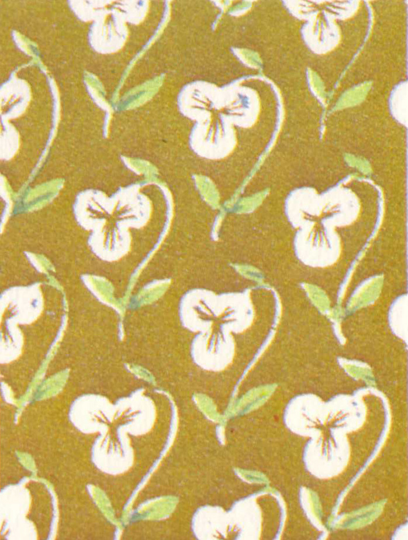]

---

## A domain-inspired approach
### Crystal structure parameters

.context[Most previous works tackle crystal structure generation in the space of atomic coordinates.]

Instead of optimising the atom positions by learning from a small data set, we draw .highlight1[inspiration from theoretical crystallography to sample crystals in a lower-dimensional space of crystal structure parameters].

.highlight2[Space group]: symmetry operations of a repeating pattern in space that leave the pattern unchanged.

.center[]

---

## A domain-inspired approach
### Crystal structure parameters

.context[Most previous works tackle crystal structure generation in the space of atomic coordinates.]

Instead of optimising the atom positions by learning from a small data set, we draw .highlight1[inspiration from theoretical crystallography to sample crystals in a lower-dimensional space of crystal structure parameters].

.highlight2[Space group]: symmetry operations of a repeating pattern in space that leave the pattern unchanged.

.center[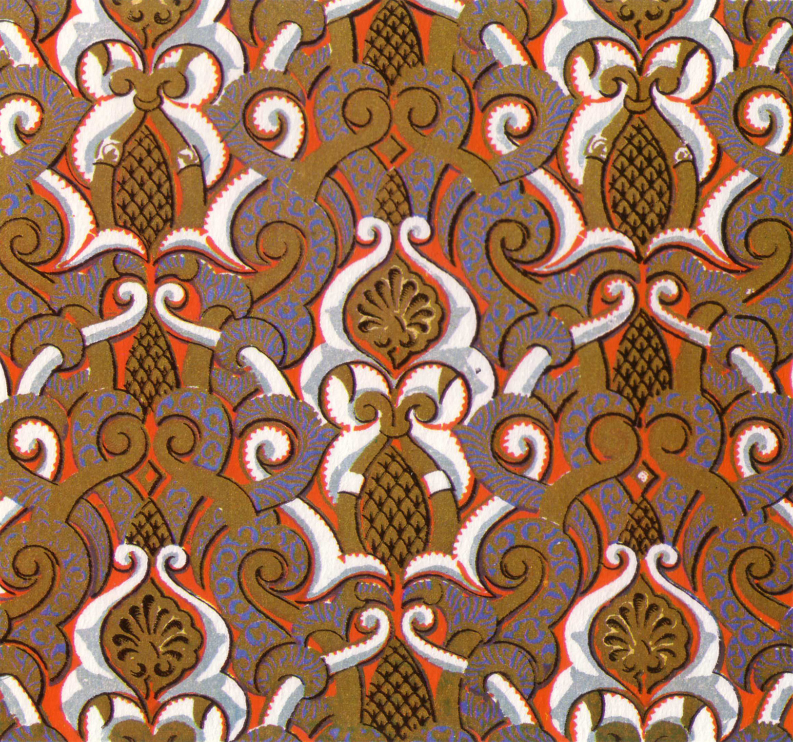]

---

## A domain-inspired approach
### Crystal structure parameters

.context[Most previous works tackle crystal structure generation in the space of atomic coordinates.]

Instead of optimising the atom positions by learning from a small data set, we draw .highlight1[inspiration from theoretical crystallography to sample crystals in a lower-dimensional space of crystal structure parameters].

.highlight2[Space group]: symmetry operations of a repeating pattern in space that leave the pattern unchanged.

.center[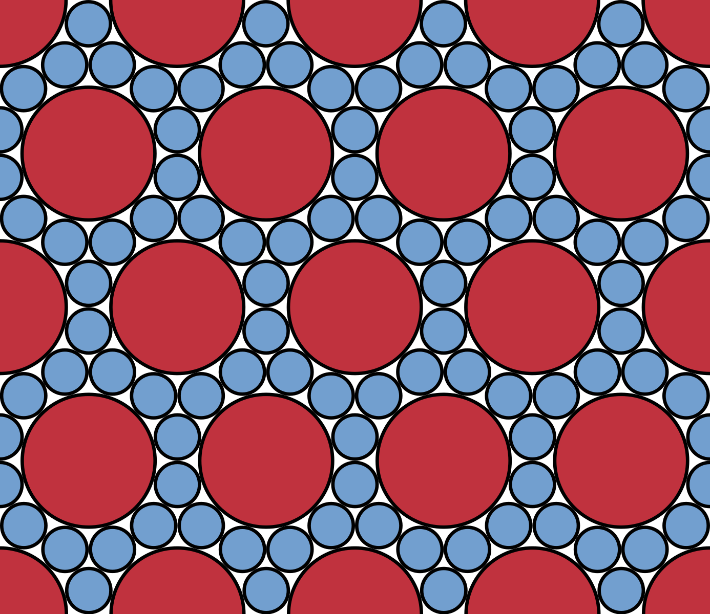]

---

## A domain-inspired approach
### Crystal structure parameters

.context[Most previous works tackle crystal structure generation in the space of atomic coordinates.]

Instead of optimising the atom positions by learning from a small data set, we draw .highlight1[inspiration from theoretical crystallography to sample crystals in a lower-dimensional space of crystal structure parameters].

.highlight2[Space group]: symmetry operations of a repeating pattern in space that leave the pattern unchanged.

- There are 17 symmetry groups in 2 dimensions (wallpaper groups).
- There are 230 space groups in 3 dimensions.

---

## A domain-inspired approach
### Crystal structure parameters

.context[Most previous works tackle crystal structure generation in the space of atomic coordinates.]

Instead of optimising the atom positions by learning from a small data set, we draw .highlight1[inspiration from theoretical crystallography to sample crystals in a lower-dimensional space of crystal structure parameters].

.highlight2[Lattice system]: all 230 space groups can be classified into one of the 7 lattices.

.center[

  

  <figure>
      
    <figcaption><small>Triclinic</small></figcaption>
  </figure>
  

  

  <figure>
      
    <figcaption><small>Monoclinic</small></figcaption>
  </figure>
  

  

  <figure>
      
    <figcaption><small>Orthorhombic</small></figcaption>
  </figure>
  

  

  <figure>
      
    <figcaption><small>Tetragonal</small></figcaption>
  </figure>
  

  

  <figure>
      
    <figcaption><small>Rhombohedral</small></figcaption>
  </figure>
  

  

  <figure>
      
    <figcaption><small>Hexagonal</small></figcaption>
  </figure>
  

  

  <figure>
      
    <figcaption><small>Cubic</small></figcaption>
  </figure>
  

]

---

## A domain-inspired approach
### Crystal structure parameters

.context[Most previous works tackle crystal structure generation in the space of atomic coordinates.]

Instead of optimising the atom positions by learning from a small data set, we draw .highlight1[inspiration from theoretical crystallography to sample crystals in a lower-dimensional space of crystal structure parameters].

.highlight2[Lattice parameters]: The lattice's size and shape is characterised by 6 parameters: .highlight1[$a, b, c, \alpha, \beta, \gamma$].

.center[]

---

## GFlowNet approach
### Advantages

.context[We generate materials in the lower-dimensional space of crystal structure parameters.]

* Constructing materials by their crystal structure parameters allows us to introduce .highlight1[physicochemical and geometric _hard_ constraints].

--
* .highlight1[Searching in the lower-dimensional space] of crystal structure parameters may be more efficient than in the space of atom coordinates. Particularly suitable in active learning .cite[(Hernandez-Garcia, Saxena et al., 2023)].
.references[
Hernandez-Garcia, Saxena et al. [Multi-fidelity active learning with GFlowNets](https://arxiv.org/abs/2306.11715). arXiv 2306.11715, 2023 (RealML workshop at NeurIPS).
]

--
* Provided we have access to a predictive model of a material property, we can .highlight1[flexibly generate materials with desirable properties].

--
* We can .highlight1[flexibly sample materials with specific characteristics, such as composition or space group]. 

---

## Crystal-GFlowNet
### Main properties

* .highlight1[State space]: 
1. **Space group**: 230 groups, subdivided into crystal system, lattice system, point symmetry and space group (discrete)
2. **Composition**: how many atoms of which elements (discrete)
3. **Lattice parameters**: 6 parameters, $a, b, c, \alpha, \beta, \gamma$ (continuous)

--
* .highlight1[Action space]: discrete and continuous movements in the subspace of the state space, with constraints.

--
* .highlight1[Constraints]:
    * Charge neutrality of the composition.
    * Compatibility of composition and space group.
    * Hierarchical structure of the space group.
    * Compatibility of lattice parameters and lattice system.

---

## Crystal-GFlowNet
### Schematic

.center[]

---

count: false

## Crystal-GFlowNet
### Schematic

.center[]

---

count: false

## Crystal-GFlowNet
### Schematic

.center[]

---

count: false

## Crystal-GFlowNet
### Schematic

.center[]

---

count: false

## Crystal-GFlowNet
### Schematic

.center[]

---

count: false

## Crystal-GFlowNet
### Schematic

.center[]

---

count: false

## Crystal-GFlowNet
### Schematic

.center[]

---

count: false

## Crystal-GFlowNet
### Schematic

.center[]

---

## Crystal-GFlowNet
### Properties

We can train a Crystal-GFN with any reward function, provided it is computationally tractable. Therefore, we can use it to .highlight1[generate materials with different properties]. 
--
We have tested the following properties:

- .highlight2[Formation energy] per atom [eV/atom], via a pre-trained machine learning model.
- .highlight2[Electronic band gap] [eV] (squared distance to a target value, 1.34 eV), via a pre-trained machine learning model.
- Unit cell .highlight2[density] [g/cm3], calculated _exactly_ from the GFN outputs.

---

## Crystal-GFlowNet
### Proxy ML models of the formation energy and the band gap

- MLP architecture

--
- Inputs:
    - Space group embedding
    - Composition embedding as in PhAST (Duval et al., 2022)
    - Standardised lattice parameters
--
- Trained on MatBench (Materials Project)
    - Mean absolute error: 
        - Formation energy: 0.10 eV/atom $\pm$ 0.005
        - Band gap: 0.321 eV $\pm$ 0.003
--
- Reward: $R(x) = \exp(-\frac{MLP(x)}{T})$

---

## Results
### Formation energy

.center[]

---

count: false

## Results
### Formation energy

.center[]

---

count: false

## Results
### Formation energy

.center[]

---

count: false

## Results
### Formation energy

.center[]

---

count: false

## Results
### Formation energy

.context[.highlight1[After training, Crystal-GFN samples structures with even lower formation energy [eV/atom] than the validation set.]]

.center[]

---

## Results
### Band gap

.center[]

---

count: false

## Results
### Band gap

.center[]

---

count: false

## Results
### Band gap

.center[]

---

count: false

## Results
### Band gap

.center[]

---

count: false

## Results
### Band gap

.context[.highlight1[After training, Crystal-GFN samples structures with band gap [eV] around the target value.]]

.center[]

---

## Results
### Restricted sampling

We restrict the sampling space at sampling time:

- A: The composition is restricted to only elements Fe and O, with a maximum of 10 atoms per element.
- B: We sample in the ternary space for Li-Mn-O, keeping the element count to maximum 16 atoms.
- C: We restrict the space groups to only cubic lattices.
- D: We restrict the range of the lattice parameters to lengths between 10 and 20 angstroms and angles between 75 and 135 degrees.

---

## Results
### Restricted sampling

.center[]

---

## Results
### Diversity

.context[.highlight2[Diversity] is key in materials discovery.]

Analysis of 10,000 sampled crystals and the top-100 with lowest formation energy.

- All 10,000 samples are unique.
- All crystal systems, lattice systems and point symmetries found in the 10,000 samples.
    - 4 out of 8 crystal-lattice systems in the top-100.
    - 4 out of the 5 point symmetries in the top-100.
- All 22 elements found in the 10,000 samples.
    - 15 out of 22 elements in the top-100.
- 73 out of 113 space groups (65 %) found in the 10,000 samples
    - 19 out of 113 space groups in the top-100.

---

## Crystal-GFN
### Summary and conclusions

.references[
* Mila AI4Science et al. [Crystal-GFN: sampling crystals with desirable properties and constraints](https://arxiv.org/abs/2310.04925). AI4Mat, NeurIPS 2023 (spotlight).
]

* Discovering new crystal structures with desirable properties can help mitigate the climate crisis.

--
* There are infinitely many conceivable crystals. Only a few are stable. Only a few stable crystals have interesting properties. This is a really hard problem.

--
* Crystal-GFN introduces .highlight1[physicochemical and structural constraints], reducing the search space.
    * Crystal-GFN was trained in 30 hours in a CPU-only machine.
--
* Our results show that we can generate .highlight1[diverse, high scoring samples with the desired constraints].

--
* The .highlight1[framework can be flexibly extended] with more constraints, crystal structure descriptors (atomic positions) and other properties. 

---

## FAENet

.orange[Slide about FAENet]

- Efficient proxy for electrocatalyst
- Show scientific discovery loop figure to illustrate present and future work and as a bridge to multi-fidelity.

---

name: title
class: title, middle

### Multi-fidelity active learning

.center[]

---

## Why multi-fidelity?

.context35[We had described the scientific discovery loop as a cycle with one single oracle.]

  
.center[]

---

count: false

## Why multi-fidelity?

.context35[However, in practice, multiple oracles (models) of different fidelity and cost are available in scientific applications.]

  
.center[]

---

## Why multi-fidelity?

.context[In many scientific applications we have access to multiple approximations of the objective function.]

.left-column[
For example, in material discovery:

* Synthesis of a material and characterisation of a property in the lab
* Density Functional Theory (DFT)
* An ensemble of large graph neural networks trained on DFT data
* An efficient, smaller neural network
]

--

.right-column[.center[
  <figure>
    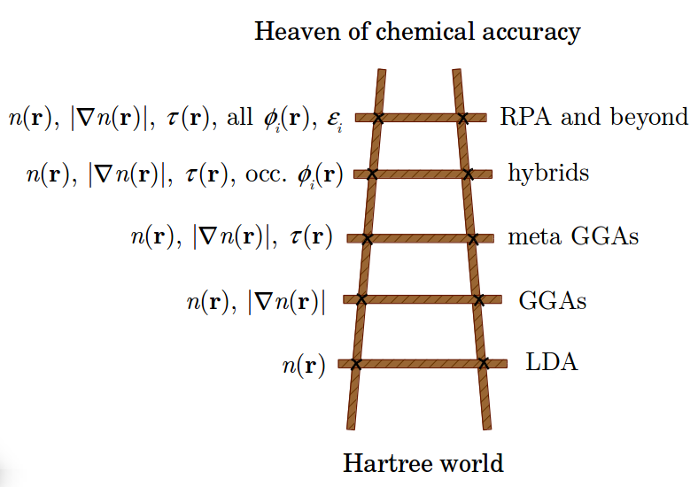
    <figcaption>Jacob's ladder of density functional approximations</figcaption>
  </figure>
]]

--

.conclusion[However, current machine learning methods cannot efficiently leverage the availability of multiple oracles and multi-fidelity data. Especially with .highlight1[structured, large, high-dimensional search spaces].]

---

## Our multi-fidelity active learning algorithm

.center[]

---

count: false

## Our multi-fidelity active learning algorithm

.center[]

---

count: false

## Our multi-fidelity active learning algorithm

.center[]

---

count: false

## Our multi-fidelity active learning algorithm

.center[]

---

count: false

## Our multi-fidelity active learning algorithm

.center[]

---

count: false

## Our multi-fidelity active learning algorithm

.center[]

---

count: false

## Our multi-fidelity active learning algorithm

.center[]

---

count: false

## Our multi-fidelity active learning algorithm

.center[]

---

count: false

## Our multi-fidelity active learning algorithm

.center[]

---

count: false

## Our multi-fidelity active learning algorithm

.center[]

---

count: false

## Our multi-fidelity active learning algorithm

.center[]

---

count: false

## Our multi-fidelity active learning algorithm

.center[]

---

count: false

## Our multi-fidelity active learning algorithm

.center[]

---

count: false

## Our multi-fidelity active learning algorithm

.center[]

---

## Multi-fidelity components
### Surrogate models

.context[A multi-fidelity active learning algorithm consists of multiple components that need to be adapted.]

--

* Small (synthetic) tasks: exact Gaussian Processes

--
* Larger-scale, benchmark tasks: .highlight1[Deep Kernel Learning with stochastic variational Gaussian processes]

.references[
* Wilson, Hu et al. [Deep Kernel Learning](https://arxiv.org/abs/1511.02222), AISTATS, 2016.
* Wu et al. [Practical multi-fidelity Bayesian optimization for hyperparameter tuning](https://arxiv.org/abs/1903.04703) , UAI, 2019.
]

--

Multi-fidelity kernel learning:

$$K(x, \tilde{x}, m, \tilde{m}) = K_1(x, \tilde{x}) \times K_2(m, \tilde{m})$$

* $K_1$: RBF kernel
* $K_2$: Downsampling kernel

---

## Multi-fidelity components
### Aquisition function

.context[A multi-fidelity active learning algorithm consists of multiple components that need to be adapted.]

--

#### Maximum Entropy Search (MES)

--

MES it aims to maximise the .highlight1[mutual information] between .highlight1[the value of the objective function $f$] when choosing point *x* and the .highlight1[maximum of the objective function, $f^{\star}$] (instead of considering the `arg max`).

--

The multi-fidelity variant is designed to select the .highlight1[candidate $x$ and the fidelity $m$ that maximise the mutual information] between $f_M^\star$ and the oracle at fidelity $m$, $f_m$ , weighted by the cost of the oracle $\lambda_m$.

$$\alpha(x, m) = \frac{1}{\lambda_{m}} I(f_M^\star; f_m | \mathcal{D})$$

.references[
* Moss et al. [GIBBON: General-purpose Information-Based Bayesian OptimisatioN](https://arxiv.org/abs/2102.03324), JMLR, 2021.
]

---

## Multi-fidelity components
## MF-GFlowNets

.context[A multi-fidelity active learning algorithm consists of multiple components that need to be adapted.]

--

Given a baseline GFlowNet with state space $\mathcal{S}$ and action space $\mathcal{A}$, .highlight1[we augment the state space with a new dimension for the fidelity] $\mathcal{M'} = \{0, 1, 2, \ldots, M\}$ (including $m = 0$, which corresponds to unset fidelity). 

--

The set of allowed transitions $\mathcal{A}_M$ is augmented such that a fidelity $m > 0$ of a trajectory (sample) must be selected once, and only once, from any intermediate state. This is meant to provide flexibility and improve generalisation.

--

Finished trajectories are the concatenation of an object $x$ and the fidelity $m$.

--

GFlowNet is trained with the acquisition function as reward function: $R(x) = g(\alpha(x, m))$.

---

## Experiments
### Baselines

.context[This is the .highlight1[first multi-fidelity active learning algorithm tested on biological sequence design and molecular design problems]. There did not exist baselines from the literature.]

--

 
* .highlight1[Random]: Quasi-random approach where the candidates and fidelities are picked randomly and the top $(x, m)$ pairs scored by the acquisition function are queried.

--
* .highlight1[Random fid. GFN]: GFlowNet with random fidelities, that is a variant of SF-GFN where the candidates are generated with the GFlowNet but the fidelities are picked randomly and a multi-fidelity acquisition function is used, to investigate the benefit of deciding the fidelity with GFlowNets.

--
* .highlight1[SF-GFN]: GFlowNet with highest fidelity oracle to establish a benchmark for performance without considering the cost-accuracy trade-offs.

--
* .highlight1[MF-PPO]: Instantiation of multi-fidelity Bayesian optimisation where the acquisition function is optimised using proximal policy optimisation (reinforcement learning).

---

## DNA aptamers

- GFlowNet adds one nucleobase (`A`, `T`, `C`, `G`) at a time up to length 30. This yields a design space of size $|\mathcal{X}| = 4^{30}$. 
- The objective function is the free energy estimated by a bioinformatics tool. 
- The (simulated) lower fidelity oracle is a transformer trained with 1 million sequences.

--

.center[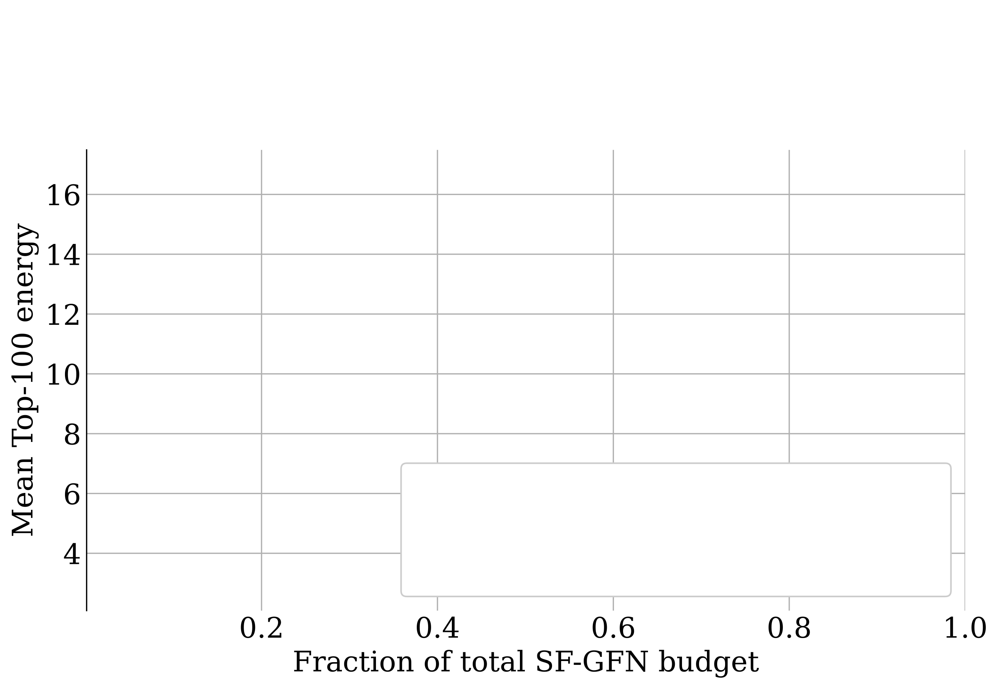]

---

count: false

## DNA aptamers

- GFlowNet adds one nucleobase (`A`, `T`, `C`, `G`) at a time up to length 30. This yields a design space of size $|\mathcal{X}| = 4^{30}$. 
- The objective function is the free energy estimated by a bioinformatics tool. 
- The (simulated) lower fidelity oracle is a transformer trained with 1 million sequences.

.center[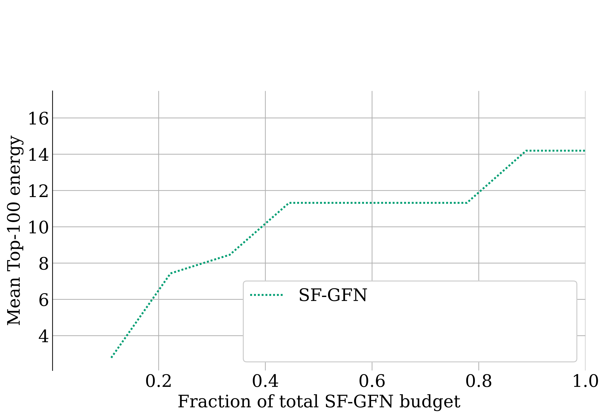]

---

count: false

## DNA aptamers

- GFlowNet adds one nucleobase (`A`, `T`, `C`, `G`) at a time up to length 30. This yields a design space of size $|\mathcal{X}| = 4^{30}$. 
- The objective function is the free energy estimated by a bioinformatics tool. 
- The (simulated) lower fidelity oracle is a transformer trained with 1 million sequences.

.center[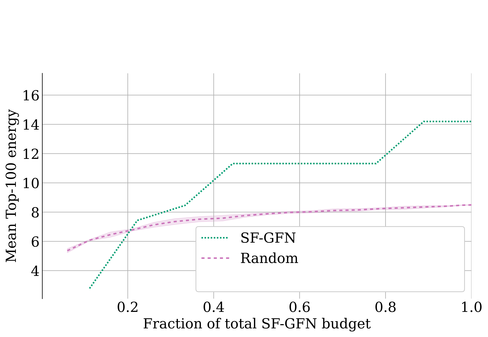]

---

count: false

## DNA aptamers

- GFlowNet adds one nucleobase (`A`, `T`, `C`, `G`) at a time up to length 30. This yields a design space of size $|\mathcal{X}| = 4^{30}$. 
- The objective function is the free energy estimated by a bioinformatics tool. 
- The (simulated) lower fidelity oracle is a transformer trained with 1 million sequences.

.center[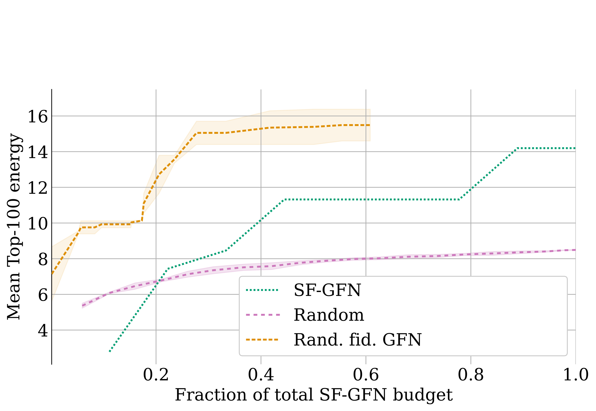]

---

count: false

## DNA aptamers

- GFlowNet adds one nucleobase (`A`, `T`, `C`, `G`) at a time up to length 30. This yields a design space of size $|\mathcal{X}| = 4^{30}$. 
- The objective function is the free energy estimated by a bioinformatics tool. 
- The (simulated) lower fidelity oracle is a transformer trained with 1 million sequences.

.center[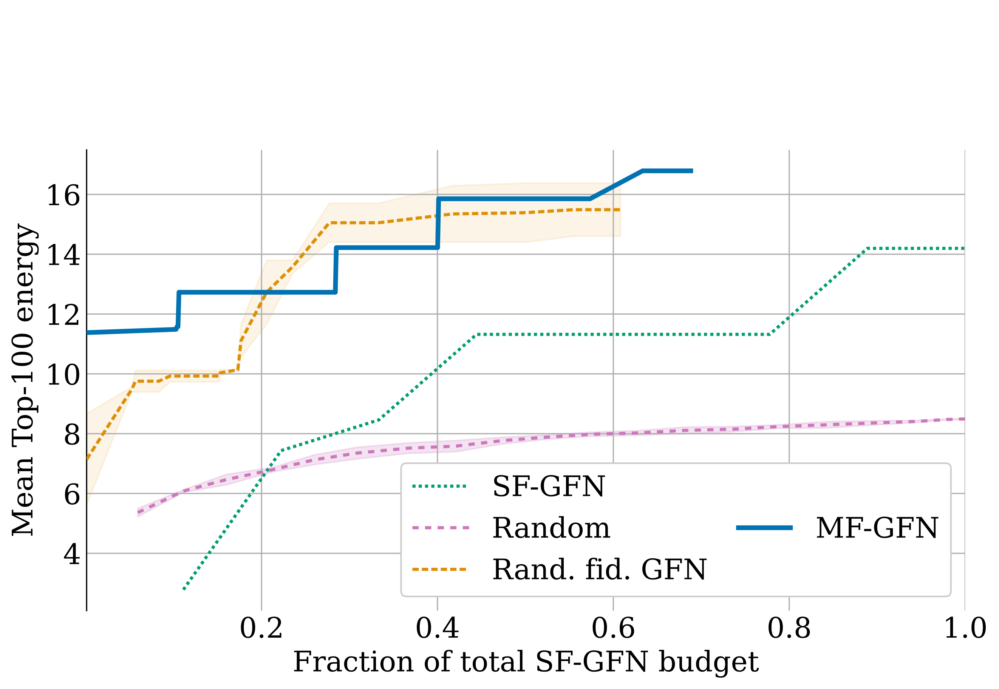]

---

count: false

## DNA aptamers

- GFlowNet adds one nucleobase (`A`, `T`, `C`, `G`) at a time up to length 30. This yields a design space of size $|\mathcal{X}| = 4^{30}$. 
- The objective function is the free energy estimated by a bioinformatics tool. 
- The (simulated) lower fidelity oracle is a transformer trained with 1 million sequences.

.center[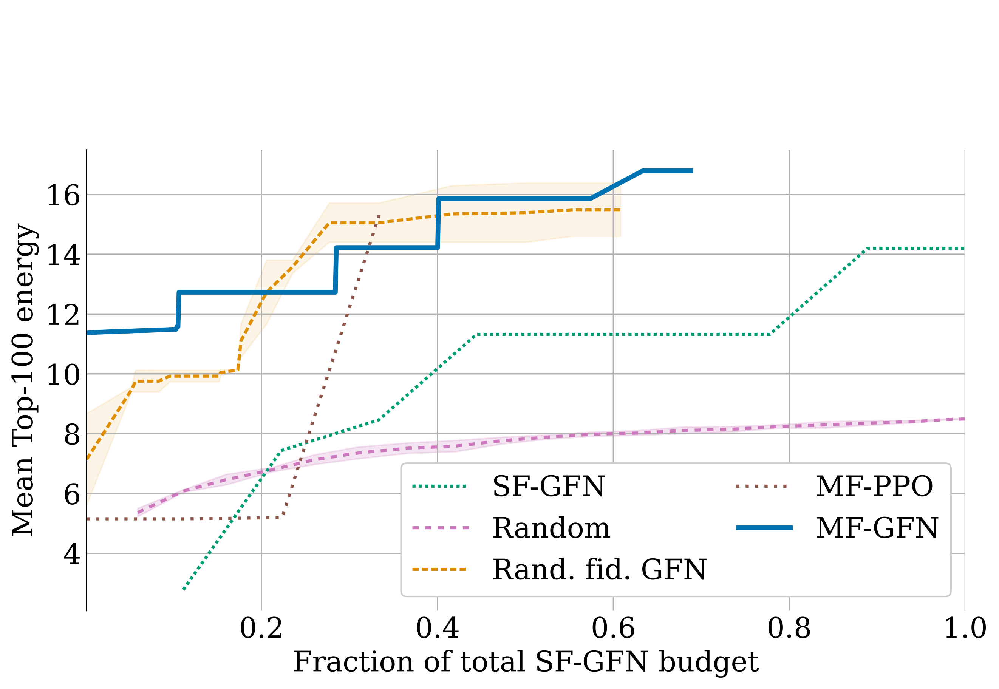]

---

count: false

## DNA aptamers

- GFlowNet adds one nucleobase (`A`, `T`, `C`, `G`) at a time up to length 30. This yields a design space of size $|\mathcal{X}| = 4^{30}$. 
- The objective function is the free energy estimated by a bioinformatics tool. 
- The (simulated) lower fidelity oracle is a transformer trained with 1 million sequences.

.center[]

---

count: false

## DNA aptamers

- GFlowNet adds one nucleobase (`A`, `T`, `C`, `G`) at a time up to length 30. This yields a design space of size $|\mathcal{X}| = 4^{30}$. 
- The objective function is the free energy estimated by a bioinformatics tool. 
- The (simulated) lower fidelity oracle is a transformer trained with 1 million sequences.

   
.conclusion[Our multi-fidelity algorithm discovers sequences with high scores with a fraction of the budget than the single-fidelity counterpart. High-scoring sequences are highly diverse, unlike those from the RL baseline.]

---

count: false

## Antimicrobial peptides (AMP)

- Protein sequences (20 amino acids) with variable length (max. 50).
- The oracles are 3 ML models trained with different subsets of data.

--

.center[]

---

## Small molecules

- Realistic experiments with experimental oracles and costs that reflect the computational demands (1, 3, 7).
- GFlowNet adds one SELFIES token (out of 26) at a time with variable length up to 64 ($|\mathcal{X}| > 26^{64}$). 
- Two properties: (negative) adiabatic ionisation potential (IP) and adiabatic electron affinity (EA). Relevant in organic semiconductors, photoredox catalysis and organometallic synthesis.

--

.left-column[.center[
  <figure>
    
    <figcaption>Ionisation potential task</figcaption>
  </figure>
]]

--

.right-column[.center[
  <figure>
    
    <figcaption>Electron affinity task</figcaption>
  </figure>
]]

---

## How does multi-fidelity help?

.context[Visualisation on the synthetic 2D Branin function task.]

.center[]

---

count: false

## How does multi-fidelity help?

.context[Visualisation on the synthetic 2D Branin function task.]

.center[]

---

count: false

## How does multi-fidelity help?

.context[Visualisation on the synthetic 2D Branin function task.]

.center[]

---

count: false

## How does multi-fidelity help?

.context[Visualisation on the synthetic 2D Branin function task.]

.center[]

---

## Multi-fidelity active learning with GFlowNets
### Summary and conclusions

.references[
* Hernandez-Garcia, Saxena et al. [Multi-fidelity active learning with GFlowNets](https://arxiv.org/abs/2306.11715). RealML, NeurIPS 2023.
]

* Current AI tools are not enough to truly utilize all the information and resources at our disposal.

--
* AI-driven scientific discovery demands learning methods that can .highlight1[efficiently discover diverse candidates in combinatorially large, high-dimensional search spaces].

--
* .highlight1[Multi-fidelity active learning with GFlowNets] enables .highlight1[cost-effective exploration] of large, high-dimensional and structured spaces, and discovers multiple, diverse modes of black-box score functions.

--
* This is to our knowledge the first algorithm capable of effectively leveraging multi-fidelity oracles to discover diverse biological sequences and molecules.

---

name: title
class: title, middle

## Overview of other relevant research projects

---

name: title
class: title, middle

## Raising climate awareness with AI-generated visualisations
### ThisClimateDoesNotExist.com 

.center[]

---

## Raising climate awareness
### .alpha0[Placeholder]

.context[People perceive the threat of climate change as temporally, geographically and socially distant.]

--

.center[.bigger[.highlight1[Could we help people visualise the effects of climate change in _their own backyard_?]]]

--

.left-column[
<figure>
	
  <figcaption>Montréal, Québec, Canada</figcaption>
</figure>
]
.right-column[
<figure>
	
  <figcaption>Berlin, Germany</figcaption>
</figure>
]
.left[
]
.right[
]

---

count: false

## Raising climate awareness
### .alpha0[Placeholder]

.context[People perceive the threat of climate change as temporally, geographically and socially distant.]

.center[.bigger[.highlight1[Could we help people visualise the effects of climate change in _their own backyard_?]]]

.left-column[
<figure>
	
  <figcaption>Montréal, Québec, Canada</figcaption>
</figure>
]
.right-column[
<figure>
	
  <figcaption>Berlin, Germany</figcaption>
</figure>
]
.left[
]
.right[
]

---

## Raising climate awareness
### A website to encourage climate change awareness and action

.context[Users can look for an address of their choice.]

---

count: false

## Raising climate awareness
### A website to encourage climate change awareness and action

.context[Obtain an AI-generated visualisation on a street photo.]

.center[]

---

## This Climate Does Not Exist

.references[
Schmidt et al. [ClimateGAN: Raising Climate Change Awareness by Generating Images of Floods](https://arxiv.org/abs/2110.02871v1), ICLR 2022.
]

--

- We developed a generative model of flood images, deployed "in the wild".

--
- ThisClimateDoesNotExist.com has been received .highlight1[hundreds of thousands of visitors] all around the globe.

--
- The project has been .highlight1[ covered by international media ] (Le Devoir, CBC, CNN, El País, La Repubblica...)

--
- We have collaborated with Prof. Erick Lachapelle (Département de science politique, UdeM) to study the .highlight1[cognitive, behavioural and emotional impact of visualising AI-generated images of climate impacts] (in preparation).

---

name: title
class: title, middle

### Increasing climate models resolution with hard-constrained deep learning

.center[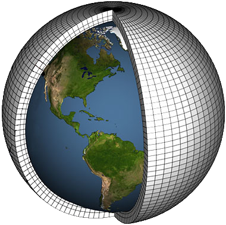]

---

## The importance of climate models

.highlight1[Definition]: Climate models simulate the interactions of factors the drive the climate via systems differential equations based on the basic laws of physics, fluid motion, and chemistry.

.left-column[
.center[]
]

--

.right-column[
- Accurate modeling of weather and climate is critical for taking effective action to combat climate change.
- The resolution of climate models is too coarse to guide local and regional policy making.
- Deep learning can be used to increase climate models resolution (.highlight1[_downscaling_]), akin to image super-resolution.
]

--

.conclusion[Climate model downscaling with deep learning can facilitate the use of global climate models at local and regional level.]

---

## Hard-constrained _downscaling_
### .alpha0[Placeholder]

.context35[Deep learning can be used to increase the resolution of climate models.]

The direct application of .highlight1[image-super resolution] deep learning to climate model downscaling can result in the .highlight1[violation of fundamental physical relationships].

.center[]

---

count: false

## Hard-constrained _downscaling_
### .alpha0[Placeholder]

.context35[Deep learning can be used to increase the resolution of climate models.]

We proposed a procedure to enforce .highlight1[mass conservation] between the low-resolution input and the super-resolution prediction.

.center[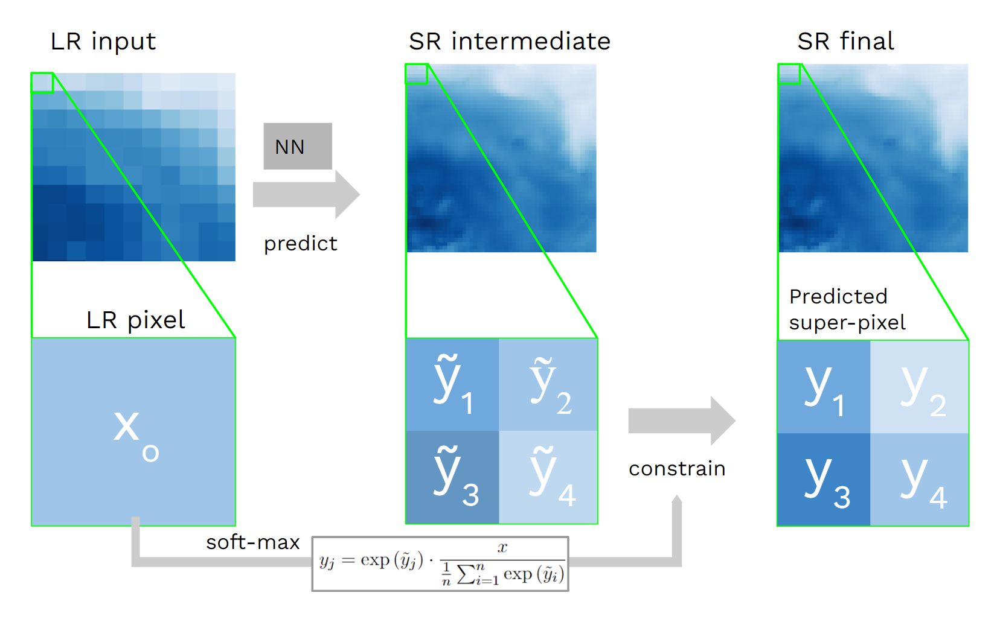]

.references[
Harder et al. [Hard-constrained deep learning for climate downscaling](https://jmlr.org/papers/v24/23-0158.html), JMLR 2023.
]

---

count: false

## Hard-constrained _downscaling_
### .alpha0[Placeholder]

.context35[Deep learning can be used to increase the resolution of climate models.]

We proposed a procedure to enforce .highlight1[mass conservation] between the low-resolution input and the super-resolution prediction.

.center[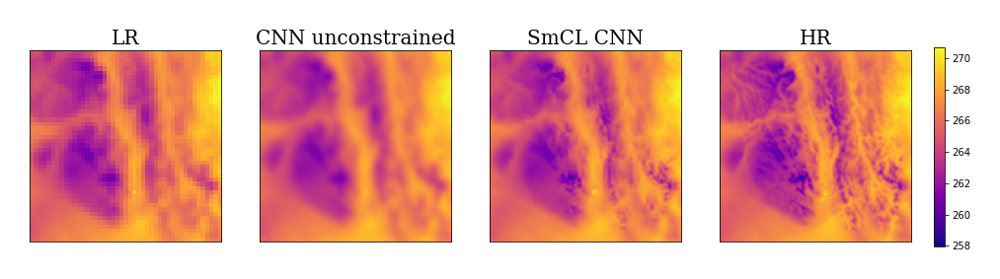]

.references[
Harder et al. [Hard-constrained deep learning for climate downscaling](https://jmlr.org/papers/v24/23-0158.html), JMLR 2023.
]

.conclusion[Hard constraints provide theoretical guarantees and even improved the performance.]

---

## Arbitrary resolution _downscaling_

.context35[Deep learning can be used to increase the resolution of climate models.]

 
Standard deep learning for climate downscaling is typically limited to the input and output resolutions specified at training time.

--

We proposed the use of [Fourier Neural Operators](https://arxiv.org/abs/2010.08895), which learn mappings in function spaces instead of Euclidean spaces, for arbitrary resolution climate downscaling: we train with mappings for a small upsampling factor, but the model can .highlight1[zero-shot downscale to arbitrary, unseen, higher resolutions].

.center[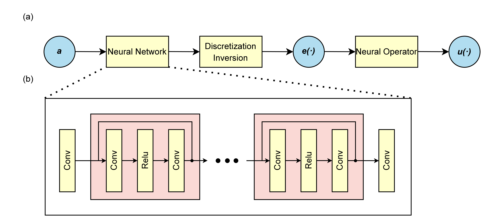]

.references[
Yang et al. [Fourier Neural Operators for arbitrary resolution climate data downscaling](https://arxiv.org/abs/2305.14452), arxiv:2305.14452, 2023.
]

---

name: title
class: title, middle

## Overall summary and conclusions

.center[]

---

## Summary and conclusions

.orange[Here goes a nice summary of all the contributions]

.highlight2[Open source code]: [github.com/alexhernandezgarcia/gflownet](https://github.com/alexhernandezgarcia/gflownet)

---

## Challenges and perspectives

.orange[Here go a few nice slides with a discussion of remaining challenges and my research plans.]

---

## Acknowledgements

.orange[Here goes a kind acknowledgement of my collaborators]

???

- Contrast between PhD (solo research) and postdoc (big team collaborations)

---

name: mlforscience-udem-feb24
class: title, middle

Alex Hernández-García (he/il/él)

.center[

&nbsp&nbsp&nbsp&nbsp

]

.footer[[alexhernandezgarcia.github.io](https://alexhernandezgarcia.github.io/) | [alex.hernandez-garcia@mila.quebec](mailto:alex.hernandez-garcia@mila.quebec)] 
.footer[[@alexhg@scholar.social](https://scholar.social/@alexhg)  | [@alexhdezgcia](https://twitter.com/alexhdezgcia) ]

.smaller[.footer[
Slides: [alexhernandezgarcia.github.io/slides/{{ name }}](https://alexhernandezgarcia.github.io/slides/{{ name }})
]]

---

## Supplementary slides

---

## About me
### My academic journey

.context35[.highlight1[PhD] work on deep learning, visual perception and computational neuroscience.]

I studied the .highlight1[role of data augmentation in the generalisation] of deep neural networks, its connection to regularisation and the differences between .highlight1[implicit and explicit regularisation].

.center[

]

.references[
- Hernandez-Garcia and König. [Data augmentation instead of explicit regularization](https://arxiv.org/abs/1806.03852). arxiv:1806.03852, 2018.
- Hernandez-Garcia and König. [Do deep nets really need weight decay and dropout?](https://arxiv.org/abs/1802.07042). arxiv:1802.07042, 2018.
- Hernandez-Garcia. [Data augmentation and image understanding](https://arxiv.org/abs/2012.14185). arxiv:2012.14185, 2020.
]

---

count: false

## About me
### My academic journey

.context35[.highlight1[PhD] work on deep learning, visual perception and computational neuroscience.]

I compared the representations learnt by deep networks trained with various levels of .highlight1[data augmentation and the representations in fMRI] measurements in the human visual cortex.

.left-column-33[
.center[
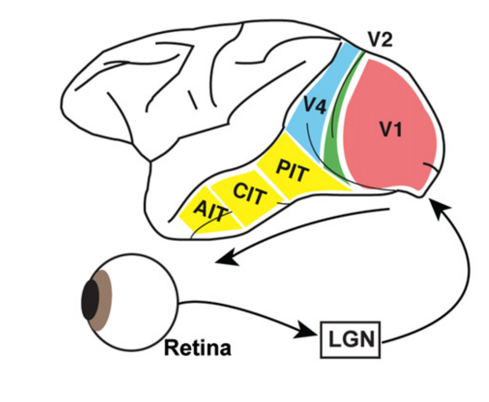
]]
.right-column-66[
.center[
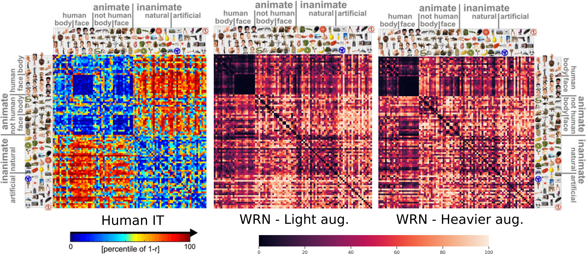
]]

.references[
- Hernandez-Garcia et al. [Deep neural networks trained with heavier data augmentation learn features closer to representations in hIT](https://ccneuro.org/2018/proceedings/1046.pdf). CCN, 2018.
- Hernandez-Garcia. [Data augmentation and image understanding](https://arxiv.org/abs/2012.14185). arxiv:2012.14185, 2020.
]

---

count: false

## About me
### My academic journey

.context35[.highlight1[PhD] work on deep learning, visual perception and computational neuroscience.]

I proposed a .highlight1[brain-inspired unsupervised, contrastive training objective to encourage representational invariance] to perceptually plausible image transformations - .highlight2[_data augmentation invariance_]. Note: work prior to Google's SimCLR paper.

.left-column[
.center[
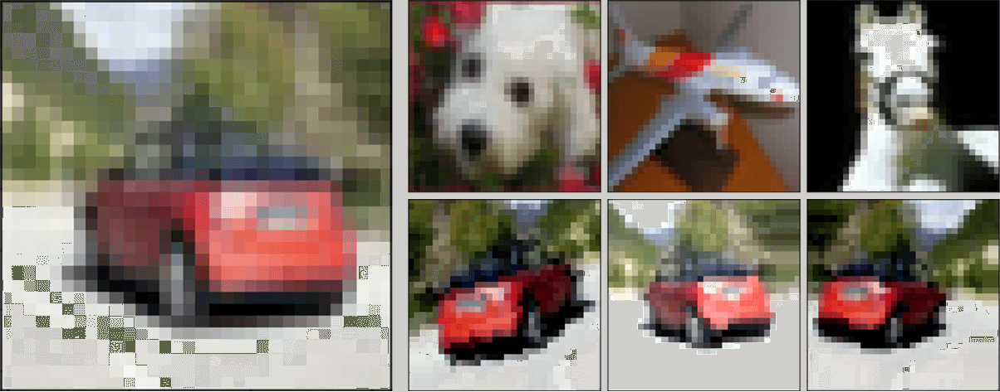
]]
.right-column[
.center[
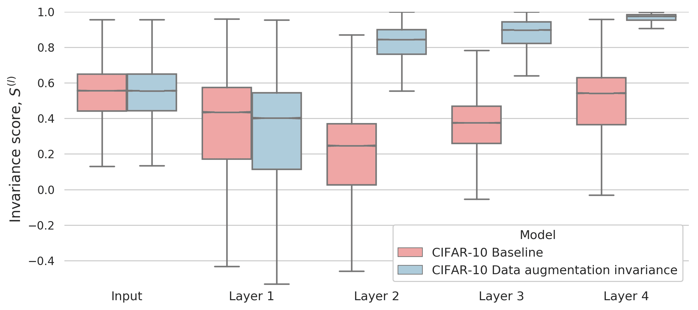
]]

.references[
- Hernandez-Garcia, König and Kietzmann. [Learning robust visual representations using data augmentation invariance](https://arxiv.org/abs/1806.03852). arxiv:1806.03852, 2018.
- Hernandez-Garcia. [Data augmentation and image understanding](https://arxiv.org/abs/2012.14185). arxiv:2012.14185, 2020.
]

---

name: title
class: title, middle

### Raising climate awareness with AI-generated visualisations

.center[]

---

## The need to raise awareness

There is a mismatch between the magnitude of the climate crisis and the public's concern about it.

.center[
<figure>
	
  .smaller[<figcaption>Stokes et al., <a href="https://www.pewresearch.org/global/2015/11/05/1-concern-about-climate-change-and-its-consequences/">Global concern about climate change, broad support for limiting emissions</a>. Pew Research, 2015</figcaption>]
</figure>
]

---

## Our goal
### .alpha0[Placeholder]

.context[People perceive the threat of climate change as temporally, geographically and socially distant.]

--

.center[.bigger[.highlight1[Could we help people visualise the effects of climate change in _their own backyard_?]]]

--

.left-column[
<figure>
	
  <figcaption>Montréal, Québec, Canada</figcaption>
</figure>
]
.right-column[
<figure>
	
  <figcaption>Berlin, Germany</figcaption>
</figure>
]
.left[
]
.right[
]

---

count: false

## Our goal
### .alpha0[Placeholder]

.context[People perceive the threat of climate change as temporally, geographically and socially distant.]

.center[.bigger[.highlight1[Could we help people visualise the effects of climate change in _their own backyard_?]]]

.left-column[
<figure>
	
  <figcaption>Montréal, Québec, Canada</figcaption>
</figure>
]
.right-column[
<figure>
	
  <figcaption>Berlin, Germany</figcaption>
</figure>
]
.left[
]
.right[
]

---

## Our goal
### A website to encourage climate change awareness and action

.context[Users can look for an address of their choice.]

---

count: false

## Our goal
### A website to encourage climate change awareness and action

.context[Obtain an AI-generated visualisation on a street photo.]

.center[]

---

## Methods
### Key challenges

.context[The algorithm had to be able to generate realistic floods on any photo from Google Street View.]

--

.left-column-66[

* Visual perception is sensitive to unrealistic scenes:
    * Water texture (reflections, luminosity, etc.)
    * Geometry of the scene (edges, obstacles, etc.)
    * Physics (slope, view point, etc.)
* The algorithm was meant to be deployed _in the wild_ and should work with highly variant range of photos.
* We had to overcome the lack of training data: there is no data set of photos of _before and after_ the flood.
]
.right-column-33[
.center[

]
]

.full-width[
.references[
Schmidt et al. [ClimateGAN: Raising Climate Change Awareness by Generating Images of Floods](https://arxiv.org/abs/2110.02871v1), ICLR 2022.
]]

---

## Methods
### Key features

.context[Simulating photo-realistic floods is challenging because visual perception is very sensitive to unrealistic scenes and the lack of data.]

--

.left-column[

* Data from a .highlight1[simulated virtual word] to overcome the lack of training data
* .highlight1[Domain adaptation] to bridge the gap between simulated and real photos
* Two-stage flood generation: .highlight1[Masker] + .highlight1[Painter]
* Combination of .highlight1[depth and semantic segmentation] to improve water mask predictions
* .highlight1[Conditional image generation] to _paint_ realistic water on the predicted mask
]
.right-column[

]

.full-width[
.references[
Schmidt et al. [ClimateGAN: Raising Climate Change Awareness by Generating Images of Floods](https://arxiv.org/abs/2110.02871v1), ICLR 2022.
]]

---

name: title
class: title, middle

### Increasing climate models resolution with hard-constrained deep learning

.center[]

---

## The importance of climate models

.highlight1[Definition]: Climate models simulate the interactions of factors the drive the climate via systems differential equations based on the basic laws of physics, fluid motion, and chemistry.

.left-column[
.center[]
]

.right-column[
- Accurate modeling of weather and climate is critical for taking effective action to combat climate change.
- The resolution of climate models is too coarse to guide local and regional policy making.
- Deep learning can be used to increase climate models resolution (.highlight1[_downscaling_]), akin to image super-resolution.
]

.conclusion[Climate model downscaling with deep learning can facilitate the use of global climate models at local and regional level.]

---

## Hard-constrained _downscaling_
### .alpha0[Placeholder]

.context35[Deep learning can be used to increase the resolution of climate models.]

The direct application of .highlight1[image-super resolution] deep learning to climate model downscaling can result in the .highlight1[violation of fundamental physical relationships].

.center[]

---

count: false

## Hard-constrained _downscaling_
### .alpha0[Placeholder]

.context35[Deep learning can be used to increase the resolution of climate models.]

We proposed a procedure to enforce .highlight1[mass conservation] between the low-resolution input and the super-resolution prediction.

.center[]

.references[
Harder et al. [Hard-constrained deep learning for climate downscaling](https://jmlr.org/papers/v24/23-0158.html), JMLR 2023.
]

---

count: false

## Hard-constrained _downscaling_
### .alpha0[Placeholder]

.context35[Deep learning can be used to increase the resolution of climate models.]

We proposed a procedure to enforce .highlight1[mass conservation] between the low-resolution input and the super-resolution prediction.

.center[]

.references[
Harder et al. [Hard-constrained deep learning for climate downscaling](https://jmlr.org/papers/v24/23-0158.html), JMLR 2023.
]

.conclusion[Hard constraints provide theoretical guarantees and even improved the performance.]

---

## Arbitrary resolution _downscaling_

.context35[Deep learning can be used to increase the resolution of climate models.]

 
Standard deep learning for climate downscaling is typically limited to the input and output resolutions specified at training time.

--

We proposed the use of [Fourier Neural Operators](https://arxiv.org/abs/2010.08895), which learn mappings in function spaces instead of Euclidean spaces, for arbitrary resolution climate downscaling: we train with mappings for a small upsampling factor, but the model can .highlight1[zero-shot downscale to arbitrary, unseen, higher resolutions].

.center[]

.references[
Yang et al. [Fourier Neural Operators for arbitrary resolution climate data downscaling](https://arxiv.org/abs/2305.14452), arxiv:2305.14452, 2023.
]

---

## Scientific discoveries in history
### .alpha0[Placeholder]

.context35[Materials discovery has the potential to reduce carbon emissions in multiple areas.]

--

Many notable scientific discoveries have occurred due to .highlight1[serendipity] or .highlight1[by accident]:

--

* **Dynamite** (Alfred Nobel, 1867)
* **X-rays** (Wilhelm C. Röntgen, 1895)
* **Radioactivity** (Henri Becquerel and Marie Skłodowska–Curie, 1896)
* **Penicillin** (Alexander Fleming, 1929)
* **Cyanoacrylate (superglue)** (Harry Coover, 1942)
* **Lysergic acid diethylamide (LSD)** (Albert Hofmann, 1943)

--

 
.conclusion[Clearly, we should not rely on serendipity to fight climate change.]

---

count: false

## Scientific discoveries in history
### .alpha0[Placeholder]

.context35[Materials discovery has the potential to reduce carbon emissions in multiple areas.]

.center[
<figure>
	
  <figcaption>Four paradigms in scientific discovery. Source: <a href="https://www.nature.com/articles/s41524-022-00810-x">Li et al., 2022</a>. (<a href="https://creativecommons.org/licenses/by/4.0/">CC BY 4.0</a>)</figcaption>
</figure>
]

.references[
Li et al. [Machine learning in concrete science: applications, challenges, and best practices](https://www.nature.com/articles/s41524-022-00810-x). Nature  npj Computational Materials, 2022
]

???

Example of concrete: most prevalent human-made material on Earth, and the most consumed commodity after water. The annual consumption of concrete in the world has reached 35 billion tons, which is twice as much as that of all other building materials combined.

---

count: false

## Scientific discoveries in history
### .alpha0[Placeholder]

.context35[Materials discovery has the potential to reduce carbon emissions in multiple areas.]

.center[
<figure>
	
  <figcaption>Four paradigms in scientific discovery. Source: <a href="https://www.nature.com/articles/s41524-022-00810-x">Li et al., 2022</a>. (<a href="https://creativecommons.org/licenses/by/4.0/">CC BY 4.0</a>)</figcaption>
</figure>
]

.references[
Li et al. [Machine learning in concrete science: applications, challenges, and best practices](https://www.nature.com/articles/s41524-022-00810-x). Nature  npj Computational Materials, 2022
]

???

Concrete: The properties and performance of concrete can be tailored to meet design requirements by varying the type and quantity of the mixture constituents (e.g., cement, water, aggregate, and admixtures). Traditional approaches for designing concrete mixtures often rely on trial-and-error, iterative proportioning, processing, and characterization until the target properties are achieved.

---

count: false

## Scientific discoveries in history
### .alpha0[Placeholder]

.context35[Materials discovery has the potential to reduce carbon emissions in multiple areas.]

.center[
<figure>
	
  <figcaption>Four paradigms in scientific discovery. Source: <a href="https://www.nature.com/articles/s41524-022-00810-x">Li et al., 2022</a>. (<a href="https://creativecommons.org/licenses/by/4.0/">CC BY 4.0</a>)</figcaption>
</figure>
]

.references[
Li et al. [Machine learning in concrete science: applications, challenges, and best practices](https://www.nature.com/articles/s41524-022-00810-x). Nature  npj Computational Materials, 2022
]

???

Concrete: it is possible to optimize the compressive strength of concrete mixtures by adjusting the water/cement ratio, total aggregate/cement ratio, and coarse aggregate/total aggregate ratio6. Yet the practical application of this iterative refinement approach is limited by the exponential increase in the number of specimens and experiments when complex concrete mixtures are studied and several compositional parameters are simultaneously considered as combinatorial variables. As a result, materials development in concrete science involves time-consuming validation/development cycles from laboratory trials to field applications. Efforts to accelerate knowledge acquisition and materials design in concrete science are thus of paramount importance.

Beginning in the 1980s, the development of microstructural models of cement hydration has enabled a fundamental understanding of microstructure–property relationships in concrete7, which has marked the second paradigm. By applying basic laws of kinetics, thermodynamics, and mechanics, and providing analytical solutions to cement hydration. Successful demonstrations include the three-dimensional cement hydration and microstructure development model (CEMHYD3D)8,9; the hydration, morphology, and structural development model (HYMOSTRUC)10; the integrated particle kinetics model11; and the microstructural modeling platform (μic)

---

count: false

## Scientific discoveries in history
### .alpha0[Placeholder]

.context35[Materials discovery has the potential to reduce carbon emissions in multiple areas.]

.center[
<figure>
	
  <figcaption>Four paradigms in scientific discovery. Source: <a href="https://www.nature.com/articles/s41524-022-00810-x">Li et al., 2022</a>. (<a href="https://creativecommons.org/licenses/by/4.0/">CC BY 4.0</a>)</figcaption>
</figure>
]

.references[
Li et al. [Machine learning in concrete science: applications, challenges, and best practices](https://www.nature.com/articles/s41524-022-00810-x). Nature  npj Computational Materials, 2022
]

???

Concrete: However, the complex nature of cement hydration makes it challenging to develop accurate and generalizable models, and these modeling approaches, to varying degrees, rely on thermochemical, physical, and structural data that must be obtained either from accurate experimental observations or from calculations at the atomistic and molecular scales.

In this context, the use of density-functional theory (DFT) and classical molecular dynamics (MD) simulations has been explored in concrete science since the 2000s owing to the ever-growing computing power16. This has given rise to the third paradigm (computational science; Fig. 1), where the first-principle models have been integrated and employed to further describe cementitious materials properties and improve understanding of cement hydration. Related simulation efforts have focused primarily on cementitious phases such as the calcium silicate hydrate (C-S-H) gel, the essential reaction product of cement hydration.

---

count: false

## Scientific discoveries in history
### .alpha0[Placeholder]

.context35[Materials discovery has the potential to reduce carbon emissions in multiple areas.]

.center[
<figure>
	
  <figcaption>Four paradigms in scientific discovery. Source: <a href="https://www.nature.com/articles/s41524-022-00810-x">Li et al., 2022</a>. (<a href="https://creativecommons.org/licenses/by/4.0/">CC BY 4.0</a>)</figcaption>
</figure>
]

.references[
Li et al. [Machine learning in concrete science: applications, challenges, and best practices](https://www.nature.com/articles/s41524-022-00810-x). Nature  npj Computational Materials, 2022
]

???

Concrete: However, these computational techniques require considerable computational resources and thus come with significant challenges, such as their limited time scales and the relatively small number of atoms in a simulated system. In addition, it may be difficult to validate these simulations with experiments, given the small time and length scales and high-fidelity measurements required.

By leveraging existing datasets with data-driven models, ML can automatically learn implicit patterns and extract valuable information while accounting for the inherent complexity of concrete mixtures and their properties.

