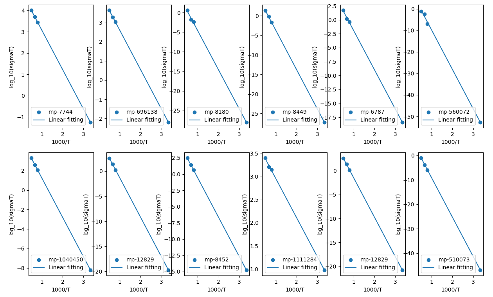
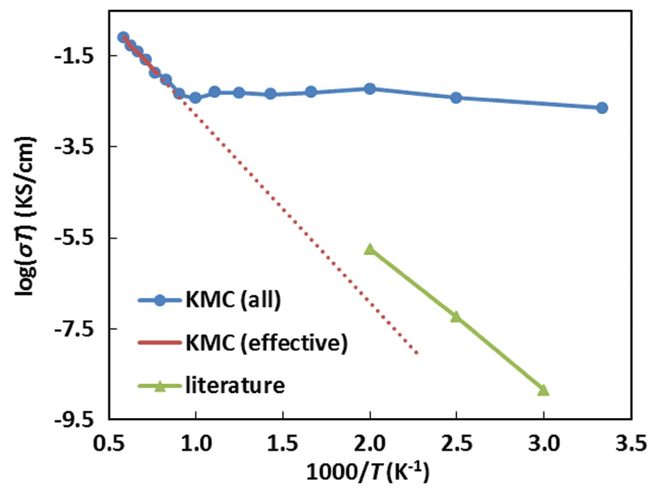

name: title
class: title, middle

## Multi-fidelity active learning for discovering solid-state ionic conductors

Alex Hernández-García, Yasmine Benabed, Divya Sharma, Michał Koziarski, Alexandra Volokhova

.turquoise[Projet PRF3 (Volet 5 - Conducteurs) · 2 mars 2023]

.center[

&nbsp&nbsp&nbsp&nbsp

]

---

## Active learning for scientific discovery

.context[Abstract overview of the project]

.center[]

.footnote[_Real world_ here means experimental measurements, DFT or other surrogate models of the ionic conductivity. _World model_ means machine learning models.] 

---

## Original plan

1. Identify surrogate proxies of the ionic conductivity with lower complexity than DFT (.highlight1[multi-fidelity oracles]).
2. Build .highlight1[data sets].
3. Train machine learning .highlight1[proxy models] using data sets and identified oracles.
4. Design and implement .highlight1[GFlowNet] to sample crystal materials using .highlight1[proxy models as reward].
5. Incorporate GFlowNet sampler into an .highlight1[active learning] pipeline.
6. Extend towards .highlight1[multi-fidelity] active learning.

.center[]

---

## Multi-fidelity oracles

* Experimental measurements: highest fidelity but very costly 
* Density Functional Theory: high fidelity but costly 
* SoftBV (bond valence) + Kinetic Monte Carlo (KMC) .cite[(Chen et al., 2019)]: medium fidelity 
* Logistic regression model trained by .cite[Sendek et al., 2019] with crystallographic features from Materials Project: low fidelity

.references[
* Chen et al. [SoftBV–a software tool for screening the materials genome of inorganic fast ion conductors](https://onlinelibrary.wiley.com/doi/abs/10.1107/S2052520618015718). Crystal Engineering and Materials, 2019.
* Sendek et al. [Machine learning-assisted discovery of solid Li-ion conducting materials](https://pubs.acs.org/doi/10.1021/acs.chemmater.8b03272?ref=vi_machine-learning-materials-science). Chemistry of Materials, 2018.
]

--

### Obstacles and challenges

* The logistic regression oracle has probably too low a fidelity.
* We are uncertain whether the SoftBV + KMC oracle is reliable.
* We have not been able to find other realiable, feasible alternative oracles.

---

## Multi-fidelity oracles
### SoftBV + KMC

.center[

]
.center[

]

---

## Data sets

* .highlight1[40-set]: 40 materials with ionic conductivity annotations calculated experimentally (highest fidelity)
* .highlight1[41-set]: 41 materials with ionic conductivity annotations calculated via DFT (high fidelity)
* .highlight1[MP-set]: Subset(s) from the Materials Project database. There are about 19,000 lithium oxide materials - we do not know the ionic conductivity (neither experimental nor DFT) of most of them.

--

### Obstacles and challenges

* 40 or 41 materials is a very low-data regime from a deep learning perspective. Hence we propose multi-fidelity active learning.
* Not all materials from the 40-set are available via `pymatgen`. Sendek et al. obtained the structures of these materials from ICSD, a proprietary data set. Yasmine was able to obtain the structure files (CIF) of the materials from collaborators. However, we have not been able to reproduce the results in the paper.

---

## Proxy models

### Data representation

* Composition: elements and number of atoms per element
* Lattice parameters: a, b, c, α, β, γ and space group - this defines the geometry of the unit cell

### Question

* Does this representationa uniquely define a crystal material?

---

## GFlowNet

### State space

* Composition: elements and number of atoms per element
* Space group: crystal system, point symmetry and space group
* Lattice parameters: a, b, c, α, β, γ

---

## Next steps

* Finish the implementation of the GFlowNet environments.
* Train GFlowNet with various rewards:
    * ML proxy of logistic regression oracle
    * ML proxy of SoftBV+KMC oracle
    * ML proxy of electrochemical stability window (EWS), calculated from the formation energy

---

name: title
class: title, middle

## Multi-fidelity active learning for discovering solid-state ionic conductors

Alex Hernández-García, Yasmine Benabed, Divya Sharma, Michał Koziarski, Alexandra Volokhova

.turquoise[Projet PRF3 (Volet 5 - Conducteurs) · 1er février 2023]

.center[

&nbsp&nbsp&nbsp&nbsp

]

