name: obvia-mar26
class: title, middle

## Les impacts environnementaux de l'intelligence artificielle
### Le coût du paradigme _bigger is better_

Alex Hernández-García (he/il/él)

.turquoise[Obvia: [Le numérique à l’épreuve de la sobriété](https://www.obvia.ca/evenements/sobriete-numerique) · Montreal · 18 mars 2026]

.center[

&nbsp&nbsp&nbsp&nbsp

]

.center[

&nbsp&nbsp&nbsp&nbsp

]

.smaller[.footer[
Slides: [alexhernandezgarcia.github.io/slides/{{ name }}](https://alexhernandezgarcia.github.io/slides/{{ name }})
]]

---

.left-column[
<figure>
	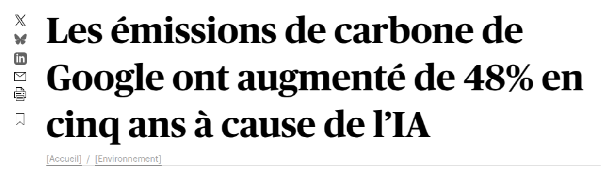
  <figcaption>.center[.smaller[<a href="https://www.ledevoir.com/environnement/815840/emissions-carbone-google-ont-augmente-48-cinq-ans-cause-ia">Le Devoir</a>, 2 juillet 2024]]</figcaption>
</figure>
<figure>
	
  <figcaption>.center[.smaller[<a href="https://ici.radio-canada.ca/nouvelle/2045059/changements-climatiques-intelligence-artificielle-environnement-ia">Radio Canada</a>, 27 janvier 2024]]</figcaption>
</figure>
<figure>
	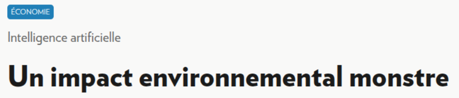
  <figcaption>.center[.smaller[<a href="https://www.lapresse.ca/affaires/economie/2023-06-03/intelligence-artificielle/un-impact-environnemental-monstre.php">La Presse</a>, 3 juin 2023]]</figcaption>
</figure>
]
.right-column[
   
<figure>
	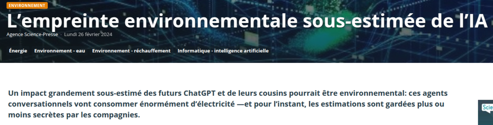
  <figcaption>.center[.smaller[<a href="https://www.sciencepresse.qc.ca/actualite/2024/02/26/empreinte-environnementale-estimee-ia">Science Presse</a>, 26 février 2024]]</figcaption>
</figure>
<figure>
	
  <figcaption>.center[.smaller[<a href="https://www.lapresse.ca/affaires/economie/2023-06-03/intelligence-artificielle/un-impact-environnemental-monstre.php">Digital HEC</a>, 27 mars 2024]]</figcaption>
</figure>
]

---

count: false
name: title
class: title, middle

## L’empreinte carbone de l’IA

.center[]

---

## Pourquoi l’IA est-elle énergivore ?

--

.highlight1[Réponse courte et simple]: Les modèles d'intelligence artificielle sont exécutés par des ordinateurs et les ordinateurs sont énergivores.

--

> _Mais un ordinateur n'est pas si énergivore par rapport à d'autres choses, non ?_

--

> _Pas de tout !_

--

> _Et donc ?_

--

La question et la réponse sont plus complexes. Pour y réfléchir :

- Pourquoi le transport est-il énergivore ?
- Pourquoi la production alimentaire est-elle énergivore ?

???

Walking and biking is not energy-demanding, but transportation within car culture and mindless flying is.

Traditional agriculture is not energy-demanding, but food production based on animal products and fertilizers is.

--

.conclusion[L'intelligence artificielle n'est pas _nécessairement_ énergivore. Il existe une IA efficace et à petite échelle. Le principal **problème est l'échelle** que nous avons atteinte.]

---

## Pourquoi l’IA est-elle énergivore ?
### Une réponse plus nuancée

.context35[L'échelle de l'IA est un facteur déterminant dans la consommation d'énergie.]

--

.left-column[
.h1[Qu'est-ce qu'un modèle d'intelligence artificielle] ?

On peut considérer le pilier des modèles actuels d'intelligence artificielle comme des programmes informatiques qui transforment des données d'entrée par des opérations mathématiques pour produire des données de sortie.
]

.right-column[
.center[
<figure>
	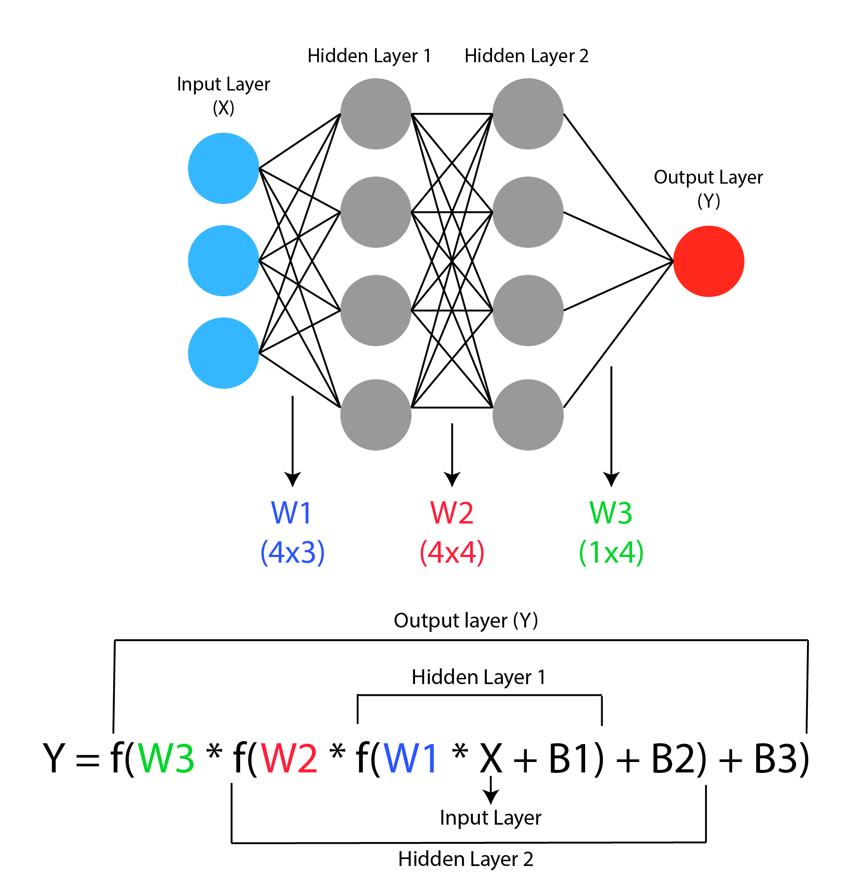
  .smaller[<figcaption>Schéma d'un réseau neuronal très simple.</figcaption>]
</figure>
]
]

--

.right-column[
.conclusion[Chaque opération mathématique consomme en peu d'énergie. Les grands modèles d'IA effectuent une myriade de ces opérations.]
]

---

## Pourquoi l’IA est-elle énergivore ?
### Une réponse plus nuancée

.context35[L'échelle de l'IA est un facteur déterminant dans la consommation d'énergie.]

.left-column[
.h1[Qu'est-ce qu'un modèle de langage] ?

--

Une machine statistique qui calcule la probabilité de chaque symbole (lettre, mot, etc.). dans une langue. Un exemple bien connu : les outiles d'.h2[autocomplétion]
]

--

.right-column[
.center[
<figure>
	
  .smaller[<figcaption>Les outils de complétion automatique sont des modèles de langage.</figcaption>]
</figure>
]
]

---

count: false

## Pourquoi l’IA est-elle énergivore ?
### Une réponse plus nuancée

.context35[L'échelle de l'IA est un facteur déterminant dans la consommation d'énergie.]

.left-column[
.h1[Qu'est-ce qu'un modèle de langage] ?

Une machine statistique qui calcule la probabilité de chaque symbole (lettre, mot, etc.). dans une langue. Un exemple bien connu : les outiles d'.h2[autocomplétion]
]

.right-column[
.center[
<figure>
	
  .smaller[<figcaption>Les outils de complétion automatique sont des modèles de langage.</figcaption>]
</figure>
]
]

---

count: false

## Pourquoi l’IA est-elle énergivore ?
### Une réponse plus nuancée

.context35[L'échelle de l'IA est un facteur déterminant dans la consommation d'énergie.]

.left-column[
.h1[Qu'est-ce qu'un modèle de langage] ?

Une machine statistique qui calcule la probabilité de chaque symbole (lettre, mot, etc.). dans une langue. Un exemple bien connu : les outiles d'.h2[autocomplétion]
]

.right-column[
.center[
<figure>
	
  .smaller[<figcaption>Les outils de complétion automatique sont des modèles de langage.</figcaption>]
</figure>
]
]

--

.right-column[
.conclusion[Les modèles de langage peuvent être très petits (comme l'autocomplétion du clavier des cellulaires)... ou énormes !]
]

---

## Pourquoi l’IA est-elle énergivore ?
### Une réponse plus nuancée

.context35[L'échelle de l'IA est un facteur déterminant dans la consommation d'énergie.]

.center[
<figure>
	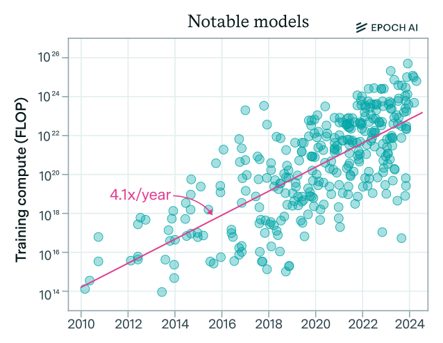
  .smaller[<figcaption>La taille des modèles les plus grandes, en termes de nombre d'opérations, a quadruplé chaque année. Source: <a href="https://en.wikipedia.org/wiki/Large_language_model">Wikipedia</a></figcaption>]
</figure>
]

--

Il s'agit là d'une croissance _véritablement_ exponentielle : Si cette croissance s'appliquait à un investissement de 100 000 dollars, dans 5 ans cela donnerait plus de 100 _millions_ !

---

## Pourquoi l’IA est-elle énergivore ?
### Une réponse plus nuancée

Il est important de distinguer deux phases principales dans la vie d'un modèle d'IA: .highlight1[entraînement] et .highlight1[déploiement]

--

- .highlight1[Entraînement]: Il s'agit du processus d'ajustement des poids qui modulent les opérations mathématiques dans le réseau neuronal afin que le modèle exécute avec succès la tâche souhaitée.

Certains modèles s'entraînent sur un ordinateur portable en quelques minutes ou quelques heures. Les modèles comme ChatGPT nécessitent plusieurs semaines et de nombreux ordinateurs puissants.

--

- .highlight1[Déploiement]: Il s'agit de l'utilisation du modèle une fois qu'il a été entraîné.

Certains modèles ne sont utilisés qu'avec modération. Les modèles comme ChatGPT sont utilisés par des millions d'utilisateurs chaque minute.

--

.conclusion[C'est le déploiement à grande échelle de très grands modèles qui pose problème dans un contexte de crise climatique.]

???

Talk about scaling is all you need and this philosophy promoted from the industry as part of a capitalist mindset.

---

## Estimation des émissions de carbone de l'IA

De quoi dépendent la consommation d'énergie et les émissions de GES d'un modèle IA ?

1. .highlight1[Temps des entraînements], $T$: somme totale du temps d'utilisation des machines de calcul (heures).
2. .highlight1[Puissance électrique], $P$, des machines de calcul (watts).
3. .highlight1[Facteur d'émission], $I$: ratio entre la quantité de gaz à effet de serre émis par quantité d'électricité produite par la source d'énergie (grammes de dioxyde de carbone par kilowatt-heure).

.references[
Luccioni and Hernandez-Garcia. [Counting Carbon: A Survey of Factors Influencing the Emissions of Machine Learning](https://arxiv.org/abs/2302.08476). arXiv 2302.08476, 2023.
]

--

La quantité de CO2 équivalent [CO2eq] émise lors de l'entraînement d'un modèle, C:

$$C = T \times P \times I = E \times I$$

--

.conclusion[Il est assez simple d'obtenir une estimation approximative, mais **il est vraiment difficile de calculer exactement** l'énergie due à des processus spécifiques.]

---

## Estimation des émissions
## de carbone de l'IA

.context[Les facteurs principaux sont les temps d'entraînement, la puissance électrique et le facteur d'émission.]

En 2022, avec Sasha Luccioni, nous avons réalisé une analyse des émissions de 95 modèles d'apprentissage automatique, en interrogeant les auteurs sur les détails de leur entraînement.

.center[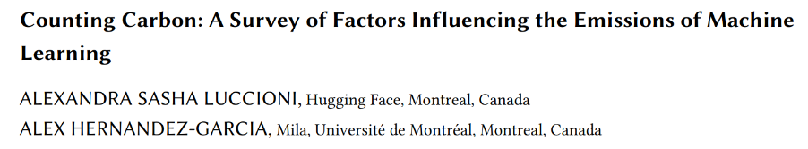]

.references[
Luccioni and Hernandez-Garcia. [Counting Carbon: A Survey of Factors Influencing the Emissions of Machine Learning](https://arxiv.org/abs/2302.08476). arXiv 2302.08476, 2023.
]

---

## Estimation des émissions de carbone de l'IA
### Comparison des modèles IA

Le modèle .highlight1[le plus léger] a été entraîné en .highlight1[15 minutes], tandis que l'un des modèles a nécessité 400 000 heures.

--

Le .highlight1[total des émissions] de carbone des modèles analysés dans notre étude (95) est d'environ .highlight1[253 tonnes de CO2eq], ce qui correspond à .highlight1[environ 100 vols] de Londres à San Francisco.

--

.highlight1[GPT-3], le prédécesseur de ChatGPT, a nécessité .highlight1[3,5 millions d'heures] d'entraînement (14,8 jours avec 10 000 GPU) et .highlight1[500 toones de CO2eq], ce qui équivaut à .highlight1[450 vols] transatlantiques.

---

## Comparison des modèles IA

.context[Est-ce que plus d'énergie et de CO2 conduisent à une meilleure performance du modèle ?]

 
.center[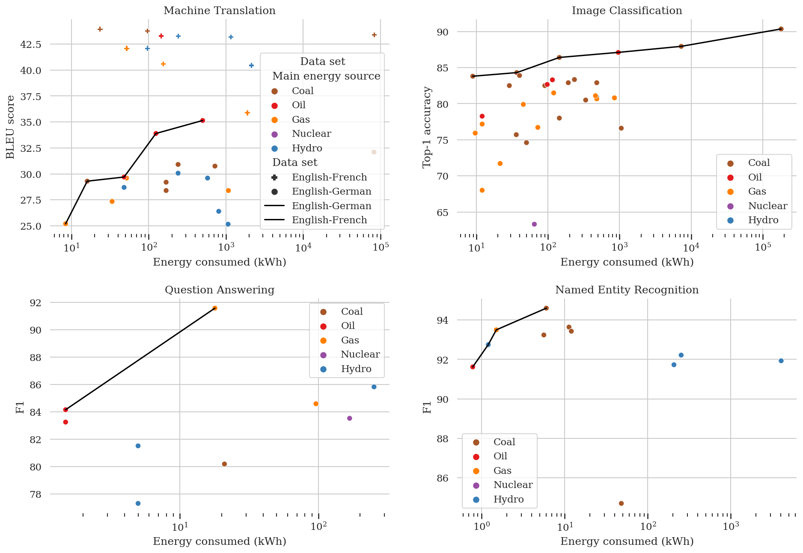]

---

count: false

## Comparison des modèles IA

.context[Est-ce que plus d'énergie et de CO2 conduisent à une meilleure performance du modèle ?]

 
.center[]

.conclusion[L'une des conclusions de notre étude est qu'il n'existe qu'une faible corrélation entre la consommation d'énergie et la performance. _Plus gros n'est pas mieux_.]

---

## Comparison des modèles IA
### Que dire des grands modèles de langage modernes ?

Tout d'abord, les grandes entreprises ne fournissent pratiquement aucune information sur les besoins énergétiques de leurs modèles.

Grâce au travail des chercheuses et chercheurs, nous en savons de plus en plus.

--

- Les émissions de carbone de l'entraînement de BLOOM ont été estimées à 25 tonnes de CO2eq. .cite[(Luccioni et al., 2022)]
- Au plus fort de la popularité de ChatGPT en 2023, l'application consommait environ 564 mégawattheures d'électricité par jour, équivalent à la consommation quotidienne d'énergie d'environ 19 000 familles des États Unis. .cite[(de Vries, 2023)]

.references[
- Luccioni, Viguier, Ligozat. [Estimating the Carbon Footprint of BLOOM, a 176B Parameter Language Model](https://arxiv.org/abs/2211.02001). arXiv 2211.02001, 2022.
- de Vries. [The growing energy footprint of artificial intelligence](https://www.cell.com/action/showPdf?pii=S2542435123003653). CellPress, 2023.
- Luccioni, Jernite, Strubell. [Power Hungry Processing: Watts Driving the Cost of AI Deployment?](https://arxiv.org/abs/2311.16863). arXiv 2311.16863, 2023.
- [AI Energy Score](https://huggingface.co/spaces/AIEnergyScore/Leaderboard)
]

???

25 tons of CO2eq are equivalent to 180,000 km en voiture.

25 tons of CO2eq are equivalent to 40 short-haul flights.

https://www.openco2.net/en/co2-converter

---

## Comparison des modèles IA
### Que dire des grands modèles de langage modernes ?

.center[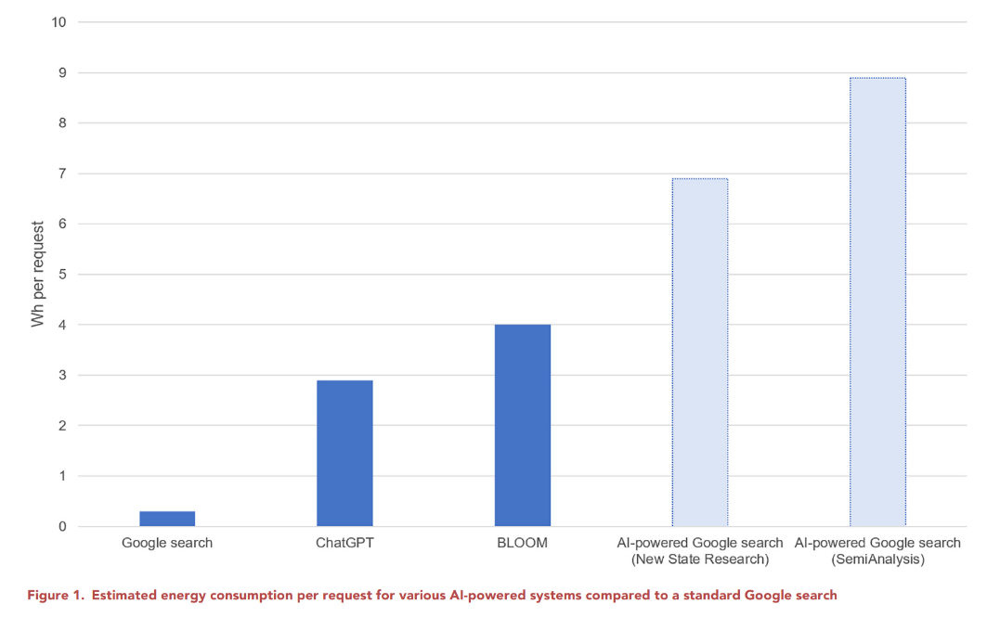]

.references[
de Vries. [The growing energy footprint of artificial intelligence](https://www.cell.com/action/showPdf?pii=S2542435123003653). CellPress, 2023.
]

---

count: false

## Comparison des modèles IA
### Que dire des grands modèles de langage modernes ?

.center[]

.conclusion[Une interaction avec ChatGPT pourrait consommer 10 fois plus d'énergie qu'une recherche Google.]

???

Charging an average smartphone uses about 22 W.

---

## Comparison des modèles IA
### Que dire des grands modèles de langage modernes ?

.center[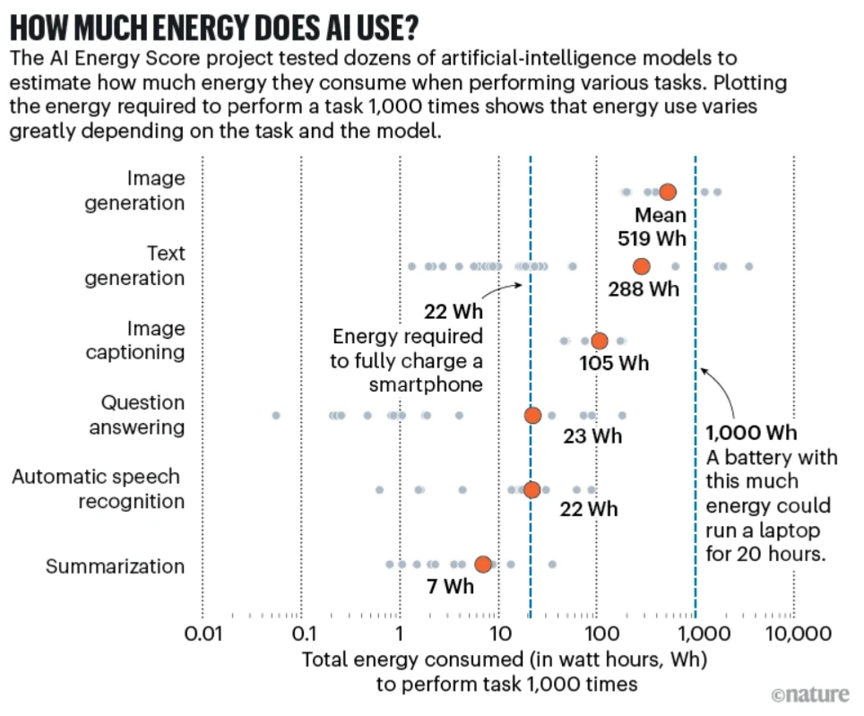]

.references[
- [AI Energy Score](https://huggingface.co/spaces/AIEnergyScore/Leaderboard)
- Chen. [How much energy will AI really consume? The good, the bad and the unknown](https://www.nature.com/articles/d41586-025-00616-z). Nature, News Feature, 2025.
]

---

## Demande d'énergie des centres de données
### Estimations actuelles et projections future

.center[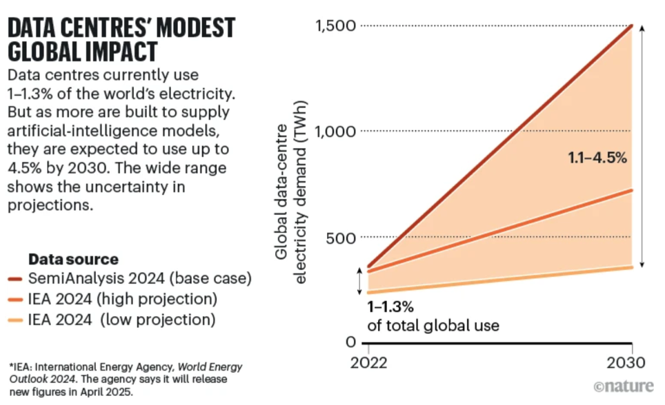]

.references[
- Chen. [How much energy will AI really consume? The good, the bad and the unknown](https://www.nature.com/articles/d41586-025-00616-z). Nature, News Feature, 2025.
]

---

## Autres impacts de l'IA
### Consommation d'eau

.context[Les grands modèles d'IA déployés à grande échelle demandent beaucoup d'énergie et émettent donc des GES.]

 
Outre l'énergie, les centres de données et donc l'IA consomment de .highlight1[grandes quantités d'eau potable] et exigent des .highlight1[matériaux rares].

De plus, il ne faut pas oublier l'impact social, comme les .highlight1[mauvaises conditions de travail] et l'.highlight1[accroissement des inégalités].

.center[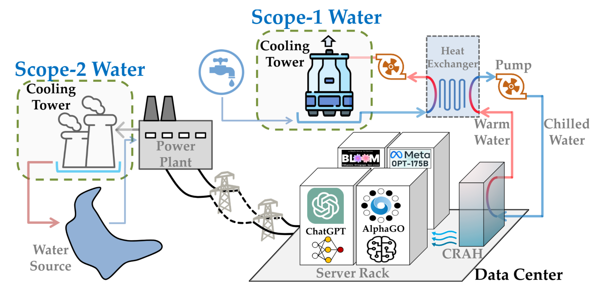]

.references[
- Li et al. [Making AI Less "Thirsty": Uncovering and Addressing the Secret Water Footprint of AI Models](https://arxiv.org/abs/2304.03271). arXiv 2304.03271, 2023.
- Crawford. [Atlas of AI](https://en.wikipedia.org/wiki/Atlas_of_AI), 2021
]

---

## Autres impacts de l'IA
### Consommation d'eau

.left-column[
- Selon Li et al., l'entraînement de GPT-3 a fait évaporer 700 000 litres d'eau douce dans les centres de données de Microsoft.
- "Selon les prévisions, la demande mondiale liée à l'IA devrait représenter entre 4,2 et 6,6 milliards de mètres cubes d'eau en 2027, soit plus que le volume total des consommations annuelles de la moitié du Royaume-Uni."
]

.references[
- Li et al. [Making AI Less "Thirsty": Uncovering and Addressing the Secret Water Footprint of AI Models](https://arxiv.org/abs/2304.03271). arXiv 2304.03271, 2023.
]

--

.right-column[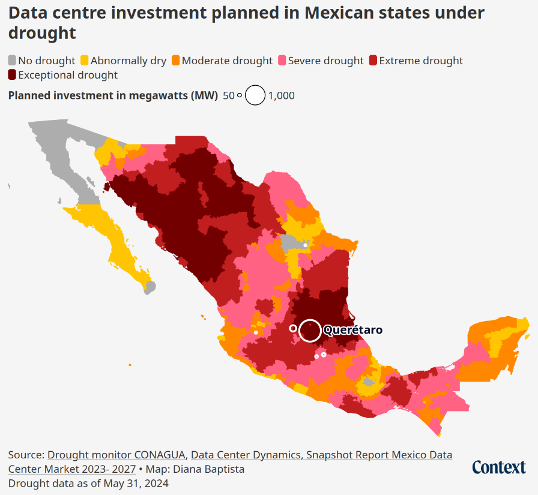]

---

## Au-delà de l'impact environnemental

Il existe un nombre croissant d'études sur les impacts sociaux négatifs de l'IA :
.left-column[
- Centralisation du pouvoir et aggravation des inégalités
- Conditions de travail abusives
- Usage pour les armes autonomes et la guerre
]

.right-column[
- Discrimination à caractère racial
- Propagation des préjugés discriminatoires
- Violation des droits des créateurs
- Diffusion de fausses informations et de désinformation
]

--

.references[
- Crawford. [Atlas of AI](https://en.wikipedia.org/wiki/Atlas_of_AI), 2021
- DW. [How big AI companies exploit data workers in Kenya](https://www.youtube.com/watch?v=ehkECk2KJjY), 2024
- Kalluri. [Don’t ask if artificial intelligence is good or fair, ask how it shifts power](https://www.nature.com/articles/d41586-020-02003-2), Nature, 2020
- Bender, Gebru, McMillan-Major, Shmitchell. [On the Dangers of Stochastic Parrots: Can Language Models Be Too Big? 🦜](https://dl.acm.org/doi/10.1145/3442188.3445922), FAccT, 2021
- Mohamed, Png, Isaac. [Decolonial AI: Decolonial Theory as Sociotechnical Foresight in Artificial Intelligence](https://arxiv.org/abs/2007.04068), Philosophy and Technology, 2020. 
- Benjamin. [Race After Technology: Abolitionist Tools for the New Jim Code](https://en.wikipedia.org/wiki/Race_After_Technology), Polity, 2019.
- West, Whittaker, Crawford. [Discriminating Systems: Gender, Race, and Power in AI – Report](https://ainowinstitute.org/publications/discriminating-systems-gender-race-and-power-in-ai-2), AI Now, 2019.
- [‘A mass assassination factory’: Inside Israel’s calculated bombing of Gaza](https://www.972mag.com/mass-assassination-factory-israel-calculated-bombing-gaza/)
]

???

- Mention Microsoft's deals with fossil fuel companies
- Major tech companies like Microsoft and Google just reported rises in resource uses previously unheard of, stopped carbon offsetting, and announced that they would miss their already loose (Hoffmann, 2022) sustainability pledges, precisely because of their large scale AI roll-out (e.g. Marx, 2024; Metz, 2024; Rathi & Bass, 2024).

---

name: obvia-mar26
class: title, middle

Alex Hernández-García (he/il/él)

.center[

&nbsp&nbsp&nbsp&nbsp

&nbsp&nbsp&nbsp&nbsp

&nbsp&nbsp&nbsp&nbsp

]

.footer[[alexhernandezgarcia.github.io](https://alexhernandezgarcia.github.io/) | [alex.hernandez-garcia@mila.quebec](mailto:alex.hernandez-garcia@mila.quebec)] | [alexhergar.bsky.social](https://bsky.app/profile/alexhergar.bsky.social)  
