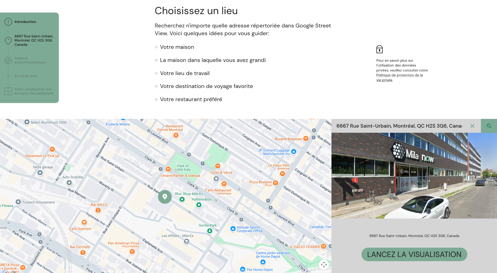
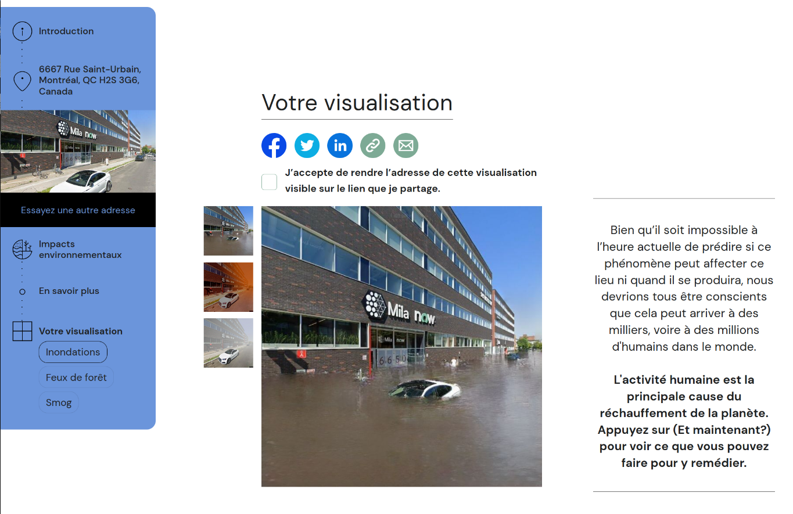
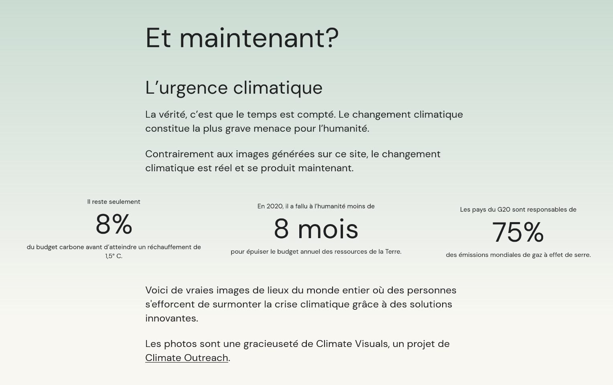

name: oiq-mar25
class: title, middle

## Intelligence artificielle et la crise climatique
### Défis et opportunités pour l’ingénierie

Alex Hernández-García (he/il/él)

.turquoise[Ordre des ingénieurs du Québec · Virtuel · 14 mars 2025]

.center[

&nbsp&nbsp&nbsp&nbsp

]

.center[

&nbsp&nbsp&nbsp&nbsp

]

.smaller[.footer[
Slides: [alexhernandezgarcia.github.io/slides/{{ name }}](https://alexhernandezgarcia.github.io/slides/{{ name }})
]]

.qrcode[]

---

.left-column[
<figure>
	
  <figcaption>.center[.smaller[<a href="https://www.ledevoir.com/environnement/815840/emissions-carbone-google-ont-augmente-48-cinq-ans-cause-ia">Le Devoir</a>, 2 juillet 2024]]</figcaption>
</figure>
<figure>
	
  <figcaption>.center[.smaller[<a href="https://ici.radio-canada.ca/nouvelle/2045059/changements-climatiques-intelligence-artificielle-environnement-ia">Radio Canada</a>, 27 janvier 2024]]</figcaption>
</figure>
<figure>
	
  <figcaption>.center[.smaller[<a href="https://www.lapresse.ca/affaires/economie/2023-06-03/intelligence-artificielle/un-impact-environnemental-monstre.php">La Presse</a>, 3 juin 2023]]</figcaption>
</figure>
]
.left-column[
<figure>
	
  <figcaption>.center[.smaller[<a href="https://www.sciencepresse.qc.ca/actualite/2024/02/26/empreinte-environnementale-estimee-ia">Science Presse</a>, 26 février 2024]]</figcaption>
</figure>
<figure>
	
  <figcaption>.center[.smaller[<a href="https://www.lapresse.ca/affaires/economie/2023-06-03/intelligence-artificielle/un-impact-environnemental-monstre.php">Digital HEC</a>, 27 mars 2024]]</figcaption>
</figure>
]

---

count: false
name: title
class: title, middle

## L’empreinte carbone de l’IA

.center[]

---

## Pourquoi l’IA est-elle énergivore ?

--

.highlight1[Réponse courte et simple]: Les modèles d'intelligence artificielle sont exécutés par des ordinateurs et les ordinateurs sont énergivores.

--

> _Mais un ordinateur n'est pas si énergivore par rapport à d'autres choses, non ?_

--

> _Pas de tout !_

--

> _Et alors ?_

--

   
.conclusion[L'intelligence artificielle n'est pas _nécessairement_ énergivore. Il existe une IA efficace et à petite échelle. Le principal **problème est l'échelle** que nous avons atteinte.]

---

## Pourquoi l’IA est-elle énergivore ?
### Une réponse plus nuancée

--

.left-column[
Qu'est-ce qu'un modèle d'intelligence artificielle ?

On peut considérer le pilier des modèles actuels d'intelligence artificielle comme des programmes informatiques qui transforment des données d'entrée par des opérations mathématiques pour produire des données de sortie.
]

.right-column[
.center[
<figure>
	
  .smaller[<figcaption>Schéma d'un réseau neuronal très simple.</figcaption>]
</figure>
]
]

---

## Pourquoi l’IA est-elle énergivore ?
### Une réponse plus nuancée

--

Tout d'abord, il faut distinguer deux phases principales dans la vie d'un modèle d'IA: .highlight[entraînement] et .highlight1[déploiement]

---

## Estimation de la consommation d'énergie de l'IA

---

## Estimation de la consommation d'énergie de l'IA
### Facteurs importants pour les émissions de carbone

De quoi dépendent la consommation d'énergie et les émissions de GES d'un modèle IA ?

1. Temps des entraînements: somme totale du temps d'utilisation des machines de calcul (heures).
2. Facteur d'émission: ratio entre la quantité de gaz à effet de serre émis par quantité d'électricité produite par la source d'énergie (grammes de dioxyde de carbone par kilowatt-heure).
3. Consommation d'énergie des machines de calcul (watts).

---

## Estimation de la consommation d'énergie de l'IA
### Comparison des modèles IA

Est-ce que plus d'énergie et de CO2 conduisent à une meilleure performance du modèle ?

---

## Initiatives pour réduire l'impact

---

count: false
name: title
class: title, middle

## Le rôle des ingénieur·e·s dans la conception responsable des IA

.center[]

---

count: false
name: title
class: title, middle

## Le rôle de l'IA dans le développement durable

.center[]

---

## Panorama des applications de l'IA pour l'ingénierie durable

- Optimisation énergétique des bâtiments et infrastructures.
- Prédiction et gestion des ressources naturelles.
- Réduction des déchets industriels et amélioration des chaînes d'approvisionnement.
- Applications dans la conception de matériaux innovants et l’ingénierie verte.
- Amélioration des modèles climatiques
- Sensibilisation au changement climatique par la visualisation

---

## Cas concret
### Sensibilisation au changement climatique

Il y a un décalage entre la gravité de la crise climatique et les préoccupations du public à ce sujet.

.center[
<figure>
	
  .smaller[<figcaption>Stokes et al., <a href="https://www.pewresearch.org/global/2015/11/05/1-concern-about-climate-change-and-its-consequences/">Global concern about climate change, broad support for limiting emissions</a>. Pew Research, 2015</figcaption>]
</figure>
]

---

count: false

## Cas concret
### Sensibilisation au changement climatique

Il y a un décalage entre la gravité de la crise climatique et les préoccupations du public à ce sujet. .highlight1[_Pourquoi ?_]

--

* .highlight1[Distance psychologique]: 
> "_People struggle to engage with climate change because they perceive it as distant: temporally, geographically and/or socially. _" .cite[Stoknes, 2016]

.references[
* Stoknes, P. E. [Why the human brain ignores climate change—and what to do about it](https://documentcloud.adobe.com/link/track?uri=urn%3Aaaid%3Ascds%3AUS%3A1ef80b88-177c-4e5d-b879-d6d3a059c694). Environmental Reality: Rethinking the Options, 2016.
]

???

The dot next to US is Australia, then Canada, then Russia.

---

count: false

## Cas concret
### Sensibilisation au changement climatique

Il y a un décalage entre la gravité de la crise climatique et les préoccupations du public à ce sujet. .highlight1[_Pourquoi ?_]

* .highlight1[Distance psychologique]: 
> "_People struggle to engage with climate change because they perceive it as distant: temporally, geographically and/or socially. _" .cite[Stoknes, 2016]
* .highlight1[Doom-framings et fatigue des messages clichés]:
> "_[C]lichéd images of climate change [...]—such as ‘smokestacks’, deforestation, and polar bears on melting ice—were positively received [but] also produced a muted emotional response and often prompted cynicism._" .cite[Chapman et al., 2016]

.references[
* Stoknes, P. E. [Why the human brain ignores climate change—and what to do about it](https://documentcloud.adobe.com/link/track?uri=urn%3Aaaid%3Ascds%3AUS%3A1ef80b88-177c-4e5d-b879-d6d3a059c694). Environmental Reality: Rethinking the Options, 2016.
* Chapman, D. A. et al. [Climate visuals: A mixed methods investigation of public perceptions of climate images in three countries](https://sci-hub.st/https://www.sciencedirect.com/science/article/abs/pii/S095937801630351X). GCE, 2016.
]

---

count: false

## Cas concret
### Sensibilisation au changement climatique

Il y a un décalage entre la gravité de la crise climatique et les préoccupations du public à ce sujet. .highlight1[_Pourquoi ?_]

* .highlight1[Distance psychologique]: 
> "_People struggle to engage with climate change because they perceive it as distant: temporally, geographically and/or socially. _" .cite[Stoknes, 2016]
* .highlight1[Doom-framings et fatigue des messages clichés]:
> "_[C]lichéd images of climate change [...]—such as ‘smokestacks’, deforestation, and polar bears on melting ice—were positively received [but] also produced a muted emotional response and often prompted cynicism._" .cite[Chapman et al., 2016]

.conclusion[Une plus grande sensibilisation du public pourrait accélérer les changements politiques. L'IA peut-elle aider ?]

---

## Notre objectif
### .alpha0[Placeholder]

.context[On perçoit la menace du changement climatique comme étant éloignée dans le temps, géographiquement et socialement.]

--

 
.center[.bigger[.highlight1[Est-il possible d'aider les gens à visualiser les effets du changement climatique chez eux ?]]]

--

.left-column[
<figure>
	
  <figcaption>Montréal, Québec, Canada</figcaption>
</figure>
]
.right-column[
<figure>
	
  <figcaption>Berlin, Germany</figcaption>
</figure>
]
.left[
]
.right[
]

---

count: false

## Notre objectif
### Inondations

.context[On perçoit la menace du changement climatique comme étant éloignée dans le temps, géographiquement et socialement.]

 
.center[.bigger[.highlight1[Est-il possible d'aider les gens à visualiser les effets du changement climatique chez eux ?]]]

.left-column[
<figure>
	
  <figcaption>Montréal, Québec, Canada</figcaption>
</figure>
]
.right-column[
<figure>
	
  <figcaption>Berlin, Germany</figcaption>
</figure>
]
.left[
]
.right[
]

---

count: false

## Notre objectif
### Feux de fôret

.context[On perçoit la menace du changement climatique comme étant éloignée dans le temps, géographiquement et socialement.]

 
.center[.bigger[.highlight1[Est-il possible d'aider les gens à visualiser les effets du changement climatique chez eux ?]]]

.left-column[
<figure>
	
  <figcaption>Montréal, Québec, Canada</figcaption>
</figure>
]
.right-column[
<figure>
	
  <figcaption>Berlin, Germany</figcaption>
</figure>
]
.left[
]
.right[
]

---

count: false

## Notre objectif
### Smog

.context[On perçoit la menace du changement climatique comme étant éloignée dans le temps, géographiquement et socialement.]

 
.center[.bigger[.highlight1[Est-il possible d'aider les gens à visualiser les effets du changement climatique chez eux ?]]]

.left-column[
<figure>
	
  <figcaption>Montréal, Québec, Canada</figcaption>
</figure>
]
.right-column[
<figure>
	
  <figcaption>Berlin, Germany</figcaption>
</figure>
]
.left[
]
.right[
]

---

## Notre objectif

Un site web pour encourager la sensibilisation et l'action en matière de changement climatique.

.context[On peut rechercher l'adresse de notre choix.]

.center[]

---

count: false

## Notre objectif

Un site web pour encourager la sensibilisation et l'action en matière de changement climatique.

.context65[Obtenir une visualisation générée par l'IA sur une photo de rue.]

.center[]

---

count: false

## Notre objectif

Un site web pour encourager la sensibilisation et l'action en matière de changement climatique.

.context65[En savoir plus sur le changement climatique et les moyens d'agir maintenant.]

.center[]

---

count: false

## Essayons-la !

.center[
.bigger[.bigger[[CeClimatNExistePas.com](https://ceclimatnexistepas.com)]]
]

.center[]

???

https://thisclimatedoesnotexist.com/en/share/56d8058c-23d5-4083-b1b4-4afe6a5b2fe9

---

## Methods
### Key challenges

.context[The algorithm had to be able to generate realistic floods on any photo from Google Street View.]

--

.left-column-66[

* Visual perception is sensitive to unrealistic scenes:
    * Water texture (reflections, luminosity, etc.)
    * Geometry of the scene (edges, obstacles, etc.)
    * Physics (slope, view point, etc.)
* The algorithm was meant to be deployed _in the wild_ and should work with highly variant range of photos.
* We had to overcome the lack of training data: there is no data set of photos of _before and after_ the flood.
]
.right-column-33[
.center[

]
]

---

## Methods
### Key features

.context[Simulating photo-realistic floods is challenging because visual perception is very sensitive to unrealistic scenes and the lack of data.]

--

.left-column[

* Data from a .highlight1[simulated virtual word] to overcome the lack of training data
* .highlight1[Domain adaptation] to bridge the gap between simulated and real photos
* Two-stage flood generation: .highlight1[Masker] + .highlight1[Painter]
* Combination of .highlight1[depth and semantic segmentation] to improve water mask predictions
* .highlight1[Conditional image generation] to _paint_ realistic water on the predicted mask
]
.right-column[

]

---

## ClimateGAN
### Simulated data

.context[We collected 1,200 photos of real floods and 5,500+ _non-flooded_ scenes to train our model. However, _real_ photos lack geometry and segmentation labels.]

We simulated a $1.5~km^2$ virtual world and generated 20,000 images that mimic Google Street View.

.center[]

---

count: false

## ClimateGAN
### Simulated data

.context[We collected 1,200 photos of real floods and 5,500+ _non-flooded_ scenes to train our model. However, _real_ photos lack geometry and segmentation labels.]

We simulated a $1.5~km^2$ virtual world and generated 20,000 images that mimic Google Street View.

.center[]

---

## ClimateGAN
### Masker

.left-column[
* Trained with _real_ and _simulated_ images
* Domain adaptation with ADVENT
* Depth decoder
* Segmentation decoder
* Mask decoder conditioned on depth and segmentation using SPADE
* All decoders trained simultaneously (multi-task learning)
]
.right-column[

]

???

* ADVENT: domain adaptation via adversarial entropy minimization, enriched with DADA (depth)
* SPADE: conditional image generation

---

counter: false

## ClimateGAN
### Masker

.left-column[
* Trained with _real_ and _simulated_ images
* Domain adaptation with ADVENT
* Depth decoder
* Segmentation decoder
* Mask decoder conditioned on depth and segmentation using SPADE
* All decoders trained simultaneously (multi-task learning)
]
.right-column[

]

.conclusion[The masker receives an input image and outputs a binary mask of the water location, making intermediate predictions of depth and semantic segmentation.]

---

## ClimateGAN
### Painter

.left-column[
* Trained with 1,200 real images of floods
* The painter has to generate flooding water conditioned on the context of the image: sky, buildings, etc.
* Conditional image generation with GauGAN
* Conditioned on the Masked image
* SPADE blocks
]
.right-column[

]

---

counter: false

## ClimateGAN
### Painter

.left-column[
* Trained with 1,200 real images of floods
* The painter has to generate flooding water conditioned on the context of the image: sky, buildings, etc.
* Conditional image generation with GauGAN
* Conditioned on the Masked image
* SPADE blocks
]
.right-column[

]

.conclusion[The painter receives an input image and a mask prediction and outputs an image of a flood that we combine with the masked input.]

---

## ClimateGAN
### Masker + Painter

.center[]

---

## ClimateGAN
### Comparison with other methods

.center[]

---

## ClimateGAN
### Human evaluation

.context[We asked human participants to assess the visual quality of the output images, compared to alternative algorithms.]

_Which image looks more like an actual flood?_

.center[]

.conclusion[The images from our algorithm were consistently judged as more realistic than those from other methods.]

---

## ClimateGAN
### Ablation study

.context[We systematically evaluated the contribution of several components of the algorithm.]

* We annotated the pixels a set of _test_ images as _must be flooded_, _cannot be flooded_ or _may be flooded_.
* We proposed 3 metrics to best evaluate the quality of the water masks: error, F05 score and _edge coherence_.

.center[]

---

count: false

## ClimateGAN
### Ablation study

.context[We systematically evaluated the contribution of several components of the algorithm.]

* We analysed each component according to the three proposed metrics.

.center[]

.conclusion[5 of the 6 proposed components for the architecture proved to positively contribute to the performance.]

---

## To know more

Visit the website: [ThisClimateDoesNotExist.com](https://thisclimatedoesnotexist.com)

.center[]
    
Check the paper (ICLR 2022): [ClimateGAN: Raising Climate Change Awareness by Generating Images of Floods](https://arxiv.org/abs/2110.02871v1)

.center[]
    
---

## Cas concret
### Découverte de matériaux

---

## Why AI against climate change?
### The potential of scientific discoveries

.context[The climate crisis demands more efficient materials.]

* Improving material efficiency can reduce 0.93 ($\pm$ 0.23) GtCO₂-eq per year.
* Fuel switching can reduce 2.1 ($\pm$ 0.52) GtCO₂-eq per year, only in the industry sector. 
* Carbon capture and storage can reduce 0.54 ($\pm$ 0.27) GtCO₂-eq per year in the energy sector.

.right[.cite[IPCC Sixth Assessment Report (2022)]]

.smaller[.footnote[† Global anthropogenic emissions in 2019 were estimated in 59 ($\pm$ 6.6) GtCO₂-eq. The budget from 2020 to limit warming to 1.5°C is estimated in 510 ($\pm$ 180) GtCO₂-eq.]]

---

count: false

## Why AI against climate change?
### The potential of scientific discoveries

.context[The climate crisis demands more efficient materials.]

* Improving material efficiency can reduce 0.93 ($\pm$ 0.23) GtCO₂-eq per year.
* Fuel switching can reduce 2.1 ($\pm$ 0.52) GtCO₂-eq per year, only in the industry sector. 
* Carbon capture and storage can reduce 0.54 ($\pm$ 0.27) GtCO₂-eq per year in the energy sector.

.right[.cite[IPCC Sixth Assessment Report (2022)]]

What are better, new materials needed for?

* Electrocatalysts for fuel cells, hydrogen storage, industrial chemical reactions, carbon capture, etc.
* Solid electrolytes for batteries.
* Thin film materials for photovoltaics.
* ...

.smaller[.footnote[† Global anthropogenic emissions in 2019 were estimated in 59 ($\pm$ 6.6) GtCO₂-eq. The budget from 2020 to limit warming to 1.5°C is estimated in 510 ($\pm$ 180) GtCO₂-eq.]]

---

## Why AI against climate change?
### Scientific discoveries in history

.context35[Material discovery is a key ingredient for climate change mitigation.]

--

Many notable scientific discoveries have occurred due to .highlight1[serendipity] or .highlight1[by accident]:

--

* **Dynamite** (Alfred Nobel, 1867)
* **X-rays** (Wilhelm C. Röntgen, 1895)
* **Radioactivity** (Henri Becquerel and Marie Skłodowska–Curie, 1896)
* **Penicillin** (Alexander Fleming, 1929)
* **Cyanoacrylate (superglue)** (Harry Coover, 1942)
* **Lysergic acid diethylamide (LSD)** (Albert Hofmann, 1943)

--

 
.conclusion[Clearly, we should not rely on serendipity to fight climate change.]

???

Joke experience with some of them, like penicillin and superglue.

---

count: false

## Why AI against climate change?
### Scientific discoveries in history

.context35[Material discovery is a key ingredient for climate change mitigation.]

.center[
<figure>
	
  <figcaption>Four paradigms in scientific discovery. Source: <a href="https://www.nature.com/articles/s41524-022-00810-x">Li et al., 2022</a>. (<a href="https://creativecommons.org/licenses/by/4.0/">CC BY 4.0</a>)</figcaption>
</figure>
]

.references[
* Li et al. [Machine learning in concrete science: applications, challenges, and best practices](https://www.nature.com/articles/s41524-022-00810-x). Nature  npj Computational Materials, 2022
]

???

Example of concrete: most prevalent human-made material on Earth, and the most consumed commodity after water. The annual consumption of concrete in the world has reached 35 billion tons, which is twice as much as that of all other building materials combined.

---

count: false

## Why AI against climate change?
### Scientific discoveries in history

.context35[Material discovery is a key ingredient for climate change mitigation.]

.center[
<figure>
	
  <figcaption>Four paradigms in scientific discovery. Source: <a href="https://www.nature.com/articles/s41524-022-00810-x">Li et al., 2022</a>. (<a href="https://creativecommons.org/licenses/by/4.0/">CC BY 4.0</a>)</figcaption>
</figure>
]

.references[
* Li et al. [Machine learning in concrete science: applications, challenges, and best practices](https://www.nature.com/articles/s41524-022-00810-x). Nature  npj Computational Materials, 2022
]

???

Concrete: The properties and performance of concrete can be tailored to meet design requirements by varying the type and quantity of the mixture constituents (e.g., cement, water, aggregate, and admixtures). Traditional approaches for designing concrete mixtures often rely on trial-and-error, iterative proportioning, processing, and characterization until the target properties are achieved.

---

count: false

## Why AI against climate change?
### Scientific discoveries in history

.context35[Material discovery is a key ingredient for climate change mitigation.]

.center[
<figure>
	
  <figcaption>Four paradigms in scientific discovery. Source: <a href="https://www.nature.com/articles/s41524-022-00810-x">Li et al., 2022</a>. (<a href="https://creativecommons.org/licenses/by/4.0/">CC BY 4.0</a>)</figcaption>
</figure>
]

.references[
* Li et al. [Machine learning in concrete science: applications, challenges, and best practices](https://www.nature.com/articles/s41524-022-00810-x). Nature  npj Computational Materials, 2022
]

???

Concrete: it is possible to optimize the compressive strength of concrete mixtures by adjusting the water/cement ratio, total aggregate/cement ratio, and coarse aggregate/total aggregate ratio6. Yet the practical application of this iterative refinement approach is limited by the exponential increase in the number of specimens and experiments when complex concrete mixtures are studied and several compositional parameters are simultaneously considered as combinatorial variables. As a result, materials development in concrete science involves time-consuming validation/development cycles from laboratory trials to field applications. Efforts to accelerate knowledge acquisition and materials design in concrete science are thus of paramount importance.

Beginning in the 1980s, the development of microstructural models of cement hydration has enabled a fundamental understanding of microstructure–property relationships in concrete7, which has marked the second paradigm. By applying basic laws of kinetics, thermodynamics, and mechanics, and providing analytical solutions to cement hydration. Successful demonstrations include the three-dimensional cement hydration and microstructure development model (CEMHYD3D)8,9; the hydration, morphology, and structural development model (HYMOSTRUC)10; the integrated particle kinetics model11; and the microstructural modeling platform (μic)

---

count: false

## Why AI against climate change?
### Scientific discoveries in history

.context35[Material discovery is a key ingredient for climate change mitigation.]

.center[
<figure>
	
  <figcaption>Four paradigms in scientific discovery. Source: <a href="https://www.nature.com/articles/s41524-022-00810-x">Li et al., 2022</a>. (<a href="https://creativecommons.org/licenses/by/4.0/">CC BY 4.0</a>)</figcaption>
</figure>
]

.references[
* Li et al. [Machine learning in concrete science: applications, challenges, and best practices](https://www.nature.com/articles/s41524-022-00810-x). Nature  npj Computational Materials, 2022
]

???

Concrete: However, the complex nature of cement hydration makes it challenging to develop accurate and generalizable models, and these modeling approaches, to varying degrees, rely on thermochemical, physical, and structural data that must be obtained either from accurate experimental observations or from calculations at the atomistic and molecular scales.

In this context, the use of density-functional theory (DFT) and classical molecular dynamics (MD) simulations has been explored in concrete science since the 2000s owing to the ever-growing computing power16. This has given rise to the third paradigm (computational science; Fig. 1), where the first-principle models have been integrated and employed to further describe cementitious materials properties and improve understanding of cement hydration. Related simulation efforts have focused primarily on cementitious phases such as the calcium silicate hydrate (C-S-H) gel, the essential reaction product of cement hydration.

---

count: false

## Why AI against climate change?
### Scientific discoveries in history

.context35[Material discovery is a key ingredient for climate change mitigation.]

.center[
<figure>
	
  <figcaption>Four paradigms in scientific discovery. Source: <a href="https://www.nature.com/articles/s41524-022-00810-x">Li et al., 2022</a>. (<a href="https://creativecommons.org/licenses/by/4.0/">CC BY 4.0</a>)</figcaption>
</figure>
]

.references[
* Li et al. [Machine learning in concrete science: applications, challenges, and best practices](https://www.nature.com/articles/s41524-022-00810-x). Nature  npj Computational Materials, 2022
]

???

Concrete: However, these computational techniques require considerable computational resources and thus come with significant challenges, such as their limited time scales and the relatively small number of atoms in a simulated system. In addition, it may be difficult to validate these simulations with experiments, given the small time and length scales and high-fidelity measurements required.

By leveraging existing datasets with data-driven models, ML can automatically learn implicit patterns and extract valuable information while accounting for the inherent complexity of concrete mixtures and their properties.

---

## Traditional scientific discovery loop

.right-column-66[ .center[]]

.left-column-33[
The .highlight1[traditional pipeline] for scientific discovery (paradigms 1-3):
* relies on .highlight1[highly specialised human expertise],
* it is .highlight1[time-consuming] and
* .highlight1[financially and computationally expensive].
]

---

count: false

## Machine learning in the loop

.right-column-66[ .center[]]

.left-column-33[
A .highlight1[machine learning model] can be:
* trained with data from _real-world_ experiments and
* used to quickly and cheaply evaluate queries
]

---

count: false

## Machine learning in the loop

.right-column-66[ .center[]]

.left-column-33[
A .highlight1[machine learning model] can be:
* trained with data from _real-world_ experiments and
* used to quickly and cheaply evaluate queries

.conclusion[A machine learning model replacing real-world experiments can _only_ provide _linear_ gains.]

.conclusion[Not enough if the search space is very large ($10^{180}$ stable materials)]
]

---

count: false

## _Generative_ machine learning in the loop

.context[Can we do better than _linear_? An agent in the loop]

.right-column-66[ .center[]]

.left-column-33[
A .highlight1[machine learning **agent**] in the loop can:
* .highlight1[learn structure] from the available data,
* .highlight1[generalise] to unexplored regions of the search space and
* .highlight1[build better queries]
]

---

count: false

## _Generative_ machine learning in the loop

.context[Can we do better than _linear_? An agent in the loop]

.right-column-66[ .center[]]

.left-column-33[
A .highlight1[machine learning **agent**] in the loop can:
* .highlight1[learn structure] from the available data,
* .highlight1[generalise] to unexplored regions of the search space and
* .highlight1[build better queries]

.conclusion[A successful AL pipeline with an ML agent in the loop can provide _exponential_ gains.]
]

.references[
Jain et al.. [GFlowNets for AI-Driven Scientific Discovery](https://arxiv.org/abs/2302.00615). Digital Discovery, Royal Society of Chemistry, 2023.
]

---

## AI in the scientific discovery loop
### A new generative method: **GFlowNets**

.context35[AI can boost multiple components of the scientific dicovery pipeline.]

 
.center[]

.references[
Jain et al.. [GFlowNets for AI-Driven Scientific Discovery](https://arxiv.org/abs/2302.00615). Digital Discovery, Royal Society of Chemistry, 2023.
]

---

count: false

## AI in the scientific discovery loop
### A new generative method: **GFlowNets**

.context35[AI can boost multiple components of the scientific dicovery pipeline.]

 
.center[]

.references[
Jain et al.. [GFlowNets for AI-Driven Scientific Discovery](https://arxiv.org/abs/2302.00615). Digital Discovery, Royal Society of Chemistry, 2023.
]

---

name: oiq-mar25
class: title, middle

Alex Hernández-García (he/il/él)

.center[

&nbsp&nbsp&nbsp&nbsp

&nbsp&nbsp&nbsp&nbsp

&nbsp&nbsp&nbsp&nbsp

]

.footer[[alexhernandezgarcia.github.io](https://alexhernandezgarcia.github.io/) | [alex.hernandez-garcia@mila.quebec](mailto:alex.hernandez-garcia@mila.quebec)] | [alexhergar.bsky.social](https://bsky.app/profile/alexhergar.bsky.social)  

.smaller[.footer[
Slides: [alexhernandezgarcia.github.io/slides/{{ name }}](https://alexhernandezgarcia.github.io/slides/{{ name }})
]]
