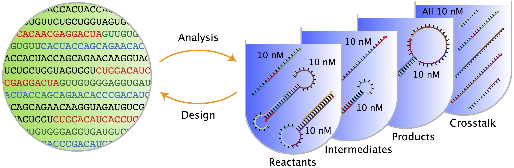

name: title
class: title, middle

## Deep active learning for DNA aptamer design

Alex Hernández-García (he/il/él)

.turquoise[Samsung-Mila-NYU Workshop · Online · Nov. 3rd 2021]

.center[

&nbsp&nbsp&nbsp&nbsp

&nbsp&nbsp&nbsp&nbsp

&nbsp&nbsp&nbsp&nbsp
]

.footer[[alexhernandezgarcia.github.io](https://alexhernandezgarcia.github.io/) | [alex.hernandez-garcia@mila.quebec](mailto:alex.hernandez-garcia@mila.quebec) | [@alexhdezgcia](https://twitter.com/alexhdezgcia)] 

---

## Collaboration

.center[

]

* .bigger[[Michael Kilgour](https://sites.google.com/view/michael-kilgour/home)] (**lead**), Postdoc at NYU, formerly McGill
* Danny Salem, University of Ottawa
* Tao Liu, McGill
* [Miroslava Cuperlovic-Culf](https://med.uottawa.ca/bmi/en/people/cuperlovic-culf-miroslava), University of Ottawa
* [Yoshua Bengio](https://yoshuabengio.org/), Professor at UdeM and Mila
* [Lena Simine](https://www.mcgill.ca/chemistry/faculty/lena-simine), Professor at McGill, Department of Chemistry

.center[

&nbsp&nbsp&nbsp&nbsp

&nbsp&nbsp&nbsp&nbsp

&nbsp&nbsp&nbsp&nbsp
]

---

## Motivation
### DNA aptamers

.context[What are DNA aptamers and why do we care?]

--

* DNA aptamers are short, single-stranded nucleotide (ssDNA) sequences. Example: `TATGCATGTGGGCGACGCAGTGCCCGTGGGATTTACTTGCAC`
--

* DNA aptamers have multiple applications as .highlight1[aptasensors] .cite[([Kilgour et al., 2021](https://chemrxiv.org/engage/chemrxiv/article-details/60cbcb1d461f5627524764ab))]:
  * Antibiotics .cite[([Mehlhorn et al., 2018](https://www.mdpi.com/2079-6374/8/2/54))]
  * Neurotransmitters .cite[([Sinha et al., 2020](https://sci-hub.st/https://link.springer.com/article/10.1007%2Fs12038-020-0017-x))]
  * Steroids .cite[([Ebrahimi et al., 2021](https://sci-hub.st/https://onlinelibrary.wiley.com/doi/epdf/10.1002/anie.202103440))]
  * Metals .cite[([Zhou et al., 2017](https://pubs.acs.org/doi/10.1021/acs.chemrev.7b00063))]
  * Proteins .cite[([Kirby et al., 2004](https://sci-hub.st/https://pubs.acs.org/doi/pdf/10.1021/ac049858n))]
  * Adenosine triphosphate .cite[([Huizenga et al., 1995](https://sci-hub.st/10.1021/bi00002a033))]
--

* Aptasensors are .highlight1[stable and selective] in crowded biochemical environments. 
--

* Designing aptamers that selectively and reliably bind a target analyte is highly non-trivial.

--

.conclusion[Improving the pipeline for DNA aptamers design can potentially impact a wide range of applications.]

---

## Motivation
### DNA aptamer design

.context[The traditional pipeline]

.right-column-66[.center[]]

.left-column-33[
The .highlight1[traditional pipeline] for DNA aptamer design (as other domains of scientific discovery):
* relies on .highlight1[highly specialised human expertise],
* it is .highlight1[time-consuming] and
* .highlight1[financially and computationally expensive].
]

---

count: false

## Motivation
### DNA aptamer design

.context[Machine learning in the loop]

.right-column-66[.center[]]

.left-column-33[
A .highlight1[machine learning model] can be:
* trained with data from _real-world_ experiments and
* used to quickly and cheaply evaluate queries
]

---

count: false

## Motivation
### DNA aptamer design

.context[Machine learning in the loop]

.right-column-66[.center[]]

.left-column-33[
A .highlight1[machine learning model] can be:
* trained with data from _real-world_ experiments and
* used to quickly and cheaply evaluate queries

.conclusion[A machine learning model replacing real-world experiments can _only_ provide _linear_ gains.]
]

---

count: false

## Motivation
### DNA aptamer design

.context[Can we do better than _linear_? An agent in the loop]

.right-column-66[.center[]]

.left-column-33[
A .highlight1[machine learning **agent**] in the loop can:
* .highlight1[learn structure] from the available data,
* .highlight1[generalise] to unexplored regions of the search space and
* .highlight1[build better queries]
]

---

count: false

## Motivation
### DNA aptamer design

.context[Can we do better than _linear_? An agent in the loop]

.right-column-66[.center[]]

.left-column-33[
A .highlight1[machine learning **agent**] in the loop can:
* .highlight1[learn structure] from the available data,
* .highlight1[generalise] to unexplored regions of the search space and
* .highlight1[build better queries]

.conclusion[A successful active learning pipeline with an ML agent in the loop can provide _exponential_ gains.]
]

---

## Methodology
### Overview

.context[An **active learning** pipeline for DNA aptamer design]

--

.right-column-66[.center[]]

---

count: false

## Methodology
### Overview

.context[An **active learning** pipeline for DNA aptamer design]

.right-column-66[.center[]]

---

count: false

## Methodology
### Overview

.context[An **active learning** pipeline for DNA aptamer design]

.right-column-66[.center[]]

.left-column-33[
**Oracle**: [NUPACK](http://www.nupack.org/), a Python package for the analysis of the minimum free-energy structure of DNA and RNA sequences.

.center[]

Used as a proxy oracle for developing and testing the active learning pipeline.
]

---

count: false

## Methodology
### Overview

.context[An **active learning** pipeline for DNA aptamer design]

.right-column-66[.center[]]

.left-column-33[
**Model**: a machine learning algorithm: multilayer perceptrons and transformers.
]

---

count: false

## Methodology
### Overview

.context[An **active learning** pipeline for DNA aptamer design]

.right-column-66[.center[]]

.left-column-33[
**GFlowNet**: a generative model that learns to produce diverse candidates with a probability proportional to their reward .cite[[(Bengio et al., 2021)](https://arxiv.org/abs/2106.04399)].

.center[]
]

---

## Methodology
### Algorithm

.context[An **active learning** pipeline for DNA aptamer design]

.right-column-66[.center[]]

.left-column-33[
**1**: Generate a _small_ initial _labelled_ data set from the oracle:
$$\mathcal{D} = \mathcal{D_0}$$

In our main experiments:
* $|\mathcal{D_0}| = 100$
* Length: 10-120
* Alphabet: 4
]

---

count: false

## Methodology
### Algorithm

.context[An **active learning** pipeline for DNA aptamer design]

.right-column-66[.center[]]

.left-column-33[
**2**: Train model by minimising the error on $\mathcal{D}$:
$$\min L(f_{\theta}(\mathcal{D}))$$

In our main experiments we train an ensemble of MLPs that provides with both _energy_ and _uncertainty_.
]

---

count: false

## Methodology
### Algorithm

.context[An **active learning** pipeline for DNA aptamer design]

.right-column-66[.center[]]

.left-column-33[
**3**: Train GFlowNet until convergence using the ML model as a proxy oracle:

.center[]

.smaller[
$$
\sum^{s,a:T(s,a)=s'} Q(s,a) = R(s')+ \sum^{a' \in \mathcal{A}(s')} Q(s', a')
$$
]
]

---

count: false

## Methodology
### Algorithm

.context[An **active learning** pipeline for DNA aptamer design]

.right-column-66[.center[]]

.left-column-33[
**4**: Generate samples with GFlowNet and select a query of best candidates 

In our main experiments we select 100 samples per iteration and explore several selection methods (based on _energy_, _uncertainty_, both, a learnt policy, etc.)
]

---

count: false

## Methodology
### Algorithm

.context[An **active learning** pipeline for DNA aptamer design]

.right-column-66[.center[]]

.left-column-33[
**5**: Score the selected query with the oracle ($\mathcal{D_1}$) and add to the data set:
$$\mathcal{D} = \mathcal{D} \cup \mathcal{D_1}$$

Then repeat all steps for $k$ iterations.
]

---

## Preliminary results

.bigger[
* For simple oracles, the active learning pipeline generates the highest-reward samples in a few grand iterations.
* For more complex oracles and longer aptamer sequences:
  * More iterations are requires
  * Query selection methods (annealing) become essential
]

---

## Current directions

.bigger[
* Analyse the capabilities of the active learning pipeline and GFlowNet for hard to optimise functions.
* Can GFlowNet be of help when MCMC is not enough?
* What are the best methods for query selection?
* Evaluate the pipeline with more sophisticated, real-world oracles .cite[([Kilgour et al., 2021](https://chemrxiv.org/engage/chemrxiv/article-details/60cbcb1d461f5627524764ab))]
]

---

## Application in other domains
### Electrocatalysts design

.context[A similar active learning pipeline can be applied for **accelerating scientific discovery** in other domains.]

.left-column-33[
  
.center[]
In collaboration with Marta Skreta, Victor Schmidt and David Rolnick.
]

.right-column-66[.center[]]

---

## Call for postdoc applications

If you are looking for a postdoc position and are interest in developing active learning models for chemical design, in a collaboration between McGill, Mila and NRC, contact Professor Lena Simine:

.center[`lena.simine@mcgill.ca`]
.center[

]

---

name: title
class: title, middle

### Thanks!

.smaller[Michael Kilgour, Alex Hernández-García, Danny Salem, Tao Liu, Miroslava Cuperlovic-Culf, Yoshua Bengio, Lena Simine]

.turquoise[Samsung-Mila-NYU Workshop · Online · Nov. 3rd 2021]

.center[

&nbsp&nbsp&nbsp&nbsp

&nbsp&nbsp&nbsp&nbsp

&nbsp&nbsp&nbsp&nbsp
]

.footer[[alexhernandezgarcia.github.io](https://alexhernandezgarcia.github.io/) | [alex.hernandez-garcia@mila.quebec](mailto:alex.hernandez-garcia@mila.quebec) | [@alexhdezgcia](https://twitter.com/alexhdezgcia)] 

---

.center[]

