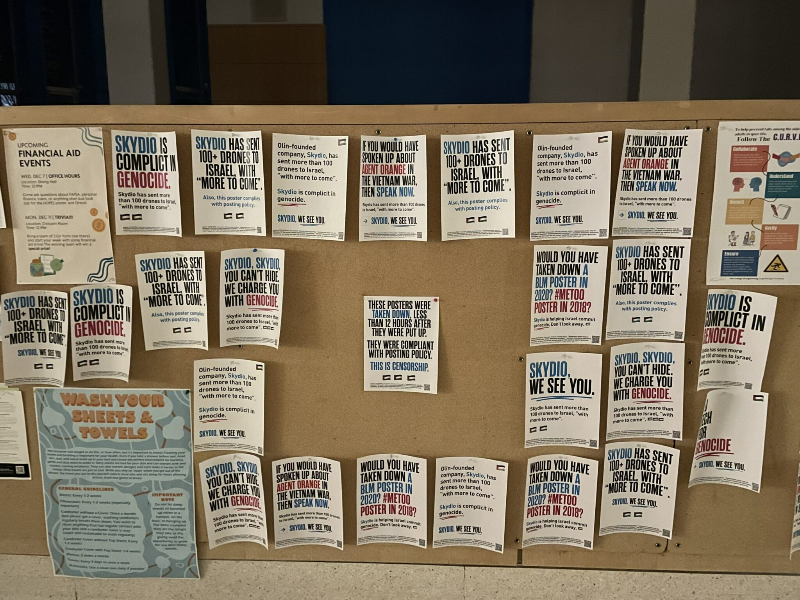

name: sftp-issue-launch-jun25
class: title, middle

## Tough on Institutions, not Individuals
### Resisting Militarism in Engineering Schools

.gray160[Science for the People Montréal · Issue Launch: Palestine, Volume 26, no. 3]

.smaller[.gray160[June 7th, 2025 · Cité-des-Hospitalières · Montréal]]

.center[

]

---

## Context

- Anonymous author
- Student at Olin College of Engineering (Massachusetts, U.S.)
- Organiser of a campaign about Skydio, "a drone manufacturer founded by Olin alumni that regularly recruits at Olin and employs many Olin students".

.center[]

---

## Individualisation of responsibility

> _"As an engineering student, I’ve noticed that debate among engineers often focuses on whether working at weapons companies is ethical."_

--

> _"This kind of conversation individualizes responsibility and places it onto students, distracting from the many ways our universities are complicit in the war machine."_

--

> _"It also plays into a common argument made by university administrators: that protesting military contractors is disrespectful to other students’ career choices."_

--

.conclusion["Antimilitarist engineers must explicitly shift our target from individuals to institutions, and combine our activism with critiques of systemic forces."]

---

## Culture of disengagement

> _"Individualization is compounded in engineering schools, where a 'culture of disengagement' renders students increasingly depoliticized over the course of their studies."_

--

> _"Engineers [are led to] see their primary lever for change as a simple refusal to personally spend their own time building weapons."_

--

> _"Avoiding the appearance of personal complicity is considered more important than challenging institutional relationships. We only seem to ask, 'is it okay to work for Raytheon?', instead of 'why does our college partner with Raytheon at all?'"_

---

## (Ir)responsibility of institutions

The response by Olin's administrators was that:
- Surprise, surprise: The postering campaign was antisemitic. 
- Antimilitarism impacts students who struggle to find work.

--

> _"In this argument, only wealthy students who can choose an ethical (and implicitly low-paying) job have the luxury of applying moral standards to companies."_

--

> _"How can administrators possibly defend the companies making weapons that massacre more Palestinians each week than our entire student body population? They can’t. Instead, they must wield class privilege and freedom of career choice as distractions, to avoid engaging with the terrible reality: that our college’s most successful alumni company is powering a genocide."_

---

## Systemic inequality and pressure

> _"As engineers, we are often assured that our skills are in high demand—but we are never told by whom."_

--

> _"Industries like weapons, oil, and pharma have invested heavily in a STEM pipeline that captures students—particularly immigrant and lower middle-class students—with the assurance of a stable career."_

--

> _"Workers have an interest in habitable environments, but are caught in a maddening contradiction, asked by their employers to destroy the conditions of life in order to make a living."_

--

.conclusion["Deathmaking industries benefit from student precarity."]

---

name: sftp-issue-launch-jun25
class: title, middle

## Tough on Institutions, not Individuals
### Resisting Militarism in Engineering Schools

.gray160[Science for the People Montréal · Issue Launch: Palestine, Volume 26, no. 3]

.smaller[.gray160[June 7th, 2025 · Cité-des-Hospitalières · Montréal]]

.center[

]
