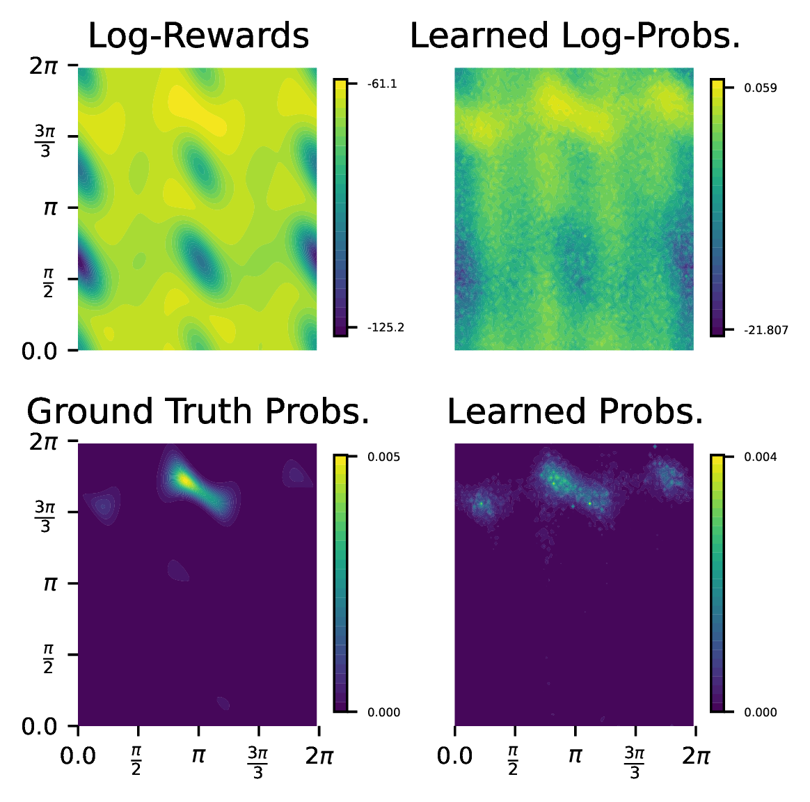

name: siam-jul25
class: title, middle

### Towards equilibrium molecular conformation generation with GFlowNets

.highlight2[Alexandra Volokhova] & .highlight2[Léna Néhale-Ezzine]

.smaller[Michał Koziarski, Piotr Gaiński, Cheng-Hao Liu, Luca Scimeca, Santiago Miret, Pablo Lemos, Luca Thiede, Zichao Yan, Emmanuel Bengio, Prudencio Tossou, Alán Aspuru-Guzik, Yoshua Bengio]

Presenting: Alex Hernández-García (he/il/él)

.turquoise[[SIAM 2025 · Computational Data Science of Nanostructures](https://meetings.siam.org/sess/dsp_programsess.cfm?SESSIONCODE=84791) · Montreal · July 28th 2025]

.center[

&nbsp&nbsp&nbsp&nbsp

]

.center[

&nbsp&nbsp&nbsp&nbsp

]

.smaller[.footer[
Slides: [alexhernandezgarcia.github.io/slides/{{ name }}](https://alexhernandezgarcia.github.io/slides/{{ name }})
]]

.qrcode[]

---

count: false
name: title
class: title, middle

### Motivation: facilitating scientific discoveries

.center[]

---

## Why scientific discoveries?

.context[Climate change is a major challenge for humanity.]

  

.center[
<figure>
	
  <figcaption>.smaller[Observed (1900–2020) and projected (2021–2100) changes in global surface temperature relative to 1850–1900 (adapted from: <a href="https://www.ipcc.ch/report/sixth-assessment-report-cycle/">IPCC Sixth Assessment Report</a>)]</figcaption>
</figure>
]

.conclusion["The evidence is clear: the time for action is now." .smaller[IPCC Report, 2022]]

---

## Why scientific discoveries?

.context[Climate change is a major challenge for humanity.]

.center[
<figure>
	
  <figcaption>.smaller[Climate-sensitive health risks (adapted from: <a href="https://www.who.int/news-room/fact-sheets/detail/climate-change-and-health">World Health Organization</a>)]</figcaption>
</figure>
]

.smaller[
* Environmental factors take the lives of around 13 million people _per year_.
* Climate change affects people’s mental and physical health, access to clean air, safe water, food and health care.
]

.full-width[
.conclusion["Climate change is the single biggest health threat facing humanity." .smaller[[WHO and WMO](https://climahealth.info/), 2024]]
]

---

## Why scientific discoveries?
### The potential of materials discovery

.context["The time for action is now"]

--

> "Limiting global warming will require major transitions in the energy sector. This will involve a substantial reduction in fossil fuel use, widespread electrification, .highlight1[improved energy efficiency, and use of alternative fuels (such as hydrogen)]." .cite[IPCC Sixth Assessment Report, 2022]

> "Reducing industry emissions will entail coordinated action throughout value chains to promote all mitigation options, including demand management, .highlight1[energy and materials efficiency, circular material flows]." .cite[IPCC Sixth Assessment Report, 2022]

--

 

.conclusion[Mitigation of the climate crisis requires innovation in the materials sector.]

???

Antimicrobial resistance

- https://www.who.int/news-room/fact-sheets/detail/antimicrobial-resistance
- https://www.who.int/news-room/feature-stories/detail/donors-making-a-difference--climate-change-and-its-impact-on-health
- https://www.who.int/news/item/31-10-2022-who-and-wmo-launch-a-new-knowledge-platform-for-climate-and-health
- https://www.who.int/news/item/08-02-2024-who-medically-important-antimicrobial-list-2024
- https://cdn.who.int/media/docs/default-source/gcp/who-mia-list-2024-lv.pdf?sfvrsn=3320dd3d_2
- https://www.who.int/publications/i/item/9789240047655

---

## Why scientific discoveries?
### The potential of drug discovery

.context[Drug discovery and vaccine development play a crucial role in modern healthcare systems.]

.right-column-33[
.center[]
]

---

count: false

## Why scientific discoveries?
### The potential of drug discovery

.context[Drug discovery and vaccine development play a crucial role in modern healthcare systems.]

.right-column-33[
.center[]
]

.left-column-66[
.highlight1[Bacterial antimicrobial resistance] contributed to 4.95 million deaths in 2019. .cite[World Health Organisation (WHO), 2023]

WHO's latest annual review identified 27 antibiotics in clinical development that address WHO bacterial priority pathogens, of which .highlight1[only 6 were classified as innovative].

"The recently approved antibacterial agents are .highlight1[insufficient to tackle the challenge] of increasing emergence and spread of antimicrobial resistance". .cite[World Health Organisation (WHO), 2021]
]

---

count: false

## Why scientific discoveries?
### The potential of drug discovery

.context[Drug discovery and vaccine development play a crucial role in modern healthcare systems.]

.right-column-33[
.center[
<figure>
	
  <figcaption><small>"No time to wait". Source: <a href="https://www.who.int/docs/default-source/documents/no-time-to-wait-securing-the-future-from-drug-resistant-infections-en.pdf">WHO</a>.</small></figcaption>
</figure>
]
]

.left-column-66[
.highlight1[Bacterial antimicrobial resistance] contributed to 4.95 million deaths in 2019. .cite[World Health Organisation (WHO), 2023]

WHO's latest annual review identified 27 antibiotics in clinical development that address WHO bacterial priority pathogens, of which .highlight1[only 6 were classified as innovative].

"The recently approved antibacterial agents are .highlight1[insufficient to tackle the challenge] of increasing emergence and spread of antimicrobial resistance". .cite[World Health Organisation (WHO), 2021]   
]

.full-width[
.conclusion["No time to wait". Alongside other necessary actions, drug discovery plays a key role in tackling the antimicrobial resistance global threat.]
]

---

## Machine Learning for Science

.center[]

.conclusion[Machine learning research has the potential to facilitate scientific discoveries to tackle climate and health challenges.]

---

count: false

## Machine Learning for Science and Science for Machine Learning

.center[]

.conclusion[Machine learning research has the potential to facilitate scientific discoveries to tackle climate and health challenges. Scientific challenges stimulate in turn machine learning research.]

---

## Sampling molecular conformations

Sampling diverse, thermodynamically feasible molecular conformations plays a crucial role in predicting properties of a molecule.

Goal: given a molecular graph $G$, to sample conformations from the Boltzmann distribution, as determined by the molecule's energy.

--

.right-column[.center[]]

.left-column[
We represent molecules by their intrinsic properties:
- Torsion angles
- Bond lengths
- Bond angles
]

---

count: false

## Sampling molecular conformations

Sampling diverse, thermodynamically feasible molecular conformations plays a crucial role in predicting properties of a molecule.

Goal: given a molecular graph $G$, to sample conformations from the Boltzmann distribution, as determined by the molecule's energy.

.right-column[.center[]]

.left-column[
We represent molecules by their intrinsic properties:
- .highlight1[Torsion angles]: responsible for most of the variance in the conformational space
- Bond lengths: considered constant (local structure)
- Bond angles: considered constant (local structure)
]

---

## Sampling molecular conformations _with GFlowNets_

GFlowNets are amortised samplers designed to sample proportionally to a reward function. Here, we used the molecular energy as reward function: Semi-empirical (GFN2-xTB), force field (GFN-FF), neural network potential (TorchANI).

--

<figure>
  
</figure>

1. Input: a small molecule represented as a SMILES.
2. Obtain molecular graph and _local structure_ from RDKit.
3. Train a GFlowNet to sample adjustments of the torsion angles of the molecular graph.

---

## Results: 2D experiments

.center[]

.conclusion[GFlowNet nearly perfectly learns to sample proportionally to the energy distribution in molecules with two torsion angles.]

---

## Results: multiple torsion angles

.center[]

---

count: false

## Results: multiple torsion angles

.center[]

.conclusion[GFlowNet can also learn the energy distributions over multiple torsion angles, better than relying solely on RDKit.]

---

## Preliminary conclusions

- GFlowNet can sample diverse low-energy conformations of drug-like molecules with multiple torsion angles.
- GFlowNet can learn various energy landscapes with different energy estimators.

Paper: Volokhova, Koziarski, et al. [Towards equilibrium molecular conformation generation with GFlowNets](https://pubs.rsc.org/en/content/articlepdf/2024/dd/d4dd00023d). Digital Discovery (2024).

--

- Since a GFlowNet needs to be trained for each molecule, is this practically useful at all?
- Is MCMC not as good as GFlowNets for this task?

.conclusion[Besides amortising each energy evaluation for a given molecule, GFlowNets can potentially _generalise to unseen molecules_.]

---

## Torsional-GFN
### Conditional conformation generation common to all molecules

<figure>
  
</figure>

1. Input: a data set of small molecules represented as a SMILES.
2. Obtain molecular graph and _local structure_ from molecular dynamics.
3. Train a GFlowNet to sample adjustments of the torsion angles of the molecular graph.
4. At sampling time, any SMILES (even from unseen molecules) can be passed as an input.

---

## Results

- We trained Torsional‐GFN on a subset of 6 molecules, each with 2 rotatable torsion angles, from the FreeSolv dataset.
- Local structures fixed to the values of one arbitrary conformation from the MD simulation dataset.
- Energy function: MMFF94.

--

.left-column[
.center[
<figure>
	
  <figcaption><small>Local structure in train set</a>.</small></figcaption>
</figure>
]]
.right-column[
.center[
<figure>
	
  <figcaption><small>Unseen local structure during training</a>.</small></figcaption>
</figure>
]]

---

## Results
### Energy histograms

.center[]

---

## Conclusions

- Torsional-GFN successfully extends the idea of sampling molecular conformations with GFlowNets to a _unique, conditional_ model with potential to generalise to unseen molecules.
- This development entail significant challenges, such as training a GNN as the policy architecture.
- For practical use, Torsional-GFN shoudl be scaled to multiple torsional angles and many more molecules.
- It may be beneficial to also sample the local structures.

Pre-print: Volokhova, Nehale-Ezzine, et al. [Torsional-GFN: a conditional conformation generator for small molecules](https://arxiv.org/abs/2507.11759). arXiv:2507.11759 (2025).

---

name: siam-jul25
class: title, middle

.bigger[.highlight2[Alexandra Volokhova], .highlight2[Léna Néhale-Ezzine], Michał Koziarski, Piotr Gaiński, Cheng-Hao Liu, Luca Scimeca, Santiago Miret, Pablo Lemos, Luca Thiede, Zichao Yan, Emmanuel Bengio, Prudencio Tossou, Alán Aspuru-Guzik, Yoshua Bengio]

.smaller[Alex Hernández-García (he/il/él)]

.center[

&nbsp&nbsp&nbsp&nbsp

&nbsp&nbsp&nbsp&nbsp

&nbsp&nbsp&nbsp&nbsp

]

.footer[[alexhernandezgarcia.github.io](https://alexhernandezgarcia.github.io/) | [alex.hernandez-garcia@mila.quebec](mailto:alex.hernandez-garcia@mila.quebec)] | [alexhergar.bsky.social](https://bsky.app/profile/alexhergar.bsky.social)  

.smaller[.footer[
Slides: [alexhernandezgarcia.github.io/slides/{{ name }}](https://alexhernandezgarcia.github.io/slides/{{ name }})
]]
