name: title
class: title, middle

## Machine learning contra el cambio climático
### Simulación de eventos climáticos y descubrimiento de materiales con GFlowNets

Alex Hernández-García (he/il/él)

.turquoise[Departamento de Tratamiento de la Señal y Comunicaciones ([DTSC](https://www.tsc.uc3m.es/)) · [UC3M](https://www.uc3m.es) · Jul 8th 2022]

.center[

&nbsp&nbsp&nbsp&nbsp

]

.footer[[alexhernandezgarcia.github.io](https://alexhernandezgarcia.github.io/) | [alex.hernandez-garcia@mila.quebec](mailto:alex.hernandez-garcia@mila.quebec)] 
.footer[[@alexhg@scholar.social](https://scholar.social/@alexhg)  | [@alexhdezgcia](https://twitter.com/alexhdezgcia) ]

.smaller[.footer[
Slides: [alexhernandezgarcia.github.io/slides/tsc-jul22](https://alexhernandezgarcia.github.io/slides/tsc-jul22)
]]

---

## Las paradas en el camino

--

* .lightblue[Grado]: Ingeniería de Sistemas Audiovisuales, Universidad Carlos III de Madrid (2013)

--

* .lightblue[Master]: Multimedia and Communications, Universidad Carlos III de Madrid (2015)

--

* .lightblue[PhD]: Institute of Cognitive Science, Universität Osnabrück, con Prof. Peter König (2016–2020)

  * En Berlín
  * Marie Skłodowska Curie ITN “NextGenVis” (_Next generation of European visual neuroscientists_)
  * Estancias en la University of Cambridge (UK) y Spinoza Centre for Neuroimaging in Amsterdam (NL)
  * Temas de la tesis: la intersección entre deep learning, neurociencia computacional y percepción visual

--

* .lightblue[Postdoc]: Mila (Québec AI Institute in Montréal) con Prof. Yoshua Bengio y Prof. David Rolnick (2021–_hoy_)

    * En Montreal
    * [IVADO Postdoctoral Research Fellow](https://ivado.ca/en/spotlight-on-our-academic-community/?programmes=postdoctoral-research-funding&annees=2021-en)
    * Temas: machine learning para descubrimientos científicos y lucha contra la crisis climática

---

## Cuando no estoy entrenando modelos o leyendo artículos...

~~...estoy intentando vaciar la bandeja de correos, revisando artículos, en reuniones...~~

---

count: false

## Cuando no estoy entrenando modelos o leyendo artículos...

~~...estoy intentando vaciar la bandeja de correos, revisando artículos, en reuniones...~~

.center[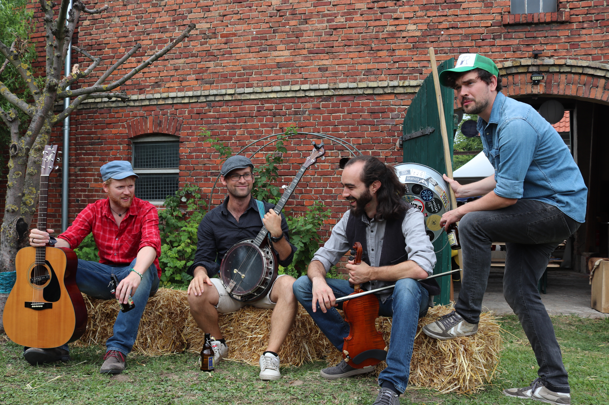]

.footnote[[BrokenJugRamblers.bandcamp.com](https://brokenjugramblers.bandcamp.com/)]

---

count: false

## Cuando no estoy entrenando modelos o leyendo artículos...

~~...estoy intentando vaciar la bandeja de correos, revisando artículos, en reuniones...~~

.center[]

---

count: false

## Cuando no estoy entrenando modelos o leyendo artículos...

~~...estoy intentando vaciar la bandeja de correos, revisando artículos, en reuniones...~~

.center[]

.footnote[[LumeDeBiqueira.es](https://www.lumedebiqueira.es/en/)]

---

## Collaborators

.left-column[
* Yoshua Bengio
* David Rolnick
* Lena Simine (McGill)
* Michael Kilgour (NYU)
* Yasmine Benabed (UdeM)
* Moksh Jain
* Emmanuel Bengio
* Alexandre Duval
* Marta Skreta
* Michaël Morin
]
.right-column[
* Victor Schmidt
* Sasha Luccioni
* Tianyu Zhang
* Mélisande Teng
* ...
]

---

name: title
class: title, middle

## Descubrimiento de materiales con GFlowNets
### Part 1

.center[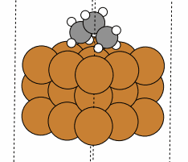]

---

## Motivation

.context[Climate change is a major challenge for humanity.]

.left-column-66[
<figure>
	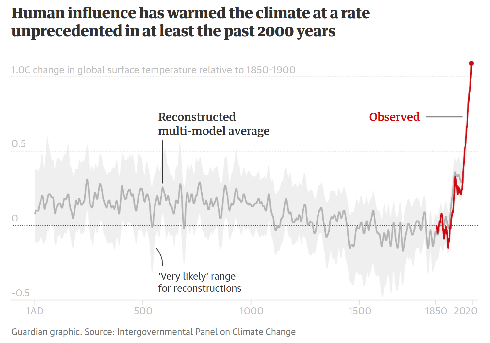
  <figcaption>Modelled and observed global average temperatures in the last 2 millenia (source graphic: <a href="https://www.theguardian.com/science/2021/aug/09/humans-have-caused-unprecedented-and-irreversible-change-to-climate-scientists-warn">The Guardian</a>.)</figcaption>
</figure>
]

.right-column-33[
Consequences:
* Melting glaciers and polar ice
* Sea level rise
* Heatwaves
* Floods
* Droughts
* Wildfires
* ...
]

???

* Flash floods kill **5,000** people per year.
* Sea levels are expected to rise by **2 metres** by the end of the century
* Rising sea levels could disrupt the lives of **1 billion people** by the end of 2050.
* As much as **40% of the Amazon** forest is at risk of becoming a savanna.
* In 2015, forest fires claimed roughly **980 000 $km^2$** of the world’s forest.
* Forest fires emmitted **~1.8 Gt of CO2** in 2019.

---

## Motivation

.context[Climate change is a major challenge for humanity.]

.center[
<figure>
	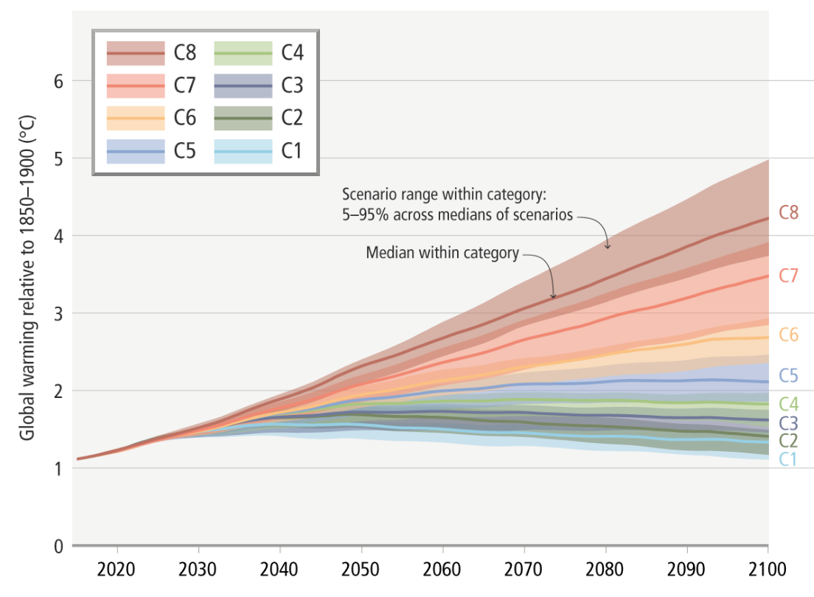
  <figcaption>Median global warming across modelled scenarios. Adapted from IPCC Sixth Assessment Report, 2022</figcaption>
</figure>
]

--

.conclusion["The evidence is clear: the time for action is now." .smaller[IPCC Sixth Assessment Report, 2022]]

???

* Category C1: scenarios that limit warming to 1.5°C in 2100 with a likelihood of greater than 50%, and reach or exceed warming of 1.5°C during the 21st century with a likelihood of 67% or less. 
* Category C2: same as C1 but exceed warming of 1.5°C during the 21st century with a likelihood of _greater_ than 67%.
* Category C3: scenarios that limit peak warming to 2°C throughout the 21st century with a likelihood of greater than 67%
* Category C8: scenarios that exceed warming of 4°C during the 21st century with a likelihood of 50% or greater.

---

## Motivation

.context["The time for action is now"]

> "Limiting global warming will require major transitions in the energy sector. This will involve a substantial reduction in fossil fuel use, widespread electrification, .highlight1[improved energy efficiency, and use of alternative fuels (such as hydrogen)]." .cite[IPCC Sixth Assessment Report, 2022]

> "Net-zero CO2 emissions from the industrial sector are challenging but possible. Reducing industry emissions will entail coordinated action throughout value chains to promote all mitigation options, including demand management, .highlight1[energy and materials efficiency, circular material flows], as well as abatement technologies and transformational changes in production processes." .cite[IPCC Sixth Assessment Report, 2022]

--

 

.conclusion[Mitigation of the climate crisis requires transformational changes in the energy and materials efficiency.]

---

## Motivation
### The potential of better materials

.context[The climate crisis demands more efficient materials.]

According to the IPCC Sixth Assessment Report (2022), improving material efficiency can reduce 0.93 ($\pm 0.23$) GtCO₂-eq per year and fuel switching 2.1 ($\pm 0.52$) GtCO₂-eq per year, only in the industry sector. Carbon capture and storage can reduce 0.54 ($\pm 0.27$) GtCO₂-eq per year in the energy sector. †

.footnote[† Global anthropogenic emissions in 2019 were estimated in 59 ($\pm 6.6$) GtCO₂-eq. The budget from 2020 to limit warming to 1.5°C is estimated in 510 ($\pm 180$) GtCO₂-eq.]

---

count: false

## Motivation
### The potential of better materials

.context[The climate crisis demands more efficient materials.]

According to the IPCC Sixth Assessment Report (2022), improving material efficiency can reduce 0.93 ($\pm 0.23$) GtCO₂-eq per year and fuel switching 2.1 ($\pm 0.52$) GtCO₂-eq per year, only in the industry sector. Carbon capture and storage can reduce 0.54 ($\pm 0.27$) GtCO₂-eq per year in the energy sector. †

What are better, new materials needed for?

* Electrocatalysts for fuel cells, hydrogen storage, industrial chemical reactions, etc.
* Electrocatalysts for carbon capture.
* Solid electrolytes for batteries.
* Thin film materials for photovoltaics.
* ...

.footnote[† Global anthropogenic emissions in 2019 were estimated in 59 ($\pm 6.6$) GtCO₂-eq. The budget from 2020 to limit warming to 1.5°C is estimated in 510 ($\pm 180$) GtCO₂-eq.]

---

## Motivation
### Scientific discoveries in history

.context[Material discovery is a key ingredient for climate change mitigation.]

--

Many notable scientific discoveries have occurred due to .highlight1[serendipity] or .highlight1[by accident]:

--

* **Dynamite** (Alfred Nobel, 1867)
* **X-rays** (Wilhelm C. Röntgen, 1895)
* **Radioactivity** (Henri Becquerel and Marie Skłodowska–Curie, 1896)
* **Penicillin** (Alexander Fleming, 1929)
* **Cyanoacrylate (superglue)** (Harry Coover, 1942)
* **Lysergic acid diethylamide (LSD)** (Albert Hofmann, 1943)

--

 
.conclusion[Clearly, we should not rely on serendipity to fight climate change.]

???

Joke experience with some of them, like penicillin and superglue.

---

count: false

## Motivation
### Scientific discoveries in history

.context[Material discovery is a key ingredient for climate change mitigation.]

.center[
<figure>
	
  <figcaption>Four paradigms in scientific discovery. Source: <a href="https://www.nature.com/articles/s41524-022-00810-x">Li et al., 2022</a>. (<a href="https://creativecommons.org/licenses/by/4.0/">CC BY 4.0</a>)</figcaption>
</figure>
]

.references[
* Li et al. [Machine learning in concrete science: applications, challenges, and best practices](https://www.nature.com/articles/s41524-022-00810-x). Nature  npj Computational Materials, 2022
]

???

Example of concrete: most prevalent human-made material on Earth, and the most consumed commodity after water. The annual consumption of concrete in the world has reached 35 billion tons, which is twice as much as that of all other building materials combined.

---

count: false

## Motivation
### Scientific discoveries in history

.context[Material discovery is a key ingredient for climate change mitigation.]

.center[
<figure>
	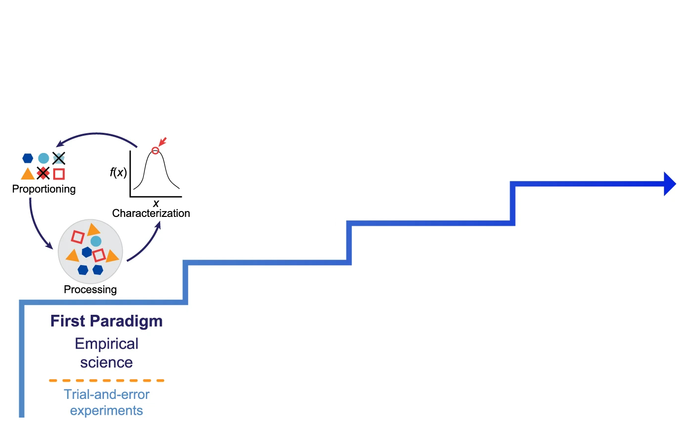
  <figcaption>Four paradigms in scientific discovery. Source: <a href="https://www.nature.com/articles/s41524-022-00810-x">Li et al., 2022</a>. (<a href="https://creativecommons.org/licenses/by/4.0/">CC BY 4.0</a>)</figcaption>
</figure>
]

.references[
* Li et al. [Machine learning in concrete science: applications, challenges, and best practices](https://www.nature.com/articles/s41524-022-00810-x). Nature  npj Computational Materials, 2022
]

???

Concrete: The properties and performance of concrete can be tailored to meet design requirements by varying the type and quantity of the mixture constituents (e.g., cement, water, aggregate, and admixtures). Traditional approaches for designing concrete mixtures often rely on trial-and-error, iterative proportioning, processing, and characterization until the target properties are achieved.

---

count: false

## Motivation
### Scientific discoveries in history

.context[Material discovery is a key ingredient for climate change mitigation.]

.center[
<figure>
	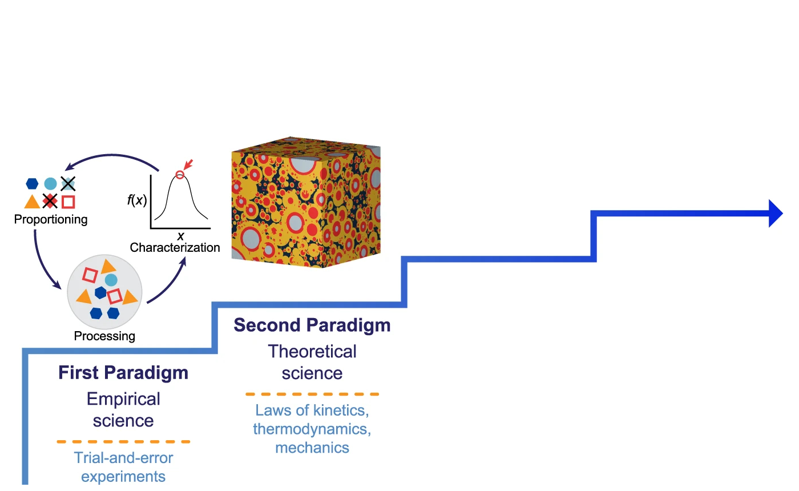
  <figcaption>Four paradigms in scientific discovery. Source: <a href="https://www.nature.com/articles/s41524-022-00810-x">Li et al., 2022</a>. (<a href="https://creativecommons.org/licenses/by/4.0/">CC BY 4.0</a>)</figcaption>
</figure>
]

.references[
* Li et al. [Machine learning in concrete science: applications, challenges, and best practices](https://www.nature.com/articles/s41524-022-00810-x). Nature  npj Computational Materials, 2022
]

???

Concrete: it is possible to optimize the compressive strength of concrete mixtures by adjusting the water/cement ratio, total aggregate/cement ratio, and coarse aggregate/total aggregate ratio6. Yet the practical application of this iterative refinement approach is limited by the exponential increase in the number of specimens and experiments when complex concrete mixtures are studied and several compositional parameters are simultaneously considered as combinatorial variables. As a result, materials development in concrete science involves time-consuming validation/development cycles from laboratory trials to field applications. Efforts to accelerate knowledge acquisition and materials design in concrete science are thus of paramount importance.

Beginning in the 1980s, the development of microstructural models of cement hydration has enabled a fundamental understanding of microstructure–property relationships in concrete7, which has marked the second paradigm. By applying basic laws of kinetics, thermodynamics, and mechanics, and providing analytical solutions to cement hydration. Successful demonstrations include the three-dimensional cement hydration and microstructure development model (CEMHYD3D)8,9; the hydration, morphology, and structural development model (HYMOSTRUC)10; the integrated particle kinetics model11; and the microstructural modeling platform (μic)

---

count: false

## Motivation
### Scientific discoveries in history

.context[Material discovery is a key ingredient for climate change mitigation.]

.center[
<figure>
	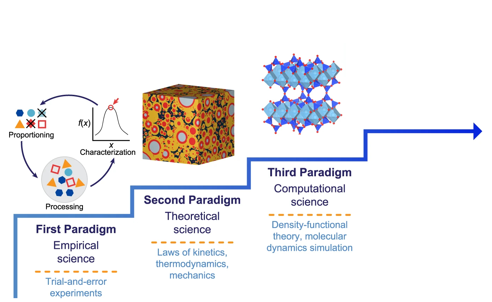
  <figcaption>Four paradigms in scientific discovery. Source: <a href="https://www.nature.com/articles/s41524-022-00810-x">Li et al., 2022</a>. (<a href="https://creativecommons.org/licenses/by/4.0/">CC BY 4.0</a>)</figcaption>
</figure>
]

.references[
* Li et al. [Machine learning in concrete science: applications, challenges, and best practices](https://www.nature.com/articles/s41524-022-00810-x). Nature  npj Computational Materials, 2022
]

???

Concrete: However, the complex nature of cement hydration makes it challenging to develop accurate and generalizable models, and these modeling approaches, to varying degrees, rely on thermochemical, physical, and structural data that must be obtained either from accurate experimental observations or from calculations at the atomistic and molecular scales.

In this context, the use of density-functional theory (DFT) and classical molecular dynamics (MD) simulations has been explored in concrete science since the 2000s owing to the ever-growing computing power16. This has given rise to the third paradigm (computational science; Fig. 1), where the first-principle models have been integrated and employed to further describe cementitious materials properties and improve understanding of cement hydration. Related simulation efforts have focused primarily on cementitious phases such as the calcium silicate hydrate (C-S-H) gel, the essential reaction product of cement hydration.

---

count: false

## Motivation
### Scientific discoveries in history

.context[Material discovery is a key ingredient for climate change mitigation.]

.center[
<figure>
	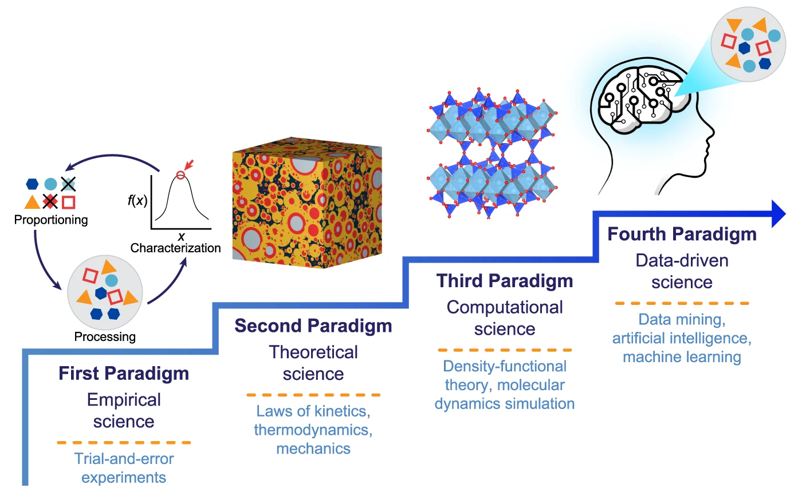
  <figcaption>Four paradigms in scientific discovery. Source: <a href="https://www.nature.com/articles/s41524-022-00810-x">Li et al., 2022</a>. (<a href="https://creativecommons.org/licenses/by/4.0/">CC BY 4.0</a>)</figcaption>
</figure>
]

.references[
* Li et al. [Machine learning in concrete science: applications, challenges, and best practices](https://www.nature.com/articles/s41524-022-00810-x). Nature  npj Computational Materials, 2022
]

???

Concrete: However, these computational techniques require considerable computational resources and thus come with significant challenges, such as their limited time scales and the relatively small number of atoms in a simulated system. In addition, it may be difficult to validate these simulations with experiments, given the small time and length scales and high-fidelity measurements required.

By leveraging existing datasets with data-driven models, ML can automatically learn implicit patterns and extract valuable information while accounting for the inherent complexity of concrete mixtures and their properties.

---

## Active learning for scientific discovery

.context[The traditional pipeline (no ML)]

.right-column-66[ .center[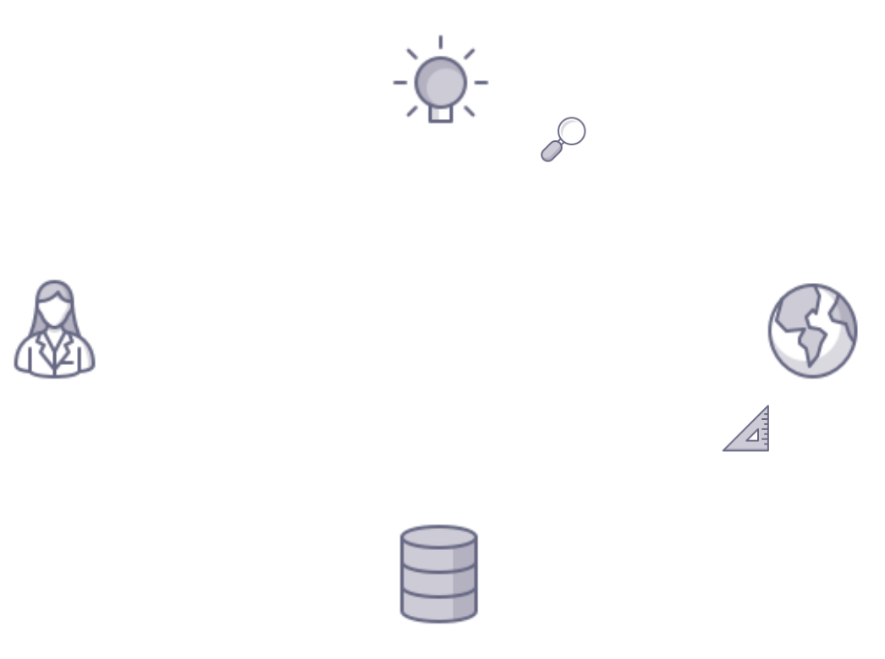]]

.left-column-33[
The .highlight1[traditional pipeline] for scientific discovery (paradigms 1-3):
* relies on .highlight1[highly specialised human expertise],
* it is .highlight1[time-consuming] and
* .highlight1[financially and computationally expensive].
]

---

count: false

## Active learning for scientific discovery

.context[Machine learning in the loop]

.right-column-66[ .center[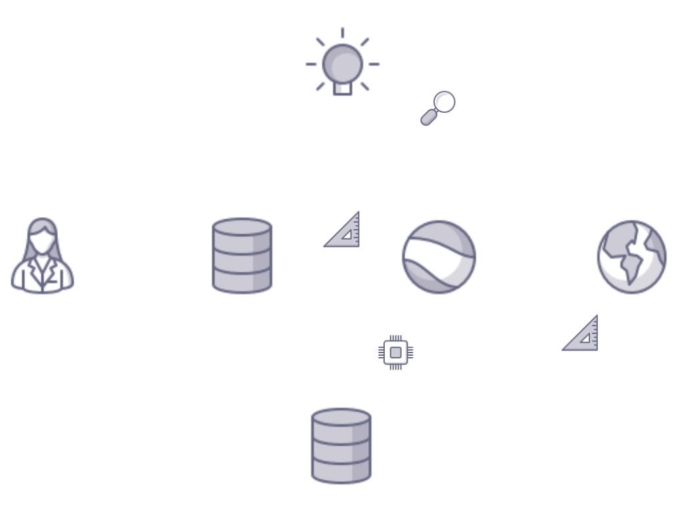]]

.left-column-33[
A .highlight1[machine learning model] can be:
* trained with data from _real-world_ experiments and
* used to quickly and cheaply evaluate queries
]

---

count: false

## Active learning for scientific discovery

.context[Machine learning in the loop]

.right-column-66[ .center[]]

.left-column-33[
A .highlight1[machine learning model] can be:
* trained with data from _real-world_ experiments and
* used to quickly and cheaply evaluate queries

.conclusion[A machine learning model replacing real-world experiments can _only_ provide _linear_ gains.]
]

---

count: false

## Active learning for scientific discovery

.context[Can we do better than _linear_? An agent in the loop]

.right-column-66[ .center[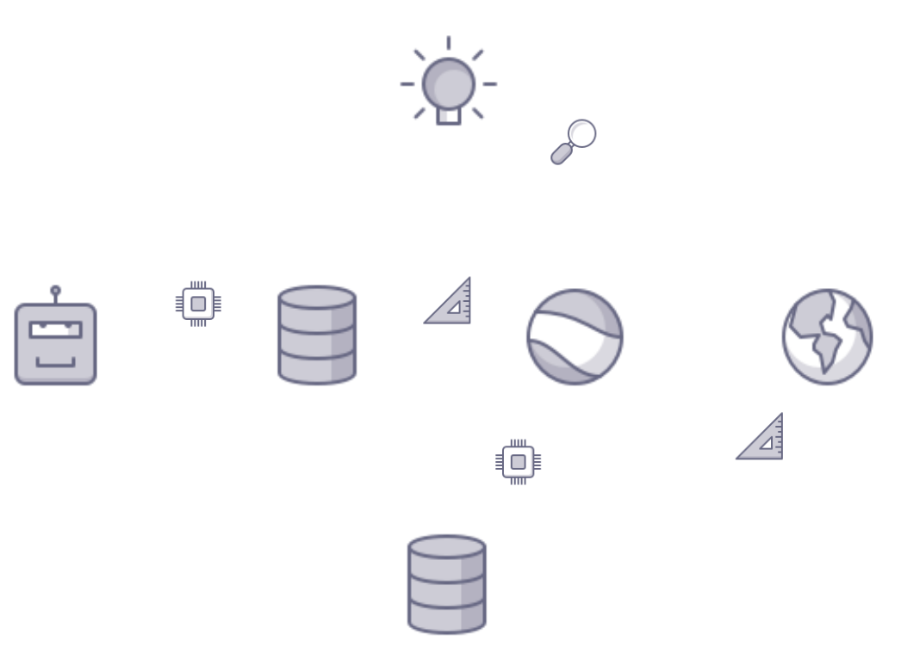]]

.left-column-33[
A .highlight1[machine learning **agent**] in the loop can:
* .highlight1[learn structure] from the available data,
* .highlight1[generalise] to unexplored regions of the search space and
* .highlight1[build better queries]
]

---

count: false

## Active learning for scientific discovery

.context[Can we do better than _linear_? An agent in the loop]

.right-column-66[ .center[]]

.left-column-33[
A .highlight1[machine learning **agent**] in the loop can:
* .highlight1[learn structure] from the available data,
* .highlight1[generalise] to unexplored regions of the search space and
* .highlight1[build better queries]

.conclusion[A successful AL pipeline with an ML agent in the loop can provide _exponential_ gains.]
]

---

count: false

## Active learning for scientific discovery

.context[GFlowNet as the agent.]

.right-column-66[ .center[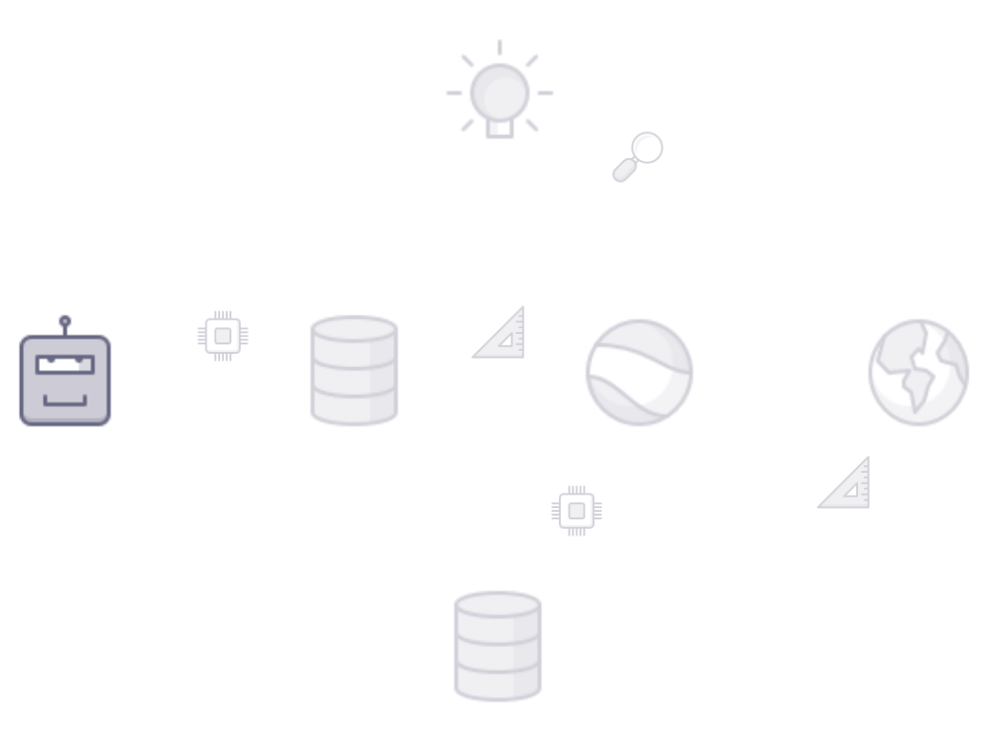]]

.left-column-33[
A .highlight1[machine learning **agent**] in the loop can:
* .highlight1[learn structure] from the available data,
* .highlight1[generalise] to unexplored regions of the search space and
* .highlight1[build better queries]

.conclusion[A successful AL pipeline with an ML agent in the loop can provide _exponential_ gains.]
]

---

## Why GFlowNet?

.context[The maximum is _not_ all you need!]

* Scoring functions used for in-silico evaluation can be unreliable.
    * Cannot capture all desired properties.
    * Large errors due to approximations and assumptions.
* Instead of a single candidate maximizing the scoring function, we need to look for _modes_ of the reward function.
    * **Diverse** batches covering modes of the scoring function are more likely to result in useful candidates.
    * **Diversity** in candidate generation is also critical to accomodate the diversity in the target mechanisms.

.center[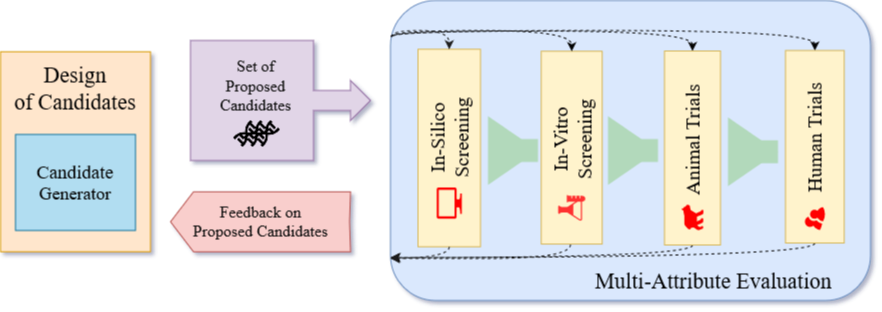]

.references[
Jain et al. [Biological Sequence Design with GFlowNets](https://arxiv.org/abs/2203.04115), ICML, 2022. 
]

---

## Why GFlowNet?

.context[Doesn't MCMC do that already?]

Markov chain Monte Carlo:

.center[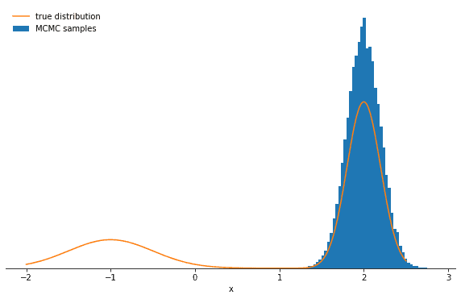]

* Traditional ML workhorse for sampling from a target distribution.
* Mixing time can be exponential for well separated modes in high-dimensional distributions.
* Sampling large number of data points can be slow, as computation happens during sampling. 
---

## Why GFlowNet?

.context[Doesn't RL with exploration do that already?]

Reinforcement learning with exploration:

* Captures only the _highest_ mode of the reward.
* Places higher values for states with more trajectories leading up to them.
* Efficient exploration in large state spaces, with function approximation is still an open research problem.
---

## GFlowNet
### A generative method to sample proportional rewards

.right-column-33[.center[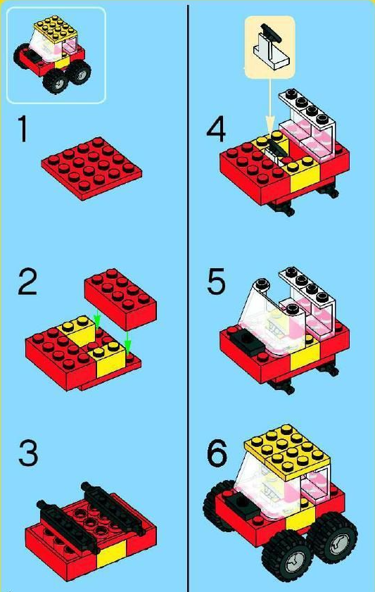]]

* Discrete objects $x \in \cal X$, can be constructed through a sequence of steps $\tau$ using a given set of actions.
* At each step of the trajectory $\tau=(s_0\rightarrow s_1 \rightarrow \dots \rightarrow s_f)$, we get a partially constructed object $s\in \mathcal{S}$, including a starting empty state $s_0$ and a common final state $s_f$. 
* Induces a directed acyclic graph (DAG) $\mathcal{G}=(\mathcal{S},\mathcal{E})$, denoting all possible constructions in the domain.
* GFlowNets learn a policy $\pi$ to construct $x$ such that: $$\pi(x) \propto R(x)$$
* Computation is ammortized during training, hence sampling becomes "cheap".
---

## Flows

.right-column-33[.center[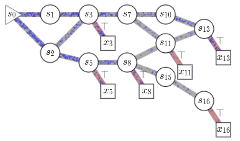]]

* Analogous to water-flow in pipes.
* Trajectory Flow $F(\tau)$ denotes probability mass assigned to trajectory $\tau$.
* State Flow $F(s)$ is the flow of all trajectories passing through the state $s$.
* Edge Flow $F(s\rightarrow s')$ is the flow through a particular edge $s\rightarrow s'$.
* Forward Policy $P_F$: $P\_F(s'|s) = \frac{F(s\rightarrow s')}{F(s)}$
* Backward Policy $P_B$: $P\_B(s|s') = \frac{F(s\rightarrow s')}{F(s')}$

.references[
Bengio et al. [Flow network based generative models for non-iterative diverse candidate generation](https://arxiv.org/abs/2106.04399), NeurIPS, 2021. 
]

???

Not to be confused with normalizing flows!

---

## Flow Consistency
###Principle of Conservation

.right-column-33[.center[]]

.left-column-66[
**Consistent Flow**:  Flow $F$ satisfies the _flow consistency equation_
$$\sum\_{s' \in \text{Parent}(s)} F\_\theta(s' \rightarrow s) = \sum\_{s'' \in \text{Child}(s)} F\_\theta(s \rightarrow s')$$

**Theorem**: For a consistent flow $F$ with terminal flow set as the reward $F(x\rightarrow s_f)=R(x)$, the forward policy samples $x$ proportionally to $R(x)$.
$$\pi(x)\propto R(x)$$

**Corollary**: The flow at $s_0$, $F(s_0)$ is the partition function $Z$! 
]

.references[
Bengio et al. [Flow network based generative models for non-iterative diverse candidate generation](https://arxiv.org/abs/2106.04399), NeurIPS, 2021. 
]

---

## Learning GFlowNets

$$\sum\_{s' \in \text{Parent}(s)} F\_\theta(s' \rightarrow s) = \sum\_{s'' \in \text{Child}(s)} F\_\theta(s \rightarrow s')$$

* **Flow Matching Objective**: $$\mathcal{L}\_{FM}(s; \theta) = \left(\log \frac{\sum\_{s'\in \text{Parent}(s)} F\_\theta(s'{\rightarrow} s)}{\sum\_{s'' \in \text{Child}(s)}F\_\theta(s{\rightarrow} s'')}\right)^2$$
* **Trajectory Balance**: $$\mathcal{L}\_{TB} (\tau;\theta) = \left(\log \frac{Z\_\theta \prod\_{s{\rightarrow} s' \in \tau}P\_{F\_\theta}(s'|s)}{R(x)\prod\_{s\rightarrow s' \in \tau} P\_{B\_\theta}(s|s') }\right)^2$$

---

## Application
### Biological sequence design: anti-microbial peptides

* Peptides are short chains of amino acids (proteins) .cite[(Pirtskhalava et al., 2021)]
* The goal is to find peptides with anti-microbial properties
* We consider chains of length 50 or shorter, with a vocabulary of 20 aminoacids ($>10^{65}$)
* Data set: 6438 positive (anti-microbial samples) and 9522 negative samples.

.references[
* Pirtskhalava et al. DBAASP V3: Database of antimicrobial/cytotoxic activity and structure of peptides as a resource for development of new therapeutics. Nucleic Acids Research, 2021.
* Jain et al. [Biological Sequence Design with GFlowNets](https://arxiv.org/abs/2203.04115), ICML, 2022. 
]

???

3219 AMP, 4611 non-AMP (anti-microbial properties)

---

## Application
### Biological sequence design: anti-microbial peptides

.context[An **active learning** pipeline for biological sequence design]

.right-column-66[.center[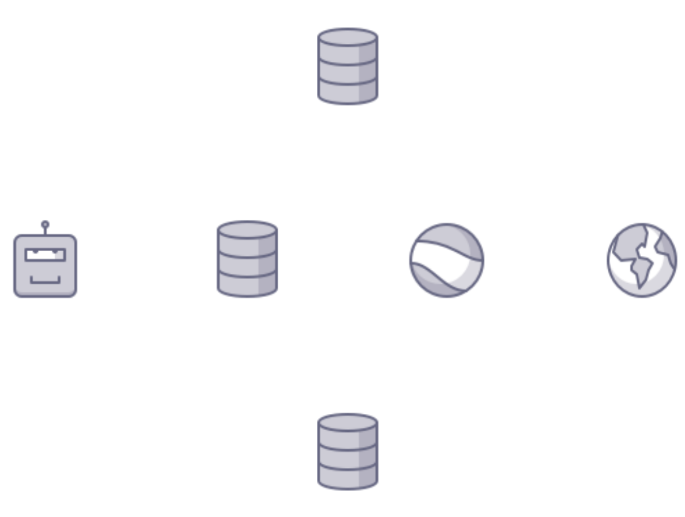]]

---

count: false

## Application
### Biological sequence design: anti-microbial peptides

.context[An **active learning** pipeline for biological sequence design]

.right-column-66[.center[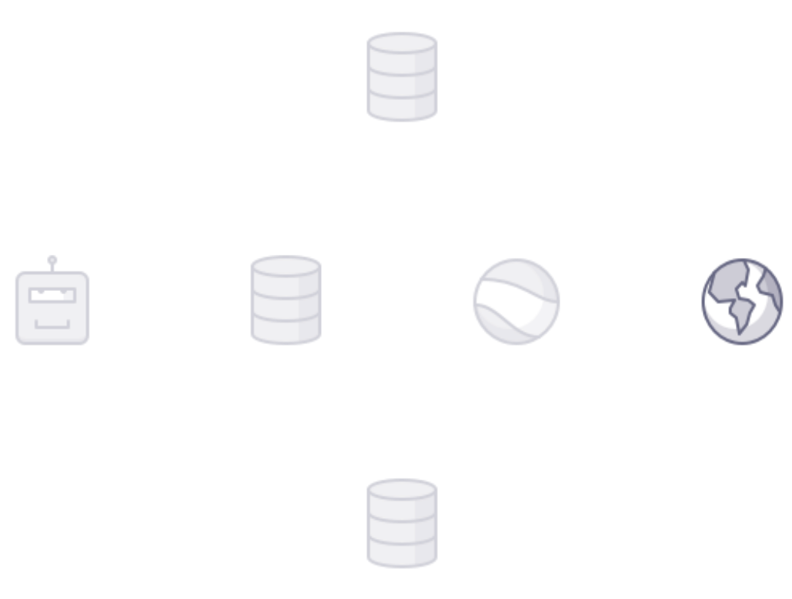]]

.left-column-33[
**Oracle**: MLPs trained on a separate partition of the data.

In other tasks, such as DNA aptamers, we have access to computational libraries..
]

---

## Application
### Biological sequence design: anti-microbial peptides

.context[An **active learning** pipeline for biological sequence design]

.right-column-66[.center[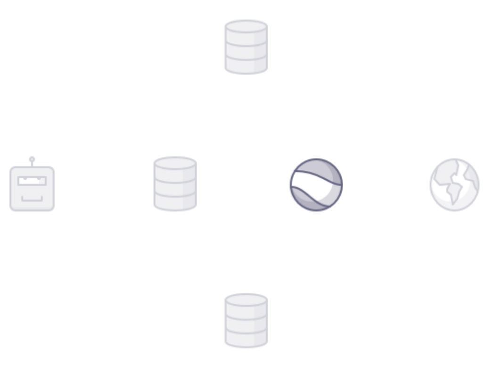]]

.left-column-33[
**Model**: MLPs and transformers.
]

---

count: false

## Application
### Biological sequence design: anti-microbial peptides

.context[An **active learning** pipeline for biological sequence design]

.right-column-66[.center[]]

.left-column-33[
**Agent**: GFlowNet

.center[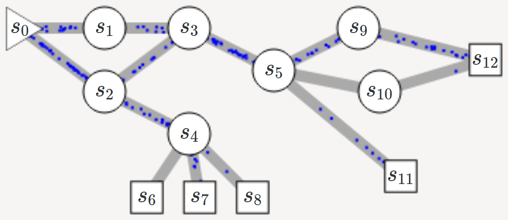]
]

---

## Methodology
### Algorithm

.context[An **active learning** pipeline for biological sequence design]

.right-column-66[.center[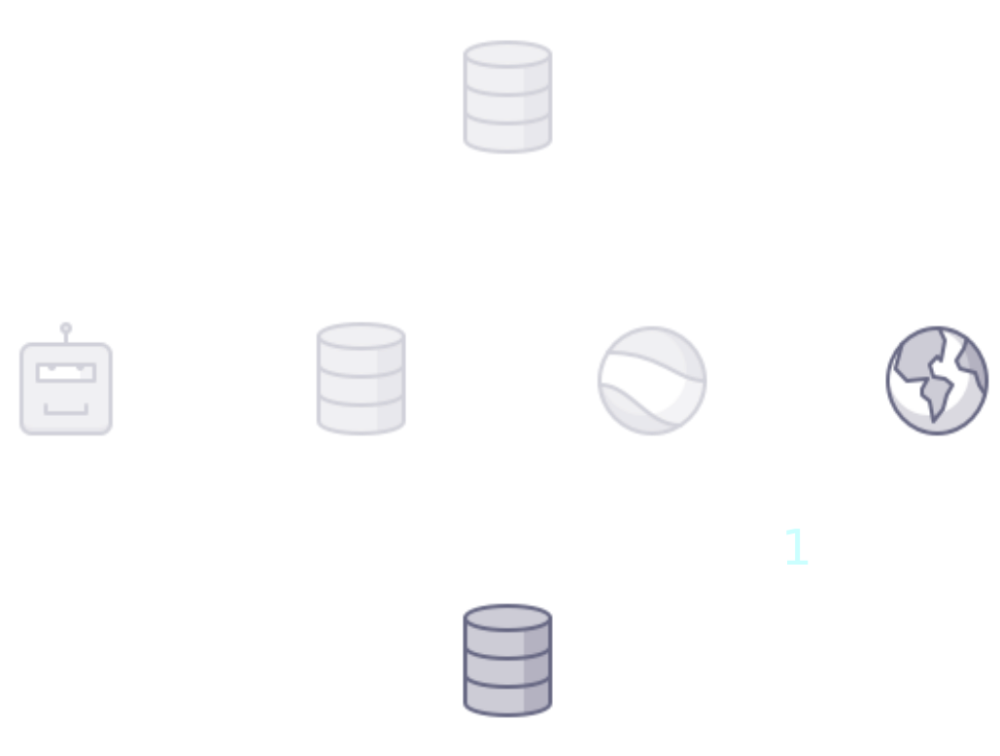]]

.left-column-33[
**1**: Generate a _small_ initial _labelled_ data set from the oracle:
$$\mathcal{D} = \mathcal{D_0}$$

In our main experiments:
* $|\mathcal{D_0}| = 7830$
* Length: up to 50
* Alphabet: 20 aminoacids
]

---

count: false

## Methodology
### Algorithm

.context[An **active learning** pipeline for biological sequence design]

.right-column-66[.center[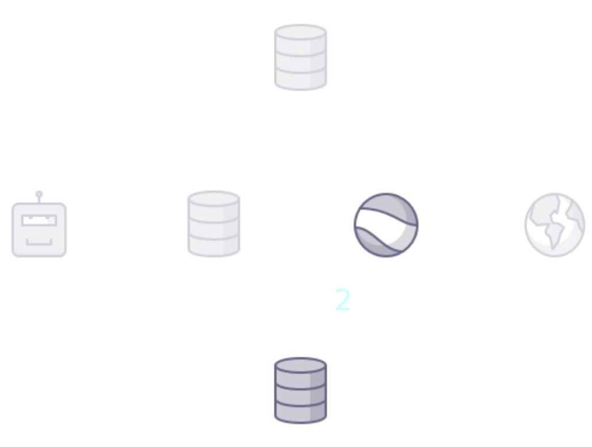]]

.left-column-33[
**2**: Train model by minimising the error on $\mathcal{D}$:
$$\min L(f_{\theta}(\mathcal{D}))$$

In our main experiments we train with MC dropout or an ensemble of MLPs that provides with both _energy_ and _uncertainty_.
]

---

count: false

## Methodology
### Algorithm

.context[An **active learning** pipeline for biological sequence design]

.right-column-66[.center[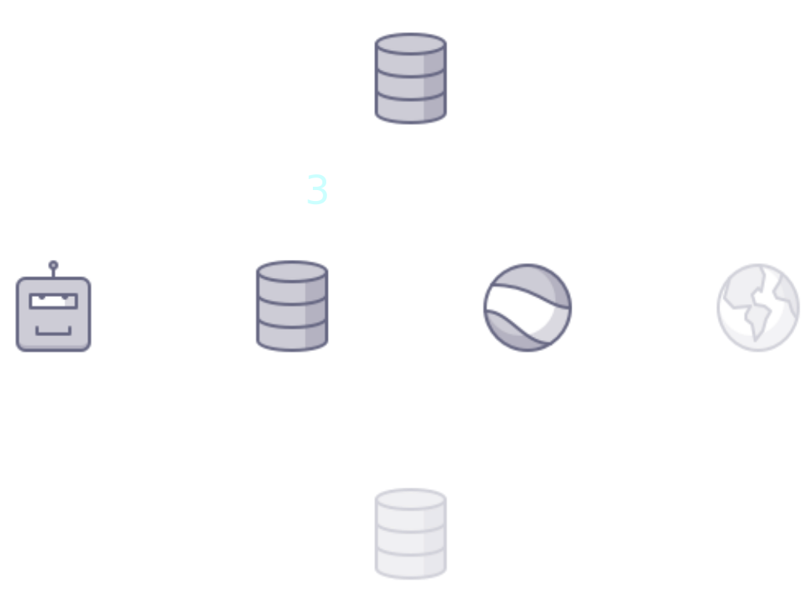]]

.left-column-33[
**3**: Train GFlowNet until convergence using the ML model as a proxy oracle:

.center[]
]

---

count: false

## Methodology
### Algorithm

.context[An **active learning** pipeline for biological sequence design]

.right-column-66[.center[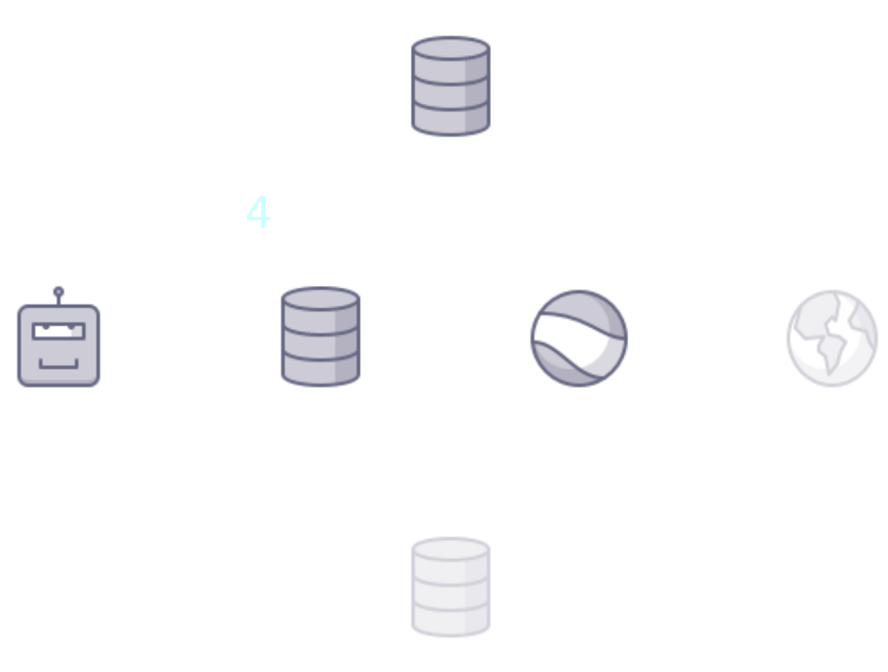]]

.left-column-33[
**4**: Generate samples with GFlowNet and select a query of best candidates 

We select 1000 samples per iteration.
]

---

count: false

## Methodology
### Algorithm

.context[An **active learning** pipeline for biological sequence design]

.right-column-66[.center[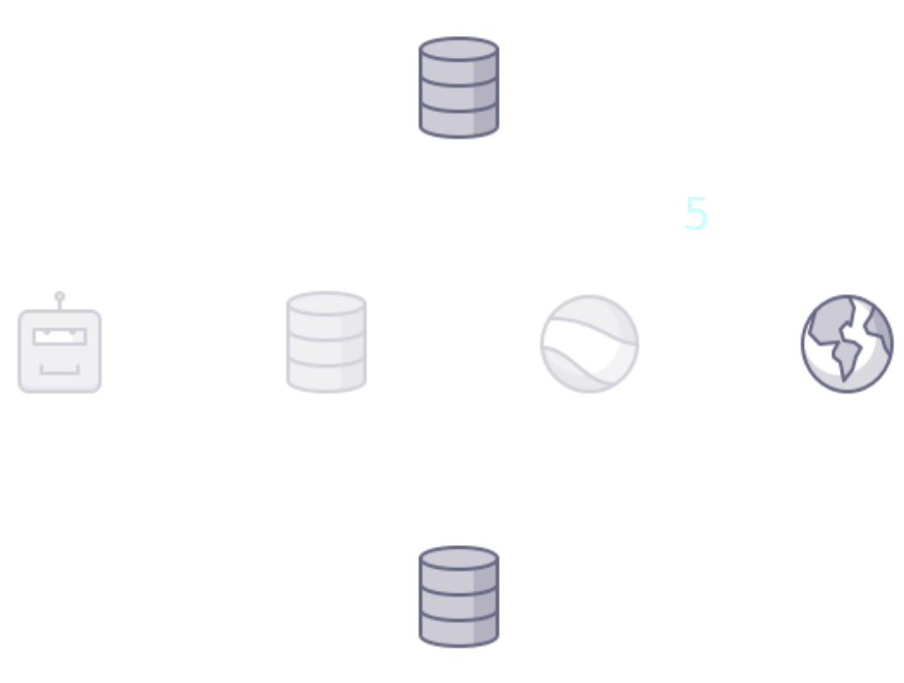]]

.left-column-33[
**5**: Score the selected query with the oracle ($\mathcal{D_1}$) and add to the data set:
$$\mathcal{D} = \mathcal{D} \cup \mathcal{D_1}$$

Then repeat all steps for $k=10$ iterations.
]

---

## Evaluation
### Desiderata for candidates

.context[We look for a .highlight1[diverse] set of .highlight1[good] candidates.]

The set of top $k$ candidates: $\mathcal{D}_{Best} = TopK(\mathcal{D}_K \backslash \mathcal{D}_0)$

* .highlight1[Performance / usefulness score]: mean score of $\mathcal{D}_{Best}$
* .highlight1[Diversity]: mean distance within $\mathcal{D}_{Best}$
* .highlight1[Novelty]: mean distance with between $\mathcal{D}_{Best}$ and $\mathcal{D}_0$

--

&nbsp
&nbsp

.conclusion[A set of candidates should be evaluated holistically, considering all three metrics.]

---

## Evaluation
### Baselines

Three representative recent machine learning models for sequence design:

* DynaPPO: Active Learning with RL as Generator .cite[Angermueller et al., 2019]
* AmortizedBO: Bayesian Optimization with RL-based Genetic Algorithm .cite[Swersky et al., 2020]
* COMs: Deep Model Based Optimization .cite[Trabucco et al., 2021]

.references[
* Angermueller et al. Model-based reinforcement learning for biological sequence design. ICLR, 2019.
* Swersky et al. Amortized bayesian optimization over discrete spaces. PMLR, 2020.
* Trabucco et al. Conservative objective models for effective offline model-based optimization. ICML, 2021.
]

---

## Results

.context[Active learning with 10 rounds, $b = 1000$, $K = 100$.]

* GFlowNet generates sequences with .highlight1[score] on par or higher than the strongest baseline.
* GFlowNet generates much more .highlight1[diverse] and .highlight1[novel] samples than the baselines.

.center[
<figure>
	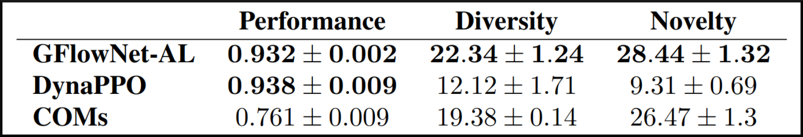
  <figcaption>Metrics with $K=100$</figcaption>
</figure>
]

--

.smaller[
* AmortizedBO generated nonsensical peptides because it is designed for fixed-length sequences.
* Methods such as COMs, which perform local search around known candidates, perform poorly when the goal is to generate .highlight1[large], .highlight1[diverse] and .highlight1[novel] batches.
]

--

.conclusion[GFlowNet succeeds at generating sequences that satisfy all three metrics: high score, diversity and novelty.]

---

## Other applications and future work

* DNA aptasensors with low free energy and high binding activity with target ligand.
* Electrocatalysts with low activation energy with target molecule.
* Solid-state ionic conductors for batteries
* Molecular conformation
* Catalysis for carbon capture
* Expanding active learning with multi-fidelity oracles.

---

## Conclusions
### (Part 1)

* Discovering new, more energy efficient materials is key to tackle the climate crisis.
* The traditional pipeline for scientific discovery is too slow for meet the objectives.
* Generative flow networks (GFlowNet) is an effective method to sample objects from multiple modes of a target distribution.: .highlight1[high reward] and .highlight1[diverse] samples.
* This property makes GFlowNets an effective method for improving active learning pipelines.
* We have shown that active learning with GFlowNet as sampling method can be used to generate high-score, diverse and novel sequences, using biologically relevant data and target functions.
* We are currently applying a similar pipeline for:
    * Electrocatalyst design
    * Solid-state ionic conductors
    * Molecular conformation

---

name: title
class: title, middle

## Simulación de eventos climáticos
### Part 2

.center[]

---

## Contributors

Victor Schmidt, Alexandra Sasha Luccioni, Mélisande Teng, Tianyu Zhang, Alexia Reynaud, Sunand Raghupathi, Vahe Vardanyan, Yoshua Bengio, and others.

    
.conclusion[This project is the joint effort of a large and interdisciplinary team.]

---

## Visualising climate change impacts on street photos
### Motivation

--

There is a mismatch between the magnitude of the climate crisis and the public's concern about it.

.center[
<figure>
	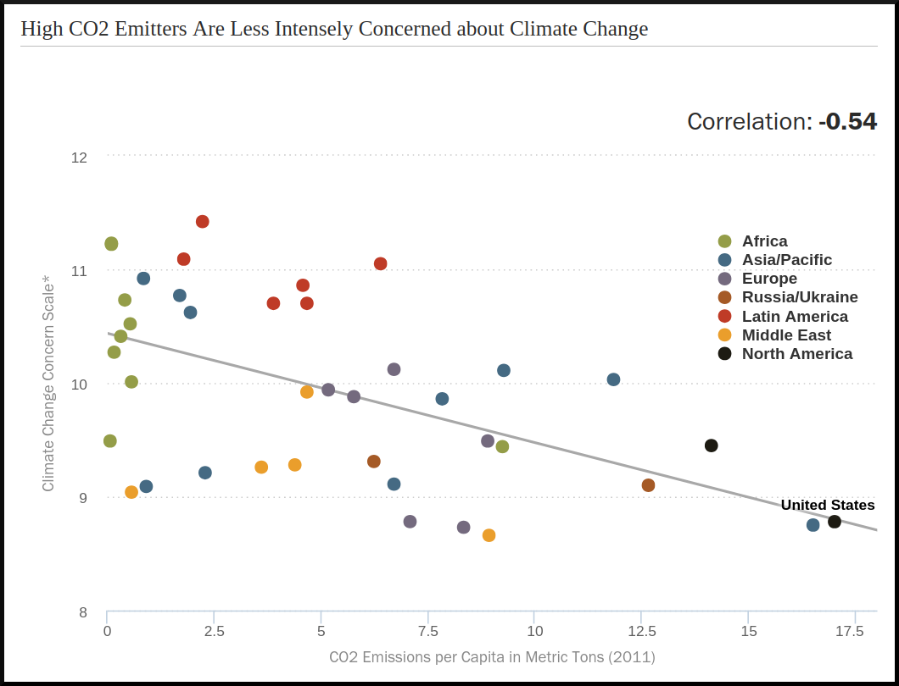
  .smaller[<figcaption>Stokes et al., <a href="https://www.pewresearch.org/global/2015/11/05/1-concern-about-climate-change-and-its-consequences/">Global concern about climate change, broad support for limiting emissions</a>. Pew Research, 2015</figcaption>]
</figure>
]

---

## Visualising climate change impacts on street photos
### Motivation

There is a mismatch between the magnitude of the climate crisis and the public's concern about it. .highlight1[_Why?_]

--

* .highlight1[Psychological distance]: 
> "_People struggle to engage with climate change because they perceive it as distant: temporally, geographically and/or socially. _" .cite[Stoknes, 2016]

.references[
* Stoknes, P. E. [Why the human brain ignores climate change—and what to do about it](https://documentcloud.adobe.com/link/track?uri=urn%3Aaaid%3Ascds%3AUS%3A1ef80b88-177c-4e5d-b879-d6d3a059c694). Environmental Reality: Rethinking the Options, 2016.
]

---

count: false

## Visualising climate change impacts on street photos
### Motivation

There is a mismatch between the magnitude of the climate crisis and the public's concern about it. .highlight1[_Why?_]

* .highlight1[Psychological distance]: 
> "_People struggle to engage with climate change because they perceive it as distant: temporally, geographically and/or socially. _" .cite[Stoknes, 2016]
* .highlight1[Doom-framings and fatigue of clichéd messages]:
> "_[C]lichéd images of climate change [...]—such as ‘smokestacks’, deforestation, and polar bears on melting ice—were positively received [but] also produced a muted emotional response and often prompted cynicism._" .cite[Chapman et al., 2016]

.references[
* Stoknes, P. E. [Why the human brain ignores climate change—and what to do about it](https://documentcloud.adobe.com/link/track?uri=urn%3Aaaid%3Ascds%3AUS%3A1ef80b88-177c-4e5d-b879-d6d3a059c694). Environmental Reality: Rethinking the Options, 2016.
* Chapman, D. A. et al. [Climate visuals: A mixed methods investigation of public perceptions of climate images in three countries](https://sci-hub.st/https://www.sciencedirect.com/science/article/abs/pii/S095937801630351X). GCE, 2016.
]

---

## Our goal
### .alpha0[Placeholder]

.context[People perceive the threat of climate change as temporally, geographically and socially distant.]

--

.center[.bigger[.highlight1[Could we help people visualise the effects of climate change in _their own backyard_?]]]

--

.left-column[
<figure>
	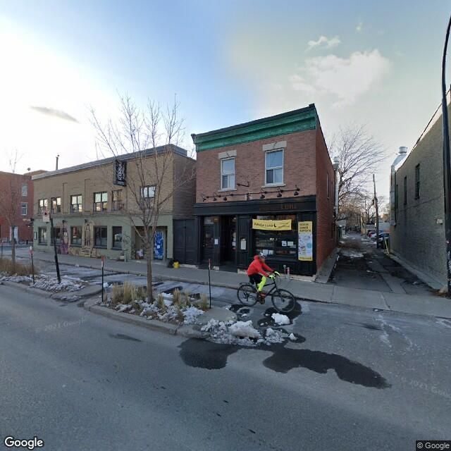
  <figcaption>Montréal, Québec, Canada</figcaption>
</figure>
]
.right-column[
<figure>
	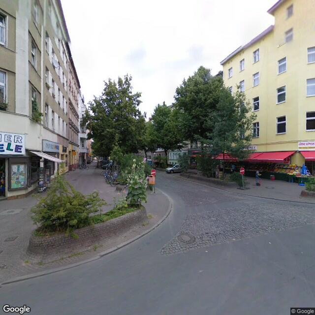
  <figcaption>Berlin, Germany</figcaption>
</figure>
]
.left[
]
.right[
]

---

count: false

## Our goal
### Floods

.context[People perceive the threat of climate change as temporally, geographically and socially distant.]

.center[.bigger[.highlight1[Could we help people visualise the effects of climate change in _their own backyard_?]]]

.left-column[
<figure>
	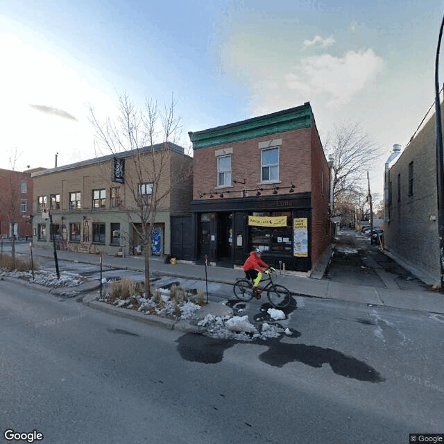
  <figcaption>Montréal, Québec, Canada</figcaption>
</figure>
]
.right-column[
<figure>
	
  <figcaption>Berlin, Germany</figcaption>
</figure>
]
.left[
]
.right[
]

---

count: false

## Our goal
### Wildfires

.context[People perceive the threat of climate change as temporally, geographically and socially distant.]

.center[.bigger[.highlight1[Could we help people visualise the effects of climate change in _their own backyard_?]]]

.left-column[
<figure>
	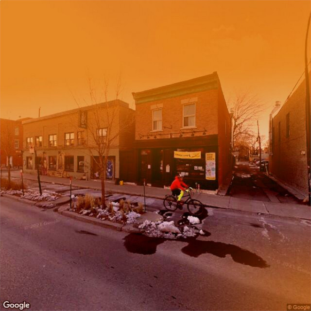
  <figcaption>Montréal, Québec, Canada</figcaption>
</figure>
]
.right-column[
<figure>
	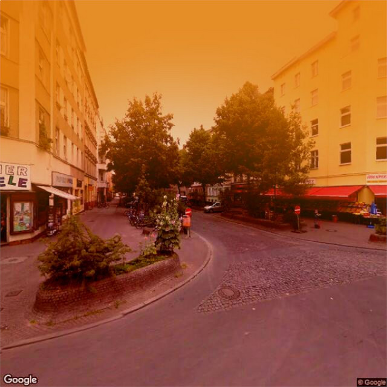
  <figcaption>Berlin, Germany</figcaption>
</figure>
]
.left[
]
.right[
]

---

count: false

## Our goal
### Smog

.context[People perceive the threat of climate change as temporally, geographically and socially distant.]

.center[.bigger[.highlight1[Could we help people visualise the effects of climate change in _their own backyard_?]]]

.left-column[
<figure>
	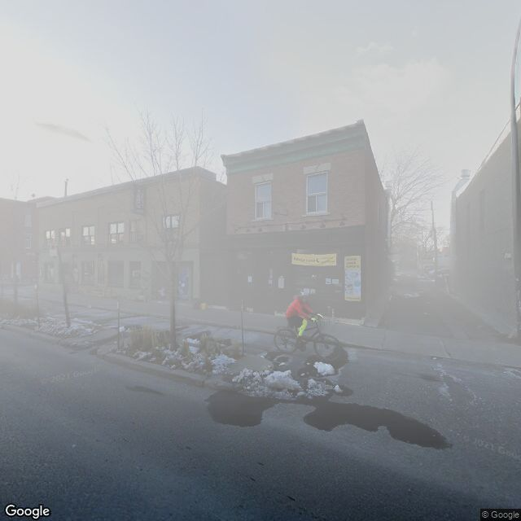
  <figcaption>Montréal, Québec, Canada</figcaption>
</figure>
]
.right-column[
<figure>
	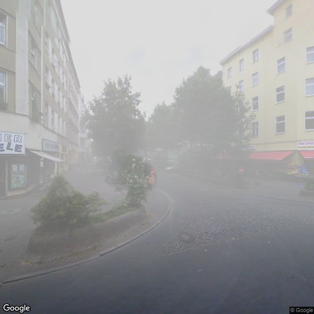
  <figcaption>Berlin, Germany</figcaption>
</figure>
]
.left[
]
.right[
]

---

## Our goal
### A website to encourage climate change awareness and action

.context[Users can look for an address of their choice.]

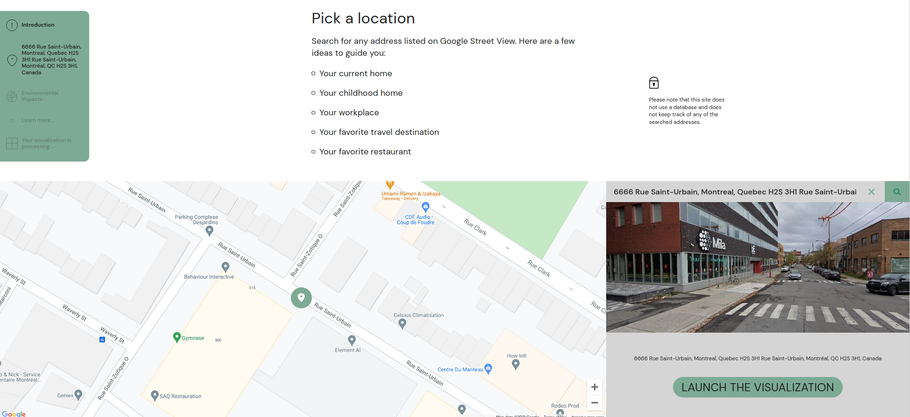

---

count: false

## Our goal
### A website to encourage climate change awareness and action

.context[Obtain an AI-generated visualisation on a street photo.]

.center[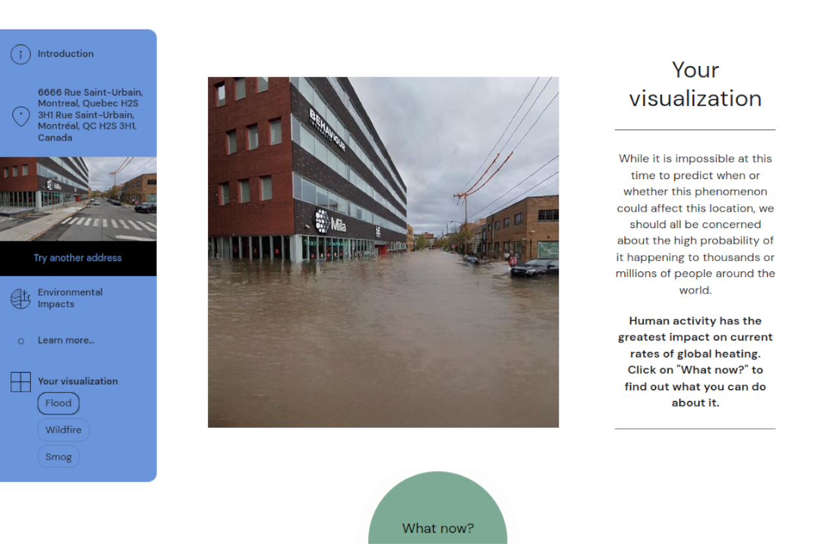]

---

count: false

## Our goal
### A website to encourage climate change awareness and action

.context[Read more about climate change and the ways to act now.]

.center[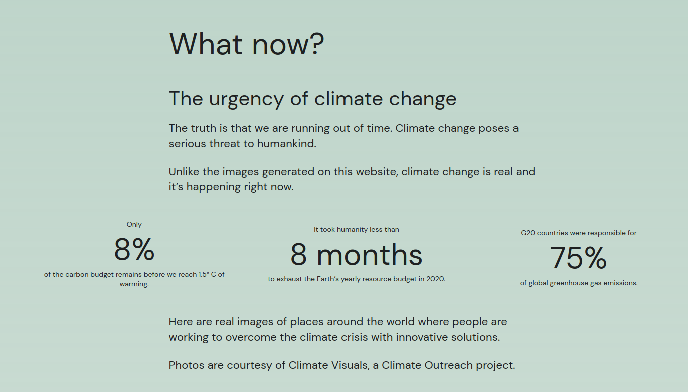]

---

## Why floods, wildfire, smog?

.context[Our algorithm and the website simulates floods, wildfires and smog on input images.]

--

 
.columns-3-left[
* Flash floods kill **5,000** people per year.
* Sea levels are expected to rise by **2 metres** by the end of the century
* Rising sea levels could disrupt the lives of **1 billion people** by the end of 2050.
]

--

.columns-3-center[
* As much as **40% of the Amazon** forest is at risk of becoming a savanna.
* In 2015, forest fires claimed roughly **980 000 $km^2$** of the world’s forest.
* Forest fires emmitted **~1.8 Gt of CO2** in 2019.
]

--

.columns-3-right[
* Air pollution is believed to be responsible for **4.2 million** premature deaths per year.
* Air pollution is responsible for **6% of deaths** worldwide.
* **91% of the population** lives in places where air pollution levels safety limits.  
]

--

.full-width[
.conclusion[Floods, wildires and smog are some of the worst environmental hazards for humanity, and we can communicate their impacts visually.]
]

---

count: false

## Let's try it out!

.center[
.bigger[.bigger[[ThisClimateDoesNotExist.com](https://thisclimatedoesnotexist.com)]]
]

???

https://thisclimatedoesnotexist.com/en/share/56d8058c-23d5-4083-b1b4-4afe6a5b2fe9
---

## Methods
### Key challenges

.context[The algorithm had to be able to generate realistic floods on any photo from Google Street View.]

--

.left-column-66[

* Visual perception is sensitive to unrealistic scenes:
    * Water texture (reflections, luminosity, etc.)
    * Geometry of the scene (edges, obstacles, etc.)
    * Physics (slope, view point, etc.)
* The algorithm was meant to be deployed _in the wild_ and should work with highly variant range of photos.
* We had to overcome the lack of training data: there is no data set of photos of _before and after_ the flood.
]
.right-column-33[
.center[

]
]

---

## Methods
### Key features

.context[Simulating photo-realistic floods is challenging because visual perception is very sensitive to unrealistic scenes and the lack of data.]

--

.left-column[

* Data from a .highlight1[simulated virtual word] to overcome the lack of training data
* .highlight1[Domain adaptation] to bridge the gap between simulated and real photos
* Two-stage flood generation: .highlight1[Masker] + .highlight1[Painter]
* Combination of .highlight1[depth and semantic segmentation] to improve water mask predictions
* .highlight1[Conditional image generation] to _paint_ realistic water on the predicted mask
]
.right-column[
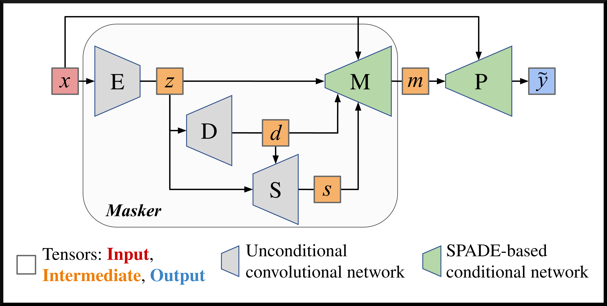
]

---

## ClimateGAN
### Simulated data

.context[We collected 1,200 photos of real floods and 5,500+ _non-flooded_ scenes to train our model. However, _real_ photos lack geometry and segmentation labels.]

We simulated a $1.5~km^2$ virtual world and generated 20,000 images that mimic Google Street View.

.center[]

---

count: false

## ClimateGAN
### Simulated data

.context[We collected 1,200 photos of real floods and 5,500+ _non-flooded_ scenes to train our model. However, _real_ photos lack geometry and segmentation labels.]

We simulated a $1.5~km^2$ virtual world and generated 20,000 images that mimic Google Street View.

.center[]

---

## ClimateGAN
### Masker

.left-column[
* Trained with _real_ and _simulated_ images
* Domain adaptation with ADVENT
* Depth decoder
* Segmentation decoder
* Mask decoder conditioned on depth and segmentation using SPADE
* All decoders trained simultaneously (multi-task learning)
]
.right-column[

]

???

* ADVENT: domain adaptation via adversarial entropy minimization, enriched with DADA (depth)
* SPADE: conditional image generation

---

counter: false

## ClimateGAN
### Masker

.left-column[
* Trained with _real_ and _simulated_ images
* Domain adaptation with ADVENT
* Depth decoder
* Segmentation decoder
* Mask decoder conditioned on depth and segmentation using SPADE
* All decoders trained simultaneously (multi-task learning)
]
.right-column[
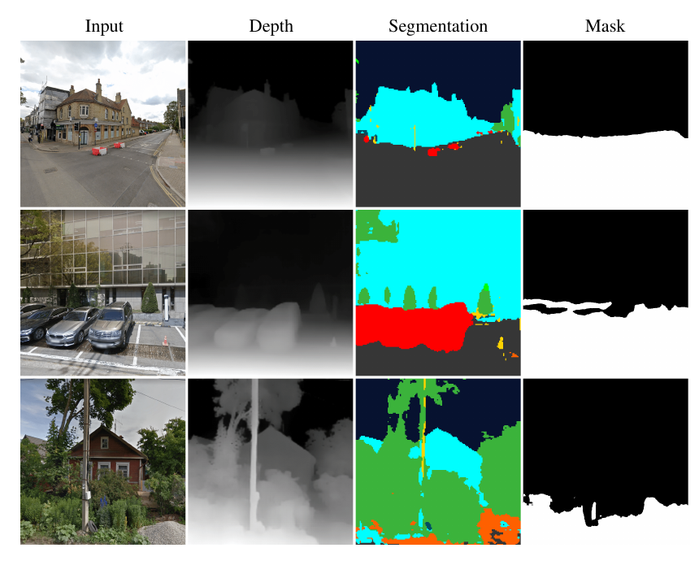
]

.conclusion[The masker receives an input image and outputs a binary mask of the water location, making intermediate predictions of depth and semantic segmentation.]

---

## ClimateGAN
### Painter

.left-column[
* Trained with 1,200 real images of floods
* The painter has to generate flooding water conditioned on the context of the image: sky, buildings, etc.
* Conditional image generation with GauGAN
* Conditioned on the Masked image
* SPADE blocks
]
.right-column[

]

---

counter: false

## ClimateGAN
### Painter

.left-column[
* Trained with 1,200 real images of floods
* The painter has to generate flooding water conditioned on the context of the image: sky, buildings, etc.
* Conditional image generation with GauGAN
* Conditioned on the Masked image
* SPADE blocks
]
.right-column[
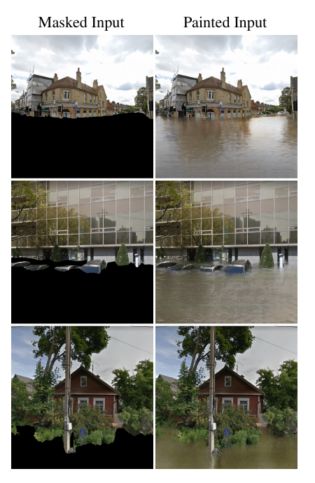
]

.conclusion[The painter receives an input image and a mask prediction and outputs an image of a flood that we combine with the masked input.]

---

## ClimateGAN
### Masker + Painter

.center[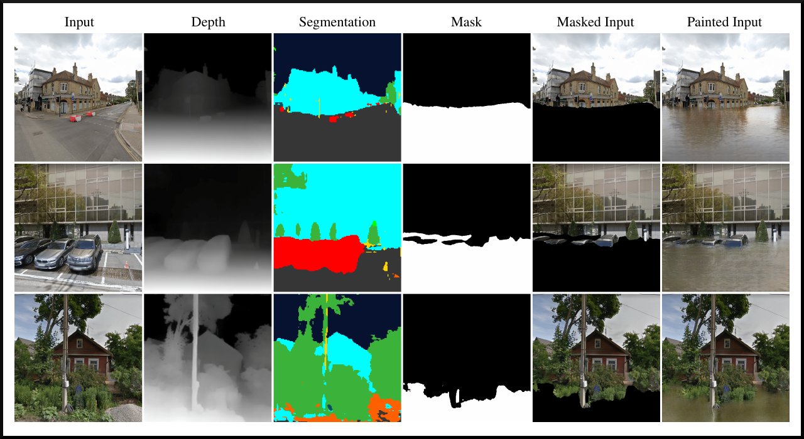]

---

## ClimateGAN
### Comparison with other methods

.center[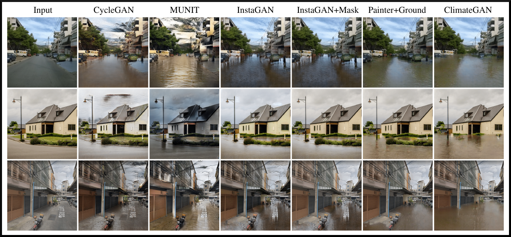]

---

## ClimateGAN
### Human evaluation

.context[We asked human participants to assess the visual quality of the output images, compared to alternative algorithms.]

_Which image looks more like an actual flood?_

.center[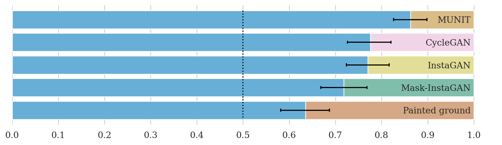]

.conclusion[The images from our algorithm were consistently judged as more realistic than those from other methods.]

---

## ClimateGAN
### Ablation study

.context[We systematically evaluated the contribution of several components of the algorithm.]

* We annotated the pixels a set of _test_ images as _must be flooded_, _cannot be flooded_ or _may be flooded_.
* We proposed 3 metrics to best evaluate the quality of the water masks: error, F05 score and _edge coherence_.

.center[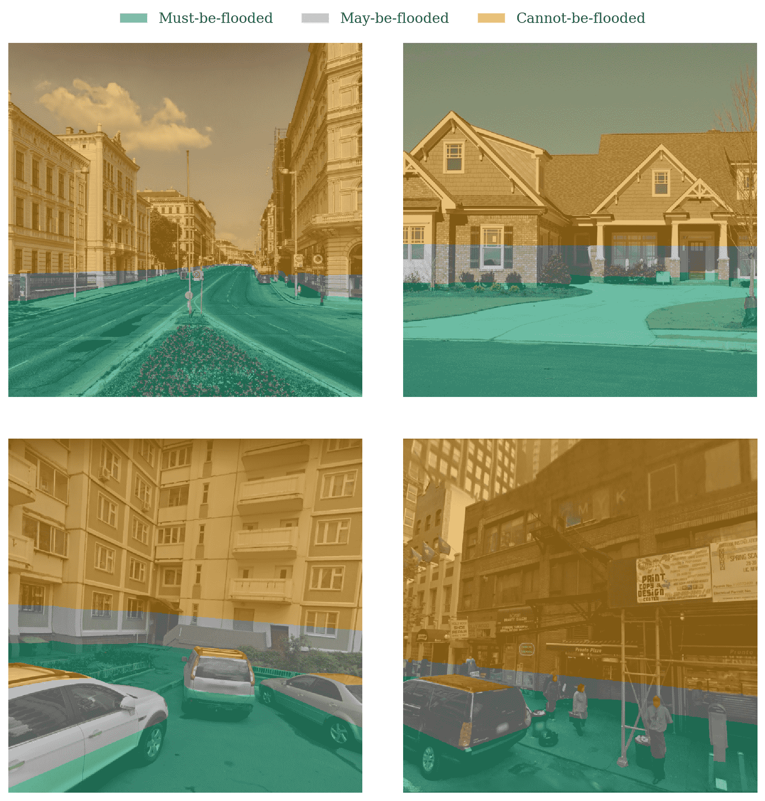]

---

count: false

## ClimateGAN
### Ablation study

.context[We systematically evaluated the contribution of several components of the algorithm.]

* We analysed each component according to the three proposed metrics.

.center[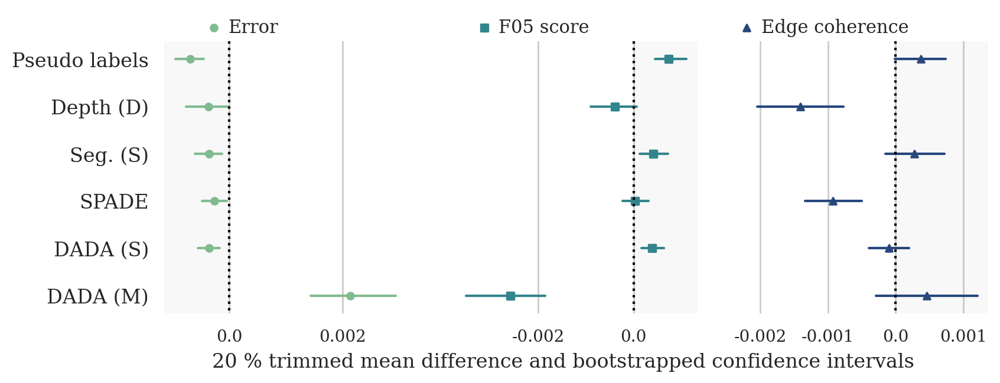]

.conclusion[5 of the 6 proposed components for the architecture proved to positively contribute to the performance.]

---

## Future directions and limitations

* [_ThisClimateDoesNotExist.com_](https://thisclimatedoesnotexist.com) is not an exerise of climate prediction. There is no correlation between the consequence chosen and the address entered. Our algorithm applies a systematic transformation regardless of the address.
    * While this is in part a limitation, this allows us to simulate the impacts of climate change, at any location, regardless of the specific risk.
    * Still, it would be interesting to integrate climate prediction and modelling into our simulations, for other applications.
--
* Our algorithm systematically simulates the same level of water (about 1 metre). It would be interesting to allow for more flexible simulations.
    * An interesting application would be to make the simulations reflect the impacts of various climate actions.
--
* We are currently writing a manuscript with Prof. Erick Lachapelle (UdeM) and Thomas Bergeron (UoT) on a study of the effect of such personalised imagery in climate communication and willingness to action.

---

## To know more

Visit the website: [ThisClimateDoesNotExist.com](https://thisclimatedoesnotexist.com)

.center[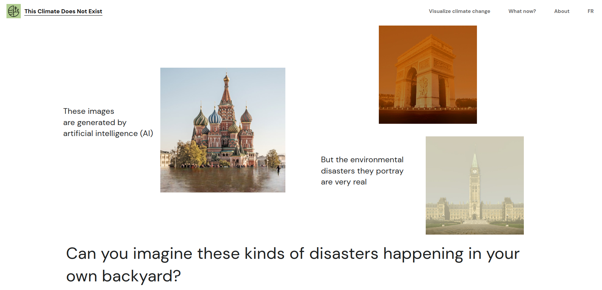]
    
Check the paper (ICLR 2022): [ClimateGAN: Raising Climate Change Awareness by Generating Images of Floods](https://arxiv.org/abs/2110.02871v1)

.center[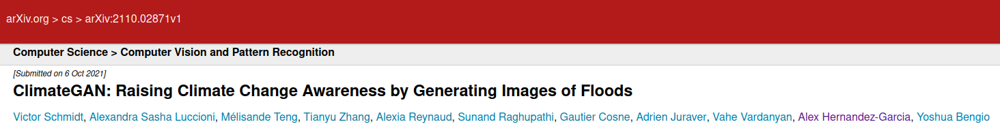]
    
---

name: title
class: title, middle

## ¡Gracias!

Alex Hernández-García (he/il/él)

.turquoise[Departamento de Tratamiento de la Señal y Comunicaciones ([DTSC](https://www.tsc.uc3m.es/)) · [UC3M](https://www.uc3m.es) · Jul 8th 2022]

.center[

&nbsp&nbsp&nbsp&nbsp

]

.footer[[alexhernandezgarcia.github.io](https://alexhernandezgarcia.github.io/) | [alex.hernandez-garcia@mila.quebec](mailto:alex.hernandez-garcia@mila.quebec)] 
.footer[[@alexhg@scholar.social](https://scholar.social/@alexhg)  | [@alexhdezgcia](https://twitter.com/alexhdezgcia) ]

---

## Backup

---

## Electrocatalyst design with machine learning
### Motivation

.center[
<figure>
	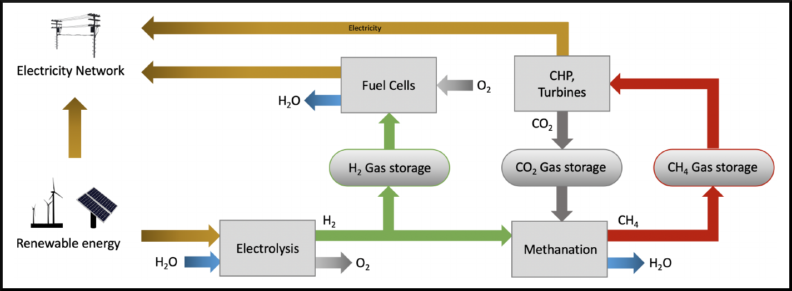
  <figcaption>.cite[(Lawrence Zitnick et al., 2020)]</figcaption>
</figure>
]

* Renewable energy can be used to transform water into hydrogen or methane and back to electricity
* However, current electrocatalysts are not sufficiently energy-efficient (35 % for round-trip AC to AC)

.references[
* Lawrenece Zitnick et al. [An introduction to electrocatalyst design using machine learning for renewable energy storage](https://arxiv.org/abs/2010.09435). arXiv:2010.09435, 2020.
]

---

## Why machine learning?
### Traditional electrocatalyst design

.context[Current electrocatalyst are only up to 35 % energy efficient]

.right-column-66[.center[]]

--

.left-column-33[
A _relaxation_ of propane (C3H8) on a copper (Cu) surface.
  
.center[]
]

---

## Why machine learning?
### Traditional electrocatalyst design

.context[Current electrocatalyst are only up to 35 % energy efficient]

.right-column-66[.center[]]

.left-column-33[
* Density Functional Theory is used to estimate the energy of a catalyst-molecule structure
* DFT scales with $O(n^3)$ with the number of electrons
* The calculations for one structure take hours or days
* There are combinatorially many possible candidate materials
]

---

.references[
* Agrawal and Chaudhary [Perspective: Materials informatics and big data: Realization of the “fourth paradigm” of science in materials science](https://aip.scitation.org/doi/10.1063/1.4946894). APL Materials, 2016
* Li et al. [Machine learning in concrete science: applications, challenges, and best practices](https://www.nature.com/articles/s41524-022-00810-x). Nature  npj Computational Materials, 2022
]
