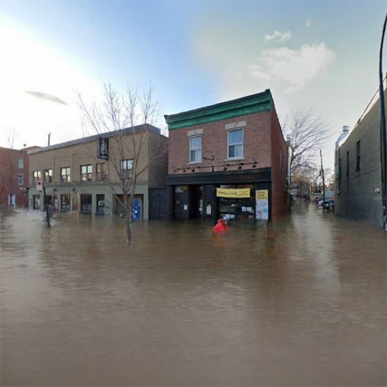
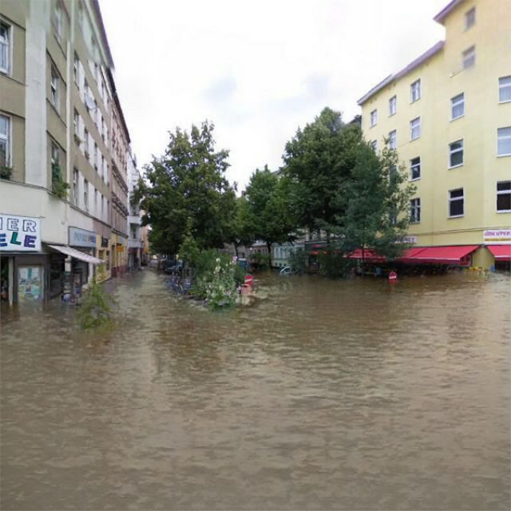
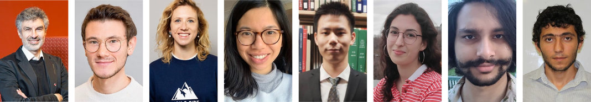
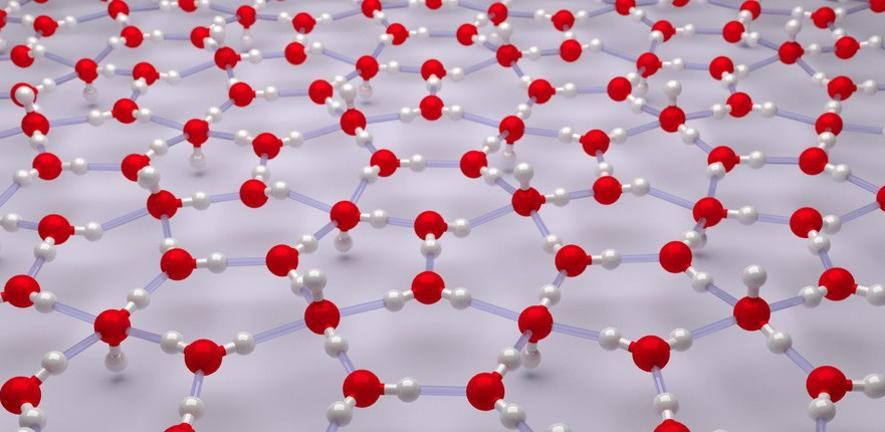
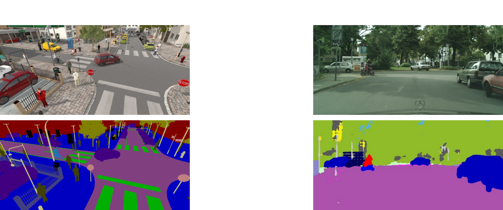
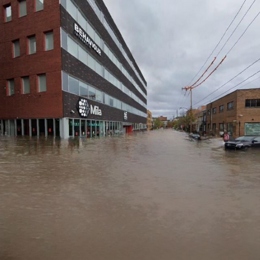

name: title
class: title, middle

## ML and DS to fight the climate emergency
### Visualising the effects of climate change, material discovery and downscaling

Alex Hernández-García (he/il/él)

.turquoise[Women in Machine Learning & Data Science · Yaoundé · July 24th 2021]

.center[

&nbsp&nbsp&nbsp&nbsp

]

.footer[[alexhernandezgarcia.github.io](https://alexhernandezgarcia.github.io/) | [alex.hernandez-garcia@mila.quebec](mailto:alex.hernandez-garcia@mila.quebec) | [@alexhdezgcia](https://twitter.com/alexhdezgcia)] 

---

## About me

--

* .highlight1[Bachelor's]: Image and Sound Engineering, University Carlos III of Madrid, Spain (2013)

--

* .highlight1[Master's]: Machine Learning and Computer Vision, University Carlos III of Madrid, Spain (2015)

--

* .highlight1[PhD]: Institute of Cognitive Science, Universität Osnabrück, Germany, with Prof. Peter König (2016–2020)

  * Based in Berlin
  * Marie Skłodowska Curie ITN “NextGenVis” (_Next generation of European visual neuroscientists_)
  * Intern at University of Cambridge (UK) and Spinoza Centre for Neuroimaging in Amsterdam (NL)
  * Thesis topics: Brain-inspired DL, visual perception and visual computational neuroscience

--

* .highlight1[Postdoc]: Mila (Québec AI Institute in Montréal) with Prof. Prof. Yoshua Bengio (2021–_present_)

---

## When I am not training models or reading papers...

~~...I am reviewing papers, trying to empty my email inbox, having meetings...~~

---

count: false

## When I am not training models or reading papers...

~~...I am reviewing papers, trying to empty my email inbox, having meetings...~~

.center[]

.footnote[[BrokenJugRamblers.bandcamp.com](https://brokenjugramblers.bandcamp.com/)]

---

count: false

## When I am not training models or reading papers...

~~...I am reviewing papers, trying to empty my email inbox, having meetings...~~

.center[]

---

count: false

## When I am not training models or reading papers...

~~...I am reviewing papers, trying to empty my email inbox, having meetings...~~

.center[]

.footnote[[LumeDeBiqueira.es](https://www.lumedebiqueira.es/en/)]

---

name: title
class: title, middle

## ML and DS to fight the climate emergency
### Visualising the effects of climate change, material discovery and downscaling

.alpha0[.left[
 
### .left[Outline]
* [Visualising the effects of climate change](#vicc)
* [Accelerating material discovery](#materialdiscovery)
* [Downscaling Global Climate Models](#downscaling)
]]

???

So, after this brief ice-breaker, I can go back to the topic of my talk today, which is to present a few of the projects I am involved in at Mila, about finding ways of using machine learning, data science or more generally artificial intelligence to fight the current climate emergency.

[NEXT SLIDE]

---

name: title
class: title, middle
count: false

## ML and DS to fight the climate emergency
### .highlight1[Visualising the effects of climate change], material discovery and downscaling
 
### .left[Outline]

.left[
* [.highlight1[Visualising the effects of climate change]](#vicc)
.alpha0[* [Accelerating material discovery](#materialdiscovery)]*
.alpha0[* [Downscaling Global Climate Models](#downscaling)]*
]

---

name: title
class: title, middle
count: false

## ML and DS to fight the climate emergency
### Visualising the effects of climate change, .highlight1[material discovery] and downscaling
 
### .left[Outline]

.left[
* [Visualising the effects of climate change](#vicc)
* [.highlight1[Accelerating material discovery]](#materialdiscovery)
.alpha0[* [Downscaling Global Climate Models](#downscaling)*]
]

---

name: title
class: title, middle
count: false

## ML and DS to fight the climate emergency
### Visualising the effects of climate change, material discovery and .highlight1[downscaling]
 
### .left[Outline]

.left[
* [Visualising the effects of climate change](#vicc)
* [Accelerating material discovery](#materialdiscovery)
* [.highlight1[Downscaling Global Climate Models]](#downscaling)
]

---

name: vicc

## Visualising the effects of climate change

---

## Visualising the effects of climate change
### Motivation

--

There is a mismatch between the magnitude of the climate crisis and the general public's concern about it. .highlight1[_Why?_]

--

* Psychological distance: 
> "_People struggle to engage with climate change because they perceive it as distant: temporally, geographically and/or socially. _" .cite[Stoknes, 2016]

.references[
* Stoknes, P. E. [Why the human brain ignores climate change—and what to do about it](https://documentcloud.adobe.com/link/track?uri=urn%3Aaaid%3Ascds%3AUS%3A1ef80b88-177c-4e5d-b879-d6d3a059c694). Environmental Reality: Rethinking the Options, 2016.
]

---

count: false

## Visualising the effects of climate change
### Motivation

There is a mismatch between the magnitude of the climate crisis and the general public's concern about it. .highlight1[_Why?_]

* Psychological distance: 
> "_People struggle to engage with climate change because they perceive it as distant: temporally, geographically and/or socially. _" .cite[Stoknes, 2016]
* Doom-framings and fatigue of clichéd messages:
> "_[C]lichéd images of climate change [...]—such as ‘smokestacks’, deforestation, and polar bears on melting ice—were positively received [but] also produced a muted emotional response and often prompted cynicism._" .cite[Chapman et al., 2016]

.references[
* Stoknes, P. E. [Why the human brain ignores climate change—and what to do about it](https://documentcloud.adobe.com/link/track?uri=urn%3Aaaid%3Ascds%3AUS%3A1ef80b88-177c-4e5d-b879-d6d3a059c694). Environmental Reality: Rethinking the Options, 2016.
* Chapman, D. A. et al. [Climate visuals: A mixed methods investigation of public perceptions of climate images in three countries](https://sci-hub.st/https://www.sciencedirect.com/science/article/abs/pii/S095937801630351X). GCE, 2016.
]

---

## Proposal
### .alpha0[Placeholder]

.context[People perceive the threat of climate change as temporally, geographically and socially distant.]

--

.center[.bigger[.highlight1[Could we help people visualise the effects of climate change in _their own backyard_?]]]

--

.left-column[
<figure>
	
  <figcaption>Montréal, Québec, Canada</figcaption>
</figure>
]
.right-column[
<figure>
	
  <figcaption>Berlin, Germany</figcaption>
</figure>
]
.left[
]
.right[
]

---

count: false

## Proposal
### Floods

.context[People perceive the threat of climate change as temporally, geographically and socially distant.]

.center[.bigger[.highlight1[Could we help people visualise the effects of climate change in _their own backyard_?]]]

.left-column[
<figure>
	
  <figcaption>Montréal, Québec, Canada</figcaption>
</figure>
]
.right-column[
<figure>
	
  <figcaption>Berlin, Germany</figcaption>
</figure>
]
.left[
]
.right[
]

---

count: false

## Proposal
### Wildfires

.context[People perceive the threat of climate change as temporally, geographically and socially distant.]

.center[.bigger[.highlight1[Could we help people visualise the effects of climate change in _their own backyard_?]]]

.left-column[
<figure>
	
  <figcaption>Montréal, Québec, Canada</figcaption>
</figure>
]
.right-column[
<figure>
	
  <figcaption>Berlin, Germany</figcaption>
</figure>
]
.left[
]
.right[
]

---

count: false

## Proposal
### Smog

.context[People perceive the threat of climate change as temporally, geographically and socially distant.]

.center[.bigger[.highlight1[Could we help people visualise the effects of climate change in _their own backyard_?]]]

.left-column[
<figure>
	
  <figcaption>Montréal, Québec, Canada</figcaption>
</figure>
]
.right-column[
<figure>
	
  <figcaption>Berlin, Germany</figcaption>
</figure>
]
.left[
]
.right[
]

---

## Ultimate goal of the project
### A website to encourage climate change awareness and action

.context[An AI-driven experience based on _empathy_]

---

count: false

## Ultimate goal of the project
### A website to encourage climate change awareness and action

.context[An AI-driven experience based on _empathy_]

.center[]

---

## Methods
### Floods simulation with _ClimateGAN_

.context[Simulating photo-realistic floods is challenging because visual perception is very sensitive to unrealistic water (reflections, physics, geometry, etc.)]

--

.left-column[
Key features:

* Data from a simulated virtual word to overcome the lack of training data
* Two-stage flood generation: _Masker_ + _Painter_
* Domain adaptation to bridge the gap between simulated and real photos
* Combination of _depth_ and _semantic segmentation_  to improve water mask predictions
* Conditional image generation to _paint_ realistic water on the predicted mask
]
.right-column[

]

---

## ClimateGAN
### Simulated data

.context[We collected 1,200 photos of real floods and 5,500+ _non-flooded_ scenes to train our model. However, _real_ photos lack geometry and segmentation labels.]

We simulated a $1.5~km^2$ virtual world with Unity3D and generated 20,000 images that mimic Google Street View.

.center[]

---

count: false

## ClimateGAN
### Simulated data

.context[We collected 1,200 photos of real floods and 5,500+ _non-flooded_ scenes to train our model. However, _real_ photos lack geometry and segmentation labels.]

We simulated a $1.5~km^2$ virtual world with Unity3D and generated 20,000 images that mimic Google Street View.

.center[]

---

## ClimateGAN
### Masker

.left-column[
* Trained with _real_ and _simulated_ images
* Domain adaptation with ADVENT
* Depth decoder
* Segmentation decoder
* Mask decoder conditioned on depth and segmentation using SPADE
* All decoders trained simultaneously (multi-task learning)
]
.right-column[

]

---

counter: false

## ClimateGAN
### Masker

.left-column[
* Trained with _real_ and _simulated_ images
* Domain adaptation with ADVENT
* Depth decoder
* Segmentation decoder
* Mask decoder conditioned on depth and segmentation using SPADE
* All decoders trained simultaneously (multi-task learning)
]
.right-column[

]

.conclusion[The masker receives an input image and outputs a binary mask of the water location, making intermediate predictions of depth and semantic segmentation.]

---

## ClimateGAN
### Painter

.left-column[
* Trained with 1,200 real images of floods
* The painter has to generate flooding water conditioned on the context of the image: sky, buildings, etc.
* Conditional image generation with GauGAN
* Conditioned on the Masked image
* SPADE blocks
]
.right-column[

]

---

counter: false

## ClimateGAN
### Painter

.left-column[
* Trained with 1,200 real images of floods
* The painter has to generate flooding water conditioned on the context of the image: sky, buildings, etc.
* Conditional image generation with GauGAN
* Conditioned on the Masked image
* SPADE blocks
]
.right-column[

]

.conclusion[The painter receives an input image and a mask prediction and outputs an image of a flood that we combine with the masked input.]

---

## ClimateGAN
### Masker + Painter

.center[]

---

## ClimateGAN
### Comparison with other methods

.center[]

---

## ClimateGAN
### Human evaluation

_Which image looks more like an actual flood?_

.center[]

---

## Visualising the effects of climate change

Coming out soon:

* Website for the general public (September)
* Scientific article with the description of the methods (July / August)

  
.conclusion[We hope that our website contributes to raise awareness and encourage action to fight climate change.]

---

name: title
class: title, middle
count: false

## ML and DS to fight the climate emergency
### Visualising the effects of climate change, .highlight1[material discovery] and downscaling
 
### .left[Outline]

.left[
* [~~Visualising the effects of climate change~~](#vicc)
* [.highlight1[Accelerating material discovery]](#materialdiscovery)
* [Downscaling Global Climate Models](#downscaling)
]

---

name: materialdiscovery

## Accelerating material discovery with machine learning

  
.center[]

---

## Accelerating material discovery with machine learning
### Motivation

.center[
<figure>
	
  <figcaption>.cite[(Lawrence Zitnick et al., 2020)]</figcaption>
</figure>
]

* Renewable energy can be used to transform water into hydrogen or methane and back to electricity
* However, current electrocatalysts are not sufficiently energy-efficient (35 % for round-trip AC to AC)

.references[
* Lawrenece Zitnick et al. [An introduction to electrocatalyst design using machine learning for renewable energy storage](https://arxiv.org/abs/2010.09435). arXiv:2010.09435, 2020.
]

---

## Why machine learning?
### Traditional electrocatalyst design

.context[Current electrocatalyst are only up to 35 % energy efficient]

.right-column-66[.center[]]

--

.left-column-33[
A _relaxation_ of propane (C3H8) on a copper (Cu) surface.
  
.center[]
]

---

count: false

## Why machine learning?
### Traditional electrocatalyst design

.context[Current electrocatalyst are only up to 35 % energy efficient]

.right-column-66[.center[]]

.left-column-33[
* Density Functional Theory is used to estimate the energy of a catalyst-molecule structure
* DFT scales with $O(n^3)$ with the number of electrons
* The calculations for one structure take hours or days
* There are combinatorially many possible candidate materials
]

---

## Why machine learning?
### ML world model

.context[Physical models are computationally too expensive for fast discovery.]

.right-column-66[.center[]]

--

.left-column-33[
* Data from physical models can be used to train ML-based approximators
* ML models can be used to more rapidly evaluate candidate materials
]

--

Can we do better?

---

## Why machine learning?
### RL-based exploratory policy 

.context[Using ML to only score candidate materials provides only _linear_ gains.]

.right-column-66[.center[]]

--

.left-column-33[
* We can train ML models to more efficiently search the space of candidate materials
* An RL agent could exploit the structure of the search space
]

Promising results: [GFlowNet](https://alexhernandezgarcia.github.io/slides/salloc%20--gres=gpu:1%20-c%202%20--mem=24G%20-t%208:00:00%20--partition=unkillable) (Bengio et al., 2021)

---

## Accelerating scientific discovery
### Summary

.right-column[.center[]]

.left-column[
* World model: graph neural networks (GNN), capable of incorporating invariances and equivariances that preserve physical properties
* Exploratory agent: RL-based algorithms capable of learning the structure of the _world_ to propose diverse, high-reward candidates
]

.full-width[
.conclusion[These principles have applications in material discovery, drug discovery, causal reasoning, etc. and have the potential of pushing the boundaries of machine learning research.]
]

---

name: title
class: title, middle
count: false

## ML and DS to fight the climate emergency
### Visualising the effects of climate change, material discovery and .highlight1[downscaling]
 
### .left[Outline]

.left[
* [~~Visualising the effects of climate change~~](#vicc)
* [~~Accelerating material discovery~~](#materialdiscovery)
* [.highlight1[Downscaling Global Climate Models]](#downscaling)
]

---

name: downscaling

## Downscaling Global Climate Models with deep learning

 
.center[]
.left[.cite[Climate Dynamycs Group, Caltech]]

---

## Why downscaling?

.right-column-33[.center[]]

.left-column-66[
* Enhance spatial resolution of global climate models (> 100 $km^2$)
* Enable regional analysis and intervention: 
    * Risk assessement
    * Sustainability of infrastructure
    * Understanding effects on ecosystems
    * Mitigation strategies
* Mitigate systematic biases of global climate models
* Generate variables not present in climate models
]

.full-width[
 
.conclusion[Global climate models have too coarse resolution to be used in many practical applications]
]

---

## Why machine learning?

Two types of downscaling methods:

.left-column[
Statistical downscaling:
* Interpolation methods
* Computationally affordable
* Outputs can be highly erroneous
]

.right-column[
Dynamical downscaling:
* Climate models run at high resolution regionally
* Computationally expensive
* Prone to propagating biases from global models
]

--

.center[
Machine learning promises:
* Learn the relevant structure from existing GCM data
* Affordable computational costs
]

.references[
* Baño-Medina et al. [Configuration and intercomparison of deep learning neural models for statistical downscaling](https://gmd.copernicus.org/articles/13/2109/2020/gmd-13-2109-2020.pdf). Geoscientific Model Development, 2020.
* Groenke et al. [ClimAlign: Unsupervised statistical downscaling of climate variables via normalizing flows](https://arxiv.org/abs/2008.04679). arXiv:2008.04679, 2020
]

---

## Why machine learning?

The machine learning communities have developed methods that resemble the problem of climate data downscaling.

.center[]

---

count: false

## Why machine learning?

The machine learning communities have developed methods that resemble the problem of climate data downscaling.

.center[]

---

name: title
class: title, middle

## ML and DS to fight the climate emergency
### Visualising the effects of climate change, material discovery and downscaling
 
### .left[Outline]

.left[
* [~~Visualising the effects of climate change~~](#vicc)
* [~~Accelerating material discovery~~](#materialdiscovery)
* [Downscaling Global Climate Models](#downscaling)
]

---

## Summary

.columns-3-left[
.center[
Photo-realistic generation of flood images to enable empathy

]
]

.columns-3-center[
.center[
Accelerated material discovery with deep and reinforcement learning

]
]

.columns-3-right[
.center[
Downscaling global climate models with deep learning

]
]

---

name: title
class: title, middle
count: false

### Merci beaucoup !

Alex Hernández-García (he/il/él)

.turquoise[Women in Machine Learning & Data Science · Yaoundé · July 24th 2021]

.center[

&nbsp&nbsp&nbsp&nbsp

]

.footer[[alexhernandezgarcia.github.io](https://alexhernandezgarcia.github.io/) | [alex.hernandez-garcia@mila.quebec](mailto:alex.hernandez-garcia@mila.quebec) | [@alexhdezgcia](https://twitter.com/alexhdezgcia)] 

---

name: title
class: title, middle
count: false

## ML and DS to fight the climate emergency
### Visualising the effects of climate change, material discovery and downscaling

.center[

&nbsp&nbsp&nbsp&nbsp

&nbsp&nbsp&nbsp&nbsp

]

.footer[[alexhernandezgarcia.github.io](https://alexhernandezgarcia.github.io/) | [alex.hernandez-garcia@mila.quebec](mailto:alex.hernandez-garcia@mila.quebec) | [@alexhdezgcia](https://twitter.com/alexhdezgcia)] 
