name: x2026-may26
class: title, middle

### Generative and active learning with GFlowNets for materials discovery

Alex Hernández-García (he/il/él)

.turquoise[[x2026](https://www.cheminst.ca/conference/x2026/) · Toronto · May 27th 2026]

.center[

&nbsp&nbsp&nbsp&nbsp

]

.center[

&nbsp&nbsp&nbsp&nbsp

]

.smaller[.footer[
Slides: [alexhernandezgarcia.com/slides/{{ name }}](https://alexhernandezgarcia.com/slides/{{ name }})
]]

.qrcode[]

---

## Traditional discovery cycle
### (From a machine learning point of view)

.context35[Current ecological and health challenges demand accelerating scientific discoveries.]

.right-column-66[.center[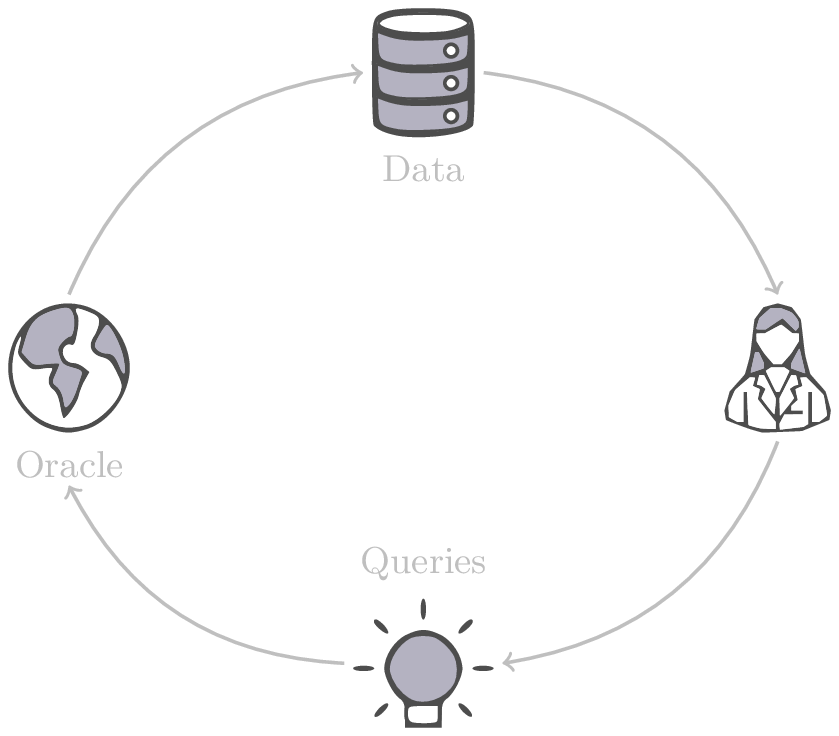]]

.left-column-33[
 
The traditional scientific discovery cycle:
* is .highlight1[time-consuming], 
* .highlight1[financially and computationally expensive], and
* is typically .highlight1[limited to a fraction of the candidate space].
]

.footnote[Oracle: any method used to validate a query, such as experimental measurements, simulations, etc.]

---

## Machine learning in the loop

.context35[The traditional scientific discovery cycle is too slow for certain applications.]

.right-column-66[ .center[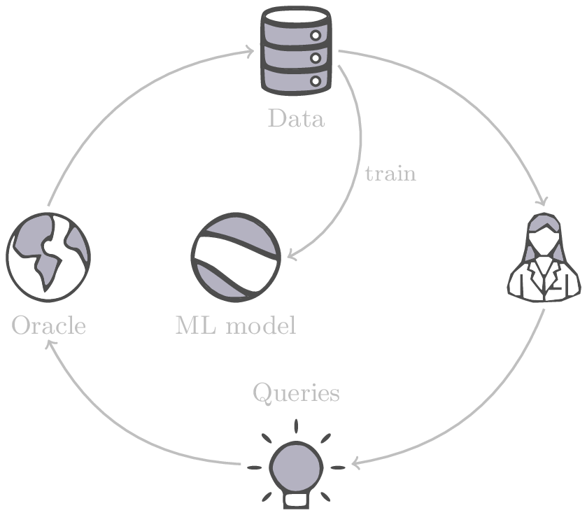]]

.left-column-33[
 
A .highlight1[machine learning model] can be:
* trained with data from _real-world_ experiments and
]

.footnote[This ML model is _predictive_ or _discriminative_: classification or regression.]

---

count: false

## Machine learning in the loop

.context35[The traditional scientific discovery cycle is too slow for certain applications.]

.right-column-66[ .center[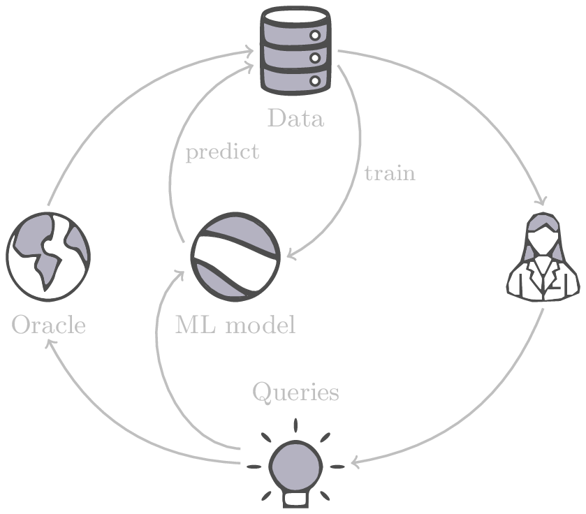]]

.left-column-33[
 
A .highlight1[machine learning model] can be:
* trained with data from _real-world_ experiments and
* used to quickly and cheaply evaluate queries
]

.footnote[This ML model is _predictive_ or _discriminative_: classification or regression.]

---

count: false

## Machine learning in the loop

.context35[The traditional scientific discovery cycle is too slow for certain applications.]

.right-column-66[ .center[]]

.left-column-33[
 
A .highlight1[machine learning model] can be:
* trained with data from _real-world_ experiments and
* used to quickly and cheaply evaluate queries

.conclusion[There are infinitely many conceivable materials, combinatorially many are potentially stable. Are predictive models enough?]
]

---

## _Generative_ machine learning in the loop

.context30[Even perfect predictive models aren't enough!]

.right-column-66[ .center[]]

.left-column-33[
 
.highlight1[Generative machine learning] can:
* .highlight1[learn structure] from the available data,
* .highlight1[generalise] to unexplored regions of the search space and
* .highlight1[build better queries]
]

.footnote[Generative models learn to propose or generate new candidates.]

---

count: false

## _Generative_ machine learning in the loop

.context30[Even perfect predictive models aren't enough!]

.right-column-66[ .center[]]

.left-column-33[
 
.highlight1[Generative machine learning] can:
* .highlight1[learn structure] from the available data,
* .highlight1[generalise] to unexplored regions of the search space and
* .highlight1[build better queries]

.conclusion[However, should we rely solely on our best but very expensive _oracle_?]
]

---

## _Multi-fidelity_ active learning with generative modelling

.right-column-66[ .center[]]

.left-column-33[
 
.highlight1[Multi-fidelity active learning] can:
* leverage the availability of .highlight1[multiple oracles] with different .highlight1[costs and fidelity]
* efficiently use the right level of accuracy needed for each query

.conclusion[Multi-fidelity active learning can leverage the diversity of methods available in science.]
]

.references[Hernandez-Garcia, Saxena et al. [Multi-fidelity active learning with GFlowNets](https://arxiv.org/abs/2306.11715). TMLR, 2024]

---

count: false
name: solid-state-electrolytes
class: title, middle

## Example application
### Design of novel ionic super-conductive electrolytes for solid-state batteries

.center[
<figure>
	
  <figcaption>.smaller[Adapted from: <a href="https://article.murata.com/en-sg/article/basic-lithium-ion-battery-4">Murata</a>]</figcaption>
</figure>
]

---

## Example application
### Design of novel ionic super-conductive electrolytes for solid-state batteries

.right-column-66[.center[]]

.left-column-33[
.h1[Data]:
* Scarce and scattered data
* Not ready for ML use
]

---

## OBELiX
### A new data set of crystal structures for solid-state batteries

.right-column-66[.center[]]

.left-column-33[
We curated a data set of nearly 600 materials with experimentally measured ionic conductivity.
  
.center[]
]

.full-width[
- Paper: [arxiv.org/abs/2502.14234](https://arxiv.org/abs/2502.14234)
- Code and data set: [github.com/NRC-Mila/OBELiX](https://github.com/NRC-Mila/OBELiX/tree/main)
]

---

## Example application
### Design of novel ionic super-conductive electrolytes for solid-state batteries

.right-column[.center[]]

.left-column[
.h1[ML predictive model]:
- Random forest
- Multi-layer perceptron
- Graph neural networks
- ...
]

---

count: false

## Example application
### Design of novel ionic super-conductive electrolytes for solid-state batteries

.right-column[.center[]]

.left-column[
.h1[ML predictive model]:
- Random forest
- Multi-layer perceptron
- Graph neural networks
- ...
  
.center[]
]

---

## Example application
### Design of novel ionic super-conductive electrolytes for solid-state batteries

.right-column[.center[]]

.left-column[
.h1[Generative ML model]:
- The generated candidates should:
    - have the target property
    - have other desirable properties (lithium, available elements, etc.)
    - be realistic (physical constraints)
    - be diverse
- The available data sets are extremely small for ML standards.
]

---

count: false
name: crystal-gfn
class: title, middle

## Crystal-GFN: GFlowNets for crystal structures

Mila AI4Science: Alex Hernandez-Garcia, Alexandre Duval, Alexandra Volokhova, Yoshua Bengio, Divya Sharma, Pierre Luc Carrier, Yasmine Benabed, Michał Koziarski, Victor Schmidt, Pierre-Paul De Breuck

.smaller70[Mila AI4Science et al. [Crystal-GFN: sampling crystals with desirable properties and constraints](https://arxiv.org/abs/2310.04925). AI4Mat, NeurIPS 2023 (spotlight)]

.center[]

---

## Crystal-GFN
### Crystal structure generation as sequential decision making

- Most previous works tackle crystal structure generation in the space of atomic coordinates and _struggle to preserve the symmetry properties_.
- Most methods rely on diffusion models trained on existing data, with limited potential for _discovery_.
- Most methods are not suited for designing crystals _with specific properties_.

--

 
- Instead of optimising the atom positions by learning from a small data set, we draw .highlight1[inspiration from theoretical crystallography to sample crystals in a lower-dimensional space of crystal structure parameters]: space group, composition, lattice parameters
- As a GFlowNet, Crystal-GFN is _data-agnostic_, and is trained itself with a reward function that can be any property.

---

## Crystal-GFlowNet
### Sequential generation

.center[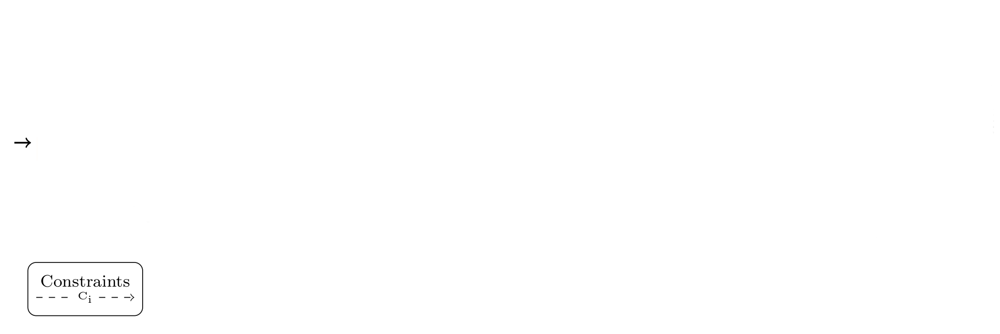]

---

count: false

## Crystal-GFlowNet
### Sequential generation

.center[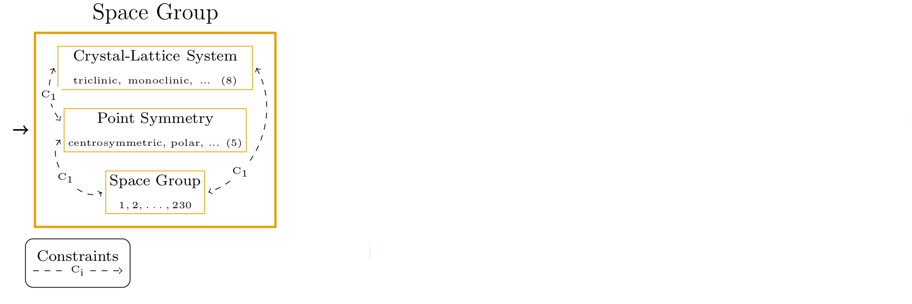]

---

count: false

## Crystal-GFlowNet
### Sequential generation

.center[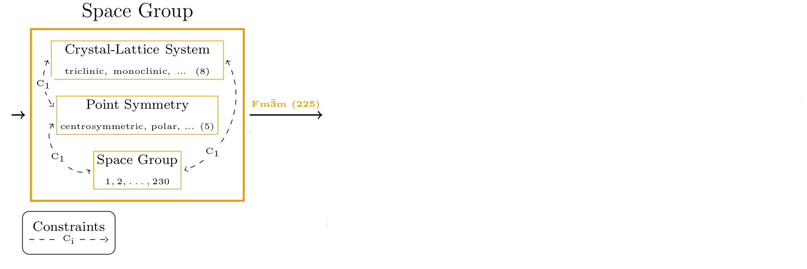]

---

count: false

## Crystal-GFlowNet
### Sequential generation

.center[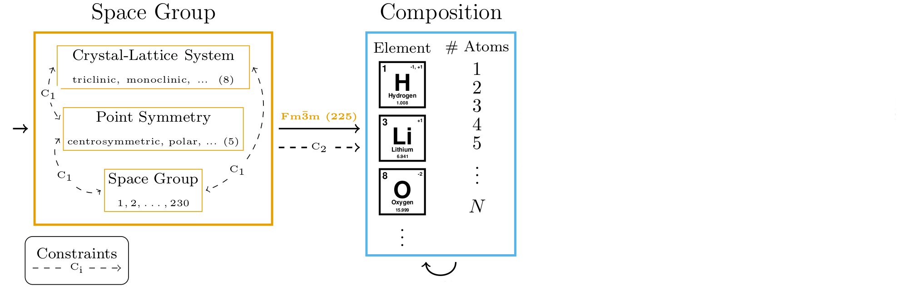]

---

count: false

## Crystal-GFlowNet
### Sequential generation

.center[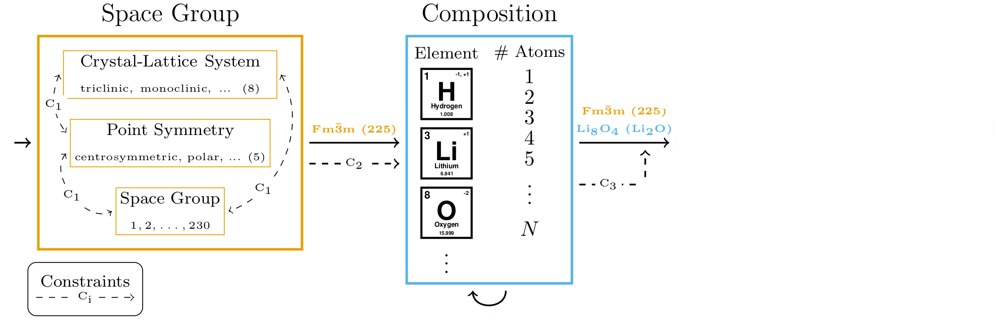]

---

count: false

## Crystal-GFlowNet
### Sequential generation

.center[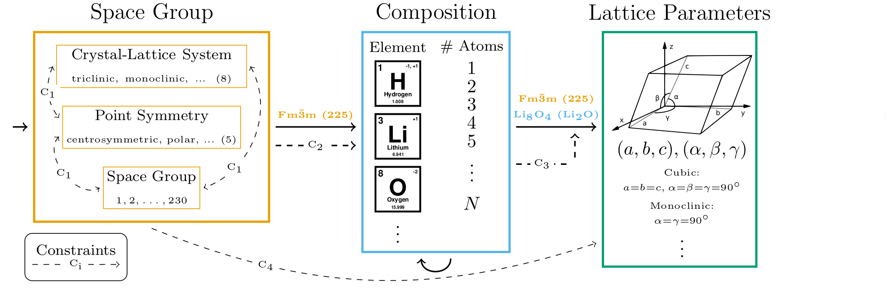]

---

count: false

## Crystal-GFlowNet
### Sequential generation

.center[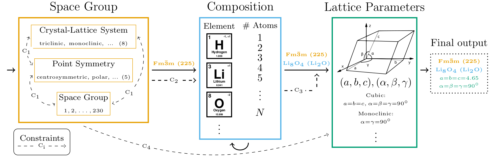]

---

count: false

## Crystal-GFlowNet
### Sequential generation

.center[]

---

count: false

## Crystal-GFlowNet
### Sequential generation

.center[]

.conclusion[Crystal-GFN binds multiple spaces representing crystallographic and material properties, setting intra- and inter-space hard constraints in the generation process.]

---

## GFlowNet approach
### Advantages

.context[We generate materials in the lower-dimensional space of crystal structure parameters.]

* Constructing materials by their crystal structure parameters allows us to introduce .highlight1[physicochemical and geometric _hard_ constraints]:
--

    * Charge neutrality of the composition.
    * Compatibility of composition and space group.
    * Hierarchical structure of the space group.
    * Compatibility of lattice parameters and lattice system.
--
* .highlight1[Searching in the lower-dimensional space] of crystal structure parameters may be more efficient than in the space of atom coordinates.

--
* Provided we have access to a predictive model of a material property, we can .highlight1[flexibly generate materials with desirable properties].

--
* We can .highlight1[flexibly sample materials with specific characteristics, such as composition or space group]. 

--
* Training the generative model does not depend on a data set, but on a proxy model of the property of interest.

---

count: false

## Crystal-GFlowNet
### Material properties

We can train a Crystal-GFN with any reward function, provided it is computationally tractable. Therefore, we can use it to .highlight1[generate materials with different properties]. We have tested the following properties:

- .highlight2[Formation energy] per atom [eV/atom], via a pre-trained machine learning model: indicative of the material's stability.
- .highlight2[Electronic band gap] [eV] (squared distance to a target value, 1.34 eV), via a pre-trained machine learning model: relevant in photovoltaics, for instance.
- .alpha50[Unit cell .highlight2[density] [g/cm3]: convenient as a proof of concept because we can calculate it _exactly_ from the GFN outputs.]

--
- Soon to come: .h2[ionic conductivity]!

---

## Results
### Formation energy

.context35[Formation energy as predicted by a ML model.]

.center[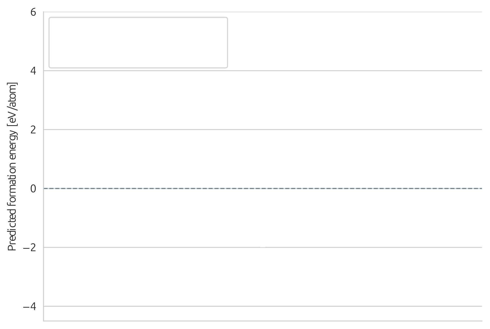]

---

count: false

## Results
### Formation energy

.context35[Formation energy as predicted by a ML model.]

.center[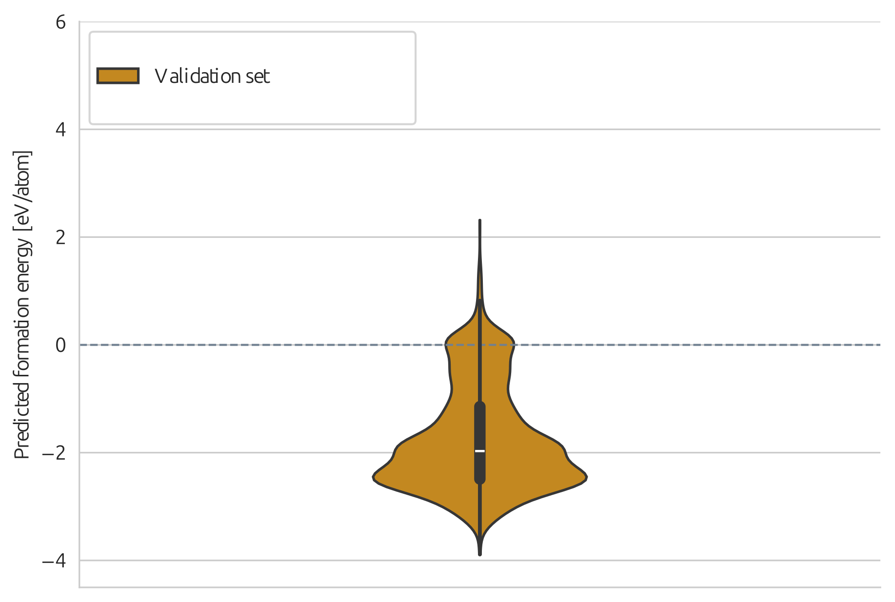]

---

count: false

## Results
### Formation energy

.context35[Formation energy as predicted by a ML model.]

.center[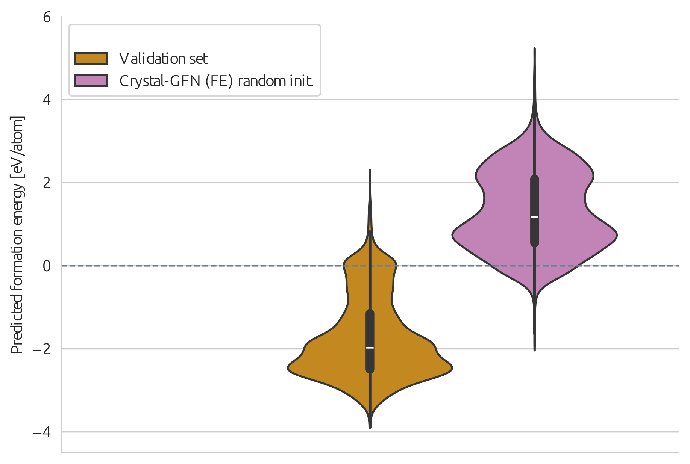]

---

count: false

## Results
### Formation energy

.context35[Formation energy as predicted by a ML model.]

.center[]

---

count: false

## Results
### Formation energy

.context[.highlight1[After training, Crystal-GFN samples structures with even lower formation energy [eV/atom] than the validation set.]]

.center[]

---

## Results
### Band gap

.context35[We aimed at sampling structures with band gap close to 1.34 eV.]

.center[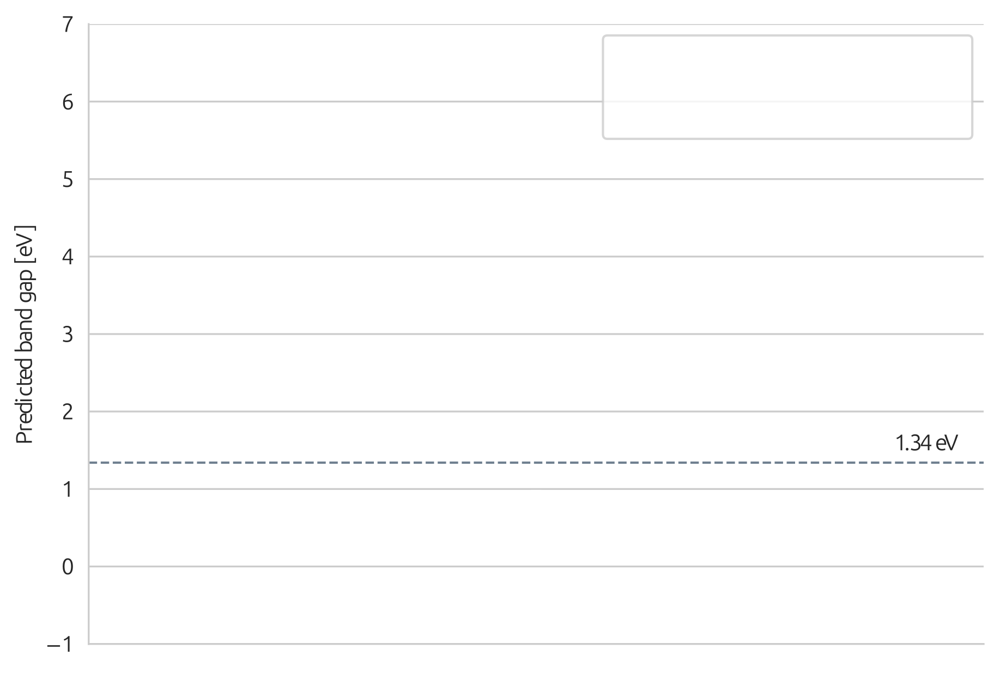]

---

count: false

## Results
### Band gap

.context35[We aimed at sampling structures with band gap close to 1.34 eV.]

.center[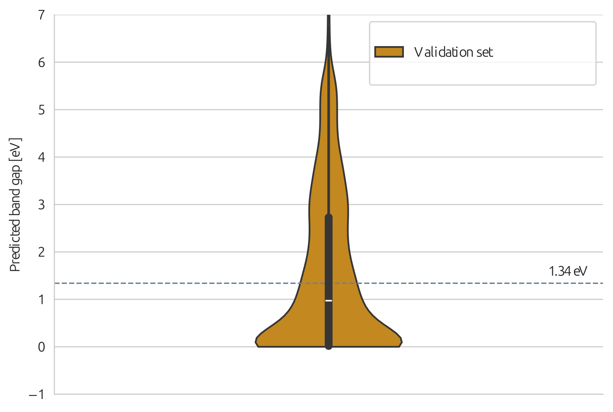]

---

count: false

## Results
### Band gap

.context35[We aimed at sampling structures with band gap close to 1.34 eV.]

.center[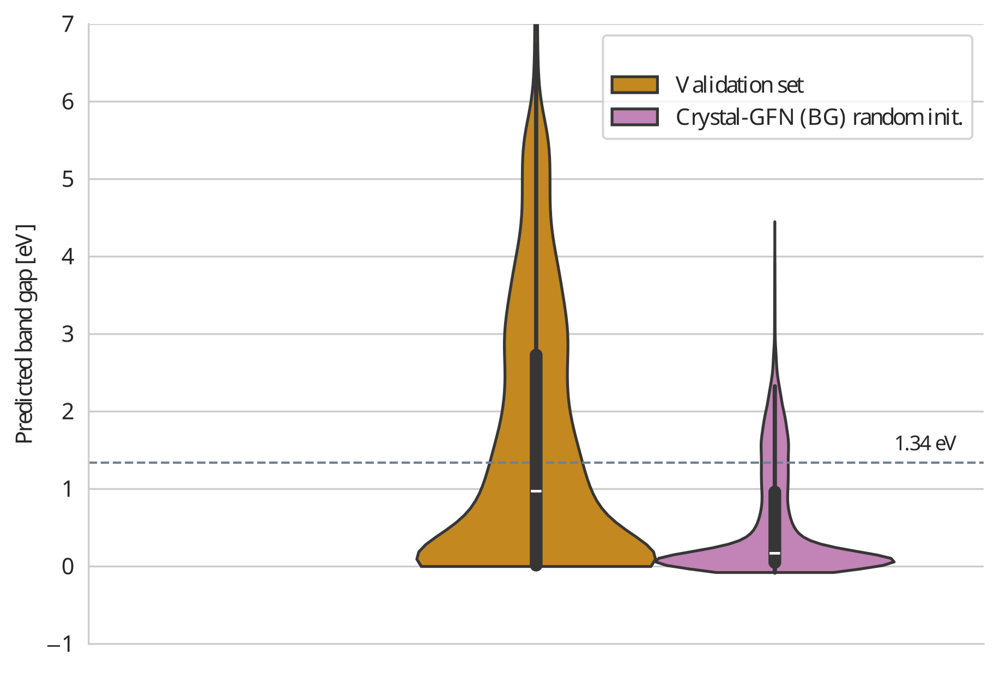]

---

count: false

## Results
### Band gap

.context35[We aimed at sampling structures with band gap close to 1.34 eV.]

.center[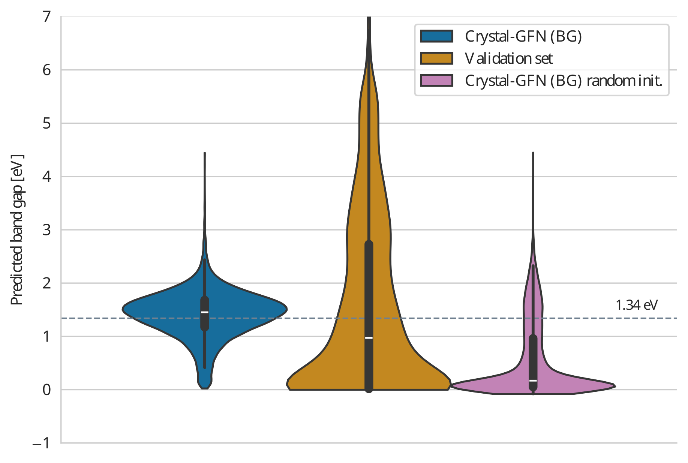]

---

count: false

## Results
### Band gap

.context[.highlight1[After training, Crystal-GFN samples structures with band gap [eV] around the target value.]]

.center[]

---

## Results
### Diversity

.context[.highlight2[Diversity] is key in materials discovery.]

Analysis of 10,000 sampled crystals and the top-100 with lowest formation energy.

--

- All 10,000 samples are unique.

--
- All crystal systems, lattice systems and point symmetries found in the 10,000 samples.
    - 4 out of 8 crystal-lattice systems in the top-100.
    - 4 out of the 5 point symmetries in the top-100.
--
- All 22 elements found in the 10,000 samples.
    - 15 out of 22 elements in the top-100.
--
- 73 out of 113 space groups (65 %) found in the 10,000 samples
    - 19 out of 113 space groups in the top-100.

--

.conclusion[Crystal-GFN samples are highly diverse.]

---

## Results
### Restricted sampling

.context[Crystal-GFN is flexible by design, inspired by the needs of domain experts.]

.left-column-33[
We restrict the sampling space at sampling time:

- A: Composition restricted to Fe and O, with a maximum of 10 atoms per element.
- B: Ternary space Li-Mn-O, with maximum 16 atoms.
- C: Only cubic lattices.
- D: Lattice lengths between 10 and 20 angstroms and angles between 75 and 135 degrees.
]

.right-column-66[.center[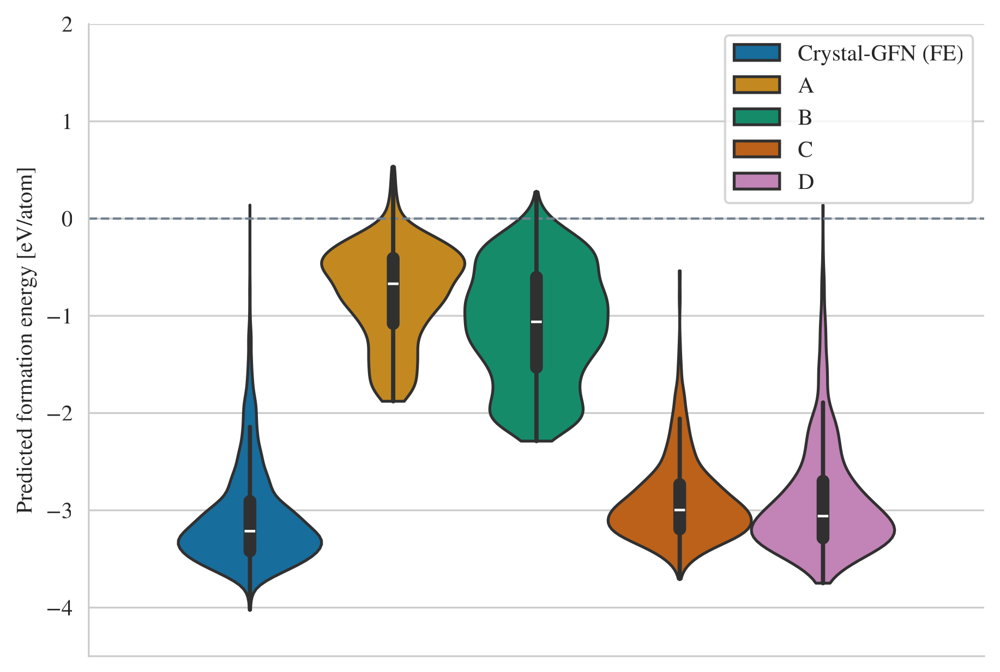]]

---

count: false
name: title
class: title, middle

## Back to our example
### Design of novel ionic super-conductive electrolytes for solid-state batteries

.center[
<figure>
	
  <figcaption>.smaller[Adapted from: <a href="https://article.murata.com/en-sg/article/basic-lithium-ion-battery-4">Murata</a>]</figcaption>
</figure>
]

---

## Example application
### Design of novel ionic super-conductive electrolytes for solid-state batteries

.right-column-66[.center[]]

---

count: false

## Example application
### Design of novel ionic super-conductive electrolytes for solid-state batteries

.right-column-66[.center[]]

.left-column-33[
.h1[Oracle]: experimental validation
- Requires synthesising the material 
- Very high financial cost and multiple months per candidate.
]

---

## Example application
### Design of novel ionic super-conductive electrolytes for solid-state batteries

.right-column-66[.center[]]

.left-column-33[
.h1[Oracles]: 
- Experimental validation
- .h2[DFT]
- .h2[MLIPs]
- ...
]

---

## Example application
### Design of novel ionic super-conductive electrolytes for solid-state batteries

.right-column-66[.center[]]

.left-column-33[
.h1[Oracles]: 
- Experimental validation
- .h2[DFT]
- .h2[MLIPs]
- ...

.conclusion[What is the accuracy and the cost of DFT and MLIPs to estimate the ionic conductivity?]
]

---

## Ionic conductivity estimation
### A comparison of methods

.context[DFT has been widely used to estimate the ionic conductivity and recently MLIPs are widely available too.]

.left-column-33[.center[]

Paper: [arxiv.org/abs/2603.28012](https://arxiv.org/abs/2603.28012)
]

.right-column-66[.center[]]

---

## Ionic conductivity estimation
### A comparison of methods

.left-column[.center[.bigger[MACE]]]
.right-column[.center[.bigger[DFT]]]

.full-width[.center[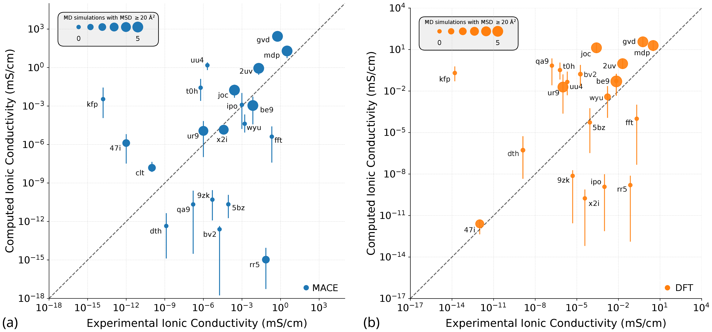]]

---

count: false

## Ionic conductivity estimation
### A comparison of methods

.left-column[.center[.bigger[MACE]]]
.right-column[.center[.bigger[DFT]]]

.full-width[.center[]]

.conclusion[The estimation of the ionic conductivity with DFT exhibits weak correlation with experimental measurements, and the correlation MACE-based estimation is only slightly weaker.]

---

## Ionic conductivity estimation
### A comparison of methods

.left-column-33[.center[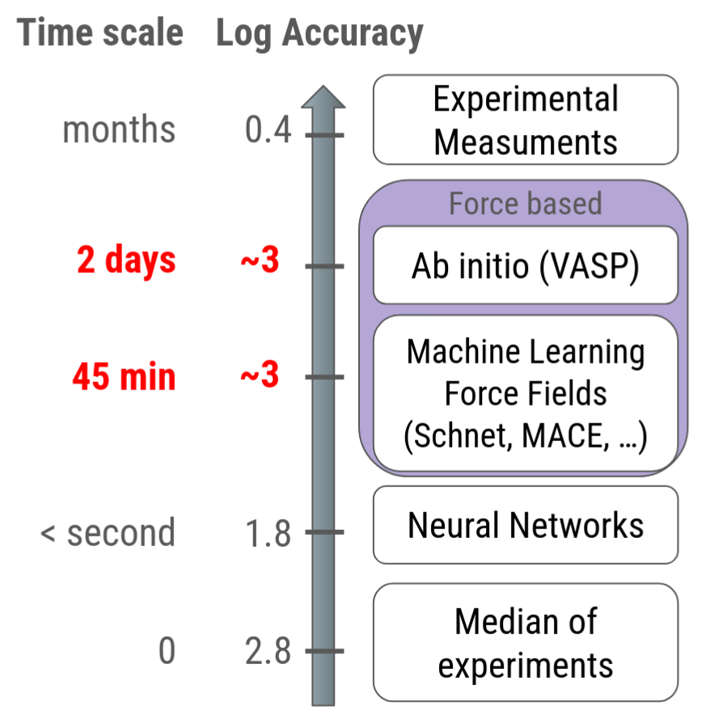]

Paper: [arxiv.org/abs/2603.28012](https://arxiv.org/abs/2603.28012)
]

.right-column-66[.center[]]

---

## Summary

- .h1[Multi-fidelity active learning] with generative models can be effective at exploring large candidate spaces with expensive validation methods.
    - Hernandez-Garcia, Saxena et al. [Multi-fidelity active learning with GFlowNets](https://arxiv.org/abs/2306.11715). TMLR, 2024 
- .h1[OBELiX is a curated data set of nearly 600 materials with experimentally measured ionic conductivity], ready for ML use.
    - Therrien et al. [OBELiX: A curated dataset of crystal structures and experimentally measured ionic conductivities for lithium solid-state electrolytes](https://arxiv.org/abs/2502.14234), Digital Discovery, 2026.
- .h1[Crystal-GFN] offers a flexible framework for crystal structure generation with desirable properties and constraints, based on sequential decision making.
    - Mila AI4Science et al. [Crystal-GFN: sampling crystals with desirable properties and constraints](https://arxiv.org/abs/2310.04925). AI4Mat, NeurIPS 2023 (spotlight).
- We have .h1[compared DFT and ML force fields for the estimation of ionic conductivities] in solid lithium electrolytees: both have similarly weak correlation with experimental values.
    - Shaaban Kabakibo et al. [A comparative study of molecular dynamics approaches for simulating ionic conductivity in solid lithium electrolytes](https://arxiv.org/abs/2603.28012), AI4Mat, ICML 2026.

---

name: x2026-may26
class: title, middle

Alex Hernández-García (he/il/él)

.center[

&nbsp&nbsp&nbsp&nbsp

&nbsp&nbsp&nbsp&nbsp

&nbsp&nbsp&nbsp&nbsp

]

.footer[[alexhernandezgarcia.com](https://alexhernandezgarcia.com/) | [alex.hernandez-garcia@mila.quebec](mailto:alex.hernandez-garcia@mila.quebec)] | [alexhergar.bsky.social](https://bsky.app/profile/alexhergar.bsky.social)  

.smaller[.footer[
Slides: [alexhernandezgarcia.com/slides/{{ name }}](https://alexhernandezgarcia.com/slides/{{ name }})
]]
