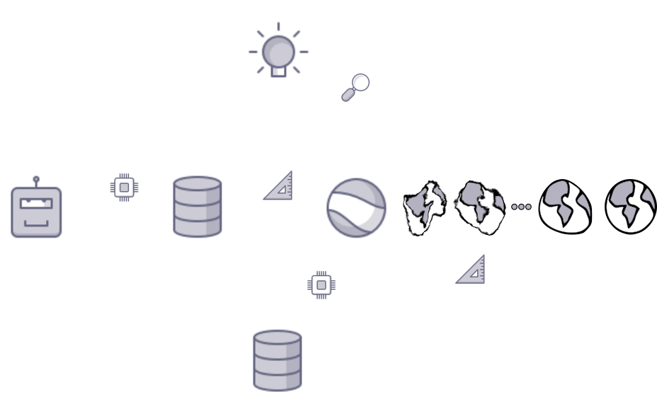

name: title
class: title, middle

## Machine learning for scientific discovery

Alex Hernández-García (he/il/él)

.turquoise[Yoshua Bengio's Lab Retreat · May 25th 2023]

.center[

&nbsp&nbsp&nbsp&nbsp

]

.smaller[.footer[
Slides: [alexhernandezgarcia.github.io/slides/yb-retreat-23](https://alexhernandezgarcia.github.io/slides/yb-retreat-23)
]]

---

name: title
class: title, middle

## Why scientific discovery?

.center[]

---

## Why scientific discovery?

.context[Climate change is a major challenge for humanity.]

.left-column-66[.center[
<figure>
	
  <figcaption>.smaller[Modelled and observed global average temperatures in the last 2 millenia (source graphic: <a href="https://www.theguardian.com/science/2021/aug/09/humans-have-caused-unprecedented-and-irreversible-change-to-climate-scientists-warn">The Guardian</a>.)]</figcaption>
</figure>
]]

.right-column-33[
Consequences:
* Melting glaciers and polar ice
* Sea level rise
* Heatwaves
* Floods
* Droughts
* Wildfires
* ...
]

???

* Flash floods kill **5,000** people per year.
* Sea levels are expected to rise by **2 metres** by the end of the century
* Rising sea levels could disrupt the lives of **1 billion people** by the end of 2050.
* As much as **40% of the Amazon** forest is at risk of becoming a savanna.
* In 2015, forest fires claimed roughly **980 000 $km^2$** of the world’s forest.
* Forest fires emmitted **~1.8 Gt of CO2** in 2019.

---

## Why scientific discovery?

.context[Climate change is a major challenge for humanity.]

.center[
<figure>
	
  <figcaption>Median global warming across modelled scenarios. Adapted from IPCC Sixth Assessment Report, 2022</figcaption>
</figure>
]

--

.conclusion["The evidence is clear: the time for action is now." .smaller[IPCC Sixth Assessment Report, 2022]]

???

* Category C1: scenarios that limit warming to 1.5°C in 2100 with a likelihood of greater than 50%, and reach or exceed warming of 1.5°C during the 21st century with a likelihood of 67% or less. 
* Category C2: same as C1 but exceed warming of 1.5°C during the 21st century with a likelihood of _greater_ than 67%.
* Category C3: scenarios that limit peak warming to 2°C throughout the 21st century with a likelihood of greater than 67%
* Category C8: scenarios that exceed warming of 4°C during the 21st century with a likelihood of 50% or greater.

---

## Why scientific discovery?

.context["The time for action is now"]

> "Limiting global warming will require major transitions in the energy sector. This will involve a substantial reduction in fossil fuel use, widespread electrification, .highlight1[improved energy efficiency, and use of alternative fuels (such as hydrogen)]." .cite[IPCC Sixth Assessment Report, 2022]

> "Net-zero CO2 emissions from the industrial sector are challenging but possible. Reducing industry emissions will entail coordinated action throughout value chains to promote all mitigation options, including demand management, .highlight1[energy and materials efficiency, circular material flows], as well as abatement technologies and transformational changes in production processes." .cite[IPCC Sixth Assessment Report, 2022]

--

 

.conclusion[Mitigation of the climate crisis requires transformational changes in the energy and materials efficiency.]

---

## Why scientific discovery?
### The potential of better materials

.context[The climate crisis demands more efficient materials.]

* Improving material efficiency can reduce 0.93 ($\pm$ 0.23) GtCO₂-eq per year.
* Fuel switching can reduce 2.1 ($\pm$ 0.52) GtCO₂-eq per year, only in the industry sector. 
* Carbon capture and storage can reduce 0.54 ($\pm$ 0.27) GtCO₂-eq per year in the energy sector.

.right[.cite[IPCC Sixth Assessment Report (2022)]]

.smaller[.footnote[† Global anthropogenic emissions in 2019 were estimated in 59 ($\pm$ 6.6) GtCO₂-eq. The budget from 2020 to limit warming to 1.5°C is estimated in 510 ($\pm$ 180) GtCO₂-eq.]]

---

count: false

## Why scientific discovery?
### The potential of better materials

.context[The climate crisis demands more efficient materials.]

* Improving material efficiency can reduce 0.93 ($\pm$ 0.23) GtCO₂-eq per year.
* Fuel switching can reduce 2.1 ($\pm$ 0.52) GtCO₂-eq per year, only in the industry sector. 
* Carbon capture and storage can reduce 0.54 ($\pm$ 0.27) GtCO₂-eq per year in the energy sector.

.right[.cite[IPCC Sixth Assessment Report (2022)]]

What are better, new materials needed for?

* Electrocatalysts for fuel cells, hydrogen storage, industrial chemical reactions, carbon capture, etc.
* Solid electrolytes for batteries.
* Thin film materials for photovoltaics.
* ...

.smaller[.footnote[† Global anthropogenic emissions in 2019 were estimated in 59 ($\pm$ 6.6) GtCO₂-eq. The budget from 2020 to limit warming to 1.5°C is estimated in 510 ($\pm$ 180) GtCO₂-eq.]]

---

## Why scientific discovery?
### Scientific discoveries in history

.context[Material discovery is a key ingredient for climate change mitigation.]

--

Many notable scientific discoveries have occurred due to .highlight1[serendipity] or .highlight1[by accident]:

--

* **Dynamite** (Alfred Nobel, 1867)
* **X-rays** (Wilhelm C. Röntgen, 1895)
* **Radioactivity** (Henri Becquerel and Marie Skłodowska–Curie, 1896)
* **Penicillin** (Alexander Fleming, 1929)
* **Cyanoacrylate (superglue)** (Harry Coover, 1942)
* **Lysergic acid diethylamide (LSD)** (Albert Hofmann, 1943)

--

 
.conclusion[Clearly, we should not rely on serendipity to fight climate change.]

???

Joke experience with some of them, like penicillin and superglue.

---

count: false

## Why scientific discovery?
### Scientific discoveries in history

.context[Material discovery is a key ingredient for climate change mitigation.]

.center[
<figure>
	
  <figcaption>Four paradigms in scientific discovery. Source: <a href="https://www.nature.com/articles/s41524-022-00810-x">Li et al., 2022</a>. (<a href="https://creativecommons.org/licenses/by/4.0/">CC BY 4.0</a>)</figcaption>
</figure>
]

.references[
* Li et al. [Machine learning in concrete science: applications, challenges, and best practices](https://www.nature.com/articles/s41524-022-00810-x). Nature  npj Computational Materials, 2022
]

???

Example of concrete: most prevalent human-made material on Earth, and the most consumed commodity after water. The annual consumption of concrete in the world has reached 35 billion tons, which is twice as much as that of all other building materials combined.

---

count: false

## Why scientific discovery?
### Scientific discoveries in history

.context[Material discovery is a key ingredient for climate change mitigation.]

.center[
<figure>
	
  <figcaption>Four paradigms in scientific discovery. Source: <a href="https://www.nature.com/articles/s41524-022-00810-x">Li et al., 2022</a>. (<a href="https://creativecommons.org/licenses/by/4.0/">CC BY 4.0</a>)</figcaption>
</figure>
]

.references[
* Li et al. [Machine learning in concrete science: applications, challenges, and best practices](https://www.nature.com/articles/s41524-022-00810-x). Nature  npj Computational Materials, 2022
]

???

Concrete: The properties and performance of concrete can be tailored to meet design requirements by varying the type and quantity of the mixture constituents (e.g., cement, water, aggregate, and admixtures). Traditional approaches for designing concrete mixtures often rely on trial-and-error, iterative proportioning, processing, and characterization until the target properties are achieved.

---

count: false

## Why scientific discovery?
### Scientific discoveries in history

.context[Material discovery is a key ingredient for climate change mitigation.]

.center[
<figure>
	
  <figcaption>Four paradigms in scientific discovery. Source: <a href="https://www.nature.com/articles/s41524-022-00810-x">Li et al., 2022</a>. (<a href="https://creativecommons.org/licenses/by/4.0/">CC BY 4.0</a>)</figcaption>
</figure>
]

.references[
* Li et al. [Machine learning in concrete science: applications, challenges, and best practices](https://www.nature.com/articles/s41524-022-00810-x). Nature  npj Computational Materials, 2022
]

???

Concrete: it is possible to optimize the compressive strength of concrete mixtures by adjusting the water/cement ratio, total aggregate/cement ratio, and coarse aggregate/total aggregate ratio6. Yet the practical application of this iterative refinement approach is limited by the exponential increase in the number of specimens and experiments when complex concrete mixtures are studied and several compositional parameters are simultaneously considered as combinatorial variables. As a result, materials development in concrete science involves time-consuming validation/development cycles from laboratory trials to field applications. Efforts to accelerate knowledge acquisition and materials design in concrete science are thus of paramount importance.

Beginning in the 1980s, the development of microstructural models of cement hydration has enabled a fundamental understanding of microstructure–property relationships in concrete7, which has marked the second paradigm. By applying basic laws of kinetics, thermodynamics, and mechanics, and providing analytical solutions to cement hydration. Successful demonstrations include the three-dimensional cement hydration and microstructure development model (CEMHYD3D)8,9; the hydration, morphology, and structural development model (HYMOSTRUC)10; the integrated particle kinetics model11; and the microstructural modeling platform (μic)

---

count: false

## Why scientific discovery?
### Scientific discoveries in history

.context[Material discovery is a key ingredient for climate change mitigation.]

.center[
<figure>
	
  <figcaption>Four paradigms in scientific discovery. Source: <a href="https://www.nature.com/articles/s41524-022-00810-x">Li et al., 2022</a>. (<a href="https://creativecommons.org/licenses/by/4.0/">CC BY 4.0</a>)</figcaption>
</figure>
]

.references[
* Li et al. [Machine learning in concrete science: applications, challenges, and best practices](https://www.nature.com/articles/s41524-022-00810-x). Nature  npj Computational Materials, 2022
]

???

Concrete: However, the complex nature of cement hydration makes it challenging to develop accurate and generalizable models, and these modeling approaches, to varying degrees, rely on thermochemical, physical, and structural data that must be obtained either from accurate experimental observations or from calculations at the atomistic and molecular scales.

In this context, the use of density-functional theory (DFT) and classical molecular dynamics (MD) simulations has been explored in concrete science since the 2000s owing to the ever-growing computing power16. This has given rise to the third paradigm (computational science; Fig. 1), where the first-principle models have been integrated and employed to further describe cementitious materials properties and improve understanding of cement hydration. Related simulation efforts have focused primarily on cementitious phases such as the calcium silicate hydrate (C-S-H) gel, the essential reaction product of cement hydration.

---

count: false

## Why scientific discovery?
### Scientific discoveries in history

.context[Material discovery is a key ingredient for climate change mitigation.]

.center[
<figure>
	
  <figcaption>Four paradigms in scientific discovery. Source: <a href="https://www.nature.com/articles/s41524-022-00810-x">Li et al., 2022</a>. (<a href="https://creativecommons.org/licenses/by/4.0/">CC BY 4.0</a>)</figcaption>
</figure>
]

.references[
* Li et al. [Machine learning in concrete science: applications, challenges, and best practices](https://www.nature.com/articles/s41524-022-00810-x). Nature  npj Computational Materials, 2022
]

???

Concrete: However, these computational techniques require considerable computational resources and thus come with significant challenges, such as their limited time scales and the relatively small number of atoms in a simulated system. In addition, it may be difficult to validate these simulations with experiments, given the small time and length scales and high-fidelity measurements required.

By leveraging existing datasets with data-driven models, ML can automatically learn implicit patterns and extract valuable information while accounting for the inherent complexity of concrete mixtures and their properties.

---

## Traditional scientific discovery loop

.right-column-66[ .center[]]

.left-column-33[
The .highlight1[traditional pipeline] for scientific discovery (paradigms 1-3):
* relies on .highlight1[highly specialised human expertise],
* it is .highlight1[time-consuming] and
* .highlight1[financially and computationally expensive].
]

---

count: false

## Machine learning in the loop

.right-column-66[ .center[]]

.left-column-33[
A .highlight1[machine learning model] can be:
* trained with data from _real-world_ experiments and
* used to quickly and cheaply evaluate queries
]

---

count: false

## Machine learning in the loop

.right-column-66[ .center[]]

.left-column-33[
A .highlight1[machine learning model] can be:
* trained with data from _real-world_ experiments and
* used to quickly and cheaply evaluate queries

.conclusion[A machine learning model replacing real-world experiments can _only_ provide _linear_ gains.]

.conclusion[Not enough if the search space is very large ($10^{180}$ stable materials)]
]

---

count: false

## _Generative_ machine learning in the loop

.context[Can we do better than _linear_? An agent in the loop]

.right-column-66[ .center[]]

.left-column-33[
A .highlight1[machine learning **agent**] in the loop can:
* .highlight1[learn structure] from the available data,
* .highlight1[generalise] to unexplored regions of the search space and
* .highlight1[build better queries]
]

---

count: false

## _Generative_ machine learning in the loop

.context[Can we do better than _linear_? An agent in the loop]

.right-column-66[ .center[]]

.left-column-33[
A .highlight1[machine learning **agent**] in the loop can:
* .highlight1[learn structure] from the available data,
* .highlight1[generalise] to unexplored regions of the search space and
* .highlight1[build better queries]

.conclusion[A successful AL pipeline with an ML agent in the loop can provide _exponential_ gains.]
]

---

## Machine learning for scientific discovery
### Challenges and limitations of existing methods

.highlight1[Challenge]: very large search spaces.

--

&rarr; Need for .highlight2[efficient search and generalisation] of underlying structure.

--

.highlight1[Challenge]: underspecification of objective functions or metrics.

--

&rarr; Need for .highlight2[diverse] candidates.

--

.highlight1[Limitation]: Reinforcement learning and MCMC methods are good at optimisation but bad at mode mixing.

--

&rarr; Need for .highlight2[multi-modal optimisation].

---

count: false

## _Generative_ machine learning in the loop

.context[Can we do better than _linear_? An agent in the loop]

.right-column-66[ .center[]]

.left-column-33[
A .highlight1[machine learning **agent**] in the loop can:
* .highlight1[learn structure] from the available data,
* .highlight1[generalise] to unexplored regions of the search space and
* .highlight1[build better queries]

.conclusion[A successful AL pipeline with an ML agent in the loop can provide _exponential_ gains.]
]

---

count: false

## _Generative_ machine learning in the loop

.context[GFlowNet as the agent.]

.right-column-66[ .center[]]

.left-column-33[
A .highlight1[machine learning **agent**] in the loop can:
* .highlight1[learn structure] from the available data,
* .highlight1[generalise] to unexplored regions of the search space and
* .highlight1[build better queries]

.conclusion[A successful AL pipeline with an ML agent in the loop can provide _exponential_ gains.]
]

.references[
Jain et al.. [GFlowNets for AI-Driven Scientific Discovery](https://arxiv.org/abs/2302.00615). Digital Discovery, Royal Society of Chemistry, 2023.
]

---

## Active learning for scientific discovery
### Areas of application

* Electrocatalyst design
* Solid electrolytes as super ionic conductors
* CO₂ electrolysis
* DNA aptamer design
* Antimicrobial peptides
* Discovery of small molecules

---

name: title
class: title, middle

## Multi-fidelity Active Learning with GFlowNets

.center[]

---

## Multi-fidelity active learning

.context[In many areas of scientific applications we have access to multiple approximations of the objective function]

 
.center[]

---

## Multi-fidelity GFlowNets (MF-GFN) for active learning

- An augmented GFlowNet that samples both the object $x \in \mathcal{X}$ and the fidelity $m \in \{1, 2, \ldots, M\}$.
- MF-GFN can be trained with a multi-fidelity acquistion function as a reward.
- After training, we can sample $N$ $(x, m)$ candidates and select the top $K$.
- We annotate each $x$ with the selected oracle $m$.
- Repeat.

---

##  Results

.center[

]

---

##  Results

.center[

]

.conclusion[Multi-fidelity GFlowNets discover diverse, high-score candidates with much lower costs than existing alternatives]

---

name: title
class: title, middle

## A new synthetic GFlowNet task

.center[
  
]

---

## A Tetris-based task

.context[Scientific discovery involves exploring in large, multi-modal search spaces.]

 
Task: find arrangements of Tetris pieces on the board that minimise the empty space.

.left-column[
.center[]
]

.right-column[
  
]

--

.conclusion[This task resembles designing DNA sequences or molecules or materials via fragments, to optimise certain properties.]

---

## A Tetris-based task

.context[Scientific discovery involves exploring in large, multi-modal search spaces.]

 
Task: find arrangements of Tetris pieces on the board that minimise the empty space.

.center[

  

  <figure>
      
    <figcaption>Score: 0/12</figcaption>
  </figure>
  

  

  <figure>
      
    <figcaption>Score: 4/12</figcaption>
  </figure>
  

  

  <figure>
      
    <figcaption>Score: 8/12</figcaption>
  </figure>
  

  

  <figure>
      
    <figcaption>Score: 12/12</figcaption>
  </figure>
  

]

---

## A Tetris-based task

.context[Scientific discovery involves exploring in large, multi-modal search spaces.]

 
Task: find arrangements of Tetris pieces on the board that minimise the empty space.

.center[

  

  <figure>
      
    <figcaption>Score: 12/12</figcaption>
  </figure>
  

  

  <figure>
      
    <figcaption>Score: 12/12</figcaption>
  </figure>
  

  

  <figure>
      
    <figcaption>Score: 12/12</figcaption>
  </figure>
  

  

  <figure>
      
    <figcaption>Score: 12/12</figcaption>
  </figure>
  

  

  <figure>
      
    <figcaption>Score: 12/12</figcaption>
  </figure>
  

]

.conclusion[The _reward function_ of this task has multiple modes. With a larger board and more pieces, the number of combinations and modes grow exponentially and the task of efficiently finding them is non-trivial for machine learning models.]

---

## A Tetris-based task
### Trajectories

.center[

  

  <figure>
      
    <figcaption>$s_0$</figcaption>
  </figure>
  

  

  $\rightarrow$
  

  

  <figure>
      
    <figcaption>$s_1$</figcaption>
  </figure>
  

  

  $\rightarrow$
  

  

  <figure>
      
    <figcaption>$s_2$</figcaption>
  </figure>
  

]
---

## A Tetris-based task
### State and action space

 

.left-column[.center[
  <figure>
    
    <figcaption>State space $\cal S$</figcaption>
  </figure>
]]

.right-column[.center[
  <figure>
    
    <figcaption>Action space $\cal A$</figcaption>
  </figure>
]]

---

## Results
### Tetris GFlowNets

 

.center[

  

  <figure>
      
    <figcaption>$\pi(x) = 8.12~\%$</figcaption>
  </figure>
  

  

  <figure>
      
    <figcaption>$\pi(x) = 8.96~\%$</figcaption>
  </figure>
  

  

  <figure>
      
    <figcaption>$\pi(x) = 8.61~\%$</figcaption>
  </figure>
  

  

  <figure>
      
    <figcaption>$\pi(x) = 9.16~\%$</figcaption>
  </figure>
  

  

  <figure>
      
    <figcaption>$\pi(x) = 8.39~\%$</figcaption>
  </figure>
  

]

After training, GFlowNet samples a mode with probability 43.24 %.

.footnote[The energy function $\varepsilon(x)$ is the fraction of the board occupied by pieces and the reward function is $R(X) = \varepsilon(x)^4$ to disproportionally favour the discovery of modes.]

---

name: title
class: title, middle

## Thanks! Questions? 

Alex Hernández-García (he/il/él)

.center[

&nbsp&nbsp&nbsp&nbsp

]

.footer[[alexhernandezgarcia.github.io](https://alexhernandezgarcia.github.io/) | [alex.hernandez-garcia@mila.quebec](mailto:alex.hernandez-garcia@mila.quebec)] 
.footer[[@alexhg@scholar.social](https://scholar.social/@alexhg)  | [@alexhdezgcia](https://twitter.com/alexhdezgcia) ]

.smaller[.footer[
Slides: [alexhernandezgarcia.github.io/slides/yb-retreat-23](https://alexhernandezgarcia.github.io/slides/yb-retreat-23)
]]

