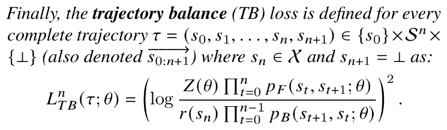

name: continuous-gflownets-20250925
class: title, middle

## Probabilistic inference with GFlowNets
### IFT 6760B A25

#### .gray224[September 22nd - Session 7]
### .gray224[Continuous GFlowNets]

.smaller[.footer[
Slides: [alexhernandezgarcia.github.io/teaching/mlprojects24/slides/{{ name }}](https://alexhernandezgarcia.github.io/teaching/gflownets25/slides/{{ name }})
]]

.center[

]

Alex Hernández-García (he/il/él)

.footer[[alexhernandezgarcia.github.io](https://alexhernandezgarcia.github.io/) | [alex.hernandez-garcia@mila.quebec](mailto:alex.hernandez-garcia@mila.quebec)] | [alexhergar.bsky.social](https://bsky.app/profile/alexhergar.bsky.social)  

---

## Objectives of this session

- Generalise the theory of GFlowNets to continuous and hybrid states:
    - Introduce the key notions and intuitions
    - Discuss the main differences with respect to discrete GFlowNets
    - Illustrate everything with a practical example

--

The goal is that at the end of the session:
- You will be able to explain why GFlowNets can be generalised to continuous spaces.
- You will be able to identify potential invalid assumptions in the naïve generalisation of GFlowNets from discrete to continuous.
- You will be able to overcome the typical difficulties when implementing a continuous GFlowNet.

---

## Literature

.references[
Salem Lahlou, Tristan Deleu, Pablo Lemos, Dinghuai Zhang, Alexandra Volokhova, Alex Hernández-García, Léna Néhale Ezzine, Yoshua Bengio, Nikolay Malkin. [A theory of continuous generative flow networks](https://arxiv.org/abs/2301.12594). ICML, 2023.
]

.center[]

---

## Continuous GFlowNets
### Brief summary

- The theory of GFlowNets _can_ be generalised to continuous (and hybrid) state spaces:
    - We can achieve sampling proportional to a reward function.
    - The common losses used for discrete GFlowNets (flow matching, detailed balance and trajectory balance) can be adapted to continuous GFlowNets

--

- However, establishing and understanding the theoretical framework is not trivial: The theory relies on measure theory and mathematical notions such as transition kernels that are not typically encountered in the fundamentals of machine learning.

--

- A naïve extension from discrete to continuous GFlowNets is likely to result in assumptions or implementations that "break" the theory.

--

- There are a number of guiding conditions and rules that are important to take into account.

---

## From discrete to continuous

.center[]

--

.conclusion[The theory of continuous GFlowNets is a _generalisation_, in the sense that discrete GFlowNets are a particular case.]

---

## Important considerations

1. In discrete GFlowNets, we can describe transitions between states in terms of actions. In continuous GFlowNets, probability measures need to be expressed through densities over states. The states reachable from a state $s$ are described by a transition kernel $\kappa$.

--

2. In practice, for discrete GFlowNets, we obtain probability masses using a multinomial (categorical) distribution over the possible actions. With continuous GFlowNets, the policy models learn the parameters of continuous probability distributions from which we can evaluate (log) probability density at specific values.

--

3. The structure of the state space must allow all states to be reachable from the source state $s_0$.

--

4. The structure must ensure that the number of steps required to reach any state from $s_0$ is bounded (trajectories have finite length).

--

5. The forward and backward transitions (kernels) need to be compatible: backward trajectories must finish at the source state $s_0$.

---

## Flow matching

.left-column[.center[]]

--

.right-column[.center[]]

---

## Detailed balance

.left-column[.center[]]

--

.right-column[.center[]]

---

## Trajectory balance

.left-column[.center[]]

--

.right-column[.center[]]

---

## Illustration of results
### Continuous torus

Sampling from distributions over tori are useful for sampling from the Boltzmann distributions of molecules parameterised by their torsion angles.

Here, we defined the structure of the state space (the measurable pointed graph) as the union of the source state and $T$ transitions in $[0, 2\pi)$, modelled by a mixture of von Mises distributions.

.center[]

---

## Illustration of results
### Continuous hyper-cube

A hyper-cube can be the basis of many other continuous environments that may need sampling in a Euclidean space.

.center[]

---

name: title
class: title, middle
count: false

## Probabilistic inference with GFlowNets
### IFT 6760B A25

#### .gray224[September 22nd - Session 7]
### .gray224[Continuous GFlowNets]

.center[

]

Alex Hernández-García (he/il/él)

.footer[[alexhernandezgarcia.github.io](https://alexhernandezgarcia.github.io/) | [alex.hernandez-garcia@mila.quebec](mailto:alex.hernandez-garcia@mila.quebec)] | [alexhergar.bsky.social](https://bsky.app/profile/alexhergar.bsky.social)  

