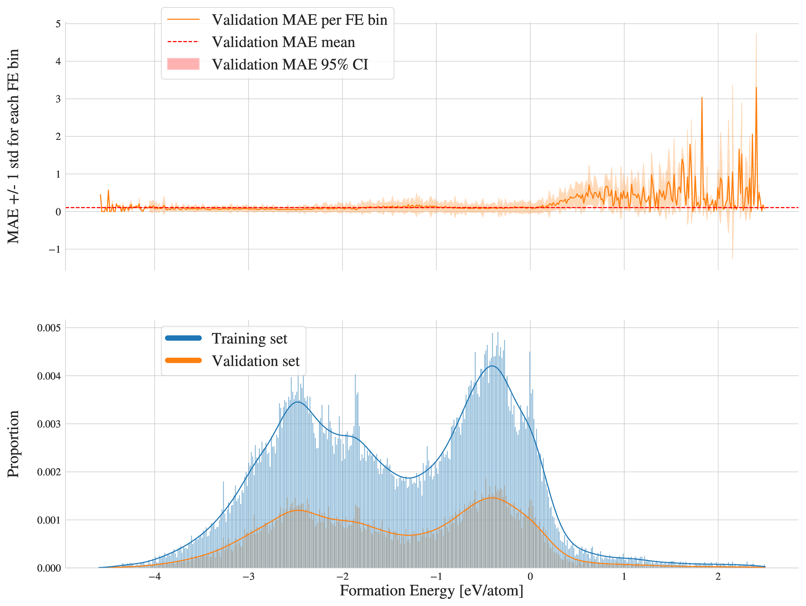
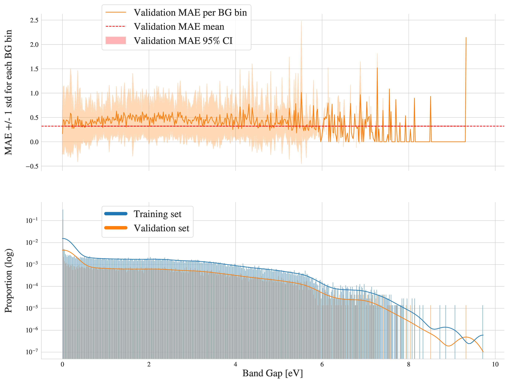

name: crystal-gfn-20251002
class: title, middle

## Probabilistic inference with GFlowNets
### IFT 6760B A25

#### .gray224[October 2nd - Session 9]
### .gray224[Crystal-GFN: GFlowNets for materials discovery]

.smaller[.footer[
Slides: [alexhernandezgarcia.github.io/teaching/mlprojects24/slides/{{ name }}](https://alexhernandezgarcia.github.io/teaching/gflownets25/slides/{{ name }})
]]

.center[

]

Alex Hernández-García (he/il/él)

.footer[[alexhernandezgarcia.github.io](https://alexhernandezgarcia.github.io/) | [alex.hernandez-garcia@mila.quebec](mailto:alex.hernandez-garcia@mila.quebec)] | [alexhergar.bsky.social](https://bsky.app/profile/alexhergar.bsky.social)  

---

count: false
name: crystal-gfn
class: title, middle

## Crystal-GFN: GFlowNets for materials discovery

Mila AI4Science: Alex Hernandez-Garcia, Alexandre Duval, Alexandra Volokhova, Yoshua Bengio, Divya Sharma, Pierre Luc Carrier, Yasmine Benabed, Michał Koziarski, Victor Schmidt, Pierre-Paul De Breuck

.smaller70[Mila AI4Science et al. [Crystal-GFN: sampling crystals with desirable properties and constraints](https://arxiv.org/abs/2310.04925). AI4Mat, NeurIPS 2023 (spotlight).]

.center[]

---

## What are crystals?

Definition: A crystal or crystalline solid is a solid material whose constituents (such as atoms, molecules, or ions) are arranged in a .highlight1[highly ordered microscopic structure], forming .highlight1[a crystal lattice that extends in all directions].

.left-column[
.center[]
]
.right-column[
.center[]
]

--

Here, we are concerned mainly with _inorganic crystals_, where the constituents are atoms or ions.

--

A crystal structure is characterized by its .highlight1[unit cell], a small imaginary box containing atoms in a specific spatial arrangement with certain symmetry. The unit cell repeats iself periodically in all directions.

---

## Why do we care about crystals?

.context35[Materials discovery can help reduce greenhouse gas emissions in multiple sectors.]

--

 
Many solid state materials are crystal structures and they are a core component of .highlight1[solar cells, batteries, electrocatalysts], etc.

--

Accelerating .highlight1[material discovery is key in the climate crisis]. From the IPCC Sixth Assessment Report, 2022:  
* Improving material efficiency can reduce 0.93 ($\pm$ 0.23) GtCO₂-eq per year.
* Fuel switching can reduce 2.1 ($\pm$ 0.52) GtCO₂-eq per year, only in the industry sector. 
* Carbon capture and storage can reduce 0.54 ($\pm$ 0.27) GtCO₂-eq per year in the energy sector.

.smaller[.footnote[Global anthropogenic emissions in 2019 were estimated in 59 ($\pm$6.6) GtCO₂-eq.]]

--

However, .highlight1[material modelling is very challenging]:
* Limited data: only about 200 K known inorganic materials, while there are infinitely many conceivable materials (for reference: more than a billion molecules are known)
* Sparsity: .highlight2[stable materials] only exist in a low-dimensional subspace of all possible 3D arrangements.

---

## Crystal structure generation in the literature

Example: .highlight2[Crystal Diffusion Variational Autoencoder (CDVAE)]: a diffusion process that moves .highlight1[atomic coordinates] towards a lower energy state and updates atom types to satisfy bonding preferences between neighbors. The key idea is to learn the diffusion process from the data distribution of stable materials. .cite[(Xie et al., 2022)]

.center[]

.references[Xie et al. [Crystal diffusion variational autoencoder for periodic material generation](https://arxiv.org/abs/2110.06197). ICLR 2022] 

???

A: atom types
X: atom coordinates
L: perdiodic lattice: l1, l2, l3 (3x3)

---

count: false

## Crystal structure generation in the literature

Example: .highlight2[Physics Guided Crystal Generative Model (PGCGM)]: A GAN with the affine matrices of the symmetry operations and element properties as inputs, augmented with a distance loss between real and fake materials, and data augmentation on the atomic positions. .cite[(Zhao et al., 2023)]

.center[]

.references[Zhao et al. [Physics guided deep learning for generative design of crystal materials with symmetry constraints](https://www.nature.com/articles/s41524-023-00987-9). npj computational materials 2023] 

---

count: false

## Crystal structure generation in the literature

Example: .highlight2[MatterGen]: An evolution of CDVAE that performs diffusion not only on atomic positions but also on the atom types and the lattice. .cite[(Zeni, Pinsler, Zügner, Fowler et al., 2023)]

.center[]

.references[Zeni, Pinsler, Zügner, Fowler et al. [MatterGen: a generative model for inorganic materials design](https://arxiv.org/abs/2312.03687). arXiv 2023] 

---

count: false

## Crystal structure generation in the literature

Example: .highlight2[UniMat]: A denoising diffusion model learns to move atoms from random locations back to their original locations. Atoms not present in the crystal are moved to the null location during the denoising process, allowing crystals with an arbitrary number of atoms to be generated.

.center[]

.references[Yang et al. [Scalable Diffusion for Materials Generation](https://arxiv.org/abs/2311.09235). arXiv 2023] 

---

## A domain-inspired approach
### Crystal structure parameters

.context[Most previous works tackle crystal structure generation in the space of atomic coordinates and struggle to preserve the symmetry properties.]

--

 
Instead of optimising the atom positions by learning from a small data set, we draw .highlight1[inspiration from theoretical crystallography to sample crystals in a lower-dimensional space of crystal structure parameters].

--

.highlight2[Space group]: symmetry operations of a repeating pattern in space that leave the pattern unchanged.

--

- There are 17 symmetry groups in 2 dimensions (wallpaper groups).
- There are 230 space groups in 3 dimensions.

---

count: false

## A domain-inspired approach
### Crystal structure parameters

.context[Most previous works tackle crystal structure generation in the space of atomic coordinates and struggle to preserve the symmetry properties.]

 
Instead of optimising the atom positions by learning from a small data set, we draw .highlight1[inspiration from theoretical crystallography to sample crystals in a lower-dimensional space of crystal structure parameters].

.highlight2[Lattice system]: all 230 space groups can be classified into one of the 7 lattices.

.center[
<nobr>
<nobr>
<nobr>
<nobr>
<nobr>
<nobr>
<nobr>
]

---

count: false

## A domain-inspired approach
### Crystal structure parameters

.context[Most previous works tackle crystal structure generation in the space of atomic coordinates and struggle to preserve the symmetry properties.]

 
Instead of optimising the atom positions by learning from a small data set, we draw .highlight1[inspiration from theoretical crystallography to sample crystals in a lower-dimensional space of crystal structure parameters].

.center[]

---

count: false

## A domain-inspired approach
### Crystal structure parameters

.context[Most previous works tackle crystal structure generation in the space of atomic coordinates and struggle to preserve the symmetry properties.]

 
Instead of optimising the atom positions by learning from a small data set, we draw .highlight1[inspiration from theoretical crystallography to sample crystals in a lower-dimensional space of crystal structure parameters].

.highlight2[Lattice parameters]: The lattice's size and shape is characterised by 6 parameters: .highlight1[$a, b, c, \alpha, \beta, \gamma$].

.center[]

---

count: false

## Crystal-GFlowNet
### Sequential generation

.center[]

---

count: false

## Crystal-GFlowNet
### Sequential generation

.center[]

---

count: false

## Crystal-GFlowNet
### Sequential generation

.center[]

---

count: false

## Crystal-GFlowNet
### Sequential generation

.center[]

---

count: false

## Crystal-GFlowNet
### Sequential generation

.center[]

---

count: false

## Crystal-GFlowNet
### Sequential generation

.center[]

---

count: false

## Crystal-GFlowNet
### Sequential generation

.center[]

---

count: false

## Crystal-GFlowNet
### Sequential generation

.center[]

---

count: false

## Crystal-GFlowNet
### Sequential generation

.center[]

.conclusion[Crystal-GFN binds multiple spaces representing crystallographic and material properties, setting intra- and inter-space hard constraints in the generation process.]

---

## GFlowNet approach
### Advantages

.context[We generate materials in the lower-dimensional space of crystal structure parameters.]

* Constructing materials by their crystal structure parameters allows us to introduce .highlight1[physicochemical and geometric _hard_ constraints]:
--

    * Charge neutrality of the composition.
    * Compatibility of composition and space group.
    * Hierarchical structure of the space group.
    * Compatibility of lattice parameters and lattice system.
--
* .highlight1[Searching in the lower-dimensional space] of crystal structure parameters may be more efficient than in the space of atom coordinates.

--
* Provided we have access to a predictive model of a material property, we can .highlight1[flexibly generate materials with desirable properties].

--
* We can .highlight1[flexibly sample materials with specific characteristics, such as composition or space group]. 

--
* Training the generative model does not depend on a data set, but on a proxy model of the property of interest.

---

## Crystal-GFlowNet
### Material properties

We can train a Crystal-GFN with any reward function, provided it is computationally tractable. Therefore, we can use it to .highlight1[generate materials with different properties]. 
--
We have tested the following properties:

- .highlight2[Formation energy] per atom [eV/atom], via a pre-trained machine learning model: indicative of the material's stability.

--
- .highlight2[Electronic band gap] [eV] (squared distance to a target value, 1.34 eV), via a pre-trained machine learning model: relevant in photovoltaics, for instance.

---

count: false

## Crystal-GFlowNet
### Material properties

We can train a Crystal-GFN with any reward function, provided it is computationally tractable. Therefore, we can use it to .highlight1[generate materials with different properties]. We have tested the following properties:

- .highlight2[Formation energy] per atom [eV/atom], via a pre-trained machine learning model: indicative of the material's stability.
- .highlight2[Electronic band gap] [eV] (squared distance to a target value, 1.34 eV), via a pre-trained machine learning model: relevant in photovoltaics, for instance.

---

## Results
### Formation energy

.context35[The formation energy correlates with stability. The lower, the better.]

.center[]

---

## Results
### Formation energy

.context35[The formation energy correlates with stability. The lower, the better.]

.center[]

---

count: false

## Results
### Formation energy

.context35[The formation energy correlates with stability. The lower, the better.]

.center[]

---

count: false

## Results
### Formation energy

.context35[The formation energy correlates with stability. The lower, the better.]

.center[]

---

count: false

## Results
### Formation energy

.context35[The formation energy correlates with stability. The lower, the better.]

.center[]

---

count: false

## Results
### Formation energy

.context[.highlight1[After training, Crystal-GFN samples structures with even lower formation energy [eV/atom] than the validation set.]]

.center[]

---

## Results
### Band gap

.context35[We aimed at sampling structures with band gap close to 1.34 eV.]

.center[]

---

## Results
### Band gap

.context35[We aimed at sampling structures with band gap close to 1.34 eV.]

.center[]

---

count: false

## Results
### Band gap

.context35[We aimed at sampling structures with band gap close to 1.34 eV.]

.center[]

---

count: false

## Results
### Band gap

.context35[We aimed at sampling structures with band gap close to 1.34 eV.]

.center[]

---

count: false

## Results
### Band gap

.context35[We aimed at sampling structures with band gap close to 1.34 eV.]

.center[]

---

count: false

## Results
### Band gap

.context[.highlight1[After training, Crystal-GFN samples structures with band gap [eV] around the target value.]]

.center[]

---

## Results
### Diversity

.context[.highlight2[Diversity] is key in materials discovery.]

Analysis of 10,000 sampled crystals and the top-100 with lowest formation energy.

--

- All 10,000 samples are unique.

--
- All crystal systems, lattice systems and point symmetries found in the 10,000 samples.
    - 4 out of 8 crystal-lattice systems in the top-100.
    - 4 out of the 5 point symmetries in the top-100.
--
- All 22 elements found in the 10,000 samples.
    - 15 out of 22 elements in the top-100.
--
- 73 out of 113 space groups (65 %) found in the 10,000 samples
    - 19 out of 113 space groups in the top-100.

--

.conclusion[Crystal-GFN samples are highly diverse.]

---

## Results
### Restricted sampling

.context[Crystal-GFN is flexible by design, inspired by the needs of domain experts.]

We restrict the sampling space at sampling time:

- A: The composition is restricted to only elements Fe and O, with a maximum of 10 atoms per element.
- B: We sample in the ternary space for Li-Mn-O, keeping the element count to maximum 16 atoms.
- C: We restrict the space groups to only cubic lattices.
- D: We restrict the range of the lattice parameters to lengths between 10 and 20 angstroms and angles between 75 and 135 degrees.

---

## Results
### Restricted sampling

.center[]

---

## Ongoing applications

* Discovering novel for solid-state electrolytes with high ionic conductivity for battery materials. 

* Designing electrocatalysts for sustainability purposes.

---

## Crystal-GFN
### Summary and conclusions

.references[
* Mila AI4Science et al. [Crystal-GFN: sampling crystals with desirable properties and constraints](https://arxiv.org/abs/2310.04925). AI4Mat, NeurIPS 2023 (spotlight).
]

* Discovering new crystal structures with desirable properties can help mitigate the climate crisis.

* There are infinitely many conceivable crystals. Only a few are stable. Only a few stable crystals have interesting properties. This is a really hard problem.

* Most methods in the literature struggle to preserve the symmetry properties of the crystals.

* Crystal-GFN introduces .highlight1[physicochemical and structural constraints], reducing the search space.
    * Crystal-GFN is trained in 12 hours in a CPU-only machine.

* Our results show that we can generate .highlight1[diverse, high scoring samples with the desired constraints].

* The .highlight1[framework can be flexibly extended] with more constraints, crystal structure descriptors (atomic positions) and other properties. 

---

name: title
class: title, middle
count: false

## Probabilistic inference with GFlowNets
### IFT 6760B A25

#### .gray224[October 2nd - Session 9]
### .gray224[Crystal-GFN: GFlowNets for materials discovery]

.center[

]

Alex Hernández-García (he/il/él)

.footer[[alexhernandezgarcia.github.io](https://alexhernandezgarcia.github.io/) | [alex.hernandez-garcia@mila.quebec](mailto:alex.hernandez-garcia@mila.quebec)] | [alexhergar.bsky.social](https://bsky.app/profile/alexhergar.bsky.social)  
