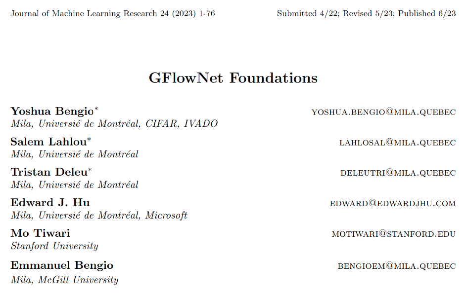
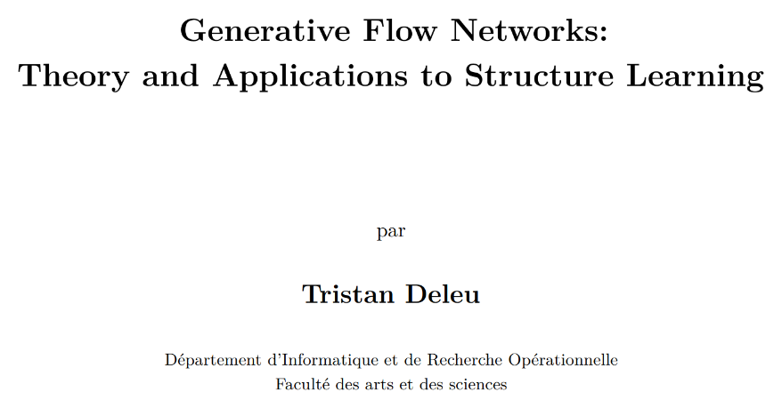
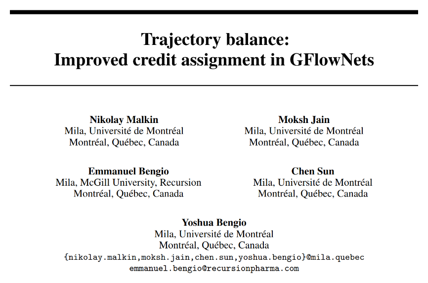

name: gflownets-consolidation-20250922
class: title, middle

## Probabilistic inference with GFlowNets
### IFT 6760B A25

#### .gray224[September 22nd - Session 6]
### .gray224[Consolidation of GFlowNet theory]

.smaller[.footer[
Slides: [alexhernandezgarcia.github.io/teaching/mlprojects24/slides/{{ name }}](https://alexhernandezgarcia.github.io/teaching/gflownets25/slides/{{ name }})
]]

.center[

]

Alex Hernández-García (he/il/él)

.footer[[alexhernandezgarcia.github.io](https://alexhernandezgarcia.github.io/) | [alex.hernandez-garcia@mila.quebec](mailto:alex.hernandez-garcia@mila.quebec)] | [alexhergar.bsky.social](https://bsky.app/profile/alexhergar.bsky.social)  

---

## Objectives of this session

- Expand and consolidatate the fundamentals of GFlowNets:
    - Formal definitions
    - Main properties
    - Additional loss functions

--

The goal is that at the end of the session:
- You will be able to explain the fundamentals of GFlowNets using well grounded theory.
- You will be able to connect the main properties of GFlowNets to the theory.
- You will know of additional loss functions valid to train GFlowNets.

---

## Literature

.references[
Yoshua Bengio, Salem Lahlou, Tristan Deleu, Edward J. Hu, Mo Tiwari, Emmanuel Bengio. [GFlowNet Foundations](https://arxiv.org/abs/2111.09266). JMLR, 2023.
]

.center[]

---

## Literature

.references[
Tristan Deleu. [Generative Flow Networks: Theory and Applications to Structure Learning](https://arxiv.org/abs/2501.05498). PhD thesis, Université de Montréal, 2025.
]

.center[]

---

## Literature

.references[
Nikolay Malkin, Moksh Jain, Emmanuel Bengio, Chen Sun, Yoshua Bengio. [Trajectory balance: Improved credit assignment in GFlowNets](https://arxiv.org/abs/2201.13259). NeurIPS, 2022.
]

.center[]

---

name: title
class: title, middle
count: false

## Probabilistic inference with GFlowNets
### IFT 6760B A25

#### .gray224[September 22nd - Session 6]
### .gray224[Consolidation of GFlowNet theory]

.center[

]

Alex Hernández-García (he/il/él)

.footer[[alexhernandezgarcia.github.io](https://alexhernandezgarcia.github.io/) | [alex.hernandez-garcia@mila.quebec](mailto:alex.hernandez-garcia@mila.quebec)] | [alexhergar.bsky.social](https://bsky.app/profile/alexhergar.bsky.social)  

