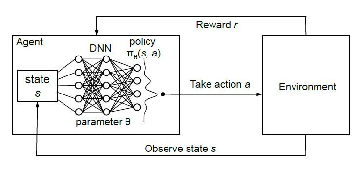

name: gflownets-intro-part1-20250911
class: title, middle

## Probabilistic inference with GFlowNets
### IFT 6760B A25

#### .gray224[September 11th - Session 3]
### .gray224[Introduction to GFlowNets I]

.smaller[.footer[
Slides: [alexhernandezgarcia.github.io/teaching/mlprojects24/slides/{{ name }}](https://alexhernandezgarcia.github.io/teaching/gflownets25/slides/{{ name }})
]]

.center[

]

Alex Hernández-García (he/il/él)

.footer[[alexhernandezgarcia.github.io](https://alexhernandezgarcia.github.io/) | [alex.hernandez-garcia@mila.quebec](mailto:alex.hernandez-garcia@mila.quebec)] | [alexhergar.bsky.social](https://bsky.app/profile/alexhergar.bsky.social)  

---

## Registration for auditing
### Last reminder

.center[If you are auditing this course but have not "registered" yet, please submit your contact information and intentions for the course:]

.center[[alexhernandezgarcia.github.io/teaching/gflownets25/auditing](https://alexhernandezgarcia.github.io/teaching/gflownets25/auditing)]

.qrcode[]

---

## Piazza
### Virtual classroom

As agreed during the first session, we will use Piazza as a virtual platform for discussion and announcements.

- Recommended for everyone to not miss potentially interesting discussions
- Strongly recommended for auditors
- For enrolled students, important announcements and materials will still be posted on StudiUM

.center[[piazza.com/umontreal.ca/fall2025/ift6760ba25](https://piazza.com/umontreal.ca/fall2025/ift6760ba25)]

.center[A passcode is needed!]

.qrcode[]

---

## Objectives of this session

- Introduce the basic notions about GFlowNets:
    - Motivation
    - Definitions
    - Main distinctive properties

--

The goal is that at the end of the session:
- You will be able to explain why GFlowNets were "invented"
- You will start to feel familiar with common terminology and notions about GFlowNets
- You will be able to describe the intuitions about what makes GFlowNets different from related methods

---

count: false
name: generativeml
class: title, middle

## Motivation
### Scientific discoveries

---

## Motivation
### The original paper

.references[
Emmanuel Bengio, Moksh Jain, Maksym Korablyov, Doina Precup, Yoshua Bengio. [Flow network based generative models for non-iterative diverse candidate generation](https://arxiv.org/abs/2106.04399). NeurIPS, 2021.
]

.center[]

---

## Motivation
### The original paper

.references[
Emmanuel Bengio, Moksh Jain, Maksym Korablyov, Doina Precup, Yoshua Bengio. [Flow network based generative models for non-iterative diverse candidate generation](https://arxiv.org/abs/2106.04399). NeurIPS, 2021.
]

>  _In this paper, we study the scenario where our objective is not to generate the single highest-reward sequence of actions but rather to sample a distribution of trajectories whose probability is proportional to a given positive return or reward function._

--

>  _This is equivalent to the problem of turning an energy function into a corresponding generative model._

--

> _A motivating application for this setup is iterative black-box optimization where the learner has access to an oracle which can compute a reward for a large batch of candidates at each round, e.g., in drug-discovery applications._

--

> _Diversity of the generated candidates is particularly important when the oracle is itself uncertain_.

---

## Problem setting

- We want to generate objects $x \in \mathcal{X}$. For now, we will consider $\mathcal{X}$ to be discrete.

--
- We want the generated objects to have two main properties:
    - High scores, $s(x)$, that is good values of a desirable property.
    - Diversity

--
.full-width[
.center[

]]

--
Bringing the probabilistic and generative modelling perspective, we can informally frame the problem as follows: .h1[we want to learn a $p_{\theta}(x)$ that samples diverse $x$ with good values of $s(x)$.]

--

.center[_What approaches have we seen that are best suited for this problem setting?_]

---

name: ebm

## Energy-based models (EBM)

.references[
- Murphy, Song and Kingma. [Probabilistic machine learning: Advanced topics](https://probml.github.io/pml-book/book2.html). Chapter 24 - Energy-based models. MIT press, 2023.
- Teh, Welling, Osindero, Hinton. [Energy-based models for sparse overcomplete representations](https://jmlr.org/papers/v4/teh03a.html). JMLR, 2003.
- Lippe. [Tutorial 8: Deep Energy-Based Generative Models](https://uvadlc-notebooks.readthedocs.io/en/latest/tutorial_notebooks/tutorial8/Deep_Energy_Models.html). UvA Deep Learning Tutorials, 2024.
]

.context[We want to sample diverse $x$ with good scores $s(x)$.]

Energy-based models are a large class of generative models that rely on the idea that any function $E_{\theta}(x)$ can be turned into a probability distribution by taking the negative exponential and dividing by a normalisation constant:

$$
p_{\theta}(x) = \frac{e^{-E(x)}}{Z}
$$

---

count: false

## Energy-based models (EBM)

.references[
- Murphy, Song and Kingma. [Probabilistic machine learning: Advanced topics](https://probml.github.io/pml-book/book2.html). Chapter 24 - Energy-based models. MIT press, 2023.
- Teh, Welling, Osindero, Hinton. [Energy-based models for sparse overcomplete representations](https://jmlr.org/papers/v4/teh03a.html). JMLR, 2003.
- Lippe. [Tutorial 8: Deep Energy-Based Generative Models](https://uvadlc-notebooks.readthedocs.io/en/latest/tutorial_notebooks/tutorial8/Deep_Energy_Models.html). UvA Deep Learning Tutorials, 2024.
]

.context[We want to sample diverse $x$ with good scores $s(x)$.]

Energy-based models are a large class of generative models that rely on the idea that any function $E_{\theta}(x)$ can be turned into a probability distribution by taking the negative exponential and dividing by a normalisation constant:

$$
p_{\theta}(x) = \frac{e^{-E(x)}}{Z} = \frac{e^{s(x)}}{Z}
$$

---

count: false

## Energy-based models (EBM)

.references[
- Murphy, Song and Kingma. [Probabilistic machine learning: Advanced topics](https://probml.github.io/pml-book/book2.html). Chapter 24 - Energy-based models. MIT press, 2023.
- Teh, Welling, Osindero, Hinton. [Energy-based models for sparse overcomplete representations](https://jmlr.org/papers/v4/teh03a.html). JMLR, 2003.
- Lippe. [Tutorial 8: Deep Energy-Based Generative Models](https://uvadlc-notebooks.readthedocs.io/en/latest/tutorial_notebooks/tutorial8/Deep_Energy_Models.html). UvA Deep Learning Tutorials, 2024.
]

.context[We want to sample diverse $x$ with good scores $s(x)$.]

Energy-based models are a large class of generative models that rely on the idea that any function $E_{\theta}(x)$ can be turned into a probability distribution by taking the negative exponential and dividing by a normalisation constant:

$$
p_{\theta}(x) = \frac{e^{-E(x)}}{Z} = \frac{e^{s(x)}}{Z} = \frac{R(x)}{Z}
$$

--

$$
Z = \sum_{x' \in \cal X} R(x')
$$

--

.conclusion[Our problem setting is very close to that of energy-based generative models.]

---

## Markov chain Monte Carlo (MCMC)

The main idea of MCMC is to construct a Markov chain in a state space $\mathcal{X}$ whose stationary distribution is the target density $p(x)$: the fraction of time spent in each state $x$ is .h1[proportional to $p(x)$].

--

.center[
<figure>
	
  <figcaption>.smaller[Example of the Metropolis Hastings algorithm to sample from a mixture of two 1D Gaussians. Image credit: [Murphy (2023)](https://probml.github.io/pml-book/book2.html)]</figcaption>
</figure>
]

.conclusion[Our problem setting is very close to that of MCMC too.]

.references[
Xie et al. [MARS: Markov Molecular Sampling for Multi-objective Drug Discovery](https://arxiv.org/abs/2103.10432). ICLR, 2021.
]

---

## Reinforcement learning

Reinforcement learning (RL) is a modality of machine learning and optimal control to determine how agents should take actions in a dynamic environment in order to .h1[maximize a reward signal]. 

.center[]

.conclusion[The typical problem setting of RL is different to ours, but there is also a notion of generating trajectories (objects $x$?) with good rewards.]

.references[
Gottipati et al. [Learning to navigate the synthetically accessible chemical space using reinforcement learning](https://proceedings.mlr.press/v119/gottipati20a). ICML, 2020.
]

---

## GFlowNets
### A combination of ideas

- Energy-based models: the idea of turning an energy function into a generative model
- MCMC: the idea of sampling as primary objective
- Reinforcement learning: the idea of seeing the problem of generation of objects as a sequential decision process

.conclusion[GFlowNets drew much inspiration from reinforcement learning to improve some limitations of MCMC, within the framework of probabilistic generative modelling.]

--

As we will see, the connections with other approaches go beyond this trio: hierarchical variational inference, diffusion, etc.

---

name: title
class: title, middle
count: false

## Probabilistic inference with GFlowNets
### IFT 6760B A25

#### .gray224[September 11th - Session 3]
### .gray224[Introduction to GFlowNets I]

.center[

]

Alex Hernández-García (he/il/él)

.footer[[alexhernandezgarcia.github.io](https://alexhernandezgarcia.github.io/) | [alex.hernandez-garcia@mila.quebec](mailto:alex.hernandez-garcia@mila.quebec)] | [alexhergar.bsky.social](https://bsky.app/profile/alexhergar.bsky.social)  

