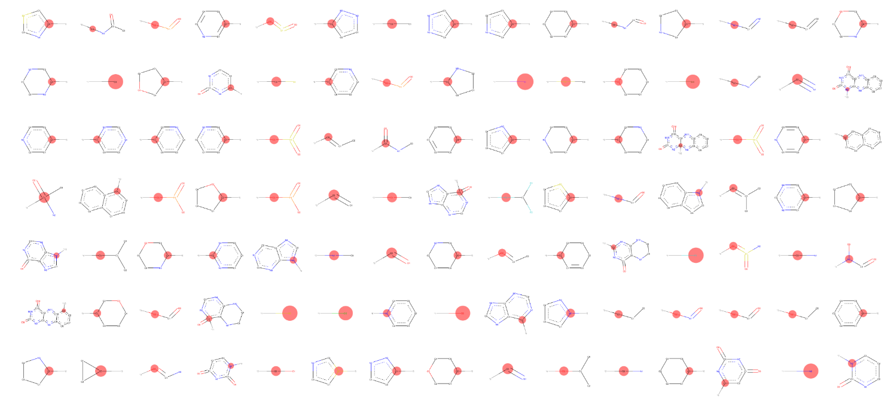
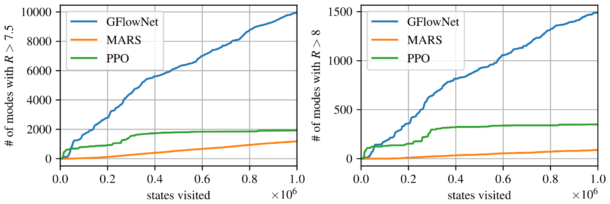

name: gflownets-intro-part2-20250915
class: title, middle

## Probabilistic inference with GFlowNets
### IFT 6760B A25

#### .gray224[September 15th - Session 4]
### .gray224[Introduction to GFlowNets II]

.smaller[.footer[
Slides: [alexhernandezgarcia.github.io/teaching/mlprojects24/slides/{{ name }}](https://alexhernandezgarcia.github.io/teaching/gflownets25/slides/{{ name }})
]]

.center[

]

Alex Hernández-García (he/il/él)

.footer[[alexhernandezgarcia.github.io](https://alexhernandezgarcia.github.io/) | [alex.hernandez-garcia@mila.quebec](mailto:alex.hernandez-garcia@mila.quebec)] | [alexhergar.bsky.social](https://bsky.app/profile/alexhergar.bsky.social)  

---

## Objectives of this session

- Finalise the introduction of GFlowNets:
    - Flow networks
    - Flow matching objective function
    - Overview of basic results

--

The goal is that at the end of the session:
- You will be able to describe what flow networks are.
- You will be able to explain why GFlowNets _work_.
- You will have an intuition of how GFlowNets are trained and what are the basic results on simple problems.

---

## In the previous session...

.references[
Emmanuel Bengio, Moksh Jain, Maksym Korablyov, Doina Precup, Yoshua Bengio. [Flow network based generative models for non-iterative diverse candidate generation](https://arxiv.org/abs/2106.04399). NeurIPS, 2021.
]

- We described the original motivation and context of GFlowNets.
- We established the typical problem setting for GFlowNets.
- We traced connections with energy-based models, sampling (MCMC) methods and reinforcement learning.
- We proved that RL or autoregressive approaches work well when the decomposition of samples has a tree structure.
- But sampling gets biased towards "bigger" objects if multiple trajectories exist for a single sample.

---

## Today

.references[
Emmanuel Bengio, Moksh Jain, Maksym Korablyov, Doina Precup, Yoshua Bengio. [Flow network based generative models for non-iterative diverse candidate generation](https://arxiv.org/abs/2106.04399). NeurIPS, 2021.
]

- We will continue the study of the original paper.
- Introduce flow networks and prove how they can enable sampling in the general DAG case.
- Introduce the flow matching objective function to train GFlowNets.
- Show a set of basic empirical results to demonstrate that GFlowNets work as expectred.

.center[

]

---

## Results
### Hyper-grid

Experiments with a hyper-grid in 4D and length 8 ($8^4 = 4096$ states and samples), where trajectories start in a corner and increment each dimension one by one.

.left-column-33[.center[]]

--

.right-column-66[.center[]]

---

## Results
### Molecules

Experiments with a fragment-based molecular generation task, with a sample space of $10^16$ and between 100 and 2000 actions from each state. The reward $R(x)^{\beta}$ is the binding energy of the molecule with with a target protein.

.center[]

---

## Results
### Molecules

.left-column[.center[]]

--

.right-column[.center[]]

--

.full-width[
.conclusion[GFlowNet samples more unique, high-scoring molecules than baseline MCMC and RL methods. The empirical reward density is higher than that of a reference data set.]
]

---

## Results
### Molecules

.center[]

---

## Results
### Molecules

.center[]

---

## Results
### 2D Grid

.center[]

---

name: title
class: title, middle
count: false

## Probabilistic inference with GFlowNets
### IFT 6760B A25

#### .gray224[September 15th - Session 4]
### .gray224[Introduction to GFlowNets II]

.center[

]

Alex Hernández-García (he/il/él)

.footer[[alexhernandezgarcia.github.io](https://alexhernandezgarcia.github.io/) | [alex.hernandez-garcia@mila.quebec](mailto:alex.hernandez-garcia@mila.quebec)] | [alexhergar.bsky.social](https://bsky.app/profile/alexhergar.bsky.social)  

