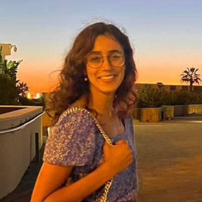

name: introduction-20250904
class: title, middle

## IFT 6760B A25
## Probabilistic inference with GFlowNets

#### .gray224[September 4th - Session 1]
### .gray224[Introduction]

.smaller[.footer[
Slides: [alexhernandezgarcia.github.io/teaching/mlprojects24/slides/{{ name }}](https://alexhernandezgarcia.github.io/teaching/gflownets25/slides/{{ name }})
]]

.center[

]

Alex Hernández-García (he/il/él)

.footer[[alexhernandezgarcia.github.io](https://alexhernandezgarcia.github.io/) | [alex.hernandez-garcia@mila.quebec](mailto:alex.hernandez-garcia@mila.quebec)] | [alexhergar.bsky.social](https://bsky.app/profile/alexhergar.bsky.social)  

???

- Self-introduction:
    - Assistant professor at DIRO since February 2025
    - Core academic member of Mila
    - Postdoc at the UdeM and at Mila with Prof. Yoshua Bengio
    - PhD in Berlin, at the intersection of machine learning, computational neuroscience and cognitive science
    - Now, my research is focused on machine learning research and applications for tackling climate and health challenges.
- Presentation des étudiants: name, studies, auditing or not, why taking the course...

---

## English or French?

This course is offered to graduate students, who make a large international crowd, which is why this course is taught in English.

However:

* [On est au Québec icitte !](https://www.youtube.com/watch?v=4oclkgHvgM8)
* Feel free to ask questions in French, if you prefer.
* Feel free to ask for a translation, if you don't understand something.
* Let me know if you prefer to do your assignments in French.

???

- Spanish, German

---

## Objectives of this session

- Introduce the objectives of the course.
- Present the course outline and topics.
- Describe the timeline, structure and logistics of the sessions.
- Discuss the expectations and evaluation criteria.
- Discuss the expected prerequisites to successfully take this course.
- Introduce high level notions of GFlowNets to introduce the topic (second part).
- Get to know each other!

--

The goal is that at the end of the session:
- You will have an understanding of what to expect during the course.
- You will be in a better position to decide whether you indeed want to take this course.
- You can start thinking of what topics you would like to explore during the course.

---

## Objectives of the course

The objective is that at the end of the course, you will be able to:

- Explain the high-level aspects or intuitions about GFlowNets to someone without specialised background.
- Explain details of the core aspects of GFlowNets to other machine learning practitioners.
- Read critically and productively scientific articles related to GFlowNets.
- Implement GFlowNet components in code and train models for practical applications.
- Connect the main aspects of GFlowNets to other related areas and potentially come up with novel ideas.

---

## Course structure

This is a seminar course consisting of three main blocks:

1. **Lectures** by the instructor and invited speakers
2. **Presentations** by students about relevant papers
3. **Project work** and **presentations** by students

--

.columns-3-left[
.center[.h1[Lectures]]
- Designed to introduce main topics.
- Including coding sessions.
- Probably invited lectures too.
]

--

.columns-3-center[
.center[.h1[Paper presentations]]
- Designed to explore topics in depth.
- Everyone expected to participate in discussions.
]

--

.columns-3-right[
.center[.h1[Project work]]
- Designed to acquire hands-on experience.
- Extending, analysing or reproducing theoretical or practical aspects of GFlowNets.
]

---

## Lectures content

- Introduction and motivation
- Brief review of requisite background
- Main concepts and theoretical results
- Continuous GFlowNets
- Relevant loss functions
- Training guidelines
- Evaluation guidelines
- Connections with diffusion models and variational inference
- Connections with reinforcement learning
- Multi-objective GFlowNets
- Conditional GFlowNets
- Active learning with GFlowNets
- Applications in drug discovery
- Applications in materials discovery

???

- Math content will be moderate.
- Part of the course, including the lectures, will be focused on the implementation and practical aspects of GFlowNets, like training and evaluation.
- In terms of applications, scientific discoveries will receive special attention.

---

## Prerequisites

Formal prerequisites to register for this course:

- [Introduction à la science des données](https://admission.umontreal.ca/cours-et-horaires/cours/ift-3700/) (IFT 3700)
- [Fundamentals of machine learning](https://admission.umontreal.ca/cours-et-horaires/cours/ift-3395/) (IFT 3395/6390).

Recommended courses:

- [Representation learning](https://admission.umontreal.ca/cours-et-horaires/cours/ift-6135/) (IFT 6135)
- [Probabilistic graphical models](https://admission.umontreal.ca/cours-et-horaires/cours/ift-6269/) (IFT 6269)

--

In particular, by taking this course you are expected to be familiar with:
- Linear algebra and calculus
- Probability and statistics
- Machine learning and deep learning basics
- Python: numpy, pandas, PyTorch, etc.

--

.context[A list of resources is available on the [course website](https://alexhernandezgarcia.github.io/teaching/gflownets25/#resources).]

---

## Evaluation criteria

- **Project work**: 40 %
    - Work in teams on research-like projects.
    - Focus on extending, analysing or reproducing theoretical or practical aspects of GFlowNets.
    - Evaluation based on a conference-like paper, presentation _and_ (possibly) personal interviews.
--
- **Paper presentations**: 30 %
    - Presentation of a relevant paper either individually or in small teams, followed by a discussion.
    - Evaluation based on both presentation as well as participation in the discussions.
    - Suggested readings provided in the [bibliography](https://alexhernandezgarcia.github.io/teaching/gflownets25/bibliography)
--
- **Quizzes**: 20 %
    - About the content of the lectures and suggested additional material.
    - To be completed in class, at the beginning of the Thursday lectures.
    - The evaluation will be the average over the 80 % best-graded quizzes.
--
- **Short literature review**: 10 %
    - A literature review on a particular GFlowNet aspect or related topic.
    - Evaluation based on a 1-2 pages report, which may be reused for the project paper too.
    - Basic literature provided in the [bibliography](https://alexhernandezgarcia.github.io/teaching/gflownets25/bibliography)

---

## Schedule and calendar overview

.left-column[
**Days and time of the sessions**:
- Monday, 10:30-12:20 - Mila
- Thursday, 10:30-12:20 - Mila

**Calendar**:
- First session: September 4th, 2025
- Last session: December 8th, 2025
- Days without class:
    - Monday, October 13th, 2025 (congé universitaire, action de grâce)
    - Monday, October 20th, 2025 (période d'activités libres)
    - Thursday, October 23rd, 2025 (période d'activités libres)
]

--

.right-column[
**Tentative plan**
- Lectures until mid-October
- Paper presentations after the _reading week_
- Project presentations during the last few sessions
- Details depend on pending confirmations by invited speakers and number of students and groups
]

???

- Breaks?

---

## Practical information

* .highlight1[Important announcements]: [StudiUM](https://studium.umontreal.ca/course/view.php?id=332667)
* .highlight1[Course website and up to date materials]: [alexhernandezgarcia.github.io/gflownets](https://alexhernandezgarcia.github.io/teaching/gflownets25/)
* .highlight1[Communication with the instructor]: by email: [alejandro.hernandez.garcia@umontreal.ca](mailto:alejandro.hernandez.garcia@umontreal.ca)
    * Please include `[GFlowNet course]` in the email subject.
* .highlight1[Room for the sessions and Zoom link]: on StudiUM or provided directly by the instructor.

--

Additional communication channels:

- Slack on the Mila space?
- Discord?
- Piazza?
- StudiUM?

Vote on [www.menti.com](https://www.menti.com) using the code **7639 3368** or click on:

.center[[menti.com/aliru1fmv2fk](https://www.menti.com/aliru1fmv2fk)]

.qrcode[]

???

- Menti: https://www.mentimeter.com/app/presentation/al1mjg11sptrg3fv3x1y8mkqc9i44mdy/present?question=yu4737qea2rv

---

## Remote attendance

- The course is designed for in-person attendance and participation
    - Lectures may include whiteboard content.
    - The second part of the course focuses on student presentations.
    - Participation is expected and counts towards the evaluation.
- For inclusivity and accessibility, the sessions will also be streamed and recorded via Zoom, but high quality is not guaranteed.
- If you will not be able to attend a significant number of sessions in person, please talk to the instructor.

---

## Auxiliaire d'enseignment (TA)

.center[
<figure style="text-align: center">
	
  <figcaption style="text-align: center">Léna Néhale-Ezzine</figcaption>
</figure>
]

Roles:

* Mentoring during project work (office hours)
* Help with the preparation of quizzes
* Help with the evaluation

---

## Registration for auditing

- Students from the Université de Montréal or Mila are welcome to audit this course as long as there is available classroom space.
- However, for those who can register, university enrolment is highly encourage.
- Auditors are also welcome to participate in some of the course work, but this requires additional work and organisational efforts on the instructors side, and commitment on the auditors side.

.center[Please submit your contact information and intentions for the course:]

.center[[alexhernandezgarcia.github.io/teaching/gflownets25/auditing](https://alexhernandezgarcia.github.io/teaching/gflownets25/auditing)]

.qrcode[]

---

name: title
class: title, middle

## IFT 6760B A25
## Probabilistic inference with GFlowNets

#### .gray224[September 4th - Session 1]
### .gray224[Introduction]

.bigger[.bigger[.highlight1[Questions, doubts, concerns, comments, ...?]]]

.center[

]

Alex Hernández-García (he/il/él)

.footer[[alexhernandezgarcia.github.io](https://alexhernandezgarcia.github.io/) | [alex.hernandez-garcia@mila.quebec](mailto:alex.hernandez-garcia@mila.quebec)] | [alexhergar.bsky.social](https://bsky.app/profile/alexhergar.bsky.social)  

???

Sujets supplémentaires :

- Mentionner que c'est mon premier cours en français à l'UdeM
- Projets de recherche vs projets industriels
- Publications
- Jalons pendant les projets

