name: review-20250908
class: title, middle

## Probabilistic inference with GFlowNets
### IFT 6760B A25

#### .gray224[September 8th - Session 2]
### .gray224[Review of relevant background]

.smaller[.footer[
Slides: [alexhernandezgarcia.github.io/teaching/mlprojects24/slides/{{ name }}](https://alexhernandezgarcia.github.io/teaching/gflownets25/slides/{{ name }})
]]

.center[

]

Alex Hernández-García (he/il/él)

.footer[[alexhernandezgarcia.github.io](https://alexhernandezgarcia.github.io/) | [alex.hernandez-garcia@mila.quebec](mailto:alex.hernandez-garcia@mila.quebec)] | [alexhergar.bsky.social](https://bsky.app/profile/alexhergar.bsky.social)  

---

## Objectives of this session

- Review the topics most relevant to introduce GFlowNets:
    - Generative machine learning
    - Sampling methods
    - Reinforcement learning

--

The goal is that at the end of the session:
- You will have a fresh overview of topics that will come up during the rest of the course.
- You will be able to identify the topics you may want to check or review.
- You will have a access to a set of resources to review this literature.

???

Obviously, all these topics will be covered in a very superficial way.

---

count: false

## Outline

- [Generative machine learning](#generativeml)
- [Sampling methods](#sampling)
- [Reinforcement learning](#reinforcementlearning)

---

count: false

## Outline

- [Generative machine learning](#generativeml)
    - [Energy-based models](#ebm)
    - [Variational autoencoders](#vae)
    - [Normalising flows](#normflows)
    - [Diffusion](#diffusion)
    - [Generative adversarial networks](#gan)
    - [Auto-regressive models](#ar)
- [Sampling methods](#sampling)
    - [Rejection sampling](#rejection)
    - [Importance sampling](#importance)
    - [Markov chains](#markov)
    - [Markov chain Monte Carlo](#mcmc)
    - [Metropolis Hastings](#mh)
- [Reinforcement learning](#reinforcementlearning)

---

count: false
name: generativeml
class: title, middle

## Generative machine learning
### A brief overview

.center[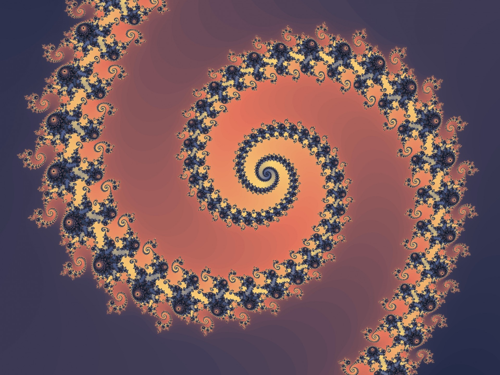]

---

## Generative models

A generative model aims to learn the .h1[probability density function]

$$
p_{\theta}(x), x \in \mathcal{X}
$$

where $x$ are the generated data points in the sample space $\mathcal{X}$, and $\theta$ are the (learnable) parameters of the generative model.

--

This is in contrast with typical supervised, _predictive_ models, which can be seen to learn

$$
p(y|x), x \in \mathcal{X}, y \in \mathcal{Y}
$$

where $y$ are annotations we would like to learn via classification or regression.

---

## Generative models

.references[
Foster. Generative deep learning. O'Reilly Media, Inc., 2022.
]

The typical _generative modelling framework_ is as follows:

- We assume we have a data set of observations $x_1, x_2, \ldots, x_N$.
- We assume these observations have been generated according to an unknown distribution $p_{data}(x)$.
- We set the goal of training a generative model $p_{\theta}(x)$ to mimic the data-generating distribution.
- We see a trained model as successful if:
    - The generated examples appear to have been drawn from $p_{data}(x)$.
    - But they are suitably different from the training data.

---

## Generative models
### Maximum-likelihood estimation

A very common technique to determine the parameters of machine learning models is _maximum likelihood estimation_ (MLE):

- The _likelihood_ of a set of parameters $\theta$ is a function that measures the plausibility of the parameters given a data point $x$: $L(\theta | x) = p_{\theta}(x)$
- Assuming that the observations in the data set $\mathcal{D}$ are independent and identically distributed (i.i.d), then $L(\theta | x) = \prod p_{\theta}(x)$
- In practice, it is better to maximise the log-likelihood:

$$\theta^{\star} = \text{arg max} \sum \log p_{\theta}(x)$$

 
.conclusion[MLE or variations of it are at the core of many generative modelling algorithms.]

---

## Generative models
### Taxonomy

.references[
Murphy. [Probabilistic machine learning: Advanced topics](https://probml.github.io/pml-book/book2.html). MIT press, 2023.
]

Kevin P. Murphy proposes to categorise models according to the following properties:

- .h1[Density]: Does the model support pointwise evaluation of the probability density function $p(x)$? Is the density calculated _exactly_, is it an _approximation_, a _lower bound_? Is the estimation or calculation _fast_ or _slow_?

--
- .h1[Training]: How are the parameters $\theta$ of $p(x)$ estimated? Is it _exact_ MLE, an _approximation_, a _lower bound_, _something else_?

--
- .h1[Sampling]: Does the model support generating new samples $x \sim p(x)$? Is sampling _fast_ or _slow_?

--
- .h1[Latents]: Does the model uses a latent vector $z$ to generate $x$? If so, is the representation of $z$ compressed with respect to $x$?

--
- .h1[Architecture]: What kind of neural network is used? Are there restrictions, such as invertibility?

---

## Generative models
### Taxonomy

.references[
Murphy. [Probabilistic machine learning: Advanced topics](https://probml.github.io/pml-book/book2.html). MIT press, 2023.
]

.center[
<figure>
	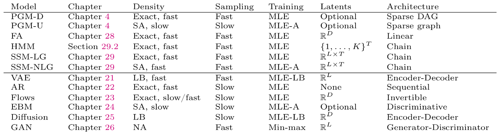
  <figcaption>.smaller[Taxonomy of generative models by Kevin P. Murphy, 2023]</figcaption>
</figure>
]

---

## Generative models
### Taxonomy

.references[
Goodfellow. NIPS 2016 tutorial: Generative adversarial networks. arXiv preprint arXiv:1701.00160, 2017.
]

.center[
<figure>
	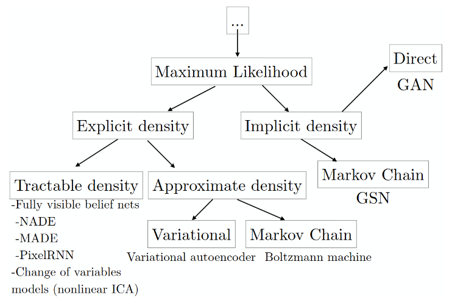
  <figcaption>.smaller[Taxonomy of generative models by Ian Goodfellow, 2017]</figcaption>
</figure>
]

.conclusion[The main taxonomical factors have not changed dramatically from 2017 to 2023.]

---

name: ebm

## Energy-based models (EBM)

.references[
- Murphy, Song and Kingma. [Probabilistic machine learning: Advanced topics](https://probml.github.io/pml-book/book2.html). Chapter 24 - Energy-based models. MIT press, 2023.
- Teh, Welling, Osindero, Hinton. [Energy-based models for sparse overcomplete representations](https://jmlr.org/papers/v4/teh03a.html). JMLR, 2003.
- Lippe. [Tutorial 8: Deep Energy-Based Generative Models](https://uvadlc-notebooks.readthedocs.io/en/latest/tutorial_notebooks/tutorial8/Deep_Energy_Models.html). UvA Deep Learning Tutorials, 2024.
]

Energy-based models are a large class of generative models that rely on the idea that any function $E_{\theta}(x)$ can be turned into a probability distribution by taking the negative exponential and dividing by a normalisation constant:

$$
p_{\theta}(x) = \frac{e^{-E(x)}}{Z},
$$

--

- Advantages: The energy function is not restricted to to specific architectures, as it can be any model that returns a scalar.
- Disadvantages: Calculating the partition function is usually intractable, which imposes the use of approximate methods. Popular approaches involve gradient-based MCMC methods or contrastive divergence.

???

- Write expression of Z on the whiteboard:

Z = \int_{x \in \mathcal{X}} \exp(-E(x))
Z = \sum{x \in \mathcal{X}} \exp(-E(x))

- The exponential ensures a probability larger than zero for any value of the energy
- The negative sign is due to the fact that we consider the function an energy, with lower values assigned higher likelihood and vice versa
- The partition function ensures that the density integrates / sums to 1

---

name: vae

## Variational autoencoders

.references[
- Murphy. [Probabilistic machine learning: Advanced topics](https://probml.github.io/pml-book/book2.html). Chapter 21 - Variational autoencoders. MIT press, 2023.
- Lippe. [Tutorial 9: Deep Autoencoders](https://uvadlc-notebooks.readthedocs.io/en/latest/tutorial_notebooks/tutorial9/AE_CIFAR10.html). UvA Deep Learning Tutorials, 2024.
]

Autoencoders are a class of machine learning models trained to _encode_ input data $x$ as compressed latent representations $z$ via a reconstruction loss, obtained with a _decoder_ network.

.center[
<figure>
	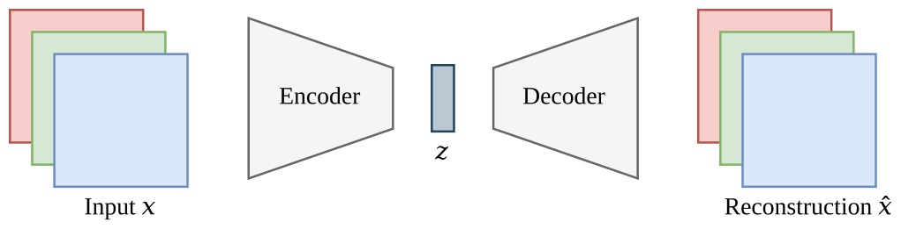
  <figcaption>.smaller[Schematic of autoencoder models, Lippe (2024)]</figcaption>
</figure>
]

--

Variational autoencoders pose the problem of learning the density $p_{\theta}(x)$ as learning the marginal likelihoood over the latent variables $z$:

$$
p(x) = \int_{z} p(x, z) dz = \int p(x|z)p(z)dz
$$

---

## Variational autoencoders

.references[
Murphy. [Probabilistic machine learning: Advanced topics](https://probml.github.io/pml-book/book2.html). Chapter 21 - Variational autoencoders. MIT press, 2023.
]

We can see the variational autoencoder as a probabilistic version of the deterministic autoencoder:

.center[
<figure>
	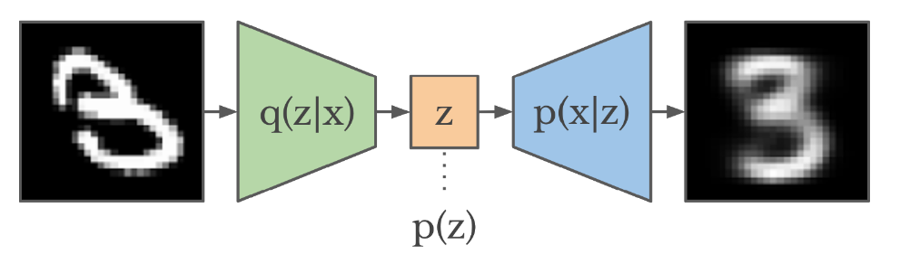
  <figcaption>.smaller[Schematic of a variational autoencoder (VAE). Image credit: Murphy (2023) and Hafner (2018)]</figcaption>
</figure>
]

- $p_{\theta}(z)$ is usually a Gaussian
- $p_{\theta}(x|z)$ is usually a product of exponential family distributions (Gaussians, Bernoullis...)
- VAEs typically perform .h1[amortised inference] by training additionally a
_inference network_: $q_{\phi}(z|x) = q(z|e(x)) \approx p(z|x)$, where $e(x)$ is an encoder network, parametrised as a Gaussian.
- $p_{\theta}(x)$ is still intractable, but we can use the approximate posterior $q(z|x)$ from the inference network to obtain a lower bound of the marginal log-likelihood (evidence lower bound or ELBO).

---

name: normflows

## Normalising flows

.references[
- Jimenez Rezende and Mohamed. [Variational Inference with Normalizing Flows](https://arxiv.org/abs/1505.05770). ICML, 2015 .
- Kobyzev, Prince and Brubaker. [Normalizing flows: an introduction and review of current methods](https://arxiv.org/abs/1908.09257). IEEE TPAMI, 2020.
- Papamakarios and Lakshminarayanan. [Probabilistic machine learning: Advanced topics](https://probml.github.io/pml-book/book2.html). Chapter 23 - Normalizing flows. MIT press, 2023.
]

Normalising flows are a class of generative models that rely on the idea of modelling complex distributions $p(x)$ by means of passing random variables $z \in \R^D$ drawn from a known and tractable distribution $p(z)$ through an _invertible_ function $f: \R^D \rightarrow \R^D$, such that $x = f(z)$, with $z \sim p(z)$.

--

A core idea is that expressive functions can yield complex distributions even if the base distribution $p(z)$ is simple.

--

The density $p(x)$ can be obtained thanks to the invertibility of $f$:
- Let $g(x) = f^{-1}(x) = z$ be the inverse mapping.
- The likelihood of $x$ is then: $p_x(x) = p_z(g(x))|\det J(g)(x)| = p_z(z)|\det J(f)(z)|^{-1}$
- And the log-likelihood: $\log p_x(x) = \log p_z(g(x)) - \log|\det J(f)(z)|$

---

name: normflows

## Normalising flows

.references[
- Jimenez Rezende and Mohamed. [Variational Inference with Normalizing Flows](https://arxiv.org/abs/1505.05770). ICML, 2015 .
- Kobyzev, Prince and Brubaker. [Normalizing flows: an introduction and review of current methods](https://arxiv.org/abs/1908.09257). IEEE TPAMI, 2020.
- Papamakarios and Lakshminarayanan. [Probabilistic machine learning: Advanced topics](https://probml.github.io/pml-book/book2.html). Chapter 23 - Normalizing flows. MIT press, 2023.
]

Normalising flows are a class of generative models that rely on the idea of modelling complex distributions $p(x)$ by means of passing random variables $z \in \R^D$ drawn from a known and tractable distribution $p(z)$ through an _invertible_ function $f: \R^D \rightarrow \R^D$, such that $x = f(z)$, with $z \sim p(z)$.

Normalising flows models typically use a stack of invertible functions, such as a multi-layer perceptron.

.center[
<figure>
	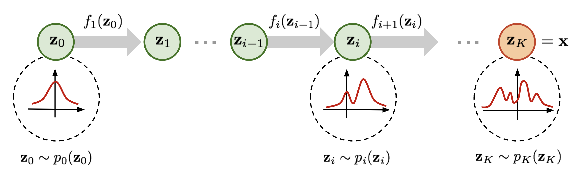
  <figcaption>.smaller[Schematic of normalizing flows with a stack of invertible functions. Image credit: [Weng (2018)](https://lilianweng.github.io/posts/2018-10-13-flow-models/)]</figcaption>
</figure>
]

---

name: diffusion

## Diffusion

Diffusion models are a class of generative models that establish a _diffusion process_ to gradually convert data into noise, to then learn the _reverse process_.

.center[
<figure>
	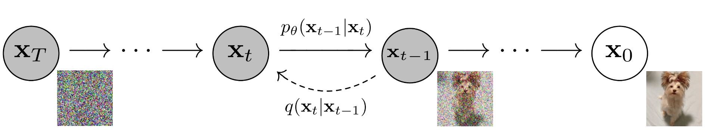
  <figcaption>.smaller[Schematic of a diffusion model. Adapted from [Ho et al. (2020)](https://arxiv.org/abs/2006.11239)]</figcaption>
</figure>
]

--

- Data $x_0$ are gradually converted into noise $x_T$ through $T$ steps of a Gaussian stochastic encoder $q$.
- A decoder $p_{\theta}$ is trained to perform the reverse process.
- Diffusion models are (deep, hierarchical) [VAEs](#vae), but the specific [Markov decomposition](#markov) of the processes and the fixed Gaussian encoder offer favourable properties.

.left-column[.center[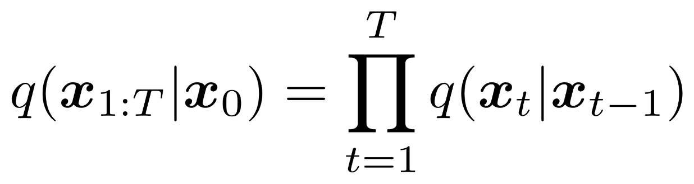]]

.right-column[.center[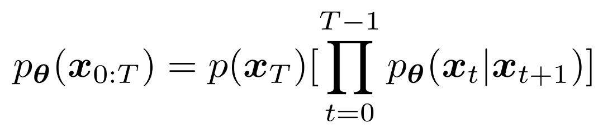]]

---

## Diffusion

.references[
Murphy. [Probabilistic machine learning: Advanced topics](https://probml.github.io/pml-book/book2.html). Chapter 25 - Diffusion models. MIT press, 2023.
]

- Ideally, for each step, the decoder $p(x_s|x_t)$ would match the encoder $q(x_s|x_t, x_0)$, but this is intractable.
- As with other hierarchical variational autoencoders, diffusion performs approximate inference by maximising a hierarchical ELBO.

--

After a bunch of math...

.center[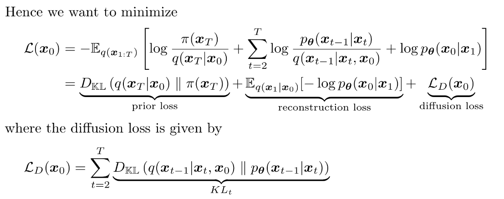]

???

- The prior loss term is a constant.
- The diffusion loss can be optimized using the reparameterization trick.

---

## Diffusion

.center[
<figure>
	
  <figcaption>.smaller[Schematic of a diffusion model. Adapted from [Ho et al. (2020)](https://arxiv.org/abs/2006.11239)]</figcaption>
</figure>
]

Two magic properties that make training diffusion models more efficient than VAEs:

- .h1[Simulation-free training]: we can get intermediate steps $x_t$ directly from $x_0$ (data), without simulating the steps in between.
- Rao-Blackwellised denoising objective: We can estimate the .h1[gradient using just $x_0$ (data) and an intermediate step $x_t$].

.references[
Credit to  [Kolya Malkin](https://malkin1729.github.io/)'s wonderful slides.
]

---

name: gan

## Generative adversarial networks (GAN)

.references[
Goodfellow et al. [Generative Adversarial Nets](https://arxiv.org/abs/1406.2661). NeurIPS, 2014.
]

Generative adversarial networks consist of two models, .h1[generator] ($G$) and .h1[discriminator] ($D$), playing a minimax game with value function $V(G, D)$:  The generator is trained to generate samples from the data distribution, while the discriminator is trained to classify samples as real or generated. A loss function establishes the minimax game to simultaneously train both models.

.center[
<figure>
	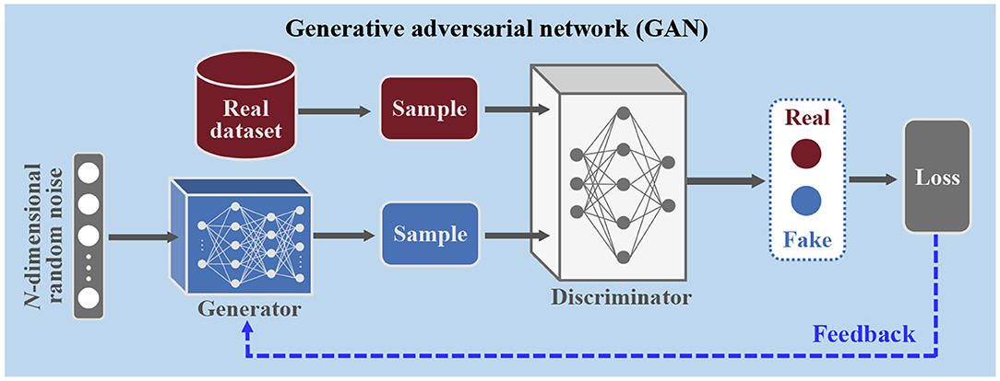
  <figcaption>.smaller[Schematic of a generative adversarial network (GAN). Image credit: [Wang and Zhang (2021)](https://www.frontiersin.org/journals/communications-and-networks/articles/10.3389/frcmn.2021.656786/full)]</figcaption>
</figure>
]

---

## Generative adversarial networks (GAN)

.references[
Goodfellow et al. [Generative Adversarial Nets](https://arxiv.org/abs/1406.2661). NeurIPS, 2014.
]

.center[
<figure>
	
  <figcaption>.smaller[Schematic of a generative adversarial network (GAN). Image credit: [Wang and Zhang (2021)](https://www.frontiersin.org/journals/communications-and-networks/articles/10.3389/frcmn.2021.656786/full)]</figcaption>
</figure>
]

- Generator: a network $G_{\theta}(z)$ which maps noise variables $z$ from a prior distribution onto data $x$.
- Discriminator: a network $D_{\phi}(x)$ which outputs a single scalar representing the probability that $x$ came from the data rather than from the generator.
- The discriminator is trained to maximise the classification accuracy and the generator is trained to minimise $\log(1 - D(G(z)))$.

.center[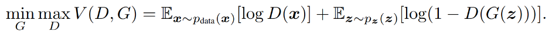]

???

Questions: what is different in GANs with respect to the previous generative models?

---

## Generative adversarial networks (GAN)

.references[
Rosca, Mohamed and Lakshminarayanan. [Probabilistic machine learning: Advanced topics](https://probml.github.io/pml-book/book2.html). Chapter 26 - Generative adversarial networks. MIT press, 2023.
]

.center[
<figure>
	
  <figcaption>.smaller[Schematic of a generative adversarial network (GAN). Image credit: [Wang and Zhang (2021)](https://www.frontiersin.org/journals/communications-and-networks/articles/10.3389/frcmn.2021.656786/full)]</figcaption>
</figure>
]

- GANs do not specify an explicit log-likelihood function $\log_{\theta}(x)$.
- This is called .h1[likelihood-free inference] or .h1[simulation-based inference], as the learning procedure relies on comparing real and simulated data. 

---

name: ar

## Auto-regressive models

.references[
Murphy. [Probabilistic machine learning: Advanced topics](https://probml.github.io/pml-book/book2.html). Chapter 22 - Auto-regressive models. MIT press, 2023.
]

Auto-regressive models are based on the observation that any joint distribution over $T$ variables can be decomposed into a product of conditional probabilities by the chain rule:

.center[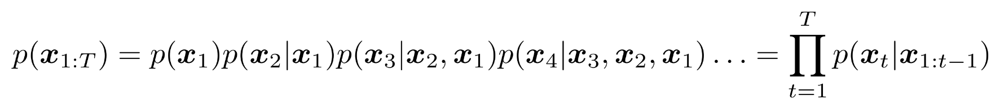]

This corresponds to a fully connected DAG, in which each node depends on all its predecessors.

.center[
<figure>
	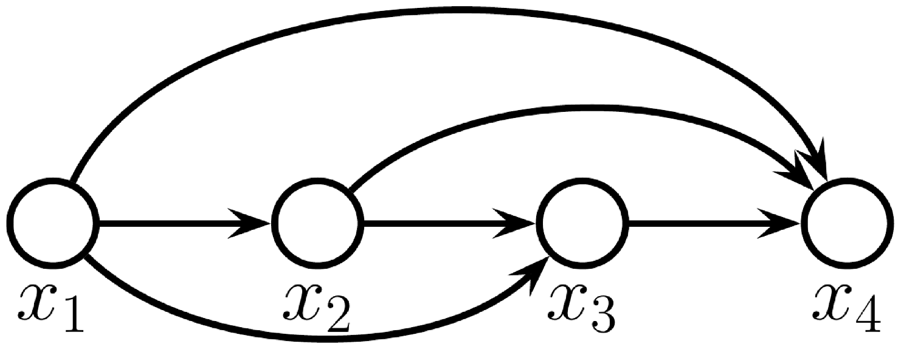
  <figcaption>.smaller[Schematic of an auto-regressive, fully connected model. Image credit: [Murphy (2023)](https://probml.github.io/pml-book/book2.html)]</figcaption>
</figure>
]

---

## Auto-regressive models

.references[
Murphy. [Probabilistic machine learning: Advanced topics](https://probml.github.io/pml-book/book2.html). Chapter 22 - Auto-regressive models. MIT press, 2023.
]

.center[
<figure>
	
  <figcaption>.smaller[Schematic of an auto-regressive, fully connected model. Image credit: [Murphy (2023)](https://probml.github.io/pml-book/book2.html)]</figcaption>
</figure>
]

- Auto-regressive models learn allow for the calculation of the exact likelihood of each sequence.
- However, each term in the decomposition becomes more complex than the previous one, which can be slow to compute.
- A common way to reduce the complexity is to use the [Markov assumption](#markov).

---

## Summary of generative models

.center[
<figure>
	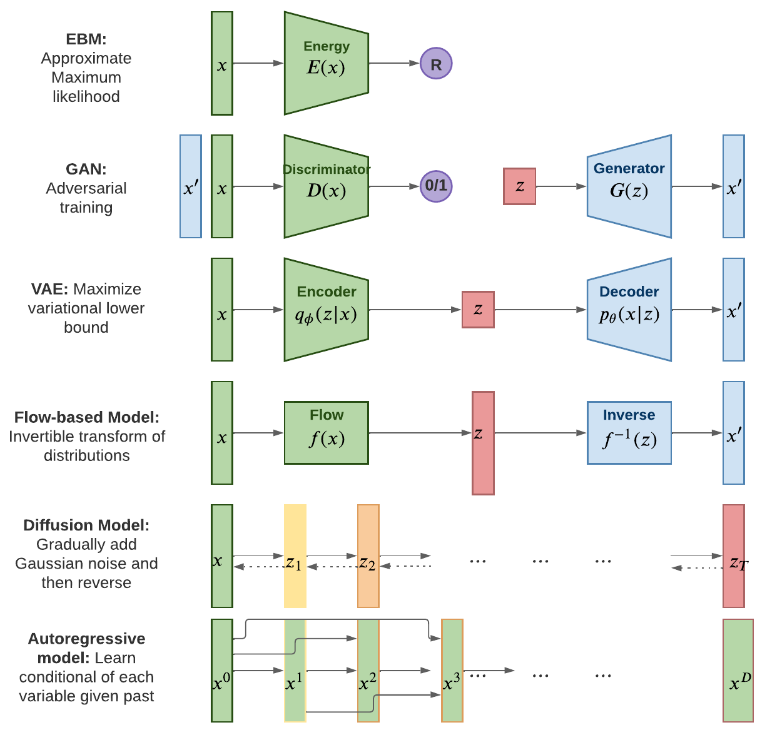
  <figcaption>.smaller[Summary of generative models by [Kevin P. Murphy, 2023](https://probml.github.io/pml-book/book2.html)]</figcaption>
</figure>
]

???

Questions?

---

name: title
class: title, middle
count: false

## Probabilistic inference with GFlowNets
### IFT 6760B A25

#### .gray224[September 8th - Session 2]
### .gray224[Review of relevant background]

.bigger[.bigger[.highlight1[Break!]]]

.center[

]

Alex Hernández-García (he/il/él)

.footer[[alexhernandezgarcia.github.io](https://alexhernandezgarcia.github.io/) | [alex.hernandez-garcia@mila.quebec](mailto:alex.hernandez-garcia@mila.quebec)] | [alexhergar.bsky.social](https://bsky.app/profile/alexhergar.bsky.social)  

---

count: false
name: sampling
class: title, middle

## Sampling methods
### A shallow approach

.center[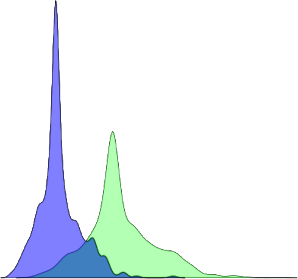]

---

## Sampling and Monte Carlo methods
### Introduction

- Monte Carlo methods are a broad class of algorithms than rely on repeated random sampling to obtain numerical results.
- Sampling plays a crucial role in machine learning as it provides a way to approximate intractable sums and integrals.`
- Sometimes, sampling is a goal in itself, as we may want to draw samples from a target distribution.

.center[
<figure>
	
  <figcaption>.smaller[Estimation of $\pi$ by sampling. Image credit: [Wikipedia](https://en.wikipedia.org/wiki/Monte_Carlo_method#/media/File:Pi_monte_carlo_all.gif)]</figcaption>
</figure>
]

???

- Draw a square, then inscribe a quadrant within it.
- Uniformly scatter a given number of points over the square.
- Count the number of points inside the quadrant, i.e. having a distance from the origin of less than 1.
- The ratio of the inside-count and the total-sample-count is an estimate of the ratio of the two areas, π/4. Multiply the result by 4 to estimate π.

---

name: rejection

## Rejection sampling

.references[
Schmidt. [Rejection/Importance Sampling](https://www.cs.ubc.ca/~schmidtm/Courses/540-W20/L30.pdf). CPSC 540: Machine Learning, 2020.
]

Rejection sampling is one of the simplest methods to sample from an unknown distribution $p(x)$, provided we can evaluate an unnormalised function $f(x)$:

$$
p(x) = \frac{f(x)}{Z}
$$

--

.left-column[
#### Conditions:

1. We can evaluate $f(x)$
2. We can sample from (easier) distribution $q(x)$
3. We can set an upper bound $M$ on $\frac{f(x)}{q(x)}$.
]

--

.right-column[
#### Algorithm:

1. Sample $x$ from $q(x)$
2. Sample $u$ from $\mathcal{U}(0, 1)$
3. Keep the sample if $u \leq \frac{f(x)}{Mq(x)}$
4. Accepted samples are from $p(x)$
]

---

## Rejection sampling

.center[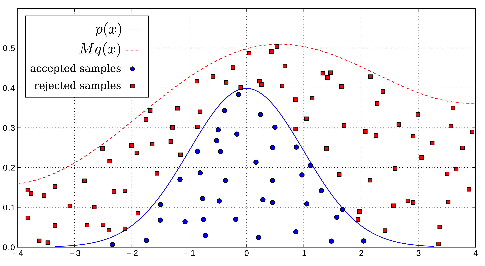]

???

Disadvantages:

- A large number of samples may be rejected
- Especially in high-dimensional distributions
- Need to know M

---

name: importance

## Importance sampling

.references[
- Schmidt. [Rejection/Importance Sampling](https://www.cs.ubc.ca/~schmidtm/Courses/540-W20/L30.pdf). CPSC 540: Machine Learning, 2020.
- Goodfellow, Bengio, Courville. [Deep learning](https://www.deeplearningbook.org/contents/monte_carlo.html). Chapter 17 - Monte Carlo Methods. Cambridge: MIT press, 2016.
]

Importance sampling is sampling method to approximate expectations:

$$
\mathbb{E}_p[f(x)] = \sum_x p(x)f(x) = s
$$

--

We can approximate $s$ by drawing samples from $p$ and computing the empirical average:

$$
\hat{s}_n = \frac{1}{n}\sum_i f(x^i)
$$

--

The typical problem is that we cannot sample directly from $p$. Instead, we can sample from an alternative _proposal_ distribution $q$ and obtain

$$
p(x)f(x) = q(x)\frac{p(x)f(x)}{q(x)}
$$

???

With this, we can sample from q and average pf/q to obtain the average pf.

---

## Rejection and importance sampling
### Limitations

- Both rejection sampling and importance sampling work well in low dimensions, under certain conditions and with some additional tricks.
- However, both struggle in higher dimensions:
	- Rejection sampling tends to reject too many samples.
	- Importance sampling tends to have high variance.

---

name: markov

## Markov chains

.references[
Schmidt. [Rejection/Importance Sampling](https://www.cs.ubc.ca/~schmidtm/Courses/540-W20/L30.pdf). CPSC 540: Machine Learning, 2020.
]

A Markov chain or Markov process is a stochastic process in which the probability of transitioning to the next state depends only on the current state (.h1[Markov property]).

.center[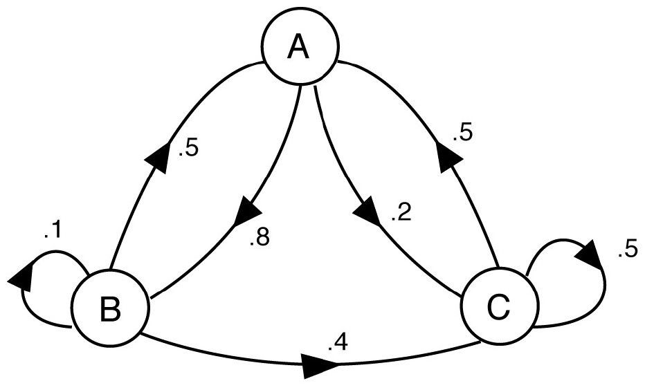]

--

For density estimations, the Markov property can be defined as follows:

.center[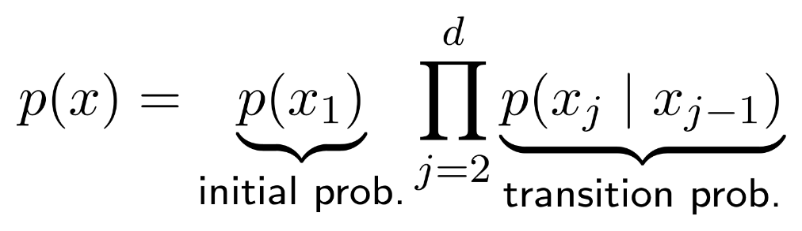]

???

Fun: https://setosa.io/ev/markov-chains/
Mark Schmidt: https://www.cs.ubc.ca/~schmidtm/Courses/540-W20/L11.pdf

Markov decision processes: https://en.wikipedia.org/wiki/Markov_decision_process

---

name: mcmc

## Markov chain Monte Carlo (MCMC)

Some limitations of rejection sampling and importance sampling in high dimensions can be overcome by Markov chain Monte Carlo, considered one of the most important algorithms of the 20th century.

The core idea is to construct a Markov chain in a state space $\mathcal{X}$ whose stationary distribution is the target density $p(x)$: the fraction of time spent in each state $x$ is proportional to $p(x)$.

--

The Markov chain is defined by a random state $x$ and a transition distribution $q(x'|x)$, known as the _proposal distribution_.

---

name: mh

## Metropolis Hastings algorithm

.references[
Murphy. [Probabilistic machine learning: Advanced topics](https://probml.github.io/pml-book/book2.html). Chapter 12 - Markov Chain Monte Carlo inference. MIT press, 2023.
]

.context[Probably the most common MCMC algorithm.]

The basic idea is to transition from $x$ to $x'$ with probability $q(x'|x)$ and accept or reject the move according to a rule which depends on the unnormalised density $f(x)$.

--

#### Algorithm

Initialize $x$ and then iterate as follows:
1. Sample $x' \sim q(x'|x)$
2. Compute acceptance probability: $\alpha = \frac{f(x')q(x|x')}{f(x)q(x'|x)}$
3. Compute acceptance rule: $A = \min(1, \alpha)$
4. Sample $u \sim \mathcal{U}(0, 1)$
5. Move to $x'$ if $u \leq A$, otherwise stay in $x$.

???

The Markov chain needs to be reversible: detailed balance conditions must be satisfied:
p(x'|x)p∗ (x) = p(x|x0 )p∗ (x0 )

---

## Metropolis Hastings algorithm

.references[
Murphy. [Probabilistic machine learning: Advanced topics](https://probml.github.io/pml-book/book2.html). Chapter 12 - Markov Chain Monte Carlo inference. MIT press, 2023.
]

.context[Probably the most common MCMC algorithm.]

.center[
<figure>
	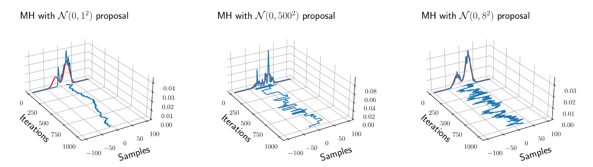
  <figcaption>.smaller[Example of the Metropolis Hastings algorithm to sample from a mixture of two 1D Gaussians. Image credit: [Murphy (2023)](https://probml.github.io/pml-book/book2.html)]</figcaption>
</figure>
]

- A proposal with too low variance (left) can get stuck around the starting mode.
- A proposal with too high variance (middle) yields a _sticky_ chain with high rejection rate.
- The proposal on the right is able to fit well the target distribution.

???

More examples and references:

- https://www.cs.ubc.ca/~arnaud/stat535/slides10.pdf
- https://www.cs.ubc.ca/~schmidtm/Courses/540-W20/L31.pdf
- https://bookdown.org/rdpeng/advstatcomp/metropolis-hastings.html
- https://people.csail.mit.edu/ddeford/MCMC_Intro.pdf
- https://groups.seas.harvard.edu/courses/cs281/papers/roberts-rosenthal-2003.pdf

---

count: false
name: reinforcementlearning
class: title, middle

## Reinforcement learning
### A quick introduction

.center[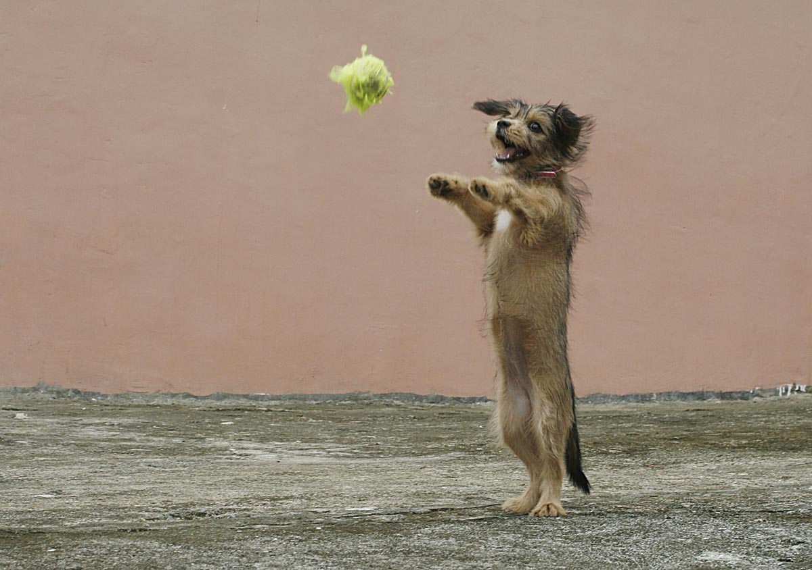]

---

## Reinforcement learning

Reinforcement learning (RL) is a modality of machine learning and optimal control to determine how agents should take actions in a dynamic environment in order to maximize a reward signal. 

.center[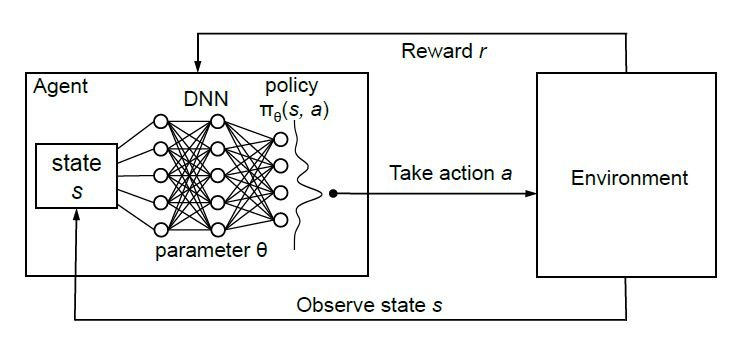]

???

How is this related to what we have seen before?

---

## Markov decision processes

A Markov decision process (MDP) is a model for sequential decision making under uncertainty. MDPs are governed by the Markov property and consist of 4-tuples $(S, A, P_a, R_a)$: states, actions, transition probabilities and rewards.

.center[
<figure>
	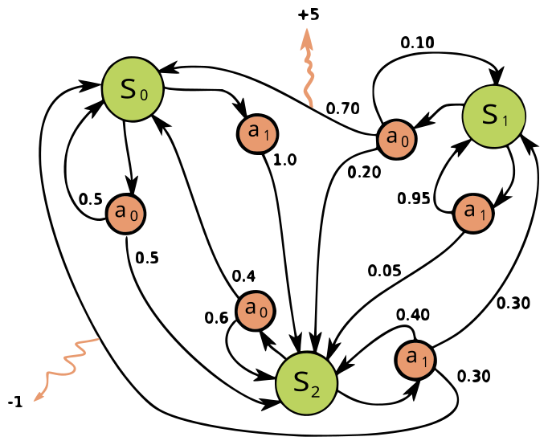
  <figcaption>.smaller[A Markov decision process with three states, two actions and two rewards (orange arrows). Image credit: [waldoalvarez](https://en.wikipedia.org/wiki/Markov_decision_process#/media/File:Markov_Decision_Process.svg)]</figcaption>
</figure>
]

---

## Reinforcement learning as an MDP

RL is often modelled as a Markov decision process:
- At time state $t$, an agent is in state $s_t$.
- The agent takes action $a$, receives a reward $r$ and transitions to state $s_{t+1}$.
- The transition is governed by th environment dynamics $p(s_{t+1}|s_t, a)$.

--

The goal of the agent is to learn a policy $\pi(a|s)$ that maximizes the expected reward.

---

## One trial or trajectory

- $t = 0$, $s_0$, $a_0$, $\pi(a_0|s_0)$, $r_0$
- $t = 1$, $s_1$, $a_1$, $\pi(a_1|s_1)$, $r_1$, $p(s_1|s_0, a_0)$
- $t = 2$, $s_2$, $a_2$, $\pi(a_2|s_2)$, $r_2$, $p(s_2|s_1, a_1)$
- $\cdots$

The probability of trajectory $\tau$:

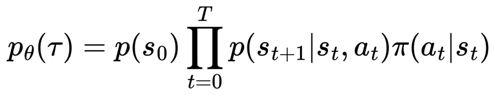

--

.left-column[The return (discounted reward) of trajectory $\tau$:

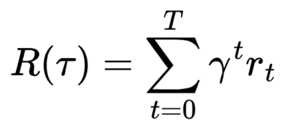
]

--

.right-column[The objective function:

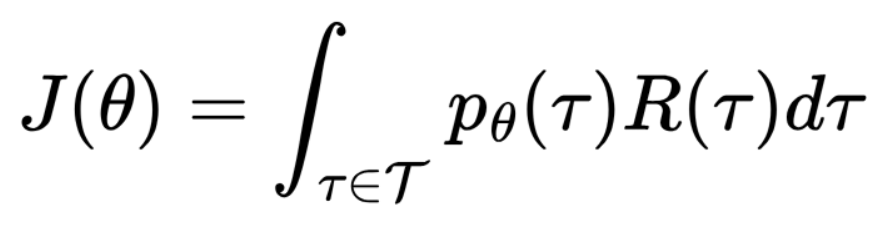
]

???

Question: there is a typo, where?

---

## Value functions

The state-value function $V_{\pi}(s)$ is model of the future reward, defined as the expected discounted reward obtained by starting from state $s$ and following the policy $\pi$: how good is it to be in state $s$.

.center[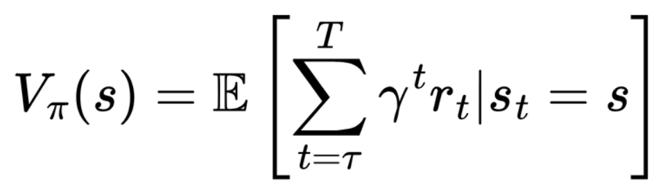]

---

name: title
class: title, middle
count: false

## Probabilistic inference with GFlowNets
### IFT 6760B A25

#### .gray224[September 8th - Session 2]
### .gray224[Review of relevant background]

.bigger[.bigger[.highlight1[Questions?]]]

.center[

]

Alex Hernández-García (he/il/él)

.footer[[alexhernandezgarcia.github.io](https://alexhernandezgarcia.github.io/) | [alex.hernandez-garcia@mila.quebec](mailto:alex.hernandez-garcia@mila.quebec)] | [alexhergar.bsky.social](https://bsky.app/profile/alexhergar.bsky.social)  

