name: introduction-20260831
class: title, middle

## GFlowNets: Sampling as sequential decision making
### IFT 6760B A26

#### .gray224[August 31st - Session 1]
### .gray224[Introduction]

.smaller[.footer[
Slides: [alexhernandezgarcia.com/teaching/gflownets26/slides/{{ name }}](https://alexhernandezgarcia.com/teaching/gflownets26/slides/{{ name }})
]]

.center[

]

Alex Hernández-García (he/il/él)

.footer[[alexhernandezgarcia.com](https://alexhernandezgarcia.com/) | [alejandro.hernandez.garcia@umontreal.ca](mailto:alex.hernandez-garcia@mila.quebec)] | [alexhergar.bsky.social](https://bsky.app/profile/alexhergar.bsky.social)  

???

- Self-introduction:
    - Assistant professor at DIRO since February 2025
    - Core academic member of Mila
    - Postdoc at the UdeM and at Mila with Prof. Yoshua Bengio
    - PhD in Berlin, at the intersection of machine learning, computational neuroscience and cognitive science
    - Now, my research is focused on machine learning research and applications for tackling climate and health challenges.
- Presentation des étudiants: name, studies, auditing or not, why taking the course...

---

## English or French?

This course is offered to graduate students, who make a large international crowd, which is why this course is taught in English.

However:

* [On est au Québec icitte !](https://www.youtube.com/watch?v=4oclkgHvgM8)
* Feel free to ask questions in French, if you prefer.
* Feel free to ask for a translation, if you don't understand something.
* Let me know if you prefer to do your assignments in French.

???

- Spanish, German

---

## Objectives of this session

- Introduce the objectives of the course.
- Present the course outline and topics.
- Describe the timeline, structure and logistics of the sessions.
- Discuss the expectations and evaluation criteria.
- Discuss the expected prerequisites to successfully take this course.
- Introduce high level notions of GFlowNets to introduce the topic (second part).
- Get to know each other!

--

The goal is that at the end of the session:
- You will have an understanding of what to expect during the course.
- You will be in a better position to decide whether you indeed want to take this course.
- You can start thinking of what topics you would like to explore during the course.

---

## Objectives of the course

The objective is that at the end of the course, you will be able to:

- Explain the high-level aspects or intuitions about GFlowNets to someone without specialised background.
- Explain details of the core aspects of GFlowNets to other machine learning practitioners.
- Read critically and productively scientific articles related to GFlowNets.
- Implement GFlowNet components in code and train models for practical applications.
- Connect the main aspects of GFlowNets to other related areas and potentially come up with novel ideas.

---

## Objectives... for you!

I am curious to know:
- Why have you chosen this course?
- What do you expect from this?
- How familiar you are with GFlowNets yet?

Vote on [www.menti.com](https://www.menti.com) using the code **8239 4675** or click on:

.center[[menti.com/alwfsud4uvwa](https://www.menti.com/alwfsud4uvwa)]

.qrcode[]

???

- Menti: https://www.mentimeter.com/app/presentation/alfxobs4qz9ck83v2dq1z3ki38ozhi6u/present?question=1sd2n8vcvn1o

---

## Practical information

* .highlight1[Important announcements]: [StudiUM](https://studium.umontreal.ca/course/view.php?id=332667)
* .highlight1[Course website and up to date materials]: [alexhernandezgarcia.com/gflownets](https://alexhernandezgarcia.com/teaching/gflownets26/)
* .highlight1[Communication with the instructor]:
    - By email: [alejandro.hernandez.garcia@umontreal.ca](mailto:alejandro.hernandez.garcia@umontreal.ca)
    - No communication about the course on Mila's Slack please
    - **Important**: include `[GFlowNet course]` in the email subject. For example: [GFlowNet course] Doubts about last quiz
* .highlight1[Room for the sessions and Zoom link]: on StudiUM or provided directly by the instructor.

--

Additional communication channels:

- StudiUM?
- Discord?
- Piazza?

---

## Course structure

This is a seminar course consisting of three main blocks:

1. **Lectures** by the instructor and invited speakers
2. **Presentations** by students about relevant papers
3. **Project work** and **presentations** by students

--

.columns-3-left[
.center[.h1[Lectures]]
- Designed to introduce main topics.
- Including coding sessions.
- Probably invited lectures too.
]

--

.columns-3-center[
.center[.h1[Paper presentations]]
- Designed to explore topics in depth.
- Everyone expected to participate in discussions.
]

--

.columns-3-right[
.center[.h1[Project work]]
- Designed to acquire hands-on experience.
- Extending, analysing or reproducing theoretical or practical aspects of GFlowNets.
]

---

## Lectures content

- Introduction and motivation
- Brief review of requisite background
- Context and original formulation of GFlowNets
- Main concepts and theoretical results
- Modern mathematical re-formulations
- Relevant loss functions
- Continuous GFlowNets
- Training and evaluation guidelines
- Connections with reinforcement learning
- Connections with diffusion models and variational inference
- Multi-objective GFlowNets
- Conditional GFlowNets
- Active learning with GFlowNets
- Applications in drug discovery and materials discovery

???

- Math content will be moderate.
- Part of the course, including the lectures, will be focused on the implementation and practical aspects of GFlowNets, like training and evaluation.
- In terms of applications, scientific discoveries will receive special attention.

---

## Prerequisites

Formal prerequisites to register for this course:

- [Introduction à la science des données](https://admission.umontreal.ca/cours-et-horaires/cours/ift-3700/) (IFT 3700)
- [Fundamentals of machine learning](https://admission.umontreal.ca/cours-et-horaires/cours/ift-3395/) (IFT 3395/6390).

Recommended courses:

- [Representation learning](https://admission.umontreal.ca/cours-et-horaires/cours/ift-6135/) (IFT 6135)
- [Probabilistic graphical models](https://admission.umontreal.ca/cours-et-horaires/cours/ift-6269/) (IFT 6269)

--

In particular, by taking this course you are expected to be familiar with:
- Linear algebra and calculus
- Probability and statistics
- Machine learning and deep learning basics
- Python: numpy, pandas, PyTorch, etc.

--

.context[A list of resources is available on the [course website](https://alexhernandezgarcia.com/teaching/gflownets26/#resources).]

---

## Evaluation criteria

- **Project work**: 30 %
    - Work in teams on research-like projects.
    - Focus on extending, analysing or reproducing theoretical or practical aspects of GFlowNets.
    - Evaluation based on a conference-like paper, presentation _and_ personal or group interviews.
--
- **Paper presentations**: 30 %
    - Presentation of a relevant paper either individually or in small teams, followed by a discussion.
    - Evaluation based on both presentation as well as participation in the discussions.
    - Suggested readings provided in the [bibliography](https://alexhernandezgarcia.com/teaching/gflownets26/bibliography)
--
- **Quizzes**: 30 %
    - About the content of the lectures and suggested additional material.
    - To be completed in class, at the beginning of some lectures (about 5 quizzes in total).
    - The evaluation will be the average over the best-graded quizzes (two will be discarded).
--
- **Short literature review**: 10 %
    - A literature review on a particular GFlowNet aspect or related topic.
    - Evaluation based on a 1-2 pages report, which may be reused for the project paper too.
    - Basic literature provided in the [bibliography](https://alexhernandezgarcia.com/teaching/gflownets26/bibliography)

???

There may be optional coding assignments to gain extra points.

---

## Policy about the use of AI agents and chatbots

The use of AI agents, assistants and chatbots is generally discouraged for the development of the course work, and it is explicitly **not allowed for certain tasks such as generating the text of the written assignments and non-negligible amounts of code**.

.references[[Details of the policy on the course website](https://alexhernandezgarcia.com/teaching/gflownets26/ai-policy)]

--

- The use of LLM chatbots, AI agents and coding assistants is generally _discouraged_ in this course, as it may be detrimental to the learning objectives.
- For all the writing assignments, especially the final report, it is explicitly _not allowed_ to generate text with LLM chatbots or AI agents. All the text must be written by you. Spell-checking tools are allowed.
- For coding assignments, especially the final project, it is _not allowed_ to use coding agents and the generation of large amounts of code from scratch. The use of chatbots is allowed as support and for the generation of small pieces of code.
- The use of chatbots for the generation of new ideas and brainstorming is explicitly discouraged.
- All uses of LLM chatbots, AI agents, and coding assistants must be disclosed and described in the final report, in a separate section titled "Disclosure of the use of AI-based tools".
- The violation of this policy may imply failing the course.

---

## Schedule and calendar overview

**Days and time of the sessions**:
- Monday, 15:30-17:15 - Mila
- Thursday, 10:30-12:15 - Mila

[**Calendar**](https://alexhernandezgarcia.com/teaching/gflownets26/calendar):
- First session: Monday, August 31st, 2026
- Last session: Monday, December 7th, 2026
- Days without class:
    - Monday, September 7th, 2026 (holiday, Labour day)
    - Monday, October 5th, 2026 (elections day)
    - Monday, October 12th, 2026 (holiday, Thanksgiving)
    - Monday, October 19th, 2026 (période d'activités libres)
    - Thursday, October 22nd, 2026 (période d'activités libres)

---

count: false

## Schedule and calendar overview

**Tentative plan**
- Lectures until mid-October
- Paper presentations after the _reading week_
- Project presentations during the last few sessions
- Details depend on pending confirmations by invited speakers and number of students and groups

???

- Breaks?

---

## Remote attendance

- The course is designed for in-person attendance and participation
    - Lectures may include whiteboard content.
    - The second part of the course focuses on student presentations.
    - Participation is expected and counts towards the evaluation.
- For inclusivity and accessibility, the sessions will also be streamed and recorded via Zoom, but high quality is not guaranteed.
- If you will not be able to attend a significant number of sessions in person, please talk to the instructor.

---

## Registration for auditing

- Students from the Université de Montréal or Mila are welcome to audit this course as long as there is available classroom space.
- However, for those who can register, university enrolment is highly encourage.
- Auditors are also welcome to participate in some of the course work, but this requires additional work and organisational efforts on the instructors side, and commitment on the auditors side.

.center[Please submit your contact information and intentions for the course:]

.center[[alexhernandezgarcia.com/teaching/gflownets26/auditing](https://alexhernandezgarcia.com/teaching/gflownets26/auditing)]

.qrcode[]

---

name: title
class: title, middle

## GFlowNets: Sampling as sequential decision making
### IFT 6760B A26

#### .gray224[August 31st - Session 1]
### .gray224[Introduction]

.bigger[.bigger[.highlight1[Questions, doubts, concerns, comments, ...?]]]

.center[

]

Alex Hernández-García (he/il/él)

.footer[[alexhernandezgarcia.com](https://alexhernandezgarcia.com/) | [alejandro.hernandez.garcia@umontreal.ca](mailto:alex.hernandez-garcia@mila.quebec)] | [alexhergar.bsky.social](https://bsky.app/profile/alexhergar.bsky.social)  

???

- First time this course is taught
- First time a GFlowNet course is taught
- The plan is not set in stone yet

---

name: title
class: title, middle
count: false

## GFlowNets: Sampling as sequential decision making
### IFT 6760B A26

#### .gray224[August 31st - Session 1]
### .gray224[Introduction]

.bigger[.bigger[.highlight1[Break!]]]

.center[

]

Alex Hernández-García (he/il/él)

.footer[[alexhernandezgarcia.com](https://alexhernandezgarcia.com/) | [alejandro.hernandez.garcia@umontreal.ca](mailto:alex.hernandez-garcia@mila.quebec)] | [alexhergar.bsky.social](https://bsky.app/profile/alexhergar.bsky.social)  

---

count: false
name: title
class: title, middle

## Why GFlowNets?
### Motivation from scientific discoveries

.center[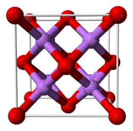]
.center[]

---

## An intuitive trivial problem

.highlight1[Problem]: find one arrangement of Tetris pieces on the board that minimise the empty space.

.left-column-33[
.center[]
]

.right-column-66[
.center[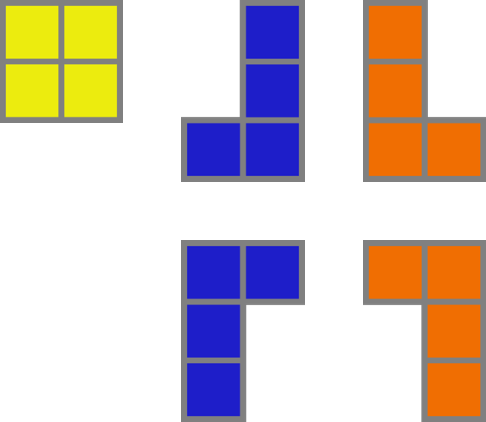]
]

--

.full-width[.center[
<figure>
  
<figcaption>Score: 12</figcaption>
</figure>
]]

---

count: false

## An intuitive ~~trivial~~ easy problem

.highlight1[Problem]: find .highlight2[all] the arrangements of Tetris pieces on the board that minimise the empty space.

.left-column-33[
.center[]
]

.right-column-66[
.center[]
]

--

.full-width[.center[

  

  <figure>
      
    <figcaption>12</figcaption>
  </figure>
  

  

  <figure>
      
    <figcaption>12</figcaption>
  </figure>
  

  

  <figure>
      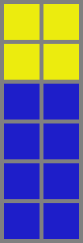
    <figcaption>12</figcaption>
  </figure>
  

  

  <figure>
      
    <figcaption>12</figcaption>
  </figure>
  

  

  <figure>
      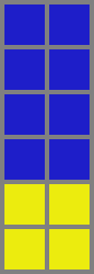
    <figcaption>12</figcaption>
  </figure>
  

]]

---

count: false

## An intuitive ~~easy~~ hard problem

.highlight1[Problem]: find .highlight2[all] the arrangements of Tetris pieces on the board that minimise the empty space.

.left-column-33[
.center[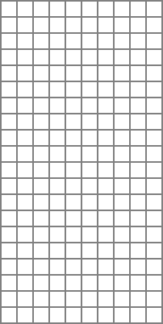]
]

.right-column-66[
.center[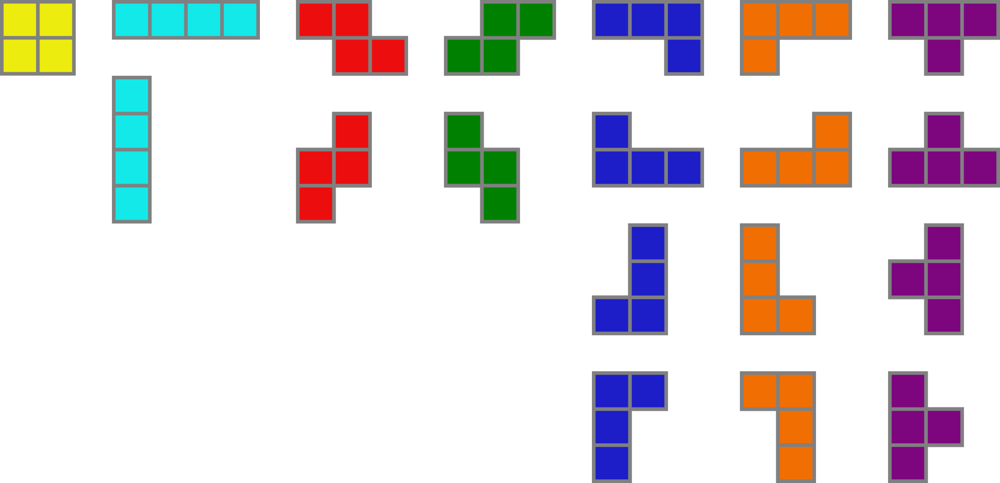]
]

--

.full-width[.center[

  

  <figure>
      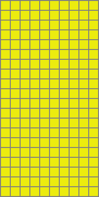
  </figure>
  

  

  <figure>
      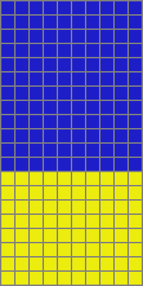
  </figure>
  

  

  <figure>
      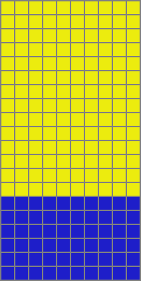
  </figure>
  

  

  <figure>
      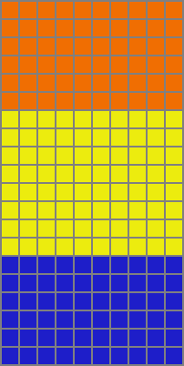
  </figure>
  

  

  <figure>
      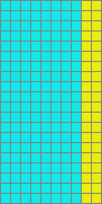
  </figure>
  

]]

---

count: false

## An incredibly ~~intuitive easy~~ hard problem

.highlight1[Problem]: find .highlight2[all] the arrangements of Tetris pieces on the board that .highlight2[optimise an unknown function].

.left-column-33[
.center[]
]

.right-column-66[
.center[]
]

--

.full-width[.center[

  

  <figure>
      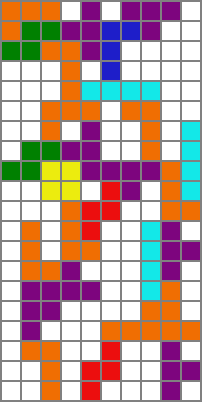
  </figure>
  

  

  <figure>
      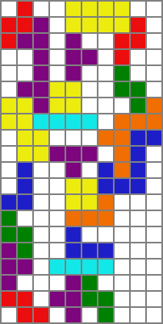
  </figure>
  

  

  <figure>
      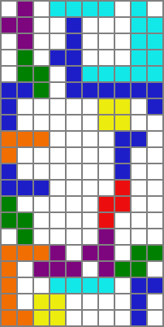
  </figure>
  

  

  <figure>
      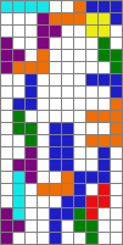
  </figure>
  

  

  <figure>
      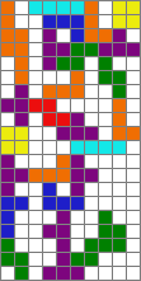
  </figure>
  

]]

---

count: false

## An incredibly ~~intuitive easy~~ hard problem

.highlight1[Problem]: find .highlight2[all] the arrangements of Tetris pieces on the board that .highlight2[optimise an unknown function].

.left-column-33[
.center[]
]

.right-column-66[
.center[]
]

.full-width[.conclusion[Materials and drug discovery involve finding candidates with rare properties from combinatorially or infinitely many options.]]

---

## Actual scientific discovery problems

.context35[The "Tetris problem" involves .highlight1[sampling from an unknown distribution] in a .highlight1[discrete, high-dimensional, combinatorially large space].]

---

count: false

## Actual scientific discovery problems
### Biological sequence design

 
Proteins, antimicrobial peptides (AMP) and DNA can be represented as sequences of amino acids or nucleobases. There are $22^{100} \approx 10^{134}$ protein sequences with 100 amino acids.

.context35[The "Tetris problem" involves sampling from an unknown distribution in a discrete, high-dimensional, combinatorially large space]

.center[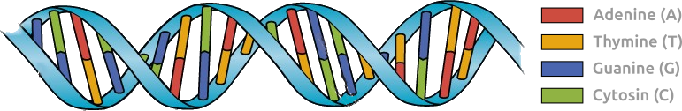]

--

.left-column-66[
.dnag[`G`].dnaa[`A`].dnag[`G`].dnag[`G`].dnag[`G`].dnac[`C`].dnag[`G`].dnaa[`A`].dnac[`C`].dnag[`G`].dnag[`G`].dnat[`T`].dnaa[`A`].dnac[`C`].dnag[`G`].dnag[`G`].dnaa[`A`].dnag[`G`].dnac[`C`].dnat[`T`].dnac[`C`].dnat[`T`].dnag[`G`].dnac[`C`].dnat[`T`].dnac[`C`].dnac[`C`].dnag[`G`].dnat[`T`].dnat[`T`].dnaa[`A`] 
.dnat[`T`].dnac[`C`].dnaa[`A`].dnac[`C`].dnac[`C`].dnat[`T`].dnac[`C`].dnac[`C`].dnac[`C`].dnag[`G`].dnaa[`A`].dnag[`G`].dnac[`C`].dnaa[`A`].dnaa[`A`].dnat[`T`].dnaa[`A`].dnag[`G`].dnat[`T`].dnat[`T`].dnag[`G`].dnat[`T`].dnaa[`A`].dnag[`G`].dnag[`G`].dnac[`C`].dnaa[`A`].dnag[`G`].dnac[`C`].dnag[`G`].dnat[`T`].dnac[`C`].dnac[`C`].dnat[`T`].dnaa[`A`].dnac[`C`].dnac[`C`].dnag[`G`].dnat[`T`].dnat[`T`].dnac[`C`].dnag[`G`] 
.dnac[`C`].dnat[`T`].dnaa[`A`].dnac[`C`].dnag[`G`].dnac[`C`].dnag[`G`].dnat[`T`].dnac[`C`].dnat[`T`].dnac[`C`].dnat[`T`].dnat[`T`].dnat[`T`].dnac[`C`].dnag[`G`].dnag[`G`].dnag[`G`].dnag[`G`].dnag[`G`].dnat[`T`].dnat[`T`].dnaa[`A`] 
.dnat[`T`].dnat[`T`].dnag[`G`].dnac[`C`].dnaa[`A`].dnag[`G`].dnaa[`A`].dnag[`G`].dnag[`G`].dnat[`T`].dnat[`T`].dnaa[`A`].dnaa[`A`].dnac[`C`].dnag[`G`].dnac[`C`].dnag[`G`].dnac[`C`].dnaa[`A`].dnat[`T`].dnag[`G`].dnac[`C`].dnag[`G`].dnaa[`A`].dnac[`C`].dnat[`T`].dnag[`G`].dnag[`G`].dnag[`G`].dnag[`G`].dnat[`T`].dnat[`T`].dnaa[`A`].dnag[`G`].dnat[`T`].dnaa[`A`].dnag[`G`].dnat[`T`].dnac[`C`].dnag[`G`].dnaa[`A`].dnaa[`A`].dnac[`C`].dnaa[`A`].dnat[`T`].dnaa[`A`].dnat[`T`].dnaa[`A`].dnat[`T`].dnat[`T`].dnag[`G`].dnaa[`A`].dnat[`T`].dnaa[`A`].dnaa[`A`].dnaa[`A`].dnac[`C`].dnaa[`A`] 
.dnag[`G`].dnac[`C`].dnat[`T`].dnac[`C`].dnag[`G`].dnac[`C`].dnat[`T`].dnat[`T`].dnaa[`A`].dnag[`G`].dnag[`G`].dnag[`G`].dnac[`C`].dnac[`C`].dnat[`T`].dnac[`C`].dnag[`G`].dnaa[`A`].dnac[`C`].dnat[`T`].dnac[`C`].dnac[`C`].dnat[`T`].dnac[`C`].dnat[`T`].dnag[`G`].dnaa[`A`].dnaa[`A`].dnat[`T`].dnag[`G`].dnag[`G`].dnaa[`A`].dnag[`G`].dnat[`T`].dnag[`G`].dnat[`T`].dnat[`T`].dnac[`C`].dnaa[`A`].dnat[`T`].dnac[`C`].dnag[`G`].dnaa[`A`].dnaa[`A`].dnat[`T`].dnag[`G`].dnag[`G`].dnaa[`A`].dnag[`G`].dnat[`T`].dnag[`G`] 
]

---

## Actual scientific discovery problems
### Molecular generation

.context35[The "Tetris problem" involves sampling from an unknown distribution in a discrete, high-dimensional, combinatorially large space]

 
Small molecules can also be represented as sequences or by a combination of of higher-level fragments. There may be about $10^{60}$ drug-like molecules.

--

.columns-3-left[
.center[
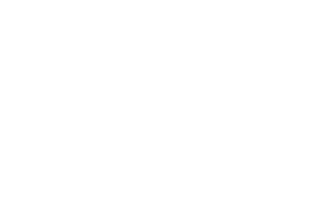

`CC(=O)NCCC1=CNc2c1cc(OC)cc2
CC(=O)NCCc1c[nH]c2ccc(OC)cc12`
]]

.columns-3-center[
.center[
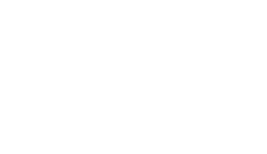

`OCCc1c(C)[n+](cs1)Cc2cnc(C)nc2N`
]]

.columns-3-right[
.center[
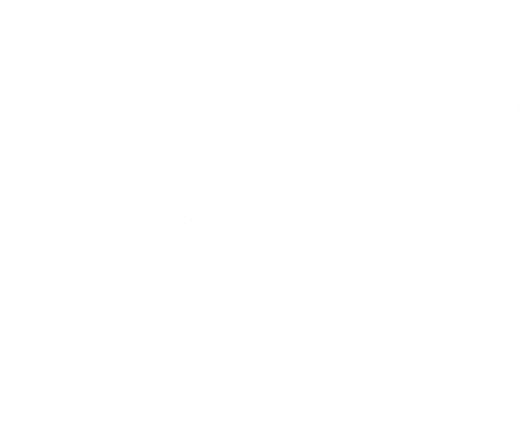

`CN1CCC[C@H]1c2cccnc2`
]]

---

## Actual scientific discovery problems
### Crystal structure generation

.context35[The "Tetris problem" involves sampling from an unknown distribution in a discrete, high-dimensional, combinatorially large space]

 
Crystal structures can be described by their chemical composition, the symmetry group and the lattice parameters (and more generally by atomic positions).

--

.center[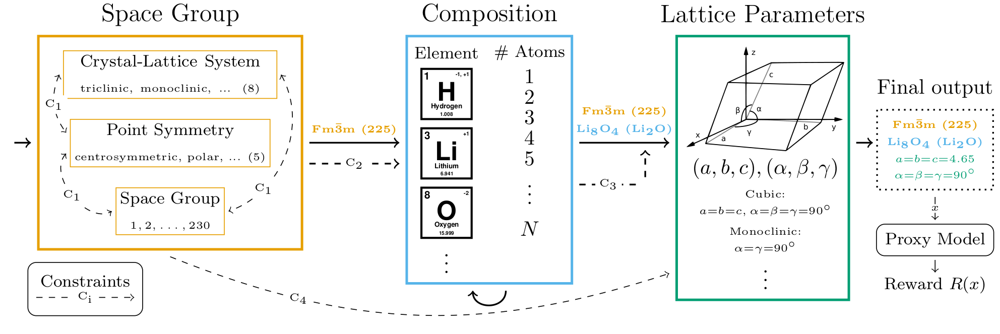]

.references[
* Mila AI4Science et al. [Crystal-GFN: sampling crystals with desirable properties and constraints](https://arxiv.org/abs/2310.04925). AI4Mat, NeurIPS 2023 (spotlight).
]

---

## Machine learning for scientific discoveries
### Summary of main challenges

--

.highlight1[Challenge]: very large and high-dimensional search spaces.

--

&rarr; Need for .highlight2[efficient search and generalisation] of underlying structure.

--

.highlight1[Challenge]: highly structured, discrete and continuous objects

--

&rarr; Need for .highlight2[generators or samplers designed] for structured data.

--

.highlight1[Challenge]: underspecification of objective functions or metrics.

--

&rarr; Need for .highlight2[diverse candidates].

--

.conclusion[We want to discover diverse high-scoring candidates in very large, structured spaces.]

---

## ML for scientific discoveries
### Available methods

.context35[We want to discover diverse high-scoring candidates in very large, structured spaces.]

--

.center[What methods can address these challenges?]

--

- .highlight1[Reinforcement learning] excels at optimisation in complex spaces, but tends to lack diversity.
--

- .highlight1[Traditional sampling methods (MCMC)] provide diversity (sampling), but struggle at mode mixing in high dimensions.
--

- .highlight1[Diffusion] excels at learning from data at scale and sampling in continuous spaces, but is limited at leveraging compositional structure.

--

.conclusion[Generative flow networks (GFlowNets) combine multiple advantages: **sampling as sequential decision making**.]

???

- Ask familiarity with RL
- Ask familiarity with MCMC

---

count: false
name: gflownets
class: title, middle

### A brief overview of GFlowNets

.center[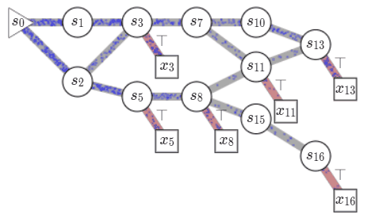]

---

## GFlowNets for science
### 3 key ingredients

.context[Materials and drug discovery involve .highlight1[sampling from unknown distributions] in .highlight1[discrete or mixed, high-dimensional, combinatorially large spaces.]]

--

  

1. .highlight1[Diversity] as an objective.

--
    - Given a score or reward function $R(x)$, learn to _sample proportionally to the reward_.
--
2. .highlight1[Compositionality] in the sample generation.

--
    - A meaningful decomposition of samples $x$ into multiple sub-states $s_0\rightarrow s_1 \rightarrow \dots \rightarrow x$ can yield generalisable patterns.
--
3. .highlight1[Deep learning] to learn from the generated samples.

--
    - A machine learning model can learn the transition function $F(s\rightarrow s')$ and generalise the patterns.

---

## 1. Diversity as an objective

.context[Many existing approaches treat scientific discovery as an _optimisation_ problem.]

 
Given a reward or objective function $R(x)$, GFlowNet can be seen a generative model trained to sample objects $x \in \cal X$ according to .highlight1[a sampling policy $\pi(x)$ proportional to the reward $R(x)$]: 

--

.left-column[
$$\pi(x) = \frac{R(x)}{Z} \propto R(x)$$
]

--

.right-column[
$$Z = \sum_{x' \in \cal X} R(x')$$
]

--

.full-width[
.center[

]]

---

count: false

## 1. Diversity as an objective

.context[Many existing approaches treat scientific discovery as an _optimisation_ problem.]

 
Given a reward or objective function $R(x)$, GFlowNet can be seen a generative model trained to sample objects $x \in \cal X$ according to .highlight1[a sampling policy $\pi(x)$ proportional to the reward $R(x)$]: 

.left-column[
$$\pi(x) = \frac{R(x)}{Z} \propto R(x)$$
]

.right-column[
$$Z = \sum_{x' \in \cal X} R(x')$$
]

.full-width[
&rarr; Sampling proportionally to the reward function enables finding .highlight1[multiple modes], hence .highlight1[diversity].

.center[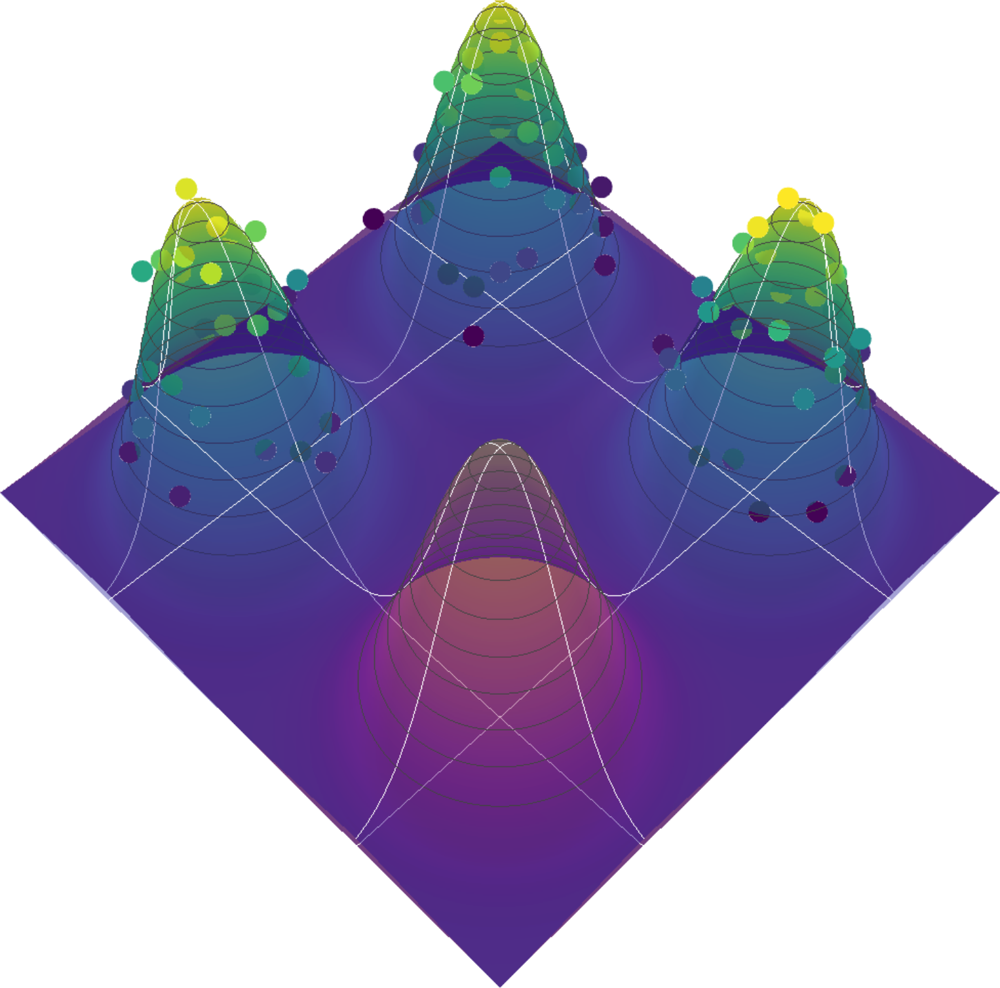]
]

---

## 2. Compositionality
### Sample generation process

.context35[Sampling _directly_ from a complex, high-dimensional distribution is difficult.]

The principle of compositionality is fundamental in semantics, linguistics, mathematical logic and is thought to be a cornerstone of human reasoning.

---

count: false

## 2. Compositionality
### Sample generation process

.context35[Sampling _directly_ from a complex, high-dimensional distribution is difficult.]

For the Tetris problem, a meaningful decomposition of the samples is .highlight1[adding one piece to the board at a time].

--

.left-column[.center[]]

---

count: false

## 2. Compositionality
### Sample generation process

.context35[Sampling _directly_ from a complex, high-dimensional distribution is difficult.]

For the Tetris problem, a meaningful decomposition of the samples is .highlight1[adding one piece to the board at a time].

.left-column[.center[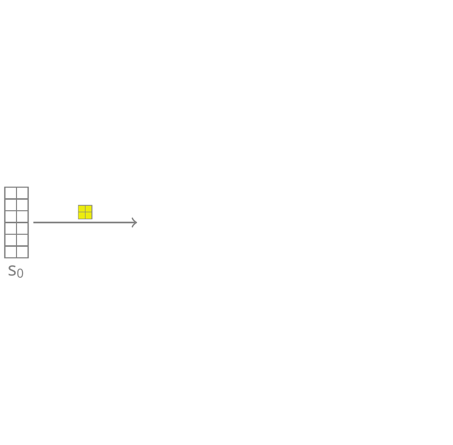]]

---

count: false

## 2. Compositionality
### Sample generation process

.context35[Sampling _directly_ from a complex, high-dimensional distribution is difficult.]

For the Tetris problem, a meaningful decomposition of the samples is .highlight1[adding one piece to the board at a time].

.left-column[.center[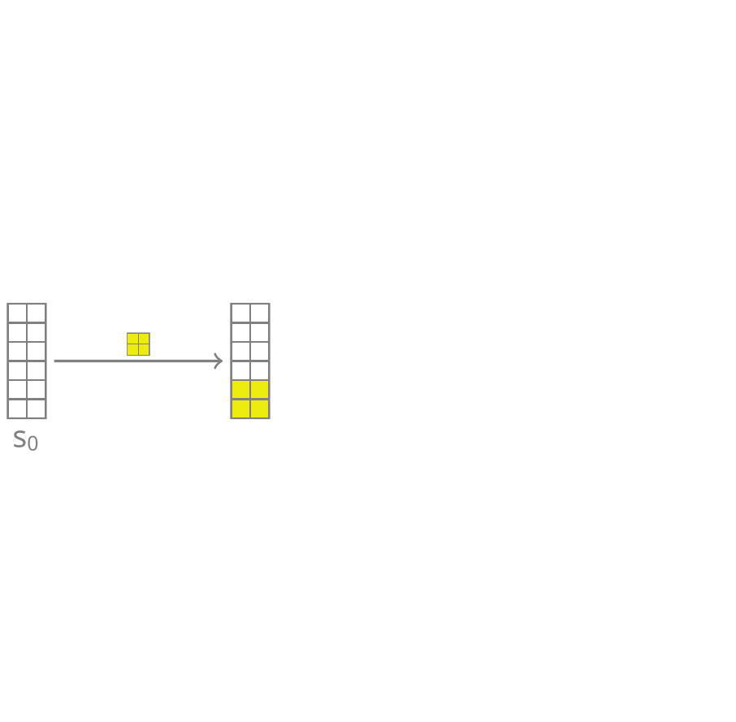]]

---

count: false

## 2. Compositionality
### Sample generation process

.context35[Sampling _directly_ from a complex, high-dimensional distribution is difficult.]

For the Tetris problem, a meaningful decomposition of the samples is .highlight1[adding one piece to the board at a time].

.left-column[.center[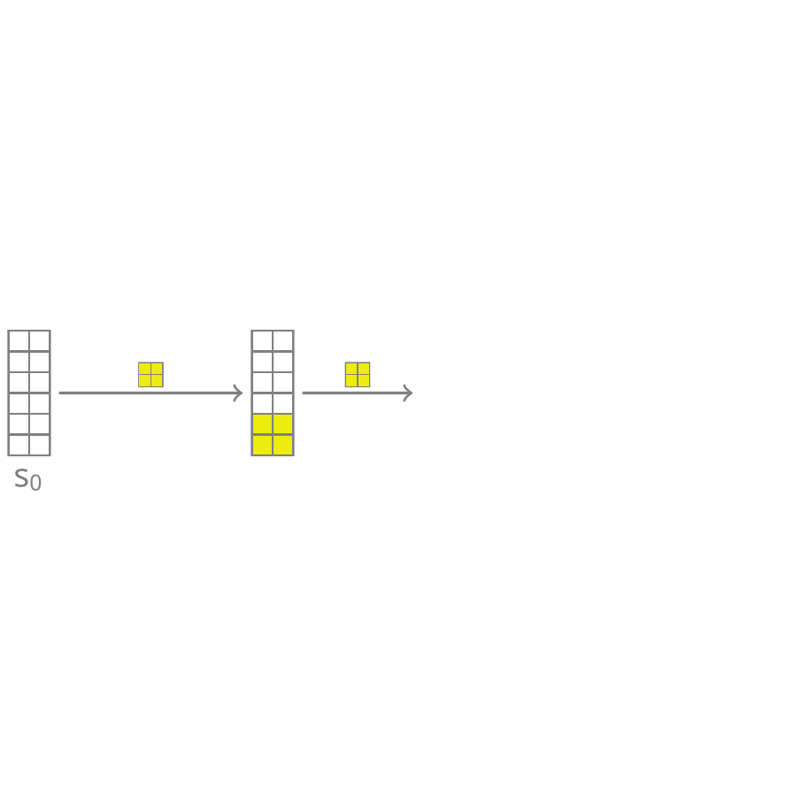]]

---

count: false

## 2. Compositionality
### Sample generation process

.context35[Sampling _directly_ from a complex, high-dimensional distribution is difficult.]

For the Tetris problem, a meaningful decomposition of the samples is .highlight1[adding one piece to the board at a time].

.left-column[.center[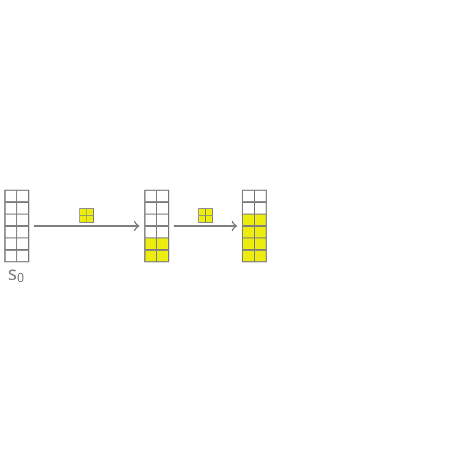]]

---

count: false

## 2. Compositionality
### Sample generation process

.context35[Sampling _directly_ from a complex, high-dimensional distribution is difficult.]

For the Tetris problem, a meaningful decomposition of the samples is .highlight1[adding one piece to the board at a time].

.left-column[.center[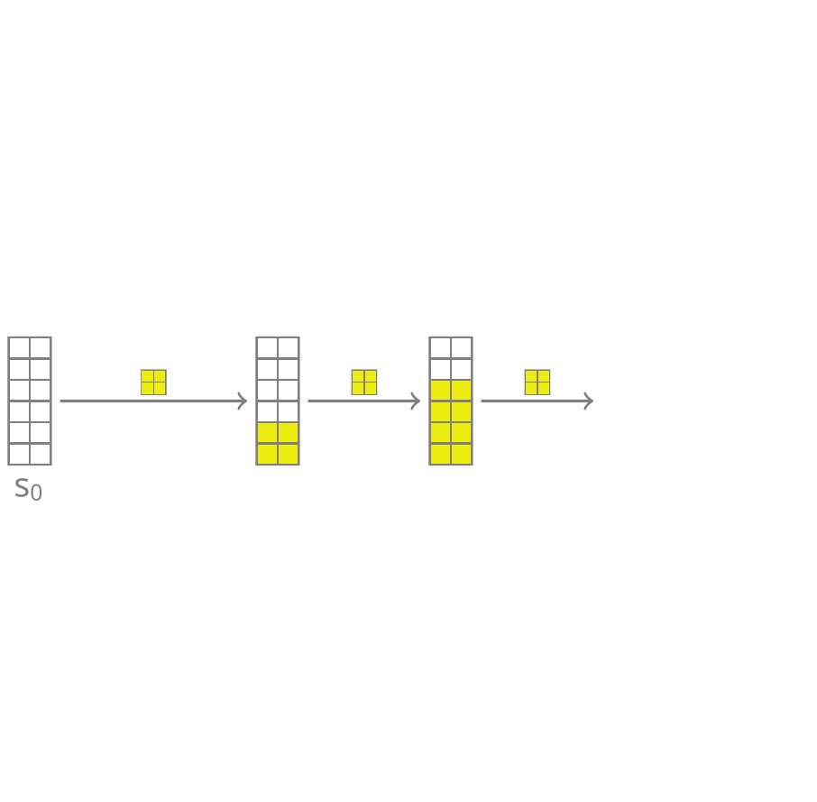]]

---

count: false

## 2. Compositionality
### Sample generation process

.context35[Sampling _directly_ from a complex, high-dimensional distribution is difficult.]

For the Tetris problem, a meaningful decomposition of the samples is .highlight1[adding one piece to the board at a time].

.left-column[.center[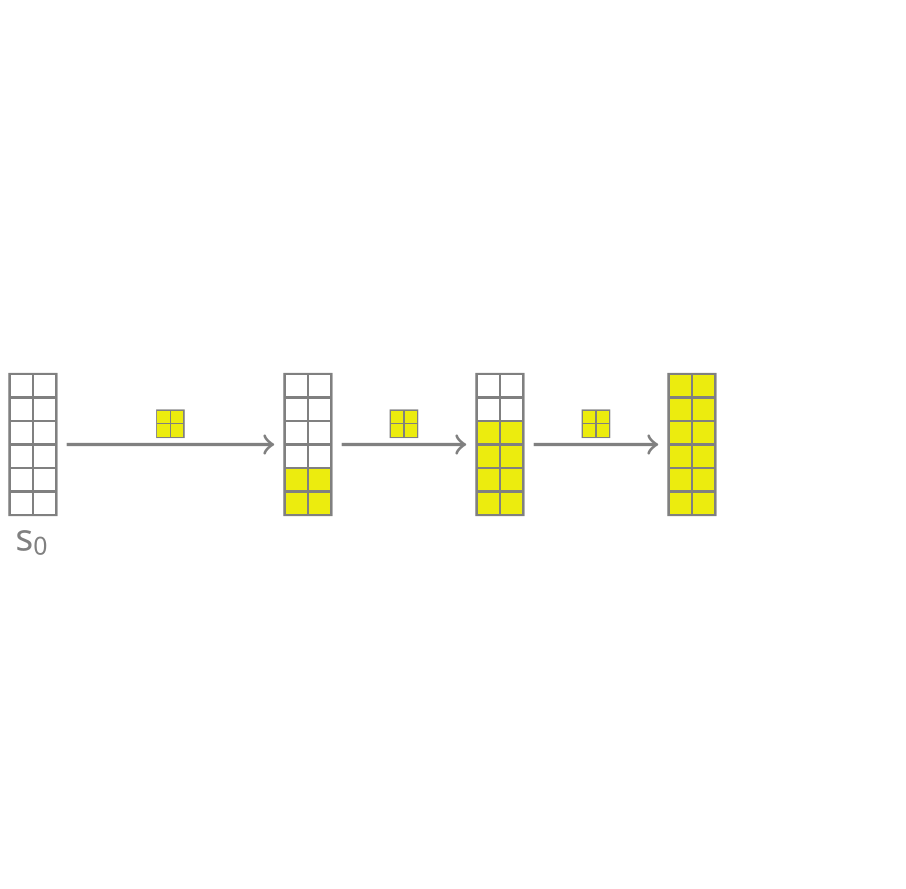]]

---

count: false

## 2. Compositionality
### Sample generation process

.context35[Sampling _directly_ from a complex, high-dimensional distribution is difficult.]

For the Tetris problem, a meaningful decomposition of the samples is .highlight1[adding one piece to the board at a time].

.left-column[.center[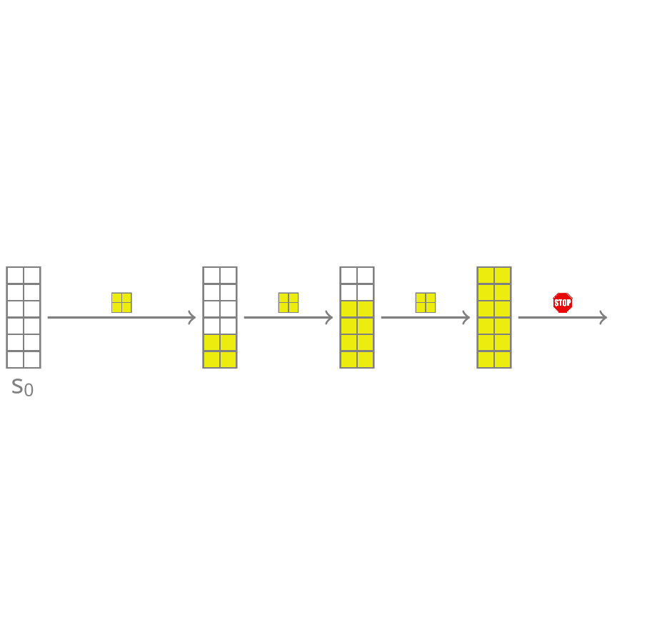]]

---

count: false

## 2. Compositionality
### Sample generation process

.context35[Sampling _directly_ from a complex, high-dimensional distribution is difficult.]

For the Tetris problem, a meaningful decomposition of the samples is .highlight1[adding one piece to the board at a time].

.left-column[.center[]]

---

count: false

## 2. Compositionality
### Sample generation process

.context35[Sampling _directly_ from a complex, high-dimensional distribution is difficult.]

For the Tetris problem, a meaningful decomposition of the samples is .highlight1[adding one piece to the board at a time].

.left-column[.center[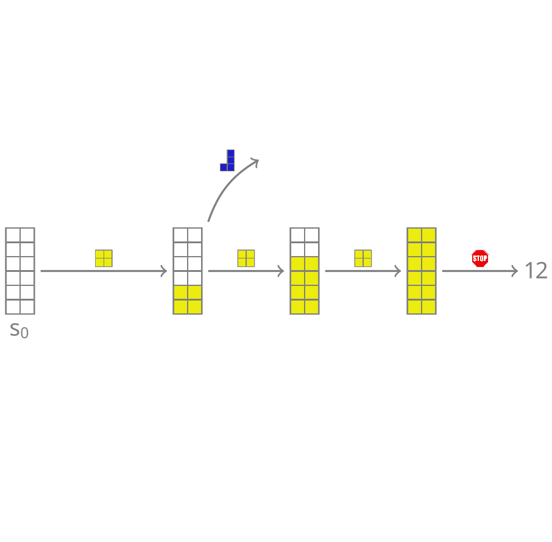]]

---

count: false

## 2. Compositionality
### Sample generation process

.context35[Sampling _directly_ from a complex, high-dimensional distribution is difficult.]

For the Tetris problem, a meaningful decomposition of the samples is .highlight1[adding one piece to the board at a time].

.left-column[.center[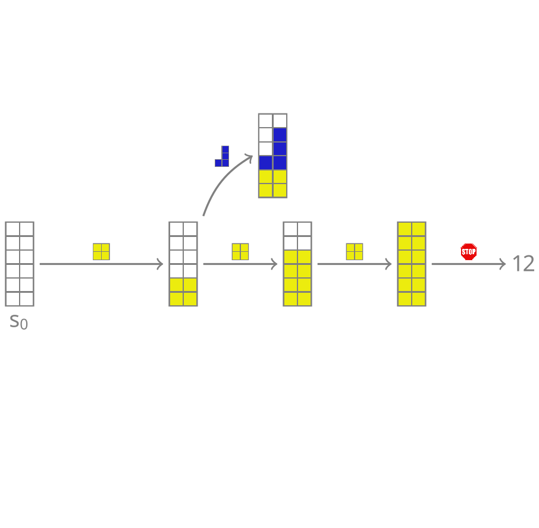]]

---

count: false

## 2. Compositionality
### Sample generation process

.context35[Sampling _directly_ from a complex, high-dimensional distribution is difficult.]

For the Tetris problem, a meaningful decomposition of the samples is .highlight1[adding one piece to the board at a time].

.left-column[.center[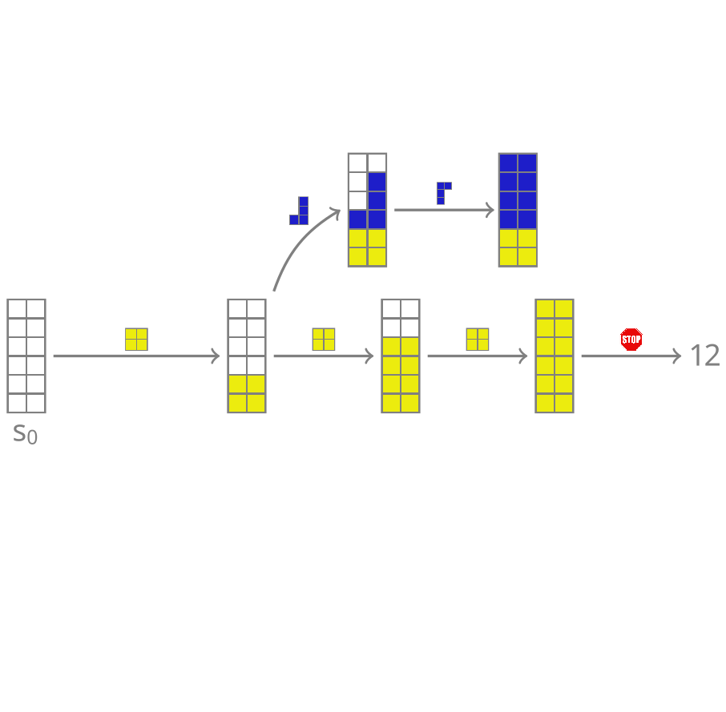]]

---

count: false

## 2. Compositionality
### Sample generation process

.context35[Sampling _directly_ from a complex, high-dimensional distribution is difficult.]

For the Tetris problem, a meaningful decomposition of the samples is .highlight1[adding one piece to the board at a time].

.left-column[.center[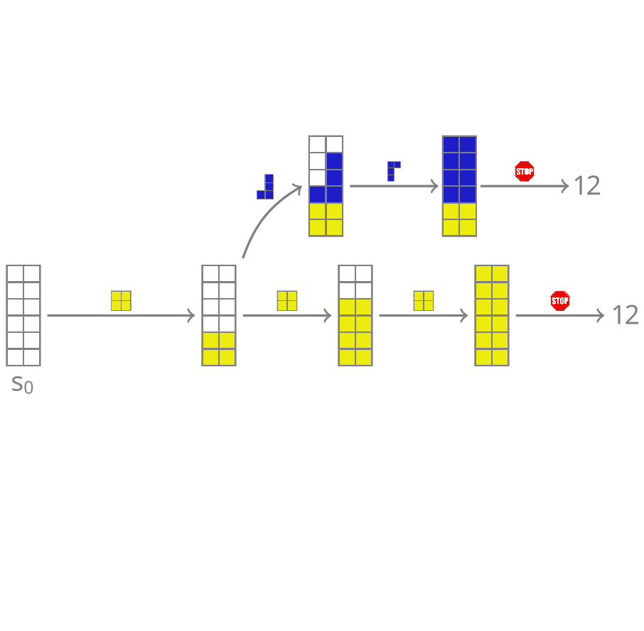]]

---

count: false

## 2. Compositionality
### Sample generation process

.context35[Sampling _directly_ from a complex, high-dimensional distribution is difficult.]

For the Tetris problem, a meaningful decomposition of the samples is .highlight1[adding one piece to the board at a time].

.left-column[.center[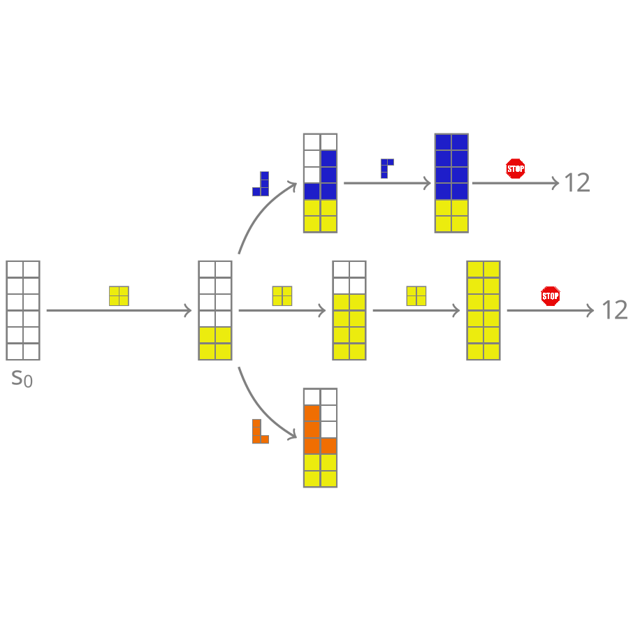]]

---

count: false

## 2. Compositionality
### Sample generation process

.context35[Sampling _directly_ from a complex, high-dimensional distribution is difficult.]

For the Tetris problem, a meaningful decomposition of the samples is .highlight1[adding one piece to the board at a time].

.left-column[.center[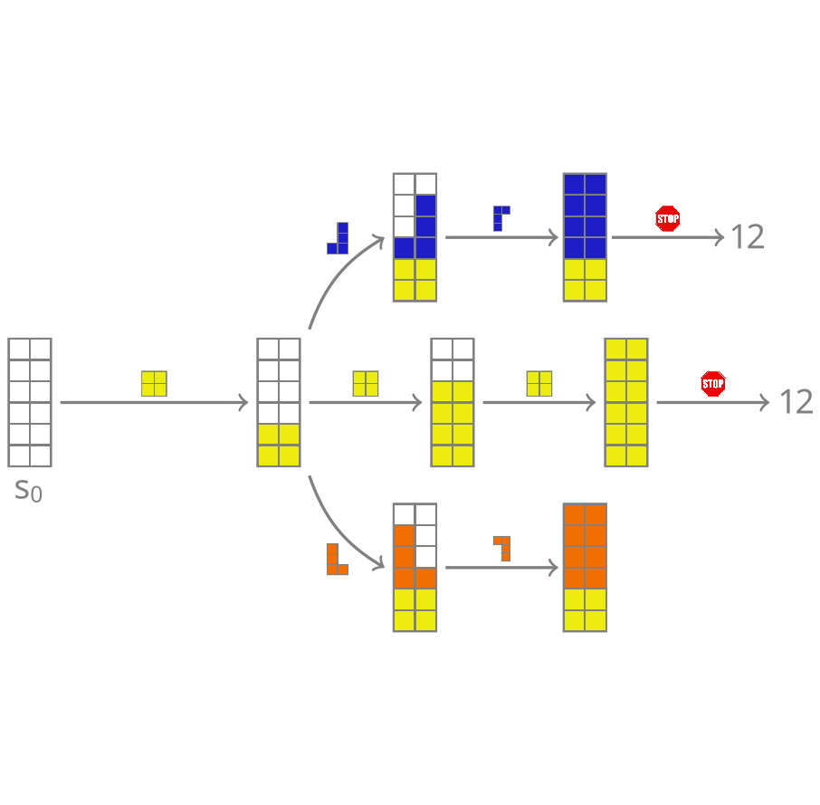]]

---

count: false

## 2. Compositionality
### Sample generation process

.context35[Sampling _directly_ from a complex, high-dimensional distribution is difficult.]

For the Tetris problem, a meaningful decomposition of the samples is .highlight1[adding one piece to the board at a time].

.left-column[.center[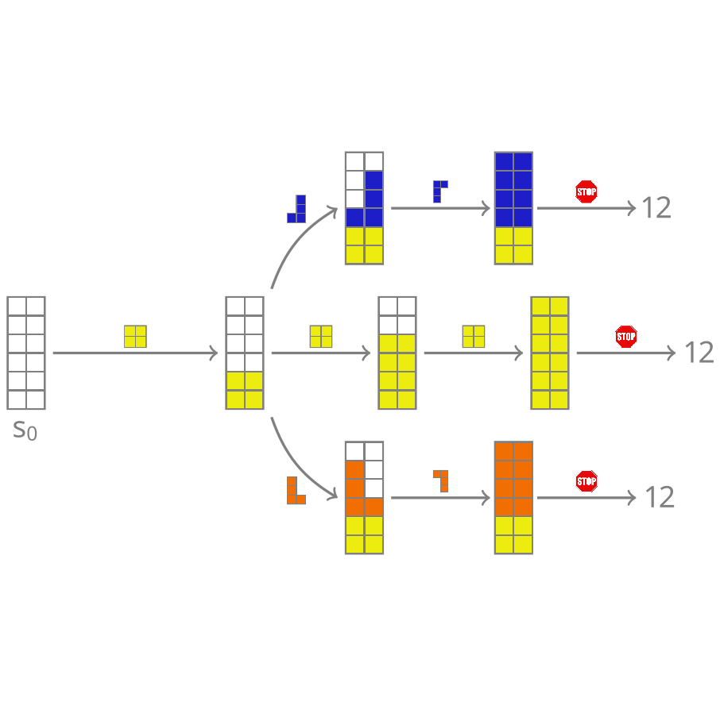]]

---

count: false

## 2. Compositionality
### Sample generation process

.context35[Sampling _directly_ from a complex, high-dimensional distribution is difficult.]

For the Tetris problem, a meaningful decomposition of the samples is .highlight1[adding one piece to the board at a time].

.left-column[.center[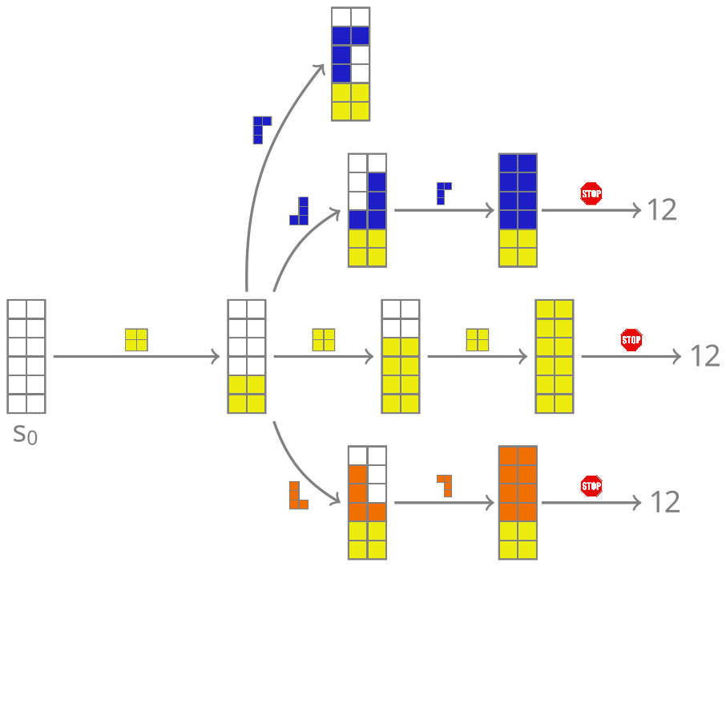]]

---

count: false

## 2. Compositionality
### Sample generation process

.context35[Sampling _directly_ from a complex, high-dimensional distribution is difficult.]

For the Tetris problem, a meaningful decomposition of the samples is .highlight1[adding one piece to the board at a time].

.left-column[.center[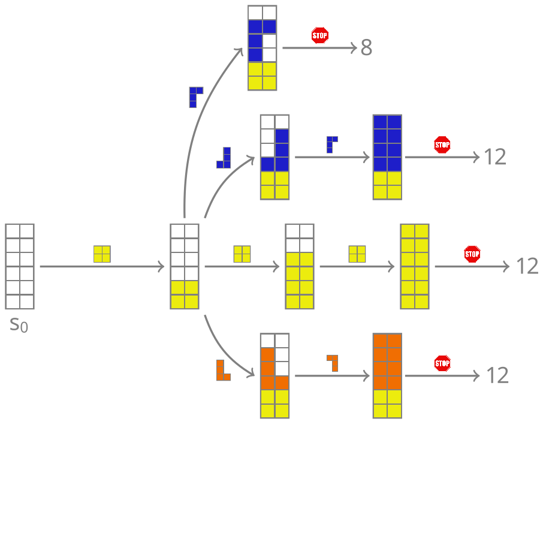]]

---

count: false

## 2. Compositionality
### Sample generation process

.context35[Sampling _directly_ from a complex, high-dimensional distribution is difficult.]

For the Tetris problem, a meaningful decomposition of the samples is .highlight1[adding one piece to the board at a time].

.left-column[.center[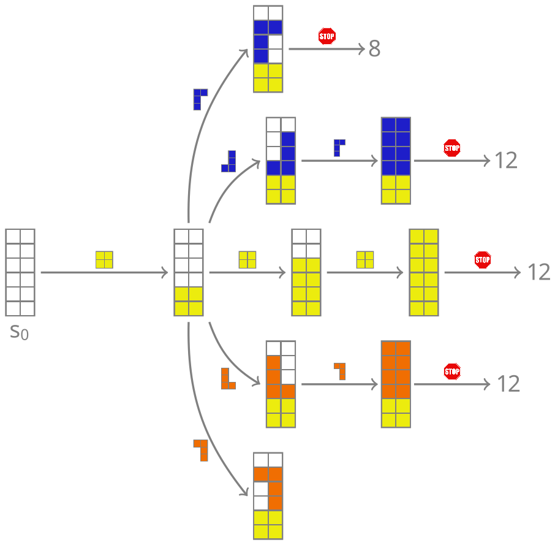]]

---

count: false

## 2. Compositionality
### Sample generation process

.context35[Sampling _directly_ from a complex, high-dimensional distribution is difficult.]

For the Tetris problem, a meaningful decomposition of the samples is .highlight1[adding one piece to the board at a time].

.left-column[.center[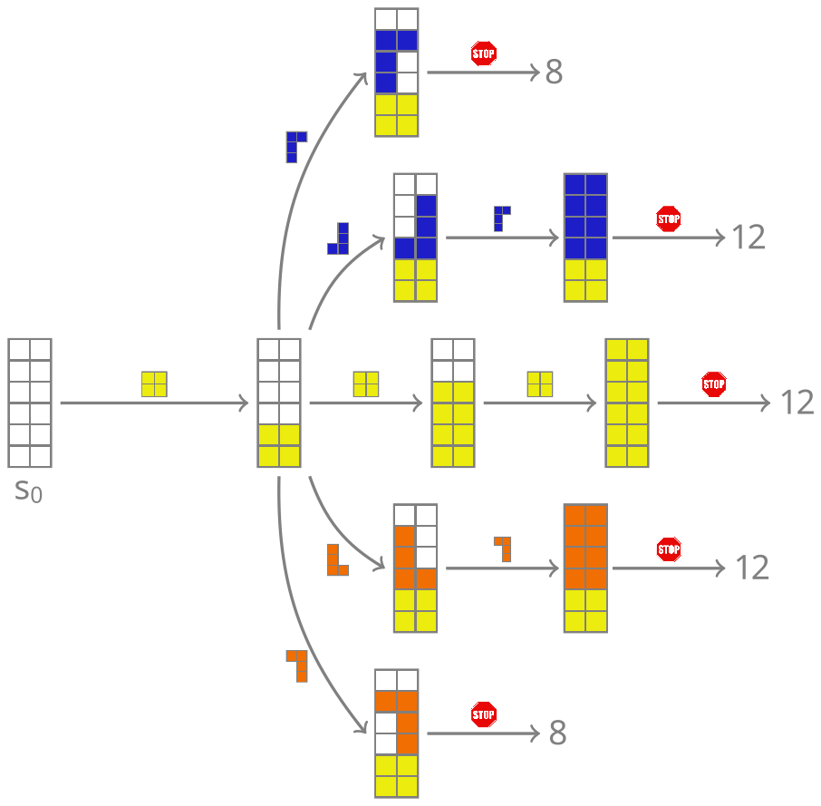]]

---

count: false

## 2. Compositionality
### Sample generation process

.context35[Sampling _directly_ from a complex, high-dimensional distribution is difficult.]

For the Tetris problem, a meaningful decomposition of the samples is .highlight1[adding one piece to the board at a time].

.left-column[.center[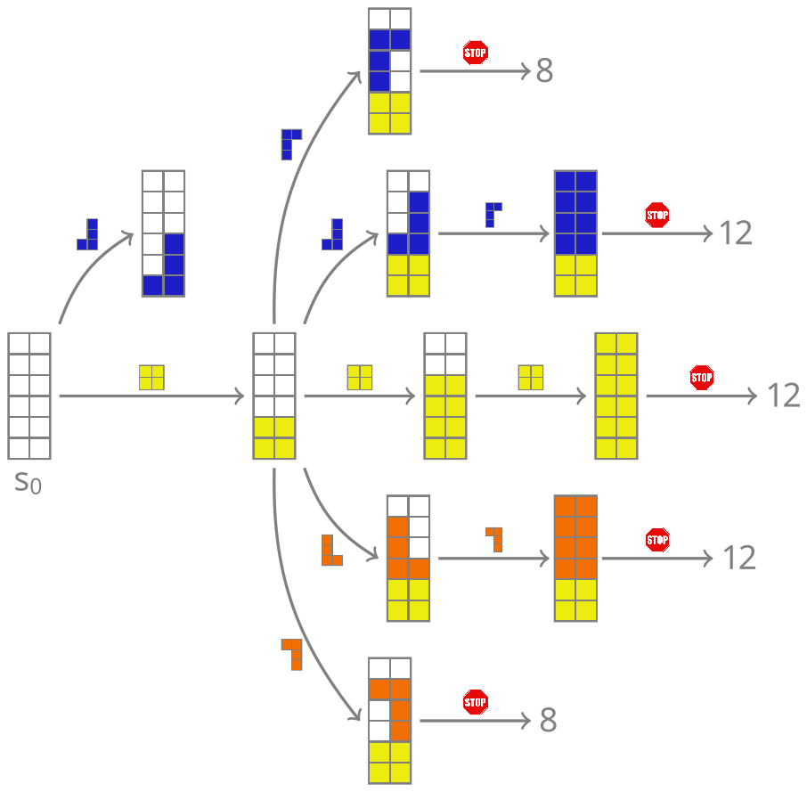]]

---

count: false

## 2. Compositionality
### Sample generation process

.context35[Sampling _directly_ from a complex, high-dimensional distribution is difficult.]

For the Tetris problem, a meaningful decomposition of the samples is .highlight1[adding one piece to the board at a time].

.left-column[.center[]]

---

count: false

## 2. Compositionality
### Sample generation process

.context35[Sampling _directly_ from a complex, high-dimensional distribution is difficult.]

For the Tetris problem, a meaningful decomposition of the samples is .highlight1[adding one piece to the board at a time].

.left-column[.center[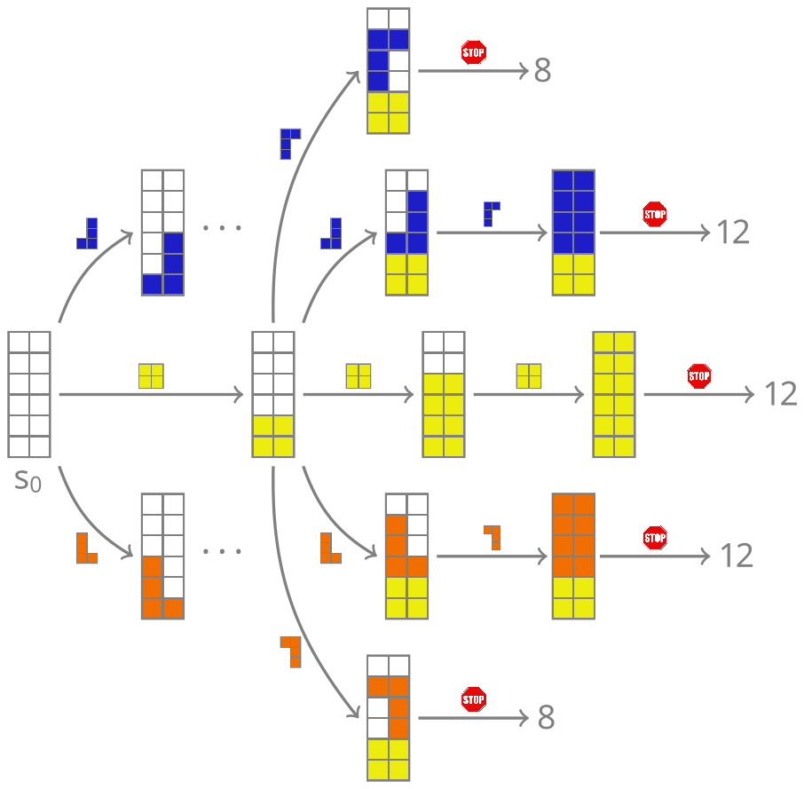]]

---

count: false

## 2. Compositionality
### Sample generation process

.context35[Sampling _directly_ from a complex, high-dimensional distribution is difficult.]

For the Tetris problem, a meaningful decomposition of the samples is .highlight1[adding one piece to the board at a time].

.left-column[.center[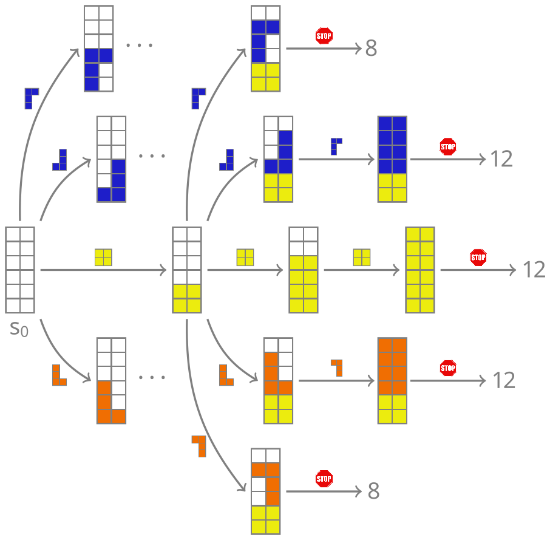]]

---

count: false

## 2. Compositionality
### Sample generation process

.context35[Sampling _directly_ from a complex, high-dimensional distribution is difficult.]

For the Tetris problem, a meaningful decomposition of the samples is .highlight1[adding one piece to the board at a time].

.left-column[.center[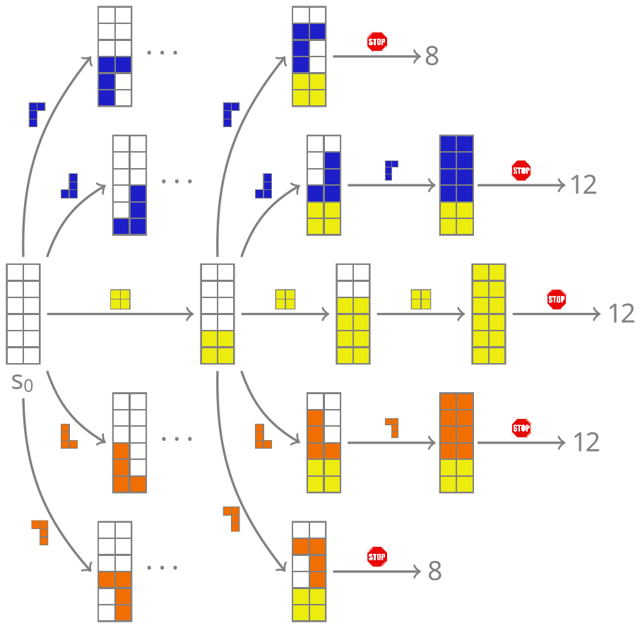]]

---

count: false

## 2. Compositionality
### Sample generation process

.context35[Sampling _directly_ from a complex, high-dimensional distribution is difficult.]

For the Tetris problem, a meaningful decomposition of the samples is .highlight1[adding one piece to the board at a time].

.left-column[.center[]]

.right-column[
  
.conclusion[The decomposition of the sampling process into meaningful steps yields patterns that may be correlated with the reward function and facilitates learning complex distributions.]
]

---

count: false

## 2. Compositionality
### Sample generation process

.context35[Sampling _directly_ from a complex, high-dimensional distribution is difficult.]

For the Tetris problem, a meaningful decomposition of the samples is .highlight1[adding one piece to the board at a time].

.left-column[.center[]]

.right-column[
Objects $x \in \cal X$ are constructed through a sequence of actions from an .highlight1[action space $\cal A$].
]

.right-column[
At each step of the .highlight1[trajectory $\tau=(s_0\rightarrow s_1 \rightarrow \dots \rightarrow s_f)$], we get a partially constructed object $s$ in .highlight1[state space $\cal S$].
]

--

.right-column[
.conclusion[These ideas and terminology is reminiscent of reinforcement learning (RL).]
]

---

## 3. Deep learning policy

.context35[GFlowNets learn a sampling policy $\pi\_{\theta}(x)$ proportional to the reward $R(x)$.]

--

.left-column[
.center[]
]

---

count: false

## 3. Deep learning policy

.context35[GFlowNets learn a sampling policy $\pi\_{\theta}(x)$ proportional to the reward $R(x)$.]

.left-column[
.center[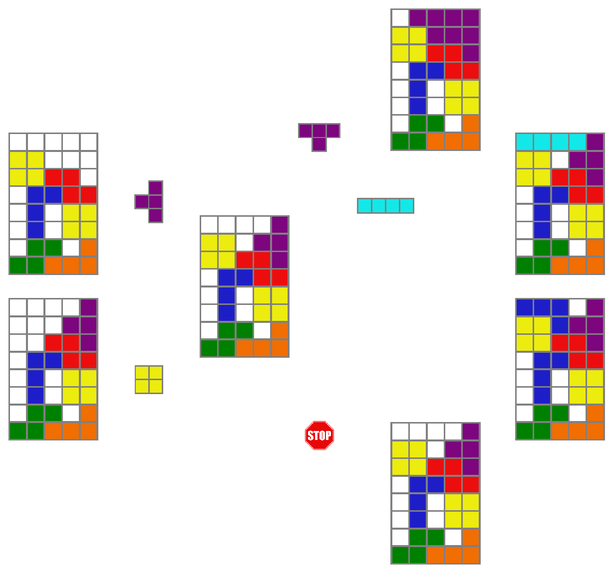]
]

.right-column[
 
Deep neural networks are trained to learn the transitions (flows) policy: $F\_{\theta}(s\_t\rightarrow s\_{t+1})$.
]

--

.right-column[
Consistent flow theorem (informal): if the sum of the flows into state $s$ is equal to the sum of the flows out, then $\pi(x) \propto R(x)$.
]

.references[
Bengio et al. [Flow network based generative models for non-iterative diverse candidate generation](https://arxiv.org/abs/2106.04399), NeurIPS, 2021.
]

--

.right-column[
.conclusion[GFlowNets can be trained with deep learning methods to learn a sampling policy $\pi\_{\theta}$ proportional to a reward $R(x)$.]
]

---

##  GFlowNets extensions and applications

---

count: false

##  GFlowNets extensions and applications
### Multi-objective GFlowNets

Extension of GFlowNets to handle multi-objective optimisation and not only cover the Pareto front but also sample diverse objects at each point in the Pareto front.

.center[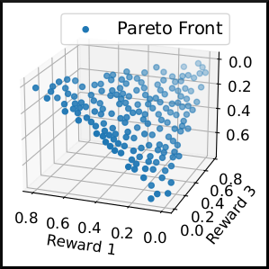]

.references[
Jain et al. [Multi-Objective GFlowNets](https://arxiv.org/abs/2210.12765), ICML, 2023.
]

---

##  GFlowNets extensions and applications
### Continuous GFlowNets

Generalisation of the theory and implementation of GFlowNets to encompass both discrete and continuous or hybrid state spaces. 

.center[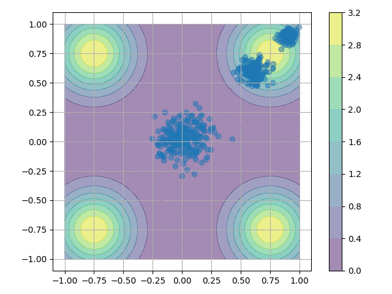]

.references[
Lahlou et al. [A Theory of Continuous Generative Flow Networks](https://arxiv.org/abs/2301.12594), ICML, 2023.
]

---

##  GFlowNets extensions and applications
### Molecular conformation generation

A continuous GFlowNets algorithm for sampling conformations of small molecules from the Boltzmann distribution, as determined by the molecule’s energy.

.references[
Volokhova, Koziarski et al. [Towards equilibrium molecular conformation generation with GFlowNets](https://arxiv.org/abs/2310.14782), Digital Discovery, 2024.
]

.center[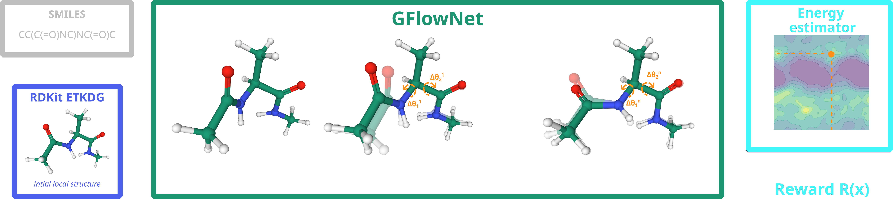]

---

##  GFlowNets extensions and applications
### Biological sequence design

An active learning algorithm with GFlowNets as a sampler of biological sequence design (DNA, antimicrobial peptides, proteins) with desirable properties.

.center[]

.left-column-66[
.dnag[`G`].dnaa[`A`].dnag[`G`].dnag[`G`].dnag[`G`].dnac[`C`].dnag[`G`].dnaa[`A`].dnac[`C`].dnag[`G`].dnag[`G`].dnat[`T`].dnaa[`A`].dnac[`C`].dnag[`G`].dnag[`G`].dnaa[`A`].dnag[`G`].dnac[`C`].dnat[`T`].dnac[`C`].dnat[`T`].dnag[`G`].dnac[`C`].dnat[`T`].dnac[`C`].dnac[`C`].dnag[`G`].dnat[`T`].dnat[`T`].dnaa[`A`] 
.dnat[`T`].dnac[`C`].dnaa[`A`].dnac[`C`].dnac[`C`].dnat[`T`].dnac[`C`].dnac[`C`].dnac[`C`].dnag[`G`].dnaa[`A`].dnag[`G`].dnac[`C`].dnaa[`A`].dnaa[`A`].dnat[`T`].dnaa[`A`].dnag[`G`].dnat[`T`].dnat[`T`].dnag[`G`].dnat[`T`].dnaa[`A`].dnag[`G`].dnag[`G`].dnac[`C`].dnaa[`A`].dnag[`G`].dnac[`C`].dnag[`G`].dnat[`T`].dnac[`C`].dnac[`C`].dnat[`T`].dnaa[`A`].dnac[`C`].dnac[`C`].dnag[`G`].dnat[`T`].dnat[`T`].dnac[`C`].dnag[`G`] 
.dnac[`C`].dnat[`T`].dnaa[`A`].dnac[`C`].dnag[`G`].dnac[`C`].dnag[`G`].dnat[`T`].dnac[`C`].dnat[`T`].dnac[`C`].dnat[`T`].dnat[`T`].dnat[`T`].dnac[`C`].dnag[`G`].dnag[`G`].dnag[`G`].dnag[`G`].dnag[`G`].dnat[`T`].dnat[`T`].dnaa[`A`] 
.dnat[`T`].dnat[`T`].dnag[`G`].dnac[`C`].dnaa[`A`].dnag[`G`].dnaa[`A`].dnag[`G`].dnag[`G`].dnat[`T`].dnat[`T`].dnaa[`A`].dnaa[`A`].dnac[`C`].dnag[`G`].dnac[`C`].dnag[`G`].dnac[`C`].dnaa[`A`].dnat[`T`].dnag[`G`].dnac[`C`].dnag[`G`].dnaa[`A`].dnac[`C`].dnat[`T`].dnag[`G`].dnag[`G`].dnag[`G`].dnag[`G`].dnat[`T`].dnat[`T`].dnaa[`A`].dnag[`G`].dnat[`T`].dnaa[`A`].dnag[`G`].dnat[`T`].dnac[`C`].dnag[`G`].dnaa[`A`].dnaa[`A`].dnac[`C`].dnaa[`A`].dnat[`T`].dnaa[`A`].dnat[`T`].dnaa[`A`].dnat[`T`].dnat[`T`].dnag[`G`].dnaa[`A`].dnat[`T`].dnaa[`A`].dnaa[`A`].dnaa[`A`].dnac[`C`].dnaa[`A`] 
.dnag[`G`].dnac[`C`].dnat[`T`].dnac[`C`].dnag[`G`].dnac[`C`].dnat[`T`].dnat[`T`].dnaa[`A`].dnag[`G`].dnag[`G`].dnag[`G`].dnac[`C`].dnac[`C`].dnat[`T`].dnac[`C`].dnag[`G`].dnaa[`A`].dnac[`C`].dnat[`T`].dnac[`C`].dnac[`C`].dnat[`T`].dnac[`C`].dnat[`T`].dnag[`G`].dnaa[`A`].dnaa[`A`].dnat[`T`].dnag[`G`].dnag[`G`].dnaa[`A`].dnag[`G`].dnat[`T`].dnag[`G`].dnat[`T`].dnat[`T`].dnac[`C`].dnaa[`A`].dnat[`T`].dnac[`C`].dnag[`G`].dnaa[`A`].dnaa[`A`].dnat[`T`].dnag[`G`].dnag[`G`].dnaa[`A`].dnag[`G`].dnat[`T`].dnag[`G`] 
]

.references[
Jain et al. [Biological Sequence Design with GFlowNets](https://arxiv.org/abs/2203.04115), ICML, 2022.
]

---

##  GFlowNets extensions and applications
### Crystal structure generation

A GFlowNet adapted to sample crystal structures by sequentially selecting its physicochemical and symmetry properties, with hard constraints and high flexibility.

.center[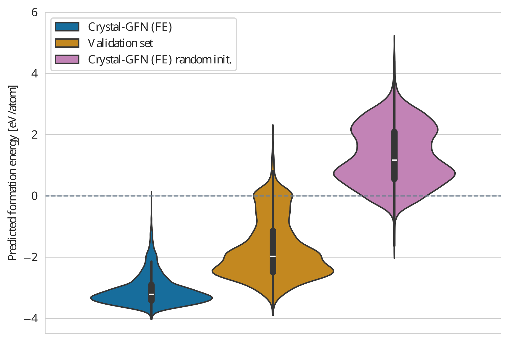]

.references[
Mila AI4Science et al. [Crystal-GFN: sampling crystals with desirable properties and constraints](https://arxiv.org/abs/2310.04925). AI4Mat, NeurIPS 2023 (spotlight)
]

---

##  GFlowNets extensions and applications
### Multi-fidelity active learning with GFlowNets

GFlowNet can play a key role in multi-fidelity active learning, as the sampler that selects both the candidates and their corresponding oracle, building diverse candidate batches

.center[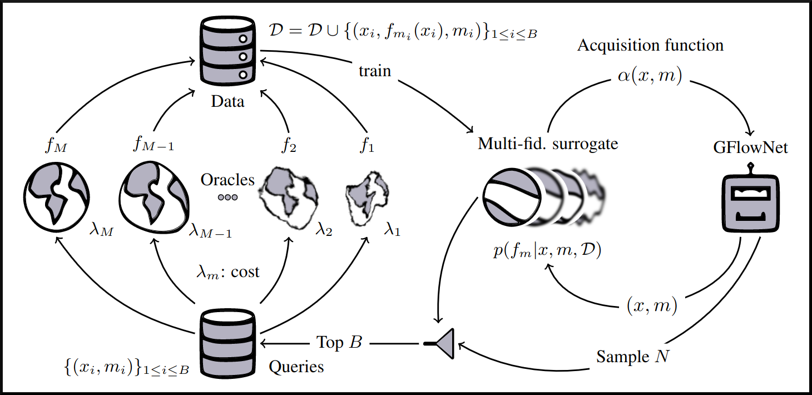]

.references[
Hernandez-Garcia, Saxena et al. [Multi-fidelity active learning with GFlowNets](https://openreview.net/forum?id=dLaazW9zuF). TMLR 2024.
]

---

##  GFlowNets extensions and applications
### Review paper

A review of the potential of GFlowNets for AI-driven scientific discoveries.

.center[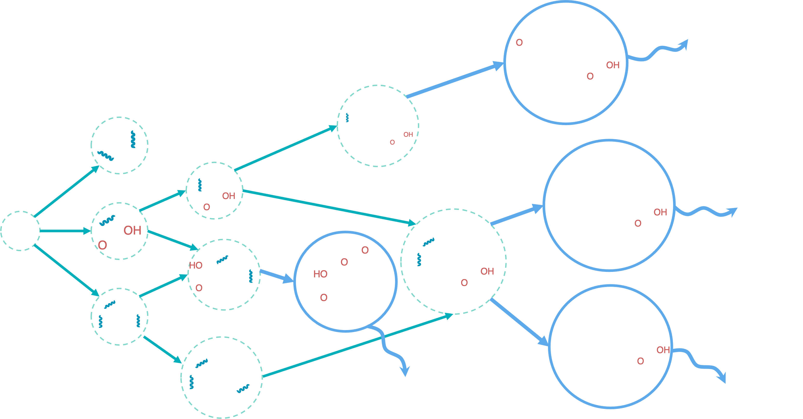]

.references[
Jain et al. [GFlowNets for AI-Driven Scientific Discovery](https://pubs.rsc.org/en/content/articlelanding/2023/dd/d3dd00002h). Digital Discovery, Royal Society of Chemistry, 2023.
]

---

## GFlowNet Python package

Open sourced GFlowNet package, together with Mila collaborators: Nikita Saxena, Alexandra Volokhova, Michał Koziarski, Divya Sharma, Pierre Luc Carrier, Victor Schmidt, Joseph Viviano, Jama Hussein, Pedro Ferraz, Dionessa Biton, Tim Arni...

.highlight2[Open source GFlowNet implementation]: [github.com/alexhernandezgarcia/gflownet](https://github.com/alexhernandezgarcia/gflownet)

.qrcode[]

--

* A key design principle is the simplicity to create new environments, new applications.
* Current environments: Tetris, hyper-grid, hyper-cube, hyper-torus, scrabble, crystals, molecules, DNA, decision trees...
* Discrete and continuous environments, multiple loss functions, etc.
* Visualisation of results on WandDB

---

count: false

## GFlowNet Python package

Open sourced GFlowNet package, together with Mila collaborators: Nikita Saxena, Alexandra Volokhova, Michał Koziarski, Divya Sharma, Pierre Luc Carrier, Victor Schmidt, Joseph Viviano, Jama Hussein, Pedro Ferraz, Tim Arni...

.highlight2[Open source GFlowNet implementation]: [github.com/alexhernandezgarcia/gflownet](https://github.com/alexhernandezgarcia/gflownet)

Research articles supported by this GFlowNet package:

.smaller[
* Lahlou et al. [A Theory of Continuous Generative Flow Networks](https://arxiv.org/abs/2301.12594), ICML, 2023. 
* Hernandez-Garcia, Saxena et al. [Multi-fidelity active learning with GFlowNets](https://arxiv.org/abs/2306.11715). RealML, NeurIPS 2023.
* Mila AI4Science et al. [Crystal-GFN: sampling crystals with desirable properties and constraints](https://arxiv.org/abs/2310.04925). AI4Mat, NeurIPS 2023 (spotlight).
* Volokhova, Koziarski et al. [Towards equilibrium molecular conformation generation with GFlowNets](https://arxiv.org/abs/2310.14782). Digital Discovery, NeurIPS 2023.
* Mahfoud et al. [Learning Decision Trees as Amortized Structure Inference](https://arxiv.org/abs/2503.06985). arXiv, 2025.
* Podina and Humer et al. [Catalyst GFlowNet for electrocatalyst design: A hydrogen evolution reaction case study](https://arxiv.org/abs/2510.02142). AI4Mat, NeurIPS 2025.
* Several other ongoing projects...
]

.qrcode[]

---

count: false
name: gflownets
class: title, middle

### More about all this in the upcoming sessions!

.center[]

---

name: title
class: title, middle
count: false

## GFlowNets: Sampling as sequential decision making
### IFT 6760B A26

#### .gray224[August 31st - Session 1]
### .gray224[Introduction]

.bigger[.bigger[.highlight1[Questions?]]]

.center[

]

Alex Hernández-García (he/il/él)

.footer[[alexhernandezgarcia.com](https://alexhernandezgarcia.com/) | [alejandro.hernandez.garcia@umontreal.ca](mailto:alex.hernandez-garcia@mila.quebec)] | [alexhergar.bsky.social](https://bsky.app/profile/alexhergar.bsky.social)  

