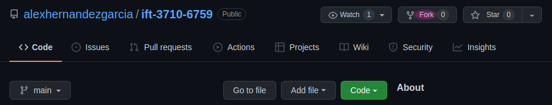
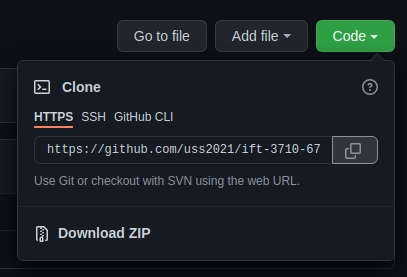
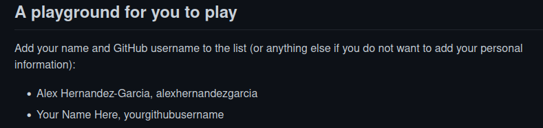

name: title
class: title, middle

## IFT 3710/6759
## Projets (avancés) en apprentissage automatique

### .gray224[January 14th, 2022 - Session 2]
### .gray224[Git tutorial]

.center[
<a href="http://www.umontreal.ca/"></a>
]
<br><br>
Alex Hernández-García (he/il/él)

.footer[[alexhernandezgarcia.github.io](https://alexhernandezgarcia.github.io/) | [alejandro.hernandez.garcia@umontreal.ca](mailto:alex.hernandez-garcia@mila.quebec) | [@alexhdezgcia](https://twitter.com/alexhdezgcia)] [](https://twitter.com/alexhdezgcia)

???

- The class is going to be a mix of lecture and hands-on

---

## Format of the class and objective

This class will be a mixture of lecture and hands-on tutorial, including breakout rooms to work in groups.

The .highlight1[goal] is that at the end of the class:

* You understand what Git and GitHub are.
* You understand why they are useful and important for software development, including ML projects.
* You are convinced to use Git.
* You know the basics of how Git works.
* You feel ready to use Git on your own and for the project.
* You know how to find resources on your own.

--

This class will _not_ make you a Git expert, because it is too complex a world to be explored in a couple of hours. 

???

- I am aware that many of you will already be familiar with Git, but the goal is to have everyone on the same page.
- Let's do a poll for me to have an idea of what's the general expertise.

---

count: false

## Format of the class and objective

This class will be a mixture of lecture and hands-on tutorial, including breakout rooms to work in groups.

The .highlight1[goal] is that at the end of the class:

* You understand what Git and GitHub are.
* You understand why they are useful and important for software development, including ML projects.
* You are convinced to use Git.
* You know the basics of how Git works.
* You feel ready to use Git on your own and for the project.
* You know how to find resources on your own.

Go to [www.menti.com](https://www.menti.com) and use the code **7952 9320** or click on:

.center[[https://www.menti.com/c6ywgxbwx1](https://www.menti.com/4g7gkky6pf)]

???

- Menti: https://www.mentimeter.com/s/8fe2d63a57cf5448e7fae357984fe9cd/735e5af81288

---

## What is Git?

Git is a [version control system](https://en.wikipedia.org/wiki/Version_control) (VCS).

--

#### And what is _version control_?

A class of systems to efficiently manage the changes to software, websites, documents, etc. By using a version control, it is possible to do the following and more:

* Revert files to older versions.
* Compare changes over time.
* Work on new features without touching the _official_ version.
* Collaborate with distributed teams (with _centralised_ or _distributed_ version control). 
* Have your files securely backed up (with _distributed_ version control).

--

_Another example of VCS is Subversion or SVN_.

---

## What is Git?
### A stream of snapshots

.context[Git is a version control system]

.center[]

Git thinks of its data like a series of snapshots of a miniature filesystem, unlike other version control systems, which are _delta-based_.

.references[Source: Pro Git book, [1.3 Getting Started - What is Git?](https://git-scm.com/book/en/v2/Getting-Started-What-is-Git%3F)]

---


## What is GitHub

GitHub (Github, Inc.) is the company - now a subsidiary of Microsoft - that manages and provides the internet service around Git.

GitHub is extremely popular among software developers, computer scientists, etc. 

--

.highlight1[If you do not have a GitHub account, this is the time to make one]:

.center[[github.com/signup](https://github.com/signup)]

---

## Installing Git

There exist multiple Graphical User Interface flavours to work with Git, and you are welcome to use them it that suits you. However, the .highlight1[command line] version is:

* Common to all systems
* Complete
* Probably the best way to learn

--

What is everyone's expertise with the command line?

Go to [www.menti.com](https://www.menti.com) and use the code **3319 3834** or click on:

.center[[www.menti.com/c6ywgxbwx1](https://www.menti.com/c6ywgxbwx1)]

???

- Menti: https://www.mentimeter.com/s/d754649fdc408d3aafc64ff3822cd386/43b504992452

---

count: false

## Installing Git

There exist multiple Graphical User Interface flavours to work with Git, and you are welcome to use them it that suits you. However, the .highlight1[command line] version is:

* Common to all systems
* Complete
* Probably the best way to learn

.highlight1[If you do not have Git installed in your computer, this is the time for it:]

.center[[github.com/git-guides/install-git](https://github.com/git-guides/install-git)]

---

## Configuring Git

If this is the first time you are using Git, it is worth taking a few minutes to set up your Git environment. Follow [this guide](https://git-scm.com/book/en/v2/Getting-Started-First-Time-Git-Setup) to set up your Git:

.center[[https://git-scm.com/book/en/v2/Getting-Started-First-Time-Git-Setup](https://git-scm.com/book/en/v2/Getting-Started-First-Time-Git-Setup)]

--

To view all your settings:

``` bash
$ git config --list --show-origin
```

--

To set your name and email:

``` bash
$ git config --global user.name "Alex Hernandez-Garcia"
$ git config --global user.email alex.hernandez-garcia@mila.quebec
```
--

To set your preferred editor:

``` bash
$ git config --global core.editor vim
```

---

## GitHub repositories

The concept of a _repository_ is central to Git and GitHub. We can think of a repository as the collection of files and directories that are part of a project. In a computer, a repository would be associated to a directory or folder. GitHUb repositories are linked to URLs, and they can be _public_ or _private_.

--

### Fork

A fork is a copy of a repository. Forking a repository allows you to freely experiment with changes without affecting the original project. .cite[[(read more)](https://docs.github.com/en/get-started/quickstart/fork-a-repo)]

--

Go to [https://github.com/alexhernandezgarcia/ift-3710-6759](https://github.com/alexhernandezgarcia/ift-3710-6759) on your browser and fork the repository.

.center[]

---

## GitHub repositories
### Cloning a repository

_Cloning_ a repository means making a **local copy** in your machine. You may think of cloning as _downloading_ both the files and the Git "metadata" of an online repository.

--

From your fork - the page of the repository in your GitHub account - copy the link and clone it into your computer using the command line:

.left-column-33[
.center[]
]
.right-column-66[
``` bash
$ cd <wherever-you-want-to-clone-the-repository>
$ git clone https://github.com/<account>/ift-3710-6759.git
$ cd ift-3710-6759/
$ ls -l
```
]

---

## Git in more detail
### The three states

In your local repository, Git has three main states that your files can reside in:

* `modified`: you have changed the file but have not committed it to your database yet.
* `staged`: you have marked a modified file in its current version to go into your next **commit** snapshot.
* `committed`: the data is safely stored in your local database.

.center[]

.references[Source: Pro Git book, [1.3 Getting Started - What is Git?](https://git-scm.com/book/en/v2/Getting-Started-What-is-Git%3F)]

---

## Git (basic) workflow
### 1. `git status`

.context["Basic" workflow: the simplest use case, without collaborators]

`git status` tells us which files are in which state. It is a good practice to run this command often, especially during the learning phase, to keep track of what is going on in our repository.

It may take you a while to understand all the information from `git status`, but you will usually find the information you need. 

--

This is what you should see in a freshly cloned repository:

``` bash
$ git status
On branch main
Your branch is up-to-date with 'origin/main'.

nothing to commit, working tree clean
```

---

## Git (basic) workflow
### 2. Work on your project

.context["Basic" workflow: the simplest use case, without collaborators]

.highlight1[Edit `README.me` with your favourite editor by adding your name to the list.]

.center[]

--

After _modifying_ a file, `git status` will prompt something new and informative:

``` bash
On branch main
Your branch is up-to-date with 'origin/main'.

Changes not staged for commit:
  (use "git add <file>..." to update what will be committed)
  (use "git restore <file>..." to discard changes in working directory)
        modified:   README.md

no changes added to commit (use "git add" and/or "git commit -a")
```

---

## Git (basic) workflow
### 3. `git add`

.context["Basic" workflow: the simplest use case, without collaborators]

 _Adding_ a file means to _stage_ a change, in Git's vocabulary. Changes may be a modification to a file in the repository or _adding_ a new file to be tracked. It can be seen as a pre-step to _really_ saving the changes to the repository. This may sound complicated now, but [there are good reasons for it](https://git-scm.com/book/en/v2/Git-Basics-Recording-Changes-to-the-Repository). Add `README.md`:

``` bash
$ git add README.md
```

--

Run `git status` again to see what changed. 

``` bash
On branch main
Your branch is up-to-date with 'origin/main'.

Changes to be committed:
  (use "git restore --staged <file>..." to unstage)
        modified:   README.md
```

Now `README.md` is under _Changes to be commited_. What does that mean?

---

## Git (basic) workflow
### 4. `git commit`

.context["Basic" workflow: the simplest use case, without collaborators]

Now we could continue working, adding more changes, perhaps in other files, and eventually we would like to _commit_ our changes to the repository so that the version control can keep track of them. .highlight1[_Commiting_ changes means to save a snapshot of the current state of our repository], with a time stamp and all the necessary things that will allow us to go back to this point in the future, and many other important possible actions. To commit our changes, we have to add a message describing the changes. This is the syntax:

``` bash
$ git commit -m "add name to list"
```

You may want to run `git status` again.

---

## Git (basic) workflow
### The life cycle of Git files

Files in a Git repository can be in one of these two stages:

* `tracked`: files that were in the last snapshot, as well as any newly staged files; they can be `unmodified`, `modified`, or `staged`. In short, tracked files are files that Git knows about.
* `untracked`: everything else.

As you edit, add, stage, commit, or remove files, they can be at different states:

.center[]

.references[Source: Pro Git book, [2.2 Git Basics - Recording Changes to the Repository](https://git-scm.com/book/en/v2/Git-Basics-Recording-Changes-to-the-Repository)]

---

## Git (basic) workflow
### 5. `git push`

.context["Basic" workflow: the simplest use case, without collaborators]

All we have done now has been local, meaning that we have not yet posted our changes online so that others or ourselves can access it. We could continue working and adding and committing our changes, or we can _push_ the history of our changes now. The default way of pushing is simply:

``` bash
$ git push
```

You may be asked for your username and credentials at this point.

Now the repository should be online! Go to your GitHub account in the browser and look for the URL of your repository.

---

## Git collaboration flow
### Pull Requests (PR)

.context[So far, you have forked a repository, made some changes, commit them to your repository and push them online.]

PRs let you tell others about changes you have pushed to a **branch** in a repository on GitHub. Typically, after a PR is open, someone in the team will review the changes, discuss issues and eventually merge the branches.

In our case, you may want to merge the changes you made in the branch `main` of _your_ repository into the branch `main` of _my_ repository:

1. Go to _my_ repository on GitHub: [https://github.com/alexhernandezgarcia/ift-3710-6759](https://github.com/alexhernandezgarcia/ift-3710-6759)
2. Click on "Pull requests" > "New pull request" (in green) > "Compare across forks"
3. Set up the merge:
    * base repository: `alexhernandezgarcia/ift-3710-6759` `base:main`
    * head repository: `your-account/ift-3710-6759` `compare:main`
4. Inspect the changes and click on "Create pull request" (in green)

.references[To read more: [GitHub docs](https://docs.github.com/en/pull-requests/collaborating-with-pull-requests/proposing-changes-to-your-work-with-pull-requests/about-pull-requests)]

???

- Illustrate with my repo (Frida Kahlo changes)
- Merge during the break

---

name: title
class: title, middle

## IFT 3710/6759
## Projets (avancés) en apprentissage automatique

### .gray224[January 14th, 2022 - Session 2]
### .gray224[Git tutorial]

.bigger[.bigger[.highlight1[Break: 10 minutes]]]

.center[
<a href="http://www.umontreal.ca/"></a>
]

Alex Hernández-García (he/il/él)

.footer[[alexhernandezgarcia.github.io](https://alexhernandezgarcia.github.io/) | [alejandro.hernandez.garcia@umontreal.ca](mailto:alex.hernandez-garcia@mila.quebec) | [@alexhdezgcia](https://twitter.com/alexhdezgcia)] [](https://twitter.com/alexhdezgcia)

---

## Branching
### A better workflow

.context[So far, we have only worked within the `main` branch]

Branching means you diverge from the main line of development and continue to do work without messing with that main line. Branching in Git is a lightweight process and it is one of its main features.

--

.left-column-66[
.center[]
]
.right-column-33[
* `HEAD` is a reference to the last commit in the current branch.
* `v1.0` and `master` are branches
* `98ca9`, `34ac2` and `f30ab` are commits
]

???

Mention that the name master should not be used for its connotation of master and slave. main is preferred.

---

## Branching
### A better workflow

.left-column[
To see your branches:

``` bash
$ git branch
```

To create a new branch:

``` bash
$ git branch feature-a
```

To switch branches:

``` bash
$ git checkout feature-a
```

To create and switch branches:

``` bash
$ git branch -b feature-a
```
]

--

.right-column[
To merge branch `feature-a` into branch `main`:

``` bash
$ git checkout main
$ git merge feature-a
```

Merging branches is sometimes a smooth action, but conflicts can arise that need to be resolved. To read more: [Pro Git: Basic Branching and Merging](https://git-scm.com/book/en/v2/Git-Branching-Basic-Branching-and-Merging)
]

---

## Git collaborative workflow
### A summary

1. Fork the repository you are interested in into your account.
2. Clone the forked repository into your computer.
3. Create a new branch to make your changes.
4. Make some commits to improve the project.  
5. Push your changes into your copy (fork) of the repository.
6. Open a pull request to merge your branch into another branch or into the original repository.
7. Discuss, and optionally continue committing changes.  
8. The project owner merges or closes the pull request.  
9. [Sync the updated master back to your fork](https://docs.github.com/en/pull-requests/collaborating-with-pull-requests/working-with-forks/syncing-a-fork#syncing-a-fork-from-the-command-line).  

.references[To read more: Pro Git book, [5.2 Distributed Git - Contributing to a Project](https://git-scm.com/book/en/v2/Distributed-Git-Contributing-to-a-Project)]

---

name: title
class: title, middle

## IFT 3710/6759
## Projets (avancés) en apprentissage automatique

### .gray224[January 14th, 2022 - Session 2]
### .gray224[Git tutorial]

.bigger[.bigger[.highlight1[Questions, doubts, concerns, comments?]]]

.center[
<a href="http://www.umontreal.ca/"></a>
]

Alex Hernández-García (he/il/él)

.footer[[alexhernandezgarcia.github.io](https://alexhernandezgarcia.github.io/) | [alejandro.hernandez.garcia@umontreal.ca](mailto:alex.hernandez-garcia@mila.quebec) | [@alexhdezgcia](https://twitter.com/alexhdezgcia)] [](https://twitter.com/alexhdezgcia)

???

---

## Work in breakout rooms

Ideas to play around and gain expertise:

* Create new branches in your repository, make changes and merge branches.
* Create your own repository.
* Fork each other's repository and open pull requests, review and merge the changes.
* Add each other as collaborators of your repository
* Try to make conflicting changes across branches and resolve them.
* [Sync an upstream repository](https://docs.github.com/en/pull-requests/collaborating-with-pull-requests/working-with-forks/syncing-a-fork#syncing-a-fork-from-the-command-line).  

