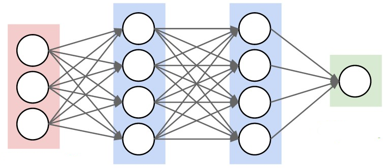
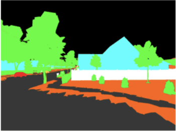
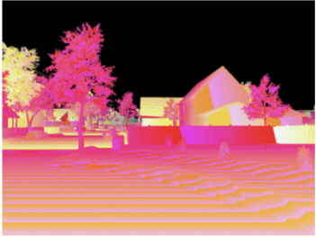
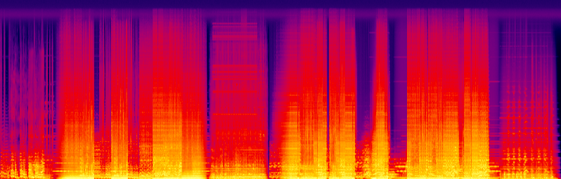
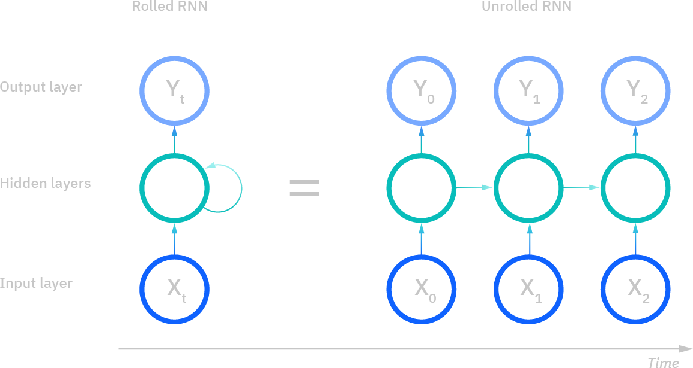
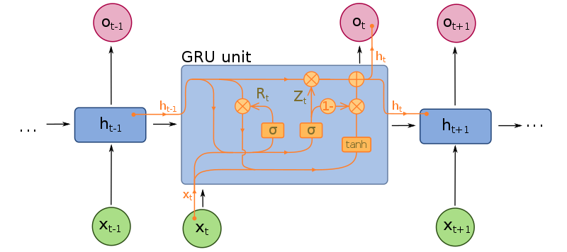
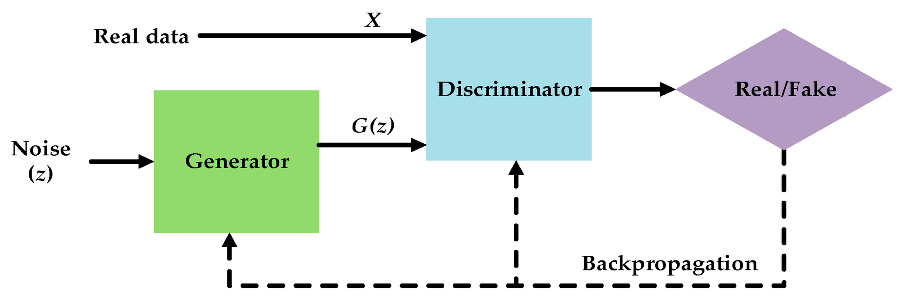

name: title
class: title, middle

## IFT 3710/6759
## Projets (avancés) en apprentissage automatique

### .gray224[January 28th, 2022 - Session 6]
### .gray224[Deep learning review]

.center[

]
  
Alex Hernández-García (he/il/él)

.footer[[alexhernandezgarcia.github.io](https://alexhernandezgarcia.github.io/) | [alejandro.hernandez.garcia@umontreal.ca](mailto:alex.hernandez-garcia@mila.quebec) | [@alexhdezgcia](https://twitter.com/alexhdezgcia)] 

---

## Format of the class and objective

Like the previous sessions, this class is fundamentally a lecture with an emphasis on questions and answers.

The .highlight1[goal] is that by the end of the class:

* You acquire a deeper understanding of the intuitions of deep learning.
* You have a fresh overview of the core available methods.
* You learn some deep learning tricks and good practices.
* You have a chance to ask questions.

---

## Deep learning
### Definitions and terminology

We can consider .highlight1[deep learning] a class or family of machine learning methods that compute hierarchical .highlight1[representations] of the inputs. That is, the input data is transformed into new representations, which are the inputs to new representations, and so on. .highlight1[Deep learning is about learning representations].

<figure style="text-align: center">
	
  <figcaption style="text-align: center; font-size: small">Adapted from https://cs231n.github.io</figcaption>
</figure>

???

* Mention the name of ICLR

---

count: false

## Deep learning
### Definitions and terminology

The simplest possible deep learning algorithm is a .highlight1[multi-layer] perceptron (MLP) .cite[(Rosenblatt, 1958)], a network of perceptrons.

The notion of a _network_ and the inspiration by biological _neurons_ yields the term .highlight1[artificial neural networks]. Today, this term is used to refer to both simple MLPs or generally more complex deep learning algorithms.

<figure style="text-align: center">
	
  <figcaption style="text-align: center; font-size: small">Adapted from https://cs231n.github.io</figcaption>
</figure>

.references[Rosenblatt, F (1958). The Perceptron: a probabilistic model for information storage and organization in the brain. Psychological Review.]

---

## Deep learning
### Why deep?

The universal approximation theorem tells us that a single-layer MLP can approximate anything to arbitrary precision. Why do we need _depth_?

--

Though seemingly simple, the answer to this question is multifaceted. Some insights:

* Deeper MLPs can achieve the same precision with exponentially fewer neurons. 
* Depth allows for compositionality, a key aspect of human cognition.

---

## Deep learning
### Re-adjusting the promises

> "_\[.highlight1[Hand designing] good feature extractors, .highlight1[engineering skill] and .highlight1[domain expertise]\] **can all be avoided** if good features can be learned automatically using a general-purpose learning procedure. .highlight1[This is the key advantage of deep learning]._" .smaller[(highlighting mine)]
.right[.cite[LeCun, Bengio and Hinton. (2015)]]

.references[
LeCun, Bengio and Hinton (2015). Deep learning. Nature
]

--

Deep learning is an incredibly powerful tool, but:

* It does not provide a "general-purpose learning procedure", or so do other ML algorithms.
* Hand-design, engineering skill and domain expertise are typically required for successful deep learning applications.

---

## Deep learning
### The actual advantages

Shallow machine learning models have several limitations:

* They struggle with large quantities of data.
* They require good inputs.

--

Deep learning methods excel in some important aspects:

* Training neural networks .highlight[scales nicely with the amount of data].
* The fundamental ideas of deep learning are .highlight[extremely flexible]:
    * Good new representations can be learnt from a variety of raw inputs.
    * Network architectures can be extended and adapted to incorporate a variety of .highlight1[inductive biases].

--

This flexibility has given rise to a large family of different methods and architectures, tailored for different types of data or applications. Mastering them requires quite specific engineering skills and domain expertise.

---

## Convolutional neural networks (CNN)
### Image data

.right-column[
.center[]
<figure style="text-align: center">

  <figcaption style="text-align: center; font-size: small">Source: https://cs231n.github.io</figcaption>
</figure>
]

.left-column[
* Inductive bias: group equivariance over space.
* The same convolutional operation is valid on all parts of an image.
* This reduces the number of parameters and speeds up training.
* Internal representations can be thought as _feature maps_ (images).

.center[]
]

???

* Mention the design parameters: kernel size, input channels, output channels, stride, padding, number of layers, etc.

---

## Convolutional neural networks (CNN)
### Popular architectures

* [AlexNet](https://proceedings.neurips.cc/paper/2012/file/c399862d3b9d6b76c8436e924a68c45b-Paper.pdf): relevant for historical reasons.
* [All-CNN](https://arxiv.org/abs/1412.6806): only convolutional layers, high parameter efficiency, great for prototyping.
* [VGG](https://arxiv.org/abs/1409.1556): very popular, but very large.
* [Inception](https://arxiv.org/abs/1512.00567): a convoluted convolutional neural network.
* [ResNet](https://arxiv.org/abs/1512.03385): residual blocks for training very deep networks, still very popular.
* [Wide ResNet](http://www.bmva.org/bmvc/2016/papers/paper087/index.html): rather wide than deep ResNet.
* [DenseNet](https://arxiv.org/abs/1608.06993): dense connection across layers.

---

## Convolutional neural networks
### Beyond image classification

.context[The ideas of deep learning are extremely flexible]

The same principle of convolutional layers can be applied to any tasks involving images, such as semantic segmentation, depth estimation, or even image-like data, such as sound spectrograms.

However, for good results, each task will require very specific techniques, tricks and engineering.

.center[]

.center[]

---

## Recurrent neural networks (RNN)
### Sequential data

* Inductive bias: equivariance across _time_.
* Neurons of a recurrent neural network implement recurrent connections.
* Inductive bias: memory matters.
* The values of previous (and later) parts of a sequence influence the current value.

<figure style="text-align: center">

  <figcaption style="text-align: center; font-size: small">Adapted from: https://www.ibm.com/cloud/learn/recurrent-neural-networks</figcaption>
</figure>

---

## Recurrent neural networks (RNN)
### Variants

Vanilla RNNs are not stable, especially for longer sequences. In practice, more sophisticated versions are used:

.left-column[
.highlight1[Long short-term memory (LSTM)]

.center[]
]

.right-column[
.highlight1[Gated recurrent unit (GRU)]

.center[]
]

Both LSTMs and GRUs implement additional gates to regulate the flow of information and let long-term gradients flow unchanged.

???

Mention Transformers

---

## Graph neural networks (GNN)
### Graph data

* GNNs are designed to process graph structures: complex topological structure and arbitrary size.
* Inductive bias: equivariance across entities and relations.
* Every node in the graph receives information about its neighbours.
* Every node in the implements a neural network to represent the structure of its neighbourhood. 
* Graph neural networks may be seen as a generalisation of convolutional networks.

<figure style="text-align: center">

  <figcaption style="text-align: center; font-size: small">Source: snap-stanford.github.io/cs224w-notes</figcaption>
</figure>

---

## Generative adversarial networks (GAN)

Generative adversarial networks are a good example of how the capabilities of deep neural networks can be combined to create new algorithms.

* GANs are generative models: meant to learn probability distribution of the data, rather than a conditional probability.
* GANs consist of two neural networks that context each other in a zero-sum game.
	* A discriminator is train to tell apart real or _fake_ data.
	* A generator aims to fool the discriminator with _fake_ data.

.center[]

---

name: title
class: title, middle

## IFT 3710/6759
## Projets (avancés) en apprentissage automatique

### .gray224[January 28th, 2022 - Session 6]
### .gray224[Deep learning review]

.bigger[.bigger[.highlight1[Break: 10 minutes]]] 

.center[

]

Alex Hernández-García (he/il/él)

.footer[[alexhernandezgarcia.github.io](https://alexhernandezgarcia.github.io/) | [alejandro.hernandez.garcia@umontreal.ca](mailto:alex.hernandez-garcia@mila.quebec) | [@alexhdezgcia](https://twitter.com/alexhdezgcia)] 

---

## Stochastic Gradient Descent (SGD)

Together with [backpropagation](https://en.wikipedia.org/wiki/Backpropagation), stochastic gradient descent (SGD) is the workhorse of deep learning: it is the optimisation algorithm that will enable learning.

In practice, in deep learning, we typically use a variant of .highlight[mini-batch stochastic gradient descent], which is a generalisation of _stochastic gradient descent_, which is a particular case of _batch gradient descent_:

$$\theta^{t+1} = \theta^t - \lambda \cdot \nabla J(\theta; x^{i:i+B}, y^{i:i+B})$$

--

Two crucial parameters:

* $\lambda$: learning rate
* $B$: batch size

--

Variants and extensions of SGD: momentum, Nesterov, Adagrad, Adadelta, Adam, RMSProp...

.references[
Ruder, S. (2016). [An overview of gradient descent optimization algorithms](https://arxiv.org/abs/1609.04747). arXiv
]

---

## Deep learning in practice
### Regularisation

Definition from the previous class: any modification applied to a learning algorithm that helps the model generalise better.

With this definition, many techniques can be considered regularisation. It is worth considering a useful distinction:	

* .highlight1[Explicit regularization techniques] are those techniques which reduce the .highlight1[representational capacity] of the model class they are applied on.
* .highlight1[Implicit regularization] is the reduction of the generalization error or overfitting provided by means other than explicit regularization techniques.

.references[
Hernandez-Garcia and König (2018). [Data augmentation instead of explicit regularization](https://arxiv.org/abs/1806.03852). arXiv
]

???

* That is, given a model class H0, for instance a neural network architecture, the introduction of explicit regularization will span a new hypothesis set H1, which is a proper subset of the original set, that is H1 ( H0.
* Elements that provide implicit regularization do not reduce the representational capacity, but may affect the effective capacity of the model: the achievable set of hypotheses given the model, the optimization algorithm, hyperparameters, etc.  

---

## Explicit regularisation
### Dropout and weight decay

.highlight1[Weight decay]:

Weight decay is a classical parameter norm penalty, as used in traditional machine learning algorithms:

$$\hat{J}(\theta; X, y) = J(\theta; X, y) + \lambda\Omega(\theta)$$

.highlight1[Dropout]:

Dropout _turns off_ a random subset of neurons during training in order to prevent overfitting and improve robustness to noise.

--

Both weight decay and dropout are included in a majority of published models (but see next slide!)

---

## Data augmentation

Data augmentation refers to the techniques that synthetically and dynamically expand a data set by applying transformations on the existing examples, thus augmenting the amount and variability of the available data. 

.center[

]

--

Data augmentation is an good example of how the flexibility allows to efficiently incorporate inductive biases and domain knowledge via the data.

Data augmentation provides much larger generalisation gains than explicit regularisation, and often provides better results when used without weight decay and dropout.

.references[
Hernandez-Garcia and König (2018). [Data augmentation instead of explicit regularization](https://arxiv.org/abs/1806.03852). arXiv
]

---

## Monitoring during training

Always, **always** log at least the training and validation loss, and ideally other metrics. Monitoring the learning curves can save a lot of time and provide valuable insights.

.center[]

---

name: title
class: title, middle

## IFT 3710/6759
## Projets (avancés) en apprentissage automatique

### .gray224[January 28th, 2022 - Session 6]
### .gray224[Deep learning review]

.bigger[.bigger[.highlight1[Questions, doubts, concerns, comments?]]]

.center[

]

Alex Hernández-García (he/il/él)

.footer[[alexhernandezgarcia.github.io](https://alexhernandezgarcia.github.io/) | [alejandro.hernandez.garcia@umontreal.ca](mailto:alex.hernandez-garcia@mila.quebec) | [@alexhdezgcia](https://twitter.com/alexhdezgcia)] 
