name: title
class: title, middle

## IFT 3710/6759
## Projets (avancés) en apprentissage automatique

#### .gray224[3 février 2023 - Session 8]
### .gray224[Visualisation des données]

.smaller[Slides disponibles sur [alexhernandezgarcia.github.io/teaching/mlprojects23/slides/20230203-dataviz](https://alexhernandezgarcia.github.io/teaching/mlprojects23/slides/20230203-dataviz)]

.center[

]
Alex Hernández-García (he/il/él)

.footer[[alexhernandezgarcia.github.io](https://alexhernandezgarcia.github.io/) | [alex.hernandez-garcia@mila.quebec](mailto:alex.hernandez-garcia@mila.quebec)] 
.footer[[@alexhg@scholar.social](https://scholar.social/@alexhg)  | [@alexhdezgcia](https://twitter.com/alexhdezgcia) ]

???

- The class is going to be a mix of lecture and demonstration

---

## Format of the class and objective

This class will be a combination of lecture and demonstration.

The .highlight1[goal] is that by the end of the class:

* You have learnt the core concepts of data visualisation.
* You know some ingredients that make a _good_ figure.
* You know some ingredients that make a _bad_ figure.

---

## Why does data visualisation matter?

.center[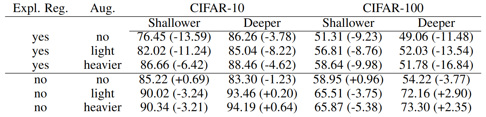]

--

.center[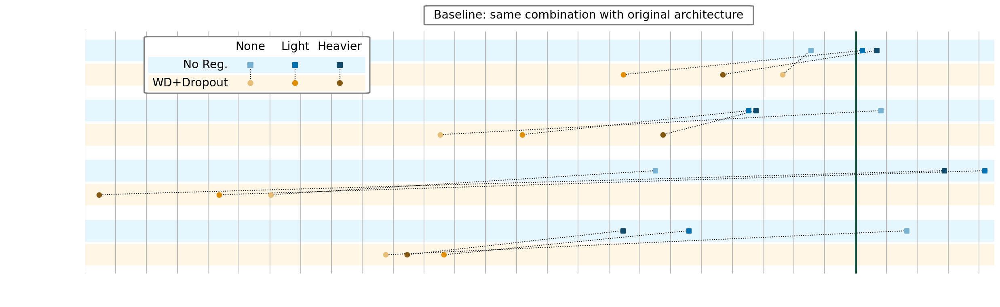]

---

count: false

## Why does data visualisation matter?

.left-column[
.center[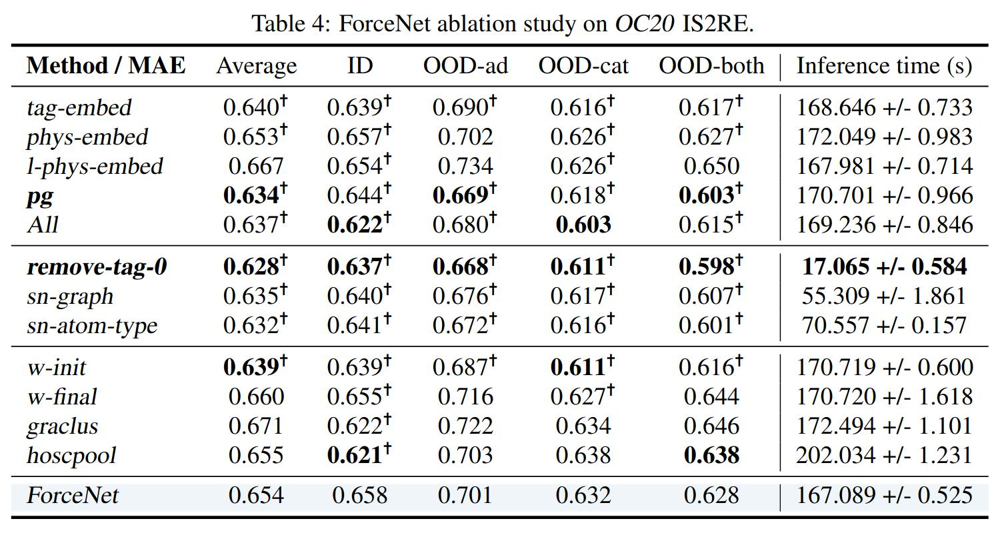]
.center[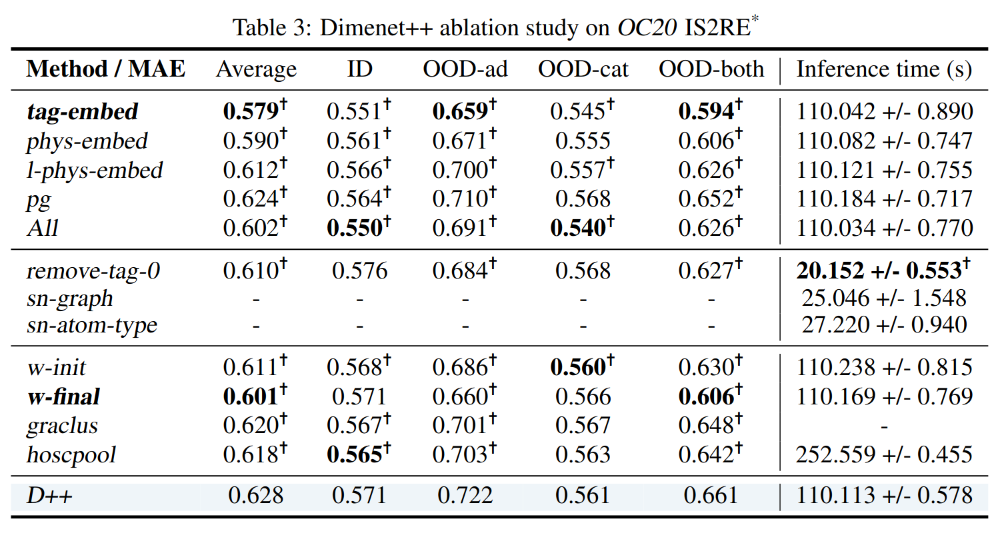]
.center[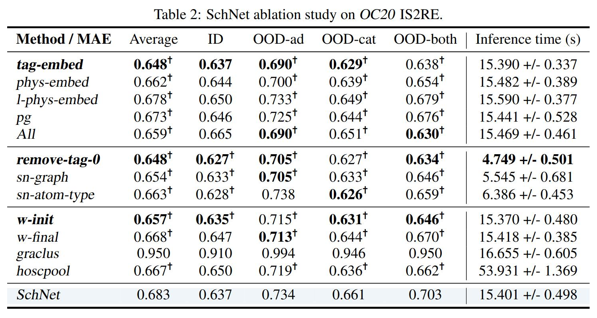]
]

.smaller[
.references[
Duval et al. (2022). [PhAST: Physics-Aware, Scalable, and Task-specific GNNs for Accelerated Catalyst Design](https://arxiv.org/abs/2211.12020). arXiv 2211.12020.
]
]

--

.right-column[
.center[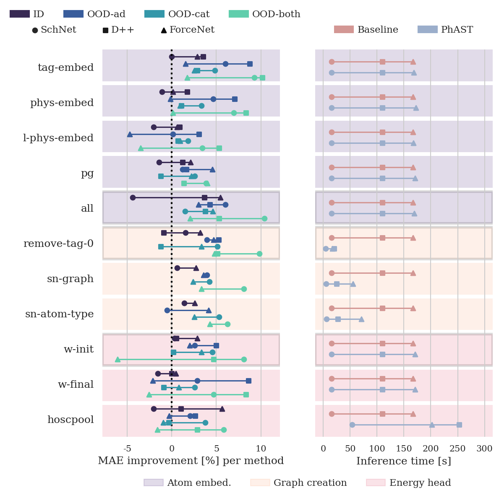]
]

---

count: false

## Why does data visualisation matter?

.center[]

* Figures in scientific publications and technical reports are often the .highlight1[main support of the key results].
* Data visualisation has the potential of enabling the .highlight1[understanding] of complex and large numerical relationships .highlight1[at a glance]
* Figures can create a successful .highlight1[communication channel between you], the author of a complex data analysis, .highlight1[and your audience]: .highlight1[data visualisation is akin to a metaphor to convey a complex idea]

---

## General ideas

#### Common, but incorrect assumptions

* Readers read the abstract, introduction and methods before seeing the figures. 
* If I can interpret the figure, my readers can interpret the figures too. 

--

#### Generally good ideas and indications 

* Many readers examine the figures first.
* Figures should stand on their own and be self-explanatory.
* Figures should be designed for a broad audience, not for yourself.
* A likely successful approach is:
    1. Identify the key messages.
    2. Draw visualizations about them .
    3. Write the paper or report around them.

.references[
Credit of these guidelines is owed to [Tracey Weissberger](https://twitter.com/T_Weissgerber), expert in data visualisation and scientific communication.
]

---

## Ten simple rules for better figures

.center[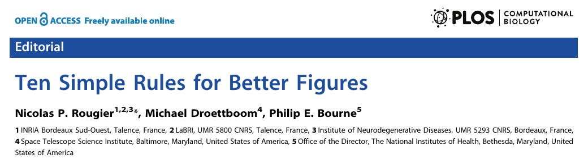]

.references[
Rougier et al. (2014). [Ten simple rules for better figures](https://journals.plos.org/ploscompbiol/article?id=10.1371/journal.pcbi.1003833). PLOS Computational Biology.
]

---

## Ten simple rules for better figures
### 1. Know your audience

> "\[I\]t is important to identify, as early as possible in the design process, the audience and the message the visual is to convey".

A figure should stand byself when seen by the target audience. It should contain all the relevant information the audience _needs_ to know. Different audiences know different things.

* Is the figure for yourself and collaborators?
* Is it for a specialised audience?
* Is it for the general public?

.references[
Rougier et al. (2014). [Ten simple rules for better figures](https://journals.plos.org/ploscompbiol/article?id=10.1371/journal.pcbi.1003833). PLOS Computational Biology.
]

---

## Ten simple rules for better figures
### 2. Identify your message

> "Only after identifying the message will it be worth the time to develop your figure".

.right-column[
<figure style="text-align: center">
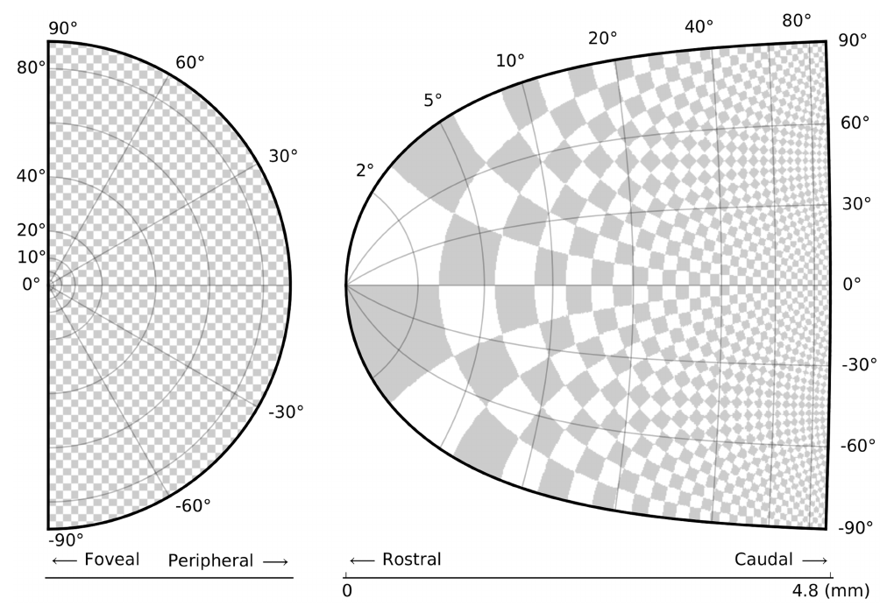
  <figcaption style="text-align: center; font-size: small">The superior colliculus (SC) is a brainstem structure at the crossroads of multiple functional pathway. There is an extreme foveal magnification in the projection from the retina onto the SC. .cite[(Rougier et al., 2014)]</figcaption>
</figure>
]

.left-column[
* How can a figure simplify the main message, which is otherwise likely to be hard to express in words or in a table with numbers?
* A good figure do not only _represent_ the data, but is at the service of the main message.
]

.references[
Rougier et al. (2014). [Ten simple rules for better figures](https://journals.plos.org/ploscompbiol/article?id=10.1371/journal.pcbi.1003833). PLOS Computational Biology.
]

---

## Ten simple rules for better figures
### 3. Adapt the figure to the support medium

> "Each \[medium (a poster, a monitor, a projection screen, a PDF)\] represents different physical sizes for the figure, but more importantly, each of them also implies **different ways of viewing and interacting with the figure**".

<figure style="text-align: center">
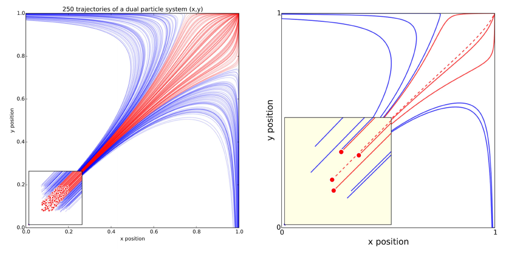
  <figcaption style="text-align: center; font-size: small">Different figures for different media. The figure on the left has been designed for a journal article; the figure on the right for an oral presentation .cite[(Rougier et al., 2014)]</figcaption>
</figure>

.references[
Rougier et al. (2014). [Ten simple rules for better figures](https://journals.plos.org/ploscompbiol/article?id=10.1371/journal.pcbi.1003833). PLOS Computational Biology.
]

???

* During a presentation, figures are display for a short time, and can be explained by the speaker
* Readers of an article have more time read a caption and understand more details from a figure.

---

count: false

## Ten simple rules for better figures
### 3. Adapt the figure to the support medium

> "Each \[medium (a poster, a monitor, a projection screen, a PDF)\] represents different physical sizes for the figure, but more importantly, each of them also implies **different ways of viewing and interacting with the figure**".

.center[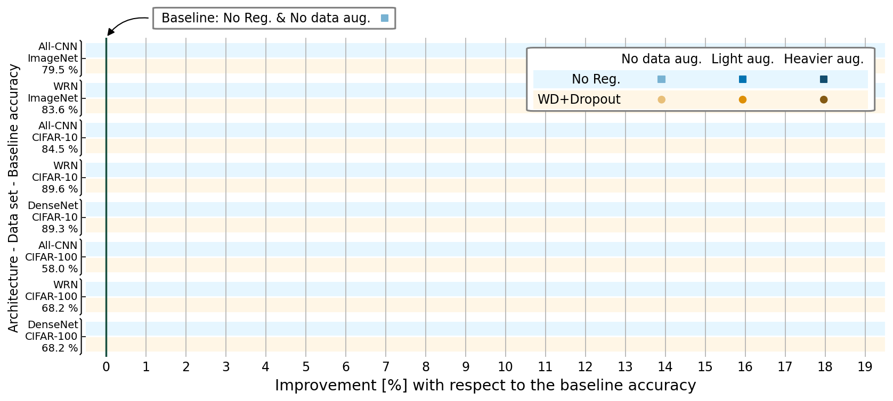]

---

count: false

## Ten simple rules for better figures
### 3. Adapt the figure to the support medium

> "Each \[medium (a poster, a monitor, a projection screen, a PDF)\] represents different physical sizes for the figure, but more importantly, each of them also implies **different ways of viewing and interacting with the figure**".

.center[]

---

count: false

## Ten simple rules for better figures
### 3. Adapt the figure to the support medium

> "Each \[medium (a poster, a monitor, a projection screen, a PDF)\] represents different physical sizes for the figure, but more importantly, each of them also implies **different ways of viewing and interacting with the figure**".

.center[]

---

count: false

## Ten simple rules for better figures
### 3. Adapt the figure to the support medium

> "Each \[medium (a poster, a monitor, a projection screen, a PDF)\] represents different physical sizes for the figure, but more importantly, each of them also implies **different ways of viewing and interacting with the figure**".

.center[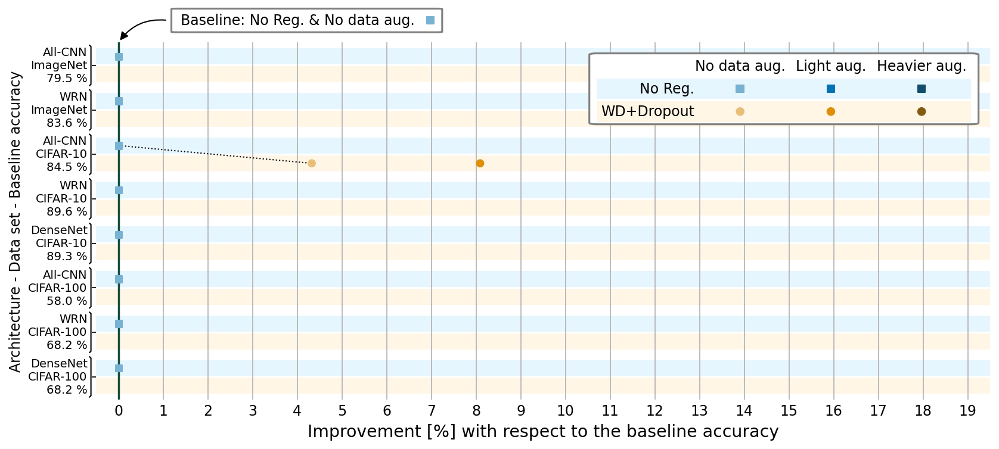]

---

count: false

## Ten simple rules for better figures
### 3. Adapt the figure to the support medium

> "Each \[medium (a poster, a monitor, a projection screen, a PDF)\] represents different physical sizes for the figure, but more importantly, each of them also implies **different ways of viewing and interacting with the figure**".

.center[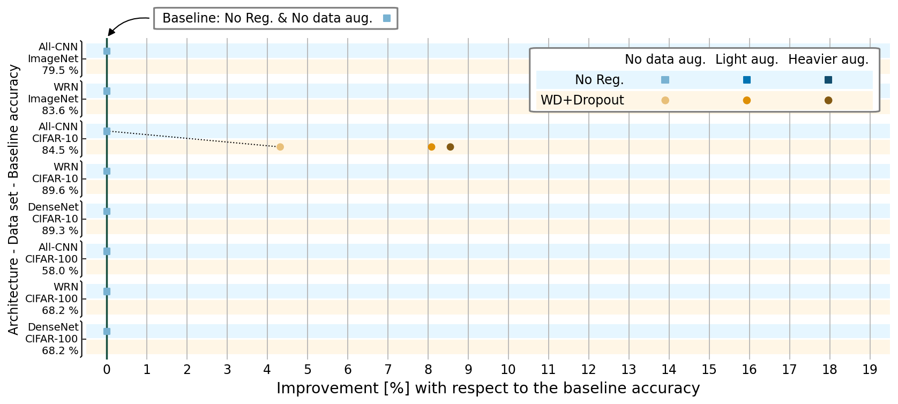]

---

count: false

## Ten simple rules for better figures
### 3. Adapt the figure to the support medium

> "Each \[medium (a poster, a monitor, a projection screen, a PDF)\] represents different physical sizes for the figure, but more importantly, each of them also implies **different ways of viewing and interacting with the figure**".

.center[]

---

count: false

## Ten simple rules for better figures
### 3. Adapt the figure to the support medium

> "Each \[medium (a poster, a monitor, a projection screen, a PDF)\] represents different physical sizes for the figure, but more importantly, each of them also implies **different ways of viewing and interacting with the figure**".

.center[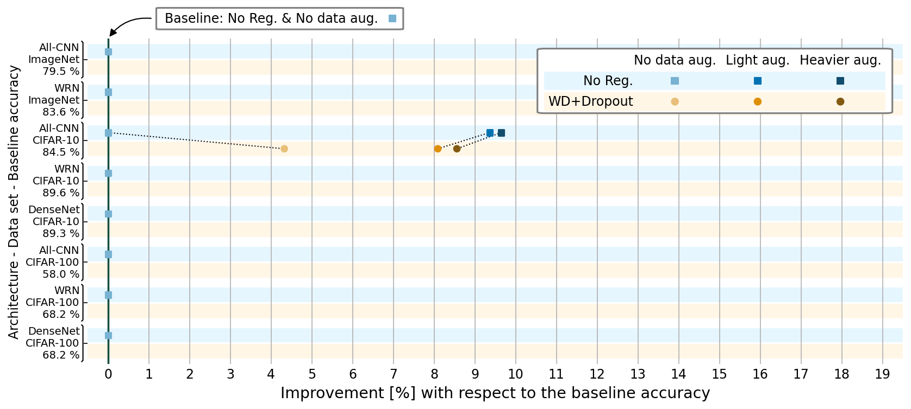]

---

count: false

## Ten simple rules for better figures
### 3. Adapt the figure to the support medium

> "Each \[medium (a poster, a monitor, a projection screen, a PDF)\] represents different physical sizes for the figure, but more importantly, each of them also implies **different ways of viewing and interacting with the figure**".

.center[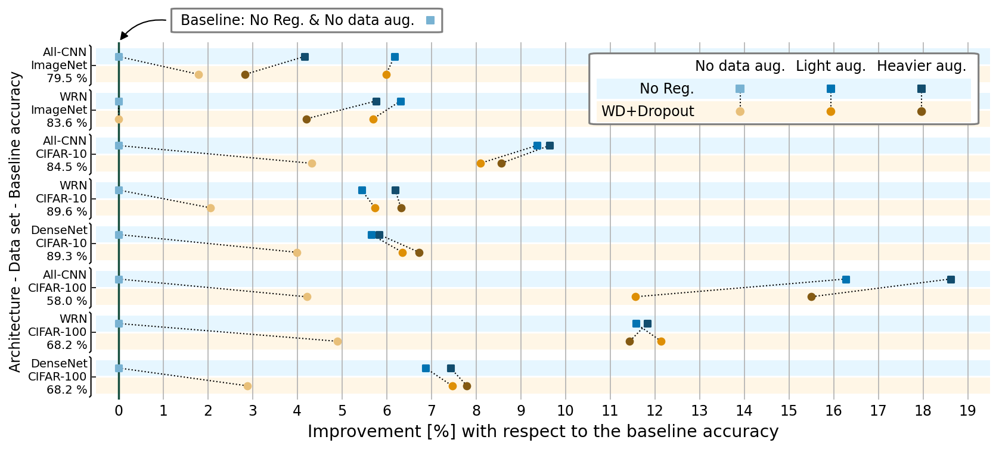]

---

## Ten simple rules for better figures
### 4. Captions are not optional

> "The caption explains how to read the figure and provides additional precision for what cannot be graphically represented".

* Figures can hardly explain everything by themselves.
* Captions support the images on being self-explanatory.
* Captions can further highlight the key message of the figure.

.references[
Rougier et al. (2014). [Ten simple rules for better figures](https://journals.plos.org/ploscompbiol/article?id=10.1371/journal.pcbi.1003833). PLOS Computational Biology.
]

---

## Ten simple rules for better figures
### 5. Do not trust the defaults

> "\[Default settings of software or libraries\] are good enough for any plot but they are best for none".

<figure style="text-align: center">
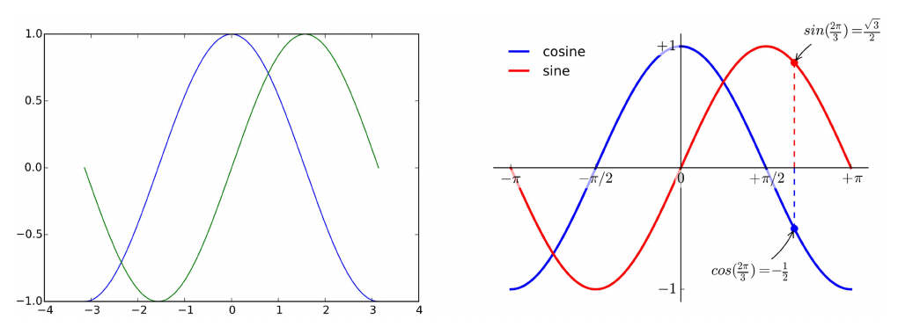
  <figcaption style="text-align: center; font-size: small">The default settings are clearly suboptimal for the plot on the left. Tuning the tick labels, the legend and labelling can greatly improve the figure.</figcaption>
</figure>

* Defaults are fine enough for _quick and dirty_ visualisation, but the final figures require careful design and optimisation.

.references[
Rougier et al. (2014). [Ten simple rules for better figures](https://journals.plos.org/ploscompbiol/article?id=10.1371/journal.pcbi.1003833). PLOS Computational Biology.
]

---

## Ten simple rules for better figures
### 6. Use colour effectively

> "\[C\]olor can be either your greatest ally or your worst enemy if not used properly".

.left-column[
<figure style="text-align: center">

  <figcaption style="text-align: center; font-size: small">Colour maps that are not perceptually linear can greatly distort the information.</figcaption>
</figure>
]

.right-column[
* Colour can be used to highlight elements of a figure.
* It is important to choose the right colour map.
* Colour blindness must be taken into account: 8 % of men and 0.4 % of women with Northern European ancestry experience congenital color deficiency.
]

.references[
* Rougier et al. (2014). [Ten simple rules for better figures](https://journals.plos.org/ploscompbiol/article?id=10.1371/journal.pcbi.1003833). PLOS Computational Biology.
* Crameri et al. (2020). [The misuse of colour in science communication](https://www.nature.com/articles/s41467-020-19160-7). Nature communications.
]

---

## Ten simple rules for better figures
### 7. Do not mislead the reader

> "\[If we rely on the automatic settings of your software it is easy to\] inadvertently misle\[a\]d your readers into visually believing something that does not exist in your data".

<figure style="text-align: center">
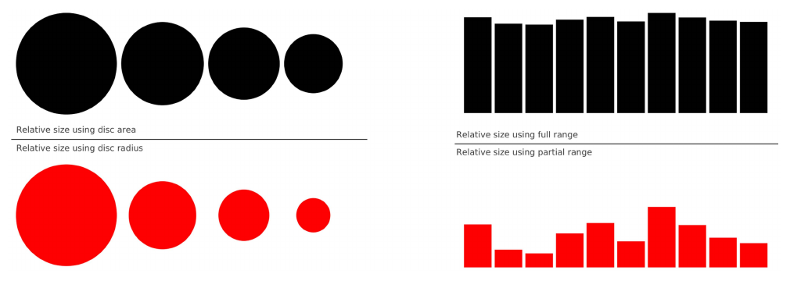
  <figcaption style="text-align: center; font-size: small"></figcaption>
</figure>

* Wrong choices also lead to misleading plots: avoid pie charts and 3D charts.
* As a rule of thumb, use the simplest possible plot.

.references[
* Rougier et al. (2014). [Ten simple rules for better figures](https://journals.plos.org/ploscompbiol/article?id=10.1371/journal.pcbi.1003833). PLOS Computational Biology.
]

---

## Ten simple rules for better figures
### 8. Avoid "chartjunk"

> "\[C\]hartjunk may include the use of too many colors, too many labels, gratuitously colored back- grounds, useless grid lines, etc.".

<figure style="text-align: center">
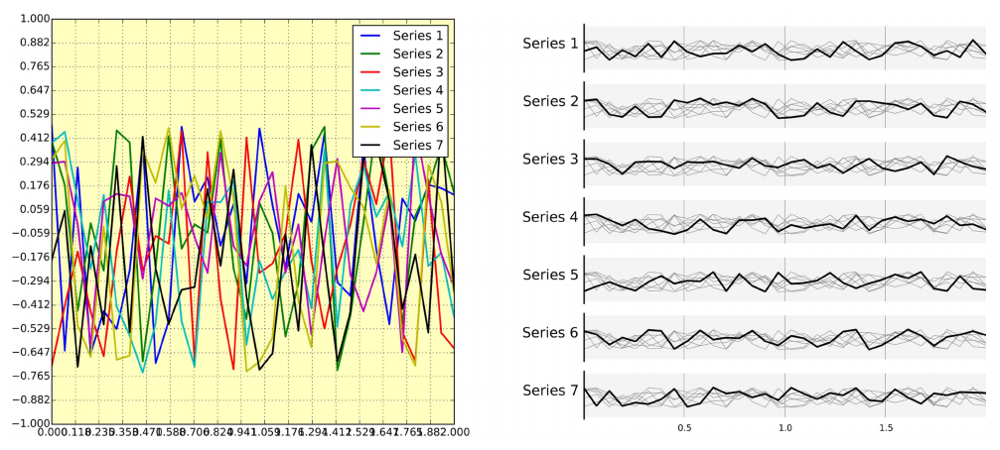
  <figcaption style="text-align: center; font-size: small"></figcaption>
</figure>

.references[
* Rougier et al. (2014). [Ten simple rules for better figures](https://journals.plos.org/ploscompbiol/article?id=10.1371/journal.pcbi.1003833). PLOS Computational Biology.
]

???

* Background colour in a plot is generally a bad idea

---

## Ten simple rules for better figures
### 9. Message trumps beauty

> "It is important to know \[the standards in each scientific domain\], because they facilitate a more direct comparison".

> "However, most of the time, you may need to design a brand-new figure, because there is no standard way of describing your research".

<figure style="text-align: center">
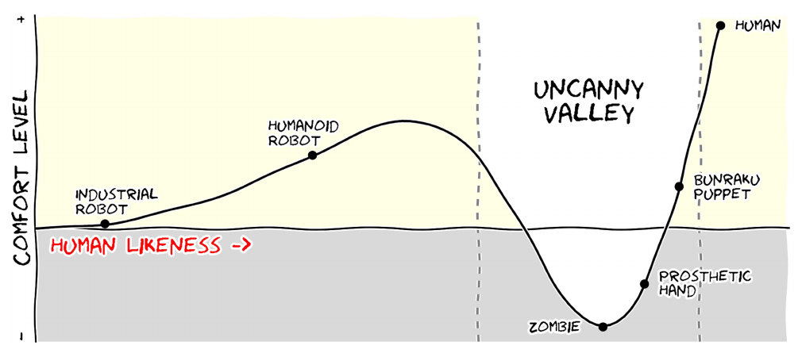
  <figcaption style="text-align: center; font-size: small">This figure is an extreme case where the message is particularly clear even if the aesthetic of the figure is
  questionable.</figcaption>
</figure>

.references[
* Rougier et al. (2014). [Ten simple rules for better figures](https://journals.plos.org/ploscompbiol/article?id=10.1371/journal.pcbi.1003833). PLOS Computational Biology.
]

---

## Ten simple rules for better figures
### 10. Get the right tool

> "Depending on the type of visual you’re trying to create, there is generally a dedicated tool that will do what you’re trying to achieve".

* It is important to get familiar with at least one tool for producing reproducible plots. In Python, popular tools are `matplotlib` and `seaborn`.
* There exist multiple great open-source options for computer graphics:
    * Inkscape: professional vector graphics
    * GIMP: Photo editing
    * TikZ and PGF: TeX packages for programmatic graphics.
    * D3.js: interactive data-based graphical forms

.references[
* Rougier et al. (2014). [Ten simple rules for better figures](https://journals.plos.org/ploscompbiol/article?id=10.1371/journal.pcbi.1003833). PLOS Computational Biology.
]

---

name: title
class: title, middle

## IFT 3710/6759
## Projets (avancés) en apprentissage automatique

#### .gray224[3 février 2023 - Session 8]
### .gray224[Visualisation des données]

.bigger[.bigger[.highlight1[Pause: 10 minutes]]]

.center[

]
Alex Hernández-García (he/il/él)

.footer[[alexhernandezgarcia.github.io](https://alexhernandezgarcia.github.io/) | [alex.hernandez-garcia@mila.quebec](mailto:alex.hernandez-garcia@mila.quebec)] 
.footer[[@alexhg@scholar.social](https://scholar.social/@alexhg)  | [@alexhdezgcia](https://twitter.com/alexhdezgcia) ]

---

## Beyond bar plots

.context[Bar plots are a very common choice. However, they are rarely a good choice]

 
.highlight1[Many different datasets can lead to the same bar graph.]

.center[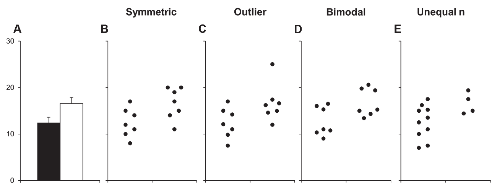]

.references[
Weissgerber et al. (2015). [Beyond bar and line graphs: time for a new data presentation paradigm](https://journals.plos.org/plosbiology/article?id=10.1371/journal.pbio.1002128). PLOS Biology.
]

---

## Beyond bar plots

.context[Bar plots are a very common choice. However, they are rarely a good choice]

 
.highlight1[Bar graphs hide information about individuals, suggesting the groups are independent.]

.center[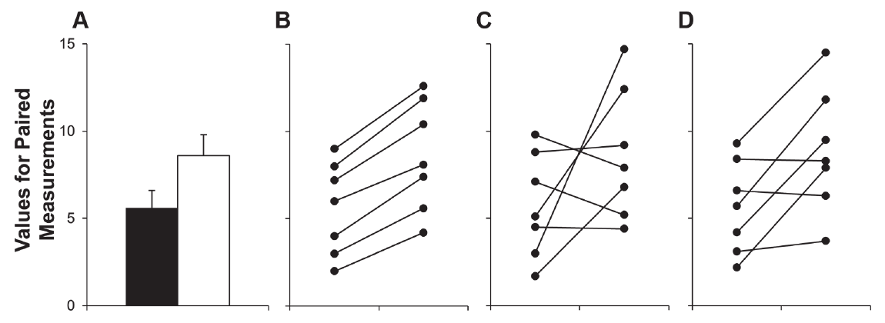]

.references[
Weissgerber et al. (2015). [Beyond bar and line graphs: time for a new data presentation paradigm](https://journals.plos.org/plosbiology/article?id=10.1371/journal.pbio.1002128). PLOS Biology.
]

---

## Beyond bar plots

.context[Bar plots are a very common choice. However, they are rarely a good choice]

 
.highlight1[Bar graphs discourage the reader from thinking critically about statistical significance and the authors's interpretation of the data.]

.center[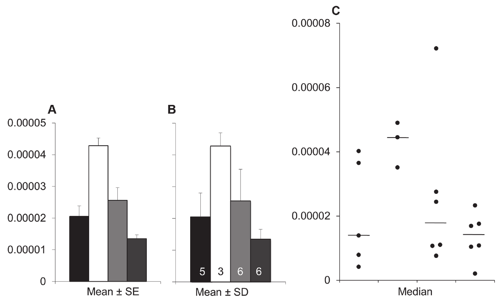]

.references[
Weissgerber et al. (2015). [Beyond bar and line graphs: time for a new data presentation paradigm](https://journals.plos.org/plosbiology/article?id=10.1371/journal.pbio.1002128). PLOS Biology.
]

---

## Beyond bar plots

.context[Bar plots are a very common choice. However, they are rarely a good choice]

 
.highlight1[Conclusions]

* Avoid bar plots unless you know for sure it is the right choice: they are appropriate only for counts and proportions and when the deviation of the means is very small or zero (rarely is).
* Scatterplots are usually a better choice.
* If the distribution has few data points, show them all and represent a summary statistic.
* If the distribution has too many data points, show the distribution with a curve, a violin plot, a box plot, etc.

???

ClimateGAN as an example

.references[
Weissgerber et al. (2015). [Beyond bar and line graphs: time for a new data presentation paradigm](https://journals.plos.org/plosbiology/article?id=10.1371/journal.pbio.1002128). PLOS Biology.
]

---

## Beyond bar plots
### Examples

.context[An alternative to bar plots is showing the distribution.]

.center[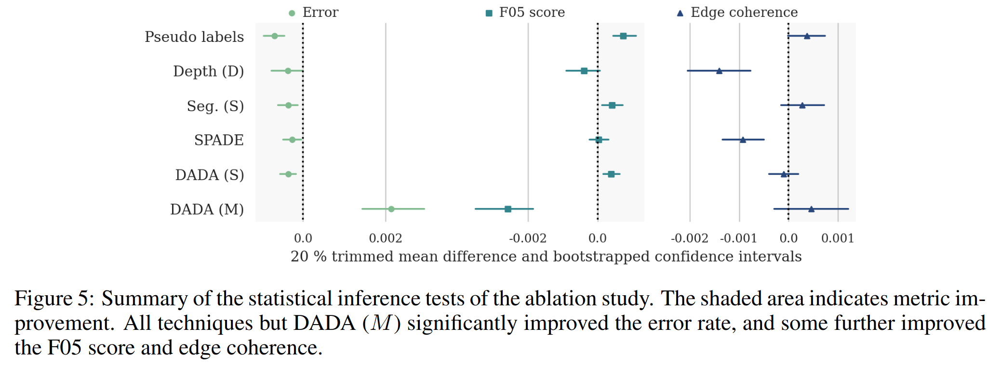]
.center[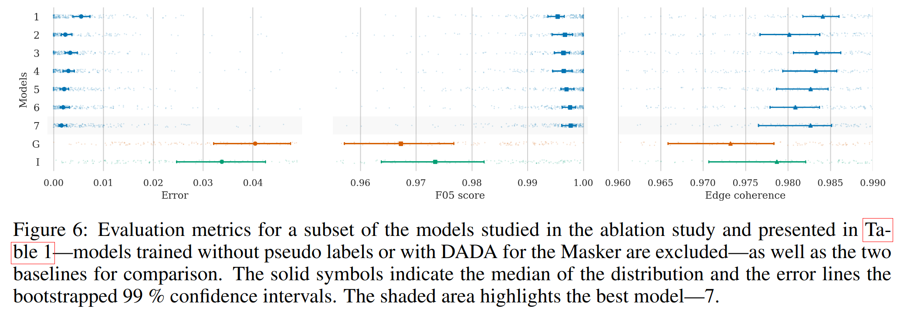]

.references[
Schmidt et al. (2021). [ClimateGAN: Raising Climate Change Awareness by Generating Images of Floods](https://arxiv.org/abs/2110.02871). ICLR 2022.
]

---

## The use of colour

.context[Colour is very often misused in scientific communication.]

 
.highlight1[Never use the jet colour map. For many reasons. Use maps that are friendly with colour-vision deficiencies]

.center[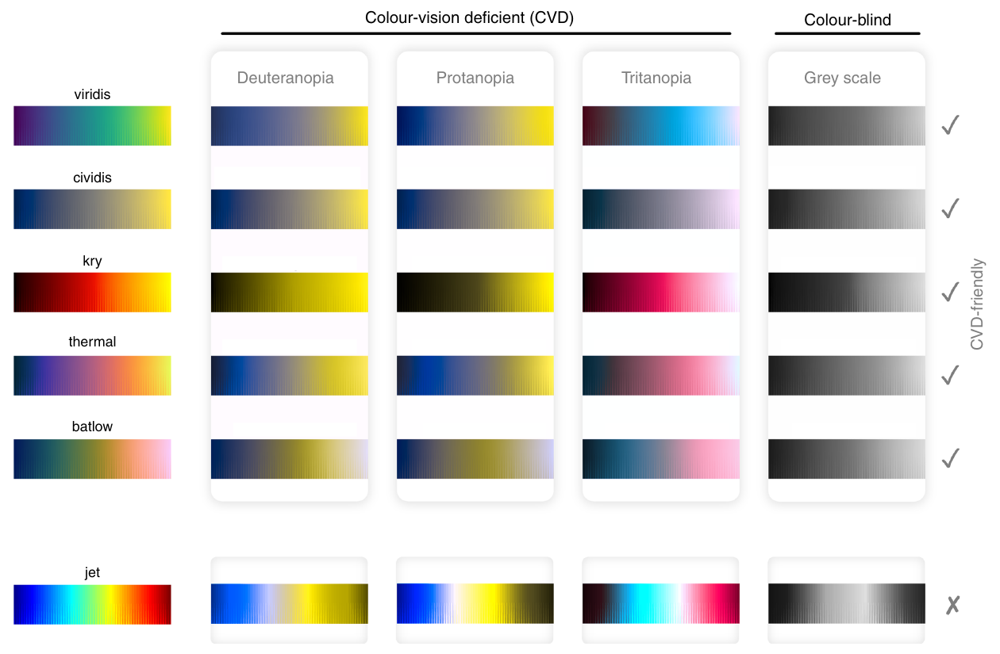]

.references[
Crameri et al. (2020). [The misuse of colour in science communication](https://www.nature.com/articles/s41467-020-19160-7). Nature communications.
]

---

## The use of colour

.context[Colour is very often misused in scientific communication.]

 
.highlight1[Choose perceptually uniform colour maps]

.center[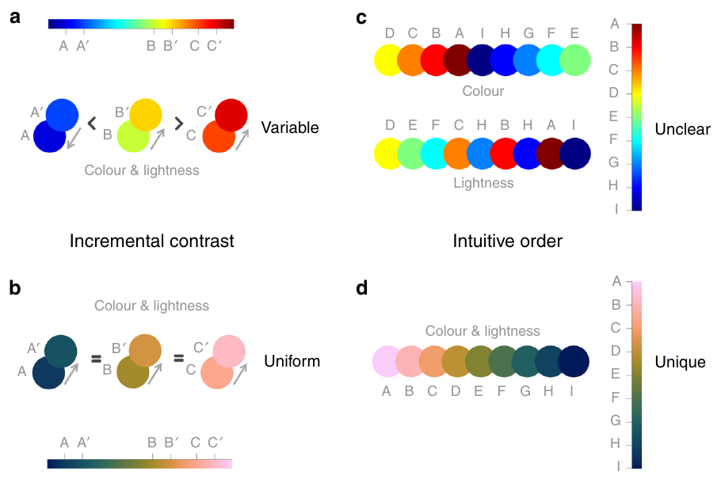]

.references[
Crameri et al. (2020). [The misuse of colour in science communication](https://www.nature.com/articles/s41467-020-19160-7). Nature communications.
]

---

## The use of colour

.context[Colour is very often misused in scientific communication.]

 
.highlight1[Choose the right family of colour maps: sequential, categorical, diverging, etc.]

.center[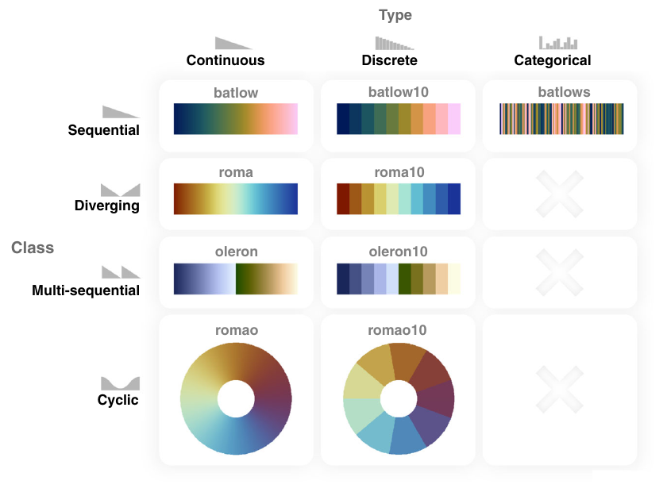]

.references[
Crameri et al. (2020). [The misuse of colour in science communication](https://www.nature.com/articles/s41467-020-19160-7). Nature communications.
]

---

name: title
class: title, middle

## IFT 3710/6759
## Projets (avancés) en apprentissage automatique

#### .gray224[3 février 2023 - Session 8]
### .gray224[Visualisation des données]

.bigger[.bigger[.highlight1[Questions, doubts, concerns, comments?]]]

.center[

]
Alex Hernández-García (he/il/él)

.footer[[alexhernandezgarcia.github.io](https://alexhernandezgarcia.github.io/) | [alex.hernandez-garcia@mila.quebec](mailto:alex.hernandez-garcia@mila.quebec)] 
.footer[[@alexhg@scholar.social](https://scholar.social/@alexhg)  | [@alexhdezgcia](https://twitter.com/alexhdezgcia) ]
