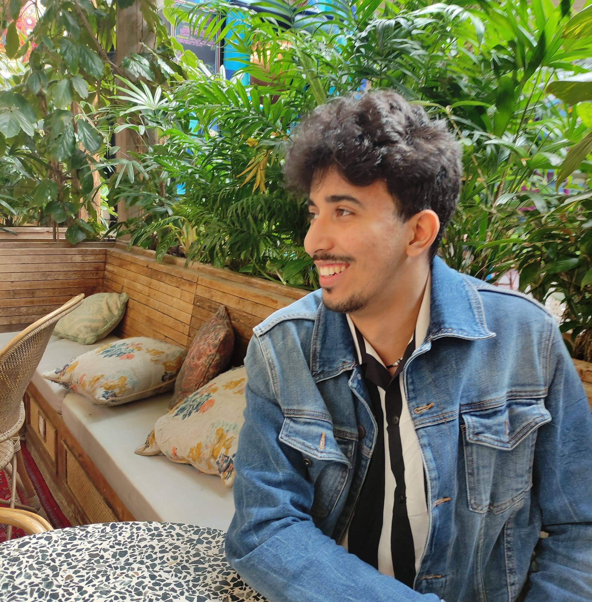

name: 20240109-introduction
class: title, middle

## IFT 3710/6759
## Projets (avancés) en apprentissage automatique

#### .gray224[9 janvier 2024 - Session 1]
### .gray224[Introduction]

.smaller[.footer[
Slides: [alexhernandezgarcia.github.io/teaching/mlprojects24/slides/{{ name }}](https://alexhernandezgarcia.github.io/teaching/mlprojects24/slides/{{ name }})
]]

.center[

]

Alex Hernández-García (he/il/él)

.footer[[alexhernandezgarcia.github.io](https://alexhernandezgarcia.github.io/) | [alex.hernandez-garcia@mila.quebec](mailto:alex.hernandez-garcia@mila.quebec)] 
.footer[[@alexhg@scholar.social](https://scholar.social/@alexhg)  | [@alexhdezgcia](https://twitter.com/alexhdezgcia) ]

???

- Présentation de moi-même:
    - Chercheur postdoctoral à l'UdeM et Mila dans le group de Prof. Bengio
    - Doctorat à Berlin, sur l'intelligence artificielle et la neuroscience.
    - Maintenant, je recherche des applications de l'IA avec un impact positif contre le changement climatique ou pour la societé en géneral
- Presentation des étudiants: prénom

---

## À propos de la langue

Ce cours est offert aux étudiant·e·s de premier cycle (IFT 3710) et étudiant·e·s de cycle supérieur (IFT 6759). Les étudiant·e·s de cycle supérieur peuvent choisir entre une version française (Section A, ici) et une version anglaise (Section B, avec Prof. Bang Liu).

Dans cette section:

* Les sessions seront enseignées en français.
* Le contenu des diapositives sera principalement en anglais. 
* Les présentations des étudiant·e·s se feront en français.
* Les devoirs peuvent être réalisés en français ou en anglais.
* La communication avec les instructeur·rice·s peut être en français ou anglais.

???

- Ou espagnol, allemand...

---

count: False

## À propos de la langue

Ce cours est offert aux étudiant·e·s de premier cycle (IFT 3710) et étudiant·e·s de cycle supérieur (IFT 6759). Les étudiant·e·s de cycle supérieur peuvent choisir entre une version française (Section A, ici) et une version anglaise (Section B, avec Prof. Bang Liu).

Par ailleurs : Le français n'est pas ma langue maternelle et mon niveau est un peu limité. Des idées pour atténuer les limites potentielles de mon français :

* Ayez un peu de patience ^^
* N'hésitez pas à me corriger si je dis quelque chose de faux.
* Il y a beaucoup de mots techniques que je ne connais qu'en anglais. Indiquez-moi si des versions françaises existent et sont courantes.

--

.center[Il est permis de se moquer de mes erreurs... si vous me les expliquez! ;)]

???

- Espagnol, Allemand

---

## Programmes d'études

Les étudiant·e·s de cette classe peuvent venir de différents programmes d'études :

* Maîtrise en informatique (IFT 6759)
* D.E.S.S. en apprentissage automatique (IFT 6759)
* Baccalauréat en informatique (IFT 3710)
* Baccalauréat en mathématiques et informatique (IFT 3710)
* Autre ?

--

Voyons la distribution en direct ! 

Allez sur [www.menti.com](https://www.menti.com) et utilisez le code **7639 3368** ou cliquez sur :

.center[[https://www.menti.com/wdw1o9dnbk](https://www.menti.com/wdw1o9dnbk)]

???

- Vérifiez si les étudiants du baccalauréat peuvent choisir en anglais.
- Menti: https://www.mentimeter.com/s/5961baed47926bc582b7d7aedbca8111/821c861c09e0

---

## Le cours en bref

.highlight1[Objectif] : vous préparer pour travailler sur des projets pratiques d'apprentissage automatique.

.highlight1[Structure] :

* 5 semaines (10 séances) de cours d'introduction et de révision : `git`, Linux, Python, PyTorch, machine learning, deep learning, visualisation des données, rédaction scientifique...
* 10 semaines de travail en équipe sur des projets, avec des séances de mentorat et de petits rapports périodiques.

.highlight1[A la fin du cours], on attende de vous que vous soyez capable de :

* Programmer et entraîner des modèles d'apprentissage automatique et d'apprentissage profond.
* Analyser les résultats expérimentaux et tirer des conclusions.
* Communiquer par écrit et oralement les principaux aspects du projet.

---

## Assistant·e·s d'enseignement (TA)

.left-column[
<figure style="text-align: center">
	
  <figcaption style="text-align: center">Léna Néhale-Ezzine</figcaption>
</figure>
]
.right-column[
<figure style="text-align: center">
	
  <figcaption style="text-align: center">Oussama Boussif</figcaption>
</figure>
]

Rôles :

* Préparation des propositions de projets
* Mentorat d'équipes (office hours)

???

- Étudiants de doctorat avec Prof. Bengio.
- Intéressé par les applications de l'IA contre le changement climatique.

---

## Horaire et plan

.highlight1[Horaire des cours] :

* Les mardis, 10:30-12:30 - Y-117
* Les jeudis, 10:30-12:30 - Y-117

.left-column[
**Semaine 1**
* Séance 1 : Introduction (aujourd'hui)
* Séance 2 : Python et Linux

**Semaine 2**
* Séance 3 : `git` et tutoriel Github
* Séance 4 : Clusters HPC
]
.right-column[
**Semaine 3**
* Séance 5 : Revue de l'apprentissage automatique
* Séance 6 : Revue de l'apprentissage profond

**Semaine 4**
* Séance 7 : Revue de modèles génératifs
* Séance 8 : Tutoriel PyTorch
]

---

count: false

## Horaire et plan

.highlight1[Horaire des cours] :

* Les mardis, 10:30-12:30 - Salle à préciser
* Les jeudis, 10:30-12:30 - Salle à préciser

.left-column[
**Semaine 5**
* Séance 9 : Visualisation des données
* Séance 10 : Rédaction scientifique
]

.right-column[
**Semaines 5 - 14**
* Travail sur des projets en équipe.
* Pas de cours magistraux.
* Séances de mentorat ouvertes pendant les heures de cours, et privées sur demande.
* Des tutoriels supplémentaires peuvent être prévus.
* Vous devrez faire des mini-rapports périodiques.
]

???

- Explain open office hours

---

## Informations pratiques

* .highlight1[Annonces importantes] : [StudiUM](https://studium.umontreal.ca/course/view.php?id=292494)
* .highlight1[Matériel de cours mis à jour] : [alexhernandezgarcia.github.io/mlprojects](https://alexhernandezgarcia.github.io/teaching/mlprojects/)
* .highlight1[Communication avec l'instructeur] : courriel ([alejandro.hernandez.garcia@umontreal.ca](mailto:alejandro.hernandez.garcia@umontreal.ca))

--

.center[Aimeriez-vous disposer d'un canal Discord pour la communication entre les étudiants (et les instructeurs), notamment pendant la phase de développement du projet ?]

???

- Discord sera utilisé principalement pendant le développement du projet

---

## À propos des projects
### Qu'est-ce qu'un projet ?

Pendant 10 semaines (de la semaine 5 à la semaine 14), vous travaillerez en équipe sur un projet. Les projets du cours ont pour but de ressembler autant que possible aux projets d'apprentissage automatique du monde réel, que ce soit dans l'industrie ou dans la recherche.

--

Les projets comprennent les étapes suivantes :

1. Revue de la littérature
2. Planification
3. Développement
4. Analyse des résultats
5. Présentation orale
6. Rapport écrit

???

- Show plan in website, talk about deliverables and discuss dates (oral presentations, final report, etc.)

---

## À propos des projects
### Travail en équipe

.highlight1[Important] : Les projets seront développés en équipes de 3 à 5 personnes. Le travail en équipe d'au moins 3 personnes est une exigence du cours. Des équipes plus larges peuvent également être acceptées. 

???

- Expliquez pourquoi le travail en équipe est obligatoire.

--

Le travail en équipe ne signifie pas nécessairement que chaque coéquipier contribue de manière égale à chaque partie du projet, mais on attend que chaque personne s'engage dans toutes les étapes du projet (revue de la littérature, planification, programmation, analyse, rédaction, présentation, etc.)

--

Mécanismes pour faciliter le travail d'équipe :

* Vous êtes libres de vous organiser et de proposer des équipes pour travailler sur des projets spécifiques.
* Sinon, les équipes seront formées en fonction des vos préférences.
* Réunions avec les instructeurs, pour évaluer à la fois les progrès et le fonctionnement de l'équipe.
* Questionnaire sur le fonctionnement de l'équipe et les contributions à la fin du cours.

---

classe: tighter

## À propos des projects
### Schéma des projets proposés

Vous pouvez travailler sur l'un des projets proposés, ou proposer le vôtre (voir diapositive suivante). Quelques projects peuvent être sur :

* Détection d’événements climatiques extrêmes
* Détection et classification des cultures
* Réduction d’échelle des modèles climatiques
* Modélisation et conception des électrocatalyseurs
* Modélisation des aptamères d’ADN
* WILDS : Changements de distribution dans la nature
* eBird : Surveillance de la biodiversité
* Classification et détection des animaux
* NLP pour les langues autochtones

???

- Demander si il y d'autres idées.
- They can start thinking about projects.
- Différents projets sont possibles dans chacun de ces thèmes
- Notez que ceux qui ont assisté à Fundamentals of machine learning seront familiers avec les deux premiers projets, mais les projets seront beaucoup plus approfondis ici.

---

## À propos des projects
### Proposer votre propre projet

Afin d'encourager la créativité et de vous permettre de travailler sur les projets qui vous intéressent, vous êtes invités à proposer vos propres projets. Néanmoins, la proposition de projet doit être acceptée par les instructeurs et la décision sera basée sur les critères suivants :

* Le projet doit impliquer l'utilisation de méthodes avancées d'apprentissage automatique.
* Les travaux développés avant ce cours ne seront pas acceptés.
* Il doit être réalisable en termes de ressources informatiques et de contraintes de temps.
* Les données doivent être accessibles au public.
* Le projet ne doit pas soulever des problèmes éthiques.
* Les projets avec un impact potentiellement positif seront favorisés.

--

.highlight1[Si vous avez un projet en tête, parlez-en aux instructeurs dès que possible !]

---

## À propos des projects
### Critères d'évaluation

La note finale sera entièrement basée sur le projet, selon les critères suivants, tous de poids équivalent : 

* .highlight1[Difficulté] du projet
* .highlight1[Qualité et performance] des algorithmes : adéquation des méthodes, rigueur technique, résultats, etc.
* .highlight1[Rapport écrit] : exhaustivité, clarté, solidité technique, analyse, etc.
* .highlight1[Présentation orale] : efficacité, clarté de la présentation, etc.
* .highlight1[Code] : clarté, documentation, modularité, extensibilité, etc.

L'évaluation de base sera la même pour tous les membres de l'équipe. Cependant, les notes individuelles pourront être ajustées si nécessaire en cas de déséquilibre de participation.

--

.highlight1[Note importante] : Les critères d'évaluation seront légèrement assouplis pour les étudiant·e·s de premier cycle (IFT 3710), notamment en ce qui concerne la _difficulté du projet_.

---

## Préalables

.highlight1[Pourquoi des préalables ?] : 

* Il ne s'agit pas d'un cours d'_Introduction à l'apprentissage automatique_, mais de _projets (avancés) d'apprentissage automatique_.
* Tous les étudiant·e·s doivent être en mesure de contribuer à l'équipe.

.highlight1[Quels sont les préalables ?]: 

* Concepts de base de **l'apprentissage automatique** : il y aura une session de révision.
* Concepts de base de **l'apprentissage profond** : il y aura une session de révision.
* Familiarité avec **Python**.
* Familiarité avec **PyTorch**.
* Commandes de base de **Linux** : il y aura une session de tutorat.
* Familiarité avec **`git` et GitHub** : il y aura une session de tutorat.

---

## Préalables

.context[Apprentissage automatique, apprentissage profond, Python, PyTorch, Linux, git et GitHub.]

 
.highlight1[Note importante] : Si vous n’êtes pas certain·e d’avoir suffisamment de connaissances sur les sujets ci-dessus pour pouvoir contribuer à une équipe et donc réussir le cours, contactez l’instructeur dès que possible pour évaluer vos connaissances et prendre une décision ensemble.

--

Voyons les principaux besoins ! 

Allez sur [www.menti.com](https://www.menti.com) et utilisez le code **5814 1320** ou cliquez sur :

.center[[https://www.menti.com/84y1fvycn8](https://www.menti.com/84y1fvycn8)]

???

- Surtout Python et PyTorch !
- Menti: https://www.mentimeter.com/app/presentation/e270211fc2849b71f269100449e9ab20

---

### Session suivante
### Python et Linux

.context[Jeudi 11 janvier, 10:30-12:30]

Ressources et homework suggérées :

* [The missing semester: The Shell](https://missing.csail.mit.edu/2020/course-shell/#topic-1-the-shell)
* [Python tutorial: An informal introduction to Python](https://docs.python.org/3/tutorial/introduction.html)

---

name: title
class: title, middle

## IFT 3710/6759
## Projets (avancés) en apprentissage automatique

### .gray224[9 janvier 2024 - Session 1]
### .gray224[Introduction]

.bigger[.bigger[.highlight1[Questions, doutes, préoccupations, commentaires ?]]]

.center[

]

Alex Hernández-García (he/il/él)

.footer[[alexhernandezgarcia.github.io](https://alexhernandezgarcia.github.io/) | [alex.hernandez-garcia@mila.quebec](mailto:alex.hernandez-garcia@mila.quebec)] 
.footer[[@alexhg@scholar.social](https://scholar.social/@alexhg)  | [@alexhdezgcia](https://twitter.com/alexhdezgcia) ]

???

Sujets supplémentaires :

- Mentionner que c'est mon premier cours en français à l'UdeM
- Projets de recherche vs projets industriels
- Publications
- Jalons pendant les projets

