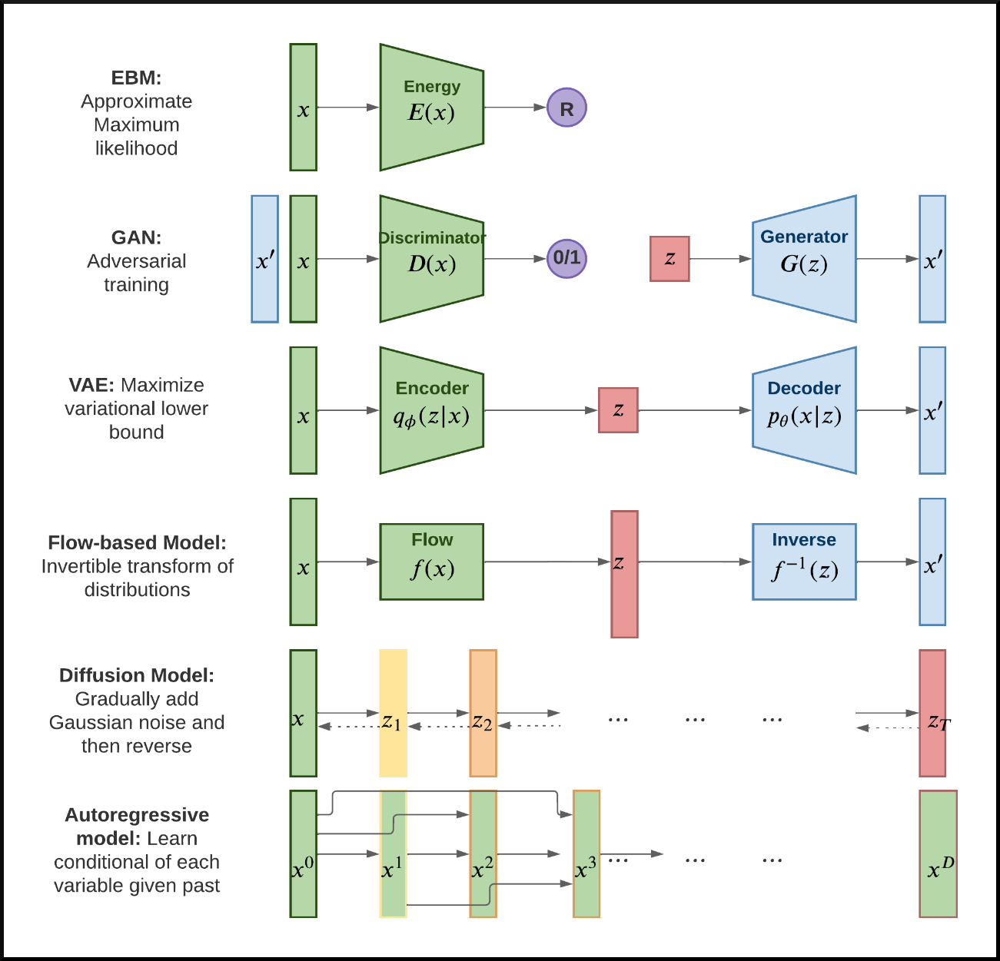
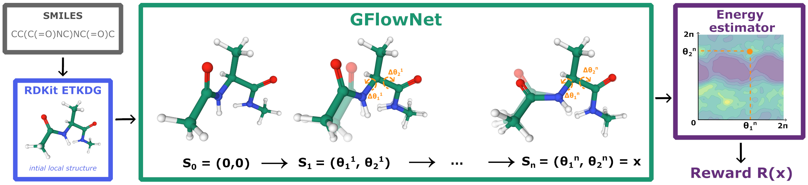
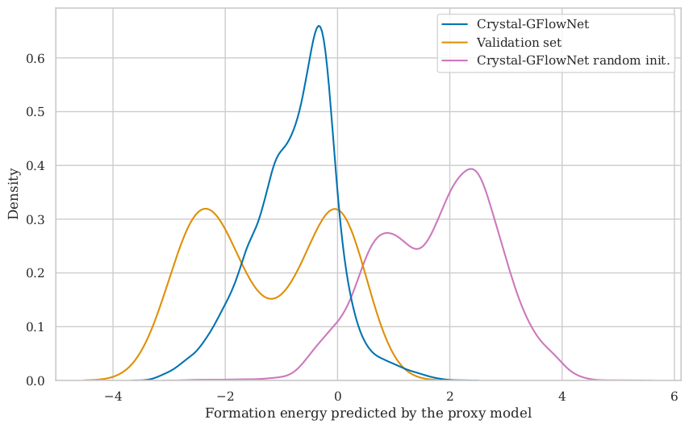

name: 20240201-gflownets
class: title, middle

## IFT 3710/6759
## Projets (avancés) en apprentissage automatique

#### .gray224[1 février 2024 - Session 8]
### .gray224[Modèles génératifs pour la découverte scientifique]

.smaller[.footer[
Slides: [alexhernandezgarcia.github.io/teaching/mlprojects24/slides/{{ name }}](https://alexhernandezgarcia.github.io/teaching/mlprojects24/slides/{{ name }})
]]

.center[
<a href="http://www.umontreal.ca/"></a>
]

Alex Hernández-García (he/il/él)

.footer[[alexhernandezgarcia.github.io](https://alexhernandezgarcia.github.io/) | [alex.hernandez-garcia@mila.quebec](mailto:alex.hernandez-garcia@mila.quebec)]<br>
.footer[[@alexhg@scholar.social](https://scholar.social/@alexhg) [](https://scholar.social/@alexhg) | [@alexhdezgcia](https://twitter.com/alexhdezgcia) [](https://twitter.com/alexhdezgcia)]

---

## Format of the class and objective

The first part of this class will be a lecture, the second part will be a live demo.

The .highlight1[goal] is that by the end of the class:

* You understand why generative models can have an impact on scientific discoveries and engineering design.
* You acquire an overview of the challenges for traditional generative models in practical applications.
* You understand how generative flow networks (GFlowNets) can tackle some of these challenges.
* You understand the fundamental intuitions and details of GFlowNets.
* You are able to start training and testing GFlowNets using existing codebases.

---

## Why scientific discoveries?

> "Limiting global warming will require major transitions in the energy sector. This will involve a substantial reduction in fossil fuel use, widespread electrification, .highlight1[improved energy efficiency, and use of alternative fuels (such as hydrogen)]." .cite[IPCC Sixth Assessment Report, 2022]

> "Net-zero CO2 emissions from the industrial sector are challenging but possible. Reducing industry emissions will entail coordinated action throughout value chains to promote all mitigation options, including demand management, .highlight1[energy and materials efficiency, circular material flows], as well as abatement technologies and transformational changes in production processes." .cite[IPCC Sixth Assessment Report, 2022]

--

<br>

.conclusion[Mitigation of the climate crisis requires transformational changes in the energy and materials efficiency.]

---

## Why scientific discoveries?

* Improving material efficiency can reduce 0.93 ($\pm$ 0.23) GtCO₂-eq per year.
* Fuel switching can reduce 2.1 ($\pm$ 0.52) GtCO₂-eq per year, only in the industry sector. 
* Carbon capture and storage can reduce 0.54 ($\pm$ 0.27) GtCO₂-eq per year in the energy sector.

.right[.cite[IPCC Sixth Assessment Report (2022)]]

.smaller[.footnote[† Global anthropogenic emissions in 2019 were estimated in 59 ($\pm$ 6.6) GtCO₂-eq. The budget from 2020 to limit warming to 1.5°C is estimated in 510 ($\pm$ 180) GtCO₂-eq.]]

---

count: false

## Why scientific discoveries?

* Improving material efficiency can reduce 0.93 ($\pm$ 0.23) GtCO₂-eq per year.
* Fuel switching can reduce 2.1 ($\pm$ 0.52) GtCO₂-eq per year, only in the industry sector. 
* Carbon capture and storage can reduce 0.54 ($\pm$ 0.27) GtCO₂-eq per year in the energy sector.

.right[.cite[IPCC Sixth Assessment Report (2022)]]

What are better, new materials needed for?

* Electrocatalysts for fuel cells, hydrogen storage, industrial chemical reactions, carbon capture, etc.
* Solid electrolytes for batteries.
* Thin film materials for photovoltaics.
* ...

.smaller[.footnote[† Global anthropogenic emissions in 2019 were estimated in 59 ($\pm$ 6.6) GtCO₂-eq. The budget from 2020 to limit warming to 1.5°C is estimated in 510 ($\pm$ 180) GtCO₂-eq.]]

---

## Why generative AI for science?
### Scientific discoveries in history

.context35[Material discovery is a key ingredient for climate change mitigation.]

--

Many notable scientific discoveries have occurred due to .highlight1[serendipity] or .highlight1[by accident]:

--

* **Dynamite** (Alfred Nobel, 1867)
* **X-rays** (Wilhelm C. Röntgen, 1895)
* **Radioactivity** (Henri Becquerel and Marie Skłodowska–Curie, 1896)
* **Penicillin** (Alexander Fleming, 1929)
* **Cyanoacrylate (superglue)** (Harry Coover, 1942)
* **Lysergic acid diethylamide (LSD)** (Albert Hofmann, 1943)

--

<br>
.conclusion[Clearly, we should not rely on serendipity to fight climate change.]

???

Joke experience with some of them, like penicillin and superglue.

---

count: false

## Why generative AI for science?
### Scientific discoveries in history

.context35[Material discovery is a key ingredient for climate change mitigation.]

.center[
<figure>
	
  <figcaption>Four paradigms in scientific discovery. Source: <a href="https://www.nature.com/articles/s41524-022-00810-x">Li et al., 2022</a>. (<a href="https://creativecommons.org/licenses/by/4.0/">CC BY 4.0</a>)</figcaption>
</figure>
]

.references[
* Li et al. [Machine learning in concrete science: applications, challenges, and best practices](https://www.nature.com/articles/s41524-022-00810-x). Nature  npj Computational Materials, 2022
]

???

Example of concrete: most prevalent human-made material on Earth, and the most consumed commodity after water. The annual consumption of concrete in the world has reached 35 billion tons, which is twice as much as that of all other building materials combined.

---

count: false

## Why generative AI for science?
### Scientific discoveries in history

.context35[Material discovery is a key ingredient for climate change mitigation.]

.center[
<figure>
	
  <figcaption>Four paradigms in scientific discovery. Source: <a href="https://www.nature.com/articles/s41524-022-00810-x">Li et al., 2022</a>. (<a href="https://creativecommons.org/licenses/by/4.0/">CC BY 4.0</a>)</figcaption>
</figure>
]

.references[
* Li et al. [Machine learning in concrete science: applications, challenges, and best practices](https://www.nature.com/articles/s41524-022-00810-x). Nature  npj Computational Materials, 2022
]

???

Concrete: The properties and performance of concrete can be tailored to meet design requirements by varying the type and quantity of the mixture constituents (e.g., cement, water, aggregate, and admixtures). Traditional approaches for designing concrete mixtures often rely on trial-and-error, iterative proportioning, processing, and characterization until the target properties are achieved.

---

count: false

## Why generative AI for science?
### Scientific discoveries in history

.context35[Material discovery is a key ingredient for climate change mitigation.]

.center[
<figure>
	
  <figcaption>Four paradigms in scientific discovery. Source: <a href="https://www.nature.com/articles/s41524-022-00810-x">Li et al., 2022</a>. (<a href="https://creativecommons.org/licenses/by/4.0/">CC BY 4.0</a>)</figcaption>
</figure>
]

.references[
* Li et al. [Machine learning in concrete science: applications, challenges, and best practices](https://www.nature.com/articles/s41524-022-00810-x). Nature  npj Computational Materials, 2022
]

???

Concrete: it is possible to optimize the compressive strength of concrete mixtures by adjusting the water/cement ratio, total aggregate/cement ratio, and coarse aggregate/total aggregate ratio6. Yet the practical application of this iterative refinement approach is limited by the exponential increase in the number of specimens and experiments when complex concrete mixtures are studied and several compositional parameters are simultaneously considered as combinatorial variables. As a result, materials development in concrete science involves time-consuming validation/development cycles from laboratory trials to field applications. Efforts to accelerate knowledge acquisition and materials design in concrete science are thus of paramount importance.

Beginning in the 1980s, the development of microstructural models of cement hydration has enabled a fundamental understanding of microstructure–property relationships in concrete7, which has marked the second paradigm. By applying basic laws of kinetics, thermodynamics, and mechanics, and providing analytical solutions to cement hydration. Successful demonstrations include the three-dimensional cement hydration and microstructure development model (CEMHYD3D)8,9; the hydration, morphology, and structural development model (HYMOSTRUC)10; the integrated particle kinetics model11; and the microstructural modeling platform (μic)

---

count: false

## Why generative AI for science?
### Scientific discoveries in history

.context35[Material discovery is a key ingredient for climate change mitigation.]

.center[
<figure>
	
  <figcaption>Four paradigms in scientific discovery. Source: <a href="https://www.nature.com/articles/s41524-022-00810-x">Li et al., 2022</a>. (<a href="https://creativecommons.org/licenses/by/4.0/">CC BY 4.0</a>)</figcaption>
</figure>
]

.references[
* Li et al. [Machine learning in concrete science: applications, challenges, and best practices](https://www.nature.com/articles/s41524-022-00810-x). Nature  npj Computational Materials, 2022
]

???

Concrete: However, the complex nature of cement hydration makes it challenging to develop accurate and generalizable models, and these modeling approaches, to varying degrees, rely on thermochemical, physical, and structural data that must be obtained either from accurate experimental observations or from calculations at the atomistic and molecular scales.

In this context, the use of density-functional theory (DFT) and classical molecular dynamics (MD) simulations has been explored in concrete science since the 2000s owing to the ever-growing computing power16. This has given rise to the third paradigm (computational science; Fig. 1), where the first-principle models have been integrated and employed to further describe cementitious materials properties and improve understanding of cement hydration. Related simulation efforts have focused primarily on cementitious phases such as the calcium silicate hydrate (C-S-H) gel, the essential reaction product of cement hydration.

---

count: false

## Why generative AI for science?
### Scientific discoveries in history

.context35[Material discovery is a key ingredient for climate change mitigation.]

.center[
<figure>
	
  <figcaption>Four paradigms in scientific discovery. Source: <a href="https://www.nature.com/articles/s41524-022-00810-x">Li et al., 2022</a>. (<a href="https://creativecommons.org/licenses/by/4.0/">CC BY 4.0</a>)</figcaption>
</figure>
]

.references[
* Li et al. [Machine learning in concrete science: applications, challenges, and best practices](https://www.nature.com/articles/s41524-022-00810-x). Nature  npj Computational Materials, 2022
]

???

Concrete: However, these computational techniques require considerable computational resources and thus come with significant challenges, such as their limited time scales and the relatively small number of atoms in a simulated system. In addition, it may be difficult to validate these simulations with experiments, given the small time and length scales and high-fidelity measurements required.

By leveraging existing datasets with data-driven models, ML can automatically learn implicit patterns and extract valuable information while accounting for the inherent complexity of concrete mixtures and their properties.

---

## Traditional scientific discovery loop

.right-column-66[<br>.center[]]

.left-column-33[
The .highlight1[traditional pipeline] for scientific discovery (paradigms 1-3):
* relies on .highlight1[highly specialised human expertise],
* it is .highlight1[time-consuming] and
* .highlight1[financially and computationally expensive].
]

---

count: false

## Machine learning in the loop

.right-column-66[<br>.center[]]

.left-column-33[
A .highlight1[machine learning model] can be:
* trained with data from _real-world_ experiments and
* used to quickly and cheaply evaluate queries
]

---

count: false

## Machine learning in the loop

.right-column-66[<br>.center[]]

.left-column-33[
A .highlight1[machine learning model] can be:
* trained with data from _real-world_ experiments and
* used to quickly and cheaply evaluate queries

.conclusion[A machine learning model replacing real-world experiments can _only_ provide _linear_ gains.]

.conclusion[Not enough if the search space is very large ($10^{180}$ stable materials)]
]

---

count: false

## _Generative_ machine learning in the loop

.context[Can we do better than _linear_?<br>An agent in the loop]

.right-column-66[<br>.center[]]

.left-column-33[
A .highlight1[machine learning **agent**] in the loop can:
* .highlight1[learn structure] from the available data,
* .highlight1[generalise] to unexplored regions of the search space and
* .highlight1[build better queries]
]

---

count: false

## _Generative_ machine learning in the loop

.context[Can we do better than _linear_?<br>An agent in the loop]

.right-column-66[<br>.center[]]

.left-column-33[
A .highlight1[machine learning **agent**] in the loop can:
* .highlight1[learn structure] from the available data,
* .highlight1[generalise] to unexplored regions of the search space and
* .highlight1[build better queries]

.conclusion[A successful AL pipeline with an ML agent in the loop can provide _exponential_ gains.]
]

.references[
Jain et al.. [GFlowNets for AI-Driven Scientific Discovery](https://arxiv.org/abs/2302.00615). Digital Discovery, Royal Society of Chemistry, 2023.
]

---

## Generative models
### A brief overview

.context[So far, we have mostly discussed _discriminative models_.]

.highlight1[Definition]: A generative model is a joint probability distribution $p(x), x \in \mathcal{X}$. 

.references[Murphy, K. Probabilistic Machine Learning: Advanced Topics. MIT Press, 2023]

--

A practical variant of the general definition are .highlight1[conditional generative models], where the model generates $x$ conditioned on an input $c \in \mathcal{C}$, that is $p(x|c)$.

--

Generative models can be used to:

- Generate new data
- Estimate the probability density of a data set
- Fill in missing data (imputation)
- Causal discovery

---

## Generative models
### A brief overview

<figure style="text-align: center">
	
  <figcaption style="text-align: center; font-size: small">Overview of generative models. Source: .cite[Murphy, K. Probabilistic Machine Learning: Advanced Topics.]</figcaption>
</figure>

---

## AI in the scientific discovery loop
### A new generative method: **GFlowNets**

.context35[AI can boost multiple components of the scientific dicovery pipeline.]

<br>
.center[]

.references[
Jain et al.. [GFlowNets for AI-Driven Scientific Discovery](https://arxiv.org/abs/2302.00615). Digital Discovery, Royal Society of Chemistry, 2023.
]

---

count: false

## AI in the scientific discovery loop
### A new generative method: **GFlowNets**

.context35[AI can boost multiple components of the scientific dicovery pipeline.]

<br>
.center[]

.references[
Jain et al.. [GFlowNets for AI-Driven Scientific Discovery](https://arxiv.org/abs/2302.00615). Digital Discovery, Royal Society of Chemistry, 2023.
]

---

## Machine learning for scientific discovery
### Challenges and limitations of existing methods

.highlight1[Challenge]: very large search spaces.

--

&rarr; Need for .highlight2[efficient search and generalisation] of underlying structure.

--

.highlight1[Challenge]: underspecification of objective functions or metrics.

--

&rarr; Need for .highlight2[diverse] candidates.

--

.highlight1[Limitation]: Reinforcement learning and MCMC methods are good at optimisation but bad at mode mixing.

--

&rarr; Need for .highlight2[multi-modal optimisation].

---

## An intuitive toy task

.context[Scientific discovery involves exploring in large, multi-modal search spaces.]

<br>
Task: find arrangements of Tetris pieces on the board that minimise the empty space.

.left-column[
.center[]
]

.right-column[
  
]

--

.conclusion[This task resembles designing DNA sequences or molecules or materials via fragments, to optimise certain properties.]

---

## An intuitive toy task

.context[Scientific discovery involves exploring in large, multi-modal search spaces.]

<br>
Task: find arrangements of Tetris pieces on the board that minimise the empty space.

.center[
<div style="display: flex">
  <div style="flex: 25%;">
  <figure>
      
    <figcaption>Score: 0/12</figcaption>
  </figure>
  </div>
  <div style="flex: 25%;">
  <figure>
      
    <figcaption>Score: 4/12</figcaption>
  </figure>
  </div>
  <div style="flex: 25%;">
  <figure>
      
    <figcaption>Score: 8/12</figcaption>
  </figure>
  </div>
  <div style="flex: 25%;">
  <figure>
      
    <figcaption>Score: 12/12</figcaption>
  </figure>
  </div>
</div>
]

---

## An intuitive toy task

.context[Scientific discovery involves exploring in large, multi-modal search spaces.]

<br>
Task: find arrangements of Tetris pieces on the board that minimise the empty space.

.center[
<div style="display: flex">
  <div style="flex: 20%;">
  <figure>
      
    <figcaption>Score: 12/12</figcaption>
  </figure>
  </div>
  <div style="flex: 20%;">
  <figure>
      
    <figcaption>Score: 12/12</figcaption>
  </figure>
  </div>
  <div style="flex: 20%;">
  <figure>
      
    <figcaption>Score: 12/12</figcaption>
  </figure>
  </div>
  <div style="flex: 20%;">
  <figure>
      
    <figcaption>Score: 12/12</figcaption>
  </figure>
  </div>
  <div style="flex: 20%;">
  <figure>
      
    <figcaption>Score: 12/12</figcaption>
  </figure>
  </div>
</div>
]

.conclusion[The _reward function_ of this task has multiple modes. With a larger board and more pieces, the number of combinations and modes grow exponentially and the task of efficiently finding them is non-trivial for machine learning models.]

---

## GFlowNet in a nutshell

.context[Existing ML methods struggle with large, multi-modal search spaces.]

<br>
Given a reward or objective function $R(x)$, GFlowNet can be seen a generative model trained to sample objects $x \in \cal X$ according to .highlight1[a sampling policy $\pi(x)$ proportional to the reward $R(x)$]: $\pi(x) \propto R(x)$


&rarr; Sampling proportionally to the reward function induces .highlight1[multi-modal search and diversity].

--

.left-column[
The policy $\pi_{\theta}(x)$ is modelled by a deep neural network, parameterised by $\theta$, thus providing .highlight1[amortised inference].

&rarr; Amortised inference can be thought of as _exploration with memory_, which induces .highlight1[systematic generalisation].
]

--

.right-column[
.center[]
]

---

## GFlowNet in a nutshell

* Objects $x \in \cal X$ are constructed through a sequence of steps $\tau$ from an action space $\cal A$.
* At each step of the trajectory $\tau=(s_0\rightarrow s_1 \rightarrow \dots \rightarrow s_f)$, we get a partially constructed object $s$ in state space $\cal S$.
* This induces a directed acyclic graph (DAG) $\mathcal{G}=(\mathcal{S},\mathcal{A})$, with all possible constructions in the domain.

.left-column[.center[]]

.right-column[.center[
<div style="display: flex">
  <div style="flex: 30%;">
  <figure>
      
    <figcaption>$s_0$</figcaption>
  </figure>
  </div>
  <div style="flex: 0.5%; padding: 40pt 0">
  $\rightarrow$
  </div>
  <div style="flex: 30%;">
  <figure>
      
    <figcaption>$s_1$</figcaption>
  </figure>
  </div>
  <div style="flex: 0.5%; padding: 40pt 0">
  $\rightarrow$
  </div>
  <div style="flex: 30%;">
  <figure>
      
    <figcaption>$s_2$</figcaption>
  </figure>
  </div>
</div>
]]
---

## GFlowNet in a nutshell

.context[GFlowNet induces a DAG $\mathcal{G}=(\mathcal{S},\mathcal{A})$, with all possible constructions in the domain.]

<br>

.left-column[.center[
  <figure>
    
    <figcaption>State space $\cal S$</figcaption>
  </figure>
]]

.right-column[.center[
  <figure>
    
    <figcaption>Action space $\cal A$</figcaption>
  </figure>
]]

.conclusion[This terminology is reminiscent of reinforcement learning.]

---

## Principle of conservation as a training objective

.right-column-33[.center[]]

.left-column-66[
**Consistent Flow**:  Flow $F$ satisfies the _flow consistency equation_
$$\sum\_{s' \in \text{Parent}(s)} F\_\theta(s' \rightarrow s) = \sum\_{s'' \in \text{Child}(s)} F\_\theta(s \rightarrow s')$$

**Theorem**: For a consistent flow $F$ with terminal flow set as the reward $F(x\rightarrow s_f)=R(x)$, the forward policy samples $x$ proportionally to $R(x)$.
$$\pi(x)\propto R(x)$$

**Corollary**: The flow at $s_0$, $F(s_0)$ is the partition function $Z$! 
]

.references[
Bengio et al. [Flow network based generative models for non-iterative diverse candidate generation](https://arxiv.org/abs/2106.04399), NeurIPS, 2021. 
]

---

## Principle of conservation as a training objective

<p>
$$\sum\_{s' \in \text{Parent}(s)} F\_\theta(s' \rightarrow s) = \sum\_{s'' \in \text{Child}(s)} F\_\theta(s \rightarrow s')$$
</p>
* **Flow Matching Objective**: $$\mathcal{L}\_{FM}(s; \theta) = \left(\log \frac{\sum\_{s'\in \text{Parent}(s)} F\_\theta(s'{\rightarrow} s)}{\sum\_{s'' \in \text{Child}(s)}F\_\theta(s{\rightarrow} s'')}\right)^2$$
* **Trajectory Balance**: $$\mathcal{L}\_{TB} (\tau;\theta) = \left(\log \frac{Z\_\theta \prod\_{s{\rightarrow} s' \in \tau}P\_{F\_\theta}(s'|s)}{R(x)\prod\_{s\rightarrow s' \in \tau} P\_{B\_\theta}(s|s') }\right)^2$$

---

## Results
### Tetris GFlowNets

.context[If the model is sufficiently trained, the sampling policy $\pi(x)$ should be proportional to the reward $R(x)$: $\pi(x) \propto R(x)$]

<br>

.center[
<div style="display: flex">
  <div style="flex: 20%;">
  <figure>
      
    <figcaption>$\pi(x) = 8.12~\%$</figcaption>
  </figure>
  </div>
  <div style="flex: 20%;">
  <figure>
      
    <figcaption>$\pi(x) = 8.96~\%$</figcaption>
  </figure>
  </div>
  <div style="flex: 20%;">
  <figure>
      
    <figcaption>$\pi(x) = 8.61~\%$</figcaption>
  </figure>
  </div>
  <div style="flex: 20%;">
  <figure>
      
    <figcaption>$\pi(x) = 9.16~\%$</figcaption>
  </figure>
  </div>
  <div style="flex: 20%;">
  <figure>
      
    <figcaption>$\pi(x) = 8.39~\%$</figcaption>
  </figure>
  </div>
</div>
]

After training, GFlowNet samples a mode with probability 43.24 %.

.footnote[The energy function $\varepsilon(x)$ is the fraction of the board occupied by pieces and the reward function is $R(X) = \varepsilon(x)^4$ to disproportionally favour the discovery of modes.]

---

## Multi-fidelity active learning with GFlowNets

.center[]

---

## DNA aptamers and antimicrobial peptides (AMP)

.highlight1[DNA]: GFlowNet adds one nucleobase (`A`, `T`, `C`, `G`) at a time up to length 30. This yields a design space of size $|\mathcal{X}| = 4^{30}$. The objective function is the free energy estimated by NUPACK. The (simulated) lower fidelity oracle is a transformer trained with 1 million sequences.

.highlight1[AMP]: Protein sequences with variable length (max. 50). The oracles are 3 ML models trained with different subsets of data.

.left-column[.center[
  <figure>
    
    <figcaption>DNA task</figcaption>
  </figure>
]]

.right-column[.center[
  <figure>
    
    <figcaption>AMP task</figcaption>
  </figure>
]]

---

## Small molecules

More realistic experiments, with oracles that correlate with experimental results as approximations of the scoring function. The costs reflect the computational demands of each oracle (1, 3, 7).

.left-column[.center[
  <figure>
    
    <figcaption>Ionisation potential task</figcaption>
  </figure>
]]

.right-column[.center[
  <figure>
    
    <figcaption>Electron affinity task</figcaption>
  </figure>
]]

---

##  GFlowNet extensions and applications
### Multi-objective GFlowNets

We have extended GFlowNets to handle multi-objective optimisation and not only cover the Pareto front but also sample diverse objects at each pointin the Pareto front.

.center[

]

.references[
Jain et al. [Multi-Objective GFlowNets](https://arxiv.org/abs/2210.12765), arXiv 2210.12765, 2022. 
]

---

##  GFlowNet extensions and applications
### Molecular conformation

We have recently generalised the theory and implementation of GFlowNets to encompass both discrete and continuous or hybrid state spaces. 

.center[

]

.references[
- Lahlou et al. [A Theory of Continuous Generative Flow Networks](https://arxiv.org/abs/2301.12594), arXiv 2301.12594, 2023. 
- Volokhova et al. [Towards equilibrium molecular conformation generation with GFlowNets](https://arxiv.org/abs/2310.14782), Digital Discovery, 2024. 
]

---

##  GFlowNet extensions and applications
### Molecular conformation

We have recently generalised the theory and implementation of GFlowNets to encompass both discrete and continuous or hybrid state spaces. 

.center[

]

.references[
- Lahlou et al. [A Theory of Continuous Generative Flow Networks](https://arxiv.org/abs/2301.12594), arXiv 2301.12594, 2023. 
- Volokhova et al. [Towards equilibrium molecular conformation generation with GFlowNets](https://arxiv.org/abs/2310.14782), Digital Discovery, 2024. 
]

---

##  GFlowNet extensions and applications
### Crystal-GFlowNet for crystal structure generation

.center[]

---

count: false

##  GFlowNet extensions and applications
### Crystal-GFlowNet for crystal structure generation

.center[]

---

count: false

##  GFlowNet extensions and applications
### Crystal-GFlowNet for crystal structure generation

.center[]

---

count: false

##  GFlowNet extensions and applications
### Crystal-GFlowNet for crystal structure generation

.center[]

---

count: false

##  GFlowNet extensions and applications
### Crystal-GFlowNet for crystal structure generation

.center[]

---

count: false

##  GFlowNet extensions and applications
### Crystal-GFlowNet for crystal structure generation

.center[]

---

count: false

##  GFlowNet extensions and applications
### Crystal-GFlowNet for crystal structure generation

.center[]

---

count: false

##  GFlowNet extensions and applications
### Crystal-GFlowNet for crystal structure generation

.center[]

---

##  GFlowNet extensions and applications
### Crystal-GFlowNet for crystal structure generation

Inspiration from theoretical crystallography to sample crystals with desirable properties and constraints.

.center[

]

.references[
Mila AI4Science, Hernandez-Garcia et al. [Crystal-GFN: sampling crystals with desirable properties and constraints](https://arxiv.org/abs/2310.04925), arXiv 2310.04925, 2023. 
]

---

name: title
class: title, middle


#### .gray224[1 février 2024 - Session 8]
### .gray224[Modèles génératifs pour la découverte scientifique]

.bigger[.bigger[.highlight1[Pause: 10 minutes]]]

.center[
<a href="http://www.umontreal.ca/"></a>
]

Alex Hernández-García (he/il/él)

.footer[[alexhernandezgarcia.github.io](https://alexhernandezgarcia.github.io/) | [alex.hernandez-garcia@mila.quebec](mailto:alex.hernandez-garcia@mila.quebec)]<br>
.footer[[@alexhg@scholar.social](https://scholar.social/@alexhg) [](https://scholar.social/@alexhg) | [@alexhdezgcia](https://twitter.com/alexhdezgcia) [](https://twitter.com/alexhdezgcia)]

---

## A Scrabble-inspired GFlowNet environment

Task: to sample English words (up to 7 letters) with high "Scrabble" score.

This is hard! Number of combinations: $\sim26^7 \approx 10^{10}$. Number of English words with up to 7 letters: $\sim10^5$

.left-column[
.center[]
]
--
.right-column[
.center[]
.center[]
]

---

## Scrabble GFlowNet ~~DAG~~ Tree

Task: to sample English words (existing in a vocabulary) with high "Scrabble" score (reward).

--

.columns-3-left[
.center[]
]
--
.columns-3-center[
.center[
State space, $\mathcal{S}$: all possible combinations of 0-7 letters


]
]
--
.columns-3-center[
.center[
Action space, $\mathbb{A}$: adding each letter, plus the "stop" action.


]
]

---

## States and action representation

We can represent each letter by an index. Simplified example:

```python
tokens_dict = {"A": 1, "E": 2, "I": 3, "L": 4, "M": 5, "O": 6, "_": 0}
```

--

And a state by a list of indices. For example, the word ~~MILA~~ Mila:

```python
mila = [5, 3, 4, 1, 0, 0, 0]
```

--

We can represent actions by a single-tuple element with the index of the letter:

```python
action_a: = (1,)
action_m: = (5,)
action_o: = (6,)
action_eos: = (-1,) # EOS: end-of-sequence (stop)
```
---

## GFlowNet implementation

.highlight2[Open source GFlowNet implementation]: [github.com/alexhernandezgarcia/gflownet](https://github.com/alexhernandezgarcia/gflownet)

--

* A key design principle is the simplicity to create new environments.
* Current environments: hyper-grid, hyper-cube, hyper-torus, Tetris, crystals, molecules, DNA...
* Discrete and continuous support
* Hydra-based configuration
* WandB

--

Research articles supported by this GFlowNet package:
.references[
* Lahlou et al. [A Theory of Continuous Generative Flow Networks](https://arxiv.org/abs/2301.12594), ICML, 2023. 
* Hernandez-Garcia, Saxena et al. [Multi-fidelity active learning with GFlowNets](https://arxiv.org/abs/2306.11715). RealML, NeurIPS 2023.
* Mila AI4Science et al. [Crystal-GFN: sampling crystals with desirable properties and constraints](https://arxiv.org/abs/2310.04925). AI4Mat, NeurIPS 2023 (spotlight).
* Volokhova, Koziarski et al. [Towards equilibrium molecular conformation generation with GFlowNets](https://arxiv.org/abs/2310.14782). AI4Mat, NeurIPS 2023.
]

---

## The core of a GFlowNet "environment"

Since most common functionality is implemented by the base [`GFlowNetEnv`](https://github.com/alexhernandezgarcia/gflownet/blob/main/gflownet/envs/base.py), the only methods that a new discrete environment must implement are:

--

* `__init__()`: defines attributes, EOS action, source state, etc.

--
* `get_action_space()`: constructs the list of possible actions (tuples).

--
* `step(action)`: given an action, update the environment's state.

--
* `get_parents(state)`: obtains the list of parents of a given state, and their corresponding actions.

--
* `get_mask_invalid_actions_forward(state)`: determines the invalid actions from a given state.

--
* State conversions: `states2proxy()`, `states2policy()`, `state2readable()`, `readable2state()`.

---

name: title
class: title, middle

## IFT 3710/6759
## Projets (avancés) en apprentissage automatique

#### .gray224[1 février 2024 - Session 8]
### .gray224[Modèles génératifs pour la découverte scientifique]

.bigger[.bigger[.highlight1[Questions, doubts, concerns, comments?]]]

.center[
<a href="http://www.umontreal.ca/"></a>
]

Alex Hernández-García (he/il/él)

.footer[[alexhernandezgarcia.github.io](https://alexhernandezgarcia.github.io/) | [alex.hernandez-garcia@mila.quebec](mailto:alex.hernandez-garcia@mila.quebec)]<br>
.footer[[@alexhg@scholar.social](https://scholar.social/@alexhg) [](https://scholar.social/@alexhg) | [@alexhdezgcia](https://twitter.com/alexhdezgcia) [](https://twitter.com/alexhdezgcia)]
