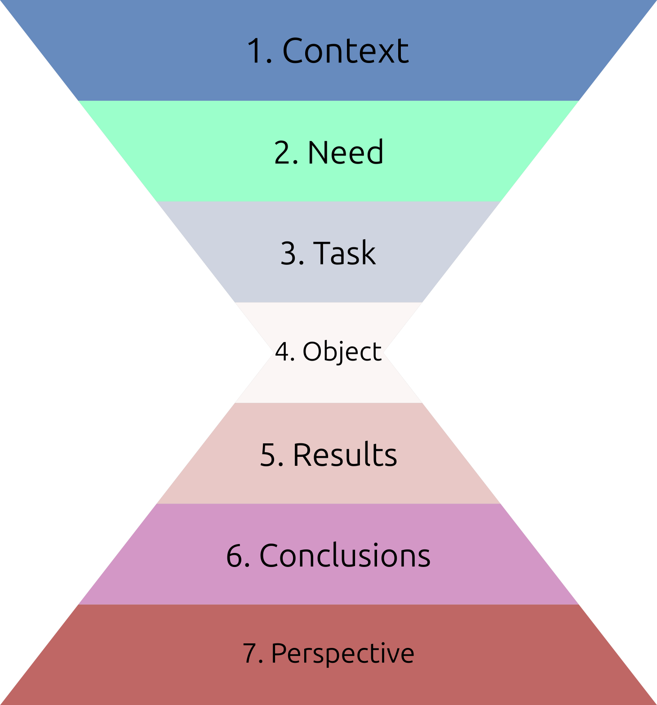
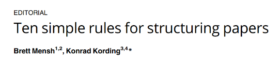
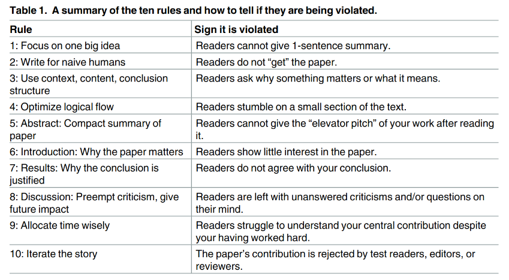

name: 20240213-writing
class: title, middle

## IFT 3710/6759
## Projets (avancés) en apprentissage automatique

#### .gray224[13 février 2024 - Session 10]
### .gray224[Rédaction scientifique et technique]

.smaller[.footer[
Slides: [alexhernandezgarcia.github.io/teaching/mlprojects24/slides/{{ name }}](https://alexhernandezgarcia.github.io/teaching/mlprojects24/slides/{{ name }})
]]

.center[

]
Alex Hernández-García (he/il/él)

.footer[[alexhernandezgarcia.github.io](https://alexhernandezgarcia.github.io/) | [alex.hernandez-garcia@mila.quebec](mailto:alex.hernandez-garcia@mila.quebec)] 
.footer[[@alexhg@scholar.social](https://scholar.social/@alexhg)  | [@alexhdezgcia](https://twitter.com/alexhdezgcia) ]

???

- The class is going to be a mix of lecture and demonstration

---

## Format of the class and objective

This class will be a short presentation of key concepts. 

The .highlight1[goal] is that by the end of the class:

* You understand the principles of _effective_ scientific and technical writing.
* You are familiar with some ingredients or techniques that will help you write good papers and reports.
* You are aware of some common elements that are detrimental to the objectives of a scientific text.

.footnote[Last lecture of the course!]

---

## Why does _effective_ scientific writing matter?

- Scientific communication is at the core of science: no communication, no science.
- It is not straightforward to communicate complex ideas, methods or results.
- Our audience is exposed to an overwhelming amount of information despite having limited bandwidth.
- At the end of the semester, you will be evaluated based on your reports and presentations.

---

## Ideals of scientific writing

- Tell a story with a clear message
- Write simply
- Write clearly
- Show humanity
- Use the fewest words

---

## How to tell a scientific story

.center[]

---

## Ten simple rules for structuring papers

.center[]

.references[
Mensh and Kording (2017). [Ten simple rules for structuring papers](https://journals.plos.org/ploscompbiol/article?id=10.1371/journal.pcbi.1005619). PLOS Computational Biology.
]

---

## Ten simple rules for structuring papers
### 1. Focus your paper on a central contribution

> "Your communication efforts are successful if readers can still describe the main contribution of your paper to their colleagues a year after reading it".

- Ideally, one paper or report should revolve around a single main message.
- Everything else should serve the main message.

.references[
Mensh and Kording (2017). [Ten simple rules for structuring papers](https://journals.plos.org/ploscompbiol/article?id=10.1371/journal.pcbi.1005619). PLOS Computational Biology.
]

---

## Ten simple rules for structuring papers
### 2. Write for flesh-and-blood human beings who do not know your work

> "Try to think through the paper like a naïve reader who must first be made to care about the problem you are addressin".

- Show humility
- Define technical terms clearly
- Reduce the cognitive load of the reader. Make it easy.

.references[
Mensh and Kording (2017). [Ten simple rules for structuring papers](https://journals.plos.org/ploscompbiol/article?id=10.1371/journal.pcbi.1005619). PLOS Computational Biology.
]

---

## Ten simple rules for structuring papers
### 3. Stick to the context-content-conclusion (C-C-C) scheme

> "The vast majority of popular (i.e., memorable and re-tellable) stories have a structure with a discernible beginning, a well-defined body, and an end.".

- This is based on the principle of repetition:
    1. Tell them what you are going to say
    2. Say it
    3. Tell them what you said
- The tree components (C-C-C) are important:
    - If context is missing: "Why was I told that?"
    - If content is missing:: well...
    - If conclusion is missing: "So what?"

.references[
Mensh and Kording (2017). [Ten simple rules for structuring papers](https://journals.plos.org/ploscompbiol/article?id=10.1371/journal.pcbi.1005619). PLOS Computational Biology.
]

---

## Ten simple rules for structuring papers
### 4. Optimize your logical flow by avoiding zig-zag and using parallelism

- "Only the central idea of the paper should be touched upon multiple times".
- "Parallel messages should be communicated with parallel form".
- Remember the funnel-inverted funnel structure.

.references[
Mensh and Kording (2017). [Ten simple rules for structuring papers](https://journals.plos.org/ploscompbiol/article?id=10.1371/journal.pcbi.1005619). PLOS Computational Biology.
]

---

## Ten simple rules for structuring papers
### 5. Tell a complete story in the abstract

> "The abstract must convey the entire message of the paper effectivel".

- The abstract, together with the main figures, is probably the most important part of the document.
- Consider writing the abstract first and dedicate a disproportionate amount of time to it.
- Consider following the funnel-inverted funnel structure:
    1. Context: needed to understand the need
    2. Need: ultimate motivation, why?
    3. Task: overall objective
    4. Object: particular objective of the present document
    5. Results: findings of the present document
    6. Conclusions
    7. Perspective

.references[
Mensh and Kording (2017). [Ten simple rules for structuring papers](https://journals.plos.org/ploscompbiol/article?id=10.1371/journal.pcbi.1005619). PLOS Computational Biology.
]

---

## Ten simple rules for structuring papers
### 6. Communicate why the paper matters in the introduction

> "The introduction highlights the gap that exists in current knowledge or methods and why it is important".

- Follow a structure that progressively leads towards the object and conclusions of the present document.
- Follow C-C-C. Everywhere.

.references[
Mensh and Kording (2017). [Ten simple rules for structuring papers](https://journals.plos.org/ploscompbiol/article?id=10.1371/journal.pcbi.1005619). PLOS Computational Biology.
]

---

## Ten simple rules for structuring papers
### 7. Deliver the results as a sequence of statements

- This is to convince the reader that the central claim is well supported by either data or logic.
- Support the statements with figures.
- Draw logical connections to the central contribution.

.references[
Mensh and Kording (2017). [Ten simple rules for structuring papers](https://journals.plos.org/ploscompbiol/article?id=10.1371/journal.pcbi.1005619). PLOS Computational Biology.
]

---

## Ten simple rules for structuring papers
### 8. Provide a discussion

- Discuss how the gap was filled.
- Discuss the limitations of the interpretation.
- Discuss the relevance to the field.

.references[
Mensh and Kording (2017). [Ten simple rules for structuring papers](https://journals.plos.org/ploscompbiol/article?id=10.1371/journal.pcbi.1005619). PLOS Computational Biology.
]

---

## Ten simple rules for structuring papers
### 9. Allocate time where it matters: Title, abstract, figures, and outlining

My own recipe:

1. Think of a title
2. Write a solid abstract
3. Design effective figures
4. Write the paper
5. Refine abstract, figures and titles

.references[
Mensh and Kording (2017). [Ten simple rules for structuring papers](https://journals.plos.org/ploscompbiol/article?id=10.1371/journal.pcbi.1005619). PLOS Computational Biology.
]

---

## Ten simple rules for structuring papers
### 10. Get feedback to reduce, reuse, and recycle the story

.center[]

.references[
Mensh and Kording (2017). [Ten simple rules for structuring papers](https://journals.plos.org/ploscompbiol/article?id=10.1371/journal.pcbi.1005619). PLOS Computational Biology.
]

---

name: title
class: title, middle

## IFT 3710/6759
## Projets (avancés) en apprentissage automatique

#### .gray224[13 février 2024 - Session 10]
### .gray224[Rédaction scientifique et technique]

.bigger[.bigger[.highlight1[Questions, doubts, concerns, comments?]]]

.center[

]
Alex Hernández-García (he/il/él)

.footer[[alexhernandezgarcia.github.io](https://alexhernandezgarcia.github.io/) | [alex.hernandez-garcia@mila.quebec](mailto:alex.hernandez-garcia@mila.quebec)] 
.footer[[@alexhg@scholar.social](https://scholar.social/@alexhg)  | [@alexhdezgcia](https://twitter.com/alexhdezgcia) ]
