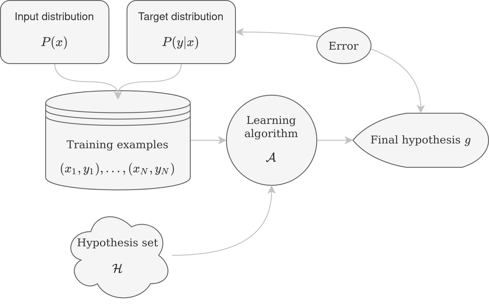
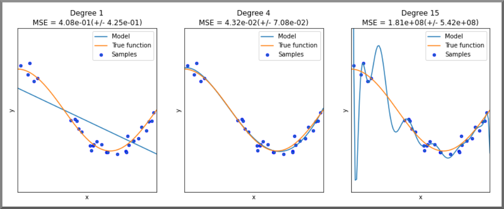
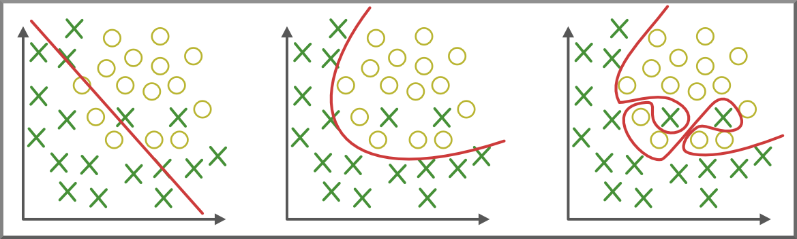
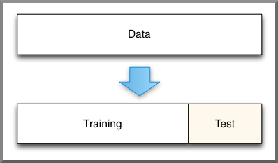
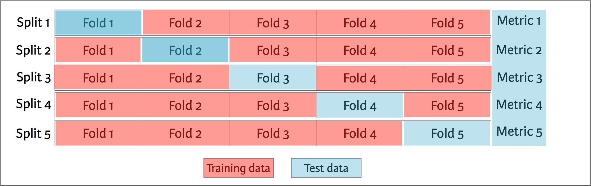
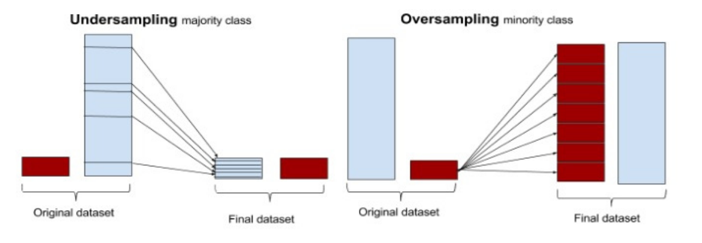

name: 20260122-ml
class: title, middle

## IFT 3710/6759
## Projets (avancés) en apprentissage automatique

#### .gray224[22 janvier 2026 - Session 5]
### .gray224[Revue de l'apprentissage automatique]

.smaller[.footer[
Slides: [alexhernandezgarcia.github.io/teaching/mlprojects26/slides/{{ name }}](https://alexhernandezgarcia.github.io/teaching/mlprojects26/slides/{{ name }})
]]

.center[

]

Alex Hernández-García (he/il/él)

.footer[[alexhernandezgarcia.github.io](https://alexhernandezgarcia.github.io/) | [alejandro.hernandez.garcia@umontreal.ca](mailto:alejandro.hernandez.garcia@umontreal.ca)] | [alexhergar.bsky.social](https://bsky.app/profile/alexhergar.bsky.social)  

???

- The session is fundamentally a lecture.
- Cluster access: only UdeM email!
- Timeline, description of projects: end of class

---

## Format of the class and objective

Unlike the previous sessions, this class is fundamentally a lecture, though with an emphasis on questions and answers.

The .highlight1[goal] is that by the end of the class:

* You have the fundamentals of machine learning fresh and ready to put into practice. 
* You solidify and deepen some core concepts such as generalisation.
* You have reviewed some common pitfalls.
* You learn some machine learning tricks or good practices.
* You have a chance to ask questions.
* You understand the expectations of minimum skills to tackle this class.

???

I have the impression that most of you already have a good background on machine learning and even practical experience. 

---

## Machine learning
### Intuitions and definitions

Humans perceive the world and make sense of it in a great variety of ways. As diverse as light, sound and language and numbers are, they can all be conceptualised as _data_. .highlight1[Thinking of what we perceive and know about the world as information that can be organised into data is a powerful formal conceptualisation] that allows us to better understand and make sense of different aspects of the world.

--

* Machine learning studies how to automatically discover patterns from data. .cite[(Murphy, 2012)]
* Machine learning aims at providing the methods to make sense out of formally defined data points, that is .highlight1[learning from data] .cite[(Abu-Mostafa et al., 2012)]
* Machine learning has its roots in mathematics and statistical inference, but has evolved as a distinct field after the development and spread of computers and computer science, which have provided the means to store and process data efficiently and automatically. 

.references[
* Murphy, K. P. Machine learning: a probabilistic perspective. MIT Press, 2012.
* Abu-Mostafa, et al. Learning from data. AMLBooks, 2012.
]

???

Humans perceive the world and make sense of it in a great variety of ways: we see light as visual information, hear sounds and create music, use language to produce written text and speech and organise much of what we know into collections of numbers, to name a few. As diverse as light, sound, language and numbers are, they can all be conceptualised as _data_. .highlight1[Thinking of what we perceive and know about the world as information that can be organised into data is a powerful formal conceptualisation] that allows us to better understand and make sense of different aspects of the world.

---

## Elements of machine learning

.context35[The fundamental component of machine learning is the data.]

 
* Formally, one can define one data point as an $M$-dimensional vector $\mathbf{x} = x_j, \ldots, x_M$. 
* Then, a set of $N$ observations $\mathbf{x}_i, \ldots, \mathbf{x}_N \in \mathcal{X}$ is said to be the .highlight1[input] data set.

--

Most of the machine learning literature .cite[(Alpaydin, 2009; Abu-Mostafa et al., 2012; Murphy, 2012)] makes a broad distinction amongst machine learning methods depending on the .highlight1[output] or target data:

* Supervised learning
* Unsupervised learning
* Reinforcement learning

.references[
* Alpaydin, E. Introduction to machine learning. MIT Press, 2009
* Abu-Mostafa, et al. Learning from data. AMLBooks, 2012.
* Murphy, K. P. Machine learning: a probabilistic perspective. MIT Press, 2012.
]

---

## Elements of machine learning
### Supervised learning

In a supervised learning setting, every observation $\mathbf{x}_i$ is paired with an output variable $y_i$, also referred to as *ground truth*, and thus the data set is considered $\mathcal{D} = \{(\mathbf{x}_i, y_i)\}_i^{N}$. 

The goal of supervised learning is discovering the relationship between the input data $\mathbf{x}_i$ and the target variables $y_i$. Depending on the nature of $y_i$: 

* .highlight1[Classification]: $y_{i} \in \{1, \ldots, C\}$ is a discrete or categorical value. The possible values of $y$ are also referred to as *classes* or *labels*.
* .highlight1[Regression]: $y_i \in \mathbb{R}$ is a continuous variable.

---

## Elements of machine learning
### Unsupervised learning

In an unsupervised learning setting, there is not explicit access to target variables. Therefore the data set is simply $\mathcal{D} = \{(\mathbf{x}_i)\}_i^{N}$, and the goal is to discover patterns in the input data. 

Examples of unsupervised learning are: clustering, principal components analysis (PCA), independent component analysis (ICA), etc.

---

## Elements of machine learning
### Reinforcement learning

A broad class of machine learning methods, initially inspired by behavioural psychology and the concept of trial-and-error learning. Instead of a mapping between input and output variables, in reinforcement learning typically there is access to a *reward* signal that might not be available for every input data point. The goal is to learn a policy that maximises the expected rewards by seeking a balance between exploration (the acquisition of new knowledge) and exploitation (the use of that knowledge to improve performance).

---

## Elements of machine learning
### Notes of caution about the taxonomy of ML

* While this distinction is useful, the boundaries are sometimes blurred, in practice.
* There exist many other categories, some new from the *deep learning era*: few-shot, one-shot, zero-shot, predictive, unsupervised, semi-supervised, self-supervised...
* Some of these categories are far from being theoretically grounded and the use of the terms varies wildly from paper to paper, from year to year.
* The core part of this lecture refers to .highlight1[supervised learning].

.references[
For a discussion about the trends in the use (and misuse, in **my** opinion) of the "alternatives" to supervised learning, see [Hernandez-Garcia, A. Rethinking supervised learning: insights from biological learning and from calling it by its name, arXiv, 2021.](http://arxiv.org/pdf/2012.02526v2)
]

---

## Elements of machine learning
### Grand summary

* The goal of a (supervised) machine learning method is to discover the relationship between the input data and the target variables. 
--

* This assumes that such relationship is determined by an *underlying, unknown function* $f \colon \mathcal{X} \mapsto \mathcal{Y}$.
--

* Since $f$ is unknown, the task is to find a function $g \in \mathcal{H} \colon \mathcal{X} \mapsto \mathcal{Y}$ from a set of candidate functions $h \in \mathcal{H}$ (*hypothesis set*) that approximates $f$ according to certain *error or loss* measure $L(h, f)$.
--

* In order to find $g$, the *learning algorithm* $\mathcal{A}$ uses the available *training* data $\mathcal{D}$ to solve an *optimisation* problem by adjusting a set of learnable parameters $\boldsymbol{\theta}$.
--

* Hence, the task is to determine from the set of functions $h(\mathbf{x}; \boldsymbol{\theta})$, the one which best approximates the data $\mathcal{D}$.

---

## Elements of machine learning
### Generalisation: Learning is not memorising

If the relationships found apply _only_ on the training data $\mathcal{D}$, then the process cannot be called *learning* but at best *memorisation*.

--

.highlight1[The ultimate objective of machine learning is to learn relationships and make correct predictions beyond the observed data]. This is called .highlight1[generalisation].

--

This notion of learning is only feasible in a probabilistic way: the relationship between inputs and targets is not deterministic but probabilistic.

.references[
About the feasibility of learning:
* Vapnik, V. N. The nature of statistical learning theory. Springer Verlag, 1995.
* Bousquet, O., Boucheron, S., and Lugosi, G. Introduction to statistical learning theory. In Advanced Lectures on Machine Learning. 2003.
* Von Luxburg, U. and Schölkopf, B. Statistical learning theory: Models, concepts, and results. In Handbook of the History of Logic, 2011.
]

---

## Elements of machine learning
### Grand (visual) summary

<figure style="text-align: center">
	
  <figcaption style="text-align: center; font-size: small">Adapted from Abu-Mostafa et al., 2012</figcaption>
</figure>

???

* There exists an unknown, underlying probability distribution that governs the relationship between X and Y.
* The task is to find a function g, from a set of candidate functions h (the hypothesis set), that approximates the underlying distribution according to an error measure.
* In order to find g, the learning algorithm uses the data, to solve an optimisation problem by adjusting some learnable parameters.

---

## Empirical risk minimisation

.context[Generalisation is one of the most important concepts in machine learning and statistical learning theory.]

 
To measure the discrepancy between the target variables $y$ and the outcome of the hypotheses $h(x)$ we can use a real-valued .highlight1[loss function] $L(y, h(x))$. For binary classification, the loss function can be the classification error. Then, the .highlight1[risk] associated with a hypothesis $h$ is given by the expectation of the loss function:

$$R(h) = \mathbb{E} \left[ L(y, h(x)) \right] = \int L(y, h(x))dP_{X,Y}(x, y)$$

--

The optimal hypothesis $h^{*} \in \mathcal{H}$ that minimises the risk $R(h)$:

$$h^{*} = \argmin_{h \in \mathcal{H}} R(h)$$

???

This is a realisation of the previous ideas.

---

count: false

## Empirical risk minimisation

.context[$h^{*} = \argmin_{h \in \mathcal{H}} R(h)$]

 
However, because the joint probability distribution is unknown, it is not possible to exactly calculate $R(h)$. In practice, the risk is replaced by the computation of the .highlight1[empirical risk] on the set of $N$ available data points:

$$R_N(h) = \frac{1}{N} \sum_i L(y_i, h(x_i, \theta))$$

--

and the learning algorithm chooses the hypothesis $g$ by minimising the empirical risk:

$$g = \hat{h} = \argmin_{h \in \mathcal{H}} R_N(h)$$

--

.highlight1[Important question]: how well does the empirical risk approximate the true risk?

---

## Theory of generalisation
### A shallow peek

.context[We can only compute the _empirical risk_, not the true risk.]

One of the main results of statistical learning theory, the *VC generalisation bound*, sets an upper bound on the risk, based on the empirical risk.

$$R(g) \leq R_{N}(g) + \Omega(N, \mathcal{H}, \delta)$$

$$\Omega(N, \mathcal{H}, \delta) = \sqrt{\frac{8}{N}\log\left(\frac{4m_{\mathcal{H}}(2N)}{\delta}\right)}$$

* $N$: number of examples; the more the tighter the bound (better generalisation)
* $m_{\mathcal{H}}()$: model complexity, the lower the tighter the bound
* $\delta$: uncertainty; the higher the tighter the bound

???

*  The bound gets tighter (better) as the number of examples increases, as the confidence constant δ increases and as the complexity of the hypothesis set decreases (lower dV C )
* There is a tension between model complexity to fit the data and and generalisation.

---

## The classical tradeoff

.context[Fit the training data or generalise?]

 
<figure style="text-align: center">
	
  <figcaption style="text-align: center; font-size: small">Adapted from datascience.foundation</figcaption>
</figure>

---

count: false

## The classical tradeoff

.context[Fit the training data or generalise?]

 
<figure style="text-align: center">
	
  <figcaption style="text-align: center; font-size: small">Adapted from media.geeksforgeeks.org</figcaption>
</figure>

---

## Regularisation

A broad definition (tailored to deep learning trends): any modification applied to a learning algorithm that helps the model generalise better.

--

In traditional machine learning, regularisation is typically expressed as an *explicit* constraint on the optimisation objective: 

$$\hat{h} = \argmin_{h \in \mathcal{H}} R_N(h)$$

$$\hat{h}^{reg} = \argmin_{h \in \mathcal{H}}\left[ R_N(h) + \lambda\Omega(h) \right]$$

--

In deep learning, the sources of regularisation may be both explicit and implicit (see next class)

---

name: title
class: title, middle

## IFT 3710/6759
## Projets (avancés) en apprentissage automatique

#### .gray224[22 janvier 2026 - Session 5]
### .gray224[Revue de l'apprentissage automatique]

.bigger[.bigger[.highlight1[Pause: 10 minutes]]]

.center[

]

Alex Hernández-García (he/il/él)

.footer[[alexhernandezgarcia.github.io](https://alexhernandezgarcia.github.io/) | [alejandro.hernandez.garcia@umontreal.ca](mailto:alejandro.hernandez.garcia@umontreal.ca)] | [alexhergar.bsky.social](https://bsky.app/profile/alexhergar.bsky.social)  

---

## Algorithms
### A non-exhaustive *list*

* Linear regression
* Logistic regression
* Support Vector Machines (SVM)
* Nearest neighbours
* Gaussian Processes
* Naive Bayes
* Decision trees
* Neural networks

--

It is important and worth knowing these algorithms even if we use deep learning because it is a good practice to at least use these algorithms as **baselines**.

---

## Train and test

.context[The objective in ML is not to memorise the data. How to measure generalisation?]

 
It is generally a good idea to split the data into (at least) a train set and a test set.

.right-column[
<figure style="text-align: center">
	
  <figcaption style="text-align: center; font-size: small">Source: towardsdatascience.com</figcaption>
</figure>
]

--

.left-column[
.highlight1[Common mistakes]:
* Look at the data before splitting.
* Look at the test data after splitting.
* Make a a split that is not representative of the data. A great helper: `train_test_split()` from Scikit-Learn
* Compute metrics too often on the test set and act upon them.
]

--

An even better idea: .highlight1[validation split(s)].

???

Monitor train and validation learning curves. Exercise by drawing

---

## Cross-validation

A resampling method to split the data into multiple folds, for either evaluation or hyper-parameter optimisation.

<figure style="text-align: center">
	
  <figcaption style="text-align: center; font-size: small">Source: towardsdatascience.com</figcaption>
</figure>

When is cross-validation a good idea?

* When the model is not computationally too expensive.
* When the amount of data is rather small.

In the extreme, use .highlight1[leave-one-out] cross-validation.

---

## Normalisation

Normalising the data is generally a good idea too, for several reasons:

* Numerical stability.
* It may make training (optimisation via gradient descent) easier or faster.
* It equalises artificial differences in scale/importance between features.

--

There are multiple ways of doing [feature normalisation](https://en.wikipedia.org/wiki/Normalization_%28statistics%29):

* Standardisation
* Min-max scaling
* Summary statistics can be computed on different populations.

--

.highlight1[Common mistake]: to compute summary statistics on the test set.

---

## Class imbalance

Practical applications of machine learning for classification problems typically tackle data sets where the various classes have different amounts of data points. This is known as an .highlight1[imbalance classification problem].

There are multiple techniques to deal with class imbalance:

- Re-sampling: under-sampling the majority class or over-sampling the minority class
- Re-weighting the loss function: increase the loss of the minority class and vice-versa
- Choose appropriate metrics, not only accuracy: precision, recall, F1 score, confusion matrix...

<figure style="text-align: center">
	
  <figcaption style="text-align: center; font-size: small">Adapted from: http://www.capallen.top</figcaption>
</figure>

---

name: title
class: title, middle

## IFT 3710/6759
## Projets (avancés) en apprentissage automatique

#### .gray224[22 janvier 2026 - Session 5]
### .gray224[Revue de l'apprentissage automatique]

.bigger[.bigger[.highlight1[Questions, doubts, concerns, comments?]]]

.center[

]

Alex Hernández-García (he/il/él)

.footer[[alexhernandezgarcia.github.io](https://alexhernandezgarcia.github.io/) | [alejandro.hernandez.garcia@umontreal.ca](mailto:alejandro.hernandez.garcia@umontreal.ca)] | [alexhergar.bsky.social](https://bsky.app/profile/alexhergar.bsky.social)  
