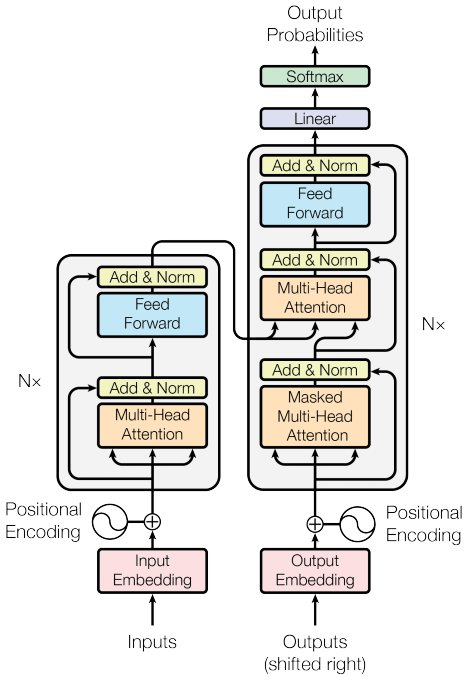
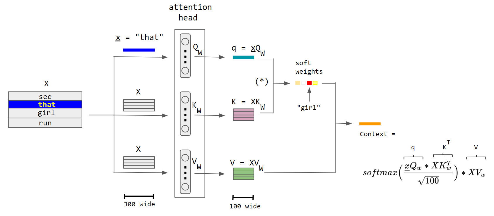

name: 20260126-dl
class: title, middle

## IFT 3710/6759
## Projets (avancés) en apprentissage automatique

#### .gray224[26 janvier 2026 - Session 6]
### .gray224[Revue de l'apprentissage profond]

.smaller[.footer[
Slides: [alexhernandezgarcia.github.io/teaching/mlprojects26/slides/{{ name }}](https://alexhernandezgarcia.github.io/teaching/mlprojects26/slides/{{ name }})
]]

.center[

]

Alex Hernández-García (he/il/él)

.footer[[alexhernandezgarcia.github.io](https://alexhernandezgarcia.github.io/) | [alejandro.hernandez.garcia@umontreal.ca](mailto:alejandro.hernandez.garcia@umontreal.ca)] | [alexhergar.bsky.social](https://bsky.app/profile/alexhergar.bsky.social)  

---

## Format de la séance et objectifs

Comme la session précédente, cette classe est essentiellement un cours théorique, mais qui met l'accent sur les questions et réponses, et sur des aspects pratiques.

L'.highlight1[objectif] est qu’à la fin de la séance : 

* Vous approfondissez votre compréhension des intuitions du deep learning.
* Vous avez un aperçu actualisé des principales méthodes disponibles.
* Vous découvrez des astuces ou des bonnes pratiques en matière de deep learning.
* Vous avez la possibilité de poser des questions.

---

## Deep learning
### Definitions and terminology

We can consider .highlight1[deep learning] a class or family of machine learning methods that compute hierarchical .highlight1[representations] of the inputs. That is, the input data is transformed into new representations, which are the inputs to new representations, and so on. .highlight1[Deep learning is about learning representations].

<figure style="text-align: center">
	
  <figcaption style="text-align: center; font-size: small">Adapted from https://cs231n.github.io</figcaption>
</figure>

???

* Mention the name of ICLR

---

## Deep learning
### Definitions and terminology

The notion of a _network_ and the inspiration by biological _neurons_ yields the term .highlight1[artificial neural networks]. Today, this term is used to refer to both simple MLPs or generally more complex deep learning algorithms.

<figure style="text-align: center">
	
  <figcaption style="text-align: center; font-size: small">Adapted from https://cs231n.github.io</figcaption>
</figure>

--

The simplest possible deep learning algorithm is a .highlight1[multi-layer] perceptron (MLP) .cite[(Rosenblatt, 1958)], a network of perceptrons.

.references[Rosenblatt, F (1958). The Perceptron: a probabilistic model for information storage and organization in the brain. Psychological Review.]

---

## Deep learning
### Why deep?

The _universal approximation theorem_ tells us that a single-layer MLP can approximate anything to arbitrary precision. Why do we need _depth_?

--

Though seemingly simple, the answer to this question is multifaceted. Some insights:

* Deeper MLPs can achieve the same precision with exponentially fewer neurons. 
* Depth allows for compositionality, a key aspect of human cognition.

.smaller[
The .highlight1[principle of compositionality] is the principle that the meaning of a complex expression is determined by the meanings of its constituent expressions and the rules used to combine them. .cite[[(Wikipedia)](https://en.wikipedia.org/wiki/Principle_of_compositionality)]
]

.references[Talk: [Demystifying depth: Principles of learning in deep neural networks](https://neurips.cc/virtual/2025/loc/san-diego/invited-talk/109602), Andrew Saxe at NeurIPS 2025]

---

## Deep learning
### Re-adjusting the promises

> "_\[.highlight1[Hand designing] good feature extractors, .highlight1[engineering skill] and .highlight1[domain expertise]\] .h2[can all be avoided] if good features can be learned automatically using a .h2[general-purpose learning] procedure. .h2[This is the key advantage of deep learning]._"
.right[.cite[LeCun, Bengio and Hinton. (2015)]]

.references[
LeCun, Bengio and Hinton (2015). Deep learning. Nature
]

--

Deep learning is an incredibly powerful tool, but:

* It does not provide a "general-purpose learning procedure", or so do other ML algorithms.
* Hand-design, engineering skill and domain expertise are typically required for successful deep learning applications.

---

## Deep learning
### The actual advantages

Shallow machine learning models have several limitations:

* They struggle with large quantities of data.
* They require "good inputs".

--

Deep learning methods excel in some important aspects:

* Training neural networks .highlight[scales nicely with the amount of data].
* The fundamental ideas of deep learning are .highlight1[extremely flexible]:
* Good new representations can be learnt from a variety of raw inputs.
* Network architectures can be extended and adapted to incorporate a variety of .highlight1[inductive biases].

--

.smaller[.conclusion[The flexibility of deep learning has given rise to a large family of different methods and architectures, which incorporate different inductive biases about the data or tasks.]]

???

Mastering each method requires quite specific engineering skills and domain expertise.

---

count: false
name: title
class: title, middle

## Neural network architectures
### And their inductive biases

.center[]

---

## Convolutional neural networks (CNN)
### Image data

.right-column[
.center[]
<figure style="text-align: center">

  <figcaption style="text-align: center; font-size: small">Source: https://cs231n.github.io</figcaption>
</figure>
]

--

.left-column[
* Inductive bias: group equivariance over space.
* The same convolutional operation is valid on all parts of an image.
* This reduces the number of parameters and speeds up training.
* Internal representations can be thought as _feature maps_ (images).

.center[]
]

???

* Mention the design parameters: kernel size, input channels, output channels, stride, padding, number of layers, etc.

---

## Convolutional neural networks (CNN)
### Popular architectures

* [AlexNet](https://proceedings.neurips.cc/paper/2012/file/c399862d3b9d6b76c8436e924a68c45b-Paper.pdf): relevant for historical reasons.
* [All-CNN](https://arxiv.org/abs/1412.6806): only convolutional layers, high parameter efficiency, great for prototyping.
* [VGG](https://arxiv.org/abs/1409.1556): very popular, but very large.
* [Inception](https://arxiv.org/abs/1512.00567): a convoluted convolutional neural network.
* [ResNet](https://arxiv.org/abs/1512.03385): residual blocks for training very deep networks, still very popular.
* [Wide ResNet](http://www.bmva.org/bmvc/2016/papers/paper087/index.html): rather wide than deep ResNet.
* [DenseNet](https://arxiv.org/abs/1608.06993): dense connection across layers.

.smaller[.footnote[
A current popular modelling choice for image data are [visual transformers (ViT)](https://arxiv.org/abs/2010.11929), which are _not_ convolutional neural networks.
]]

---

## Convolutional neural networks
### Beyond image classification

.context[The ideas of deep learning are extremely flexible]

The same principle of convolutional layers can be applied to any tasks involving images, such as semantic segmentation, depth estimation, or even image-like data, such as sound spectrograms.

However, for good results, each task will require very specific techniques, tricks and engineering.

.center[]

.center[]

---

## Recurrent neural networks (RNN)
### Sequential data

<figure style="text-align: center">

  <figcaption style="text-align: center; font-size: small">Adapted from: https://www.ibm.com/cloud/learn/recurrent-neural-networks</figcaption>
</figure>

--

* Inductive bias: equivariance across _time_.
* Neurons of a recurrent neural network implement recurrent connections.
* Inductive bias: memory matters.
* The values of previous (and later) parts of a sequence influence the current value.

---

## Recurrent neural networks (RNN)
### Variants

Vanilla RNNs are not stable, especially for longer sequences. In practice, more sophisticated versions are used:

.left-column[
.highlight1[Long short-term memory ([LSTM](https://en.wikipedia.org/wiki/Long_short-term_memory))]

.center[]
]

.right-column[
.highlight1[Gated recurrent unit ([GRU](https://en.wikipedia.org/wiki/Gated_recurrent_unit))]

.center[]
]

Both LSTMs and GRUs implement additional gates to regulate the flow of information and let long-term gradients flow unchanged.

???

Mention Transformers

---

## Transformers
### Sequential data

.left-column[
* Inductive bias: nearly _any_ past and future data influence the current input.
* Unlike RNNs, transformers process the whole input at once.
* A mechanism of **attention** learns to determine the importance of each part of the input.
]
.right-column[
.center[]
]

.references[
* [Self-attention](https://arxiv.org/abs/1409.0473)
* [Transformers](https://arxiv.org/abs/1706.03762)
]

---

## Transformers
### The attention mechanism

Transformers rely on an _attention mechanism_ that computes "soft" weights for the embeddings of each input token. An attention head contains three sub-networks representing _Query_ ($Q$), _Key_ ($K$) and _Value_ ($V$). Query and key are combined to obtain the "soft" weights, and the value re-weights the final output.

<figure style="text-align: center">

  <figcaption style="text-align: center; font-size: small">Attention in transformers. Source: Wikipedia (CC BY-SA 4.0)</figcaption>
</figure>

---

## Graph neural networks (GNN)
### Graph data

<figure style="text-align: center">

  <figcaption style="text-align: center; font-size: small">Source: snap-stanford.github.io/cs224w-notes</figcaption>
</figure>

--

* GNNs are designed to process graph structures: complex topological structure and arbitrary size.
* Inductive bias: equivariance across entities and relations.
* Every node in the graph receives information about its neighbours.
* Every node in the graph implements a neural network to represent the structure of its neighbourhood. 
* Graph neural networks may be seen as a generalisation of convolutional networks.

---

name: title
class: title, middle

#### .gray224[26 janvier 2026 - Session 6]
### .gray224[Revue de l'apprentissage profond]

.bigger[.bigger[.highlight1[Pause: 10 minutes]]]

.center[

]

Alex Hernández-García (he/il/él)

.footer[[alexhernandezgarcia.github.io](https://alexhernandezgarcia.github.io/) | [alejandro.hernandez.garcia@umontreal.ca](mailto:alejandro.hernandez.garcia@umontreal.ca)] | [alexhergar.bsky.social](https://bsky.app/profile/alexhergar.bsky.social)  

---

## Stochastic Gradient Descent (SGD)

Together with [backpropagation](https://en.wikipedia.org/wiki/Backpropagation), stochastic gradient descent (SGD) is the workhorse of deep learning: it is the optimisation algorithm that enables learning.

In practice, in deep learning, we typically use a variant of .highlight1[mini-batch stochastic gradient descent], which is a generalisation of _stochastic gradient descent_, which is a particular case of _batch gradient descent_:

$$\theta^{t+1} = \theta^t - \lambda \cdot \nabla J(\theta; x^{i:i+B}, y^{i:i+B})$$

--

Two crucial parameters:

* $\lambda$: learning rate
* $B$: batch size

--

Variants and extensions of SGD: momentum, Nesterov, Adagrad, Adadelta, Adam, RMSProp...

.references[
Ruder, S. (2016). [An overview of gradient descent optimization algorithms](https://arxiv.org/abs/1609.04747). arXiv
]

---

## Deep learning in practice
### Regularisation

Definition from the previous class: any modification applied to a learning algorithm that helps the model generalise better.

With this definition, many techniques can be considered regularisation. It is worth considering a useful distinction:	

* .highlight1[Explicit regularization techniques] are those techniques which reduce the .highlight1[representational capacity] of the model class they are applied on.
* .highlight1[Implicit regularization] is the reduction of the generalization error or overfitting provided by means other than explicit regularization techniques.

.references[
Hernandez-Garcia and König (2018). [Data augmentation instead of explicit regularization](https://arxiv.org/abs/1806.03852). arXiv
]

???

* That is, given a model class H0, for instance a neural network architecture, the introduction of explicit regularization will span a new hypothesis set H1, which is a proper subset of the original set, that is H1 ( H0.
* Elements that provide implicit regularization do not reduce the representational capacity, but may affect the effective capacity of the model: the achievable set of hypotheses given the model, the optimization algorithm, hyperparameters, etc.  

---

## Explicit regularisation
### Dropout and weight decay

.highlight1[Weight decay]:

Weight decay is a classical parameter norm penalty, as used in traditional machine learning algorithms:

$$\hat{J}(\theta; X, y) = J(\theta; X, y) + \lambda\Omega(\theta)$$

.highlight1[Dropout]:

Dropout _turns off_ a random subset of neurons during training in order to prevent overfitting and improve robustness to noise.

--

Both weight decay and dropout are included in a majority of published models (but see next slide!)

---

## Data augmentation

Data augmentation refers to the techniques that synthetically and dynamically expand a data set by applying transformations on the existing examples, thus augmenting the amount and variability of the available data. 

.center[

]

--

Data augmentation is a good example of how the flexibility allows to efficiently incorporate inductive biases and domain knowledge via the data. It provides much larger generalisation gains than explicit regularisation, and often provides better results when used without weight decay and dropout.

.references[
Hernandez-Garcia and König (2018). [Data augmentation instead of explicit regularization](https://arxiv.org/abs/1806.03852). arXiv
]

---

## Monitoring during training

Always, **always** log at least the training and validation loss, and ideally other metrics. Monitoring the learning curves can save a lot of time and provide valuable insights.

.center[]

---

## Interesting topics not covered

* Multi-task learning
* _Self-supervised_ learning
* Reinforcement learning
* Deep active learning
* Transfer learning
* Continual learning
* Deep learning theory
* ...

--

.highlight1[Generative models]: next week! 

---

name: title
class: title, middle

## IFT 3710/6759
## Projets (avancés) en apprentissage automatique

#### .gray224[26 janvier 2026 - Session 6]
### .gray224[Revue de l'apprentissage profond]

.bigger[.bigger[.highlight1[Questions, doubts, concerns, comments?]]]

.center[

]

Alex Hernández-García (he/il/él)

.footer[[alexhernandezgarcia.github.io](https://alexhernandezgarcia.github.io/) | [alejandro.hernandez.garcia@umontreal.ca](mailto:alejandro.hernandez.garcia@umontreal.ca)] | [alexhergar.bsky.social](https://bsky.app/profile/alexhergar.bsky.social)  
