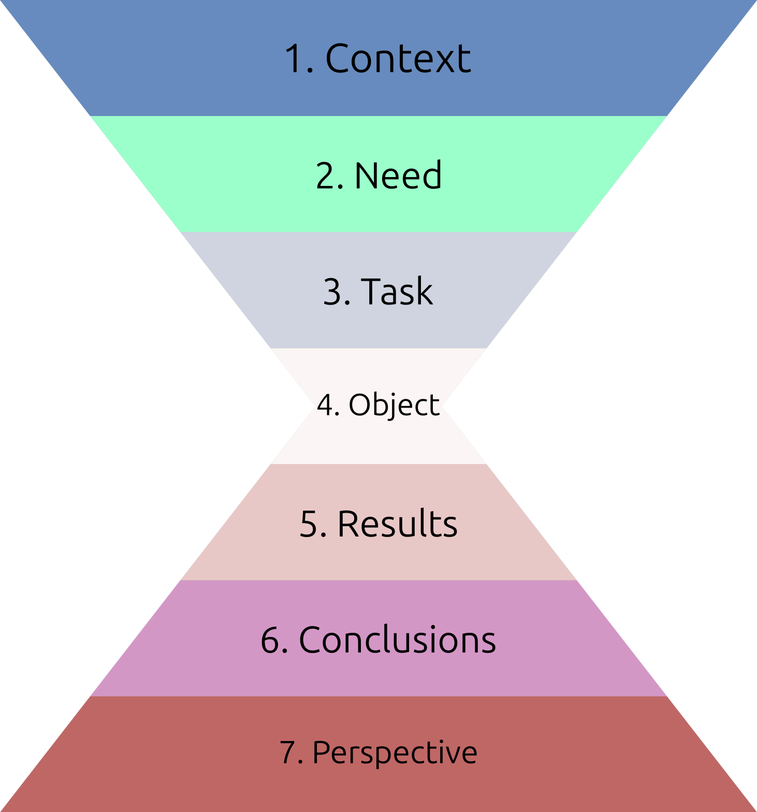
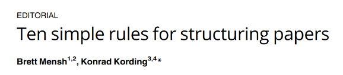
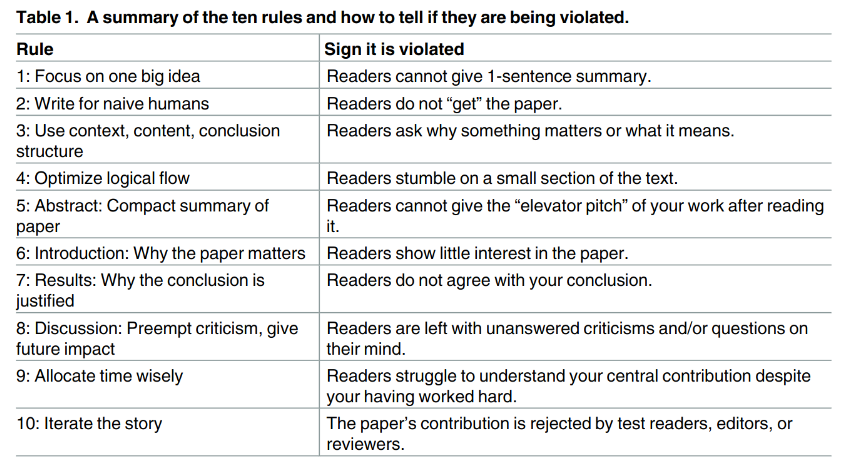

name: 20260316-writing
class: title, middle

## IFT 3710/6759
## Projets (avancés) en apprentissage automatique

#### .gray224[16 mars 2026 - Session 10]
### .gray224[Rédaction scientifique et technique]

.smaller[.footer[
Slides: [alexhernandezgarcia.github.io/teaching/mlprojects26/slides/{{ name }}](https://alexhernandezgarcia.github.io/teaching/mlprojects26/slides/{{ name }})
]]

.center[

]
Alex Hernández-García (he/il/él)

.footer[[alexhernandezgarcia.github.io](https://alexhernandezgarcia.github.io/) | [alejandro.hernandez.garcia@umontreal.ca](mailto:alejandro.hernandez.garcia@umontreal.ca)] | [alexhergar.bsky.social](https://bsky.app/profile/alexhergar.bsky.social)  

???

- The class is going to be a mix of lecture and demonstration

---

## Format de la séance et objectifs

Ce cours sera une brève présentation de concepts clés.

L'.highlight1[objectif] est qu’à la fin de la séance : 

* Vous êtes familier avec les principes d'une rédaction scientifique et technique _efficace_.
* Vous connaissez certains éléments et techniques qui vous aideront à rédiger de bons articles et rapports.
* Vous connaissez certains éléments courants qui nuisent aux objectifs d'un texte scientifique.

---

## Why does _effective_ scientific writing matter?

- Scientific communication is at the core of science: .h1[no communication, no science].
- It is not straightforward to communicate complex ideas, methods or results.
- Our audience is exposed to an overwhelming amount of information despite having limited bandwidth.
- At the end of the semester, you will be evaluated based on your reports and presentations.

.references[
- A list of great resources about writing and presenting in science: [jazlab.org/writing-and-presenting-guides](https://jazlab.org/writing-and-presenting-guides/)
- [How to Write a Scientific Introduction for a Research Paper?](https://science-publisher.org/how-to-write-a-scientific-introduction-for-a-research-paper/)
]

---

## Ideals of scientific writing

- Tell a story with a clear message
- Write simply
- Write clearly
- Show humanity
- Use the fewest words

---

## How to tell a scientific story

.center[]

---

## Ten simple rules for structuring papers

.center[]

.references[
Mensh and Kording (2017). [Ten simple rules for structuring papers](https://journals.plos.org/ploscompbiol/article?id=10.1371/journal.pcbi.1005619). PLOS Computational Biology.
]

---

## Ten simple rules for structuring papers
### 1. Focus your paper on a central contribution

> "Your communication efforts are successful if readers can still describe the main contribution of your paper to their colleagues a year after reading it".

- Ideally, one paper or report should revolve around .h1[a single main message].
- Everything else should serve the main message.

.references[
Mensh and Kording (2017). [Ten simple rules for structuring papers](https://journals.plos.org/ploscompbiol/article?id=10.1371/journal.pcbi.1005619). PLOS Computational Biology.
]

---

## Ten simple rules for structuring papers
### 2. Write for flesh-and-blood human beings who do not know your work

> "Try to think through the paper like a naïve reader who must first be made to care about the problem you are addressing".

- Show humility
- Define technical terms clearly
- Reduce the cognitive load of the reader. Make it easy.

.references[
Mensh and Kording (2017). [Ten simple rules for structuring papers](https://journals.plos.org/ploscompbiol/article?id=10.1371/journal.pcbi.1005619). PLOS Computational Biology.
]

---

## Ten simple rules for structuring papers
### 3. Stick to the context-content-conclusion .h1[(C-C-C)] scheme

- .h2[Context]
- .h2[Content]
- .h2[Conclusion]

.references[
Mensh and Kording (2017). [Ten simple rules for structuring papers](https://journals.plos.org/ploscompbiol/article?id=10.1371/journal.pcbi.1005619). PLOS Computational Biology.
]

--

> "The vast majority of popular (i.e., memorable and re-tellable) stories have a structure with a discernible beginning, a well-defined body, and an end.".

--

.left-column[
- This is based on the principle of repetition:
    1. Tell them what you are going to say
    2. Say it
    3. Tell them what you said
]

--

.right-column[
- The tree components .h1[(C-C-C)] are important:
    - If **context** is missing: "Why was I told that?"
    - If **content** is missing: well...
    - If **conclusion** is missing: "So what?"
]

---

## Ten simple rules for structuring papers
### 4. Optimize your logical flow by avoiding zig-zag and using parallelism

- "Only the central idea of the paper should be touched upon multiple times".
- "Parallel messages should be communicated with parallel form".
- Remember the funnel-inverted funnel structure.

.center[]

.references[
Mensh and Kording (2017). [Ten simple rules for structuring papers](https://journals.plos.org/ploscompbiol/article?id=10.1371/journal.pcbi.1005619). PLOS Computational Biology.
]

---

## Ten simple rules for structuring papers
### 5. Tell a complete story in the abstract

> "The abstract must convey the entire message of the paper effective".

- The abstract, together with the main figures, is probably the most important part of the document.
- Consider writing the abstract first and dedicate a disproportionate amount of time to it.
- Consider following the funnel-inverted funnel structure:
    1. Context: needed to understand the need
    2. Need: ultimate motivation, why?
    3. Task: overall objective
    4. Object: particular objective of the present document
    5. Results: findings of the present document
    6. Conclusions
    7. Perspective

.references[
Mensh and Kording (2017). [Ten simple rules for structuring papers](https://journals.plos.org/ploscompbiol/article?id=10.1371/journal.pcbi.1005619). PLOS Computational Biology.
]

---

## Ten simple rules for structuring papers
### 6. Communicate why the paper matters in the introduction

> "The introduction highlights the gap that exists in current knowledge or methods and why it is important".

- Follow a structure that progressively leads towards the object and conclusions of the present document.
- Follow C-C-C. Everywhere:
    - Whole document
    - Sections
    - Even paragraphs!

.references[
Mensh and Kording (2017). [Ten simple rules for structuring papers](https://journals.plos.org/ploscompbiol/article?id=10.1371/journal.pcbi.1005619). PLOS Computational Biology.
]

---

## Ten simple rules for structuring papers
### 7. Deliver the results as a sequence of statements

- This is to convince the reader that .h1[the central claim is well supported] by either data or logic.
- Support the statements with figures.
- Draw logical connections to the central contribution.

.references[
Mensh and Kording (2017). [Ten simple rules for structuring papers](https://journals.plos.org/ploscompbiol/article?id=10.1371/journal.pcbi.1005619). PLOS Computational Biology.
]

---

## Ten simple rules for structuring papers
### 8. Provide a discussion

- Discuss how the gap was filled.
- Discuss the limitations of the interpretation.
- Discuss the relevance to the field.

.references[
Mensh and Kording (2017). [Ten simple rules for structuring papers](https://journals.plos.org/ploscompbiol/article?id=10.1371/journal.pcbi.1005619). PLOS Computational Biology.
]

---

## Ten simple rules for structuring papers
### 9. Allocate time where it matters: Title, abstract, figures, and outlining

_My own_ recipe:

1. Think of a title
2. Write a solid abstract
3. Design effective figures
4. Write the paper
5. Refine abstract, figures and titles

.references[
Mensh and Kording (2017). [Ten simple rules for structuring papers](https://journals.plos.org/ploscompbiol/article?id=10.1371/journal.pcbi.1005619). PLOS Computational Biology.
]

---

## Ten simple rules for structuring papers
### 10. Get feedback to reduce, reuse, and recycle the story

.center[]

.references[
Mensh and Kording (2017). [Ten simple rules for structuring papers](https://journals.plos.org/ploscompbiol/article?id=10.1371/journal.pcbi.1005619). PLOS Computational Biology.
]

---

name: title
class: title, middle

## IFT 3710/6759
## Projets (avancés) en apprentissage automatique

#### .gray224[16 mars 2026 - Session 10]
### .gray224[Rédaction scientifique et technique]

.bigger[.bigger[.highlight1[Questions, doubts, concerns, comments?]]]

.center[

]
Alex Hernández-García (he/il/él)

.footer[[alexhernandezgarcia.github.io](https://alexhernandezgarcia.github.io/) | [alejandro.hernandez.garcia@umontreal.ca](mailto:alejandro.hernandez.garcia@umontreal.ca)] | [alexhergar.bsky.social](https://bsky.app/profile/alexhergar.bsky.social)  
